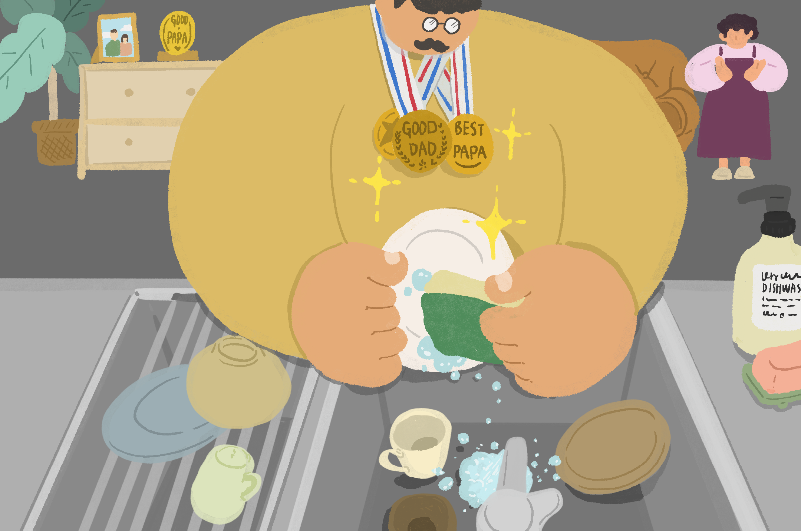
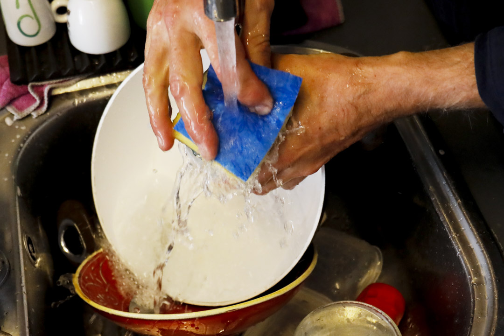
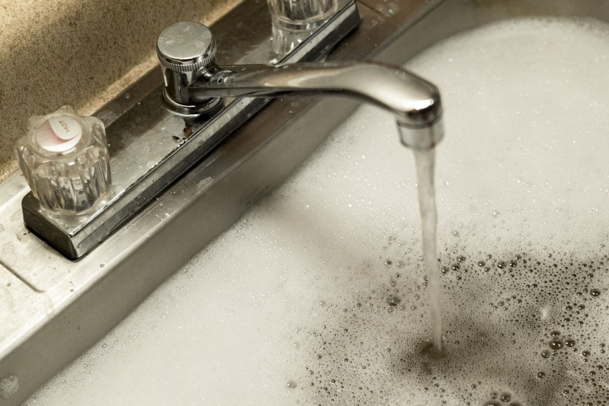
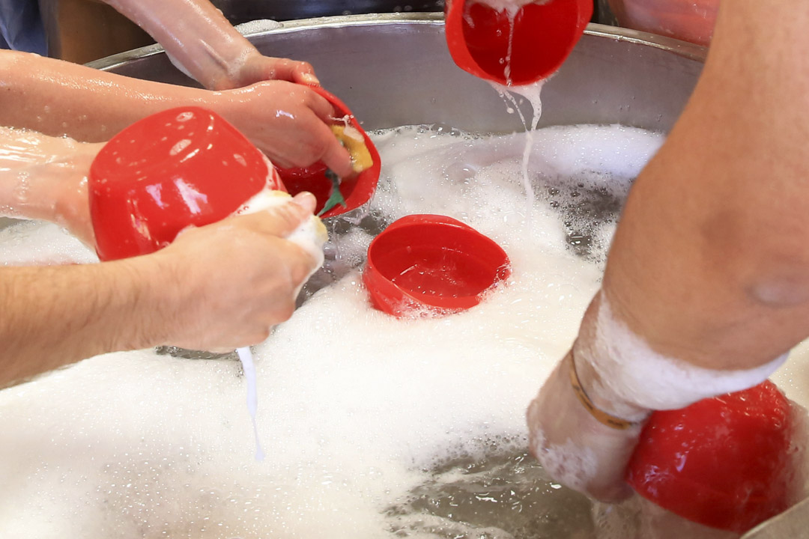

【编者按】在这个性别化的世界，我们已经习得了许多道理，让一些不适得解，也令更多的痼疾更显眼，并且，仍留有许多困惑不得解。

某个下午，端的编辑部偶然发起了“现实生活中，身为女性主义者有何困惑”的讨论，一时出现了许多私人场景——“在男友家吃完饭帮忙洗碗被称赞好媳妇然后内心不爽怎么办？”、“陌生人叫我朱太太我要每个纠正吗？”、“爸爸很厌女，要帮妈妈学习女性主义知识吗？”、“女权主义者结婚是婚驴吗？”、“我怕我妈知道我和妻子一样都是女权主义者”——种种情况下，我们在妥协吗？我们能自洽吗？我们，矛盾吗？

热热闹闹聊了几个小时之后，很多分享无人给出正解，但似乎我们都安心了些。每个人的生活都是独特的，甚至“不足与外人道”，也无法全盘反映更为大写的人性的境况。但那些具体的挣扎，常常都有相似的土壤。我们往往独自在感受的，正是那些会发生在每个人身上的事。

于是，我们想用“女性主义的具体生活”系列，将这些讨论分享给你。你也有过相似经历吗？你的现实生活中，也有许多与性别相关的困惑吗？欢迎留言或来信，我们一同聊聊，女性主义照入现实的时刻。第一篇的第一个困惑，来自编辑 S，她因被婆婆表扬比老公“更会洗碗”，而觉得很不是味儿 ⋯⋯

**S：**

可能有些人会觉得很微不足道吧，但让我对自己的女性身份感到困惑的，很多时就是像洗碗这样的生活小事。有次去老公家吃饭，吃完饭我和老公自告奋勇，说想帮忙他妈妈洗碗（不是帮忙爸妈，只是“妈妈”，毕竟她的角色就在那里了）。先是我老公在洗，我在旁边给他抹干碗碟，但我觉得他好像洗得不太干净，就说了一句：“哎，还是让我来吧。”他妈妈听到了，就随口地－－我相信也是善意地－－说了一句：“男生还是天生不太会做家事啊。”

我当时觉得很不是味儿。我也是在外那几年自己独立生活了，才学会煮饭﹑洗碗，才比较不那么五谷不分；我和老公明明都是同一个年代的“港孩”，小时候都不会被要求做家事的。我甚至到了出外读书初期，还老是要叫外卖，死都不肯下厨，但要懂的时候就会懂了。我老公婚后把洗浴室﹑洗厕所﹑洗衣服﹑洗碗都钻研过了，现在甚么都会。“天生”不会做家事的说法是哪里来的呢？他书念那么多，这么聪明，还学不会洗碗吗？

而且，以前我们还是男女朋友关系的时候，他来我家吃饭，可以吃完饭在沙发上直接睡著，我就不可以在他家吃完饭直接昏迷。不是说人家会说甚么，是连自己都知道不可以，毕竟有很多事情就是他可以我不可以。他不做家事是因为不擅长，我不做家事就是懒－－而我妈也从来没有期望我男友会在吃完饭后去帮忙她洗碗。现在他们看到我老公做家事，还是会夸他“真是好到不得了”，还有觉得我“甚么都不干”（当然我也很想知道，如果我老公甚么都不干，他们是不是真会觉得很合理）。

反正当下我也没有跟他妈妈说甚么，只是唯唯诺诺的把话题带过。后来想想就记起，小时候一家人吃完饭，爸爸﹑爷爷和奶奶（那时还跟我们一起住）总是坐在沙发上看电视聊天，我们小孩各自干自己的事，就只有我妈收拾桌面，洗六﹑七个人的锅子和盘子。虽然这个说法对我爸好像有些抱歉，但我很小的时候就决定，我长大了一定不要找个像我爸这样的男人。而我确实也找到个能分担家事，不把家事视为女性范畴的男人了，但身边人对我们二人关系的那些假设和期望，还是让人很困扰（和困惑）。

一个人在厨房洗碗。摄：Cezaro De Luca/Europa Press via Getty Images

**I：**

做饭的可能有男有女，但洗碗的多数是女性。这是和几位女性朋友聊天时得出的不严谨结论。

每次和朋友聚餐，我都会不自觉代入洗碗、收拾残局的角色，潜意识认为这是礼数；若在自己家，则习惯性扮演照料者，却又很不喜欢被调侃“贤惠勤劳”或“贤妻良母”，好像这样的形容带有某种羞耻妥协的印记，可行动上又无法容忍一桌狼藉摆在眼前。当餐桌、灶台、洗碗池都收拾停当，我才能坐下来“复盘”自己的行为轨迹是如何被建构的。

我成长的家教其实算不上非常严苛，但除了撒谎等原则性问题，父母还有一些对我频繁唠叨的要求，例如不要随手放东西、房间不能太凌乱、聚餐时要帮忙收拾等。只是我后来才意识到，一些礼数的规训是有性别的，我和我的妹妹们往往会被期待安静、整洁、懂得照料家务事，但他们从不要求我的表哥堂弟去洗碗，就好像他们不会做，好像杂乱玩乐是男孩的天性，而女孩要“生来爱干净”，生来就会做这些收整、打理等细致的事。记得某次家庭聚餐，我在回信息，没有理会餐桌的狼藉，是妹妹们帮忙收拾的，有儿子的亲戚便调侃我作为长姐却懒惰，“眼里没活”、“嫁不出去”。

我家里父母是轮替洗碗的，甚至因为妈妈不时要加班，所以爸爸洗碗更多。即使如此，我爸还是时常会被妈妈嫌弃洗碗没有擦拭灶台和洗碗池，无意间，我也形成了每个细节都要井井有条的印象。但我家里男性照料家务更多的样子，若转向和外部交流的聚餐场合，角色也会立刻调转。某年春节，妈妈高中同学在一个休假的空厂房聚会，几家人每家带 2 个菜品，到场后再集体包饺子。做饭时除了小朋友，所有人都在找到自己的位置忙前忙后，但饭后，男人们就开始三五成群地打牌打麻将，收拾十几人的狼藉桌面和洗碗都是女人们的事。

记得那个厂房里没有集体供暖，只能靠炉火和电暖气，每个人都裹著羽绒衣，有的阿姨那天还是经期。男人们烧了热水，灌满洗碗用的大盆，便心安理得地休息了，好像已经做到了“体贴”的位置，有试图帮手的男人还会被其他人拉住——“交给她们吧，她们洗得干净”，甚至会有打趣的声音出现：“这么心疼老婆啊！”

成长过程中大人们类似的聚餐都是女人洗碗，而少数会做饭的男人还会被贴上勋章，女人们对菜品的评价会变成“不懂美食”，菜品背后的文化和复杂的纹理是男人们构建的，他们只享受少量做饭的快乐，和偶尔沾染人间烟火的掌声。

看似是有点刻薄，但在追问为何做饭有男有女、洗碗多是女性时，我忽然意识到，普遍的家庭分工和社会分工是如此相似，如同秘书、清洁工多性别为女一样，家庭里，女性也往往承担著最琐碎、细节的劳动。料理往往带有厨师的个人特质，做饭的人可以享受人们对食物赞美的价值反馈，但洗碗是简单、重复、没有创造力的，洗碗的人常常在饭后交谈不被看见的盲区。

以前总不理解为何妈妈每次聚餐洗碗的时候都要叫我去聊天，现在会对每个在我洗碗时默默站在门口陪伴的朋友多一分喜爱。

**Y：**

和女友一起住之后，我们开始学做饭，我因为擅长而扮演做饭的角色（实际上这是存疑的，女友也做得很好吃，但角色的分配经常很微妙），女友则负责洗碗。这个分配看似很公平，但慢慢就出现一些围绕家务而起的摩擦。我在家工作，女友要去办公室，有时她会埋怨我做饭晚，她下班回来，我才开始洗菜、切肉、热锅，一顿中餐做下来，一个小时都算快，吃完她再洗碗，一个晚上就过去了，对上班族极为不友好。我也有申辩的理由——居家工作不是没工作，不是想早点脱身去做饭就可以，当然更重要的理由是拖拉，这个没有说出口。

由洗碗吵起来，日常生活掰碎，一字排开：洗衣服、晾衣服、叠衣服、拖地、刷厕所、整理桌子、换床单（这是一件女友不说我不会意识到存在的家务）、购买纸巾、收拾行李箱（旅行回来有一个星期它都会躺在客厅），就变成谁做得多谁做得少，谁思虑得多谁思虑得少（女友教我思虑哪里有活要做也是一种劳动）的问题，大家都自觉委屈。后来我们就很少做饭了，也约定了一些相对公平的分工方式，从女友的角度看，关系也因此不那么紧张。

再后来，我开始希望能做多一点饭，为了吃得好一点。做完饭，又有谁去洗碗的问题。我领悟到一个道理，因为是我想做饭，而不是女友要求我做饭，她想要的是更多的下班后的时间和更融洽的关系，她也不喜欢洗碗，所以配合我吃自己做的饭，反而对她是一个负担，因此更公平的做法是我应该自己把碗洗了。实践了这个道理，我也吃到饭了，洗碗也不成为一个影响关系的问题。有时女友吃完也会洗碗，我突然免去一次洗碗，也很开心。分工的公平在这个情况不是那么重要，但确实也只在这一具体的关系中成立，难以和外人讲清楚。

有一次女友在我家住了两天，爸妈不在，但姐姐和姐夫们也过来了，对我们来说，那个场合有点临时和随意，因为家长不在。晚餐叫外卖，但用了一些碗筷，吃完饭，我突然意识到出现某种奇怪的氛围——有两个问题在空气中浮现，一是谁去洗碗，二是不同的人去洗碗会面临不同的评判压力。比如说，姐夫们当然不会去洗（父权问题按下不表），姐姐们也不会去洗因为会自觉是客人且比较年长，如果她们去洗，自己会感觉有一种社会舆论在评价她们“太卑微”。那就变成我去洗还是女友去洗，如果只有我们俩人，当然谁洗都不是太原则性的问题。但在那个情况下，我意识到，如果女友去洗，大概会得到以姐姐姐夫们为代表的社会舆论的“好评”（某种乖巧的性格？），但女友会对此很愤怒（她也意识到了这种社会压力的存在，因此她非常淡然地把碗给了我）。最终当然是我去洗，而我顺理成章地得到了社会舆论的“差评”（太娇纵女友？）。

洗碗中的水槽，慢慢地装满了水。摄：Brad Vest/Getty Images

Then what?

**Lu：**

我必须承认，我有时会将计就计，顺从于那些假设和期望。

生活在异国他乡久了，我会下意识地把自己的生活“翻译”成能让我妈妈更好懂的模样。当她问我与另一半的生活如何时，我会给出具体的例子：“我们很好啊，你看我从来不洗碗，家里都是他洗碗的！”听到这话妈妈会满意笑笑，不错，女婿肯“帮衬屋里”。

可这种时候，我得咽下许多不安；家长里短就那些事，妈妈可能很快会开始抱怨一同生活的嫂嫂，“家里什么都不动手，什么事情都指望你哥哥。”——女婿肯洗碗是好事，儿子常洗碗则不行；女儿不用洗碗是幸事，媳妇不愿洗碗，则是丑事。

妈妈总是质朴希望儿女安好，她的许多双重标准或矛盾之处，我也早就一笑而过。记得七八岁时，她会念说哥哥要讨有钱老婆，说妹妹要嫁有钱老公；没人会在一个小农村聊什么女性主义，但年幼的我仍会笑著反对，“这也太矛盾了吧！”可能本就不必什么主义教导，每个女孩，都是在一堆堆的矛盾里成长起来的。

其实我不记得何时开始不洗碗了。吃饱喝足的时候，可以不必考虑满桌狼藉实在太愉悦——我常常提著剩下的酒杯在沙发躺平，等另一半洗碗、整理厨房。久了也许就都惯了；有一次我没多想顺手洗了碗，收拾了洗碗机，擦干净灶台，送了客人回来的他惊讶不已，说“呀，我竟然好像忘记了你其实是会洗碗的”，我大笑；他又说，“太开心了，这就跟收到了一份生日礼物一样。”

我们没有孩子，甚至没有宠物，两个人的生活，家务事其实很少。但偶尔他会很认真问：“你仔细想一想，如今我们的家务分配，你会觉得做太多吗？”我贪食中餐就自己做饭，又喜欢把洗衣机里的干净衣服晾起来，也爱更换床单，或是用吸尘机的噪音盖过脑子里的压力 ⋯⋯ 仔细想完会觉得有点内疚，我只捡了爱干的；于是我会在做饭时，顺手收拾掉备厨时的碗筷，也偶尔半夜去丢垃圾，当作送一份“生日礼物”。

是不是应该算清楚呢？最近听说了一个 app，叫做“Choreful”——挪威一个程序员丈夫在一场关于家务的吵架后写的。这位丈夫不常做饭，有一天下厨了，就想著妻子可以洗碗；可是累了一天的妻子吃完饭就拿了本书坐在了沙发上——他们吵了一架，不知道吵架谁占上风，但显然写代码很顺手的丈夫回头就去做了一个 app，他要算一算到底谁做更多的家务 ⋯⋯ 很快，很多朋友们便来问他要一份拷贝，在男女家务分工号称世界最公平的挪威，他们也想仔细算一算。

在我的私人世界，很幸运，洗碗不那么“gendered”。在亲友家中聚餐，走前帮助收拾是众人都会做的礼貌之举，不会 single out 女性朋友。只是洗碗这活也落入等级——也贪食我手艺的客人会恭维厨艺，但不会有人指著碗筷说“这洗得可真干净！”这样想想又觉得很庆幸，不必与父母辈一起生活，我敢肯定，若我妈妈与我们同住，她一定不会“让”女婿洗碗。

看不到“琐事”里的等级，又看不到这样的“等级”是怎样应用到其他以性别、种族、亲疏等等排列的“身分”等级上，而其中又有哪里矛盾重重、甚至充斥著（象征）暴力的话，“洗碗性别为女”这种“小事”，一定还会延续非常久。

**E：**

可我是喜欢做饭同时喜欢洗碗的女生，这喜好大部分是从我爸身上习得的。我爸是宠妻宠女狂魔，做饭洗碗常常是他一个人的工作。不过我没完全觉得这是值得骄傲的事情，一来这是他擅长和喜欢的事，二来这里面是不是有点可疑的照顾者心态，三是客观上确实形成家庭内部分工的不平等（只不过换了性别）。而单方面长年付出一定会埋下情绪上的隐藏炸弹，有利家庭不和谐。

好些东西是不敢交给机器的，比如羊毛衣物不能就丢给洗衣机，漂亮精致的杯盏我也不太敢交给洗碗机。这些家电 default 是完成最基本的清洁，把人从劳动中解放出来——但是谁让劳动变成了一件“麻烦事”呢？像上面大家说的，我们需要打破设定好了的劳动秩序，而机器如果只是作为维护和优化这种秩序的存在，也只是一个可怕的帮凶。

我们说不平等的时候，常常说的是加压在某一种性别上的固著的秩序，讲得不那么多的是，秩序逻辑在不同性别身上的演绎。

第一种，比如社会上说到洗碗、扫地，几乎默认了它们是毫无创造性的重复劳动，在价值上是被贬低的、可（被洗碗机、吸尘器）替代的。“洗碗、扫地是属于女性的劳动”，或“女性应该负责低效劳动”。这种在性别与价值之间建立起来的分化秩序，显然不女权。

我无限支持打破这种分化秩序，和朋友们聚会的时候，男生女生都往往有意识要叫男生干活，备菜也好、盛饭也好、洗碗也好，总之不能让他们做跷脚大爷。确实有男生做不好这些事情，因为家庭教育、社会教育都没教他们做好劳动是怎么回事。没关系，但要有主动承担的意识。大不了把瓷碗都收起来，换成胶的。

厨房外正发生山火。摄：Jon Nazca/Reuters/达志影像

第二种，比如我爸，似乎成为了我家家务承担的叙事者——我做了家里七八十的活——隐藏话语是，我为这个家做了这么多，是不是也该有点话事权。事情到这里就变味了，本来是对劳动的喜爱，后来变成了家里权力的争夺。而当他包揽了这些家务的时候，变相我妈和我常常成了跷脚大娘，且因为男人“有力气”而更轻视了这些家务的繁重和价值，或觉得“脏乱差”的家务都该我爸去做。

只不过我爸处境好的地方是，对于大部分家庭主妇来说，无论她们做了多少工作，都不代表会有相应的影响家庭决策的权力和位置。何况，我爸并不是一个家庭主夫，他有自己的工作，而影响家庭地位的因素是很多的，他并没有占下风。

《逃耻》计算家务劳动的价值，应该没人不知道吧，做家务是非常有价值（valuable）和值钱（costing）的工作，还有一堆精神消耗（consuming）。所以不管是谁在洗碗扫地，我觉得都要首先肯定这个工作是高价值的。

我还想说的一个重点是，秩序是一种设定，而劳动“辛苦、无聊”又是另一种设定。

我喜欢做饭和洗碗，恰恰是因为两种劳动带给我的是不同的情绪回报，前者 creative 一点，后者 peaceful 一点。必须严肃正名一下，洗碗是多好的工作啊！做饭其实很累啊，尤其是一堆朋友来的话，你要想菜单，要早早买菜，要分配时间，可不能前面的菜都凉了后面的菜还没好——这意味著客人饿了而且自己也没得吃（全程为人做饭 for what！）。洗碗就好多了，大部分情况下不需要用脑子，水声潺潺，油君退散，一切经过自己的手回归整洁的秩序，多治愈和有安全感呀！

洗碗的工序，包括清理食物残余，用好的清洁用品，分门别类。我特别怕看到水槽里乌拉拉一堆食物残余的样子，在碗放入水池之前，固体、液体的食物残余都应该先被处理好了，有的可以直接遗弃，有的要回收，有的要处理一下才能丢弃（比如火锅油），不然你家的下水管道安全不保！而如果是喜爱器皿的人，每个与食物相搭配的器物都是精挑细选过的、有设计的，本身就是艺术品，爱惜都来不及喔，哪舍得让手笨脚笨的人去帮忙洗刷呢。

围绕洗碗，当然也是可以发展出一大堆生活价值观和品味。夏天水要凉快冬天水要温暖吧，洗碗布要好看吧，铁锅要用温和的刷具，清洁剂不能伤手吧，洗好的碗碟摆放有技巧吧 ⋯⋯ 竹炭洗碗布可以去掉大部分油渍，那又可以少用点清洁剂，有机洗碗皂对环境友好，香气也怡人 ⋯⋯ 我家厨房正对著一片土地和树，想想这生态，洗碗精就会放得少一点。

很多人觉得做饭是特别有操控感的事，但一边做饭一边维持厨房的清洁，也是一个特别有挑战性的事情。怎样让一个厨房在（顺利）做完饭后不是呈现出一个打了仗的样子，我想大家都深有体会吧，也是需要不少精确计算的呢。

还有，做饭、洗碗常常被视为两个分工，但其实它们都可以是非常好玩的集体劳动——如果你做过上海菜，我的天，你一定明白一个主厨需要配四五个下手，择菜尖尖的、摘蚕豆壳的、塞肉馅的、切片的 ⋯⋯ 一堆精巧工序，一个人绝对不可能完成，所以每个参与吃饭的人都该主动揽活，而在劳动的过程中也去了解一个菜系、一个好吃的东西是怎样被制作出来的。洗碗也可以把工序都拆解给不同的人，大家热闹地说会儿话，这时反而可以专注在一些零碎话题上，水声做背景音，聊著聊著就放松了，是可以开心的事情。

说白了，趣味和创意都是自己的，秩序是外界加进来的。我们反抗秩序，同时享受乐趣。最好多点人意识到这些乐趣，都可以是打破秩序的入口。

最后，这里有两份“打破秩序”的失败尝试

**Y：**

我在潮汕家庭长大，作为儿子，洗碗这件事从小在我的意识里就是不存在的，或者说看不见。一顿典型的潮汕晚餐，爸爸负责指导，把好吃的东西挑给不同的小孩（当然会把最好的夹给儿子），菜最终都要吃完，但一定要在吃的时候不断进行分配，这里的传统文化就是扮演统治者。爸爸还会评价这道菜做得好不好，妈妈则对自己的厨艺进行辩解。吃完饭以后，爸爸会去泡茶，妈妈和女儿开始洗碗，儿子则可以消失。

消失是我对家务最初的认识。自己煮完面，把碗和锅丢在水槽，过几个小时垃圾就会消失，碗会变干净，回到碗柜里。洗完澡衣服丢在脏衣篓，第二天干净的衣服就会叠好在衣柜。妈妈和女儿隐形劳动的另一面，是爸爸和儿子看不见家务，因此也并不会承认家务劳动的价值，何况谈论（物质或精神上的）报酬。

直到我把爸爸作为父权文化和专制文化的代言人进行反抗，并因青春期而对社会产生分析性的冲动时，才开始审视家庭里的权力关系，这时过去隐形的家务才浮现，也才十分不满于爸爸重男轻女、不做家务等等父权遗毒。青春期立刻遭遇的不自洽是“那你自己呢”，然后才开始主动洗碗、拖地。

一开始当然做得很差，而且很多时刻确实觉得自己“不会”。完全“会”洗碗是一个持续了十几年的过程，小时候有时被要求洗碗，只能把碗都洗干净见缝插针地放在洗碗池旁边，锅则根本“不会”洗，于是还需要妈妈来收尾。后来会洗锅了，怎么倒扣摆放碗也“不会”，还是需要妈妈来收尾。最让她难以忍受（且经常说还是我来吧）的是我的洗碗流程，我是一个碗一个碗洗，每个碗用一次洗洁精，再冲干净。一趟洗下来，不仅自己精疲力尽，等著给厨房收尾的妈妈也精疲力尽，她是真心觉得不如自己来。直到自己出来住以后，才发现洗碗只是收拾厨房的大工程中的一部分，还要把厨余倒在垃圾桶（洗碗池消化不了它们！），擦灶台，没吃完的食物封存冷冻好，还要把锅碗瓢盆和各种铲子勺子按部就班摆好，要拖厨房的地板，要防蟑螂。尽管学会了这些，再回到妈妈家，又非常理所当然地“不会”了起来。

也不断会有长辈叫我不要做“这些事”，有一次和女友去她老家，一大群亲戚在，一个阿姨叫我和女友帮忙剥虾，我就坐在地上开始帮忙。剥著剥著一个叔叔走过来说：“你的手是要拿笔的，不要做这些。”要我去客厅加入男人们喝茶。

“娘相”是我们那个社会对男人最羞辱性的称呼，意思是像女人一样。这个社会对男人的认识和期待，是不要纠缠在女人做的事情里，男人不需要在家洒扫应对，如果主动做这些，反而会遭遇阻力，因为男人应该从家里消失，去外面赚钱。但我们那个社会又有大量没有工作、游手好闲的男人，他们也被认为应该从家里消失，去外面寻找赚钱的机会，或者假装扮演赚钱的角色。而家庭是虚位以待，等待这个消失的男人回来统治的，他一旦回来就变成饭桌的中心。这个中心在喝功夫茶的茶几上，男孩从小在家只被要求学会一种家务——泡功夫茶。泡茶意味著坐在客厅的中心位置，学会烧水，放茶叶，洗茶杯，锻炼出一只耐受热水的手，长幼有序地招呼客人。我从小被教导，不会泡茶就娶不到老婆，但现在显然，不会洗碗才是问题所在。

我记得小学考试老师会要求我们带试卷回家给家长签名（表明家长知道你的成绩），爸爸出去赚钱常年消失，我就叫妈妈签名，她每次都会签爸爸的名字，因为她认为家长即“一家之长”，即爸爸。最近我去堂叔家吃晚饭，已经 60 岁的堂叔跟我说，“我还能喝几杯，但我喝到这里就不喝了，因为我是一家之长，我不能喝醉。”过一会他就去睡觉了，铁马冰河入梦来。我内心十分同情，我们这个社会的男人，无论月薪入息几千，都能在家庭聚会的饭桌上圆梦。

一群年轻人在洗碗。摄：Godong/Universal Images Group via Getty Images

**Lin：**

我曾经想打破我们家一直我妈洗碗的秩序，但完败。

我妈洗好碗之后还要拖地、倒垃圾。绝大部分琐碎的家务都是她做，我爸只负责炒菜（他会做的菜比较多），偶尔被我妈叫去楼下倒垃圾。我爸一般是最先吃完晚饭的，吃好就去沙发上躺着看电视。偶尔有几次，我妈吃完饭比较累，我爸就主动去洗碗，但我妈会说：“你别洗，放下，我自己来就好。”我不知道她为什么不肯让我爸去洗，是怕我爸太累吗，还是她把这件事视为自己的义务，或是觉得我爸洗不干净、不擦灶台，最后还需要她来兜底？我没有问过她。不过，我倒是常听到她在厨房里大声喊：“这锅你又没洗！”我爸则回应：“油锅不用洗。”

我妈因为做太多家务，再加上年纪也大了，她前几个月出现过腰酸、手酸，在手上贴了膏药。我很心疼她，在一个家务劳动被视为非生产性劳动、无偿劳动的时代，我真的很难说服自己，我妈做这些是值得的，虽然我知道它们是有价值的。

之前在外读书时，我就建议家里买个洗碗机。我妈有很多顾虑，譬如洗不干净、怎么安装、怎么排水，在我反复解释下，她有些心动了。在她主动向我爸提议买洗碗机的时候，我爸的态度是：不需要洗碗机的，没什么用。我心想，又不是你洗，当然不需要了。最后还是买了。

我今年年初回家后发现，洗碗机变成了摆设，我妈并不去用它。她解释，洗碗机容量小，锅根本放不进去，只能手洗，那不如全部都手洗了。后来又加上了几条不用的理由：费电费水。为了帮我妈减轻负担，也让我爸（作为男的）帮忙洗碗，我在一次饭桌上提议，我们家四人轮流洗碗，一人洗一天。当然，每次轮到我和我妹负责洗碗的那些天，就是洗碗机启动的日子。

有次我妹犯懒，不想洗碗，我妈打算帮她洗。我提出来让我妹付钱给我妈，一次 150 元。我想，至少得让这个隐形的劳动有价值吧，不能再重新回到以前由我妈“义务洗碗”的阶段。我爸很不喜欢这样的模式，他觉得我们这是“斤斤计较”，连洗碗都要用钱来衡量。我妹不肯花她的零花钱，所以那晚还是她去洗。后来有次我也犯懒了，我真的好讨厌洗碗。我妈偷偷和我说，她来帮我洗。我说好，又给她转了 150 元的微信红包。直到 24 小时后红包因过期自动退回账户，我才发现我妈没有收下。

这个实践持续的时间并不长久，大概就三四个周期。因为后来我妈肠胃不舒服住院了几天，她回家后，自然不需要洗碗。我和我妹也推给我爸去洗，轮流计划就这样被打乱了。过段时间，我妈又很顺滑地重新回到了“洗碗”的角色。

自从我们一家跟随我爸的工作搬到另一个城市后，我妈就变成了家庭主妇，已经有十二年了。她大部分时间都待在家里，包揽绝大部分家务活。她并不是不能出去工作，只是我爸总对她说“不需要”。有时在一些饭局上，她话里话外也挺骄傲自己的“贤内助”身份。

但其实，我妈内心一直都存在着“弱者”的自觉和自卑。过去几年，她每次在家庭聚会、朋友聚会上喝醉，回家后都会持续自言自语，念叨“我好没用”、“我没能出去工作”，她觉得自己没能替我爸分忧，替家庭多挣一些收入。家庭主妇这个身份，因为无法产生金钱这样看得见的价值，她对此耿耿于怀，也非常嫌弃自己。不过，这种内心的声音只有在她喝醉的时候才会显露出来。一旦到了第二天早上，她又重新进入了往日的“正常”秩序。

_Source_ [theinitium.com](https://theinitium.com/article/20221029-fenimism-in-real-life-who-does-the-dish/)
