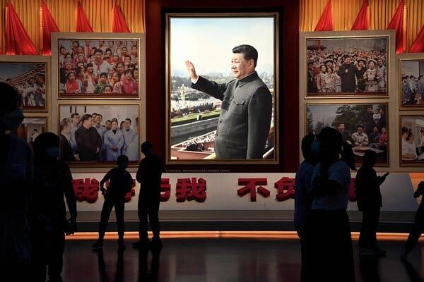
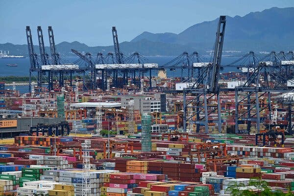
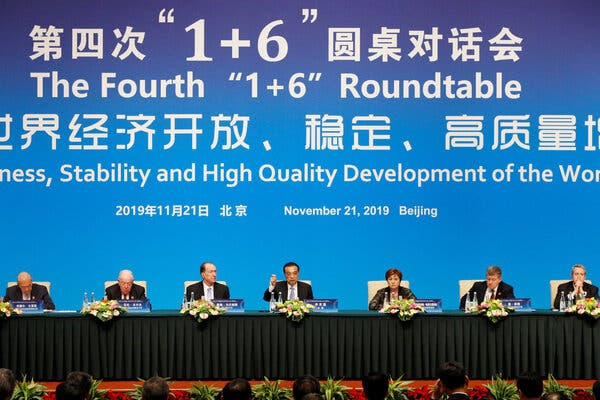
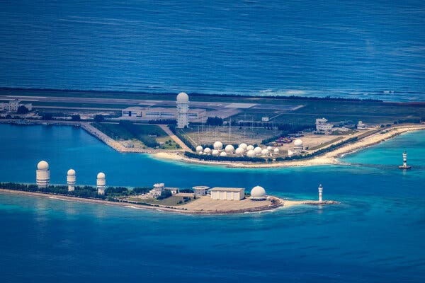

Thomas L. Friedman

## 中国如何失去美国

Nov. 1, 2022

Credit...Noel Celis/Agence France-Presse — Getty Images

When future historians look back on 2022, they will have a lot to choose from when they ask the question: What was the most important thing that happened that year? Was it Brexit, Chexit, Ruxit or Trumpit?

当未来的历史学家回顾 2022 年时，当他们提出这个问题时，他们将有很多选择：那一年发生的最重要的事情是什么？ 是 Brexit、Chexit、Ruxit 还是 Trumpit？

Was it the meltdown of the world’s [sixth](https://www.google.com/search?rlz=1C5CHFA_enUS853US853&sxsrf=ALiCzsY4nRah2Z6gHTMTvX5Lcb26lr01Dw:1667072305889&q=Which+is+the+6th+largest+GDP+in+the+world%3F&sa=X&ved=2ahUKEwjNxO2kmIb7AhVRF1kFHT5sATIQzmd6BAg-EAU&biw=2560&bih=1219&dpr=2)\-largest economy, Britain, fueled in part by its reckless 2020 exit from the European Union? Was it the demented attempt by Vladimir Putin to wipe Ukraine off the map, which has decoupled Russia from the West — what I call Ruxit — creating havoc with worldwide energy and food markets? Was it the near-total infection of the G.O.P. with Donald Trump’s Big Lie that the 2020 election was stolen — Trumpit — which is eroding our democracy’s most cherished asset: our ability to peacefully and legitimately transfer power?

是世界 [第六](https://www.google.com/search?rlz=1C5CHFA_enUS853US853&sxsrf=ALiCzsY4nRah2Z6gHTMTvX5Lcb26lr01Dw:1667072305889&q=Which+is+the+6th+largest+GDP+in+the+world%3F&sa=X&ved=2ahUKEwjNxO2kmIb7AhVRF1kFHT5sATIQzmd6BAg-EAU&biw=2560&bih=1219&dpr=2) 大经济体英国的崩溃，部分原因是它在 2020 年鲁莽地退出欧盟吗？ 是不是弗拉基米尔·普京 (Vladimir Putin) 疯狂地试图将乌克兰从地图上抹去，从而使俄罗斯与西方脱钩——我称之为 Ruxit——对全球能源和食品市场造成了严重破坏？ 2020 年大选被窃取——Trumpit——是不是共和党几乎完全感染了唐纳德·特朗普的弥天大谎，这正在侵蚀我们民主最宝贵的资产：我们和平合法地移交权力的能力？

Or was it China’s drive under President Xi Jinping for [Chexit](https://www.scmp.com/comment/opinion/article/3022121/chexit-china-might-just-exit-multilateral-order-if-us-pushes-it-too) — an end to four decades of steady integration of China’s economy with the West, an end symbolized by the abbreviation [popularized](https://www.nytimes.com/2019/05/17/business/china-trade-influence.html) by my colleague in Beijing Keith Bradsher to describe where Western multinationals today think about putting their next factory: “A.B.C. — Anywhere But China.”

或者是中国在习近平主席领导下推动的中国 [退出](https://www.scmp.com/comment/opinion/article/3022121/chexit-china-might-just-exit-multilateral-order-if-us-pushes-it-too) ——结束了中国经济与西方长达 40 年的稳步融合， [地点](https://www.nytimes.com/2019/05/17/business/china-trade-influence.html) 我在北京的同事 Keith Bradsher 所使用的缩写象征着这一终结，它用来描述当今西方跨国公司考虑的投资 他们的下一家工厂：“ABC——除中国以外的任何地方。”

It’s a tough call. And just listing them all together only tells you what a hinge of history 2022 has become. But my vote goes to Chexit.

这是一个艰难的决定。 将它们全部列出来只会告诉您 2022 年已成为历史的转折点。 但我投票给 Chexit。

We’ve had four decades of U.S.-China economic integration that hugely benefited American consumers. It led to new export opportunities for some Americans and unemployment for others, depending on the industry they were in. It helped raise [hundreds of millions](https://www.worldbank.org/en/news/press-release/2022/04/01/lifting-800-million-people-out-of-poverty-new-report-looks-at-lessons-from-china-s-experience#:~:text=BEIJING%2C%20April%201%2C%202022%E2%80%94,by%20close%20to%20800%20million.) of Chinese out of extreme poverty. It tamped down inflation and worked to prevent any great power wars.

我们经历了四年的美中经济一体化，让美国消费者受益匪浅。 它为一些美国人带来了新的出口机会，也为其他人带来了失业机会，这取决于他们所处的行业。它帮助 [数亿](https://www.worldbank.org/en/news/press-release/2022/04/01/lifting-800-million-people-out-of-poverty-new-report-looks-at-lessons-from-china-s-experience#:~:text=BEIJING%2C%20April%201%2C%202022%E2%80%94,by%20close%20to%20800%20million.) 中国人摆脱了极端贫困。 它抑制了通货膨胀，并努力防止任何大国战争。

On the whole, we will miss that era now that it’s gone, because our world will be less prosperous, less integrated and less geopolitically stable.

总的来说，我们会怀念那个时代，因为它已经过去了，因为我们的世界将不那么繁荣，不那么一体化，地缘政治也不那么稳定。

Image

Credit...Jade Gao/Agence France-Presse — Getty Images

But gone it is.

但它已经过去了。

As The New Yorker’s China expert, Evan Osnos, [pointed out](https://www.newyorker.com/magazine/2022/10/31/xi-jinpings-historic-bid-at-the-communist-party-congress) in October: “In 2012, 40 percent of Americans had an unfavorable view of China; today, more than 80 percent do, according to the Pew Research Center.”

正如《纽约客》的中国问题专家埃文·奥斯诺斯 (Evan Osnos) [在 10 月份指出的那样](https://www.newyorker.com/magazine/2022/10/31/xi-jinpings-historic-bid-at-the-communist-party-congress) ：“2012 年，40% 的美国人对中国持负面看法； 根据皮尤研究中心的数据，今天，超过 80% 的人这样做了。”

If China had a democratic government, someone there right now would surely be demanding to know, “How did we lose America?”

如果中国有一个民主政府，现在那里的人肯定会要求知道，“我们是如何失去美国的？”

America is not blameless in the erosion of this relationship. Since World War II, we had never had a geopolitical rival that was our near-peer both economically and militarily*.* We’ve never been comfortable with Beijing’s rising challenge, especially because China was not propelled by oil but by its savings, hard work and homework — i.e., a willingness to sacrifice to achieve national greatness, with a strong emphasis on education and science. _That used to be us._

美国在破坏这种关系方面并非无可指责。 自二战以来，我们从未有过在经济和军事上与我们势均力敌的地缘政治对手 _。_ 我们从未对北京面临的日益严峻的挑战感到满意，尤其是因为推动中国发展的不是石油，而是储蓄、辛勤工作和功课——即愿意为实现国家伟大而做出牺牲，特别强调教育和科学。 _那曾经是我们。_

But much more of this is on China. To appreciate how badly China has lost America, you could start with this question to Beijing: “How is it that you had the biggest, most powerful lobby in Washington — _and it didn’t cost you a penny_ — and yet you blew it?”

但更多的是关于中国。 要了解中国失去美国的严重程度，你可以从向北京提出这个问题开始：“你在华盛顿拥有最大、最强大的游说团体—— _而且一分钱都没花_ ——但你怎么搞砸了？ ”

I’m referring to the U.S.-China Business Council and the United States of America-China Chamber of Commerce. These powerful business groups, representing America’s biggest multinationals, energetically lobbied for nearly four decades that more trade with China, and investment in and from China, was a win-win. So did the European Union Chamber of Commerce in China.

我指的是美中贸易委员会和美中商会。 近四十年来，这些强大的商业团体代表着美国最大的跨国公司，他们积极游说与中国进行更多贸易，以及在中国投资和从中国投资，这是双赢的。 中国欧盟商会也是如此。

Today, these lobbies have gone mostly quiet.

如今，这些大厅大多安静下来。

What happened? It was the culmination of four trends.

发生了什么？ 这是四种趋势的顶点。

The first started in 2003, shortly after China was admitted into the World Trade Organization (thanks to America), when the leading advocate for market reforms in China — Prime Minister Zhu Rongji — stepped down. Zhu wanted U.S. companies to be in China because he believed that Chinese companies had to compete with the best at home to compete effectively in the world.

第一次开始于 2003 年，在中国加入世界贸易组织后不久（多亏了美国），当时中国市场改革的主要倡导者——朱镕基总理——下台。 朱希望美国公司进入中国，因为他认为中国公司必须与国内最好的公司竞争才能在世界上有效竞争。

But Zhu was opposed by China’s many inland provinces, which were dominated by state-owned Chinese industries that had no interest or ability to compete globally the way China’s coastal provinces could. And they became increasingly influential.

但朱遭到中国许多内陆省份的反对，这些省份由中国国有企业主导，没有兴趣或能力像中国沿海省份那样参与全球竞争。 他们变得越来越有影响力。

When China joined the W.T.O. and won immense tariff-free or reduced-tariff access to Western markets, it promised to sign on to a W.T.O. side agreement on government procurements that would have limited China’s ability to discriminate against foreign suppliers when making huge government purchases. But China never signed it. Instead, it kept steering its tremendous state buying power to its state-owned industries — and continued subsidizing them as well.

当中国加入 WTO 并赢得进入西方市场的大量免关税或减关税准入时，它承诺签署一项关于政府采购的 WTO 附加协议，这将限制中国在进行巨额政府采购时歧视外国供应商的能力。 但中国从未签署。 相反，它继续将其巨大的国家购买力转向其国有产业——并继续为它们提供补贴。

Way too many Chinese industries just copied or stole intellectual property from Western companies that had built factories in China. The Chinese industries then used their protected domestic market to gain scale — and then they competed against those very same Western companies at home and abroad — AND got subsidized by Beijing.

太多的中国工业只是从在中国建厂的西方公司那里复制或窃取了知识产权。 然后，中国工业利用其受保护的国内市场扩大规模——然后他们在国内外与同样的西方公司竞争——并得到了北京的补贴。

As I explained in a [2018 column](https://www.nytimes.com/2018/05/01/opinion/america-china-trump-trade.html): Even when the U.S. protested to the W.T.O. — as happened when China unfairly kept U.S. credit-card companies out, then lost the arbitration case at the W.T.O. — China still slow-walked making good on a 17-year-old promise to open up to them. By then, Chinese companies, like UnionPay, so dominated China’s credit-card market that U.S. companies, like Visa, were left with crumbs. Any wonder that [E.U. exports to China](https://www.nytimes.com/2022/10/30/world/europe/germany-russia-china.html) today are only slightly larger than those to Switzerland?

正如我在 [2018 年的一篇专栏文章](https://www.nytimes.com/2018/05/01/opinion/america-china-trump-trade.html) 中解释的那样：即使美国向世贸组织提出抗议——就像中国不公平地将美国信用卡公司拒之门外，然后在世贸组织的仲裁案中败诉——中国仍然在 17-岁承诺向他们敞开心扉。 到那时，像银联这样的中国公司在中国的信用卡市场占据主导地位，以至于像 Visa 这样的美国公司只剩下碎屑。 难怪 [今天欧盟对中国的出口](https://www.nytimes.com/2022/10/30/world/europe/germany-russia-china.html) 仅略高于对瑞士的出口吗？

Image

Credit...Florence Lo/Reuters

Which is why many U.S. and European companies went from looking the other way at China’s market manipulations, because they were still making money there, to complaining to their governments — but asking them not to complain to Beijing for fear of retaliation — to looking today to expand their supply chains to anywhere but China. Even [Apple](https://www.vietnam-briefing.com/news/why-apple-is-diversifying-and-looking-to-vietnam-as-an-alternate-production-center.html/#:~:text=Instead%2C%20the%20tech%20giant%20plans,manufactured%20in%20Vietnam%20by%202025.) is now diversifying production to rely more on Vietnam and India.

这就是为什么许多美国和欧洲公司从对中国的市场操纵视而不见，因为他们仍然在那里赚钱，到向他们的政府投诉——但要求他们不要向北京投诉，因为害怕报复——到今天寻求将他们的供应链扩展到除中国以外的任何地方。 甚至 [苹果公司](https://www.vietnam-briefing.com/news/why-apple-is-diversifying-and-looking-to-vietnam-as-an-alternate-production-center.html/#:~:text=Instead%2C%20the%20tech%20giant%20plans,manufactured%20in%20Vietnam%20by%202025.) 现在也在实现生产多元化，以更多地依赖越南和印度。

“The U.S. business community loved China — there were always tensions, but there used to be a sense of opportunity and partnership. For China to turn the business community sour on China took hard work, but China did it,” Jim McGregor, who lived in China for 30 years as a business consultant and wrote [three books](https://jamesmcgregor-inc.com/) based on his experience there, told me.

“美国商界热爱中国——总是存在紧张关系，但过去常常充满机遇和伙伴关系。 要让商界对中国变坏需要付出艰苦的努力，但中国做到了，”在中国生活了 30 年的商业顾问吉姆·麦格雷戈 (Jim McGregor) [写了三本书。](https://jamesmcgregor-inc.com/) 告诉我，他根据自己在中国的经历

No wonder a U.S. business executive who had long worked in China [remarked](https://www.nytimes.com/2019/05/21/opinion/china-trump-trade.html) to me after Trump started his trade war with Beijing that Trump was not the American president America deserved, but he was the American president China deserved. Someone had to call the game from our side.

难怪一位长期在中国工作的美国企业高管 [说](https://www.nytimes.com/2019/05/21/opinion/china-trump-trade.html) 在特朗普与北京展开贸易战后对我 ，特朗普不是美国应得的美国总统，而是中国应得的美国总统。 有人不得不从我们这边打电话给比赛。

Now President Xi has done the same from his side. As Joerg Wuttke, president of the E.U. Chamber of Commerce in China, put it in [an interview](https://themarket.ch/interview/china-after-the-party-congress-ideology-trumps-the-economy-ld.7703), Xi’s election to an unprecedented third term on a platform emphasizing Marxism and ideology over markets and pragmatism “shows me that the opening up of the Chinese economy is not going to continue. … We have to assume that China is setting itself apart from other countries and will build a countermodel to the liberal, market-oriented model of the West.”

现在习主席在他身边也做了同样的事情。 As Joerg Wuttke, president of the EU Chamber of Commerce in China, put it in [an interview](https://themarket.ch/interview/china-after-the-party-congress-ideology-trumps-the-economy-ld.7703) , Xi's election to an unprecedented third term on a platform emphasizing Marxism and ideology over markets and pragmatism “shows me that the opening up of the Chinese economy is 不会继续。 ......我们必须假设中国正在将自己与其他国家区分开来，并将建立一个与西方自由的、以市场为导向的模式相抗衡的模式。”

The second trend dates back to the aftermath of Tiananmen Square in 1989, when the Chinese Communist Party leadership sought to dampen the democratic aspirations of China’s youth with a fire hose of hyper-nationalism. My colleague in Beijing Vivian Wang recently [interviewed](https://www.nytimes.com/2022/10/27/world/asia/china-nationalism-wang-xiaodong.html) the political writer Wang Xiaodong, long considered the standard-bearer of Chinese nationalism, who once said that “China’s forward march is unstoppable.” However, Wang Xiaodong told The Times that under Xi, the Chinese nationalism movement, spurred on by other influencers on social media, had gone too far: “I’ve been called nationalism’s godfather. I created them. But I never told them to be this crazy.”

第二种趋势可以追溯到 1989 年天安门事件之后，当时中国共产党领导层试图用极端民族主义的喷火龙头来抑制中国青年的民主愿望。 我在北京的同事王薇薇安最近 [采访](https://www.nytimes.com/2022/10/27/world/asia/china-nationalism-wang-xiaodong.html) 了政治作家王晓东，长期以来被认为是中国民族主义的旗手，他曾说过“中国前进的步伐不可阻挡”。 然而，王晓东告诉时报，在习近平的领导下，在社交媒体上其他有影响力的人的推动下，中国民族主义运动走得太远了：“我被称为民族主义的教父。 我创造了它们。 但我从来没有告诉他们要这么疯狂。”

I got a taste of this in 2018 when I was in China talking with business and government figures. When I raised China’s unfair trade practices, the pushback sounded like this: “You realize that you Americans are too late? We’re too big to be pushed around anymore. You should have done this a decade ago.” I responded that that kind of hubris gets countries in trouble.

2018 年，我在中国与商界和政府人士交谈时，就体验到了这一点。 当我提到中国的不公平贸易行为时，反驳声音是这样的：“你们美国人意识到太晚了吗？ 我们太大了，不能再被推来推去。 你十年前就应该这么做。” 我回答说，这种狂妄自大会给国家带来麻烦。

Which leads to a third trend: a much more aggressive Chinese foreign policy that is trying to assert dominance across the whole South China Sea, frightening China’s key neighbors, Japan, South Korea, Vietnam, India and Taiwan.

这导致了第三种趋势：更加激进的中国外交政策，试图在整个南中国海确立主导地位，吓唬中国的主要邻国，日本、韩国、越南、印度和台湾。

Image

Credit...Hector Retamal/Agence France-Presse — Getty Images

Image

Credit...Ezra Acayan/Getty Images

But the last trend may be the most off-putting: Instead of importing effective Western-made vaccines to keep the pandemic at bay, China is relying on a “zero Covid” policy that uses lockdowns of whole cities as well as all the new tools of a surveillance state: drones, facial recognition, ubiquitous closed-circuit television cameras, cellphone tracking and even tracking of restaurant patrons, who must present a QR code to be scanned and recorded.

但最后一个趋势可能是最令人反感的：中国没有进口有效的西方疫苗来遏制大流行，而是依靠“零 Covid”政策，该政策使用整个城市的封锁以及所有新工具监控状态：无人机、面部识别、无处不在的闭路电视摄像机、手机跟踪，甚至是餐厅顾客的跟踪，他们必须出示二维码才能被扫描和记录。

It feels like a Xi strategy for preventing both Covid and freedom from breaking out.

这感觉像是习近平的一项战略，旨在防止新冠病毒和自由爆发。

What Xi fails to grasp is that all of the most advanced technologies of the 21st century — like semiconductors and mRNA vaccines — require big, complex global supply chains, because no country can be the best at each one of their increasingly sophisticated components. But such supply chains require a huge amount of collaboration and trust among partners, and that is exactly what Xi has squandered in the last decade.

习近平未能领会的是，21 世纪所有最先进的技术——如半导体和 mRNA 疫苗——都需要庞大、复杂的全球供应链，因为没有哪个国家能够在其日益复杂的组件中的每一个方面都是最好的。 但这样的供应链需要合作伙伴之间的大量协作和信任，而这正是习在过去十年中浪费的东西。

Xi’s belief that China can be the best at everything alone is like believing that China’s basketball team can always defeat the world’s all-star basketball team.

习近平认为中国可以在任何方面都是最好的，就像相信中国篮球队总能战胜世界全明星篮球队一样。

Color me dubious.

让我怀疑。

But also color me worried. I confess, I don’t like to use the term “China.” I much prefer “one-sixth of humanity who speak Chinese.” It captures the true scale of what we are dealing with. I want to see the Chinese people thrive; it’s good for the world. But they’re going down the wrong track today. And when one-sixth of humanity makes a wrong turn in our still very connected world — China, for instance, still holds almost $1 trillion of U.S. Treasury debt — everyone will feel their pain.

但也让我担心。 我承认，我不喜欢用“中国”这个词。 我更喜欢“六分之一的人说中文”。 它捕捉到了我们正在处理的事物的真实规模。 我要看到中国人兴旺发达； 这对世界有好处。 但他们今天走错了路。 当六分之一的人类在我们仍然紧密相连的世界中走错了路——例如，中国仍然持有近 1 万亿美元的美国国债——每个人都会感受到他们的痛苦。
