## 介绍 Web3——一个傲慢而奸诈的注定要失败的继任者

ft. [ARPSyndicate](https://github.com/ARPSyndicate), [ScanFactory](https://in.scanfactory.io/), [Arkham Intelligence](https://platform.arkhamintelligence.com/waitlist?referrer=Z2xhdGlzYW50YmVhc3RAZ21haWwuY29t) & [Zellic](https://zellic.io/)

ft. [ARPSyndicate](https://github.com/ARPSyndicate) , [ScanFactory](https://in.scanfactory.io/) , [Arkham Intelligence](https://platform.arkhamintelligence.com/waitlist?referrer=Z2xhdGlzYW50YmVhc3RAZ21haWwuY29t) & [Zellic](https://zellic.io/)

> In this blog, I’m going to lay emphasis on how Web3 is too delusional, untrustworthy and dangerous to survive in the present ecosystem. Allowing it to grow at current pace (in terms of both money & influence) will only increase the number of catastrophic & unavoidable failures — ones that can’t be reversed. We will start from how all of it began and finish it by predicting what it might lead to. Unlike my previous blogs, I’ll narrate this one like summary of a one big story.
> 
> 在这篇博客中，我将强调 Web3 如何在当前的生态系统中生存太过妄想、不可信和危险。 允许它以目前的速度增长（在金钱和影响力方面）只会增加灾难性和不可避免的失败的数量——那些无法逆转的失败。 我们将从这一切如何开始并通过预测它可能导致的结果来结束它。 与我以前的博客不同，我会像总结一个大故事一样讲述这篇博客。

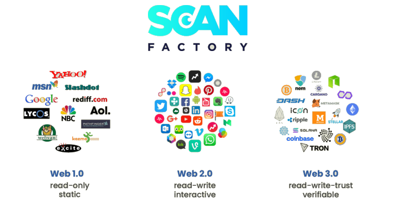

[Web 1.0 vs Web 2.0 vs Web 3.0](https://myraah.io/web3/whatisweb3)

It has been more that two decades since this century began. Emergence of Innovative Technologies is what these last two decades have been all about. Transforming the world into a better place is what Entrepreneurs have built their ventures around. Capitalists, Artists, Consumers, Lawmakers, etc. from Developed Nations rely on Technologies to turn their daily life more efficient, easy & ecstatic.

距本世纪开始已有二十多年了。 创新技术的出现是过去二十年的全部内容。 将世界变成一个更美好的地方是企业家们建立自己的企业的目标。 来自发达国家的资本家、艺术家、消费者、立法者等依靠技术使他们的日常生活更加高效、轻松和欣喜若狂。

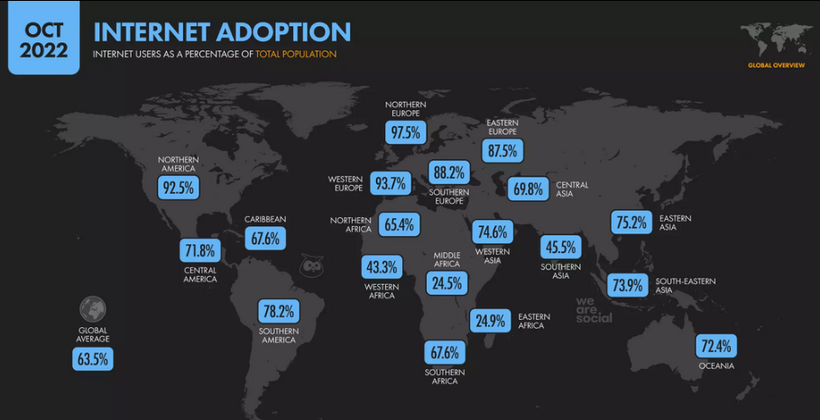

[Internet Adoption](https://datareportal.com/global-digital-overview)

The one technology, that was born out of war, but has evolved into an entirely new battlefield for wars to be fought in future, and is keeping everything & everyone connected in present — is the Internet. The network of networks which utilizes various protocols to ensure ease of access to everyone & everything. Among these protocols, the most widely adopted one, is the Web.

一种技术，它诞生于战争，但已经演变成未来战争的全新战场，并且让现在的一切和每个人都保持联系——这就是互联网。 网络的网络利用各种协议来确保每个人和所有事物都可以轻松访问。 在这些协议中，应用最广泛的是 Web。

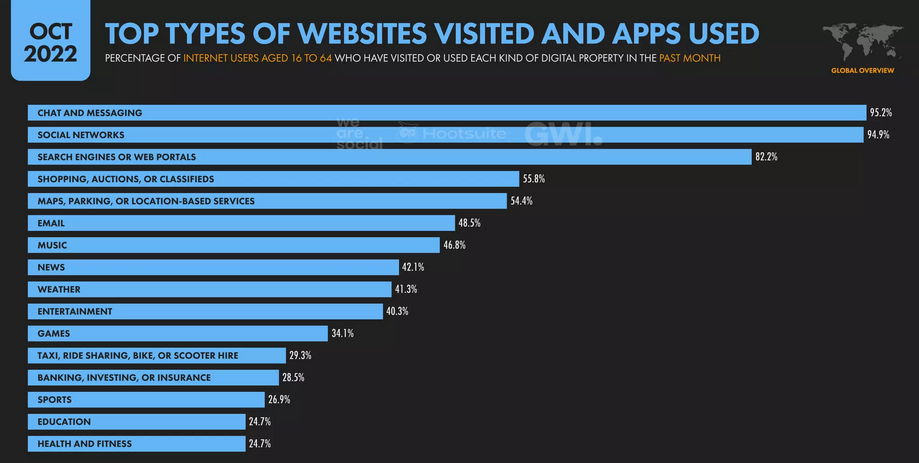

[Most Utilized Web Services](https://datareportal.com/global-digital-overview)

Web has revolutionized everything. From daily communication to scientific research, it is being utilized for everything one can imagine. It has become a technology, crucial to so many industries, that ensuring its security has become an essential requirement for its continued utilization & growth. It began as a decentralized entity — Web 1.0, a collection of static webpages, hosted on servers provided by ISPs.

网络彻底改变了一切。 从日常通讯到科学研究，它正在被用于一切你能想象到的地方。 它已成为一项对许多行业至关重要的技术，确保其安全性已成为其持续利用和增长的基本要求。 它最初是一个分散的实体——Web 1.0，一个静态网页的集合，托管在 ISP 提供的服务器上。

Eventually, as its adoption increased, hackers & innovators started getting creative with it by building products & offering services that were needed in daily life. Search Engines, Online Communities, Streaming Services were the first few among many. And as these services required more interactions, more and more technology stacks started getting developed. This gave rise to Web 2.0, a massive group of entities providing products and services through the Internet.

最终，随着其采用率的提高，黑客和创新者开始通过构建日常生活所需的产品和提供服务来发挥创造力。 搜索引擎、在线社区、流媒体服务是其中的前几名。 随着这些服务需要更多交互，越来越多的技术堆栈开始得到开发。 这催生了 Web 2.0，这是一大群通过 Internet 提供产品和服务的实体。

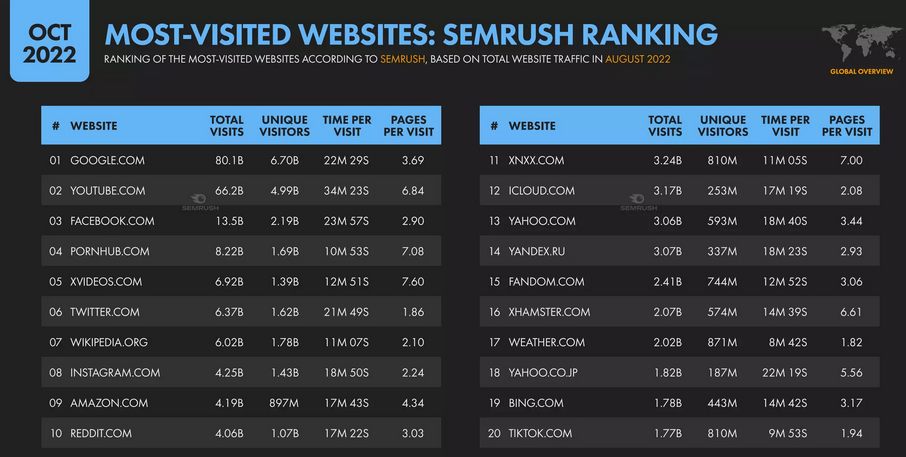

[Most Visited Websites](https://datareportal.com/global-digital-overview)

> With adoption comes worth. Things with worth often are meant to be traded. Traded entities eventually get treated as an asset & are expected to appreciate in value with time. And if they don’t, they become a liability & lose their entire worth with time.
> 
> 采用带来价值。 有价值的东西往往是用来交易的。 交易实体最终被视为一种资产，并有望随着时间的推移而升值。 如果他们不这样做，他们就会成为一种负担并随着时间的推移失去他们的全部价值。

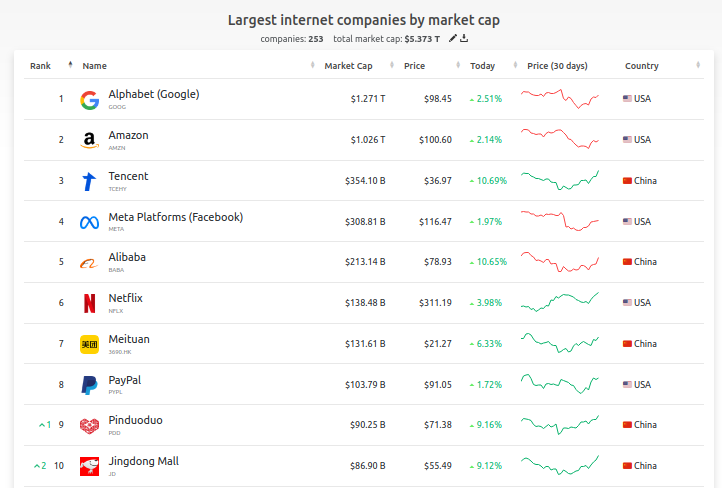

[Largest Internet Companies by Market Capital](https://companiesmarketcap.com/internet/largest-internet-companies-by-market-cap/)

These companies are now among the biggest ones by market cap. They are centralized & have got great amount of wealth and power. They have penetrated almost every aspect of a consumer’s life and have accumulated unimaginable amount of data that have given rise to some serious privacy concerns.

这些公司现在是市值最大的公司之一。 他们是集中的并且拥有大量的财富和权力。 它们几乎渗透到消费者生活的方方面面，积累了难以想象的海量数据，引发了一些严重的隐私问题。

Every sector has its concerns & issues — Financial sector has got insider trading issues, Government sector has got corruption issues, Energy sector has got sustainability issues and so on. But, most importantly, at the end of the day — Even though all these sectors are less transparent and extremely centralized, they have been evolving and creating real value in long term & stable value in short term — an economic value, since quite a long time.

每个部门都有自己的担忧和问题——金融部门有内幕交易问题，政府部门有腐败问题，能源部门有可持续性问题等等。 但是，最重要的是，归根结底——尽管所有这些部门的透明度都较低且高度集中，但它们一直在不断发展并创造长期的实际价值和短期的稳定价值——一种经济价值，因为很长一段时间以来时间。

A value that is not just based on some hype among the investors but its real world significance. And there are many instances where things aren’t being done in the right or good way but there also good amount of efforts being put by regulators and lawmakers to address these issues.

这一价值不仅基于投资者的一些炒作，还基于其现实世界的意义。 在很多情况下，事情并没有以正确或良好的方式完成，但监管机构和立法者也付出了大量努力来解决这些问题。

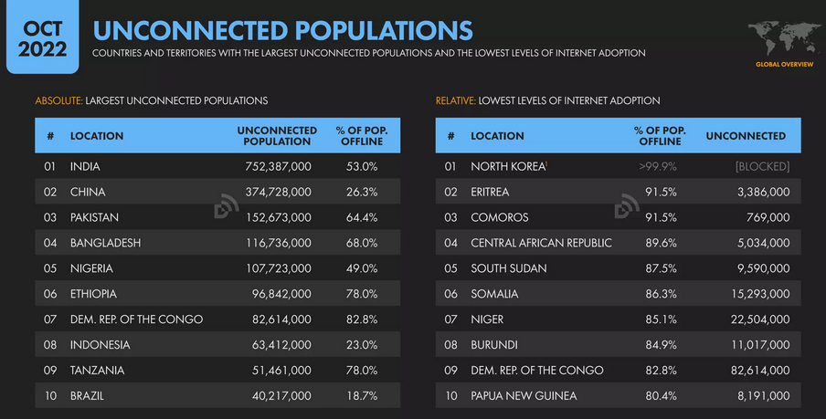

[Countries with Lowest level of Internet Adoption](https://datareportal.com/global-digital-overview)

But there is still a pretty large number of developing & under-developed nations who aren’t equipped with necessary knowledge & resources to address these issues. Countries which are struggling with their own economic & political problems. These countries need everything from money to knowledge for getting at par with other nations. After all they are the part of this World & every next entrepreneurs talks about making this World a better place.

但仍有相当多的发展中国家和欠发达国家不具备解决这些问题所需的知识和资源。 正在与自己的经济和政治问题作斗争的国家。 这些国家需要从金钱到知识的一切才能与其他国家相提并论。 毕竟他们是这个世界的一部分，接下来的每一位企业家都在谈论让这个世界变得更美好。

All these countries, even the developed ones, are experiencing a sharp surge in rise of cyber attacks and frauds post pandemic. Just Recently, India’s Prime Minister — Narendra Modi inaugurated Interpol’s 90th General Assembly in New Delhi, India and proposed to more actively address these global threats.

所有这些国家，甚至是发达国家，都在大流行后经历了网络攻击和欺诈上升的急剧上升。 就在最近，印度总理纳伦德拉·莫迪 (Narendra Modi) 在印度新德里为国际刑警组织第 90 届大会揭幕，并提议更积极地应对这些全球威胁。

[INTERPOL’s 90th General Assembly](https://www.interpol.int/en/News-and-Events/News/2022/INTERPOL-General-Assembly-opened-by-Prime-Minister-Narendra-Modi)

We are forgetting that, Internet, is just another ground for bad things happening and it’s our responsibility to make people aware of that. Even the biggest tech companies haven’t yet figured out the awareness aspect of cybersecurity. Globally adopted cybersecurity standards and awareness, even in today’s time, aren’t up to the mark.

我们忘记了，互联网只是坏事发生的另一个场所，让人们意识到这一点是我们的责任。 即使是最大的科技公司也还没有弄清楚网络安全的意识方面。 即使在今天，全球采用的网络安全标准和意识也达不到标准。

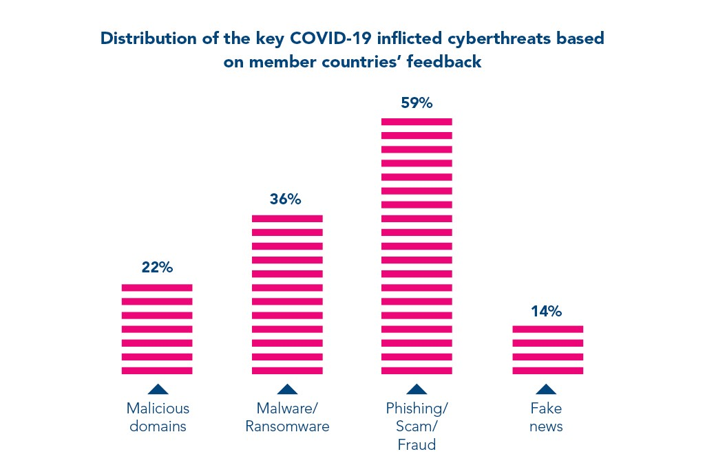

[INTERPOL’s Covid-19 Cybersecurity Impact Statistics](https://www.interpol.int/content/download/15526/file/COVID-19%20Cybercrime%20Analysis%20Report-%20August%202020.pdf)

In midst of all this crisis, another industry has emerged — The Blockchain Industry. An industry which has fulfilled the greed of the common. An industry which treats centralization as a problem that needs to be eliminated across all other industries but has turned out to be the great solution for moving & storing funds involved with these globalization & transnational crimes.

在这场危机中，出现了另一个行业——区块链行业。 一个实现了普通人贪婪的行业。 一个将中心化视为需要在所有其他行业中消除的问题的行业，但事实证明这是移动和存储与这些全球化和跨国犯罪有关的资金的绝佳解决方案。

After the Crash of 2008, when the Federal Reserve of United States started bailing out the Banks, Nerds of the Tech Industry saw centralization of money as the core problem & Bitcoin came out as the Decentralized/P2P alternative to centralized banking. Built upon the truly game-changing idea of smart contracts, the Blockchain industry was seen as a delusional solution to all kinds of problems that I stated previously.

2008 年崩盘后，当美国联邦储备委员会开始救助银行时，科技行业的书呆子将货币集中化视为核心问题，而比特币作为集中式银行业务的去中心化/P2P 替代品出现。 基于真正改变游戏规则的智能合约理念，区块链行业被视为对我之前提到的各种问题的妄想解决方案。

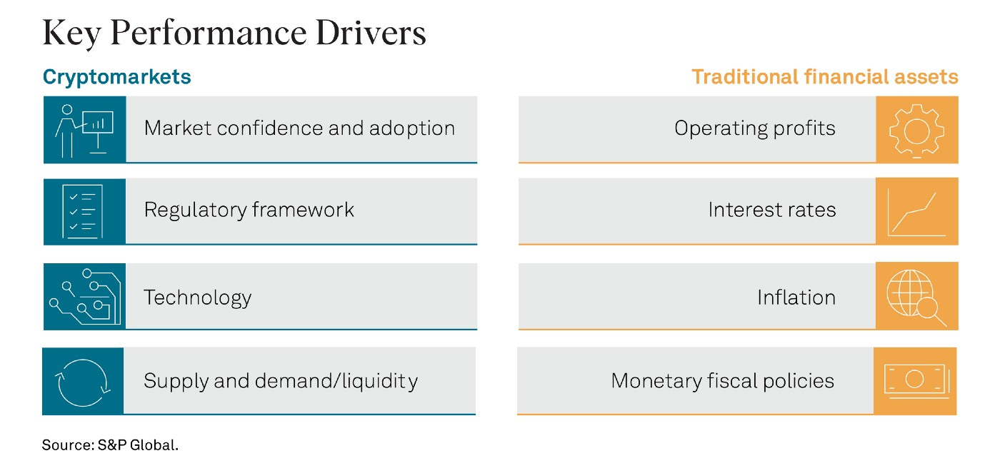

[Comparative View of Key Performance Drivers](https://www.spglobal.com/en/research-insights/featured/special-editorial/understanding-crypto-valuation)

We do not live in an ideal world. People, from lower class to upper class, all are slave to their desires. Some need money, others just want to be richer. The booming housing market, before it all came tumbling down, quenched the thirst of money for many. But during & after the crash, the returns on traditional instruments got too low. From retail to institutional investors, everyone was in need of an instrument that can outperform the market.

我们并不生活在一个理想的世界中。 人，从下层到上层，都是欲望的奴隶。 有些人需要钱，有些人只是想变得更富有。 蓬勃发展的房地产市场，在一切都崩溃之前，满足了许多人对金钱的渴望。 但是在崩盘期间和之后，传统工具的回报率太低了。 从散户到机构投资者，每个人都需要一种能够跑赢市场的工具。

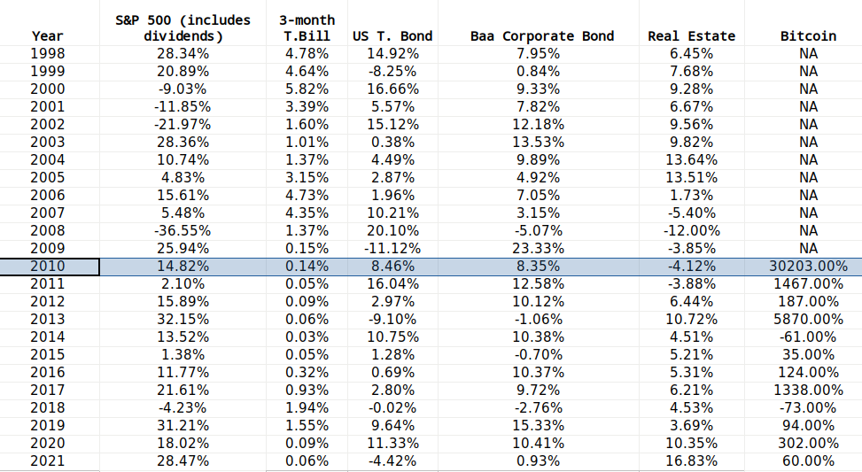

[Historical Annual Returns](https://pages.stern.nyu.edu/~adamodar/New_Home_Page/datafile/histretSP.html)

Bitcoin became that instrument. A Peer-to-Peer Electronic Cash System having a immutable & transparent ledger that was supposed to revolutionize the Financial Industry. Nerds were excited. They thought technology will solve the problems that even religion couldn’t in long term.

比特币成为了那种工具。 一个点对点的电子现金系统，具有不可变且透明的分类帐，本应彻底改变金融业。 书呆子们很兴奋。 他们认为技术将解决即使是宗教也无法长期解决的问题。

[Charlie Munger on Crypto Collapse](https://www.cnbc.com/2022/11/15/charlie-munger-says-crypto-is-a-bad-combo-of-fraud-and-delusion-good-for-kidnappers.html)

Anyway, soon more and more cryptocurrencies emerged with extremely sophisticated ecosystem built around them. These cryptocurrencies, however, solved some very concerning problems of Drug Kingpins, Money Launderers, Pyramid Strategists, etc. Moving money became so easy and cost of capital started getting higher and higher. The real-estate investors who were seen as flipping houses were now replaced by crypto investors flipping NFTs, playing with values of so called transparent ledgers & what not.

无论如何，很快出现了越来越多的加密货币，并围绕它们建立了极其复杂的生态系统。 然而，这些加密货币解决了毒枭、洗钱者、金字塔战略家等一些非常令人担忧的问题。转移资金变得如此容易，资本成本开始越来越高。 被视为炒房的房地产投资者现在被加密货币投资者所取代，他们炒作 NFT，玩弄所谓透明账本的价值等等。

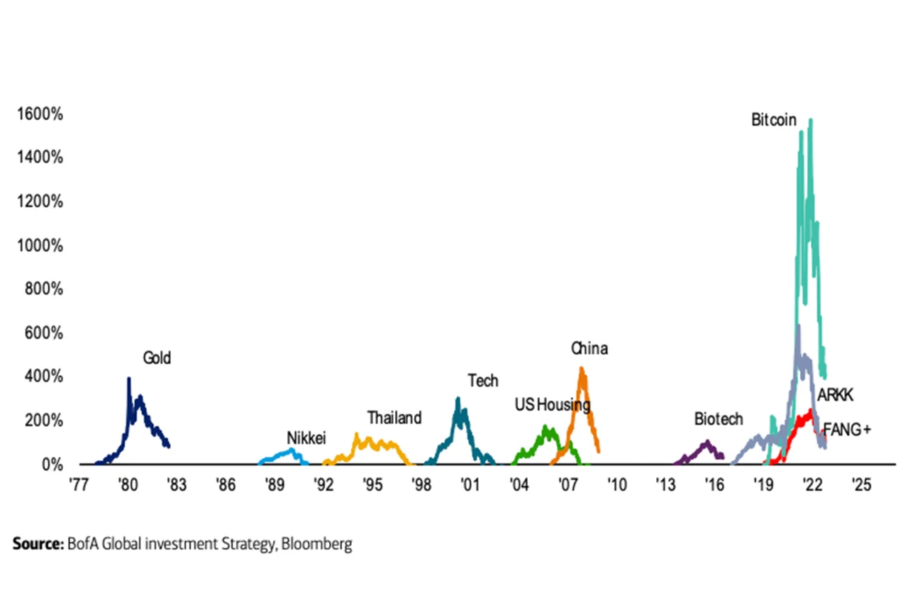

[Historical Bubbles](https://finance.yahoo.com/news/historic-crypto-bubble-bitcoin-now-191954304.html)

As the industry was & is booming, more and more idealists are coming forward with their revolutionary crypto ideas. These ideas need liquidity providers, who usually just want to make great returns on their money. The nerds who were supposed to save the world from greedy capitalists, are nowadays seen either becoming the same or joining hands with them, and are together ending up wiping off millions of dollars from retail and smaller investors of the blockchain industry via all kinds of bubbles & scams.

随着行业的蓬勃发展，越来越多的理想主义者提出了他们革命性的加密想法。 这些想法需要流动性提供者，他们通常只想从他们的钱中获得丰厚的回报。 原本应该从贪婪的资本家手中拯救世界的书呆子，如今要么变得同流合污，要么与他们联手，并最终通过各种泡沫从区块链行业的散户和小投资者手中抹去数百万美元＆骗局。

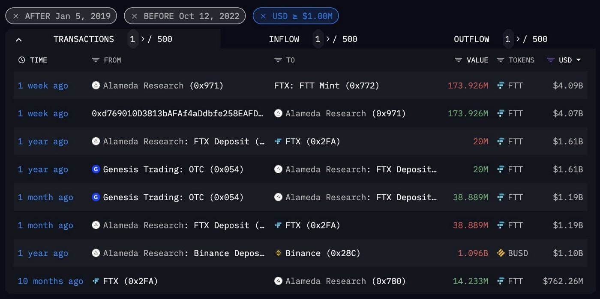

[FTT collateral being sent from Alameda to FTX](https://twitter.com/ArkhamIntel/status/1593205290203516929)

[Web3](https://www.weforum.org/agenda/2022/02/web3-transform-the-internet/) is just another brainchild of these crypto idealists. Decentralized Apps, popularly known as DAPPs, are extremely sophisticated applications, hosted on blockchain & governed by consensus. These apps together make up the Web3. Although they are getting marketed as decentralized alternatives to the apps of Web 2.0, that is governed by Big Tech Corporations, they themselves aren’t much decentralized in terms of power.

[Web3](https://www.weforum.org/agenda/2022/02/web3-transform-the-internet/) 只是这些加密理想主义者的另一个创意。 去中心化应用程序，通常称为 DAPP，是极其复杂的应用程序，托管在区块链上并由共识管理。 这些应用程序共同构成了 Web3。 尽管它们作为 Web 2.0 应用程序的去中心化替代品被推向市场，Web 2.0 由大型科技公司管理，但它们本身在权力方面并没有太多去中心化。

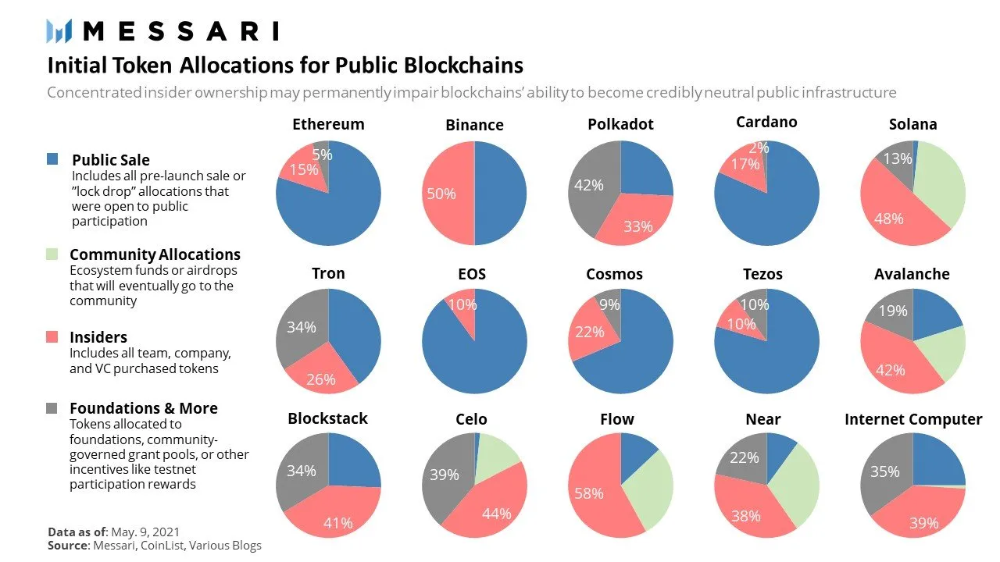

[Ownership Percentage of Blockchain Entities](https://tanay.substack.com/p/who-owns-the-web)

Every kind of entity requires wealth to build influence in order to expand. So do these Web3 entities. The most popular way of securing this wealth is by acquiring some seed investment from VCs & then using that fund to give initial liquidity to crypto tokens that will then be distributed among the end-users via Airdrops/Exchanges/etc. Another popular way is to just raise money from public sale of these tokens in the first place. Tokens are what represent the ownership stake for these entities. And majority of these tokens are often owned by insiders.

每一种实体都需要财富来建立影响力才能扩张。 这些 Web3 实体也是如此。 保护这些财富的最流行方式是从风投那里获得一些种子投资，然后使用该基金为加密代币提供初始流动性，然后通过空投/交易所/等方式在最终用户之间分配。 另一种流行的方式是首先通过公开销售这些代币来筹集资金。 代币代表这些实体的所有权股份。 大多数这些代币通常由内部人员拥有。

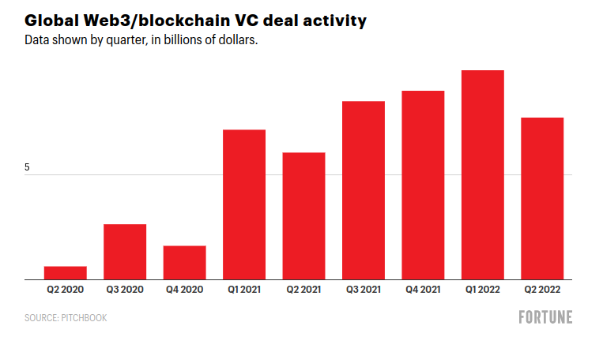

[Global Web3/blockchain VC deal activity](https://fortune.com/crypto/2022/08/06/web3-decentralization-crypto-winter-nft-crash-bubble-nadim-kobeissi/)

There are many reasons contributing to the failure of Web3 but the most fundamental ones –

导致 Web3 失败的原因有很多，但最根本的原因是——

1.  Sophisticated & Tedious Development
2.  Self Governance & Lack of Compliance
3.  Built upon Delusions & Lies
4.  Not better than its predecessors in anyway
5.  Prone to all kinds of Cybersecurity issues that can’t be eliminated

1.  复杂而乏味的开发
2.  自我管理和缺乏合规性
3.  建立在妄想和谎言之上
4.  无论如何都不比它的前辈好
5.  容易出现各种无法消除的网络安全问题

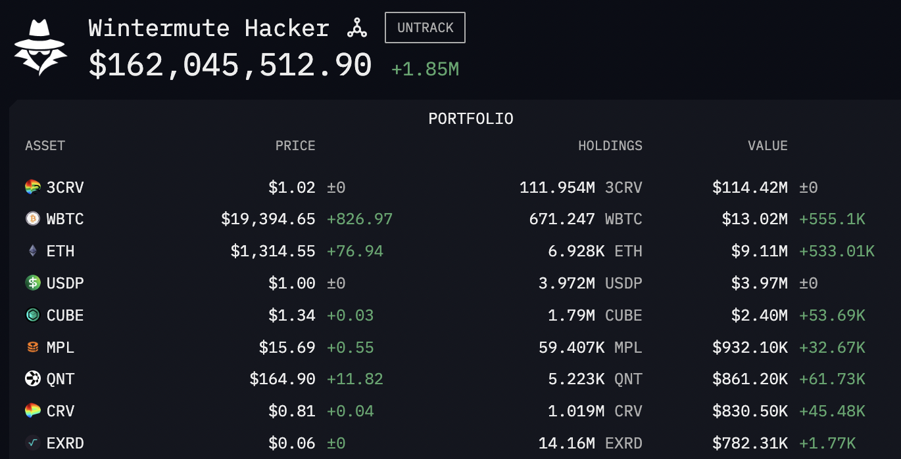

[$160M Wintermute Hack Analysis](https://www.arkhamintelligence.com/research/wintermute-hack)

Combination of these 5 reasons have been leading to all kinds of chaos in the Blockchain Industry, from DeFi to DApps, all of them are experiencing these issues. When these ecosystems start tumbling down, all kinds of conspiracy theories involving these fundamental reasons start coming at play. Over a dozen blockchain projects have failed and led to wipeout of billions in just last 5 years. As an idea, blockchain is truly revolutionary. But in reality, it has done more harm than good.

这 5 个原因的结合导致了区块链行业的各种混乱，从 DeFi 到 DApps，它们都在经历这些问题。 当这些生态系统开始崩溃时，涉及这些根本原因的各种阴谋论开始发挥作用。 在过去的 5 年里，有十几个区块链项目失败并导致数十亿美元的损失。 作为一个想法，区块链是真正具有革命性的。 但实际上，它弊大于利。

[$1.9T wipeout in crypto risks spilling over to Stocks & Bonds](https://cointelegraph.com/news/1-9t-wipeout-in-crypto-risks-spilling-over-to-stocks-bonds-stablecoin-tether-in-focus)

But there’s still some hope left. Although cryptocurrency have brought nothing but more severe & diverse problems to deal with, Governments, Think Tanks, Companies, Investors, from all around the World all are trying pretty hard to make things work.

但仍有一些希望。 尽管加密货币只带来了更严重和多样化的问题需要处理，但来自世界各地的政府、智库、公司、投资者都在努力使事情顺利进行。

Intelligence Companies like [Arkham Intelligence](https://platform.arkhamintelligence.com/waitlist?referrer=Z2xhdGlzYW50YmVhc3RAZ21haWwuY29t), have come forward with tools to visualize and link blockchain activities to real individuals and organizations and are working tirelessly towards demystifying the failures & activities of the Blockchain organizations. Apps like [Delenium](https://delenium.io/) are being built to protect end users from Web3 scams.

像 [Arkham Intelligence](https://platform.arkhamintelligence.com/waitlist?referrer=Z2xhdGlzYW50YmVhc3RAZ21haWwuY29t) 这样的情报公司已经推出了可视化区块链活动并将其与真实个人和组织联系起来的工具，并且正在不懈地努力揭开区块链组织的失败和活动的神秘面纱。 像 [Delenium这样的应用程序来保护最终用户免受 Web3 诈骗。](https://delenium.io/) 正在构建

[Arkham Intelligence](https://platform.arkhamintelligence.com/waitlist?referrer=Z2xhdGlzYW50YmVhc3RAZ21haWwuY29t)

Security Researchers from companies like [Zellic](https://zellic.io/) are not only committing their time & brainpower in private smart-contract security audits but also actively participating in Vulnerability Reward Programs of popular Blockchain companies for keeping their ecosystem truly secure for all.

等公司的安全研究人员 [来自Zellic](https://zellic.io/) 不仅将他们的时间和脑力投入到私人智能合约安全审计中，而且还积极参与流行的区块链公司的漏洞奖励计划，以确保他们的生态系统真正安全。

> People building the future don’t exactly know how to secure the present.
> 
> 建设未来的人并不完全知道如何保护现在。

[OpenSea Pays $200,000 to Ethical Hackers Who Uncovered Critical Security Flaws](https://coinmarketcap.com/alexandria/article/opensea-pays-200-000-to-ethical-hackers-who-uncovered-critical-security-flaws)

We too, at [ScanFactory](https://in.scanfactory.io/), were curious about how secure all Web3 companies are, after all flaws, are everywhere. So we did an automated vulnerability survey for all the popular Web3 companies but against their Web2 infrastructure. At the end of this survey, we came to a conclusion that an average Web3 company doesn’t care much about the vulnerabilities in their Web2 stacks & they take an average of 3 months to detect & remediate these vulnerabilities. We took no more time in reporting these vulnerabilities but many of them still remain intact.

我们在 [ScanFactory](https://in.scanfactory.io/) 也对所有 Web3 公司的安全性感到好奇，毕竟缺陷无处不在。 因此，我们对所有流行的 Web3 公司进行了自动化漏洞调查，但针对的是他们的 Web2 基础设施。 在本次调查结束时，我们得出的结论是，一般的 Web3 公司不太关心其 Web2 堆栈中的漏洞，他们平均需要 3 个月的时间来检测和修复这些漏洞。 我们没有花更多时间报告这些漏洞，但其中许多漏洞仍然完好无损。

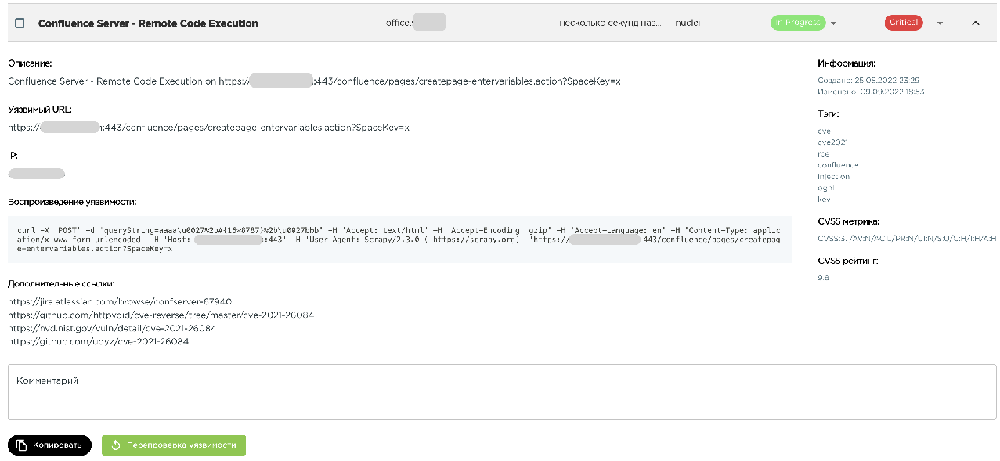

[Automated Vulnerability Assessment Platform](https://in.scanfactory.io/)

The real single reason for which I believe that all this will come tumbling down is cause of the fact that all this is falsely hyped as being something better than its predecessors but in reality it is not. In fact the entire Blockchain arena is filled with either delusional or degenerate people who are inexperienced &, in no way, better than their predecessors.

我相信所有这一切都会崩溃的真正唯一原因是所有这一切都被错误地宣传为比其前辈更好的东西，但实际上并非如此。 事实上，整个区块链领域充斥着妄想或堕落的人，他们缺乏经验，而且绝不比他们的前辈强。

[FTX Bankruptcy](https://twitter.com/GRDecter/status/1593272102047580161)

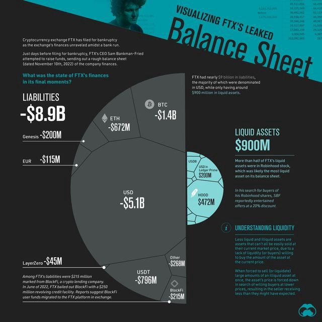

[Visualizing FTX Balance Sheet](https://www.visualcapitalist.com/ftx-leaked-balance-sheet-visualized/)

People who don’t care about technology or its purpose but just want great yields/returns. People who think a single-sign on is somehow a good thing. People who think that decentralizing the system will change how, why & what kind of people interact with the system. People who think that having a public ledger but letting people transact while staying anonymous will somehow ensure transparency. People who don’t even understand what is it that they exactly mean while asking for Equality, Privacy, Security, Decentralization, Transparency & Freedom all at the same time.

不关心技术或其目的但只想要高收益/回报的人。 认为单点登录在某种程度上是件好事的人。 那些认为去中心化系统会改变人们与系统交互的方式、原因和类型的人。 那些认为拥有公共分类账但让人们在保持匿名的情况下进行交易的人会以某种方式确保透明度。 人们甚至不明白他们在同时要求平等、隐私、安全、去中心化、透明和自由时到底是什么意思。

[Web3’s Security Problems](https://www.cloudflare.com/learning/insights-web3-security/)

Hopefully, everything should just end up alright somehow. Because humanity has been experimenting, learning & surviving for centuries now.

希望一切都应该以某种方式结束。 因为几个世纪以来，人类一直在试验、学习和生存。

> Where there’s a will there’s a way.
> 
> 只要有强大的意志，必有一条路为你开。
