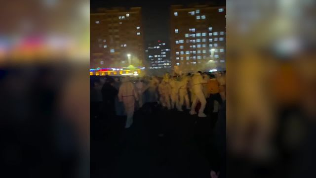
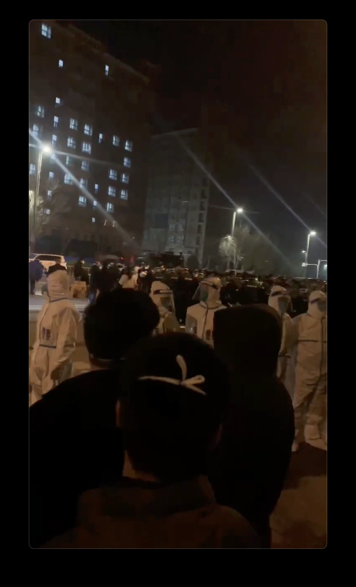

WATCH: Workers at Foxconn Technology’s plant in China that produces Apple’s iPhones clash with white-clad guards.

November 23, 2022, 3:48 AM UTCUpdated onNovember 23, 2022, 9:38 AM UTC

Hundreds of workers at [Apple Inc.](https://www.bloomberg.com/quote/AAPL:US "公司概况")’s main iPhone-making plant in China clashed with security personnel, as tensions boiled over after almost a month under tough restrictions intended to quash a Covid outbreak.

在中国的主要 iPhone 制造工厂的数百名工人 [苹果公司](https://www.bloomberg.com/quote/AAPL:US "公司概况") 与安全人员发生冲突，因为在旨在平息 Covid 爆发的严格限制下将近一个月后，紧张局势升级。

Workers at the [Foxconn Technology Group](https://www.bloomberg.com/quote/2317:TT "公司概况") plant streamed out of dormitories in the early hours of Wednesday, jostling and pushing past the white-clad guards they vastly outnumbered, according to videos sent by a witness to portions of the protest. Several white-suited people pummeled a person lying on the ground with sticks in another clip. Onlookers yelled “fight, fight!” as throngs of people forced their way past barricades. At one point, several surrounded an occupied police car and began rocking the vehicle while screaming incoherently.

工厂的工人于 [根据部分抗议活动的目击者发送的视频，富士康科技集团](https://www.bloomberg.com/quote/2317:TT "公司简介") 周三凌晨涌出宿舍，推挤并推开人数远远超过他们的白衣警卫。 几个穿白西装的人用棍子夹在一个倒地的人身上。 围观群众大喊“打，打！” 成群结队的人挤过路障。 有一次，几个人包围了一辆被占用的警车，并开始摇晃车辆，同时语无伦次地尖叫。

The protest started overnight over unpaid wages and fears of spreading infection, according to the witness, asking to remain anonymous for fear of repercussions. Several workers were injured and anti-riot police arrived on the scene Wednesday to restore order, the person added.

据目击者称，抗议活动是在一夜之间开始的，原因是拖欠工资和担心传播感染，因为担心受到影响而要求保持匿名。 该人士补充说，数名工人受伤，防暴警察周三抵达现场恢复秩序。

In one video, irate workers surrounded a silent, downcast manager in a conference room to voice grievances and question their Covid test results. It wasn’t clear when the meeting took place.

在一段视频中，愤怒的员工在会议室围住一位沉默寡言、情绪低落的经理，表达不满并质疑他们的 Covid 测试结果。 目前尚不清楚会议何时举行。

“I’m really scared about this place, we all could be Covid positive now,” a male worker said. “You are sending us to death,” another person said.

“我真的很害怕这个地方，我们现在都可能是 Covid 阳性，”一名男性工人说。 “你这是在送我们去死，”另一个人说。

The Zhengzhou campus was operating normally as of Wednesday evening, a Foxconn spokesperson said. The violence had erupted after a portion of recently arrived employees raised complaints about “work subsidies” -- bonuses or payments on top of usual wages, Foxconn said in a statement. But the company stressed that it handles all such compensation in strict accordance with its contractual obligations. 

富士康发言人表示，截至周三晚间，郑州园区正常运营。 富士康在一份声明中说，在部分新来的员工抱怨“工作补贴”——奖金或在正常工资之外支付的款项——之后，暴力事件爆发了。 但该公司强调，它严格按照合同义务处理所有此类赔偿。

“With regards to the violence, we are continuing to communicate with workers and the government, to avoid a recurrence,” the company said without elaborating.

“关于暴力事件，我们正在继续与工人和政府沟通，以避免再次发生，”该公司表示但没有详细说明。

| Read more about the Foxconn lockdown in China |
| --- |
| 
[China Adjusts Covid, Property Policies as Growth Seen Slowing](https://www.bloomberg.com/news/articles/2022-11-13/china-s-covid-zero-and-housing-slump-drag-on-growth-engines "随着经济增长放缓，中国调整新冠疫情和房地产政策")

[IPhone Supply Chain Gets Jolt From Xi’s Covid Zero Enforcers](https://www.bloomberg.com/news/articles/2022-11-02/iphone-supply-chain-gets-a-jolt-from-xi-s-covid-zero-enforcers "iPhone 供应链受到 Xi 的 Covid 零执法者的冲击 (2)")

[IPhone Factory Worker Walked 25 Miles to Escape Covid Lockdown](https://www.bloomberg.com/news/articles/2022-10-31/aapl-iphone-worker-at-china-factory-walked-25-miles-to-escape-covid-lockdown "iPhone 工厂工人步行 25 英里逃离 Covid 封锁")

[China Locks Down Area Around ‘IPhone City’ in Blow to Apple](https://www.bloomberg.com/news/articles/2022-11-02/china-locks-down-area-around-foxconn-s-iphone-city-plant "中国封锁“iPhone 城”周边地区以打击苹果 (2)")

[Apple’s Main IPhone Maker Grapples With Covid Fallout in China](https://www.bloomberg.com/news/articles/2022-10-31/iphone-assembler-moves-to-limit-plant-disruption-as-shares-slide "苹果的主要 iPhone 制造商在中国应对 Covid 影响")

 |

| 阅读更多关于中国富士康停工的信息 |
| --- |
| 
[随着经济增长放缓，中国调整新冠疫情和房地产政策](https://www.bloomberg.com/news/articles/2022-11-13/china-s-covid-zero-and-housing-slump-drag-on-growth-engines "随着经济增长放缓，中国调整新冠疫情和房地产政策")

[iPhone 供应链受到 Xi 的 Covid 零执法者的冲击](https://www.bloomberg.com/news/articles/2022-11-02/iphone-supply-chain-gets-a-jolt-from-xi-s-covid-zero-enforcers "iPhone 供应链受到 Xi 的 Covid 零执法者的冲击 (2)")

[iPhone 工厂工人步行 25 英里逃离 Covid 封锁](https://www.bloomberg.com/news/articles/2022-10-31/aapl-iphone-worker-at-china-factory-walked-25-miles-to-escape-covid-lockdown "iPhone 工厂工人步行 25 英里逃离 Covid 封锁")

[中国封锁“iPhone城”周边地区 打击苹果](https://www.bloomberg.com/news/articles/2022-11-02/china-locks-down-area-around-foxconn-s-iphone-city-plant "中国封锁“iPhone 城”周边地区对苹果造成打击 (2)")

[Apple 的主要 iPhone 制造商在中国应对新冠疫情影响](https://www.bloomberg.com/news/articles/2022-10-31/iphone-assembler-moves-to-limit-plant-disruption-as-shares-slide " Apple 的主要 iPhone 制造商在中国应对 Covid 影响")

 |

The rare instances of violence at the plant in the central city of Zhengzhou reflects a build-up of tensions since the [lockdown](https://www.bloomberg.com/news/articles/2022-11-02/iphone-supply-chain-gets-a-jolt-from-xi-s-covid-zero-enforcers "iPhone 供应链受到 Xi 的 Covid 零执法者的冲击 (2)") began in October. Many among the vast workforce of more than 200,000 at “iPhone City” have been plunged into isolation, forced to subsist on spartan meals and scrounge for medication. 

这家位于中部城市郑州的工厂发生的罕见暴力事件反映了自 [10 月开始封锁](https://www.bloomberg.com/news/articles/2022-11-02/iphone-supply-chain-gets-a-jolt-from-xi-s-covid-zero-enforcers "iPhone 供应链受到 Xi 的 Covid 零执法者的冲击 (2)") 以来紧张局势的加剧。 在“iPhone 城”超过 20 万的庞大劳动力中，有许多人陷入孤立状态，被迫靠简餐和四处求医维持生计。

Many eventually [fled](https://www.bloomberg.com/news/articles/2022-10-31/aapl-iphone-worker-at-china-factory-walked-25-miles-to-escape-covid-lockdown " iPhone 工厂工人步行 25 英里逃离 Covid 封锁") the plant on foot last month. Foxconn and the local government appeared to have gotten the situation under control in recent weeks, promising unusually high wages to attract new staff and promising better working conditions.

许多人最终 [徒步逃离](https://www.bloomberg.com/news/articles/2022-10-31/aapl-iphone-worker-at-china-factory-walked-25-miles-to-escape-covid-lockdown "iPhone 工厂工人步行 25 英里逃离 Covid Lockdown") 上个月， 了工厂。 富士康和当地政府最近几周似乎已经控制住了局势，承诺提供异常高的工资以吸引新员工，并承诺提供更好的工作条件。

Screenshot from video of police officers outside the dormitory compound.

Wednesday morning’s protests suggest that is no longer the case. It underscores how Xi Jinping’s Covid Zero policy, which relies on swift lockdowns to stamp out the disease wherever it pops up, is increasingly weighing on the economy and throwing swathes of the global supply chain into disarray. Beijing recently issued new directives ordering officials to minimize disruption and use more targeted Covid controls, but surging outbreaks in major cities have forced local authorities to reach for strict curbs again.

周三早上的抗议活动表明情况已不再如此。 它突显出习近平的“新冠病毒零”政策依赖于迅速封锁以在疾病出现的任何地方将其消灭，该政策如何对经济造成越来越大的压力，并使全球供应链的大片地区陷入混乱。 北京最近发布了新指令，要求官员尽量减少干扰并使用更有针对性的 Covid 控制措施，但大城市爆发的疫情激增迫使地方当局再次采取严格的限制措施。

“It’s really a mess,” said Barry Naughton, a professor at the University of California San Diego who specializes in Chinese economics. “They’ve created a situation where the local decision makers are under intolerable pressure.”

“真是一团糟，”加州大学圣地亚哥分校专门研究中国经济学的教授巴里诺顿说。 “他们造成了当地决策者承受无法承受的压力的局面。”

The [offshore yuan fell](https://www.bloomberg.com/news/terminal/RLS8WXT1UM0W "中国富士康工厂抗议消息传出") after Bloomberg’s report, extending losses and making it the worst performer in Asia on Wednesday.

， [离岸人民币在彭博社的报告发布后下跌](https://www.bloomberg.com/news/terminal/RLS8WXT1UM0W "后人民币下跌 中国富士康工厂抗议消息传出后人民币下跌") 延续跌势，成为周三亚洲表现最差的货币。

The Chinese currency “is underperforming its other Asian FX peers on reports of protests at Foxconn’s plant in Zhengzhou that supplies Apple products,” Stephen Innes, managing partner at SPI Asset Management wrote in a note. “However, a broader, more optimistic interpretation is that China is hitting the limits of ‘Covid zero’ and the authorities’ efforts to loosen restrictions will continue.”

SPI Asset Management 执行合伙人 Stephen Innes 在一份报告中写道，人民币“表现不及其他亚洲货币，因为有报道称郑州富士康供应苹果产品的工厂发生了抗议活动”。 “然而，更广泛、更乐观的解释是，中国正在触及‘Covid 零’的极限，当局将继续努力放松限制。”

Violence has erupted sporadically across China over Covid restrictions. In May, hundreds of workers [clashed](https://www.bloomberg.com/news/articles/2022-05-27/apple-supplier-faces-worker-revolt-in-locked-down-china-factory "苹果供应商在被封锁的中国工厂面临工人反抗") with security personnel at [Quanta Computer Inc.](https://www.bloomberg.com/quote/2382:TT "公司概况")’s factory in Shanghai after they were barred for months from contact with the outside world, while protests have [emerged](https://www.bloomberg.com/news/articles/2022-11-15/china-s-guangzhou-city-sees-rare-protests-over-covid-lockdowns "Covid 封锁在中国广州市引发暴力抗议") in locked-down areas of Guangdong, the southern manufacturing hub.

由于 Covid 的限制，中国各地零星地爆发了暴力事件。 5 月，数百名工人 [发生冲突](https://www.bloomberg.com/news/articles/2022-05-27/apple-supplier-faces-worker-revolt-in-locked-down-china-factory "苹果供应商在被封锁的中国工厂面临工人反抗") ) 上海工厂与保安人员 [在广达电脑公司 ( Quanta Computer Inc.](https://www.bloomberg.com/quote/2382:TT "公司概况") ，此前他们被禁止与外界接触数月之久，而 [也出现了抗议活动。](https://www.bloomberg.com/news/articles/2022-11-15/china-s-guangzhou-city-sees-rare-protests-over-covid-lockdowns "Covid 封锁在中国广州市引发暴力抗议") 南部制造业中心广东的封锁地区

Read more: [IPhone Pro Output Estimates Cut by Morgan Stanley After Lockdown](https://www.bloomberg.com/news/articles/2022-11-16/iphone-pro-output-estimates-cut-by-morgan-stanley-after-lockdown "锁定后摩根士丹利")

阅读更多： [锁定后摩根士丹利削减 iPhone Pro 产量预估](https://www.bloomberg.com/news/articles/2022-11-16/iphone-pro-output-estimates-cut-by-morgan-stanley-after-lockdown "削减 iPhone Pro 产量预估 锁定后摩根士丹利削减 iPhone Pro 产量预估")

The Foxconn situation serves up another reminder of the dangers for Apple of relying on a vast production machine centered on China at a time of unpredictable policy and uncertain trade relations.

富士康的情况再次提醒人们，在政策不可预测和贸易关系不确定的情况下，苹果依赖以中国为中心的庞大生产机器的危险。

Zhengzhou is the site of Apple’s most critical production, churning out an estimated four in five of its latest-generation handsets and the vast majority of the highest-end iPhone 14 Pro units. Apple [warned](https://www.bloomberg.com/news/articles/2022-11-06/apple-cuts-outlook-for-iphone-shipments-cites-china-lockdowns "Apple 下调中国封锁期间 iPhone 出货量预期 (2)") this month that shipments of its newest premium iPhones will be lower than previously expected -- just ahead of the peak holiday season shopping.

郑州是苹果最重要的生产基地，估计生产了五分之四的最新一代手机和绝大多数最高端的 iPhone 14 Pro 手机。 苹果公司 [本月警告](https://www.bloomberg.com/news/articles/2022-11-06/apple-cuts-outlook-for-iphone-shipments-cites-china-lockdowns " Apple 下调中国封锁期间 iPhone 出货量预期 (2)") 称，其最新款高端 iPhone 的出货量将低于此前的预期——就在假日购物旺季之前。

The sprawling compound has operated for weeks within a “closed loop,” or a self-contained bubble that limits contact with the outside world. That is keeping some production going. Apple and Foxconn have said they’re working to replace staff who’ve left and resume full production as soon as possible.

这个庞大的大院已经在一个“闭环”或一个限制与外界接触的独立气泡内运行了数周。 这让一些生产继续进行。 苹果和富士康表示，他们正在努力补充离职的员工，并尽快恢复全面生产。

The protests took place just hours after Henan party chief Lou Yangsheng visited the area where Foxconn plants were located and held a video chat with select employees. He asked managers to aid staff and ensure a “warm, relaxed and stable” living and working environment, [according to](https://news.bjd.com.cn/2022/11/22/10236000.shtml "中文链接") the official Henan Daily. Lou’s visit underscored the unusual amount of effort that provincial officials had devoted in recent weeks toward the nation’s biggest private-sector employer, from reportedly helping in recruitment to exhorting retirees to work at Foxconn.

抗议活动发生在河南省委书记楼阳生参观富士康工厂所在地区并与部分员工进行视频聊天后几个小时。 ，他要求管理人员帮助员工，确保“温暖、轻松、稳定”的生活和工作环境 [据](https://news.bjd.com.cn/2022/11/22/10236000.shtml "中文链接") 《河南日报》报道 。 娄的访问凸显了最近几周省级官员对这家全国最大的私营部门雇主付出的不同寻常的努力，据报道，从帮助招聘到劝告退休人员到富士康工作。

Naughton, the professor, said Beijing is putting intense pressure on local officials to realize contradictory goals.

诺顿教授表示，北京正在向地方官员施加巨大压力，以实现相互矛盾的目标。

“The tension is that Beijing wants both Covid Zero and full economic growth,” he said. “It’s kind of impossible.”

他说：“紧张局势在于，北京既希望 Covid 为零，又希望实现全面经济增长。” “这有点不可能。”

_— With assistance by Betty Hou, Yuan Gao, Rachel Chang, Wenjin Lv and Jing Li_

_— With assistance by Betty Hou, Yuan Gao, Rachel Chang, Wenjin Lv and Jing Li_

(Updates with Foxconn’s comments and official media from the sixth paragraph)
