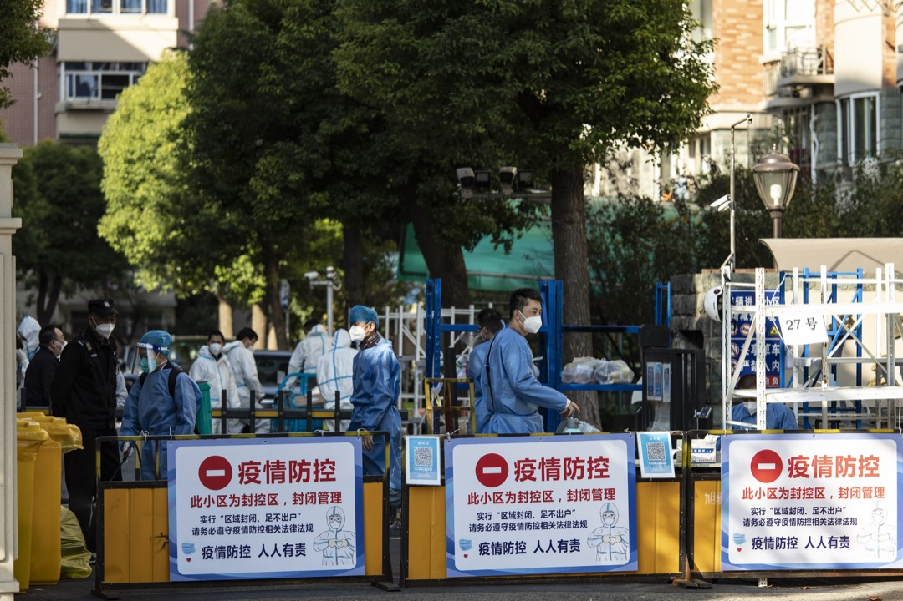
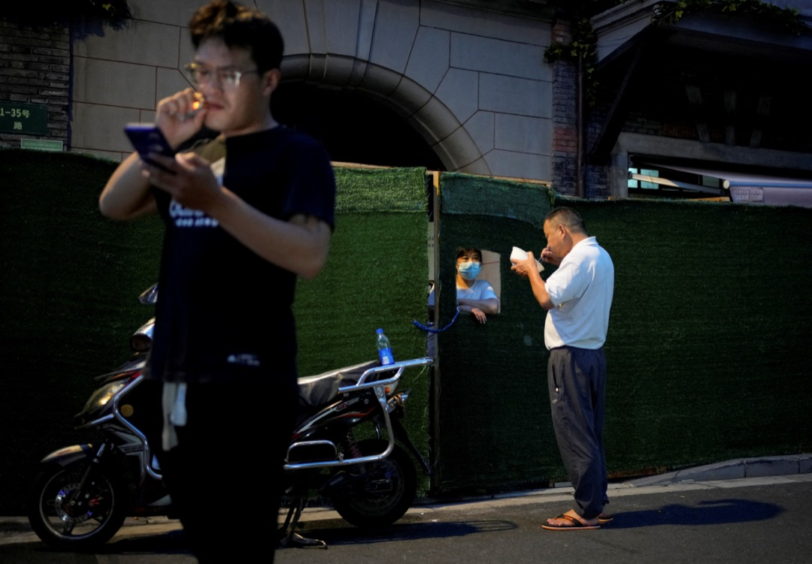
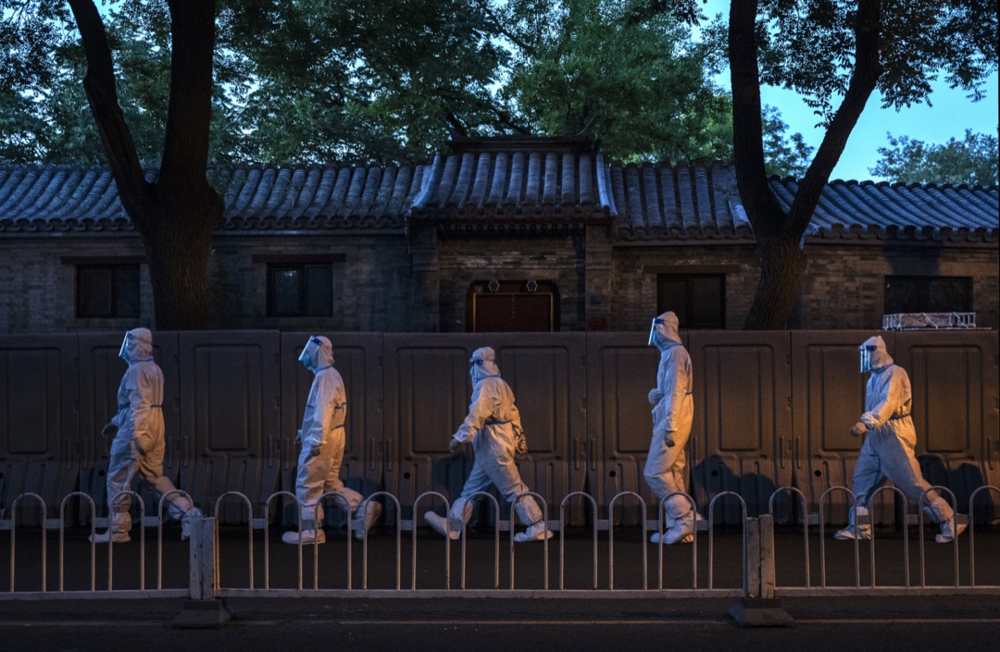

在野，中國「反血汗工廠」運動的行動者與研究者

今年以來，奧密克戎病毒猛烈衝擊中國堪稱世界最嚴格的防疫圍牆，以潮涌之勢席捲全國，確診人數屢創新高，令抗疫鬥爭的制度優勢失色。雖然與西方國家相比，中國的感染數字微不足道，但是在「動態清零」的總方針下，各地方政府以「大無畏」的政治勇氣與病毒比速度，「以快打快」，靠着全員核酸檢測、全部集中隔離、全域靜態管理的「三板斧」進行一場唐吉坷德式戰鬥，主要的戰場從年初的上海轉到年中的新疆再到眼下的廣州，然而結果並不遂人意，不但沒有讓奧密克戎清零，反而造成了一樁樁人道主義悲劇。

[貴陽的隔離轉運大巴](https://theinitium.com/article/20220921-mainland-covid19-guiyang-lockdown/)凌晨發生交通事故，讓27個生命消失在黑暗中；[蘭州一名三歲男孩煤氣中毒](https://theinitium.com/article/20221111-mainland-lanzhou-covid19-concealed-declaration/)，醫院離家僅僅十分鐘的距離，因為到處封鎖耽誤搶救不幸死亡；內蒙古呼和浩特一位婦人跳樓，她的女兒要衝出樓門求救，但門被焊死了無法出去。這些慘痛的現實事件在社交媒體上傳播，衝擊每個人道德良知的底線，在共情、悲痛、憤怒之外，人們不禁要問這些悲劇為什麼會發生？還會繼續發生嗎？

從單純科學的角度看，奧密克戎病毒雖然傳播速度快，但毒力低於早期武漢的原始毒株，而且在接種了有效疫苗的情況下，無症狀感染者的比例大大提高而重症率和死亡率都明顯降低。基於這樣的事實，中國的防疫策略理論上到了需要調整的時候，特別是抗疫鬥爭所付出的經濟社會代價越來越大，財政不堪重負，民衆困苦哀嚎。

## 社會工程學治理邏輯的失效

> 中國的防疫邏輯實際上把人當作病毒的載體和具象，治理病毒就順理成章地變成治理確診者和密切接觸者。

即使國務院層面強調要防止簡單化、「一刀切」，堅決整治「層層加碼」，但是防疫任務的實際執行是官僚體系自上而下進行的一場運動型治理，表明動態清零已經從臨時性的防疫策略演變成肆無忌憚的社會工程，被投射了領袖的雄心和權威。領袖表達了他「親自部署、親自指揮」的抗疫大戰取得重大戰略成果，創造人類同疾病鬥爭史上的英勇壯舉的浪漫想象，緊隨其後的就是沉着理性的官僚主義程序問題，讓病毒清零的社會工程野心與運動型治理機制的權力、資源和管理技術混合在一起，形成了現代社會罕有的防疫制度「優勢」。

我們對這種制度優勢並不陌生，每當發生洪水、地震、山火等自然災害時，龐大的動員機器就會啓動，緊急救援，快速重建，集中力量辦大事，救民於水火的觀念深入人心，這是國家建立道德合法性的重要來源之一。現在的抗疫戰鬥是在同樣的邏輯下進行的，所不同的是自然災害的破壞是可見的、孤立的、階段性的，而COVID病毒是不可見的、發散的、持續性的，從這個意義上說，動態清零首先是一項思想，其次才是一種政策。要想發揮官僚體系動員戰鬥的優勢就必須讓病毒看得見、封得住、追得上，在實際操作中的對應手段就是大規模核酸檢測、集中隔離營和紅黃健康碼。

通過核酸檢測把已經感染和確診的人識別出來，這是顯性化病毒的第一步，按理說，人是病毒的受害者，應當被關懷、照顧和治療，但是中國的防疫邏輯實際上把人當作病毒的載體和具象，治理病毒就順理成章地變成治理確診者和密切接觸者。這些人被視為一個亟待解決的問題，是社會工程的一個合法目標，需要被控制、掌握並加以改進或者重塑。照此邏輯，他們即使大部分都是輕症乃至無症狀感染者，也要麼被送進定點治療醫院，要麼被送進集中隔離營，要麼被圍封起來居家隔離。

2022年11月7日，中國上海，一個被封鎖的小區的入口，有穿保護衣的工作人員在看守。攝：Bloomberg via Getty Images

當這些以醫學和公共衛生學為基礎，朝向更健康安全目標的社會工程完成後，一個「社會面清零」的概念被創造出來，從字面意思理解，社會面並不是正常社會，它是把確診者和密接者隔離之後的結果，官僚體系想當然地認為只要把「害群之馬」清除出去，社會就能恢復正常，就像多年前把麻風病人丟在荒山孤島一樣。

且不說這是一個非常自欺欺人的概念，因為COVID病毒客觀上會一直存在，這種發明新詞和新做法的危險之處，在於把科學的無能和內心的恐懼投射在感染者和密接者身上，進而把他們排除在「正常人」之列，對他們施之以「治療」和「觀察」，這或許可以被解釋為必要的科學之舉，但我們不得不警惕潛藏的把COVID病人和密接者「非人化」所帶來的道德危機和政治責任，畢竟已經發生的不少人道主義災難就是在隔離管控的過程中發生的。從這個意義上說，貴陽的深夜大巴就不是普通的交通事故，蘭州的煤氣中毒孩子就不是普通的意外事故，呼和浩特黑暗中的哭喊就不是普通的喪母之痛。

當有一天社會面的確診者和密接者足夠多到讓入住資源耗盡時，方艙和驛站的價值和意義也就失去了。

通過徹底的空間分離實現對感染者和密切接觸者完全的隔離是一項規模浩大的工程，如果不結合其他一些條件，這個任務就根本不可想象。這些條件包括：大量的物質資源及其動員和計劃分配方法，將整個任務細分成許多局部和專門的職責的技能，協調各參與方一致行動的能力，實現這些條件的有效運轉需要整個官僚體系的支撐，全國各地大規模方艙醫院、健康驛站的建設就是最好的註腳。大規模集中隔離營的建設是實現動態清零這一社會工程的重要支柱之一，其性質也從武漢疫情爆發後臨時性修建的雷神山、火神山醫院演變為永久性的基礎設施，比如位於廣州機場附近的國際健康驛站總佔地面積499畝，總房間數5047個，總投資額17億元，而上海計劃在復興島興建密接隔離點3009個房間，備用方艙3250個床位，耗資13億8千萬元。

整體來看，中國作為基建狂魔能夠在短時間內調集資源完成大規模方艙醫院和健康驛站的建設，但這種基建能力是有一定限度的，奧密克戎病毒的傳播速度必定超過建設速度，建再多的方艙和驛站也會很快住滿。當有一天社會面的確診者和密接者足夠多到讓入住資源耗盡時，方艙和驛站的價值和意義也就失去了。因為到時居家隔離就會被迫成為選擇，這是香港在應對第五波疫情時得來的經驗，耗費巨資建設的集中隔離營的使用率不高，有的甚至建好後從來都沒啓用過。

多數人希望別人被隔離，但不希望自己被隔離，這種典型的雙標選擇在道德上是令人煩憂的。

無論是方艙醫院還是集中隔離營都被寄予封住病毒的厚望，而住在裏面的確診者和密接者都被當作病毒的載體和具象，被排除在社會面之外。對官僚體系來說，這種解決方案格外「合理」，為了保護社會面的多數人，讓攜帶以及疑似攜帶病毒的人暫時失去自由是必要的和值得的。對很多人來說，這個論調是完全正確的，直到被帶走隔離的是自己。網上曾經有一個調查，第一個問題問如果你的鄰居感染，你是否同意他被帶走集中隔離，多數答案選「是」，而第二個問題問如果你感染，你是否同意自己被帶走集中隔離，多數答案選「否」，並希望居家隔離。

多數人希望別人被隔離，但不希望自己被隔離，這種典型的雙標選擇在道德上是令人煩憂的，反映了人們既要安全又要自由的矛盾。這在一定程度上映射了一個「阿甘本問題」，即在COVID病毒的恐慌狀態下，群衆為了追求安全，隨意讓政府嚴格限制自由，導致一個地區人們每天正常的生活和工作被大範圍地「懸置」。在國外疫情高峰期，阿甘本的觀點在學界引發激烈爭論，被批評忽略了病毒對自然生命的傷害；但是在中國動態清零的狀態下，阿甘本的理論又凸顯了穿透力，正如他所言，層層加碼的防疫措施是「恐慌性、非理性以及完全沒有根據」和「不成比例」的，但官僚體系得以在「例外狀態」下剝奪了所有人的隱私，獲得了限制個人流動的權力，並且隨時能控制人身自由，抓住和鞏固了生物政治。這跟福柯描寫十七世紀一個小鎮如何控制疫情、如何禁止民衆外出、如果通過一層一層的管理如出一轍。

2022年7月11日，中國上海，一名圍在封小區內的居民與區外的市民交談。攝：Aly Song/Reuters/達志影像

無人負責的官僚體系與非人化的執行者

無論是核酸檢測、集中隔離還是賦紅黃碼，動態清零這項社會工程最終是由官僚體系中具體的人去完成，但是當一起又一起人道災難發生時，幾乎沒有人出來為具體的事件認錯道歉。

通過核酸檢測和集中隔離營實現對病毒的具象化和封控後，官僚體系仍然沒有絕對的安全感，因為作為一項社會工程，動態清零始終以零為目標，安全不絕對就是絕對不安全，任何未被發現的潛在的病毒及其載體都是目標，因此紅黃健康碼被發明出來動態顯示疫情風險等級。但是最初追蹤病毒的目標實際上變成識別、追蹤、限制被封控隔離的人，使得健康碼成為全方位監控每個人的手段，且應用範圍不斷擴大，逐漸長期化。諸如不做核酸被賦黃碼，沒有健康碼不讓坐公交等濫用行為層出不窮，最讓人震驚的的當屬大量河南村鎮銀行儲戶的健康碼被賦紅碼，以防止他們上訪維權。

以疫情防控的名義，紅黃碼起到了電子鐐銬的作用，令行禁止，有絕對的權力，面對如此誘惑，嚴重依賴監控治理的官僚體系不可能不濫用這個技術工具。其原因歸根結底在於處在權力金字塔中下層的地方決策者承擔了執行動態清零的全部責任，一旦疫情肆虐，傳播外溢就面臨權力上層的問責懲罰，這就迫使他們採取一切可用的手段來追蹤隔離病毒及其載體，而健康碼的管理本身就已服從政治上的需要，成為一種趁手的管控工具。

由於掌握「賦碼」權力的人不需要跟受紅黃碼控制的人建立面對面的聯繫，這種距離感意味着官僚體系中的人是在沒有了解其指令結果的情況下發出賦碼的命令，他們對這些後果只有抽象的、孤立的認識，而無法想象被賦碼的人的正常活動被突然中斷所造成的傷害，或是被困在旅途，或是被圈禁在商場，或是進不了醫院，或是考不了試。這些個體的遭遇頻繁發生，但在根本上未能改變，原因在於官僚體系的勞動分工使得每個人只要對他的直接上級負責，「工作責任」與「技術責任」代替道德責任，其結果就是道德標準對於官僚體系運作的技術成功而言不過是細枝末節或漠不關心的問題。

無論是核酸檢測、集中隔離還是賦紅黃碼，動態清零這項社會工程最終是由官僚體系中具體的人去完成，但是當一起又一起人道災難發生時，幾乎沒有人出來為具體的事件認錯道歉。鄭州的社區劉書記，在回應自己哽咽講述因疫情防控未參加女兒成人禮引發的爭議時說道「我覺得我沒做錯什麼，稿子是審核過的，不是我一個人想說什麼就說什麼」。這句話點出了問題的核心，一方面，官僚體系內發號施令的上層規避自身的政治和歷史責任顯而易見，對他們而言，社會悲劇的發生只存在口頭上或者想象當中，他們不會承認這些悲劇是由命令造成的，因為他們從來沒具體經歷過這些。另一方面，官僚體系中執行命令的下層則會把社會悲劇看成是上層的命令造成的後果，而他們自己只不過是一個外來意志的無可指責的工具罷了。不管是上層還是下層，官僚體系的這種道德盲視是令人驚駭的。

2022年5月26日，中國北京，穿保護衣的防疫人員在圍封的小區外巡邏。攝：Kevin Frayer/Getty Images

打死一隻柯基犬與毆打不遵守限制令的居民，類似的事情在上海以及其他有疫情的城市不斷發生，他們都不用被追責，因為沒人知道他們是誰。

官僚體系中具體執行疫情防控任務的人來自不同層級和部門，有政府官員、警察、社區工作者、志願者等等，他們的職責分工各有不同，有的核酸採樣，有的管控秩序，有的分發物資，有的上門服務。但是在這項社會工程中，他們都共享一個擬人化的名稱「大白」，在媒體的宣傳中，「大白」們代表着犧牲奉獻、守護健康、平凡英雄的形象，給公衆傳達溫暖的情緒。但這種塑造出來的可愛形象經過廣泛的宣傳包裝，會造成展現一種國家權力的錯覺，中國向來就不缺這種東西，比如紅袖章，朝陽群衆戴上它就好像有了執法權。

更大的問題在於這種去人格化的權力展現具有殘酷無情的一面，因為沒人一眼就能看出白色防護服裏面的人的身份，以及這個身份對他的行為作出的約束。一位「大白」可以用防疫為理由用鏟子打死一隻柯基犬，另一位「大白」也可以用防疫為理由毆打不遵守限制令的居民，類似的事情在上海以及其他有疫情的城市不斷發生，他們都不用被追責，因為沒人知道他們是誰。

在正常的狀態下，每一個承擔公共責任的人都有相應的職務範圍和行為規範，而每一個普通人在跟他們打交道時，會根據這些已知的內容提出要求或作出回應，這是法治社會的基本運作邏輯。在防疫的所謂緊急狀態下，用白色防護服把所有人都包裹起來並不是一個好的選擇，也有違科學防疫的精神。就這一點而言，要消除對病毒的恐慌，首先要破除對白色防護服的迷信。

動態清零成為一項社會工程，折射出政治抗疫的本質，即官僚體系宣稱的「對疫情防控和經濟社會發展的關係，要綜合看、系統看、長遠看，特別是要從政治上看，算政治賬」。但這項工程所付出的經濟和社會代價不可謂不大，中國與全球供應鏈脫鉤的速度加快，動搖了出口作為拉動經濟三駕馬車之一的地位，而不斷發生的人道主義災難對官僚體系的道德合法性帶來挑戰，影響民心向背。

但即使是如此，「動態清零」的總方針仍然不可動搖，即便有可能逐步放鬆，也不會對這四個字特別是後兩個字做任何改動，背後的根源在於政治力量顯著地凌駕於經濟和社會力量之上。掌握着權力之舵的人以「宏偉」的設計賦予抗疫鬥爭以合法性，官僚體系賦予了它工具，而最終社會的癱瘓則賦予它「道路暢通」的信號。

[防疫限制](https://theinitium.com/tags/_3432/) [中國防疫](https://theinitium.com/tags/_3070/) [過度防疫](https://theinitium.com/tags/_2739/) [動態清零](https://theinitium.com/tags/_2738/) [評論](https://theinitium.com/tags/_7080/)
