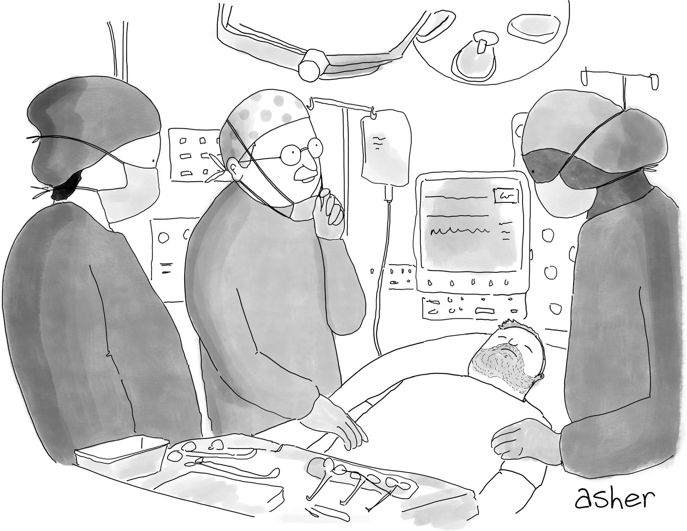
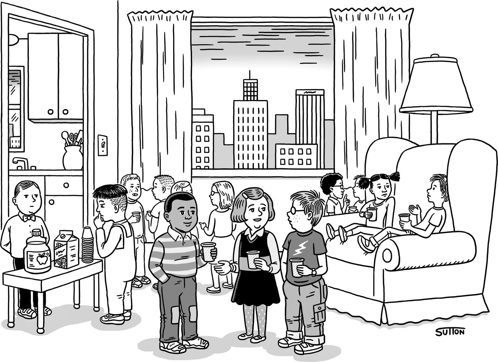
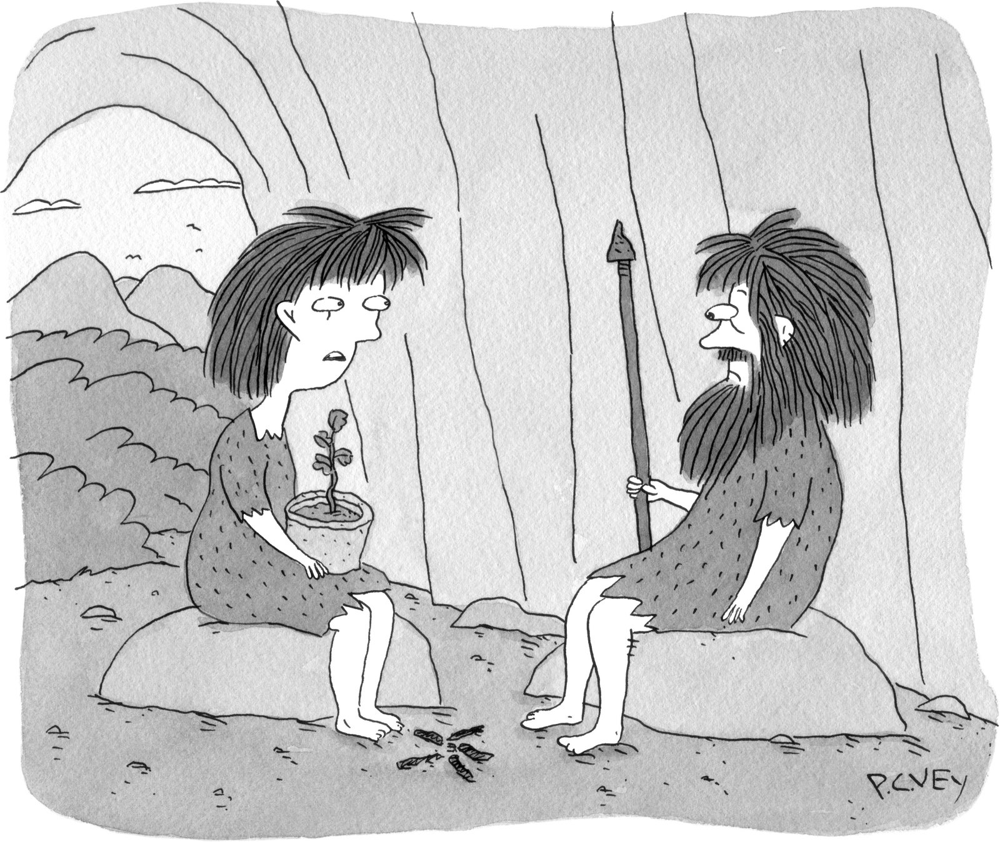
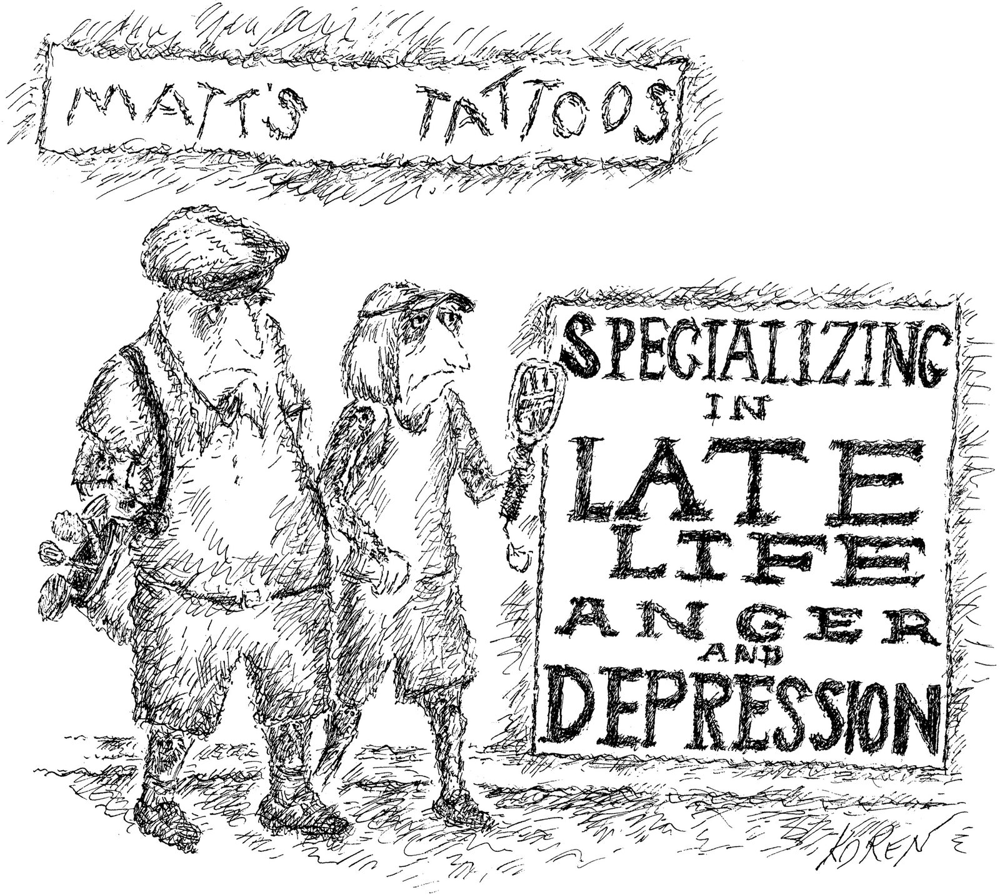
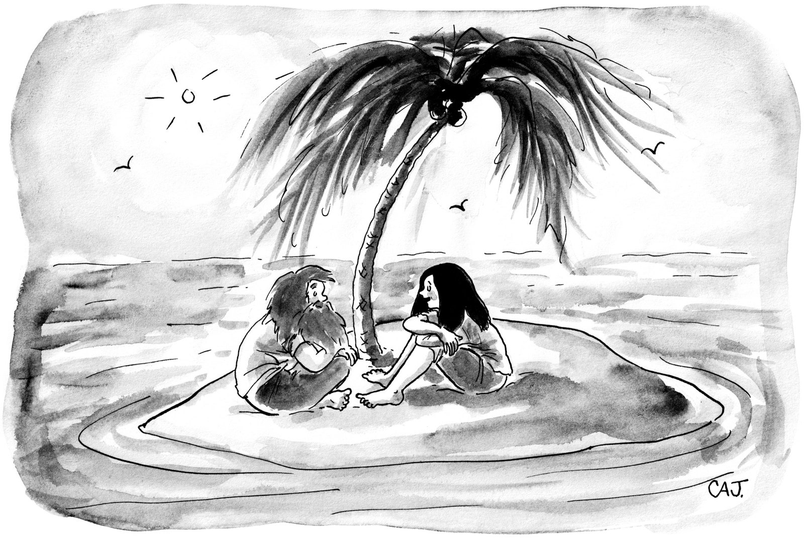

Listen to this story

On Kinmen, an outlying island of Taiwan, the Chinese mainland looms so close that you can hear the construction cranes booming across the water. The island, about twelve miles from end to end, sits across the bay from the bustling mainland city of Xiamen. Whereas Xiamen is a place of gleaming high-rises, Kinmen is dotted with low-slung villages and patches of forest; it is famous for kaoliang, a sweet but fearsomely potent liquor distilled from sorghum.

在台湾的离岛金门，中国大陆近在咫尺，你可以听到建筑起重机在水面上隆隆作响的声音。 该岛首尾相距约 12 英里，与繁华的大陆城市厦门隔湾相望。 厦门高楼林立，金门村落林立。 它以高粱而闻名，高粱是一种从高粱中蒸馏出来的甜酒，但烈度惊人。

In the nineteen-forties and fifties, Kinmen was the scene of ferocious assaults by Communist China as it tried to seize control. The invading forces, expecting an easy victory, were met with surprising resistance, from fighters dug in behind rows of steel spikes and in cement bunkers along the beach. Frustrated, the Chinese began bombarding Kinmen, flinging thousands of artillery shells across the water in the hope of forcing its people to surrender. When I visited not long ago, an eighty-year-old resident named Lin Ma-teng recalled hearing the shells as a young boy: “I used to hide under my bed.”

十九世纪四五十年代，金门是中共企图夺取控制权的凶猛攻击场面。 入侵部队本以为会轻松取胜，但遭到了来自一排排钢钉后面和海滩沿线水泥掩体中挖掘的战士的出人意料的抵抗。 沮丧的中国人开始炮击金门，向海面投掷数以千计的炮弹，希望迫使其人民投降。 不久前我走访时，一位八十多岁的居民林马腾回忆起小时候听到炮弹的情景：“我以前躲在床底下。”

The shelling continued for decades. One day in 1975, when Lin was serving in a Taiwanese artillery unit, a shell exploded nearby, tearing off a chunk of his right thigh. He spent a year in the hospital and still walks with a limp. During my visit, he showed me rusting artillery shells that he has piled in his hallway—mementos of the long conflict between the fragile island democracy of Taiwan and the behemoth next door, which has never stopped trying to assert dominion. On the beach near Lin’s house, visitors can still see the bunkers and barriers, where people he knew in his youth fought the Chinese. They’re crumbling now. “Maybe the war is coming back,” he told me. “What would the people of Taiwan do? Jump into the ocean and swim?”

炮击持续了几十年。 1975 年的一天，当林在台湾炮兵部队服役时，一枚炮弹在附近爆炸，将他的右大腿撕裂了一大块。 他在医院住了一年，走路仍然一瘸一拐。 在我访问期间，他向我展示了他堆放在走廊里的生锈炮弹——这是台湾脆弱的岛国民主与隔壁庞然大物之间长期冲突的纪念品，后者从未停止过维护统治的努力。 在林家附近的海滩上，游客们仍然可以看到他年轻时认识的人与中国人作战的掩体和障碍物。 他们现在正在崩溃。 “也许战争又回来了，”他告诉我。 “台湾人会怎么做？ 跳进海里游泳？”

This past summer, the fight for Taiwan flared again. On June 13th, Wang Wenbin, a spokesman for the Chinese Foreign Ministry, declared that the People’s Republic had “sovereignty, sovereign rights, and jurisdiction” over the Taiwan Strait. Under international law, the strait has long been considered an open waterway; Wang was sweeping that away. “Taiwan is an inalienable part of China,” he said. Two weeks later, the People’s Liberation Army announced that it would hold a live-fire exercise seventy miles off the island’s coast. Then, on August 2nd, the House Speaker, Nancy Pelosi, arrived in Taiwan, making her the highest-ranking American official to visit in twenty-five years. As she greeted officials, an American aircraft carrier, the U.S.S. Ronald Reagan, loomed offshore.

去年夏天，争夺台湾的战争再次爆发。 6 月 13 日，中国外交部发言人汪文斌宣布，中华人民共和国对台湾海峡拥有“主权、主权权利和管辖权”。 根据国际法，该海峡长期以来一直被视为开放水道； 王一扫而空。 “台湾是中国不可分割的一部分，”他说。 两周后，人民解放军宣布将在离岛海岸七十英里的地方举行实弹演习。 然后，在 8 月 2 日，众议院议长南希·佩洛西 (Nancy Pelosi) 抵达台湾，使她成为 25 年来访问台湾的级别最高的美国官员。 当她向官员致意时，一艘美国航空母舰罗纳德里根号航母隐约出现在近海。

Soon after Pelosi departed, the P.L.A. test-fired eleven Dongfeng ballistic missiles, which landed in waters around Taiwan; at least four flew over the island itself. Then the P.L.A. initiated a large-scale naval exercise, arraying warships outside Taiwan’s major ports. “The U.S. has made wanton provocations,” Wang said. That same week, Chinese fighter jets undertook flights down the Taiwan Strait, crossing the “median line,” the customary boundary between the two countries; each time, Taiwanese jets scrambled to confront them.

佩洛西离开后不久，解放军试射了11枚东风弹道导弹，落在台湾周边海域； 至少有四架飞机飞越了岛屿本身。 随后解放军发起大规模海军演习，在台湾主要港口外部署军舰。 “美方肆意挑衅，”王毅说。 同一周，中国战斗机沿台湾海峡飞行，越过两国之间的习惯边界“中线”； 每一次，台湾喷气式飞机都争先恐后地与他们对峙。

The crisis passed, but it gave some American officials a sense that a confrontation between the two nuclear-armed superpowers was dangerously possible. “It was scary,” a senior Biden Administration official told me. “Not because we thought the Chinese would invade, but we worried there might be an accident, with unpredictable actors all around.”

危机过去了，但它让一些美国官员感到这两个拥有核武器的超级大国之间有可能发生危险的对抗。 “这很可怕，”拜登政府的一位高级官员告诉我。 “不是因为我们认为中国人会入侵，而是我们担心可能会发生意外，周围都是不可预知的演员。”

China’s leaders seized the moment to say that they were “normalizing” these kinds of encroachments. In the next two months, Chinese fighter jets crossed the median line more than six hundred times. The flights were “very close and very threatening,” Taiwan’s foreign minister, Joseph Wu, told me. Although China claimed that the maneuvers were a response to Pelosi’s visit, Taiwanese officials said that they had almost certainly been in the works for months.

中国领导人抓住机会说他们正在“正常化”这些侵犯行为。 在接下来的两个月里，中国战斗机超过中线六百多次。 台湾外交部长吴钊燮告诉我，这些航班“非常接近而且非常具有威胁性”。 尽管中国声称这些演习是对佩洛西访问的回应，但台湾官员表示几乎可以肯定他们已经准备了几个月。

These moves seemed designed to convince the Taiwanese people that their national existence—which grew out of the chaos of the Chinese Civil War, more than seventy years ago—was coming to an end. Physically, too, the provocations took a toll, wearing down the Taiwanese armed forces. “Whenever the Chinese send their planes up there, we have to go out to meet them,” Wu said. “They fly very close, and we have to be careful that we don’t fire the first shot in a war.”

这些举措似乎旨在让台湾人民相信，他们的民族存在——源于 70 多年前中国内战的混乱局面——即将结束。 在身体上，挑衅也造成了损失，削弱了台湾武装力量。 “每当中国人派飞机上去时，我们就必须出去迎接他们，”吴说。 “它们飞得很近，我们必须小心，不要在战争中打响第一枪。”

Yet Taiwan’s leaders remained curiously low-key. Tsai Ing-wen, the President, welcomed Pelosi and denounced the Chinese military exercises but otherwise carried on as if little were amiss. When the Chinese test-fired the ballistic missiles, she didn’t tell the public that they flew over the island; that became known only after it was announced by Japanese leaders. When a Chinese drone flew into Taiwan’s airspace, Tsai’s government reacted with similar reserve, announcing the intrusion only after videos appeared online showing soldiers throwing rocks at the drone.

然而，台湾领导人出奇地低调。 总统蔡英文欢迎佩洛西并谴责中国的军事演习，但其他方面似乎没什么不对劲。 当中国试射弹道导弹时，她没有告诉公众它们飞越了该岛； 直到日本领导人宣布后才为人所知。 当一架中国无人机飞入台湾领空时，蔡英文政府做出了类似的反应，在网上出现士兵向无人机投掷石块的视频后才宣布入侵。

Wu, the foreign minister, told me that Tsai was trying to strike a balance between deterring the People’s Republic and exhausting the Taiwanese people by warning them too often. To some Taiwanese, though, her handling of the missile tests amounted to wishful thinking. “When something like this happens and there’s no response, the government looks like it doesn’t know what it’s doing,” Alexander Chieh-cheng Huang, a former Taiwanese foreign-service officer in the U.S., told me. “The attitude is ‘Don’t look up.’ ”

外交部长吴告诉我，蔡英文试图通过过于频繁地警告台湾人民来威慑中华人民共和国和让他们筋疲力尽之间取得平衡。 不过，对一些台湾人来说，她对导弹试验的处理方式无异于一厢情愿。 “当这样的事情发生并且没有任何回应时，政府看起来就像不知道自己在做什么，”前台湾驻美国外交官黄杰诚告诉我。 “态度是‘不要抬头’。” ”

American observers worried that the Taiwanese weren’t addressing their security with sufficient intensity. “Their military is so conventional and conservative,” the senior Administration official told me. If the U.S. intervened in a confrontation, the realities of economics and distance would weigh in China’s favor: China is closer to Taiwan, its industrial capacity far exceeds the United States’, and its willingness to suffer losses would undoubtedly be greater.

美国观察家担心台湾人没有以足够的力度解决他们的安全问题。 “他们的军队非常传统和保守，”这位政府高级官员告诉我。 如果美国介入对抗，经济和距离的现实将对中国有利：中国离台湾更近，工业能力远超美国，吃亏的意愿无疑更大。

“Time of death: 7:31 _p.m._ Which means we missed ‘Jeopardy!’ for nothing.”

Cartoon by Asher Perlman

Taiwan’s defeat would dramatically weaken America’s position in the Pacific, where U.S. naval ships guard some of the world’s busiest sea lanes. Taiwan is an anchor in a three-thousand-mile string of archipelagos, known in military parlance as the “first island chain,” that wraps around the Chinese coast and helps constrain naval vessels heading to open sea. Another senior Biden official told me the Administration is worried that China feels increasingly able to seize the territory it has been coveting for much of the past century. “The Chinese hope that within the next five years or so they will be in a position where we cannot stop them from taking Taiwan,” the official said. “The way they see it, they are building up a sufficient capability to be able to execute an operation, and the tyranny of distance is so great that we wouldn’t be able to stop them.”

台湾的失败将大大削弱美国在太平洋的地位，美国海军舰艇守卫着世界上一些最繁忙的海上航线。 台湾是三千英里长的群岛中的一个锚点，这些群岛在军事上被称为“第一岛链”，环绕着中国海岸，有助于限制前往公海的海军舰艇。 拜登的另一位高级官员告诉我，政府担心中国越来越有能力夺取它在过去一个世纪的大部分时间里一直觊觎的领土。 “中国人希望在未来五年左右的时间里，他们将处于我们无法阻止他们占领台湾的境地，”该官员说。 “在他们看来，他们正在建立足够的能力来执行一项行动，而距离的限制是如此之大，以至于我们无法阻止他们。”

When I arrived in Taiwan, I found a place consumed not by the threat of societal extinction but by concerns about _Covid_. Boarding China Airlines, Taiwan’s national carrier, in Los Angeles, I was met by flight attendants in full-body medical suits and plastic visors, who politely chided me every time my mask fell beneath my nose. In Taipei, the capital, I was driven in a “quarantine taxi” to a “quarantine hotel,” where I was escorted to a room and instructed to stay inside. Meals packaged in plastic and Styrofoam were left at my door, and my windows were sealed tight. I emerged four days later into a flourishing city, with high-speed trains, exquisite restaurants, and masked people rushing between appointments, glancing at their phones. Taiwan sits in a climatological region called Typhoon Alley, and soon after my quarantine ended Typhoon Hinnamnor swept the island with wind and rain. No one was fazed.

当我到达台湾时，我发现这个地方不是被社会灭绝的威胁所吞噬，而是被对 _Covid_ 的担忧所吞噬。 在洛杉矶登上台湾国家航空公司中华航空公司时，身穿全身医疗服、戴着塑料面罩的空姐迎接我，每当我的口罩掉到鼻子下面时，他们都会礼貌地责备我。 在首都台北，我被一辆“检疫出租车”带到了一家“检疫旅馆”，在那里我被护送到一个房间，并被指示留在里面。 用塑料和泡沫塑料包装的饭菜留在了我家门口，我的窗户也被封得严严实实。 四天后，我来到了一个繁华的城市，有高速列车、精致的餐厅，还有戴着面具的人在约会之间匆匆忙忙地看手机。 台湾位于一个叫做台风巷的气候区，在我的隔离结束后不久，台风欣南诺带着风雨席卷了整个岛屿。 没有人感到害怕。

I’d expected an embattled nation girding for a fight, but Taiwan seemed too caught up in the stresses and entertainments of prosperous modern life to think much about the enemy next door. In everyday conversation, the China question rarely came up. There were few signs of national preparation: military conscription is mandatory for adult men but lasts only four months. The government is considering adopting a policy that would allow it to mobilize its civilian population, but so far has done nothing. According to American and former Taiwanese officials, Taiwan’s defense posture is guided by a strategy that was devised in the nineteen-eighties, when the Chinese military was weak.

我原以为一个四面楚歌的国家会准备好战斗，但台湾似乎太沉迷于繁荣现代生活的压力和娱乐之中，以至于没有多想隔壁的敌人。 在日常谈话中，很少提到中国问题。 几乎没有国家准备的迹象：对成年男子征兵是强制性的，但只持续四个月。 政府正在考虑采取一项政策来动员其平民人口，但到目前为止还没有采取任何行动。 根据美国和前台湾官员的说法，台湾的防御态势是以 19 世纪 80 年代中国军队薄弱时制定的战略为指导的。

One day, I sat with Liao Chung Lun, a twenty-four-year-old graduate of National Chung Hsing University, where he studied environmental engineering. Liao had just completed his mandatory military training, which he described as something similar to summer camp. During the first month, he said, he and other recruits did pushups, a bit of running, and rudimentary combat drills, like thrusting a bayonet. A handful of times, he fired a gun. Liao told me that the course wasn’t especially rigorous. “Nobody fails out,” he said. His main jobs included collecting the day’s dirty laundry and pulling weeds. “They have really high standards for cleanliness.”

一天，我与 24 岁的国立中兴大学环境工程专业毕业生廖仲伦坐在一起。 廖刚完成了强制性的军事训练，他将其描述为类似于夏令营的训练。 他说，在第一个月里，他和其他新兵做了俯卧撑、跑步和基本的战斗训练，比如刺刀。 有几次，他开了枪。 廖告诉我课程不是特别严格。 “没有人会失败，”他说。 他的主要工作包括收集当天的脏衣服和拔草。 “他们对清洁有很高的标准。”

Like most of the young people I talked to, Liao said that he felt thoroughly Taiwanese and had almost no connection to China. But, when I asked him if he was worried about Taiwan’s future, he shrugged. “We’ve been hearing this for years—that the Chinese are going to invade,” he said. For much of Liao’s generation, the fear of invasion has simply lasted too long to feel urgent; like the typhoons, it has faded to background noise.

和我交谈过的大多数年轻人一样，廖说他觉得自己完全是台湾人，与中国几乎没有任何联系。 但是，当我问他是否担心台湾的未来时，他耸了耸肩。 “多年来，我们一直听说中国人要入侵，”他说。 对于廖氏这一代的大部分人来说，对入侵的恐惧只是持续了太久，以至于没有紧迫感。 就像台风一样，它已经消退为背景噪音。

The struggle for Taiwan dates to 1895, when troops from the Japanese Empire wrested control of the island from China. After Japan’s defeat in the Second World War, sovereignty over Taiwan returned to China, but it would soon be contested again. The Republic of China was then embroiled in a civil war, which pitted government troops loyal to Generalissimo Chiang Kai-shek against Communist insurgents led by Mao Zedong. In 1949, Mao won, and the People’s Republic of China was created. Chiang and his allies fled to Taiwan and a handful of other islands, declaring themselves the true representatives of the Chinese republic and vowing to keep up the fight.

台湾的斗争可以追溯到 1895 年，当时日本帝国的军队从中国手中夺取了对该岛的控制权。 日本在第二次世界大战中战败后，台湾的主权回归中国，但很快又会受到争议。 中华民国随后卷入了一场内战，忠于蒋介石大元帅的政府军与毛泽东领导的共产党叛乱分子交战。 1949年，毛泽东获胜，中华人民共和国成立。 蒋和他的盟友逃到台湾和其他几个岛屿，宣称自己是中华民国的真正代表，并发誓要继续战斗。

In January, 1950, Dean Acheson, President Harry Truman’s Secretary of State, drew a “defensive perimeter,” committing the U.S. to protect a huge part of East Asia against Communist aggression. He left South Korea and Taiwan outside of it; Truman, like others, expected Taiwan to fall before long. But, six months later, North Korean troops invaded South Korea, with help from the Soviets, sparking fears of a wider war. Truman ordered an aircraft-carrier battle group into the strait, and in 1954 the U.S. signed a defense treaty with Taiwan, placing troops and even, for a time, nuclear weapons there.

1950 年 1 月，哈里·杜鲁门 (Harry Truman) 总统的国务卿迪恩·艾奇逊 (Dean Acheson) 划定了“防御边界”，承诺美国保护东亚的大部分地区免受共产党的侵略。 他把韩国和台湾留在了它之外； 杜鲁门和其他人一样，预计台湾不久就会沦陷。 但是，六个月后，朝鲜军队在苏联人的帮助下入侵韩国，引发了对更广泛战争的担忧。 杜鲁门命令一个航母战斗群进入海峡，1954 年美国与台湾签署了一项防御条约，在那里部署了军队，甚至一度部署了核武器。

Chiang had brought with him more than a million mainland Chinese to an island with a population of six million; his political movement, the Kuomintang, dominated Taiwan for more than forty years. An austere and unforgiving autocrat, Chiang declared martial law and repressed dissent. During one savage period, known as the White Terror, some twenty-five thousand civilians were killed and tens of thousands imprisoned. There were no free elections, no free press, and no political parties other than the K.M.T.

蒋带了超过一百万中国大陆人来到一个六百万人口的岛上； 他的政治运动国民党统治台湾四十多年。 作为一个严厉而无情的独裁者，蒋宣布戒严令并镇压异议。 在一个被称为白色恐怖的野蛮时期，大约两万五千名平民被杀，数万人被监禁。 没有自由选举，没有新闻自由，除了国民党之外没有任何政党

For years, Chiang fostered the idea that his was the legitimate government of China, even though it exercised no control over the mainland. The state of war with the mainland was constant; sometimes the two sides shelled each other across the strait. With the world divided by the Cold War, Western governments propped up the notion that Taiwan was the true China. For thirty years, the U.S. maintained diplomatic relations with the Republic of China and not the People’s Republic, and until 1971 Taiwan occupied China’s permanent seat on the United Nations Security Council. In office, Chiang nurtured the dream that his forces would return to the mainland and overthrow the Communists. Taiwanese children born on the island were taught to believe that they were Chinese, regardless of their origins, and that their true homeland lay across the water.

多年来，蒋一直认为他的政府是中国的合法政府，尽管它对大陆没有任何控制权。 与大陆的战争状态一直存在。 有时双方隔着海峡互相炮击。 随着世界因冷战而分裂，西方政府支持台湾是真正的中国的观念。 三十年来，美国与中华民国而非中华人民共和国保持外交关系，直到 1971 年台湾才占据中国在联合国安理会的常任理事国席位。 在任期间，蒋怀揣着他的军队将返回大陆并推翻共产党的梦想。 在岛上出生的台湾儿童被教导要相信他们是中国人，无论他们的出身如何，他们真正的祖国在水的另一边。

Among the first generation of children who navigated the puzzle of Taiwanese identity was Lung Ying-tai, who grew up to be, through her books and journalism, a crucial advocate for democracy on the island. I met her in Dulan, a vast stretch of forested mountains along the southeastern coast. The area is home to the Amis, one of Taiwan’s Indigenous groups; according to local tradition, the mountains are inhabited by a benevolent god named Malatao. Lung’s house sits on a hillside overlooking Green Island, where political prisoners were held during the years of Chiang Kai-shek.

龙应台是第一代在台湾身份迷惑中解开谜团的孩子之一，她通过自己的书籍和新闻事业成长为台湾民主的重要倡导者。 我是在都兰遇见她的，那是东南沿海一片广袤的森林山脉。 该地区是台湾原住民群体之一阿美族的家园。 根据当地的传统，山上住着一位名叫马拉陶的仁慈神。 龙的房子坐落在俯瞰绿岛的山坡上，在蒋介石执政期间，这里曾关押过政治犯。

Lung was born in southern Taiwan in 1952, to parents who had fled Hunan Province during the civil war. Her father, a member of the K.M.T., became a provincial police officer. In school, she was taught the history and culture of mainland China but little about the island itself; the instruction was in Mandarin, rather than in the Taiwanese dialect.

隆于 1952 年出生于台湾南部，父母在内战期间逃离湖南省。 她的父亲是国民党党员，后来成为一名省级警察。 在学校里，她学习了中国大陆的历史和文化，但对这个岛屿本身知之甚少； 指令是用普通话，而不是台湾方言。

Lung’s connections to the mainland were not abstract: her parents had left a one-year-old son behind with relatives, fearing that he wouldn’t survive the chaos of the exodus. “My mom thought they would be able to go back to get him,” she told me. Taiwan’s laws prohibited any travel across the strait; even exchanging letters could bring a death sentence. As a result, Lung heard only whispers of a brother she’d never met. “I didn’t even know if he was still alive,” she said.

龙与大陆的联系并不抽象：她的父母把一个一岁的儿子留给了亲戚，担心他无法在逃亡的混乱中幸存下来。 “我妈妈认为他们可以回去接他，”她告诉我。 台湾法律禁止任何人穿越海峡； 甚至交换信件都可能导致死刑。 结果，龙只听到了一个她素未谋面的哥哥的耳语。 “我什至不知道他是否还活着，”她说。

Chiang died in 1975. That year, Lung travelled to the U.S. to study at Bowling Green State University, and she went on to Kansas State University for a Ph.D. in literature. Freed from restrictions on communicating with the mainland, she wrote a letter to her brother; because she did not know where he lived, she scrawled on the envelope his name, Ying-yang, the county where her family had resided, and “the Lungs’ village.” She figured that it would never reach him, but three months later a reply arrived. “It was like a miracle,” she said. “My brother didn’t even know he had brothers and sisters.”

蒋于1975年去世。那一年，龙前往美国，在鲍林格林州立大学学习，她继续到堪萨斯州立大学攻读博士学位。 在文学中。 摆脱了与大陆往来的限制，她给哥哥写了一封信； 因为不知道他住在哪里，她在信封上潦草地写下了他的名字、荥阳、她家所在的县城和“龙氏村”。 她认为他永远不会收到邮件，但三个月后收到了回复。 “这就像一个奇迹，”她说。 “我哥哥甚至不知道他有兄弟姐妹。”

From abroad, Lung became celebrated for her writing about the politics and history of Taiwan and China; she focussed on the predations of the K.M.T. and on the upheavals that broke so many families apart. Her books sold best on the mainland, and a column she wrote appeared in newspapers throughout China. In 1985, she published a withering criticism of the K.M.T.’s rule, “The Wild Fire,” which was influential in the democratization of the island.

在国外，龙因撰写有关台湾和中国的政治和历史而闻名； 她专注于国民党的掠夺和使许多家庭破裂的动荡。 她的书在大陆卖得最好，她写的专栏登上了中国各地的报纸。 1985 年，她发表了对国民党统治的尖锐批评“野火”，这对台湾的民主化进程产生了影响。

After Chiang’s death, Taiwan entered an era of political ambiguity. In 1979, President Jimmy Carter established diplomatic relations with the People’s Republic of China and severed them with Taiwan; the last U.S. troops withdrew from the island. Still, a succession of Presidents continued to pledge support, giving an impression, if not a promise, that America would help defend against a Chinese attack. The U.S. sold weapons to Taiwan and allowed its diplomats to keep an office in Washington, D.C., as long as it wasn’t called an embassy. Taiwanese leaders performed a delicate balancing act, using their relationship with the U.S. to retain independence while also cultivating economic ties with the mainland.

蒋介石死后，台湾进入了政治模糊的时代。 1979年，吉米·卡特总统与中华人民共和国建交，与台湾断交； 最后美军撤出该岛。 尽管如此，一连串的总统继续承诺支持，给人的印象是，即使不是承诺，美国也会帮助抵御中国的进攻。 美国向台湾出售武器，并允许其外交官在华盛顿特区设有办公室，只要它不被称为大使馆即可。 台湾领导人进行了微妙的平衡，利用与美国的关系来保持独立，同时培养与大陆的经济联系。

In 1987, Chiang Kai-shek’s son and successor, Chiang Ching-kuo, lifted martial law and began easing travel restrictions. Lung arranged to bring her parents to Hong Kong, where she met her brother Ying-yang for the first time. “He’d become a thin, dark-skinned, slightly bent peasant, denied education because his father had served in the Republic Army,” she said. He spoke a dialect that his family could barely understand.

1987 年，蒋介石的儿子和继任者蒋经国解除了戒严令并开始放宽旅行限制。 龙安排将她的父母带到香港，在那里她第一次见到了她的哥哥英阳。 “他变成了一个消瘦、皮肤黝黑、有点驼背的农民，因为他父亲曾在共和国军队服役而无法接受教育，”她说。 他说的是他的家人几乎听不懂的方言。

The next year, the K.M.T. installed Lee Teng-hui, a Cornell-educated economist, as President. Lee moved Taiwan decisively toward democracy but at the same time presided over an improvement in relations with the People’s Republic; Taiwan provided markets for China’s products and investment in its economy, which was largely cut off from the West following the massacre of pro-democracy demonstrators at Tiananmen Square. Four years into Lee’s tenure, unofficial representatives of the two countries met in Hong Kong and reached an understanding—the 1992 Consensus, as it became known—that Taiwan and China were inextricably linked. The K.M.T.’s leaders had given up fantasies of reconquering the mainland; they hoped instead that the two countries, with their shared history and culture, could find a way to coexist until, at some undefined moment in the future, they became one China again.

第二年，国民党任命了康奈尔大学毕业的经济学家李登辉为总统。 李光耀果断地推动台湾走向民主，但同时改善了与中华人民共和国的关系； 台湾为中国的产品和经济投资提供了市场，在天安门广场亲民主示威者遭到屠杀后，台湾基本上与西方隔绝了。 在李光耀任期四年后，两国的非官方代表在香港会面并达成共识——众所周知的 1992 年共识——台湾和中国大陆有着千丝万缕的联系。 国民党领导人已经放弃了收复大陆的幻想； 相反，他们希望这两个拥有共同历史和文化的国家能够找到一种共存的方式，直到在未来某个不确定的时刻，它们再次成为一个中国。

In 2008, another K.M.T. candidate, Ma Ying-jeou, was elected President on a promise of greater integration. Ma, who trained as a lawyer at Harvard and New York University, told me in his office, “This was my vision—that bringing the two sides closer together would make war impossible.”

In 2008, another KMT candidate, Ma Ying-jeou, was elected President on a promise of greater integration. 马云曾在哈佛大学和纽约大学接受过律师培训，他在他的办公室告诉我，“这是我的愿景——让双方走得更近，战争就不可能发生。”

It would also help Taiwan prosper. At the time, Western economies were grappling with a steep recession, while China, Taiwan’s largest trading partner, was growing. In the next six years, Ma negotiated dozens of agreements with the mainland. Airlines began running daily flights across the strait, and thousands of Chinese visited Taiwan for the first time. In 2015, Ma met Xi Jinping, the head of the Chinese Communist Party, in Singapore; it was the first such meeting since the end of the civil war. To avoid any awkwardness in the use of official titles, Ma was referred to as “the leader of Taiwan” and Xi as “the leader of mainland China.”

这也将有助于台湾的繁荣。 当时，西方经济体正在努力应对严重的衰退，而台湾最大的贸易伙伴中国大陆却在增长。 在接下来的六年里，马云与大陆谈判达成了数十项协议。 航空公司开始每天运营横跨海峡的航班，成千上万的中国人首次访问了台湾。 2015年，马云在新加坡会见了中国共产党总书记习近平； 这是自内战结束以来的第一次此类会议。 为了避免官方头衔的尴尬，马云被称为“台湾领导人”，习被称为“中国大陆领导人”。

Ma told me that during his time in office Taiwan’s birthrate began to rise, after years of decline. “That’s how hopeful people were,” he said. But the island was restive. Lung said, “As China became more repressive, the Taiwanese people began to feel more and more separate from the mainland.” Lung became Ma’s minister of culture, and initiated programs for Chinese artists, writers, and filmmakers to come to Taiwan. “I especially supported documentary filmmakers in China because they were so critical of the establishment,” she said.

马云告诉我，在他任职期间，台湾的出生率在多年下降后开始上升。 “这就是人们的希望，”他说。 但是这个岛很不安。 龙说：“随着中国变得更加专制，台湾人民开始感到越来越与大陆分离。” 龙成为马的文化部长，并发起了中国艺术家、作家和电影制作人来台湾的计划。 “我特别支持中国的纪录片制作人，因为他们对当权派持批评态度，”她说。

There was also a growing political opposition in Taiwan. In 1986, a group of activists, some of them former political prisoners, had founded the Democratic Progressive Party (D.P.P.), which called for a stronger Taiwanese identity. With democracy flourishing, and a greater share of the population born on the island, a sense of nationhood had taken hold.

台湾也有越来越多的政治反对派。 1986 年，一群积极分子，其中一些是前政治犯，成立了民进党 (DPP)，呼吁加强台湾人的身份认同。 随着民主的蓬勃发展，以及岛上出生人口比例的增加，国家意识已经扎根。

In 2013, Ma announced his most ambitious plan, the Cross-Strait Services Agreement, a measure that would have lowered barriers for Chinese to invest in such things as banks, shopping centers, and construction firms. Lin Fei-fan, a graduate student at National Taiwan University, helped lead a revolt. Lin told me he and his allies feared that the law would open Taiwan to a flood of Chinese money and people. “The feeling was that we were going to be swallowed by the mainland,” he said. “And the deals were being made over our heads—we didn’t ask for them.” The following March, Lin and about two hundred other students occupied the parliament building, vowing to stay until the Agreement was shelved and a mechanism was established to allow for public input. Tens of thousands more joined demonstrations in the streets, and after twenty-four days legislators agreed to put the plan on hold.

2013 年，马云宣布了他最雄心勃勃的计划，即《海峡两岸服务协议》，这项措施将降低中国人投资银行、购物中心和建筑公司等领域的门槛。 台湾大学研究生林飞凡帮助领导了一场叛乱。 林告诉我，他和他的盟友担心这项法律会让台湾向大量中国资金和人员开放。 “当时的感觉是，我们要被大陆吞没了，”他说。 “而且这些交易是在我们的头脑中进行的——我们没有要求它们。” 次年 3 月，林和其他大约 200 名学生占领了议会大楼，发誓要留下来，直到协议被搁置，并建立一个允许公众参与的机制。 数以万计的人参加了街头示威，24 天后立法者同意搁置该计划。

The Agreement proved to be the apex of coöperation between the two countries. In 2016, Ma’s party was swept from office by the D.P.P., a movement formed expressly to make Taiwan independent. Tsai Ing-wen, the new President, made Lin the Party’s deputy secretary-general. For Lin, the results confirmed that many other Taiwanese felt the same way that he and his fellow-protesters did: “We don’t want to be part of China.”

该协定被证明是两国合作的顶峰。 2016 年，马的政党被民进党赶下台，这是一场明确要求台湾独立的运动。 新总统蔡英文任命林为党的副秘书长。 对林来说，结果证实许多其他台湾人与他和他的抗议者同伴有同样的感受：“我们不想成为中国的一部分。”

“Simon here was just telling me about the fascinating book he’s reading about bunnies.”

Cartoon by Ward Sutton

Reserved and cerebral, Tsai Ing-wen seemed an unlikely national leader. Born in 1956, she was one of eleven children. Her father was a member of the Hakka, a historically marginalized group. Her mother doted on her, making her lunches into her college years. Tsai studied law, earning degrees from Cornell and the London School of Economics, where she wrote her doctoral dissertation on international trade. As a young official, she attracted attention for her role in negotiating Taiwan’s tortuous entry into the World Trade Organization, where it was admitted not as a country but as a “separate customs territory.”

蔡英文内敛而理智，似乎不太可能成为国家领导人。 她出生于 1956 年，是十一个孩子中的一个。 她的父亲是客家人，一个历史上被边缘化的群体。 她的母亲非常溺爱她，在她上大学期间一直在为她做午餐。 蔡英文学习法律，在康奈尔大学和伦敦经济学院获得学位，并在那里撰写了关于国际贸易的博士论文。 作为一名年轻官员，她因在台湾艰难加入世界贸易组织的谈判中发挥的作用而受到关注，在世界贸易组织中，台湾不是作为一个国家，而是作为“单独关税区”被接纳。

Tsai claimed to dislike the spotlight; in her memoir, she described herself as “a person who liked to stick close to the wall when walking down the street.” Elsewhere in the book, she wrote of the joys of toiling in obscurity: “This is Tsai Ing-wen, always proving herself in the quietest way.” People who know her did not disagree. “She’s most at home with her cats and dogs,” a friend told me.

蔡英文声称不喜欢聚光灯； 在她的回忆录中，她形容自己是“一个走在街上喜欢贴着墙走的人”。 在书中的其他地方，她写到默默无闻地劳作的乐趣：“这就是蔡英文，总是在最安静的方式中证明自己。” 认识她的人并不反对。 “她最喜欢和她的猫狗在一起，”一位朋友告诉我。

As a Presidential candidate, in 2015, Tsai said that she supported the status quo in Taiwan’s relationship with China. She passed notes, through Taiwanese academics, to senior leaders in China, telling them that she wanted good relations. In public statements, Chinese officials suggested that those relations rested on her affirming that Taiwan and China were part of the same country.

作为总统候选人，蔡英文在2015年表示，她支持台湾与中国关系的现状。 她通过台湾学者向中国的高级领导人递交了纸条，告诉他们她希望建立良好的关系。 在公开声明中，中国官员表示，这些关系取决于她确认台湾和中国是同一个国家的一部分。

The prevailing idea in China was that Taiwan would eventually join the mainland, much as Hong Kong had when it ceased to be a British colony, in 1997—an arrangement known as “one country, two systems,” in which a democracy could, at least rhetorically, coexist with a dictatorship. Tsai was faced with a conundrum. Bonnie Glaser, the director of the Asia Program at the German Marshall Fund, who has known Tsai for years, told me that Tsai was under pressure to placate the Chinese but couldn’t call Taiwan and China “one country” without splitting her own party. And she knew that Beijing was wary of the D.P.P. “The Chinese had already made up their minds that this woman was pro-independence to the core,” Glaser said.

中国流行的想法是，台湾最终会加入大陆，就像香港在 1997 年不再是英国殖民地时所做的那样——一种被称为“一个国家，两种制度”的安排，其中民主国家可以，在至少在修辞上，与独裁共存。 蔡英文面临一个难题。 与蔡认识多年的德国马歇尔基金会亚洲项目主任葛来仪告诉我，蔡有安抚中国人的压力，但不能在不分裂自己政党的情况下称台湾和中国为“一个国家” . 她知道北京对民进党持谨慎态度“中国人已经下定决心，这个女人从骨子里支持独立，”格拉泽说。

In Tsai’s inaugural speech, she declared, “The two governing parties across the strait must set aside the baggage of history.” China’s leaders swiftly broke off contact. “The mainland and Taiwan belong to the same China,” Ma Xiaoguang, China’s Taiwan-affairs spokesman, said. “There is no room for ambiguity.” Tsai was vilified in official news outlets. A piece published by the Xinhua News Agency blamed her policies on the fact that she is unmarried and lives alone. “As a single female politician, she lacks the emotional encumbrance of love, the constraints of family, or the worries of children,” an analyst with the People’s Liberation Army wrote. “Her style and strategy in pursuing politics constantly skew toward the emotional, personal, and extreme.”

在蔡英文的就职演说中，她宣称：“两岸执政党必须抛开历史的包袱。” 中国领导人迅速断绝了联系。 “大陆和台湾同属中国，”中国台湾事务发言人马晓光说。 “没有歧义的余地。” 蔡英文在官方新闻媒体上遭到诽谤。 新华社发表的一篇文章将她的政策归咎于她未婚和独居的事实。 “作为一个单身的女政治家，她没有爱情的牵绊，没有家庭的束缚，没有孩子的牵挂，”一位解放军分析人士写道。 “她追求政治的风格和策略总是偏向情感、个人和极端。”

In fact, as a public speaker, Tsai was often dull. But she posted regularly on social media, pressing into crowds and posing for selfies with supporters. As she resisted Chinese pressure, her popularity surged. In 2019, when Xi said that he might use force to compel reunification, Tsai issued a sharp retort, insisting that China “must accept the existence” of Taiwan and acknowledge it as a democratic state. “Taiwan absolutely will not accept ‘one country, two systems,’ ” she said. Admirers began calling her Spicy Taiwanese Girl, borrowing a lyric from a popular song.

事实上，作为一名公众演说家，蔡英文常常很乏味。 但她经常在社交媒体上发帖，挤进人群并与支持者合影留念。 当她顶住中国的压力时，她的声望飙升。 2019 年，当习近平表示他可能会使用武力迫使统一时，蔡英文发表了尖锐的反驳，坚称中国“必须接受”台湾并承认它是一个民主国家。 “台湾绝对不会接受‘一国两制’，”她说。 仰慕者开始称呼她为台湾辣妹，借用了一首流行歌曲的歌词。

A pivotal moment came later that year, when Chinese security forces crushed peaceful protests in Hong Kong. Tsai became even more emphatically opposed to integration. Official contact between her government and China’s dropped to nothing, cross-strait travel and cultural exchanges plummeted, and eventually Tsai allowed American Special Forces to come train Taiwanese soldiers. The details of that program, and of many others the Americans are overseeing to help the Taiwanese strengthen their defenses, are kept quiet. “We probably do more diplomatically and more behind-the-scenes stuff with Taiwan than almost any other place—and we talk very little about it,” a senior American official told me.

那年晚些时候出现了一个关键时刻，当时中国安全部队镇压了香港的和平抗议活动。 蔡英文变得更加强烈地反对整合。 她的政府与中国政府之间的官方接触降为零，两岸旅行和文化交流直线下降，最终蔡英文允许美国特种部队来训练台湾士兵。 该计划的细节以及美国人正在监督的许多其他帮助台湾加强防御的计划的细节都保持沉默。 一位美国高级官员告诉我：“我们与台湾的外交和幕后工作可能比几乎任何其他地方都多——我们很少谈论它。”

Although Tsai maintained that she was willing to talk to the Chinese, there seemed to be a growing sense that the time had passed. “The moment we sit down with the Chinese, it’s over,” Lin told me. “There’s only one thing they want to talk about.”

尽管蔡英文坚称她愿意与中国人交谈，但似乎越来越多的人觉得时间已经过去了。 “我们与中国人坐下来的那一刻，一切就结束了，”林告诉我。 “他们只想谈一件事。”

During Tsai’s tenure, Chinese diplomats have worked to deepen Taiwan’s isolation. One by one, Chinese diplomats have persuaded Taiwan’s diplomatic partners to abandon her; the latest, in 2021, was the government of Nicaragua, which had maintained relations with the Republic of China for most of the past century. The senior American official said that the Nicaraguan government could expect to be rewarded with generous Chinese aid. “It’s very transactional,” Glaser told me. Only fourteen countries now have diplomatic relations with Taiwan, many of them island nations like Tuvalu. Under Chinese pressure, Taiwan has been excluded from the United Nations General Assembly and from formal membership in most international institutions, including the World Health Organization.

在蔡英文任期内，中国外交官一直致力于加深台湾的孤立。 中国外交官一一劝说台湾的外交伙伴放弃她； 最近一次是在 2021 年，尼加拉瓜政府在过去一个世纪的大部分时间里都与中华民国保持着关系。 这位美国高级官员表示，尼加拉瓜政府有望得到中国慷慨的援助作为回报。 “这非常具有交易性，”格拉泽告诉我。 现在只有十四个国家与台湾有外交关系，其中许多是图瓦卢等岛国。 在中国的压力下，台湾被排除在联合国大会之外，也被排除在包括世界卫生组织在内的大多数国际机构的正式成员资格之外。

The result has been an uncomfortable paradox: even as Taiwan has developed a sense of nationhood, much of the rest of the world has pulled away. Earlier this year, President Biden dispatched a group of prominent former officials to reassure Tsai and to assess the situation. One of the officials on that trip told me that he was unnerved by what he saw: “What you notice when you’re in Taiwan is the profound sense of isolation. They’re alone.”

结果出现了一个令人不安的悖论：即使台湾已经形成了一种民族意识，世界其他大部分地区却已经疏远了。 今年早些时候，拜登总统派遣了一群著名的前官员来安抚蔡英文并评估局势。 那次旅行的一位官员告诉我，他对所见所闻感到不安：“当你在台湾时，你会注意到一种深刻的孤立感。 他们是孤独的。”

In 2015, two Taiwanese university students, Truman Chen and Sandra Ho, attended a journalism conference in Fujian, China. It was the height of Taiwanese and Chinese coöperation, and the students were obliged to sit through a performance of propaganda tunes like “The Embrace of the Motherland Always Welcomes You.” “It was so silly, we couldn’t stop laughing,” Ho told me. Back in their dorms, she and Chen poked fun at the exercise on WeChat, the social-media platform, and their riffs were a hit.

2015 年，两名台湾大学生陈楚门 (Truman Chen) 和何珊珊 (Sandra Ho) 参加了在中国福建举行的新闻会议。 那是台湾和中国合作的高峰期，学生们不得不坐着听“祖国的怀抱永远欢迎你”等宣传曲目。 “太傻了，我们笑得停不下来，”何告诉我。 回到宿舍后，她和陈在社交媒体平台微信上拿这个练习开玩笑，他们的即兴表演很受欢迎。

When they returned home, they kept up their act, imitating the newscasts on CCTV, the state-run Chinese channel. Chen played a straight-faced anchorman, narrating the preposterous reports that appeared onscreen. “Our feeling was that so much of the news was really funny and absurd, and we could tell people what was happening and have fun at the same time,” Ho told me.

回到家后，他们继续表演，模仿中国官方频道中央电视台的新闻广播。 陈扮演一个板着脸的主持人，讲述屏幕上出现的荒谬报道。 “我们的感觉是，很多新闻都非常有趣和荒谬，我们可以告诉人们正在发生的事情，同时还能从中获得乐趣，”何告诉我。

Their posts grew into a comic newscast, “Eye Central TV,” which airs several times a week on YouTube; the most popular episodes get a million views apiece. Chen and Ho often taunt Taiwanese politicians, especially for their historic obsession with returning to liberate the mainland; China is referred to as the “occupied area,” with maps of Taiwan’s territory altered to include everything from Fujian to Mongolia. But the absurdities of the People’s Republic supply most of the material. Xi Jinping is referred to as Winnie-the-Pooh and the government as the Red Bandit. A recent segment took aim at Xi’s draconian “zero _Covid_” policy: video clips showed Chinese health workers, wearing rubber gloves and dressed in suits and masks, performing PCR tests on roosters, crayfish, lake trout, even cabbage. Then a clip rolled of a spokesman for the Chinese Ministry of Foreign Affairs explaining the policy. Chen referred to him as a “male publicist”—Mandarin slang for a male prostitute.

他们的帖子发展成为一个喜剧新闻节目，“Eye Central TV”，每周在 YouTube 上播出几次； 最受欢迎的剧集每集都有一百万次观看。 陈和何经常嘲讽台湾政客，尤其是他们对回归解放大陆的历史性痴迷。 中国被称为“占领区”，台湾领土的地图被更改为包括从福建到蒙古的所有地区。 但中华人民共和国的荒谬提供了大部分材料。 习近平被称为小熊维尼，政府被称为红匪。 最近的一个片段瞄准了习近平严厉的“零 _Covid_ ”政策：视频片段显示，中国卫生工作者戴着橡胶手套，穿着西装和口罩，对公鸡、小龙虾、湖鳟鱼甚至卷心菜进行 PCR 检测。 随后播放了一段中国外交部发言人解释该政策的片段。 陈称他为“男公关”——普通话中对男妓的俚语。

The creators of “Eye-C TV,” like much of its audience, are under the age of thirty-five, and the show is emblematic of Taiwan’s generational divide over ties with China. To Chen and Ho, the People’s Republic is a slightly crazy neighbor, whose main purpose is to provide fodder for jokes. “We don’t feel connected to China, but there is no way for us to say that we are not related to China, because many people’s ancestors are immigrants from there,” Ho said. Chen added, “None of my friends want to be a part of China. We’re different countries.”

“Eye-C TV”的创作者和它的大部分观众一样，年龄在 35 岁以下，该节目象征着台湾在与中国大陆关系上的代沟。 对陈和何来说，中华人民共和国是一个有点疯狂的邻居，其主要目的是提供笑料。 “我们不觉得与中国有联系，但我们没有办法说我们与中国没有关系，因为很多人的祖先都是从那里移民来的，”何说。 陈补充道，“我的朋友们都不想成为中国的一部分。 我们是不同的国家。”

In polls, the prospect of unification generally garners single-digit support. But many Taiwanese, particularly older ones, believe that President Tsai’s refusal to appease China is putting them at risk. “The D.P.P. is painting the Chinese into a corner,” Lung, the writer, told me. “The danger is that they’ll conclude they have no options except war.”

在民意调查中，统一的前景通常获得个位数的支持。 但许多台湾人，尤其是年长的台湾人认为，蔡总统拒绝安抚中国，这让他们处于危险之中。 “民进党正在把中国人逼到墙角，”作家龙告诉我。 “危险在于他们会得出结论，除了战争，他们别无选择。”

On paper, the Taiwanese military is overmatched. It has about two hundred thousand active-duty soldiers, sailors, and airmen; the P.L.A. is thought to have more than two million troops. Ian Easton, a research fellow at the Project 2049 Institute, a China-focussed think tank, told me that Taiwan could mobilize as many as four hundred thousand reservists within seventy-two hours. The trouble is that there is little infrastructure to accommodate a large-scale mobilization, and no weapons. “They are very big, but not very good,” he said.

从表面上看，台湾军队处于劣势。 它有大约二十万现役士兵、水手和飞行员； 解放军被认为拥有超过 200 万军队。 专注于中国的智库 2049 计划研究所的研究员伊斯顿告诉我，台湾可以在 72 小时内动员多达 40 万预备役军人。 问题是几乎没有基础设施可以容纳大规模动员，也没有武器。 “它们很大，但不是很好，”他说。

Taiwanese leaders have so far refrained from establishing any kind of militia to provide guns and training to civilians who could be deployed in a crisis. And while there has been some discussion of extending the period of mandatory conscription to at least a year, that, too, has failed to materialize. Enacting either of those measures would require a substantial political commitment. “No leader wants to be the bad guy and ask people to sacrifice,” Chang Yen-ting, a former deputy commander of the Taiwanese Air Force, said.

迄今为止，台湾领导人一直没有建立任何形式的民兵组织来为可能在危机中部署的平民提供枪支和培训。 尽管有一些关于将强制征兵期限延长至至少一年的讨论，但也未能实现。 实施其中任何一项措施都需要做出实质性的政治承诺。 “没有领导人愿意做坏人，要求人们牺牲，”台湾空军前副司令员张彦廷说。

As tensions with China have risen, some private citizens have begun acting on their own. One Saturday morning, in the basement of the Chi-Nan Presbyterian Church, in Taipei, I visited a course in first aid and rudimentary civil defense. An instructor showed some sixty concerned civilians how to move a person who has been wounded and how to stanch bleeding; other courses were dedicated to operating two-way radios and preparing to live in community shelters. Several similar groups have formed. One of those who signed up was a woman who asked not to be named, for fear of retribution. She grew up in Taipei, attended college in Hong Kong, and went on to work for a bank there. “When the Chinese came to Hong Kong, they brought in their surveillance cameras and their facial-recognition software,” she told me. “That’s what they want to do here.”

随着与中国的紧张局势加剧，一些普通公民开始自行行动。 一个星期六的早上，在台北的基南长老会地下室，我参观了急救和初级民防课程。 一名教员向大约 60 名关心此事的平民展示了如何移动受伤人员以及如何止血； 其他课程专门用于操作双向无线电和准备住在社区收容所。 已经形成了几个类似的团体。 其中一名报名者是一位不愿透露姓名的女士，因为她害怕遭到报复。 她在台北长大，在香港上大学，然后在当地的一家银行工作。 “当中国人来到香港时，他们带来了监控摄像头和面部识别软件，”她告诉我。 “这就是他们想在这里做的。”

Robert Tsao, a billionaire founder of one of Taiwan’s leading semiconductor manufacturers, U.M.C., pledged more than thirty million dollars to lay the groundwork for a territorial-defense program. Tsao was born in Beijing and did business with China as he built his fortune, but, since the crackdown in Hong Kong, he has begun referring to Chinese leaders as a “gangster mafia.” He told me that he envisioned a force of three million women and men; his funding would supply a down payment on housing and firearms training. “I don’t care if the government isn’t ready,” he said. “We have to act.”

台湾领先的半导体制造商之一联华电子 (UMC) 的创始人、亿万富翁罗伯特·曹 (Robert Tsao) 承诺投入超过 3000 万美元，用于为领土防御计划奠定基础。 曹出生于北京，在发家致富时与中国做生意，但自从香港遭到镇压以来，他开始称中国领导人为“黑社会”。 他告诉我，他设想了一支由 300 万男女组成的部队； 他的资金将提供住房和枪支培训的首付款。 “我不在乎政府是否准备好，”他说。 “我们必须采取行动。”

President Tsai is constrained in part by pockets of pro-unification sympathy—particularly among her rivals in the K.M.T. In August, Andrew Hsia, a K.M.T. leader, travelled to China and met with government officials—one of the first such meetings in years. Hsia was vilified by Tsai’s supporters for the meeting, but he told me that his Chinese interlocutors were frustrated that they had no one to talk to in the Taiwanese government. “It’s a dangerous situation,” he said. “There’s no dialogue. That’s when accidents happen.”

蔡总统在一定程度上受到支持统一的支持者的束缚——尤其是她在国民党内的竞争对手 8 月，国民党领导人夏安东访问中国并会见了政府官员——这是多年来的首次此类会议之一。 Hsia 因会面而遭到蔡英文支持者的诽谤，但他告诉我，他的中国对话者感到沮丧，因为他们在台湾政府中没有人可以交谈。 “这是一个危险的情况，”他说。 “没有对话。 那是事故发生的时候。”

The most powerful constituency for closer ties with China is the business community. Since the nineteen-eighties, Taiwan has invested tens of billions of dollars in China, and thousands of companies have opened operations there. Among them are some of the largest and most successful businesses in the world, including Foxconn, whose factories on the mainland assemble millions of cell phones a year. More than two hundred thousand Taiwanese live in China, many of them working in tech jobs. Taiwan is a net beneficiary of this economic relationship, with a trade surplus of a hundred and four billion dollars last year.

与中国建立更紧密联系的最强大支持者是商界。 十九世纪八十年代以来，台湾在中国投资了数百亿美元，数千家公司在那里开业。 其中包括一些世界上最大和最成功的企业，包括富士康，其在大陆的工厂每年组装数百万部手机。 超过二十万台湾人居住在中国大陆，其中许多人从事科技工作。 台湾是这种经济关系的净受益者，去年贸易顺差达140亿美元。

Many businessmen with operations in China are close to the K.M.T. and hold more positive views of China. Sheen Ching-jing was born in China in 1947 and fled to Taiwan with his parents two years later. He returned in the early nineteen-nineties and built the Yangzhou Core Pacific City Development Co. With more than six thousand employees, Sheen’s company has constructed apartment complexes, shopping centers, and homes. Sheen told me that good relations with China were essential to Taiwan’s prosperity. “This is an era of economics,” he said. “We share the same culture. We are of the same tribe. There’s no reason for us to be separate countries.” The widespread opposition to unification would inevitably fade away, and military force would be unnecessary, Sheen said: “The question will be naturally resolved.”

许多在中国经营的商人与国民党关系密切，对中国的看法更为积极。 辛清晶1947年出生于中国，两年后随父母逃往台湾。 他在 19 世纪 90 年代初回国，创办了扬州京华城市发展有限公司。Sheen 的公司拥有 6000 多名员工，建造了公寓大楼、购物中心和住宅。 辛告诉我，与中国保持良好关系对台湾的繁荣至关重要。 “这是一个经济时代，”他说。 “我们拥有相同的文化。 我们属于同一个部落。 我们没有理由成为独立的国家。” 希恩说，普遍反对统一的声音将不可避免地消退，军事力量将是不必要的：“问题自然会得到解决。”

“It’s called agriculture. Get used to it.”

Cartoon by P. C. Vey

Some Taiwanese businessmen told me privately that Chinese officials had pressured them to avoid political positions that ran counter to China’s foreign policy. One businessman, who called himself Winston, said that China favored K.M.T. candidates—and made it clear that supporting the D.P.P. would invite punishment. Winston, who oversees an operation with thousands of employees on the mainland, said a government official approached him after discovering that one of his employees had contributed to a pro-independence Presidential candidate in Taiwan. The official threatened heavy punishment if the donations continued. “It was very sensitive,” Winston said.

一些台湾商人私下告诉我，中国官员向他们施压，要求他们避免采取与中国外交政策背道而驰的政治立场。 一位自称温斯顿的商人表示，中国偏爱国民党候选人——并明确表示支持民进党将招致惩罚。 温斯顿在大陆负责监督一家拥有数千名员工的业务，他说，一名政府官员在发现他的一名员工曾为台湾支持独立的总统候选人捐款后找到了他。 如果继续捐款，该官员威胁要重罚。 “它非常敏感，”温斯顿说。

During the 2020 election campaign, Winston recalled, his company’s leaders declined a request from President Tsai to appear with them in Taiwan, for fear of angering the Chinese: “It put us in a very tricky position.” He told me that his operations in China were under constant threat of inspections and fines, and that it was sometimes necessary to bribe officials to keep them from causing trouble. “We are dealing with people who are trying to make as much money as possible in the jobs they have, before they are moved out,” he said. “It’s a very difficult environment.”

温斯顿回忆说，在 2020 年竞选期间，他公司的领导人拒绝了蔡总统与他们一起出现在台湾的要求，因为害怕激怒中国人：“这让我们处于一个非常棘手的境地。” 他告诉我，他在中国的业务经常受到检查和罚款的威胁，有时需要贿赂官员以防止他们制造麻烦。 他说：“我们正在与那些试图在他们搬出去之前在现有工作中尽可能多地赚钱的人打交道。” “这是一个非常困难的环境。”

The K.M.T. says that it is committed to preserving Taiwanese sovereignty. But some of its leaders have grown remarkably close to China. In May, Hung Hsiu-chu, a former K.M.T. chairwoman, toured Xinjiang, where Western governments have accused the Chinese government of committing genocide against the Uyghur minority and maintaining an archipelago of forced-labor camps. Speaking to Chinese media afterward, Hung dismissed claims of genocide, saying that she saw only “bright smiles on everyone’s faces, full of hope for the future.” She didn’t notice any Uyghurs working against their will, either: “If they are, why do they all show satisfied looks on their faces?”

国民党表示，它致力于维护台湾主权。 但它的一些领导人与中国的关系非常密切。 5 月，前国民党主席洪秀珠视察新疆，西方政府指责中国政府对维吾尔少数民族实施种族灭绝，并在群岛上维持强制劳改营。 洪后来在接受中国媒体采访时驳斥了种族灭绝的说法，称她只看到“每个人脸上都洋溢着灿烂的笑容，对未来充满希望”。 她也没有注意到任何维吾尔人违背他们的意愿：“如果他们是，为什么他们脸上都露出满意的表情？”

Suspicions abound that pro-Chinese leaders have quietly accepted money from the mainland. One of them is Zhang Xiuye, a native of Shanghai who married a Taiwanese man and, in 2018, ran for a seat on the Taipei City Council. That October, she and a colleague in the Patriotic Alliance Association, which advocates unification, were charged with accepting sixty-two thousand dollars from a source in China, apparently to help their candidacies. Both denied wrongdoing; Zhang posted bail and disappeared, presumably to the mainland. “We suspect the Chinese are doing a lot of this,” Syu Guan-ze, an independent researcher, told me. “But it’s nearly impossible to track all the money flowing into Taiwan.”

人们普遍怀疑亲中国的领导人悄悄地接受了来自大陆的资金。 其中之一是土生土长的上海人张秀叶，她嫁给了一名台湾男子，并于 2018 年竞选台北市议会席位。 那年 10 月，她和主张统一的爱国联盟协会的一位同事被指控从中国的一个来源收受六万两千美元，显然是为了帮助他们的候选人资格。 两人都否认有不当行为； 张保释后失踪，大概去了大陆。 “我们怀疑中国人在做很多这样的事情，”独立研究员 Syu Guan-ze 告诉我。 “但几乎不可能追踪所有流入台湾的资金。”

At a conference in Beijing in 2019, a senior member of the Chinese Communist Party exhorted Taiwanese media executives to advance China’s plan for the island. “We want to realize peaceful unification—one country, two systems—and we need to rely on the joint efforts of our friends in the media,” the Chinese leader said, according to a video of the meeting. “I believe you understand the situation. History will remember you.”

2019 年在北京举行的一次会议上，一名中共高级官员告诫台湾媒体高管推进中国对该岛的计划。 根据会议视频，中国领导人说：“我们要实现和平统一——一个国家、两种制度——需要依靠媒体朋友的共同努力。” “我相信你了解情况。 历史会记住你的。”

Much of the suspicion about Chinese efforts to co-opt the media has fallen on Tsai Eng-meng, a Taiwanese billionaire who built a sprawling conglomerate, called Want Want, of snack-food factories, hotels, and real estate on the mainland. Beginning in the two-thousands, Tsai bought several large Taiwanese media properties, including the _China Times_ newspaper and CTi TV, which became known for a sharply pro-China slant. In 2019, it was reported that Want Want had received more than half a billion dollars in subsidies from the Chinese government since 2004; during the most recent Presidential campaign, CTi TV devoted nearly three-quarters of its coverage to the K.M.T. candidate. “It’s an outlet for Chinese propaganda,” K. C. Huang, the head of _TAWPA_, an organization dedicated to fighting corruption, said. In 2020, the Taiwanese government declined to renew the broadcasting license for the company’s news network, after receiving hundreds of complaints from citizens.

对中国拉拢媒体努力的大部分怀疑都落在了台湾亿万富翁蔡恩孟身上，他在大陆建立了庞大的企业集团，名为旺旺，在大陆经营零食工厂、酒店和房地产。 从 2000 美元开始，蔡英文购买了几家台湾大型媒体资产，包括《 _中国时报_ 》和 CTi TV，后者以强烈的亲中国倾向而闻名。 2019年，据报道，自2004年以来，旺旺已获得中国政府超过50亿美元的补贴； 在最近的总统竞选期间，CTi TV 将近四分之三的报道用于国民党候选人。 “这是中国宣传的一个渠道，” _TAWPA_ 致力于打击腐败的组织 的负责人 KC Huang 说。 2020 年，台湾政府在收到数百份公民投诉后，拒绝续签该公司新闻网络的广播许可证。

Misinformation is ubiquitous on Taiwanese social media. This summer, an audio recording widely suspected of coming from China gave instructions on how to prepare for an impending invasion. “Everyone must stay away from military facilities, sit quietly in their homes, and wait for liberation,” a Chinese-accented voice said. “If you have children in the Army, be sure to tell them if the People’s Liberation Army attacks Taiwan to hand over their guns and they won’t be killed.”

错误信息在台湾社交媒体上无处不在。 今年夏天，一段被广泛怀疑来自中国的录音给出了如何为即将到来的入侵做准备的说明。 “每个人都必须远离军事设施，安静地坐在家里，等待解放，”一个带有中国口音的声音说。 “如果你有孩子在部队，一定要告诉他们，如果解放军攻打台湾交出枪支，他们就不会被打死。”

In 2013, Chinese construction crews arrived at a shoal in the South China Sea known as Mischief Reef. It was a speck in the ocean—so shallow that at high tide it disappeared below the water—but that didn’t last. The Chinese crews began piling sand atop the reef, and eventually poured acres of concrete to build it into an island—attempting to create a new political entity in one of the world’s busiest shipping corridors, on the southern approach to Taiwan. Mischief Reef was also claimed by the Philippines, which sued China in the International Court of Arbitration. But the Chinese crews carried on, even firing water cannons at Filipino boats sailing to a nearby reef. Within a few years, they had built a runway and brought in radar and anti-aircraft missiles, along with troops to man them; over time, two more artificial islands were fully militarized.

2013年，中国施工人员抵达南海美济礁浅滩。 它是海洋中的一个斑点——很浅，涨潮时它就消失在水下——但这并没有持续太久。 中国船员开始在礁石上堆沙，并最终浇筑数英亩的混凝土，将其建成一座岛屿——试图在世界上最繁忙的航运走廊之一、通往台湾的南部通道上建立一个新的政治实体。 菲律宾也对美济礁提出主权声索，并在国际仲裁法庭起诉中国。 但中国船员仍在继续，甚至向驶往附近礁石的菲律宾船只发射水炮。 几年之内，他们建造了一条跑道，并引进了雷达和防空导弹，并派遣部队为其配备人员； 随着时间的推移，又有两个人工岛完全军事化了。

The construction was part of a long-running effort to claim jurisdiction in the South China Sea, which is rich in fishing beds and oil deposits. For decades, China’s government has been declaring that tiny spits of land in the sea are in fact islands, entitled to territorial waters that extend out for miles. The Chinese have made more than two hundred such claims, giving them jurisdiction over international waters and making it increasingly difficult for other nations to operate. In 2016, the International Court of Arbitration ruled that the claims had no validity. The Chinese government ignored the ruling, which the vice foreign minister dismissed as “a scrap of paper.”

该建筑是长期努力在南中国海主张管辖权的一部分，该海域拥有丰富的渔床和石油储量。 几十年来，中国政府一直宣称，海中的小岛实际上是岛屿，有权拥有延伸数英里的领海。 中国人已经提出了 200 多项此类主张，赋予他们对国际水域的管辖权，并使其他国家越来越难以开展业务。 2016年，国际仲裁法院裁定索赔无效。 中国政府无视该裁决，外交部副部长称其为“一纸空文”。

On September 1, 2021, China declared that any foreign vessel sailing in the territorial waters of the reclaimed reefs and shoals would be required to identify itself. The U.S. refused. As a former senior naval officer told me, “We made it absolutely clear that we weren’t going to abide by that.” A week later, an American destroyer called the U.S.S. Benfold sailed past Mischief Reef without providing identification. Chinese forces went on high alert, and the People’s Liberation Army declared the ship’s presence “the latest iron-clad proof of attempted U.S. hegemony and militarization of the South China Sea.” The U.S. Navy said that the mission was intended to “demonstrate that the United States will fly, sail, and operate wherever international law allows.”

2021 年 9 月 1 日，中国宣布，任何在填海岛礁领海航行的外国船只都必须表明身份。 美国拒绝了。 正如一位前高级海军军官告诉我的那样，“我们明确表示我们不会遵守这一规定。” 一周后，一艘名为 USS Benfold 的美国驱逐舰在没有提供身份证明的情况下驶过美济礁。 中国军队保持高度戒备，中国人民解放军宣布这艘船的出现是“美国企图在南中国海称霸和军事化的最新铁证”。 美国海军表示，此次任务旨在“证明美国将在国际法允许的任何地方飞行、航行和行动”。

As China stepped up its claims in the Pacific, Western leaders responded. In September of 2021 alone, the U.S. Navy sent aircraft carriers, destroyers, and other warships into the waters around Taiwan or the South China Sea at least six times; the British, at least twice. The next month, ships from the U.S., the U.K., Canada, New Zealand, and Japan gathered in the Philippine Sea for a sprawling multinational naval exercise, one of the largest since the end of the Cold War.

随着中国加强在太平洋地区的主张，西方领导人做出了回应。 仅2021年9月，美国海军就至少6次派出航母、驱逐舰等军舰进入台湾周边海域或南海； 英国人，至少两次。 下个月，来自美国、英国、加拿大、新西兰和日本的舰船齐聚菲律宾海，举行规模庞大的多国海军演习，这是自冷战结束以来规模最大的演习之一。

This year, the U.S. has sent warships into the Taiwan Strait or the South China Sea seventeen times and has routinely sent aircraft to patrol there. The naval activity has sometimes been so intense that each side appeared to be reacting to the other. A former senior American naval officer insisted that this wasn’t the case, as the Navy planned each mission weeks in advance. “I think they are reacting to us,” he said. Whenever Americans have appeared, a Chinese vessel or aircraft has invariably come to shadow them.

今年以来，美国先后十七次派军舰进入台海或南海，并例行派机巡航。 海军活动有时非常激烈，以至于双方似乎都在对对方做出反应。 一位前美国海军高级军官坚持认为情况并非如此，因为海军提前几周计划了每项任务。 “我认为他们正在对我们做出反应，”他说。 每当美国人出现时，中国的船只或飞机总会前来尾随。

Occasionally, the encounters have been humorous. In 2015, a U.S. Navy reconnaissance plane was patrolling the South China Sea when it received a radio message. “This is the Chinese Navy,” a voice said in heavily accented English. “Please go away quickly in order to wrong judgment.”

偶尔，这些相遇是幽默的。 2015年，一架美国海军侦察机在南海巡逻时收到无线电信息。 “这里是中国海军，”一个口音很重的英语说。 “请速速离开，以免误判。”

An American officer gave a carefully parsed response: “I am a United States military aircraft, conducting lawful military activities outside national airspace.”

一位美国军官给出了经过仔细分析的回答：“我是一架美国军用飞机，在国家领空之外进行合法的军事活动。”

The voice over the radio replied, “Meow.” It was followed by a series of mysterious beeps: the sound of Space Invaders, the nineteen-seventies video game.

收音机里的声音回答说：“喵。” 紧接着是一连串神秘的哔哔声：19 世纪 70 年代的电子游戏《太空入侵者》的声音。

In 2020, the Chinese military issued a harsher provocation: a propaganda video, in which nuclear-capable H-6K jets carried out simulated missile attacks. In the video, which the P.L.A. titled “The God of War H-6K Goes on the Attack!,” the warplanes strike what appears to be Guam, the home of Andersen Air Force Base, one of a handful of major U.S. bases in the Pacific. The ground erupts; a block of waterfront warehouses bursts into a fireball, and then a column of smoke rises toward the planes. American observers responded bluffly to the simulation. “We could have killed them six times,” a U.S. military officer told me. Still, China’s belligerence reflected how the balance of military power had shifted since the late nineties, when the two countries got into a dispute over Taiwan, and China was forced to give way.

2020年，中国军方发出了更严厉的挑衅：一段宣传视频，其中具有核能力的H-6K喷气式飞机进行了模拟导弹攻击。 在这段被解放军命名为“战神 H-6K 出击！”的视频中，战机袭击了似乎是关岛的地方，安德森空军基地是美国为数不多的几个主要基地之一。太平洋。 地面喷发； 一块海滨仓库突然变成了一个火球，然后一团烟雾向飞机上升。 美国观察家对模拟做出了直言不讳的回应。 “我们本可以杀死他们六次，”一位美国军官告诉我。 尽管如此，中国的好战反映了自上世纪九十年代后期以来军事力量的平衡发生了怎样的变化，当时两国因台湾问题陷入争端，而中国被迫让步。

It began in 1995, when President Lee Teng-hui sought a visa to the U.S. to deliver a speech at Cornell. The Clinton Administration at first refused, but after an uproar in Congress it agreed to grant him one. The Chinese leader, Jiang Zemin, enraged by what he regarded as Lee’s show of independence, ordered missile tests near the island and instructed the P.L.A. to stage military exercises, one of which mimicked an amphibious assault. President Clinton responded by sending a Marine landing ship and two other warships into the Taiwan Strait, followed a week later by an aircraft carrier.

它始于 1995 年，当时李登辉总统申请签证前往美国在康奈尔大学发表演讲。 克林顿政府起初拒绝了，但在国会一片哗然后，它同意给他一个。 中国领导人江泽民对他认为李光耀表现出的独立性感到愤怒，下令在该岛附近进行导弹试验，并指示解放军举行军事演习，其中一次模拟两栖攻击。 作为回应，克林顿总统派遣一艘海军陆战队登陆舰和另外两艘军舰进入台湾海峡，一周后又派遣一艘航空母舰。

Jiang backed down, but the crisis wasn’t over. The next March, after Lee declared his intention to enter Taiwan’s first free Presidential election, Jiang ordered new missile tests, along with further exercises. This time, Clinton responded with even greater force, sending two aircraft-carrier battle groups into the waters near Taiwan. Amid the crisis, thousands of Taiwanese requested visas to flee the island, and the stock market plummeted. But Jiang backed down again. “The Chinese were humiliated,” a former senior official in the Clinton Administration told me. “They vowed, ‘Never again.’ ”

江让步了，但危机还没有结束。 第二年 3 月，在李宣布有意参加台湾首次自由总统选举后，江下令进行新的导弹试验以及进一步的演习。 这一次，克林顿以更大的力量回应，派出两个航母战斗群进入台湾附近海域。 在危机中，成千上万的台湾人申请签证逃离该岛，股市暴跌。 但蒋又让步了。 “中国人被羞辱了，”克林顿政府的一位前高级官员告诉我。 “他们发誓，'再也不会了。' ”

Since then, China has undertaken an ambitious military buildup that has brought its conventional forces to near-parity with the United States’. The Chinese Navy is now the largest in the world, and, as the U.S. Navy prepares to decommission more of its own ships, the gap is expected to grow. China’s ships and submarines are widely regarded as less effective than their American equivalents, but the Chinese are rapidly modernizing.

从那以后，中国进行了雄心勃勃的军事建设，使其常规力量几乎与美国持平。 中国海军现在是世界上最大的海军，而且随着美国海军准备让更多自己的舰艇退役，预计差距会越来越大。 中国的舰艇和潜艇被广泛认为不如美国同类产品有效，但中国人正在迅速实现现代化。

China’s growing capabilities have coincided with an increasingly aggressive approach to foreign policy. For years, its leaders seldom boasted of their country’s military prowess, following the dictum of the former leader Deng Xiaoping to “hide your strength, bide your time” as the economy grew.

中国不断增长的能力与日益激进的外交政策相吻合。 多年来，其领导人很少吹嘘自己国家的军事实力，遵循前领导人邓小平的格言，随着经济增长“韬光养晦”。

Since becoming the head of the C.C.P., in 2012, Xi Jinping has abandoned that precept. He set no deadline for bringing Taiwan into China but suggested that he intended to be in office when it happened. The Taiwan question, he said, “cannot be passed from generation to generation.” Last year, in a speech commemorating the hundredth anniversary of the Communist Party, he warned, “The Chinese people will never allow any foreign forces to bully, coerce, and enslave us. Whoever attempts to do that will surely break their heads on the steel Great Wall built with the blood and flesh of 1.4 billion Chinese people.”

自从 2012 年成为中共领导人以来，习近平已经放弃了这一戒律。 他没有设定将台湾并入中国的最后期限，但表示他打算在事情发生时上任。 他说，台湾问题“不能代代相传”。 去年，在纪念中国共产党成立一百周年的讲话中，他警告说，“中国人民决不允许任何外国势力欺负、胁迫、奴役我们。 谁要是敢这么做，那用14亿中国人民血肉筑成的钢铁长城，必将脑袋砸断。”

Cartoon by Edward Koren

Xi’s reëlection as Party chairman in October appeared to herald a new era of assertiveness. He emerged from the Party Congress, held in the Great Hall of the People, in Beijing, stronger than ever; he purged his main rivals in the Politburo and its Standing Committee, many of them market-oriented technocrats, and elevated loyalists, most of them drawn from the military and security establishment. In one highly visible moment, Xi looked on as his aging predecessor, Hu Jintao, was roughly escorted from the stage. Several of Hu’s allies, most of them relative moderates, were soon expelled from the Party.

习近平在 10 月连任党主席似乎预示着一个自信的新时代的到来。 他在北京人民大会堂召开的党代表大会上脱颖而出，比以往任何时候都更加强大。 他清除了政治局及其常务委员会中的主要竞争对手，其中许多是面向市场的技术官僚，以及高级别的忠诚者，其中大多数来自军事和安全机构。 在一个引人注目的时刻，习近平看着年迈的前任胡锦涛被粗暴地押下讲台。 胡的几个盟友，其中大多数是相对温和的，很快就被开除了党籍。

In his speech to the Party Congress, Xi warned of “dangerous storms” ahead and ordered leaders to prepare for an era of “struggle,” a word that was edited into the Party’s charter in seven places. Phrases that suggested stability, like “peace and development will remain the themes of the era,” were removed from a report accompanying the speech. “Our country has entered a period when strategic opportunity coexists with risks and challenges,” Xi told the Party’s leaders. “The world has entered a period of turbulence and transformation.”

习近平在党代会上的讲话中警告说，前方有“危险的风暴”，并命令领导人为“斗争”时代做好准备，这个词被七处写入党的章程。 “和平与发展仍将是时代主题”等暗示稳定的措辞已从讲话随附的一份报告中删除。 “我国已进入战略机遇与风险挑战并存的时期，”习近平对党的领导人说。 “世界进入动荡转型期。”

Western experts say that Xi’s ultimate ambition is for China to supplant the United States as the world’s preëminent power. His goal is what he calls China’s “great rejuvenation,” the recovery of national power, pride, and territory that fell away in the nineteenth century, with much of it surrendered to the West. Making Taiwan part of China, Xi has said, is one of his project’s crucial chapters.

西方专家表示，习近平的最终目标是让中国取代美国成为世界头号强国。 他的目标是他所谓的中国“伟大复兴”，即恢复在 19 世纪衰落的国力、自豪感和领土，其中大部分已向西方投降。 习近平说，让台湾成为中国的一部分是他的项目的关键章节之一。

For many China specialists in the West, the speech was a watershed. “There are no longer any checks on Xi’s power within the system,” Matt Pottinger, who served as deputy national-security adviser under President Donald Trump and is now a visiting fellow at the Hoover Institution, told me. “Any checks that now exist are external to China. Inside the system, Xi can do what he wants, including start a war.”

对于许多西方的中国问题专家来说，这次演讲是一个分水岭。 “体制内不再对习的权力进行任何制约，”曾在唐纳德特朗普总统手下担任副国家安全顾问、现为胡佛研究所访问学者的马特·波廷格 (Matt Pottinger) 告诉我。 “现在存在的任何支票都在中国之外。 在体制内，习近平可以为所欲为，包括发动战争。”

Several times a year, David Ochmanek, a former Pentagon official who is now at the _Rand_ Corporation, in Washington, assembles Navy and Air Force officers and officials to conduct war games between the U.S. and China over Taiwan. The participants gather around a large map showing forces arrayed across the region. Those playing the Chinese leaders are steeped in knowledge of China’s decision-making; all have access to the U.S. government’s best information. “The war games are so real that the participants are exhausted and stressed out—they take them very seriously,” Ochmanek told me.

前五角大楼官员、现供职 _于华盛顿兰德_ 公司的戴维·奥赫曼内克 (David Ochmanek) 每年都会召集海军和空军军官和官员数次在台湾进行美中战争演习。 参与者聚集在一张大地图周围，地图上显示了该地区的部队部署情况。 扮演中国领导人的人对中国的决策了如指掌； 所有人都可以获得美国政府的最佳信息。 “兵棋如此真实，以至于参与者筋疲力尽，压力山大——他们非常认真地对待它们，”Ochmanek 告诉我。

The simulations take many forms, but usually start with a crisis, like the election of a pro-independence President of Taiwan, or with an outright invasion. Many of them end badly for the United States, Ochmanek said: “We usually lose.” Sometimes the Chinese military is able to keep the U.S. Navy at bay and capture Taiwan. Sometimes the Chinese sink U.S. aircraft carriers. This puts the burden on the participants who are mimicking American officials. Do they give up, or escalate? Do they strike China itself? “Sometimes, when the U.S. attacks the Chinese mainland, the Chinese attack Alaska and Hawaii,” he said. “The losses are very heavy.”

模拟有多种形式，但通常以危机开始，例如支持台湾独立的总统的选举，或直接入侵。 Ochmanek 说，他们中的许多人都以美国的惨败而告终：“我们通常会输。” 有时，中国军队能够将美国海军拒之门外并占领台湾。 有时中国击沉美国航空母舰。 这给模仿美国官员的参与者增加了负担。 他们是放弃还是升级？ 他们袭击中国自己吗？ “有时，当美国攻击中国大陆时，中国人就会攻击阿拉斯加和夏威夷，”他说。 “损失非常惨重。”

It’s not always so dire, Ochmanek said. In some cases, the United States prevails. And even the games that the U.S. loses are not necessarily reflective of how a war would unfold in real life; the main purpose is to evaluate American vulnerabilities. “We learn a lot from these,” Ochmanek said.

Ochmanek 说，它并不总是那么可怕。 在某些情况下，美国占上风。 甚至美国输掉的比赛也不一定反映出战争在现实生活中将如何展开； 主要目的是评估美国的脆弱性。 “我们从中学到了很多，”Ochmanek 说。

Like the war games, almost everything about a potential war with China over Taiwan is theoretical. For the Americans and the Taiwanese, gauging whether and how a war might start involves assessments of each country’s capabilities and objectives, as well as some calculation of the costs that each side would be willing to bear. For American policymakers, that means trying to determine what is required to dissuade China from attempting to change the status quo by force, or, if it does, how to make any war so painful that China would stop without achieving its goals.

就像兵棋推演一样，几乎所有关于与中国就台湾问题可能开战的内容都是理论上的。 对于美国人和台湾人来说，判断是否会爆发战争以及如何爆发战争涉及对每个国家的能力和目标的评估，以及对双方愿意承担的成本的某种计算。 对于美国的政策制定者来说，这意味着要确定需要什么来阻止中国试图通过武力改变现状，或者，如果这样做的话，如何让任何战争变得如此痛苦，以至于中国会在没有实现其目标的情况下停下来。

American and Taiwanese experts agree that an invasion of Taiwan would be a colossal gamble for the Chinese leadership. A full-scale invasion would likely begin with cyber and missile attacks on Taiwanese military infrastructure, and possibly with an assault by airborne troops. But eventually an invading force of tens or possibly hundreds of thousands of soldiers would have to cross a hundred miles of water, capture the island’s difficult terrain, and sustain an occupation, presumably while under constant attack.

美国和台湾专家一致认为，对中国领导人来说，入侵台湾将是一场巨大的赌博。 全面入侵可能始于对台湾军事基础设施的网络和导弹攻击，也可能是空降部队的攻击。 但最终，一支由数万甚至数十万士兵组成的入侵部队将不得不穿越一百英里的水域，占领该岛的险要地形，并维持占领，大概是在不断受到攻击的情况下。

In testimony before Congress last year, Admiral Phil Davidson, then the commander of the Indo-Pacific Command, expressed concern that China could try to take Taiwan before 2027—the year its military modernization is scheduled to be complete. “I think our conventional deterrent is actually eroding,” he said. “I worry that they are accelerating their ambitions to supplant the United States and our leadership role in the rules-based international order, which they have long said that they want to do by 2050. I am worried about them moving that target closer. Taiwan is clearly one of their ambitions before then.”

去年在国会作证时，时任印太司令部司令的海军上将菲尔戴维森表示担心中国可能会在 2027 年之前夺取台湾——该年其军事现代化计划将完成。 “我认为我们的传统威慑力量实际上正在减弱，”他说。 “我担心他们正在加速实现取代美国和我们在基于规则的国际秩序中的领导作用的雄心，他们长期以来一直表示他们希望在 2050 年之前做到这一点。我担心他们会更接近这个目标。 在此之前，台湾显然是他们的野心之一。”

Some American officials and experts believe that China’s advantages will begin to wane later in the decade. A new generation of U.S. defense improvements is scheduled to come online, and America’s defense industrial base, now attenuated, will be revived—or so goes the hope. Many of the same experts believe that China might be entering a long-term economic slowdown, brought on by a rapidly aging population and a maturing economy. “My sense is that the window is opening now, and that it won’t be open forever,” Elbridge Colby, a Deputy Assistant Secretary of Defense under Trump, told me.

一些美国官员和专家认为，中国的优势将在本世纪后期开始减弱。 新一代的美国国防改进计划将上线，而现在已经减弱的美国国防工业基地将重振旗鼓——至少希望是这样。 许多专家认为，由于人口迅速老龄化和经济日趋成熟，中国可能正在进入长期经济放缓。 “我的感觉是，窗口现在正在打开，而且不会永远打开，”特朗普手下的副助理国防部长埃尔布里奇科尔比告诉我。

Taiwanese officials say that they are determined to repel an invasion on their own. “We think we would win,” Wu, the foreign minister, told me. But almost no one outside Taiwan believes this. “There is no scenario in which Taiwan can defend itself,” Oriana Skylar Mastro, a fellow at Stanford University and a strategic planner for Pacific Command in the Air Force reserves, told me. A more realistic goal would be to slow down a Chinese invasion, in order to give the U.S., if it chooses to intervene, time to marshal its forces and cover the vast distances to get there. A senior American military officer told me that Taiwan would have to hold off the Chinese for about six weeks. “We think it’s in our favor if it takes forty-five days,” the officer said.

台湾官员说，他们决心靠自己的力量击退入侵。 “我们认为我们会赢，”外交部长吴告诉我。 但台湾以外几乎没有人相信这一点。 斯坦福大学研究员、空军后备太平洋司令部战略规划师奥丽亚娜·斯凯拉·马斯特罗 (Oriana Skylar Mastro) 告诉我：“台湾无法自卫。” 一个更现实的目标是减缓中国的入侵，以便让美国（如果它选择干预）有时间集结力量并跨越遥远的距离到达那里。 一位美国高级军官告诉我，台湾将不得不阻止中国人大约六个星期。 “我们认为，如果需要四十五天，这对我们有利，”该官员说。

China’s goal would likely be to seize Taiwan as quickly as possible, to present the U.S. with a fait accompli. According to American officials, Beijing worries that it would be unlikely to win a protracted conflict, as the U.S. gathered its allies and revitalized its industrial base. “The longer it goes, the more difficult it gets for the Chinese,” Mastro told me.

中国的目标很可能是尽快夺取台湾，给美国一个既成事实。 据美国官员称，随着美国召集盟友并振兴其工业基地，北京担心它不太可能赢得一场旷日持久的冲突。 “时间越长，对中国人来说就越困难，”马斯特罗告诉我。

For years, Taiwan’s plan for its defense was to attack the mainland bases that would support an invasion. “The strategy is to go to the origin,” Chang, the former deputy commander of the Taiwanese Air Force, told me. The Taiwanese military maintains a formidable conventional force, consisting of fighter bombers, cruise missiles, and anti-ship missiles. But Taiwan’s strategy was designed in the years when its military was closer to parity with China’s. Lee Hsi-Min, who served as chief of the general staff of the Taiwanese military until he retired in 2019, told me that he had pushed for reform without success. “The government didn’t listen to me,” he said.

多年来，台湾的防御计划是攻击支持入侵的大陆基地。 “战略是追本溯源，”前台湾空军副司令长官告诉我。 台湾军队拥有一支强大的常规力量，包括战斗轰炸机、巡航导弹和反舰导弹。 但台湾的战略是在其军事力量与中国军队接近对等的年代制定的。 在 2019 年退休之前一直担任台湾军队总参谋长的李锡民告诉我，他曾推动改革但没有成功。 “政府不听我的，”他说。

As China’s capabilities have raced ahead, American officials have begun prodding Taiwan to rely instead on a defensive “porcupine strategy,” which would aim to slow down an invading force using sea mines, anti-ship missiles, and other inexpensive weapons. Taiwanese defense officials have resisted, according to officials in both countries. Earlier this year, Taiwan asked to buy a number of American MH-60R Seahawk helicopters, used for hunting submarines. The State Department rejected the request, which officials considered emblematic of the old strategy. “They’re stuck in the nineteen-eighties,” the senior American official told me.

随着中国能力的飞速发展，美国官员开始敦促台湾转而依赖防御性的“豪猪战略”，该战略旨在减缓使用水雷、反舰导弹和其他廉价武器的入侵力量。 据两国官员称，台湾国防官员进行了抵制。 今年早些时候，台湾要求购买多架美国MH-60R海鹰直升机，用于猎杀潜艇。 国务院拒绝了这一要求，官员们认为这是旧战略的象征。 “他们停留在 19 世纪 80 年代，”美国高级官员告诉我。

This year, as pressure from China has increased, the Taiwanese government has acted more urgently. The legislature has approved eight billion dollars in emergency defense spending, for such things as drones, anti-ballistic-missile radar, and patrol boats, all made domestically. But these programs will take time. Until then, the biggest obstacle to preparing Taiwan for a conflict appears to be supplies from the United States. Taiwanese officials told me that they were waiting on the delivery of fourteen billion dollars’ worth of military hardware, including scores of sea mines and anti-ship missiles—the very weapons the Americans have been urging them to buy. One reason, officials say, is that U.S. warehouses have been stripped bare by the conflict in Ukraine. “The Ukraine war has showed us that we don’t have the ammunition stocks to sustain a medium-sized war,” the senior Administration official said. “We don’t have the industrial base.” But Pottinger noted that the demands of supplying Ukraine didn’t explain all the delays: “Stingers and Javelin anti-tank missiles are going to Ukraine, but Harpoon anti-ship missiles are not. The Pentagon procurement system is so screwed up and totally bizarre. Our procurement is asleep. Saudi Arabia is in line to receive the Harpoons before Taiwan. We are not arming ourselves or our friends for the most dangerous fight.”

今年以来，随着来自中国大陆的压力加大，台湾政府的行动更加紧急。 立法机关已经批准了 80 亿美元的紧急国防开支，用于无人机、反弹道导弹雷达和巡逻艇等，这些都是国产的。 但这些计划需要时间。 在那之前，让台湾为冲突做好准备的最大障碍似乎是来自美国的物资。 台湾官员告诉我，他们正在等待价值 140 亿美元的军事装备的交付，其中包括数十枚水雷和反舰导弹——这些正是美国人一直敦促他们购买的武器。 官员们说，原因之一是美国的仓库因乌克兰冲突而空空如也。 “乌克兰战争向我们表明，我们没有足够的弹药储备来维持一场中等规模的战争，”这位政府高级官员说。 “我们没有工业基础。” 但波廷格指出，供应乌克兰的需求并不能解释所有的延误：“毒刺和标枪反坦克导弹将运往乌克兰，但鱼叉反舰导弹不会。 五角大楼的采购系统一团糟，非常奇怪。 我们的采购正在睡觉。 沙特阿拉伯有望在台湾之前接收鱼叉。 我们不是武装自己或我们的朋友来进行最危险的战斗。”

The biggest question of all is whether America would intervene. Since the early nineteen-eighties, the U.S. has had no legal obligation to defend Taiwan, but, because the American Navy was overwhelmingly dominant, the question wasn’t urgent. As China has grown more powerful, and Xi’s rhetoric more threatening, the matter has become more acute. In recent months, Biden has publicly promised on four occasions to defend Taiwan. Biden’s statements buoyed Taiwanese officials—“fourth time!” one texted me after the latest pledge—but White House officials say publicly that American policy remains unchanged.

最大的问题是美国是否会干预。 自 19 世纪 80 年代初以来，美国没有保卫台湾的法律义务，但由于美国海军占据压倒性优势，这个问题并不紧迫。 随着中国变得越来越强大，习近平的言论更具威胁性，事情变得更加尖锐。 近几个月来，拜登曾四次公开承诺保卫台湾。 拜登的声明让台湾官员振作起来——“第四次！” 有人在最新承诺后给我发短信——但白宫官员公开表示美国的政策保持不变。

The Biden White House seems sharply aware of the consequences of failing to insure Taiwan’s independence. Allowing the island to fall would give the Chinese Navy unrestricted access to the open oceans, as well as effective dominance in the sea lanes of the western Pacific, through which more than three trillion dollars’ worth of goods passes each year. It would also signal to America’s democratic allies in the region—including South Korea, Japan, and the Philippines—that the U.S. could not protect them. Many of the pro-Western countries nearby are under pressure from China as it is. “China is influential in the region, but it is not trusted,” Bilahari Kausikan, a former senior Singaporean diplomat, told me. “Once you display animosity in a naked way, people don’t forget it.” He added, “The leaders in Southeast Asia want American leadership.”

拜登政府似乎敏锐地意识到未能确保台湾独立的后果。 允许该岛沦陷将使中国海军不受限制地进入公海，并有效控制西太平洋海上航线，每年有超过 3 万亿美元的货物通过该航线。 它还将向美国在该地区的民主盟友——包括韩国、日本和菲律宾——发出美国无法保护他们的信号。 附近的许多亲西方国家都受到来自中国的压力。 “中国在该地区具有影响力，但不受信任，”新加坡前高级外交官 Bilahari Kausikan 告诉我。 “一旦你以赤裸裸的方式表现出敌意，人们就不会忘记它。” 他补充说，“东南亚领导人需要美国的领导。”

But that doesn’t mean these countries would provide assistance if the U.S. went to war with China. Neither Japan nor South Korea—which have formidable militaries, and which host large American bases—have committed to helping. “With the Japanese, even an attack on the U.S. base in Okinawa would not necessarily trigger self-defense,” Mastro told me. The concern is partly that the U.S. would not win a fight against China. The irony, Mastro said, is that a Japanese decision to join in would likely be decisive. “We would win every time,” she said.

但这并不意味着如果美国与中国开战，这些国家就会提供援助。 日本和韩国——拥有强大的军队，拥有大型美国基地——都没有承诺提供帮助。 “对于日本人来说，即使是对冲绳美军基地的袭击也不一定会引发自卫，”马斯特罗告诉我。 部分原因是美国不会赢得与中国的战斗。 马斯特罗说，具有讽刺意味的是，日本加入的决定可能是决定性的。 “我们每次都会赢，”她说。

A war to defend Taiwan would put the United States in direct conflict with the People’s Republic of China for the first time since the Korean War, when tens of thousands were killed in face-to-face battles. U.S. officials won’t discuss their battle plans in detail, but experts say that an American response would almost certainly involve missile strikes on the Chinese mainland. “Hundreds of thousands of people would die,” Mastro said.

保卫台湾的战争将使美国自朝鲜战争以来首次与中华人民共和国发生直接冲突，当时有数万人在面对面的战斗中丧生。 美国官员不会详细讨论他们的作战计划，但专家表示，美国的回应几乎肯定会涉及对中国大陆进行导弹袭击。 “将有数十万人死亡，”马斯特罗说。

Likewise, experts say that if the Chinese invaded they would probably attack American bases in Guam and Japan, as they try to keep the Navy at bay. The U.S. military would likely strike back hard and fast, the senior American official said: “We would destroy a lot of their assets immediately.”

同样，专家表示，如果中国人入侵，他们可能会攻击美国在关岛和日本的基地，因为他们试图阻止海军进入。 美国高级官员说，美国军方可能会进行严厉而迅速的反击：“我们会立即摧毁他们的大量资产。”

But some experts believe that America’s strategy, organized around aircraft carriers, has grown dangerously obsolete—that carriers, while capable of delivering enormous firepower, are increasingly vulnerable to attack. In some of the scenarios that strategists have explored, American carriers could be attacked by Chinese hypersonic missiles that can damage ships even if they’re intercepted. These strategists imagine something akin to the episode in 1905, during the Russo-Japanese War, when the Imperial Japanese Navy sank almost the entire Russian Pacific fleet in a single battle. “If we don’t change, we will lose,” Lieutenant General S. Clinton Hinote, a deputy chief of staff at the Pentagon, told me.

但一些专家认为，美国围绕航空母舰组织的战略已经过时了——航母虽然能够提供巨大的火力，但越来越容易受到攻击。 在战略家探索的一些情景中，美国航母可能会受到中国高超音速导弹的攻击，即使被拦截，这些导弹也可能会损坏船只。 这些战略家设想了类似于 1905 年日俄战争期间的情节，当时日本帝国海军在一场战斗中几乎击沉了整个俄罗斯太平洋舰队。 “如果我们不改变，我们就会失败，”五角大楼副参谋长 S. Clinton Hinote 中将告诉我。

There’s another concern for some American officials: that the United States does not have the industrial capacity to sustain a longer war with China, which maintains the world’s largest steel and shipbuilding industries. “Who can rebuild their losses faster?” a senior military officer said. “Who can lay steel for new ships? Who can make carbon fibre faster for new aircraft? Aircraft carriers? Against China, we’re not in a position to take one for one.” The problem, experts say, stretches across the spectrum of manufacturing capability; a recent report by the Mitchell Institute for Aerospace Studies, an American research firm, said that, in a war with China, the U.S. Air Force would run out of advanced long-range munitions in less than two weeks.

一些美国官员还有另一个担忧：美国没有工业能力与中国维持更长时间的战争，而中国拥有世界上最大的钢铁和造船业。 “谁能更快地重建损失？” 一名高级军官说。 “谁能为新船打钢？ 谁能让新飞机的碳纤维速度更快？ 航空母舰？ 对付中国，我们无法以一敌二。” 专家说，这个问题涉及制造能力的各个方面； 美国研究机构米切尔航空航天研究所最近的一份报告称，在与中国的战争中，美国空军将在不到两周的时间内耗尽先进的远程弹药。

“I wouldn’t mind being rescued now that I’ve finally grown my bangs out.”

Cartoon by Carolita Johnson

China has its own reasons for caution. Richard Chen, a former deputy defense minister of Taiwan, told me that the most basic obstacle to an invasion was geography. Only about a dozen of Taiwan’s beaches are suitable for landing soldiers and material in large quantities; the water is too shallow for ships to come in close, and the beaches are too narrow to hold more than a battalion—about eight hundred troops—at a time. The beaches that might accommodate larger numbers lie in underdeveloped areas hemmed in by mountains and jungle. “Invading Taiwan would be a disaster for them, and I think they know it,” Chen said.

中国有其谨慎的理由。 台湾前国防部副部长陈志强告诉我，入侵最基本的障碍是地理。 台湾只有十几处海滩适合大量登陆士兵和物资； 水太浅，船只无法靠近，海滩太窄，一次只能容纳一个营——大约八百名士兵。 可能容纳更多人的海滩位于群山和丛林环绕的欠发达地区。 “入侵台湾对他们来说将是一场灾难，我想他们知道这一点，”陈说。

Some experts believe that, for Chinese leaders, the risks and uncertainties of starting a war are still too great. “My sense is that the Chinese don’t know what they don’t know—and that is the primary deterrent right now. They cannot, with confidence, predict the outcome,” an American naval officer told me. “If the generals tell Xi Jinping, ‘If you invade Taiwan, you’re going to lose one and a half million members of your armed forces,’ then Xi can decide whether that is a price he is willing to pay.”

一些专家认为，对中国领导人来说，发动战争的风险和不确定性仍然太大。 “我的感觉是，中国人不知道他们不知道的事情——这是目前的主要威慑力量。 他们无法自信地预测结果，”一位美国海军军官告诉我。 “如果将军们告诉习近平，‘如果你入侵台湾，你将失去 150 万军队成员，’那么习近平可以决定他是否愿意为此付出代价。”

But Chen believes that China could try to strangle Taiwan without invading. The island, he said, is vulnerable to a blockade, because so much of what it needs must be imported. The most glaring concern is energy: Taiwan’s power plants run almost entirely on liquefied natural gas and coal. Taiwan has no more than eleven days’ worth of gas in reserve, and about six weeks’ worth of coal. In addition, Taiwan imports two-thirds of its food. “In two weeks, Taiwan would start to go dark,” Chen told me. “No electricity, no phones, no Internet. And people would start to go hungry.” Chen said that the U.S. could protect cargo ships travelling to Taiwan, but he expressed skepticism that such an arrangement would last very long. “The U.S. Navy is going to escort ships into Taiwanese ports?” he said. “For how long? Months? Years?”

但陈认为，中国可以在不入侵的情况下扼杀台湾。 他说，该岛很容易受到封锁，因为它需要的很多东西都必须进口。 最明显的问题是能源：台湾的发电厂几乎完全依靠液化天然气和煤炭。 台湾的天然气储备不超过十一天的用量，而煤炭的用量约为六周。 此外，台湾三分之二的食品进口。 “两周后，台湾就会开始变黑，”陈告诉我。 “没有电，没有电话，没有互联网。 人们会开始挨饿。” 陈表示，美国可以保护前往台湾的货船，但他怀疑这种安排能否持续很长时间。 “美国海军要护航船只进入台湾港口？” 他说。 “多长时间？ 几个月？ 年？”

If China imposed a full naval blockade, it would constitute an act of war under international law. But a more targeted measure—stopping gas and oil tankers, or blocking arms deliveries—would be enough to cripple Taiwan. Dan Patt, a former deputy director at _DARPA_ and a fellow at the Hudson Institute, in Washington, believes that this would pose the most difficult challenge for American leaders hoping to rally a response. “If it’s not happening on YouTube or social media, there won’t be anything for people to see,” Patt said. “Do you think American voters are going to want to go to war over a commercial cargo vessel being stopped on its way to Taiwan?”

如果中国实施全面海上封锁，根据国际法，这将构成战争行为。 但更有针对性的措施——拦截油气轮，或阻止武器运送——就足以削弱台湾。 前副主任 _DARPA_ 、华盛顿哈德逊研究所研究员丹·帕特 (Dan Patt) 认为，对于希望做出回应的美国领导人来说，这将是最艰巨的挑战。 “如果它不在 YouTube 或社交媒体上发生，人们就看不到任何东西，”帕特说。 “你认为美国选民会因为一艘商业货船在前往台湾的途中被拦截而开战吗？”

China is also vulnerable to a blockade: it imports more than seventy per cent of its oil from the Persian Gulf via the Strait of Malacca, a narrow waterway that could be blocked with relative ease. Other routes, through Indonesia, would be slower and more expensive. But China has a hundred-day supply of oil, and much of the shortfall could be made up by Russia. “China could last a long time,” Mastro told me.

中国也容易受到封锁：它 70% 以上的石油都是通过马六甲海峡从波斯湾进口的，这条狭窄的水道很容易被封锁。 通过印度尼西亚的其他路线会更慢且更昂贵。 但中国有百天的石油供应量，大部分缺口可以由俄罗斯来弥补。 “中国可以持续很长时间，”马斯特罗告诉我。

A larger concern is feeding the populace. China is the world’s largest importer of food, especially from the United States. Peter Zeihan, a demographer who has written extensively about China, told me that a cessation of imports would likely result in famine. “A war with the U.S. would be the end of China as a modern state,” he said.

一个更大的问题是养活民众。 中国是世界上最大的食品进口国，尤其是来自美国的食品。 撰写了大量关于中国的文章的人口学家彼得泽汉告诉我，停止进口可能会导致饥荒。 “与美国开战将是中国作为一个现代国家的终结，”他说。

One of the most important deterrents to war is Taiwan’s role in producing semiconductors. Seventy per cent of the world’s most advanced chips are manufactured there, many of them at the Taiwanese Semiconductor Manufacturing Company. “Banks, iPhones, laptops, cars—almost every piece of modern equipment has a chip from Taiwan,” an executive in the industry told me. “A world without Taiwan is a world back to the Stone Age.” America has purchased some three hundred billion dollars’ worth of chips from Taiwanese factories in the past twenty years. “Apple, Dell, Google—they wouldn’t know how to function without them,” the executive said.

最重要的战争威慑之一是台湾在生产半导体方面的作用。 世界上 70% 的最先进芯片都是在那里制造的，其中许多是在台积电制造的。 “银行、iPhone、笔记本电脑、汽车——几乎每一件现代设备都有来自台湾的芯片，”该行业的一位高管告诉我。 “没有台湾的世界是回到石器时代的世界。” 过去二十年，美国从台湾工厂购买了价值约三千亿美元的芯片。 “苹果、戴尔、谷歌——如果没有他们，他们将不知道如何运作，”这位高管说。

China is similarly reliant on the highest-end chips produced in Taiwan; it doesn’t have the equipment or the expertise to manufacture them. If China seized control of Taiwan’s semiconductor factories, it could conceivably force local workers to run them. But the factories depend on a constant flow of Western material, software, expertise, and engineers, without which production would cease in a matter of weeks. Pottinger told me, “If the Chinese took the factories, there’s no way the West would help run them.” The industry executive wasn’t so sure, given the harm that their loss would do to the global economy. “It’s mutually assured destruction,” he said. Colby, the former official in the Trump Defense Department, went so far as to suggest that perhaps it was best for the U.S. to destroy the plants itself: “If we’re going to lose them, we should blow them up.”

中国同样依赖台湾生产的最高端芯片； 它没有制造它们的设备或专业知识。 如果中国大陆控制了台湾的半导体工厂，可以想象它会迫使当地工人经营这些工厂。 但这些工厂依赖于源源不断的西方材料、软件、专业知识和工程师，否则生产将在几周内停止。 Pottinger 告诉我，“如果中国人接管了工厂，西方就没有办法帮助管理它们。” 考虑到他们的损失将对全球经济造成的危害，这位行业高管不太确定。 “这是确保相互毁灭，”他说。 特朗普国防部前官员科尔比甚至提出，也许美国最好自己摧毁这些工厂：“如果我们要失去它们，我们应该炸毁它们。”

Some Western experts fear that a Cold War dynamic has developed, in which the United States, trying to deter what it sees as aggressive behavior, is taking steps that seem aggressive to Chinese leaders, who then take their own steps to deter the U.S. This year, as China squeezed Taiwan, the Biden Administration took two steps that Chinese leaders are likely to regard as extremely hostile.

一些西方专家担心冷战态势已经发展，美国试图阻止它认为的侵略行为，正在采取在中国领导人看来具有侵略性的措施，而中国领导人今年又采取了自己的措施来威慑美国，随着中国挤压台湾，拜登政府采取了两个中国领导人可能认为极具敌意的步骤。

The first was a decision, in October, to ban sales to China of sophisticated semiconductors related to A.I., supercomputing, and chip manufacturing, if any part of them is produced in the U.S. Biden officials have said that the measure, which will likely prevent Beijing from buying billions of dollars’ worth of microchips, was intended to curb China’s military modernization. “These are unlike any export regulations we’ve ever had,” Patt, the former _DARPA_ official, said. How will China react? “If you’re China, one reason not to invade Taiwan is that you have a good relationship with the Taiwanese, and they supply a lot of high-end technology,” Patt said. “The Chinese might not want to go to war, but they might be tempted to escalate.”

第一个是 10 月份的一项决定，如果其中任何部分在美国生产，禁止向中国销售与人工智能、超级计算和芯片制造相关的精密半导体，拜登官员表示，该措施可能会阻止北京购买价值数十亿美元的微芯片，旨在遏制中国的军事现代化。 “这些不同于我们曾经制定的任何出口法规，”前 _DARPA_ 官员帕特说。 中方将如何应对？ “如果你是中国人，不入侵台湾的一个原因是你与台湾人关系良好，他们提供了大量高端技术，”帕特说。 “中国人可能不想开战，但他们可能会忍不住升级。”

The second measure, now working its way through the American bureaucracy, would provide Taiwan with some ten billion dollars’ worth of advanced weaponry and training. In the past, Taiwan paid for most of the weapons that the U.S. supplied; under the proposal, the U.S. would give Taiwan money to cover the purchase. “The Communist Party could decide that this is a red line,” Patt said. “They could decide to quarantine all ships carrying American weapons to prevent them from entering Taiwan. What would we do then?”

第二项措施目前正通过美国官僚机构运作，将为台湾提供价值约百亿美元的先进武器装备和训练。 过去，台湾为美国提供的大部分武器买单； 根据该提议，美国将向台湾提供资金以支付购买费用。 “共产党可以决定这是一条红线，”帕特说。 “他们可以决定隔离所有携带美国武器的船只，以防止它们进入台湾。 那我们怎么办？

An open confrontation would have enormous implications. “A war would fundamentally change the character and complexion of global power,” Pottinger said. “If China loses, it could lead to the collapse of the Party and the end of Xi. If Taiwan falls, we are in a different world, where the tide of authoritarianism becomes a flood.” Once engaged, a fight would be difficult to control. If leaders on either side began to believe that they were losing, they could feel pressure to escalate; China might attack Americans overseas, and the U.S. might intensify attacks on the Chinese mainland. Countries throughout the region, and perhaps the world, would be forced to decide whether and how to join the fight.

公开对抗将产生巨大影响。 “一场战争将从根本上改变全球力量的性质和面貌，”波廷格说。 “如果中国输了，可能会导致党的垮台和习近平的下台。 如果台湾沦陷，我们就在另一个世界，威权主义的浪潮变成了洪水。” 一旦交战，战斗就很难控制。 如果任何一方的领导人开始相信他们正在失败，他们就会感到升级的压力； 中国可能会在海外攻击美国人，而美国可能会加大对中国大陆的攻击力度。 该地区乃至全世界的国家将被迫决定是否以及如何加入这场战斗。

Even a minor crisis over Taiwan would likely spur large increases in the cost of insurance for ships in the area, potentially driving up the price of many goods in ways that would ripple through the world economy. Ryan Hass, a senior fellow at the Brookings Institution and a former diplomat in China, told me, “China’s economy is sagging—there’s low consumption right now, and the principal driver of growth is exports. Would they want to destroy maritime insurance by making it impossible for ships to flow in and out of China? They’d be shutting down their own economy.”

即使是台湾的小危机也可能会刺激该地区船舶的保险成本大幅增加，从而有可能推高许多商品的价格，从而波及世界经济。 布鲁金斯学会高级研究员、前驻华外交官瑞安·哈斯 (Ryan Hass) 告诉我，“中国经济正在下滑——目前消费低迷，增长的主要驱动力是出口。 难道他们想通过让船只无法进出中国来破坏海上保险吗？ 他们会关闭自己的经济。”

In the Ukraine conflict, the West has had some success imposing sanctions on Russia. Christopher K. Johnson, the head of China Strategies Group and a former China analyst for the C.I.A., said that the Chinese are concerned about sanctions but believe that the U.S. can go only so far without harming its own businesses: “My sense is that Xi and the Politburo have decided that there is no way the West would dare to enact the types of comprehensive financial sanctions they have on Russia.”

在乌克兰冲突中，西方对俄罗斯实施制裁取得了一些成功。 中国战略集团负责人、前中央情报局中国问题分析师克里斯托弗·约翰逊表示，中国人对制裁感到担忧，但相信美国在不损害其自身业务的情况下只能走这么远：“我的感觉是，习近平政治局已经决定，西方绝不会敢于对俄罗斯实施那种全面的金融制裁。”

Pottinger believes that if there is a war it will be because Xi misreads the conditions. “Xi has huge ambitions,” he told me. “But he has not shown himself to be a reckless gambler. He calculates.” Good bets require precise assessments of risk, though, and it is not clear that Xi is able to make them. “Information is like oxygen,” Pottinger said. “The higher up you go, the thinner it gets. Xi lives on the summit of Mt. Everest.” His officials are unlikely to give him bad news, and his American counterparts are unable to reliably communicate with him: “We came to the determination during the Trump Administration that messages we were sending through diplomatic channels were not reaching Xi. The Biden Administration has come to a similar conclusion.” The senior Administration official told me that the hotline between the two countries is unreliable, because sometimes the Chinese don’t pick up.

波廷格认为，如果发生战争，那将是因为习近平误读了条件。 “习有远大的抱负，”他告诉我。 “但他并没有表现出自己是一个鲁莽的赌徒。 他会计算。” 不过，好的赌注需要对风险进行精确评估，目前尚不清楚习近平是否能够做到。 “信息就像氧气，”波廷格说。 “你爬得越高，它就越薄。 习住在珠穆朗玛峰的山顶上。” 他的官员不太可能给他坏消息，他的美国同行也无法与他进行可靠的沟通：“我们在特朗普政府执政期间确定，我们通过外交渠道发送的信息并没有到达习。 拜登政府也得出了类似的结论。” 政府高级官员告诉我，两国之间的热线不可靠，因为有时中国人不接。

In October, Antony Blinken, the Secretary of State, said that China had made “a fundamental decision that the status quo was no longer acceptable and that Beijing was determined to pursue reunification on a much faster timeline.” In recent months, China has begun integrating its fleet of civilian ferries, thought to number in the thousands, into military command. Its army has been staging exercises that feature amphibious invasions, practicing air drops for large numbers of ground troops, and moving military formations on railroads to Fujian Province, which sits just across the Taiwan Strait. The practical effect of these moves is to make it harder to tell the difference between an exercise and the real thing. “That’s the problem with these military exercises—you just extend them and extend them, you normalize them,” Mastro said. “To figure out what they are doing, we are forced to look at much smaller stuff. Are they stockpiling plasma? Are they moving forward medical supplies?” In the Biden Administration, the concern is that the Chinese will abruptly turn an exercise into an invasion. The other Administration official explained the fear: “At some point, they’ll decide, ‘We have to do this,’ and they’ll just look for a casus belli.”

10 月，国务卿安东尼·布林肯 (Antony Blinken) 表示，中国已做出“不再接受现状的基本决定，北京决心在更快的时间内实现统一”。 最近几个月，中国已开始将其民用渡轮船队（据信数量达数千艘）纳入军事指挥。 它的军队一直在进行以两栖入侵为特色的演习，为大量地面部队进行空投，并通过铁路将军事编队转移到位于台湾海峡对岸的福建省。 这些动作的实际效果是让人更难分辨练习和真实事物之间的区别。 “这就是这些军事演习的问题——你只是延长它们并延长它们，你让它们正常化，”马斯特罗说。 “为了弄清楚他们在做什么，我们不得不关注更小的东西。 他们在囤积血浆吗？ 他们在运送医疗用品吗？” 在拜登政府中，担心的是中国人会突然将演习变成入侵。 另一位政府官员解释了这种恐惧：“在某个时候，他们会决定，‘我们必须这样做，’他们只会寻找宣战理由。”

But Johnson suggested it was dangerous to read these incursions as evidence that the Chinese were planning an imminent invasion. “As Marxists, they believe in the value of agitation and propaganda,” he said. “The goal is to wear down Taiwanese resolve and our willingness to intervene. They don’t mind if takes years or a decade.”

但约翰逊表示，将这些入侵解读为中国人正在策划迫在眉睫的入侵的证据是危险的。 “作为马克思主义者，他们相信鼓动和宣传的价值，”他说。 “目标是削弱台湾人的决心和我们干预的意愿。 他们不介意需要几年或十年。”

Both sides are caught—seemingly unable to back down without appearing to concede. Ryan Hass, the former diplomat, said, “China has a strategic dilemma. They’re frustrated by the status quo, and they’re probing for ways to change it. But taking big, bold actions would come at an extraordinary cost to them. You can’t eliminate the possibility that they would be willing to pay that cost, and so we have to be prepared for it. But if you accept the proposition that war is inevitable, and we must do everything we possibly can to prepare for it now, then you risk precipitating the very outcome that your strategy is designed to prevent.” ♦

双方都被抓住了——似乎无法在不让步的情况下退缩。 前外交官瑞安·哈斯 (Ryan Hass) 表示，“中国面临战略困境。 他们对现状感到沮丧，他们正在探索改变现状的方法。 但采取重大、大胆的行动会给他们带来巨大的代价。 你不能排除他们愿意支付这笔费用的可能性，因此我们必须为此做好准备。 但如果你接受战争不可避免的主张，我们现在必须尽一切可能为此做好准备，那么你就有可能导致你的战略旨在防止的结果发生。” ♦

_An earlier version of this article misstated Lee Teng-hui’s area of study at Cornell and the year Xi Jinping became the leader of the C.C.P., and mischaracterized the Hakka._

_这篇文章的早期版本错误地陈述了李登辉在康奈尔大学的研究领域和习近平成为中共领导人的年份，并错误地描述了客家人。_
