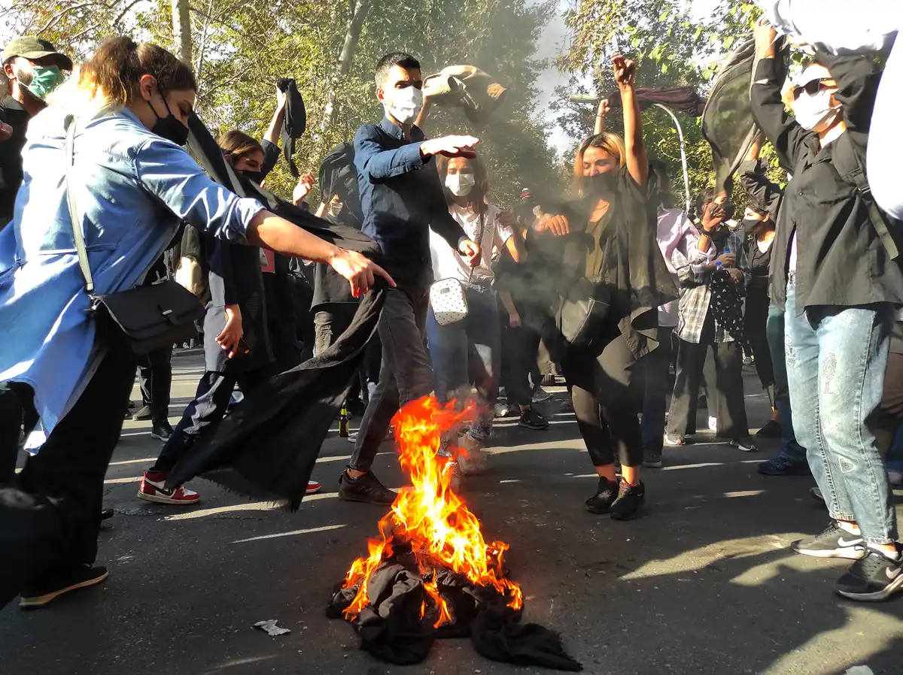

They’d choose the women who were pretty and suited their appetite …

他们会选择漂亮又合他们胃口的女人……

… then the officer would take one of them from the cell to a smaller, private room.”

……然后警官会把其中一个人从牢房带到一个更小的私人房间。”

“They would sexually assault them there.”

“他们会在那里对她们进行性侵犯。”

CNN Special Report

## How Iran's security forces use rape to quell protests

## 伊朗安全部队如何利用强奸来平息抗议

## Covert testimonies reveal sexual assaults on male and female activists as a women-led uprising spreads

## 随着女性领导的起义蔓延，秘密证词揭示了对男性和女性活动家的性侵犯

By Tamara Qiblawi, Barbara Arvanitidis, Nima Elbagir, Alex Platt, Artemis Moshtaghian, Gianluca Mezzofiore, Celine Alkhaldi and Muhammad Jambaz, CNN

作者：Tamara Qiblawi、Barbara Arvanitidis、Nima Elbagir、Alex Platt、Artemis Moshtaghian、Gianluca Mezzofiore、Celine Alkhaldi 和 Muhammad Jambaz，CNN

November 21, 2022

2022 年 11 月 21 日

**Haje Omeran, Iraq (CNN)** — A trickle of people passes through a normally busy border crossing in the mountains of northern Iraq. “It’s a big prison over there,” one Iranian woman says, gesturing to the hulking gate that marks the border with Iran’s Islamic Republic, which has been convulsed by protest for over two months.

**Haje Omeran，伊拉克（美国有线电视新闻网）** ——一小群人穿过伊拉克北部山区一个通常很繁忙的过境点。 “那边是一座大监狱，”一名伊朗妇女说，指着标志着伊朗伊斯兰共和国边界的笨重大门，伊朗伊斯兰共和国已经被抗议活动震撼了两个多月。

A portrait of the founder of Iran’s clerical regime, Ruhollah Khomeini, looms against a backdrop of rolling hills studded with streetlights. Snatches of travelers’ muted conversations punctuate an eerie silence.

伊朗文职政权创始人鲁霍拉·霍梅尼 (Ruhollah Khomeini) 的肖像隐约可见，背景是点缀着路灯的连绵起伏的丘陵。 旅行者低声谈话的片段打破了令人毛骨悚然的寂静。

Fear of indiscriminate arrest has made many reluctant to risk the journey. Some of the few who cross say the noose is tightening: protesters gunned down, curfews in the border villages and nighttime raids on homes.

由于害怕被不分青红皂白地逮捕，许多人不愿冒险踏上旅程。 少数过境者中的一些人说绞索正在收紧：抗议者被枪杀，边境村庄实行宵禁，夜间袭击房屋。

In hushed tones, they speak of female protesters in particular, and the horrors they say some have endured in Iran’s notorious detention facilities.

他们以压低的语调特别谈到了女性抗议者，以及他们所说的一些人在伊朗臭名昭著的拘留设施中所遭受的恐怖。

Iran’s government has closed the country off to non-accredited foreign journalists, regularly shuts down the internet and suppresses dissidents' voices with mass arrests. An extreme climate of fear prevails in Iran as the crackdown intensifies.

伊朗政府禁止未经认证的外国记者进入该国，定期关闭互联网并通过大规模逮捕来压制持不同政见者的声音。 随着镇压力度的加大，伊朗普遍存在极端的恐惧气氛。

One Kurdish-Iranian woman, whom CNN is calling Hana for her safety, says she both witnessed and suffered sexual violence while detained. “There were girls who were sexually assaulted and then transferred to other cities,” she said. “They are scared to talk about these things.”

美国有线电视新闻网为了她的安全而打电话给哈娜的一名库尔德伊朗妇女说，她在被拘留期间目睹并遭受了性暴力。 “有些女孩遭到性侵犯，然后被转移到其他城市，”她说。 “他们害怕谈论这些事情。”

Iranian protesters set their headscarves on fire while marching down a street on October 1, 2022 in Tehran, Iran. **Getty Images**

Women have played a central role in Iran’s uprising since it ignited two months ago. The slogan “Women, Life, Freedom” reverberates through anti-regime demonstrations in its original Kurdish (Jin, Jiyan, Azadi) and in Persian (Zan, Zendegi, Azadi). It is a nod to the 22-year-old Kurdish woman whose death sparked the protests — Jina (Mahsa) Amini was believed to have been brutally beaten by Iran’s morality police for improper hijab and died days later.

自两个月前爆发以来，妇女在伊朗起义中发挥了核心作用。 “妇女、生命、自由”的口号在其原始库尔德语（Jin、Jiyan、Azadi）和波斯语（Zan、Zendegi、Azadi）的反政权示威中回荡。 这是对 22 岁的库尔德妇女的致敬，她的死引发了抗议活动——据信 Jina (Mahsa) Amini 因戴头巾不当而遭到伊朗道德警察的残忍殴打，并在几天后死亡。

The rights of women have also been at the heart of debate among Iran’s clerical establishment since the protests began. Some clerics and politicians have called for the relaxing of social rules, while others doubled down, conflating the female protesters with what they call “loose women” who were merely pawns in a plot hatched by Western governments.

自抗议活动开始以来，妇女权利也一直是伊朗神职人员辩论的核心。 一些神职人员和政客呼吁放宽社会规则，而另一些人则加倍努力，将女性抗议者与他们所谓的“放荡妇女”混为一谈，她们只是西方政府策划的阴谋中的棋子。

In recent weeks, social media videos have emerged allegedly showing Iranian security forces sexually assaulting female demonstrators on the streets. Reports of sexual violence against activists in prisons began to surface.

最近几周，社交媒体上出现了据称显示伊朗安全部队在街头性侵犯女性示威者的视频。 针对监狱活动人士的性暴力的报道开始浮出水面。

With media access inside Iran severely constrained, CNN went to the region near Iraq’s border with Iran, interviewing eyewitnesses who'd left the country and verifying accounts from survivors and sources both in and outside Iran. CNN corroborated several reports of sexual violence against protesters and heard accounts of many more. At least one of these caused severe injury, and another involved the rape of an underage boy. In some of the cases CNN uncovered, the sexual assault was filmed and used to blackmail the protesters into silence, according to sources who spoke to the victims.

由于伊朗境内的媒体访问受到严重限制，CNN 前往伊拉克与伊朗边境附近的地区，采访了离开该国的目击者，并核实了伊朗境内外幸存者和消息来源的说法。 CNN 证实了多起针对抗议者的性暴力的报道，并听取了更多的报道。 其中至少有一起造成了严重的伤害，另一起涉及强奸一名未成年男孩。 据与受害者交谈的消息人士称，在 CNN 发现的一些案例中，性侵犯被拍摄下来并被用来勒索抗议者保持沉默。

Iranian officials have not yet responded to CNN’s request for comment on the abuses alleged in this report.

伊朗官员尚未回应 CNN 就本报告中指控的虐待行为发表评论的请求。

___

Armita Abbasi, 20, bore all the hallmarks of a Gen Z-er. Her edgy hairdo was dyed platinum blonde and she had an eyebrow piercing. She wore colored contact lenses, and filmed TikToks with her cats from her living room.

20 岁的 Armita Abbasi 具有 Z 世代的所有特征。 她前卫的发型染成了铂金金色，眉毛上有一个穿孔。 她戴着彩色隐形眼镜，在客厅里和她的猫一起拍摄 TikToks。

The uprising changed her life, and Iran’s security forces appear to have subjected her to some of the worst of their brutality.

起义改变了她的生活，伊朗安全部队似乎让她遭受了最严重的暴行。

After the protests began, social media posts under Abbasi’s name became charged with unrestrained criticism of Iran’s regime. It is unclear if she participated in the protests. Yet, unlike most Iranian dissidents inside the country, she did not anonymize her anti-regime posts.

抗议活动开始后，阿巴西名下的社交媒体帖子被指控对伊朗政权进行肆无忌惮的批评。 目前尚不清楚她是否参加了抗议活动。 然而，与国内大多数伊朗持不同政见者不同，她没有匿名发布她的反政权帖子。

A protest in Abbasi’s hometown of Karaj which has been a flashpoint in the nationwide uprising. **IranWire**

She was arrested in her hometown of Karaj, just west of Tehran, nearly a month after the onset of the demonstrations. In an October 29 statement, the government claimed she was “the leader of the riots” and that police discovered “10 Molotov cocktails” in her apartment.

在示威活动开始近一个月后，她在家乡德黑兰以西的卡拉季被捕。 在 10 月 29 日的一份声明中，政府声称她是“暴乱的领导者”，警方在她的公寓里发现了“10 枚莫洛托夫鸡尾酒”。

It was an ominous statement that seemed to imply that Iran’s justice system would reserve a harsh punishment for the 20-year-old. But it also served as a denial of a series of leaked accounts on Instagram that had caused uproar on social media in the days since her arrest, and which turned Abbasi — like Amini and [Nika Shahkarami](https://www.cnn.com/2022/10/27/middleeast/iran-nika-shahkarami-investigation-intl-cmd/index.html) before her — into a symbol of Iran’s protest movement.

这是一个不祥的声明，似乎暗示伊朗的司法系统将对这位 20 岁的年轻人进行严厉的惩罚。 但它也否认了 Instagram 上一系列泄露的账户，这些账户在她被捕后的几天里在社交媒体上引起了轩然大波，这让阿巴西——就像她之前的阿米尼和 [尼卡沙赫卡拉米](https://www.cnn.com/2022/10/27/middleeast/iran-nika-shahkarami-investigation-intl-cmd/index.html) 一样——变成了伊朗抗议运动的象征。

The contents of the leaked accounts — conversations between medics on Instagram’s private messaging service — suggested that Iranian security forces tortured and sexually assaulted Abbasi.

泄露账户的内容——医护人员在 Instagram 的私人消息服务上的对话——表明伊朗安全部队对阿巴西实施酷刑和性侵犯。

On October 17, Abbasi was rushed to the Imam Ali hospital in Karaj, accompanied by plainclothes officers, according to leaks from that hospital. Her head had been shaved and she was shaking violently. In the accounts, the medical staff attending to her spoke of the horror they felt when they saw evidence of brutal rape.

根据该医院的泄密消息，10 月 17 日，阿巴西在便衣警察的陪同下被送往卡拉季的伊玛目阿里医院。 她的头被剃光了，她在剧烈地颤抖。 在叙述中，照顾她的医务人员谈到了他们看到残忍强奸证据时的恐惧。

An insider at Imam Ali hospital confirmed the veracity of those leaks to CNN. The source asked to remain anonymous for security reasons.

伊玛目阿里医院的一位内部人士向 CNN 证实了这些泄密事件的真实性。 出于安全原因，该消息人士要求匿名。

“When she first came in, (the officers) said she was hemorrhaging from her rectum… due to repeated rape. The plainclothes men insisted that the doctor write it as rape prior to arrest,” wrote one member of the medical staff in one of the messages.

“当她第一次进来时，（警官）说她的直肠正在出血……由于多次被强奸。 便衣男子坚持要医生在逮捕前将其写成强奸，”一名医务人员在其中一条信息中写道。

“After the truth became obvious to all, they changed the whole script,” wrote the medic. CNN can confirm that four to five medics leaked the messages to social media. All of them said they believed she was sexually assaulted in custody.

“在真相大白之后，他们改变了整个剧本，”军医写道。 美国有线电视新闻网可以确认四到五名医务人员将消息泄露给社交媒体。 他们都说他们相信她在拘留期间遭到性侵犯。

“To make it short, they screwed up,” that medic added of the security forces. “They screwed up and they don’t know how to put it together again.”

“简而言之，他们搞砸了，”那名军医在谈到安全部队时补充道。 “他们搞砸了，他们不知道如何重新组合起来。”

In its statement, the Iranian government said Abbasi was treated for “digestive problems.” Medics at the Imam Ali hospital said the claim did not tally with the symptoms Abbasi exhibited. Abbasi was also treated by a gynecologist and a psychiatrist, which the medics said was also inconsistent with the government’s account.

伊朗政府在声明中表示，阿巴西因“消化问题”接受治疗。 伊玛目阿里医院的医务人员表示，这一说法与阿巴西表现出的症状不符。 阿巴西还接受了一名妇科医生和一名精神科医生的治疗，医务人员表示这也与政府的说法不符。

CNN has presented the leaked accounts of Abbasi’s injuries to an Iranian doctor outside Iran who said the symptoms as described indicated brutal sexual assault.

美国有线电视新闻网 (CNN) 向伊朗境外的一名伊朗医生提供了阿巴西 (Abbasi) 受伤的泄露信息，该医生表示，所描述的症状表明遭到了残酷的性侵犯。

> “She was feeling so bad we thought she had cancer.”
> 
> – A medic who witnessed Abbasi’s injuries in hospital

The leaks point to a highly secretive process heavily controlled by Iranian security forces. One medic said on social media that police prevented staff from speaking to Abbasi, and that the hospital leadership’s account of her medical condition kept changing. When CNN called the Imam Ali Hospital, a staff member said they had no record of her, despite the government’s acknowledgement that she was treated there.

泄密事件指向一个高度机密的过程，该过程受到伊朗安全部队的严格控制。 一名医务人员在社交媒体上表示，警方阻止工作人员与阿巴西交谈，而且医院领导对她病情的描述一直在变化。 当 CNN 致电伊玛目阿里医院时，一名工作人员表示他们没有她的记录，尽管政府承认她在那里接受治疗。

According to the leaked accounts, security forces removed Abbasi from the hospital through a rear entrance just before her family arrived to see her. “My heart which saw her and couldn’t free her is driving me crazy,” wrote one medic.

根据泄露的说法，就在她的家人来看她之前，安全部队通过后门将阿巴西带离了医院。 “我的心看到了她却无法释放她，这让我发疯，”一位医生写道。

Abbasi is currently being held in Karaj’s notorious Fardis prison, according to the Iranian government. CNN has been unable to reach her or her family members for comment.

据伊朗政府称，阿巴西目前被关押在卡拉季臭名昭著的法迪斯监狱。 CNN 无法联系到她或她的家人发表评论。

___

Before Hana was arrested, she had been warned that women in Iranian prisons were “being treated very badly.” Her mother received a phone call from her neighbor — a high-level official in Mahabad prison in the country’s northwest — urging her to not let her daughters out of their home “under any circumstances,” Hana tells CNN.

在哈娜被捕之前，她曾被警告说，伊朗监狱中的女性“受到了非常恶劣的对待”。 哈娜告诉美国有线电视新闻网，她的母亲接到邻居的电话——该国西北部马哈巴德监狱的一名高级官员——敦促她“在任何情况下”都不要让女儿们离开家。

Hana says she was undeterred. She joined the protests and, like many other female demonstrators, she spun around and danced as she waved her headscarf in the air before burning it, in what has become a ritualistic feature of the nationwide protests.

哈娜说她没有被吓倒。 她加入了抗议活动，并像许多其他女性示威者一样，在焚烧头巾之前在空中挥舞着头巾并转身跳舞，这已成为全国抗议活动的一个仪式特征。

When she was arrested, Iranian police said they saw her torching her scarf in surveillance footage, she says.

她说，当她被捕时，伊朗警方说他们在监控录像中看到她在焚烧围巾。

Hana says she was held in a detention center at a police station in Iran’s northwestern city of Urmia for 24 hours.

哈娜说，她在伊朗西北部城市乌尔米亚的一个警察局拘留中心被关押了 24 小时。

Unlike most of her fellow activists, Hana fled Iran. For days, she and her uncle’s family followed a group of Kurdish smugglers as they weaved through the border region’s mountains. Only a handful of protesters have embarked on the perilous journey. That’s because the Iranian side of the border is heavily militarized, and security forces regularly shoot-to-kill those who cross, and smuggle goods, illegally.

与她的大多数活动家同行不同，哈娜逃离了伊朗。 几天来，她和她叔叔的家人一直在跟踪一群库尔德走私者，他们穿梭于边境地区的群山之中。 只有少数抗议者踏上了危险的旅程。 这是因为边界的伊朗一侧高度军事化，安全部队经常开枪打死那些非法越境和走私货物的人。

Hana now lives with her relatives in a mountain town in Iraqi Kurdistan. Her jet-black hair tumbles down to her waist. A white scarf is wound around her neck on the day CNN speaks with her. It covers a purple mark where a security officer forced himself on her, she says, and violently kissed her.

哈娜现在和她的亲戚住在伊拉克库尔德斯坦的一个山城里。 她乌黑的头发垂到腰间。 在 CNN 采访她的那天，一条白色围巾围在她的脖子上。 她说，它覆盖了一个紫色标记，一名保安人员强行压在她身上，并猛烈地亲吻了她。

Outside the tiny interrogation cell where Hana says the policeman assaulted her — assailing her with promises of freedom as he hinted heavily at demands for sexual favors — a fight had broken out, distracting the policeman.

在 Hana 说警察殴打她的狭小审讯室外——他用自由的承诺攻击她，同时他强烈暗示要求性方面的好处——一场打斗爆发了，分散了警察的注意力。

> “They will threaten (the woman) not to talk about the abuse, who did it to her, who insulted her, and who sexually violated her.”
> 
> — Hana

She recounts how a girl had been corralled into another interrogation room as her teenage brother demanded he join her to make sure nothing “was happening to her.” Hana describes the police beating the boy with batons. He lay on the ground, wounded and having soiled himself during the beating, she recalls. Meanwhile, his sister was screaming in the interrogation room. Hana says she believes the woman was being sexually assaulted.

她讲述了一个女孩是如何被关进另一个审讯室的，因为她十几岁的弟弟要求他加入她的行列，以确保“她没有发生任何事情”。 哈娜描述了警察用警棍殴打这个男孩。 她回忆说，他躺在地上，在殴打期间受伤并弄脏了自己。 与此同时，审讯室里，他的姐姐正在惨叫。 哈娜说，她认为这名女子遭到了性侵犯。

Her female cellmates told her they had been raped in the police station, she says. When Hana’s interrogator returned, Hana says he resumed making unwanted sexual advances on her. But within minutes, her father had come to bail her out, saving her, she believes, from the worst.

她说，她的女狱友告诉她她们在警察局被强奸了。 当 Hana 的审讯者回来时，Hana 说他继续对她进行不受欢迎的性挑逗。 但几分钟后，她的父亲就来救她了，她相信，她从最坏的情况中拯救了她。

Other women were not so lucky, she says. Many of those held at the station were denied bail and disappeared into a labyrinthine prison system which includes secret detention centers in military bases, according to sources and rights groups. [Kurdish rights groups have repeatedly reported](https://kurdistanhumanrights.org/en/a-report-by-kurdistan-human-rights-network-on-secret-detention-centres-of-iranian-security-institutions-in-kermanshah-sanandaj-orumiyeh/) that hundreds of people have been forcibly disappeared in the Kurdish regions of Iran, and have documented evidence of secret detention centers in military bases.

她说，其他女性就没那么幸运了。 据消息人士和人权组织称，许多被关押在该站的人被拒绝保释，并消失在迷宫般的监狱系统中，其中包括军事基地的秘密拘留中心。 [库尔德人权组织一再报告称](https://kurdistanhumanrights.org/en/a-report-by-kurdistan-human-rights-network-on-secret-detention-centres-of-iranian-security-institutions-in-kermanshah-sanandaj-orumiyeh/) ，数百人在伊朗库尔德地区被迫失踪，并记录了军事基地秘密拘留中心的证据。

___

Video: Watch CNN’s interview with a women who tells how she endured sexual assault in an Iranian jail. 06:31

Most of the reports of sexual violence reviewed by CNN since the protests sparked by Amini’s death began came from the west of the country, where large swathes of the region are predominantly Kurdish. Throughout this investigation, CNN has spoken to sources in various flashpoints of the country’s protests, including rights groups and activists linked to the Kurdish-majority areas, activists in regular contact with female detainees in key prisons, such as Evin prison in Tehran, and a Baluchi activist network connected to the southeast Baluch majority of the country.

自阿米尼之死引发的抗议活动开始以来，美国有线电视新闻网审查的大部分性暴力报道都来自该国西部，该地区的大片地区主要是库尔德人。 在整个调查过程中，CNN 与该国抗议活动的各个爆发点的消息来源进行了交谈，包括与库尔德人占多数的地区有关的权利团体和活动人士、与主要监狱（如德黑兰的 Evin 监狱）中的女性被拘留者经常接触的活动人士，以及俾路支活动家网络连接到该国东南部的俾路支大部分地区。

Alongside the authorities' widespread detention of protesters, the media blackout in the country has worsened. The stigma attached to victims of sexual violence adds another layer of secrecy to what’s unfolding.

除了当局广泛拘留抗议者外，该国的媒体封锁也有所恶化。 性暴力受害者身上的耻辱为正在发生的事情增加了另一层秘密。

Despite the difficulty of investigating these claims and the risks run by victims who report them, CNN has learned of 11 incidents — sometimes involving multiple victims — of sexual violence against protesters in Iranian prisons and has corroborated nearly half of them. Almost all occurred in the Kurdish areas.

尽管很难调查这些说法以及举报这些说法的受害者所面临的风险，但 CNN 了解到伊朗监狱中发生了 11 起针对抗议者的性暴力事件——有时涉及多名受害者，并证实了其中近一半的事件。 几乎都发生在库尔德地区。

In one case, CNN received the audio testimony of a 17-year-old boy who said he and his friends were raped and electrocuted in detention after they were arrested in the protests. Testimonies heard by CNN suggest that the sexual assault of the underage boy was not an isolated incident.

在一个案例中，CNN 收到了一名 17 岁男孩的音频证词，他说他和他的朋友在抗议活动中被捕后，在拘留期间遭到强奸和电击。 美国有线电视新闻网听到的证词表明，对这名未成年男孩的性侵犯并非孤立事件。

“They brought four men over who had been beaten, screaming intensely in another cell. And one of the men who was tortured, was sent to the waiting room where I was,” the boy told CNN. “I asked him what all that screaming was about? He said they are raping the men."

“他们带来了四个被殴打的人，他们在另一个牢房里尖叫着。 其中一名遭受酷刑的男子被送到我所在的候诊室，”男孩告诉美国有线电视新闻网。 “我问他尖叫是怎么回事？ 他说他们正在强奸这些人。”

A security guard overheard the conversation about the sexual assault, the boy said, after which he proceeded to torture him. The boy said he then was also raped.

男孩说，一名保安无意中听到了关于性侵犯的谈话，之后他开始折磨他。 男孩说他后来也被强奸了。

> “I asked him what all that screaming was about? He said they are raping the men.”
> 
> — A 17-year-old boy in Kurdish-majority Iran

International rights groups Human Rights Watch and Amnesty International have also said that they recorded several instances of sexual assault in prisons since the onset of the protests in mid-September.

国际人权组织人权观察和国际特赦组织也表示，自 9 月中旬抗议活动开始以来，他们记录了几起监狱中的性侵犯事件。

The head of the Kurdistan Human Rights network, Rebin Rahmani, told CNN that two women in detention, with whom he spoke, were threatened with the rape of their teenage sisters as a means of pressuring them into giving a forced TV confession. In one of those incidents, security forces brought the woman’s teenage sister to the interrogation room and asked her if she was “prepared” to let them rape her sister, he said, citing the woman’s account. The woman gave in and made the confession, she told him.

库尔德斯坦人权网络的负责人雷宾·拉赫马尼 (Rebin Rahmani) 告诉美国有线电视新闻网，与他交谈过的两名被拘留的妇女受到威胁，要强奸她们十几岁的姐妹，以此迫使她们在电视上被迫认罪。 在其中一起事件中，安全人员将这名妇女十几岁的妹妹带到审讯室，问她是否“准备好”让他们强奸她的妹妹，他说，引用了这名妇女的说法。 女人屈服了，认罪了，她告诉他。

CNN relied on sources and survivors inside Iran risking their freedoms and lives to report the sexual violence. In Armita Abbasi’s case, her apparently brutal rape is unlikely to have become public knowledge if the medics had not leaked the details to the press and to social media.

CNN 依靠伊朗境内的消息来源和幸存者冒着自由和生命危险来报道性暴力事件。 在阿米塔·阿巴西 (Armita Abbasi) 的案例中，如果医务人员没有向新闻界和社交媒体泄露细节，她明显遭到残忍的强奸是不太可能成为公众所知的。

“I’m not trying to spread fear and horror,” wrote one medic from Imam Ali hospital in a social media post. “But this is the truth. A crime is happening and I can’t remain silent.”

“我不是要散布恐惧和恐惧，”伊玛目阿里医院的一名医生在社交媒体帖子中写道。 “但这是事实。 犯罪正在发生，我不能保持沉默。”

_Correction: This article has been updated to remove a reference to a criticism about protesters allegedly made by Zeinab Soleimani, the daughter of the late general Qassem Soleimani, the authenticity of which could not be independently confirmed by CNN._

_更正：本文已更新，删除了已故将军 Qassem Soleimani 的女儿 Zeinab Soleimani 对抗议者的批评，CNN 无法独立证实其真实性。_
