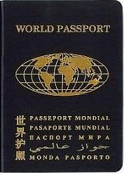
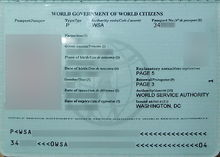
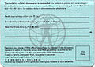
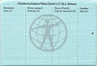
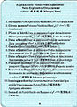
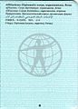
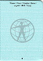
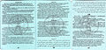
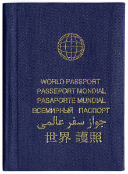

Current view of World Passport.

The **World Passport** is a [fantasy travel document](https://en.wikipedia.org/wiki/Camouflage_passport#Fantasy_passports "伪装护照") sold by the [World Service Authority](https://en.wikipedia.org/wiki/World_Service_Authority "World Service Authority"), a non-profit organization founded by [Garry Davis](https://en.wikipedia.org/wiki/Garry_Davis " Garry Davis") in 1954.<a href="https://en.wikipedia.org/wiki/World_Passport#cite_note-1">[1]</a><a href="https://en.wikipedia.org/wiki/World_Passport#cite_note-European_Council-2">[2]</a>

的 **World Passport** 是 [幻想旅行证件](https://en.wikipedia.org/wiki/Camouflage_passport#Fantasy_passports "伪装护照") World Service Authority 出售 [， World Service Authority](https://en.wikipedia.org/wiki/World_Service_Authority "World Service Authority") 创立的非营利组织 [是 Garry Davis](https://en.wikipedia.org/wiki/Garry_Davis " Garry Davis") 于 1954 年 <a href="https://en.wikipedia.org/wiki/World_Passport#cite_note-1">。 [1] </a> <a href="https://en.wikipedia.org/wiki/World_Passport#cite_note-European_Council-2">[2]</a>

## Appearance and price\[[edit](https://en.wikipedia.org/w/index.php?title=World_Passport&action=edit&section=1 "Edit section: Appearance and price")\]

## 外观和价格 \[ [编辑](https://en.wikipedia.org/w/index.php?title=World_Passport&action=edit&section=1 "编辑部分：外观和价格") \]

Data page of the World Passport.

The World Passport is similar in appearance to a genuine national [passport](https://en.wikipedia.org/wiki/Passport "护照") or other such authentic [travel document](https://en.wikipedia.org/wiki/Travel_document "旅行证件"). In 1979 the World Passport was a 42-page document, with a dark blue cover, and text in Arabic, Chinese, English, French, Russian, Spanish, and [Esperanto](https://en.wikipedia.org/wiki/Esperanto "世界语"). It contained a five-page section for medical history and a six-page section for listing organisational affiliation. The fee charged at that time was [US$](https://en.wikipedia.org/wiki/United_States_dollar "美元")32 plus postage for a three-year World Passport that could be renewed for a further two years.<a href="https://en.wikipedia.org/wiki/World_Passport#cite_note-Bangor-3">[3]</a>

世界护照在外观上与真正的国家 [护照](https://en.wikipedia.org/wiki/Passport "护照") 或其他此类真实 [旅行证件](https://en.wikipedia.org/wiki/Travel_document "旅行证件") 相似。 1979 年的世界护照是一份 42 页的文件，深蓝色封面，文字有阿拉伯文、中文、英文、法文、俄文、西班牙文和 [世界语](https://en.wikipedia.org/wiki/Esperanto "世界语") 。 它包含一个五页的病史部分和一个六页的组织隶属关系部分。 当时收取的费用是 [32 美元](https://en.wikipedia.org/wiki/United_States_dollar "美元") 加上邮费，可以购买三年期的世界护照，可以再续签两年。 <a href="https://en.wikipedia.org/wiki/World_Passport#cite_note-Bangor-3">[3]</a>

The version of the World Passport current as of 2017 was produced in January 2007. It has an embedded "ghost" photo for security, covered with a plastic film. Its data page is in the format of a [machine-readable passport](https://en.wikipedia.org/wiki/Machine-readable_passport "机读护照"), with an alphanumeric code bar in the machine-readable zone (MRZ) enabling it to be scanned by an optical reader. However, in place of a valid [ISO 3166-1 alpha-3](https://en.wikipedia.org/wiki/ISO_3166-1_alpha-3 "ISO 3166-1 alpha-3") code in the MRZ "issuer" and "nationality" fields, it uses the non-standard code "WSA".

截至 2017 年 当前版本的世界护照是在 2007 年 1 月制作的。它有一张嵌入的安全“幽灵”照片，上面覆盖着塑料薄膜。 它的数据页采用 [机器可读护照](https://en.wikipedia.org/wiki/Machine-readable_passport "机器可读护照") 的格式，在机器可读区 (MRZ) 中有一个字母数字代码条，使其能够被光学阅读器扫描。 代替 MRZ“发行人”和“国籍”字段中的有效 [ISO 3166-1 alpha-3](https://en.wikipedia.org/wiki/ISO_3166-1_alpha-3 "ISO 3166-1 alpha-3") 但是，它使用非标准代码“WSA” 代码。

According to the WSA website, the fee is $75 for a three-year World Passport, $100 for five years, and $125 for ten years. A "World Donor Passport" valid for fifteen years with a special cover is issued gratis to donors of at least $500 which, according to the WSA, is used to provide free documents to refugees and stateless persons.<a href="https://en.wikipedia.org/wiki/World_Passport#cite_note-ApplicationForm-4">[4]</a><a href="https://en.wikipedia.org/wiki/World_Passport#cite_note-5">[5]</a> In addition, the customer can choose between two World Passport covers: "World Passport" or "World Government Passport". The WSA recommends their customers purchase the second option.<a href="https://en.wikipedia.org/wiki/World_Passport#cite_note-6">[6]</a>

根据 WSA 网站，三年期世界护照的费用为 75 美元，五年期为 100 美元，十年期为 125 美元。 至少 500 美元的捐助者可免费获得有效期为 15 年的“世界捐助者护照”，根据 WSA 的说法，该护照用于向难民和无国籍人士提供免费证件。 <a href="https://en.wikipedia.org/wiki/World_Passport#cite_note-ApplicationForm-4">[4] </a> <a href="https://en.wikipedia.org/wiki/World_Passport#cite_note-5">[5] </a> 此外，客户可以选择两种世界护照封面：“世界护照”或“世界政府护照”。 WSA 建议他们的客户购买第二种选择。 <a href="https://en.wikipedia.org/wiki/World_Passport#cite_note-6">[6]</a>

A potential customer must provide as proof of identity a notarized certification of the details on the form, a copy of their national identity papers, or a fingerprint from their right index finger.<a href="https://en.wikipedia.org/wiki/World_Passport#cite_note-ApplicationForm-4">[4]</a> People have been known to obtain World Passports in names other than their legal names; see [the relevant section below](https://en.wikipedia.org/wiki/World_Passport#Sale_by_third_parties).

潜在客户必须提供经过公证的表格详细信息证明、国民身份证复印件或右手食指指纹作为身份证明。 <a href="https://en.wikipedia.org/wiki/World_Passport#cite_note-ApplicationForm-4">[4] </a> 众所周知，人们以合法姓名以外的名义获得世界护照； 请参阅 [下面的相关部分](https://en.wikipedia.org/wiki/World_Passport#Sale_by_third_parties) 。

- 

  Renewals page.

- 
- 

  Children's information page.

- 

  Children's information page.

  儿童信息页面。

- 

  Notes.

- 
- 

  Affiliations page.

- 

  Affiliations page.

  隶属关系页面。

- 

  Visa page.

- 
- 

  Attention.

- 

## As a travel document\[[edit](https://en.wikipedia.org/w/index.php?title=World_Passport&action=edit&section=2 "编辑部分：作为旅行证件")\]

## 作为旅行证件 \[ [编辑](https://en.wikipedia.org/w/index.php?title=World_Passport&action=edit&section=2 "编辑部分：作为旅行证件") \]

The appearance is so similar to a genuine passport that in 1974 a criminal case was lodged against Garry Davis in France regarding his sale of World Passports.<a href="https://en.wikipedia.org/wiki/World_Passport#cite_note-:0-7">[7]</a>

外观与真正的护照非常相似，以至于 1974 年法国对加里·戴维斯 (Garry Davis) 出售世界护照一事提起刑事诉讼。 <a href="https://en.wikipedia.org/wiki/World_Passport#cite_note-:0-7">[7]</a>

According to the WSA, the version of the document introduced in 2007 was filed as a Machine Readable Travel Document (MRTD) with the [International Civil Aviation Organization](https://en.wikipedia.org/wiki/International_Civil_Aviation_Organization "International Civil Aviation Organization") (ICAO).<a href="https://en.wikipedia.org/wiki/World_Passport#cite_note-8">[8]</a> However, ICAO documents on MRTDs cite the World Service Authority and its World Passport as an example of "Fantasy Documents".<a href="https://en.wikipedia.org/wiki/World_Passport#cite_note-9">[9]</a><a href="https://en.wikipedia.org/wiki/World_Passport#cite_note-10">[10]</a>

据 WSA 称，2007 年引入的文件版本作为机读旅行证件 (MRTD) 提交给 [国际民用航空组织](https://en.wikipedia.org/wiki/International_Civil_Aviation_Organization " International Civil Aviation Organization") (ICAO)。 <a href="https://en.wikipedia.org/wiki/World_Passport#cite_note-8">[8] </a> 然而，国际民航组织关于机读旅行证件的文件将世界服务管理局及其世界护照作为“幻想文件”的例子。 <a href="https://en.wikipedia.org/wiki/World_Passport#cite_note-9">[9] </a> <a href="https://en.wikipedia.org/wiki/World_Passport#cite_note-10">[10]</a>

### Notable acceptances\[[edit](https://en.wikipedia.org/w/index.php?title=World_Passport&action=edit&section=3 "编辑部分：显着接受")\]

### 著名的接受 \[ [编辑](https://en.wikipedia.org/w/index.php?title=World_Passport&action=edit&section=3 "编辑部分：显着接受") \]

Success in crossing a border using a World Passport is generally attributable to the whim or ignorance of individual immigration officers, not official recognition of the document.<a href="https://en.wikipedia.org/wiki/World_Passport#cite_note-Engber-11">[11]</a> The World Service Authority website has scans of letters dating from many decades ago from six countries ([Burkina Faso](https://en.wikipedia.org/wiki/Burkina_Faso "布基纳法索"), [Ecuador](https://en.wikipedia.org/wiki/Ecuador "厄瓜多尔"), [Mauritania](https://en.wikipedia.org/wiki/Mauritania "毛里塔尼亚"), [Tanzania](https://en.wikipedia.org/wiki/Tanzania "坦桑尼亚"), [Togo](https://en.wikipedia.org/wiki/Togo "多哥") and [Zambia](https://en.wikipedia.org/wiki/Zambia "赞比亚")) which the WSA claims is legal recognition of the World Passports. These letters of recognition are several decades old (1954 for Ecuador, 1972 for Burkina Faso, 1975 for Mauritania, 1995 for Tanzania, 1983 for Togo, 1973 for Zambia).<a href="https://en.wikipedia.org/wiki/World_Passport#cite_note-12">[12]</a>

使用世界护照成功过境通常归因于个别移民官员的心血来潮或无知，而不是对该文件的官方认可。 <a href="https://en.wikipedia.org/wiki/World_Passport#cite_note-Engber-11">[11] </a> 世界服务管理局网站扫描了几十年前来自六个国家（ [布基纳法索](https://en.wikipedia.org/wiki/Burkina_Faso "布基纳法索") 、 [厄瓜多尔](https://en.wikipedia.org/wiki/Ecuador "厄瓜多尔") 、 [毛里塔尼亚](https://en.wikipedia.org/wiki/Mauritania "毛里塔尼亚") 、 [坦桑尼亚](https://en.wikipedia.org/wiki/Tanzania "坦桑尼亚") 、 [多哥](https://en.wikipedia.org/wiki/Togo "多哥") 和 [赞比亚](https://en.wikipedia.org/wiki/Zambia "赞比亚") ）的信件，WSA 声称这是对世界护照的法律承认。 这些认可信已有数十年历史（厄瓜多尔 1954 年、布基纳法索 1972 年、毛里塔尼亚 1975 年、坦桑尼亚 1995 年、多哥 1983 年、赞比亚 1973 年）。 <a href="https://en.wikipedia.org/wiki/World_Passport#cite_note-12">[12]</a>

According to the World Service Authority website, some World Passports have reportedly been accepted on a case-by-case basis by over 180 countries (i.e., they have been [stamped](https://en.wikipedia.org/wiki/Passport_stamp "护照印章") with a national visa or entry or exit stamp), and according to the World Service Authority some countries in the past accorded the document legal recognition.<a href="https://en.wikipedia.org/wiki/World_Passport#cite_note-wsa-visa-13">[13]</a><a href="https://en.wikipedia.org/wiki/World_Passport#cite_note-14">[14]</a>[<i><a href="https://en.wikipedia.org/wiki/Wikipedia:No_original_research#Primary,_secondary_and_tertiary_sources" title="维基百科：无原创研究">non-primary source needed</a></i>]

据世界服务管理局网站称，据报道，一些世界护照已被 180 多个国家逐案接受（即，它们已 [加盖](https://en.wikipedia.org/wiki/Passport_stamp "护照印章") 国家签证或入境或出境印章），根据世界 Service Authority 一些国家过去给予文件法律承认。 <a href="https://en.wikipedia.org/wiki/World_Passport#cite_note-wsa-visa-13">[13] </a> <a href="https://en.wikipedia.org/wiki/World_Passport#cite_note-14">[14] </a> [ <i><a href="https://en.wikipedia.org/wiki/Wikipedia:No_original_research#Primary,_secondary_and_tertiary_sources" title="维基百科：无原创研究">需要非主要来源 </a></i>]

The World Passport came under increased international scrutiny in 1996, after the [hijacking of the MS _Achille Lauro_](https://en.wikipedia.org/wiki/Achille_Lauro_hijacking " Achille Lauro 劫持"). In the aftermath of the incident, one of the captured hijackers, Youssef Majed al-Molqi, escaped imprisonment in Italy and used a World Passport which he had purchased in 1988 to leave the country and travel to Spain before he was recaptured.<a href="https://en.wikipedia.org/wiki/World_Passport#cite_note-15">[15]</a><a href="https://en.wikipedia.org/wiki/World_Passport#cite_note-al-Molqi-16">[16]</a><a href="https://en.wikipedia.org/wiki/World_Passport#cite_note-17">[17]</a>

后，世界护照受到了更严格的国际审查 [被劫持 _1996 年，在 MS Achille Lauro_](https://en.wikipedia.org/wiki/Achille_Lauro_hijacking "Achille Lauro 劫持") 。 事件发生后，其中一名被俘的劫机者 Youssef Majed al-Molqi 在意大利逃脱监禁，并使用他于 1988 年购买的世界护照离开该国前往西班牙，然后才被抓回。 <a href="https://en.wikipedia.org/wiki/World_Passport#cite_note-15">[15] </a> <a href="https://en.wikipedia.org/wiki/World_Passport#cite_note-al-Molqi-16">[16] </a> <a href="https://en.wikipedia.org/wiki/World_Passport#cite_note-17">[17]</a>

### Notable rejections\[[edit](https://en.wikipedia.org/w/index.php?title=World_Passport&action=edit&section=4 "编辑部分：显着拒绝")\]

### 值得注意的拒绝 \[ [编辑](https://en.wikipedia.org/w/index.php?title=World_Passport&action=edit&section=4 "编辑部分：显着拒绝") \]

Many countries and territories say they do not recognize the World Passport because it is not issued by a competent government authority, and thus does not meet the definition of a [passport](https://en.wikipedia.org/wiki/Passport "护照"). By 1975, Garry Davis had already been detained twenty times for his attempts to cross international borders with a World Passport.<a href="https://en.wikipedia.org/wiki/World_Passport#cite_note-18">[18]</a>

许多国家和地区表示不承认世界护照，因为它不是由政府主管部门签发的，因此不符合 [护照](https://en.wikipedia.org/wiki/Passport "护照") 的定义。 到 1975 年，加里·戴维斯 (Garry Davis) 已经因试图持世界护照跨越国际边界而被拘留了 20 次。 <a href="https://en.wikipedia.org/wiki/World_Passport#cite_note-18">[18]</a>

#### Commonwealth of Independent States\[[edit](https://en.wikipedia.org/w/index.php?title=World_Passport&action=edit&section=5 "编辑部分：独立国家联合体")\]

#### 独立国家联合体 \[ [编辑](https://en.wikipedia.org/w/index.php?title=World_Passport&action=edit&section=5 "编辑部分：独立国家联合体") \]

The Russian government states that it does not recognise the World Passport. In a 1995 interview with _[Kommersant](https://en.wikipedia.org/wiki/Kommersant "外交部")_, a spokesman for the [Russian Ministry of Foreign Affairs](<https://en.wikipedia.org/wiki/Ministry_of_Foreign_Affairs_(Russia)> "（俄罗斯）")' Department of Consular Services stated that the World Passport is not an acceptable document for proving identity or citizenship status at Russian border crossings; only a [diplomatic passport](https://en.wikipedia.org/wiki/Diplomatic_passport "外交护照"), official passport, seaman's passport, or general civil passport are accepted.<a href="https://en.wikipedia.org/wiki/World_Passport#cite_note-Kommersant-19">[19]</a> However, one Russian media report claims that some members of the [House of Romanov](https://en.wikipedia.org/wiki/House_of_Romanov "罗曼诺夫之家"), travelling to [Saint Petersburg](https://en.wikipedia.org/wiki/Saint_Petersburg "圣彼得堡") for the reburial of the remains of one of their ancestors, were permitted by Russian authorities to obtain visas in their World Passports, in light of the special situation.<a href="https://en.wikipedia.org/wiki/World_Passport#cite_note-20">[20]</a>

俄罗斯政府声明不承认世界护照。 在 1995 年接受 _[生意人报](https://en.wikipedia.org/wiki/Kommersant "外交部")_ 领事服务司发言人 [俄罗斯外交部](<https://en.wikipedia.org/wiki/Ministry_of_Foreign_Affairs_(Russia)> "（俄罗斯）") 采访时表示，世界护照不是在俄罗斯过境点证明身份或公民身份的可接受文件； 只接受 [外交护照](https://en.wikipedia.org/wiki/Diplomatic_passport "外交护照") 、公务护照、海员护照或一般公民护照。 <a href="https://en.wikipedia.org/wiki/World_Passport#cite_note-Kommersant-19">[19] </a> 然而，一份俄罗斯媒体报道称， [俄罗斯当局允许罗曼诺夫](https://en.wikipedia.org/wiki/House_of_Romanov "罗曼诺夫之家") 家族的一些成员前往 [圣彼得堡](https://en.wikipedia.org/wiki/Saint_Petersburg "圣彼得堡") 重新安葬他们的一位祖先的遗体，并在他们的世界护照上获得签证。的特殊情况。 <a href="https://en.wikipedia.org/wiki/World_Passport#cite_note-20">[20]</a>

In December 2008, a man claiming to be a Russian citizen attempted to cross the border from [Latvia](https://en.wikipedia.org/wiki/Latvia "拉脱维亚") into [Belarus](https://en.wikipedia.org/wiki/Belarus "白俄罗斯") at the Urbany checkpoint using a World Passport; he stated he lost his Russian documents while in [Sweden](https://en.wikipedia.org/wiki/Sweden "瑞典"). He was arrested by the Belarusian border guards. A spokesman for Belarus' State Border Committee in an interview with a local newspaper stated that Belarus does not accept the World Passport at border crossings. He also claimed it was the first known case of its kind in the country.<a href="https://en.wikipedia.org/wiki/World_Passport#cite_note-Lenta-21">[21]</a><a href="https://en.wikipedia.org/wiki/World_Passport#cite_note-22">[22]</a>

2008 年 12 月，一名自称是俄罗斯公民的男子试图 [从拉脱维亚](https://en.wikipedia.org/wiki/Latvia "拉脱维亚") 越过边界进入 [白俄罗斯](https://en.wikipedia.org/wiki/Belarus "白俄罗斯") 使用世界护照在 Urbany 检查站 ； 他说他在 [瑞典](https://en.wikipedia.org/wiki/Sweden "瑞典") 时丢失了他的俄罗斯文件。 他被白俄罗斯边防部队逮捕。 白俄罗斯国家边境委员会发言人在接受当地一家报纸采访时表示，白俄罗斯在边境口岸不接受世界护照。 他还声称这是该国已知的第一例此类病例。 <a href="https://en.wikipedia.org/wiki/World_Passport#cite_note-Lenta-21">[21] </a> <a href="https://en.wikipedia.org/wiki/World_Passport#cite_note-22">[22]</a>

#### United States\[[edit](https://en.wikipedia.org/w/index.php?title=World_Passport&action=edit&section=6 "编辑栏目：美国")\]

#### 美国 \[ [编辑](https://en.wikipedia.org/w/index.php?title=World_Passport&action=edit&section=6 "编辑栏目：美国") \]

The [United States Department of State](https://en.wikipedia.org/wiki/United_States_Department_of_State "United States Department of State")'s official position on the World Passport is that it is a booklet produced by a private organisation upon payment of a fee, and not a passport. As early as 1991, the US [Air Transport Association](https://en.wikipedia.org/wiki/Air_Transport_Association "航空运输协会") specifically included the World Passport in a training film as an example of unacceptable travel papers.<a href="https://en.wikipedia.org/wiki/World_Passport#cite_note-Heartbreak-23">[23]</a> In 2012, a [Belizean](https://en.wikipedia.org/wiki/Belize "伯利兹") man attempted to enter the U.S. through the [Veterans International Bridge at Los Tomates](https://en.wikipedia.org/wiki/Veterans_International_Bridge_at_Los_Tomates "退伍军人国际桥在 Los Tomates") using a World Passport. The man in question had prior felony convictions for drug trafficking and immigration offences, and had previously been deported from the United States multiple times. He claimed that he wanted to speak with President Obama about genocide in Belize. In a [bench trial](https://en.wikipedia.org/wiki/Bench_trial " Bench trial"), Judge [Andrew S. Hanen](https://en.wikipedia.org/wiki/Andrew_S._Hanen " Andrew S. Hanen") found the man guilty of felony attempted re-entry after deportation.<a href="https://en.wikipedia.org/wiki/World_Passport#cite_note-24">[24]</a>

美国 [国务院](https://en.wikipedia.org/wiki/United_States_Department_of_State "美国国务院") 对世界护照的官方立场是，它是私人机构付费制作的小册子，并非护照。 早在 1991 年，美国 [航空运输协会](https://en.wikipedia.org/wiki/Air_Transport_Association "航空运输协会") 就专门将世界护照作为不可接受的旅行证件的例子列入培训片中。 <a href="https://en.wikipedia.org/wiki/World_Passport#cite_note-Heartbreak-23">[23] </a> 2012 年，一名 [伯利兹](https://en.wikipedia.org/wiki/Belize "伯利兹") 男子试图 [通过位于 Los Tomates 的退伍军人国际桥](https://en.wikipedia.org/wiki/Veterans_International_Bridge_at_Los_Tomates "的退伍军人国际桥") 使用世界护照 进入美国。 该男子曾因贩毒和移民罪被判重罪，此前曾多次被美国驱逐出境。 他声称他想与奥巴马总统谈谈伯利兹的种族灭绝问题。 在 [替补审判中](https://en.wikipedia.org/wiki/Bench_trial "Los Tomates Bench 审判") ，法官 [安德鲁·S·哈南 ( Andrew S. Hanen)](https://en.wikipedia.org/wiki/Andrew_S._Hanen "Andrew S. Hanen") 裁定该男子犯有重罪，在被驱逐出境后试图重新入境。 <a href="https://en.wikipedia.org/wiki/World_Passport#cite_note-24">[24]</a>

#### Other countries\[[edit](https://en.wikipedia.org/w/index.php?title=World_Passport&action=edit&section=7 "编辑栏目：其他国家")\]

#### 其他国家 \[ [编辑](https://en.wikipedia.org/w/index.php?title=World_Passport&action=edit&section=7 "编辑栏目：其他国家") \]

Activist [Kenneth O'Keefe](https://en.wikipedia.org/wiki/Kenneth_O%27Keefe "Kenneth O'Keefe") tried to travel to [Iraq](https://en.wikipedia.org/wiki/Iraq "伊拉克") using a World Passport in 2003, but was rejected transit rights by [Turkey](https://en.wikipedia.org/wiki/Turkey "土耳其"), and had to apply for an American passport to continue his journey.<a href="https://en.wikipedia.org/wiki/World_Passport#cite_note-O'Keefe-25">[25]</a><a href="https://en.wikipedia.org/wiki/World_Passport#cite_note-26">[26]</a>

2003 年，活动家 [肯尼思·奥基夫 (Kenneth O'Keefe](https://en.wikipedia.org/wiki/Kenneth_O%27Keefe "Kenneth O'Keefe") ) 试图使用世界护照前往 [伊拉克](https://en.wikipedia.org/wiki/Iraq "伊拉克") ，但被 [土耳其](https://en.wikipedia.org/wiki/Turkey "土耳其") 拒绝了过境权，不得不申请美国护照才能继续他的旅程。 <a href="https://en.wikipedia.org/wiki/World_Passport#cite_note-O'Keefe-25">[25] </a> <a href="https://en.wikipedia.org/wiki/World_Passport#cite_note-26">[26]</a>

In 2004, two men from [China](https://en.wikipedia.org/wiki/People%27s_Republic_of_China "中华人民共和国") on board [Cathay Pacific](https://en.wikipedia.org/wiki/Cathay_Pacific "国泰航空") Flight 302 from [Hong Kong](https://en.wikipedia.org/wiki/Hong_Kong "香港") to Guangzhou attempted to pass through immigration at [Guangzhou Baiyun International Airport](https://en.wikipedia.org/wiki/Guangzhou_Baiyun_International_Airport "广州白云国际机场") using World Passports. The officers at the airport arrested them for illegal entry.<a href="https://en.wikipedia.org/wiki/World_Passport#cite_note-27">[27]</a>

2004 年， [，两名中国](https://en.wikipedia.org/wiki/People%27s_Republic_of_China "People's Republic of China") 上 [飞往广州的国泰](https://en.wikipedia.org/wiki/Cathay_Pacific "国泰航空") 航空 302 航班 [从香港](https://en.wikipedia.org/wiki/Hong_Kong "香港") 在 [广州白云国际机场](https://en.wikipedia.org/wiki/Guangzhou_Baiyun_International_Airport "广州白云国际机场") 男子试图使用世界护照 过境。 机场的官员以非法入境为由逮捕了他们。 <a href="https://en.wikipedia.org/wiki/World_Passport#cite_note-27">[27]</a>

Also, though Garry Davis claims to have traveled to India using a World Passport and to have given one personally to [Jawaharlal Nehru](https://en.wikipedia.org/wiki/Jawaharlal_Nehru "贾瓦哈拉尔尼赫鲁"),<a href="https://en.wikipedia.org/wiki/World_Passport#cite_note-Nehru-28">[28]</a><a href="https://en.wikipedia.org/wiki/World_Passport#cite_note-29">[29]</a> in May 2007 an Indian citizen was arrested for attempting to _leave_ India at [Begumpet Airport](https://en.wikipedia.org/wiki/Begumpet_Airport "Begumpet 机场") using a World Passport. The man, intending to travel to the United States, had purchased what he believed was a genuine passport and visa. His travel agency and [Air India](https://en.wikipedia.org/wiki/Air_India "印度航空公司") staff both accepted his World Passport, but Indian immigration did not. The Times of India called it a clear case of "internet fraud" and stated that the man had been "duped".<a href="https://en.wikipedia.org/wiki/World_Passport#cite_note-30">[30]</a>

此外，尽管 Garry Davis 声称曾使用世界护照前往印度并亲自将一本护照交给了 [贾瓦哈拉尔尼赫鲁](https://en.wikipedia.org/wiki/Jawaharlal_Nehru "Jawaharlal Nehru") ， <a href="https://en.wikipedia.org/wiki/World_Passport#cite_note-Nehru-28">[28] </a> <a href="https://en.wikipedia.org/wiki/World_Passport#cite_note-29">[29] </a> 2007 年 5 月，一名印度公民因试图 _离开_ 世界护照在 [Begumpet 机场](https://en.wikipedia.org/wiki/Begumpet_Airport " Begumpet 机场") 使用 印度而被捕护照。 该男子打算前往美国，购买了他认为是真护照和签证的东西。 他的旅行社和 [印度航空公司](https://en.wikipedia.org/wiki/Air_India "印度航空公司") 的工作人员都接受了他的世界护照，但印度移民局没有。 《印度时报》称这是一起明显的“网络诈骗”案，并称这名男子被“骗了”。 <a href="https://en.wikipedia.org/wiki/World_Passport#cite_note-30">[30]</a>

The [Council of the European Union](https://en.wikipedia.org/wiki/Council_of_the_European_Union "欧盟理事会") has a table of travel documents entitling the holder to [cross external borders of Schengen states](https://en.wikipedia.org/wiki/Visa_policy_of_the_Schengen_Area "申根区") and which may be endorsed with a visa; the World Passport is listed as a [fantasy passport](https://en.wikipedia.org/wiki/Fantasy_passport "申根区梦幻护照") to which a visa may not be affixed.<a href="https://en.wikipedia.org/wiki/World_Passport#cite_note-European_Council-2">[2]</a>

欧盟 [理事会](https://en.wikipedia.org/wiki/Council_of_the_European_Union "梦幻护照的签证政策 欧盟理事会") 有一份旅行证件表，使持有人有权 [跨越申根国家的外部边界，](https://en.wikipedia.org/wiki/Visa_policy_of_the_Schengen_Area "签证政策") 并可获得签证； 世界护照被列为 [幻想护照](https://en.wikipedia.org/wiki/Fantasy_passport "的") ，不得贴签证。 <a href="https://en.wikipedia.org/wiki/World_Passport#cite_note-European_Council-2">[2]</a>

In February 2013, both Panama and Costa Rica rejected the use of the World Passport by Sage Million, a fugitive from Hawaii.<a href="https://en.wikipedia.org/wiki/World_Passport#cite_note-31">[31]</a>

2013 年 2 月，巴拿马和哥斯达黎加都拒绝了来自夏威夷的逃犯 Sage Million 使用世界护照。 <a href="https://en.wikipedia.org/wiki/World_Passport#cite_note-31">[31]</a>

Hip-hop artist and actor [Yasiin Bey (Mos Def)](https://en.wikipedia.org/wiki/Mos_Def "Mos Def") was arrested in South Africa on January 15, 2016 for attempting to leave the country using a World Passport. He had entered the country using an American passport and had lived in Cape Town since May 2013. South Africa's Department of Home Affairs released a statement saying that Mr. Bey would be allowed to appeal the immigration action and possibly seek permanent residency.<a href="https://en.wikipedia.org/wiki/World_Passport#cite_note-32">[32]</a><a href="https://en.wikipedia.org/wiki/World_Passport#cite_note-33">[33]</a>

嘻哈艺术家兼演员 [Yasiin Bey (Mos Def)](https://en.wikipedia.org/wiki/Mos_Def "Mos Def") 于 2016 年 1 月 15 日因试图使用世界护照离开该国而在南非被捕。 他使用美国护照进入该国，自 2013 年 5 月以来一直住在开普敦。南非内政部发表声明称，贝伊先生将被允许对移民行动提出上诉，并可能寻求永久居留权。 <a href="https://en.wikipedia.org/wiki/World_Passport#cite_note-32">[32] </a> <a href="https://en.wikipedia.org/wiki/World_Passport#cite_note-33">[33]</a>

### Use by refugees and stateless persons\[[edit](https://en.wikipedia.org/w/index.php?title=World_Passport&action=edit&section=8 "编辑部分：难民和无国籍人")\]

### 难民和无国籍人士使用 \[ [编辑](https://en.wikipedia.org/w/index.php?title=World_Passport&action=edit&section=8 "使用 编辑部分：难民和无国籍人使用") \]

The World Service Authority sells World Passports to refugees and other people who are unable to obtain valid, authentic travel documents. According to the WSA, refugees in camps are given free World Passports. WSA reports that it "has \[given out\] more than 10,000 free World Passports to refugees residing in camps throughout the world" and that it "has documentary evidence that the issuance of such passports may permit refugees to leave such camps to seek asylum elsewhere or to claim other rights often denied to refugees".<a href="https://en.wikipedia.org/wiki/World_Passport#cite_note-WSA_Organizationa_Fact_Sheet-34">[34]</a> However, many of those refugees have found World Passports to be useless.<a href="https://en.wikipedia.org/wiki/World_Passport#cite_note-Heartbreak-23">[23]</a> According to statements by Garry Davis in the mid-1970s, major users of World Passports at the time included persons in Southeast Asia fleeing from wars, as well as holders of [Rhodesian passports](https://en.wikipedia.org/wiki/Rhodesian_passport "罗得西亚护照") who were otherwise unable to travel internationally as no other country accepted their documents besides [South Africa](https://en.wikipedia.org/wiki/South_Africa "南非").<a href="https://en.wikipedia.org/wiki/World_Passport#cite_note-35">[35]</a>

世界服务管理局向难民和其他无法获得有效、真实旅行证件的人出售世界护照。 据 WSA 称，难民营中的难民可免费获得世界护照。 WSA 报告说，它“已经\[发放\] 10,000 多本免费世界护照给居住在世界各地难民营中的难民”，并且它“有书面证据表明发放此类护照可能允许难民离开此类难民营到其他地方寻求庇护或要求难民经常被剥夺的其他权利"。 <a href="https://en.wikipedia.org/wiki/World_Passport#cite_note-WSA_Organizationa_Fact_Sheet-34">[34] </a> 然而，其中许多难民发现世界护照毫无用处。 <a href="https://en.wikipedia.org/wiki/World_Passport#cite_note-Heartbreak-23">[23] </a> 根据加里·戴维斯 (Garry Davis) 在 20 世纪 70 年代中期的声明，当时世界护照的主要用户包括逃离战争的东南亚人，以及 [罗得西亚护照](https://en.wikipedia.org/wiki/Rhodesian_passport "Rhodesian passport") 持有人，他们无法像其他国家那样进行国际旅行 之外，还接受了他们的文件 [除了南非](https://en.wikipedia.org/wiki/South_Africa "南非") 。 <a href="https://en.wikipedia.org/wiki/World_Passport#cite_note-35">[35]</a>

Many [East African](https://en.wikipedia.org/wiki/East_Africa "东非") refugees arriving in [Nordic countries](https://en.wikipedia.org/wiki/Nordic_countries "北欧国家") in the early 1990s had World Passports.<a href="https://en.wikipedia.org/wiki/World_Passport#cite_note-36">[36]</a> In July 2011, a Georgian citizen attempted to pass through [Latvian](https://en.wikipedia.org/wiki/Latvia "拉脱维亚") border control with a World Passport, though he also had a valid [Georgian passport](https://en.wikipedia.org/wiki/Georgian_passport "格鲁吉亚护照") in his possession; after presenting his World Passport, he requested asylum in Latvia.<a href="https://en.wikipedia.org/wiki/World_Passport#cite_note-37">[37]</a>

许多 [的东非](https://en.wikipedia.org/wiki/East_Africa "东非") 抵达 [北欧国家](https://en.wikipedia.org/wiki/Nordic_countries "北欧国家") 在 1990 年代初 <a href="https://en.wikipedia.org/wiki/World_Passport#cite_note-36">难民都持有世界护照。 [36] </a> 2011 年 7 月，一名格鲁吉亚公民试图持世界护照通过 [拉脱维亚](https://en.wikipedia.org/wiki/Latvia "拉脱维亚") 边境管制，尽管他也持有有效的 [格鲁吉亚护照](https://en.wikipedia.org/wiki/Georgian_passport "格鲁吉亚护照") ； 在出示他的世界护照后，他在拉脱维亚申请庇护。 <a href="https://en.wikipedia.org/wiki/World_Passport#cite_note-37">[37]</a>

Another category of users of World Passports are [stowaways](https://en.wikipedia.org/wiki/Stowaway "偷渡") on ships. Vessel owners are legally responsible for the stowaways until they can find a country to let them ashore, but countries are often reluctant due to questions over the validity of the stowaways' documents. From 1992 to 2006 the WSA sold their document to such individuals on five occasions.<a href="https://en.wikipedia.org/wiki/World_Passport#cite_note-38">[38]</a>

World Passports 的另一类用户是 [的偷渡者](https://en.wikipedia.org/wiki/Stowaway "者偷渡者") 船上 。 船主对偷渡者负有法律责任，直到他们找到一个国家让他们上岸，但由于对偷渡者文件有效性的质疑，各国往往不愿意。 从 1992 年到 2006 年，WSA 五次将他们的文件卖给这些人。 <a href="https://en.wikipedia.org/wiki/World_Passport#cite_note-38">[38]</a>

## As an identity document\[[edit](https://en.wikipedia.org/w/index.php?title=World_Passport&action=edit&section=9 "编辑部分：作为身份证件")\]

## 作为身份证明文件 \[ [编辑](https://en.wikipedia.org/w/index.php?title=World_Passport&action=edit&section=9 "编辑部分：作为身份证件") \]

The World Service Authority promotes the World Passport not just as a document for international travel, but a "neutral, apolitical document of identity".<a href="https://en.wikipedia.org/wiki/World_Passport#cite_note-39">[39]</a> Investor [Doug Casey](https://en.wikipedia.org/wiki/Doug_Casey "Doug Casey"), himself a World Passport customer, has suggested that a World Passport is useful at hotels and other non-governmental institutions where security is uncertain; if one is asked to hand over one's real passport in such situations, one can provide the World Passport instead of a genuine national passport.<a href="https://en.wikipedia.org/wiki/World_Passport#cite_note-Casey-40">[40]</a> Governmental authorities do not share this assessment.

世界服务管理局宣传世界护照不仅是国际旅行的证件，而且是“中立的、非政治性的身份证明文件”。 <a href="https://en.wikipedia.org/wiki/World_Passport#cite_note-39">[39] </a> 投资 [人 Doug Casey](https://en.wikipedia.org/wiki/Doug_Casey "Doug Casey") 本人是 World Passport 的客户，他建议 World Passport 在酒店和其他安全性不确定的非政府机构很有用； 如果在这种情况下被要求交出真正的护照，可以提供世界护照而不是真正的国家护照。 <a href="https://en.wikipedia.org/wiki/World_Passport#cite_note-Casey-40">[40] </a> 政府当局不同意这一评估。

The [Criminal Records Bureau](https://en.wikipedia.org/wiki/Criminal_Records_Bureau " Criminal Records Bureau") of the United Kingdom [Home Office](https://en.wikipedia.org/wiki/Home_Office " Home Office") states that registered bodies should not accept the World Passport as a proof of identity, warning that "a fake 'World Passport' can be purchased online by members of the public and should not be confused with a genuine passport".<a href="https://en.wikipedia.org/wiki/World_Passport#cite_note-41">[41]</a> The [Isle of Man](https://en.wikipedia.org/wiki/Isle_of_Man "马恩岛")'s [Financial Supervision Commission](<https://en.wikipedia.org/wiki/Financial_Supervision_Commission_(Isle_of_Man)> "金融监管委员会（马恩岛）"), which regulates the isle's banks and company formation agents, states that the World Passport is not an acceptable document to prove either the nationality or identity of the bearer. Specifically, it classifies it as a spurious or fantasy passport, a term which it defines to mean as documents which "have the appearance of a passport, but are issued by organisations with no authority and to which no official recognition has been given".<a href="https://en.wikipedia.org/wiki/World_Passport#cite_note-gov.im-42">[42]</a>

英国 [犯罪记录局](https://en.wikipedia.org/wiki/Criminal_Records_Bureau "Criminal Records Bureau") 表示 [内政部](https://en.wikipedia.org/wiki/Home_Office " Home Office") ，注册机构不应接受世界护照作为身份证明，警告“公众可以在网上购买假的‘世界护照’，不应与真正的护照”。 <a href="https://en.wikipedia.org/wiki/World_Passport#cite_note-41">[41] </a> 成立代理人的 [马恩](https://en.wikipedia.org/wiki/Isle_of_Man " of Man") 管理岛上银行和公司 [岛金融监管委员会](<https://en.wikipedia.org/wiki/Financial_Supervision_Commission_(Isle_of_Man)> " Financial Supervision Commission (Isle of Man)") 指出，世界护照不是证明持有人国籍或身份的可接受文件。 具体来说，它将其归类为伪造或虚构的护照，该术语被定义为“具有护照外观，但由未经授权的组织签发且未得到官方承认”的文件。 <a href="https://en.wikipedia.org/wiki/World_Passport#cite_note-gov.im-42">[42]</a>

The United States [Social Security Administration](https://en.wikipedia.org/wiki/Social_Security_Administration " Social Security Administration") will also not accept any World Service Authority document (including the World Passport and World Donor Passport) as evidence of identity, age, citizenship, alien status, or marital status for either claims or enumeration purposes.<a href="https://en.wikipedia.org/wiki/World_Passport#cite_note-43">[43]</a> The Virginia Department of Social Services explicitly classifies all World Service Authority documents as "unacceptable documents" for verification of identity.<a href="https://en.wikipedia.org/wiki/World_Passport#cite_note-44">[44]</a> The [United States Department of State](https://en.wikipedia.org/wiki/United_States_Department_of_State "美国国务院") instructs all U.S. embassies and consulates not to provide any [notarial](https://en.wikipedia.org/wiki/Notary "Notary"), [apostille](https://en.wikipedia.org/wiki/Apostille_convention " Apostille convention"), or other authentication services in respect of World Passports, whether regarding the World Passport itself or documents relating to the purchase of a World Passport. They warn that such documents could be used for fraudulent or criminal purposes.<a href="https://en.wikipedia.org/wiki/World_Passport#cite_note-45">[45]</a><a href="https://en.wikipedia.org/wiki/World_Passport#cite_note-46">[46]</a> In 1996 a man was able to buy a World Passport in a name that was not his own, but was detected after repeated attempts to use it to prove his identity when opening accounts at various banks in [Indiana](https://en.wikipedia.org/wiki/Indiana " Indiana"), without providing a verifiable address or telephone number. He was convicted of [fraud](https://en.wikipedia.org/wiki/Fraud " Fraud") on a financial institution.<a href="https://en.wikipedia.org/wiki/World_Passport#cite_note-47">[47]</a>

美国 [社会保障局](https://en.wikipedia.org/wiki/Social_Security_Administration "社会保障管理局") 也不会接受任何世界服务管理局文件（包括世界护照和世界捐助者护照）作为身份、年龄、公民身份、外国人身份或婚姻状况的证据，用于索赔或枚举目的。 <a href="https://en.wikipedia.org/wiki/World_Passport#cite_note-43">[43] </a> 弗吉尼亚社会服务部明确将所有世界服务管理局文件归类为“不可接受的文件”以验证身份。 <a href="https://en.wikipedia.org/wiki/World_Passport#cite_note-44">[44] </a> 美国 [国务院](https://en.wikipedia.org/wiki/United_States_Department_of_State "美国国务院") 指示所有美国大使馆和领事馆不得就世界护照提供任何 [公证](https://en.wikipedia.org/wiki/Notary "公证人") 、 [海牙](https://en.wikipedia.org/wiki/Apostille_convention "认证公约") 认证或其他认证服务，无论是关于世界护照本身还是与购买世界护照有关的文件。 他们警告说，此类文件可能会被用于欺诈或犯罪目的。 <a href="https://en.wikipedia.org/wiki/World_Passport#cite_note-45">[45] </a> <a href="https://en.wikipedia.org/wiki/World_Passport#cite_note-46">[46] </a> 1996 年，一名男子能够以非他自己的名字购买世界护照，但在多次尝试使用它来证明他在不同银行开户时的身份后被发现 [印第安纳州](https://en.wikipedia.org/wiki/Indiana "印第安纳") ，未提供可核实的地址或电话号码。 他因 [欺诈](https://en.wikipedia.org/wiki/Fraud "欺诈") 一家金融机构而被定罪。 <a href="https://en.wikipedia.org/wiki/World_Passport#cite_note-47">[47]</a>

## As a political statement\[[edit](https://en.wikipedia.org/w/index.php?title=World_Passport&action=edit&section=10 "编辑部分：作为政治声明")\]

## 作为政治声明 \[ [编辑](https://en.wikipedia.org/w/index.php?title=World_Passport&action=edit&section=10 "编辑部分：作为政治声明") \]

Regardless of its almost universal lack of acceptance, an individual may also seek to obtain a World Passport as part of a political statement. A number of Russian citizens have obtained the World Passport as a form of protest against the "red tape" imposed by the Russian government on their own citizens aiming to travel abroad.<a href="https://en.wikipedia.org/wiki/World_Passport#cite_note-48">[48]</a> In 1977, two mayors of [West Bank](https://en.wikipedia.org/wiki/West_Bank "西岸") towns bought World Passports during a visit by Garry Davis.<a href="https://en.wikipedia.org/wiki/World_Passport#cite_note-49">[49]</a>

尽管几乎普遍不被接受，个人也可能寻求获得世界护照作为政治声明的一部分。 一些俄罗斯公民获得了世界护照，以抗议俄罗斯政府对本国公民出国旅行施加的“繁文缛节”。 <a href="https://en.wikipedia.org/wiki/World_Passport#cite_note-48">[48] </a> 1977 年， [西岸](https://en.wikipedia.org/wiki/West_Bank "西岸") 城镇的两位市长在加里·戴维斯 (Garry Davis) 访问期间购买了世界护照。 <a href="https://en.wikipedia.org/wiki/World_Passport#cite_note-49">[49]</a>

## Sale by third parties\[[edit](https://en.wikipedia.org/w/index.php?title=World_Passport&action=edit&section=11 "编辑部分：第三方销售")\]

## 第三方出售 \[ [编辑](https://en.wikipedia.org/w/index.php?title=World_Passport&action=edit&section=11 "编辑部分：第三方销售") \]

.jpg>)

Old version of World Passport

Despite its limited acceptance, other entities have also sought to manufacture and sell the fantasy travel document, without the consent of the WSA. The Isle of Man's Financial Supervision Commission reports that they have identified counterfeit World Passports.<a href="https://en.wikipedia.org/wiki/World_Passport#cite_note-gov.im-42">[42]</a> Also, the first cross-jurisdictional fake passport case ever found in [Guangzhou](https://en.wikipedia.org/wiki/Guangzhou "广州"), [Guangdong](https://en.wikipedia.org/wiki/Guangdong "市广东省"), China, involved counterfeit World Passports. In February 1981, the local [Public Security Bureau](https://en.wikipedia.org/wiki/Public_Security_Bureau "公安局") identified some Hong Kong criminals who were charging World Passport customers HK$18,000 plus CN¥50-100 (roughly US$3,300 at the official exchange rate at that time) in processing fees, and misrepresenting to them that World Passport customers could settle in any country in the world.<a href="https://en.wikipedia.org/wiki/World_Passport#cite_note-50">[50]</a>

尽管接受度有限，但其他实体也试图在未经 WSA 同意的情况下制造和销售幻想旅行证件。 马恩岛金融监管委员会报告称，他们已查明伪造的世界护照。 <a href="https://en.wikipedia.org/wiki/World_Passport#cite_note-gov.im-42">[42] </a> 发现的第一起跨辖区假护照案件 [广州](https://en.wikipedia.org/wiki/Guangzhou "广州") 市 [此外，在中国广东省](https://en.wikipedia.org/wiki/Guangdong "市广东省") 涉及假冒世界护照。 1981 年 2 月，当地 [公安局](https://en.wikipedia.org/wiki/Public_Security_Bureau "公安局") 查出一些香港犯罪分子向世界护照客户收取 18,000 港元加 50-100 人民币（按当时官方汇率约合 3,300 美元）的手续费，并向他们谎称 World Passport 客户可以在世界任何国家定居。 <a href="https://en.wikipedia.org/wiki/World_Passport#cite_note-50">[50]</a>

As mentioned above, Russia does not accept World Passports, but in the 1990s, many company formation agents in Russia sold the World Passport together in a package-deal with the setup of an [offshore company](https://en.wikipedia.org/wiki/Offshore_company "离岸公司") ([international business company](https://en.wikipedia.org/wiki/International_business_company "国际商务公司")), and falsely claimed that all countries of the world accept it as an identity document.<a href="https://en.wikipedia.org/wiki/World_Passport#cite_note-Kommersant-19">[19]</a> In some cases, such companies charged up to US$1,000 for the document alone.<a href="https://en.wikipedia.org/wiki/World_Passport#cite_note-51">[51]</a>

如上所述，俄罗斯不接受世界护照，但在 1990 年代，俄罗斯的许多公司成立代理将世界护照与 [离岸公司](https://en.wikipedia.org/wiki/Offshore_company "离岸公司") （ [国际商业公司](https://en.wikipedia.org/wiki/International_business_company "国际商务公司") ）的设立一揽子交易一起出售，并谎称所有世界各国都接受它作为身份证件。 <a href="https://en.wikipedia.org/wiki/World_Passport#cite_note-Kommersant-19">[19] </a> 在某些情况下，这些公司仅针对该文件就收取高达 1,000 美元的费用。 <a href="https://en.wikipedia.org/wiki/World_Passport#cite_note-51">[51]</a>

In Malaysia in 1994, a Nigerian man was arrested at the [Central Market, Kuala Lumpur](https://en.wikipedia.org/wiki/Central_Market,_Kuala_Lumpur "Central Market, Kuala Lumpur") by tourist police during an identity check, after he showed a World Passport. A search of his belongings showed that he carried a total of five World Passports, as well as a real [Nigerian passport](https://en.wikipedia.org/wiki/Nigerian_passport "尼日利亚护照") that had been used by another person to travel to Malaysia and Hong Kong. Authorities suspected he might have been trying to sell the fantasy travel documents to other foreign nationals lacking valid travel documents.<a href="https://en.wikipedia.org/wiki/World_Passport#cite_note-52">[52]</a>

1994 年在马来西亚，一名尼日利亚男子在 [出示世界护照后，在吉隆坡中央市场](https://en.wikipedia.org/wiki/Central_Market,_Kuala_Lumpur "Central Market, Kuala Lumpur") 进行身份检查时被旅游警察逮捕。 对他的随身物品进行搜查后发现，他一共携带了五本世界护照，以及一 [的真尼日利亚护照](https://en.wikipedia.org/wiki/Nigerian_passport "尼日利亚护照") 本曾被他人用于前往马来西亚和香港 。 当局怀疑他可能一直在试图将幻想旅行证件出售给其他缺乏有效旅行证件的外国人。 <a href="https://en.wikipedia.org/wiki/World_Passport#cite_note-52">[52]</a>

## Notable World Passport owners\[[edit](https://en.wikipedia.org/w/index.php?title=World_Passport&action=edit&section=12 "编辑部分：著名的世界护照持有者")\]

## 著名的世界护照拥有者 \[ [编辑](https://en.wikipedia.org/w/index.php?title=World_Passport&action=edit&section=12 "编辑部分：著名的世界护照所有者") \]

Many notable people have owned World Passports. Although some may have purchased them, the WSA typically gives them to prominent people. Garry Davis, the WSA founder, owned World Passport No. 1, originally manufactured in 1954.<a href="https://en.wikipedia.org/wiki/World_Passport#cite_note-53">[53]</a><a href="https://en.wikipedia.org/wiki/World_Passport#cite_note-54">[54]</a>

许多知名人士都拥有世界护照。 尽管有些人可能已经购买了它们，但 WSA 通常会将它们赠送给知名人士。 WSA 创始人加里·戴维斯 (Garry Davis) 拥有 World Passport No. 1，最初于 1954 年制造。 <a href="https://en.wikipedia.org/wiki/World_Passport#cite_note-53">[53] </a> <a href="https://en.wikipedia.org/wiki/World_Passport#cite_note-54">[54]</a>

Entertainers who have been given or purchased World Passports include violinist [Yehudi Menuhin](https://en.wikipedia.org/wiki/Yehudi_Menuhin "耶胡迪梅纽因帕特"),<a href="https://en.wikipedia.org/wiki/World_Passport#cite_note-55">[55]</a> actor [Patrick Stewart](https://en.wikipedia.org/wiki/Patrick_Stewart "里克斯图尔特勒"),<a href="https://en.wikipedia.org/wiki/World_Passport#cite_note-56">[56]</a><a href="https://en.wikipedia.org/wiki/World_Passport#cite_note-Archived_copy-57">[57]</a><a href="https://en.wikipedia.org/wiki/World_Passport#cite_note-58">[58]</a> and actor [LeVar Burton](https://en.wikipedia.org/wiki/LeVar_Burton "瓦尔伯顿").<a href="https://en.wikipedia.org/wiki/World_Passport#cite_note-59">[59]</a><a href="https://en.wikipedia.org/wiki/World_Passport#cite_note-60">[60]</a><a href="https://en.wikipedia.org/wiki/World_Passport#cite_note-Archived_copy-57">[57]</a> Other World Passport holders include activists such as whistleblower [Edward Snowden](https://en.wikipedia.org/wiki/Edward_Snowden "爱德华斯诺登维基")<a href="https://en.wikipedia.org/wiki/World_Passport#cite_note-61">[61]</a><a href="https://en.wikipedia.org/wiki/World_Passport#cite_note-62">[62]</a> and [WikiLeaks](https://en.wikipedia.org/wiki/WikiLeaks "解密") founder [Julian Assange](https://en.wikipedia.org/wiki/Julian_Assange "朱利安阿桑奇").<a href="https://en.wikipedia.org/wiki/World_Passport#cite_note-63">[63]</a>

获得或购买世界护照的艺人包括小提琴家 [Yehudi Menuhin](https://en.wikipedia.org/wiki/Yehudi_Menuhin "耶胡迪·梅纽因") 、 <a href="https://en.wikipedia.org/wiki/World_Passport#cite_note-55">[55] </a> 演员 [Patrick Stewart](https://en.wikipedia.org/wiki/Patrick_Stewart "帕特里克·斯图尔特") 、 <a href="https://en.wikipedia.org/wiki/World_Passport#cite_note-56">[56] </a> <a href="https://en.wikipedia.org/wiki/World_Passport#cite_note-Archived_copy-57">[57] </a> <a href="https://en.wikipedia.org/wiki/World_Passport#cite_note-58">[58] </a> 和演员 [LeVar Burton](https://en.wikipedia.org/wiki/LeVar_Burton "勒瓦尔·伯顿") 。 <a href="https://en.wikipedia.org/wiki/World_Passport#cite_note-59">[59] </a> <a href="https://en.wikipedia.org/wiki/World_Passport#cite_note-60">[60] </a> <a href="https://en.wikipedia.org/wiki/World_Passport#cite_note-Archived_copy-57">[57] </a> 其他世界护照持有人包括举报人 [爱德华斯诺登](https://en.wikipedia.org/wiki/Edward_Snowden "Edward Snowden") <a href="https://en.wikipedia.org/wiki/World_Passport#cite_note-61">[61] </a> <a href="https://en.wikipedia.org/wiki/World_Passport#cite_note-62">[62] </a> 和 [维基解密](https://en.wikipedia.org/wiki/WikiLeaks " Wikileaks") 创始人 [朱利安阿桑奇](https://en.wikipedia.org/wiki/Julian_Assange " Julian") 等活动家。 <a href="https://en.wikipedia.org/wiki/World_Passport#cite_note-63">[63]</a>

Criminals and terrorists who have owned World Passports include [Triston Jay Amero](https://en.wikipedia.org/wiki/Triston_Jay_Amero " Triston"), an American man charged with hotel bombings in Bolivia,<a href="https://en.wikipedia.org/wiki/World_Passport#cite_note-Engber-11">[11]</a> and Youssef Majed al-Molqi, one of the hijackers of the [MS _Achille Lauro_](https://en.wikipedia.org/wiki/MS_Achille_Lauro " MS") in 1985.<a href="https://en.wikipedia.org/wiki/World_Passport#cite_note-al-Molqi-16">[16]</a><a href="https://en.wikipedia.org/wiki/World_Passport#cite_note-64">[64]</a> The WSA has awarded a number of "honorary World Passports", though these are without approval from those who received them. These honorary documents have been given to figures including Indian prime minister [Jawaharlal Nehru](https://en.wikipedia.org/wiki/Jawaharlal_Nehru " Jawaharlal"),<a href="https://en.wikipedia.org/wiki/World_Passport#cite_note-Nehru-28">[28]</a> 34th president of the United States [Dwight D. Eisenhower](https://en.wikipedia.org/wiki/Dwight_D._Eisenhower " Dwight"),<a href="https://en.wikipedia.org/wiki/World_Passport#cite_note-65">[65]</a> and [last president of Czechoslovakia](https://en.wikipedia.org/wiki/List_of_Presidents_of_Czechoslovakia "捷克斯洛伐克") and first president of the [Czech Republic](https://en.wikipedia.org/wiki/Czech_Republic "总统") [Václav Havel](https://en.wikipedia.org/wiki/V%C3%A1clav_Havel " Amero").<a href="https://en.wikipedia.org/wiki/World_Passport#cite_note-66">[66]</a>

拥有世界护照的罪犯和恐怖分子包括 [Triston Jay Amero](https://en.wikipedia.org/wiki/Triston_Jay_Amero " Jay") ，一名在玻利维亚被控酒店爆炸案的美国人， <a href="https://en.wikipedia.org/wiki/World_Passport#cite_note-Engber-11">[11] </a> 和 Youssef Majed al-Molqi， [劫持 MS _Achille Lauro_](https://en.wikipedia.org/wiki/MS_Achille_Lauro " Lauro") 1985 年 <a href="https://en.wikipedia.org/wiki/World_Passport#cite_note-al-Molqi-16">的劫机者之一。 [16] </a> <a href="https://en.wikipedia.org/wiki/World_Passport#cite_note-64">[64 ] ] </a> WSA 颁发了许多“荣誉世界护照”，尽管这些护照未经获得者批准。 这些荣誉文件授予的人物包括印度总理 [贾瓦哈拉尔·尼赫鲁](https://en.wikipedia.org/wiki/Jawaharlal_Nehru " Nehru") 、 <a href="https://en.wikipedia.org/wiki/World_Passport#cite_note-Nehru-28">[28] </a> 美国第 34 任总统 [德怀特·D·艾森豪威尔](https://en.wikipedia.org/wiki/Dwight_D._Eisenhower " Eisenhower") \[ <a href="https://en.wikipedia.org/wiki/World_Passport#cite_note-65">65] </a> 以及 [捷克斯洛伐克最后一任总统](https://en.wikipedia.org/wiki/List_of_Presidents_of_Czechoslovakia "名单") 第一任总统 [和捷克共和国](https://en.wikipedia.org/wiki/Czech_Republic " Assange") [瓦茨拉夫·哈维尔](https://en.wikipedia.org/wiki/V%C3%A1clav_Havel " Achille") 。 <a href="https://en.wikipedia.org/wiki/World_Passport#cite_note-66">[66]</a>

## See also\[[edit](https://en.wikipedia.org/w/index.php?title=World_Passport&action=edit&section=13 " D. 也可以看看")\]

## 另见 \[ [编辑](https://en.wikipedia.org/w/index.php?title=World_Passport&action=edit&section=13 "编辑部分：另见") \]

- [Camouflage passport](https://en.wikipedia.org/wiki/Camouflage_passport "Camouflage")
- [伪装护照](https://en.wikipedia.org/wiki/Camouflage_passport "迷彩")

## References\[[edit](https://en.wikipedia.org/w/index.php?title=World_Passport&action=edit&section=14 " passport")\]

## 参考文献 \[ [编辑](https://en.wikipedia.org/w/index.php?title=World_Passport&action=edit&section=14 "_") \]

1.  **[^](https://en.wikipedia.org/wiki/World_Passport#cite_ref-1 " _")** ["What is the World Government of World Citizens?"](http://www.worldservice.org/gov.html). World Service Authority. [Archived](https://web.archive.org/web/20130629110358/http://www.worldservice.org/gov.html) from the original on 2013-06-29. Retrieved 2013-07-12.
2.  ^ [Jump up to: <i><b>a</b></i>](https://en.wikipedia.org/wiki/World_Passport#cite_ref-European_Council_2-0) [<i><b>b</b></i>](https://en.wikipedia.org/wiki/World_Passport#cite_ref-European_Council_2-1) [Table of travel documents entitling the holder to cross the external borders and which may be endorsed with a visa - (Parts II and II) and Part V (documents to which visas cannot be affixed](http://register.consilium.europa.eu/pdf/en/08/st16/st16225.en08.pdf) [Archived](https://web.archive.org/web/20110719162227/http://register.consilium.europa.eu/pdf/en/08/st16/st16225.en08.pdf) 2011-07-19 at the [Wayback Machine](https://en.wikipedia.org/wiki/Wayback_Machine " Wayback 机器"). [Council of the European Union](https://en.wikipedia.org/wiki/Council_of_the_European_Union "委员会欧盟"). 1 December 2008. The World Passport is placed in the latter category.
3.  **[^](https://en.wikipedia.org/wiki/World_Passport#cite_ref-Bangor_3-0 "Jump up")** ['World' passport termed advisable](https://news.google.com/newspapers?id=9G0-AAAAIBAJ&sjid=T1oMAAAAIBAJ&pg=3987,4848177), an article by John Brannon Albright in the _Bangor Daily News_, (26 October 1979)
4.  ^ [Jump up to: <i><b>a</b></i>](https://en.wikipedia.org/wiki/World_Passport#cite_ref-ApplicationForm_4-0) [<i><b>b</b></i>](https://en.wikipedia.org/wiki/World_Passport#cite_ref-ApplicationForm_4-1) ["Application Form"](http://www.worldservice.org/appform.html). _Worldservice.org_. [Archived](https://web.archive.org/web/20170428054638/http://www.worldservice.org/appform.html) from the original on 2017-04-28. Retrieved 2017-05-17.
5.  **[^](https://en.wikipedia.org/wiki/World_Passport#cite_ref-5 "向上跳转")** ["World Service Authority FAQ"](http://www.worldservice.org/wcwfaq.html). _World Government of World Citizens_. [Archived](https://web.archive.org/web/20171119233930/http://worldservice.org/wcwfaq.html) from the original on 19 November 2017. Retrieved 9 November 2017.
6.  **[^](https://en.wikipedia.org/wiki/World_Passport#cite_ref-6 "跳转")** ["Passport Cover Choice"](http://www.worldservice.org/passcover.html). [Archived](https://web.archive.org/web/20180128095623/http://www.worldservice.org/passcover.html) from the original on 2018-01-28. Retrieved 2018-01-28.
7.  **[^](https://en.wikipedia.org/wiki/World_Passport#cite_ref-:0_7-0 "跳转")** [World Citizen, by Mark Blackburn, The Leader-Post, Regina, 31 May 1974, p30](https://news.google.com/newspapers?id=H_hUAAAAIBAJ&sjid=1TwNAAAAIBAJ&pg=3972,3289988)
8.  **[^](https://en.wikipedia.org/wiki/World_Passport#cite_ref-8 "跳转")** ["THE WORLD PASSPORT"](http://www.worldservice.org/docpass.html). _worldservice.org_. [Archived](https://web.archive.org/web/20070225034958/http://www.worldservice.org/docpass.html) from the original on 2007-02-25. Retrieved 2007-02-25.
9.  **[^](https://en.wikipedia.org/wiki/World_Passport#cite_ref-9 " Jump up")** ["International Civil Aviation Organization Regional Seminar on MRTDs, Biometrics and Border Security, 27-29 November 2012, p30"](https://www.icao.int/Meetings/mrtd-Zimbabwe2012/Documents/2-11-Esteves_Portugal-forensic.pdf) (PDF). [Archived](https://web.archive.org/web/20171110114417/https://www.icao.int/Meetings/mrtd-Zimbabwe2012/Documents/2-11-Esteves_Portugal-forensic.pdf) (PDF) from the original on 10 November 2017. Retrieved 9 November 2017.
10. **[^](https://en.wikipedia.org/wiki/World_Passport#cite_ref-10 "跳转")** ["International Civil Aviation TECHNICAL ADVISORY GROUP ON MACHINE READABLE TRAVEL DOCUMENTS, TAG-MRTD/16, WP/5, 13/9/05, section 2.1.1"](https://www.icao.int/Meetings/TAG-MRTD/Documents/Tag-Mrtd-16/TagMrtd16_005_en.pdf) (PDF). [Archived](https://web.archive.org/web/20171110114415/https://www.icao.int/Meetings/TAG-MRTD/Documents/Tag-Mrtd-16/TagMrtd16_005_en.pdf) (PDF) from the original on 2017-11-10. Retrieved 2017-11-09.
11. ^ [Jump up to: <i><b>a</b></i>](https://en.wikipedia.org/wiki/World_Passport#cite_ref-Engber_11-0) [<i><b>b</b></i>](https://en.wikipedia.org/wiki/World_Passport#cite_ref-Engber_11-1) [What's a World Passport?](http://www.slate.com/id/2138567/) [Archived](https://web.archive.org/web/20060519110147/http://www.slate.com/id/2138567/) 2006-05-19 at the [Wayback Machine](https://en.wikipedia.org/wiki/Wayback_Machine "Wayback Machine") article by Daniel Engber in [slate.com](https://en.wikipedia.org/wiki/Slate.com "Slate.com") (March 24, 2006)
12. **[^](https://en.wikipedia.org/wiki/World_Passport#cite_ref-12 "Jump up")** ["WSA Passport Acceptance - Visas on WSA Passports"](http://www.worldservice.org/visas.html). _www.worldservice.org_. World Government of World Citizens. [Archived](https://web.archive.org/web/20141201111838/http://www.worldservice.org/visas.html) from the original on 1 December 2014. Retrieved 4 December 2014.
13. **[^](https://en.wikipedia.org/wiki/World_Passport#cite_ref-wsa-visa_13-0 "Jump up")** ["visas - World Government of World Citizen"](http://www.worldservice.org/visas.html?s=1). World Service Authority. [Archived](https://web.archive.org/web/20130716075343/http://www.worldservice.org/visas.html?s=1) from the original on 2013-07-16. Retrieved 2013-07-11.
14. **[^](https://en.wikipedia.org/wiki/World_Passport#cite_ref-14 "Jump up")** ["WSA Passport Acceptance - Visas on WSA Passports"](http://www.worldgovernment.org/visas.html?s=1). _worldgovernment.org_. [Archived](https://web.archive.org/web/20110512003724/http://www.worldgovernment.org/visas.html?s=1) from the original on 2011-05-12. Retrieved 2010-02-03.
15. **[^](https://en.wikipedia.org/wiki/World_Passport#cite_ref-15 "Jump up")** [Achille Lauro killer likely fled to Algeria: Furloughed terrorist used documents from U.S. to escape](https://www.questia.com/read/1G1-56823495), Peggy Polk, _[The Washington Times](https://en.wikipedia.org/wiki/The_Washington_Times "The Washington Times")_ (22 March 1996)
16. ^ [Jump up to: <i><b>a</b></i>](https://en.wikipedia.org/wiki/World_Passport#cite_ref-al-Molqi_16-0) [<i><b>b</b></i>](https://en.wikipedia.org/wiki/World_Passport#cite_ref-al-Molqi_16-1) [Private 'authority' issues passports: Escaped terrorist among recipients](https://www.questia.com/read/1G1-56823516), Paige Bowers, _[The Washington Times](https://en.wikipedia.org/wiki/The_Washington_Times "The Washington Times")_ (22 March 1996)
17. **[^](https://en.wikipedia.org/wiki/World_Passport#cite_ref-17 "Jump up")** ["State Department Briefing, Friday, March 22"](https://web.archive.org/web/20110725080304/http://www.usembassy-israel.org.il/publish/press/state/archive/march/sd3_3-25.htm). Archived from [the original](http://www.usembassy-israel.org.il/publish/press/state/archive/march/sd3_3-25.htm) on 2011-07-25. Retrieved 2011-06-06.
18. **[^](https://en.wikipedia.org/wiki/World_Passport#cite_ref-18 "Jump up")** [Oddities in the news](https://news.google.com/newspapers?id=RnBkAAAAIBAJ&sjid=o30NAAAAIBAJ&pg=3057,2101985), article in _[The Calgary Herald](https://en.wikipedia.org/wiki/The_Calgary_Herald "The Calgary Herald")_ (5 May 1975)
19. ^ [Jump up to: <i><b>a</b></i>](https://en.wikipedia.org/wiki/World_Passport#cite_ref-Kommersant_19-0) [<i><b>b</b></i>](https://en.wikipedia.org/wiki/World_Passport#cite_ref-Kommersant_19-1) [Лучший Способ Потерять Деньги](http://www.kommersant.ru/Doc-rss/18987) [Archived](https://web.archive.org/web/20121018163024/http://www.kommersant.ru/Doc-rss/18987) 2012-10-18 at the [Wayback Machine](https://en.wikipedia.org/wiki/Wayback_Machine "Wayback Machine"), an article by Svetlana Branitskaya (18 June 1995) in _[Kommersant](https://en.wikipedia.org/wiki/Kommersant "Kommersant")_
20. **[^](https://en.wikipedia.org/wiki/World_Passport#cite_ref-20 "Jump up")** [Паспорт, который только в Африке паспорт](http://archive.travel.ru/archive/4409.html) [Archived](https://web.archive.org/web/20110811173202/http://archive.travel.ru/archive/4409.html) 2011-08-11 at the [Wayback Machine](https://en.wikipedia.org/wiki/Wayback_Machine "Wayback Machine"), an article by Valeriya Mozganova on Travel.ru (22 January 1997)
21. **[^](https://en.wikipedia.org/wiki/World_Passport#cite_ref-Lenta_21-0 "Jump up")** [Белорусские пограничники задержали гражданина мира](http://www.lenta.ru/news/2008/12/23/citizen/) [Archived](https://web.archive.org/web/20120331090940/http://www.lenta.ru/news/2008/12/23/citizen/) 2012-03-31 at the [Wayback Machine](https://en.wikipedia.org/wiki/Wayback_Machine "Wayback Machine"), an article from [Lenta.ru](https://en.wikipedia.org/wiki/Lenta.ru "Lenta.ru") (23 December 2008)
22. **[^](https://en.wikipedia.org/wiki/World_Passport#cite_ref-22 "Jump up")** [Полоцкие пограничники поймали гражданина мира](http://naviny.by/rubrics/society/2008/12/23/ic_news_116_303608/) [Archived](https://web.archive.org/web/20120327174135/http://naviny.by/rubrics/society/2008/12/23/ic_news_116_303608/) 2012-03-27 at the [Wayback Machine](https://en.wikipedia.org/wiki/Wayback_Machine "Wayback Machine"), an article from Naviny.by (23 December 2008)
23. ^ [Jump up to: <i><b>a</b></i>](https://en.wikipedia.org/wiki/World_Passport#cite_ref-Heartbreak_23-0) [<i><b>b</b></i>](https://en.wikipedia.org/wiki/World_Passport#cite_ref-Heartbreak_23-1) [Documents for Refugees Criticized as Passports to Heartbreak](https://web.archive.org/web/20121106122553/http://www.highbeam.com/doc/1P2-1099454.html), article by Karlyn Barker in _[The Washington Post](https://en.wikipedia.org/wiki/The_Washington_Post "The Washington Post")_ (10 December 1991)
24. **[^](https://en.wikipedia.org/wiki/World_Passport#cite_ref-24 "Jump up")** ['World Passport' didn't work on bridge](http://www.brownsvilleherald.com/articles/tried-137193-claimed-work.html), an article from The Brownsville Herald (February 21, 2012)
25. **[^](https://en.wikipedia.org/wiki/World_Passport#cite_ref-O'Keefe_25-0 "Jump up")** [Electing to leave: A reader's guide to expatriating on November 3](http://harpers.org/archive/2004/10/0080240) [Archived](https://web.archive.org/web/20110608002743/http://www.harpers.org/archive/2004/10/0080240) 2011-06-08 at the [Wayback Machine](https://en.wikipedia.org/wiki/Wayback_Machine "Wayback Machine"), article by Bryant Urstadt in _[Harper's Magazine](https://en.wikipedia.org/wiki/Harper%27s_Magazine "Harper's Magazine")_ (October 2004)
26. **[^](https://en.wikipedia.org/wiki/World_Passport#cite_ref-26 "Jump up")** [Ken O'Keefe - On Being a World Citizen](http://www.salem-news.com/articles/may102011/world-citizen-ko-tk.php) [Archived](https://web.archive.org/web/20110517224131/http://salem-news.com/articles/may102011/world-citizen-ko-tk.php) 2011-05-17 at the [Wayback Machine](https://en.wikipedia.org/wiki/Wayback_Machine "Wayback Machine"), article by Tim King in _Salem News_ (10 May 2011)
27. **[^](https://en.wikipedia.org/wiki/World_Passport#cite_ref-27 "Jump up")** ["持"世界护照"入境？白云边检识破偷渡者\_新闻中心\_新浪网"](http://news.sina.com.cn/s/2004-09-25/15023768907s.shtml). _News.sina.com.cn_. [Archived](https://web.archive.org/web/20160303223556/http://news.sina.com.cn/s/2004-09-25/15023768907s.shtml) from the original on 2016-03-03. Retrieved 2017-05-17.
28. ^ [Jump up to: <i><b>a</b></i>](https://en.wikipedia.org/wiki/World_Passport#cite_ref-Nehru_28-0) [<i><b>b</b></i>](https://en.wikipedia.org/wiki/World_Passport#cite_ref-Nehru_28-1) ['World Passport' Given to Nehru by Garry Davis](https://pqasb.pqarchiver.com/chicagotribune/access/509234912.html?dids=509234912:509234912&FMT=CITE&FMTS=CITE:AI&type=historic) [Archived](https://web.archive.org/web/20121108022209/http://pqasb.pqarchiver.com/chicagotribune/access/509234912.html?dids=509234912:509234912&FMT=CITE&FMTS=CITE:AI&type=historic) 2012-11-08 at the [Wayback Machine](https://en.wikipedia.org/wiki/Wayback_Machine "Wayback Machine"), a [Chicago Daily Tribune](https://en.wikipedia.org/wiki/Chicago_Daily_Tribune "Chicago Daily Tribune") article (9 June 1956)
29. **[^](https://en.wikipedia.org/wiki/World_Passport#cite_ref-29 "Jump up")** [Excludable alien with world passport](http://articles.timesofindia.indiatimes.com/2002-12-10/lucknow/27295734_1_world-government-global-village-global-village) [Archived](https://archive.today/20120701142403/http://articles.timesofindia.indiatimes.com/2002-12-10/lucknow/27295734_1_world-government-global-village-global-village) 2012-07-01 at [archive.today](https://en.wikipedia.org/wiki/Archive.today "Archive.today"), a [Times of India](https://en.wikipedia.org/wiki/Times_of_India "Times of India") article (10 December 2002)
30. **[^](https://en.wikipedia.org/wiki/World_Passport#cite_ref-30 "Jump up")** ['World passport' to nowhere](http://articles.timesofindia.indiatimes.com/2007-05-24/hyderabad/27884866_1_passport-authorities-immigration-counter-begumpet) [Archived](https://archive.today/20120710113957/http://articles.timesofindia.indiatimes.com/2007-05-24/hyderabad/27884866_1_passport-authorities-immigration-counter-begumpet) 2012-07-10 at [archive.today](https://en.wikipedia.org/wiki/Archive.today "Archive.today"), [The Times of India](https://en.wikipedia.org/wiki/The_Times_of_India "The Times of India") article (24 May 2007)
31. **[^](https://en.wikipedia.org/wiki/World_Passport#cite_ref-31 "Jump up")** [American Fugitive Expat Sage Million Hiding in Volcan](http://www.panama-guide.com/article.php/20130404185822875) [Archived](https://web.archive.org/web/20140419011803/http://www.panama-guide.com/article.php/20130404185822875) 2014-04-19 at the [Wayback Machine](https://en.wikipedia.org/wiki/Wayback_Machine "Wayback Machine"), _Panama Guide_ article (4 April 2013)
32. **[^](https://en.wikipedia.org/wiki/World_Passport#cite_ref-32 "Jump up")** ["Rapper Mos Def ordered to leave South Africa in passport row"](https://www.bbc.com/news/world-africa-35330365). _BBC News_. 2016-01-15. [Archived](https://web.archive.org/web/20170622091614/http://www.bbc.com/news/world-africa-35330365) from the original on 2017-06-22. Retrieved 2017-05-17.
33. **[^](https://en.wikipedia.org/wiki/World_Passport#cite_ref-33 "Jump up")** ["Mos Def Was Arrested in South Africa for Using a 'World Passport.' Yes, That's a Real Thing"](https://foreignpolicy.com/2016/01/15/mos-def-was-arrested-in-south-africa-for-using-a-world-passport-yes-thats-a-real-thing/). Foreign Policy. 2016-01-15. [Archived](https://web.archive.org/web/20170327204805/http://foreignpolicy.com/2016/01/15/mos-def-was-arrested-in-south-africa-for-using-a-world-passport-yes-thats-a-real-thing/) from the original on 2017-03-27. Retrieved 2017-05-17.
34. **[^](https://en.wikipedia.org/wiki/World_Passport#cite_ref-WSA_Organizationa_Fact_Sheet_34-0 "Jump up")** ["World Citizen News - Articles"](http://www.worldcitnews.org/cgi/deptframe.php3?article=../web/articles/wsaofs.html&title=Organizational+Fact+Sheet). _worldcitnews.org_. [Archived](https://web.archive.org/web/20170423141853/http://worldcitnews.org/cgi/deptframe.php3?article=..%2Fweb%2Farticles%2Fwsaofs.html&title=Organizational+Fact+Sheet) from the original on 2017-04-23. Retrieved 2019-05-22.
35. **[^](https://en.wikipedia.org/wiki/World_Passport#cite_ref-35 "Jump up")** [U.S. Native advocates borderless world](https://news.google.com/newspapers?id=82ofAAAAIBAJ&sjid=KNUEAAAAIBAJ), an article in _The Southeast Missourian_ (27 August 1975)
36. **[^](https://en.wikipedia.org/wiki/World_Passport#cite_ref-36 "Jump up")** ['People Smugglers' Send New Tide of Refugees Onto Nordic Shores](https://www.nytimes.com/1993/02/15/world/people-smugglers-send-new-tide-of-refugees-onto-nordic-shores.html) [Archived](https://web.archive.org/web/20171110061925/http://www.nytimes.com/1993/02/15/world/people-smugglers-send-new-tide-of-refugees-onto-nordic-shores.html) 2017-11-10 at the [Wayback Machine](https://en.wikipedia.org/wiki/Wayback_Machine "Wayback Machine"), article by Henry Kamm in _[The New York Times](https://en.wikipedia.org/wiki/The_New_York_Times "The New York Times")_ (15 February 1993)
37. **[^](https://en.wikipedia.org/wiki/World_Passport#cite_ref-37 "Jump up")** [Georgian citizen presents _World Passport_ to Latvian border guards](http://www.baltic-course.com/eng/baltic_states_cis/?doc=43953) [Archived](https://web.archive.org/web/20120404175404/http://www.baltic-course.com/eng/baltic_states_cis/?doc=43953) 2012-04-04 at the [Wayback Machine](https://en.wikipedia.org/wiki/Wayback_Machine "Wayback Machine"), an article by Alla Petrova in _The Baltic Course_, 27 July 2011
38. **[^](https://en.wikipedia.org/wiki/World_Passport#cite_ref-38 "Jump up")** [Stowaway: A man with no country. From port to port, he is trapped on a ship.](http://articles.philly.com/2006-01-30/news/25411427_1_stowaway-ivory-coast-port-city/3) [Archived](https://web.archive.org/web/20120915122520/http://articles.philly.com/2006-01-30/news/25411427_1_stowaway-ivory-coast-port-city/3) 2012-09-15 at the [Wayback Machine](https://en.wikipedia.org/wiki/Wayback_Machine "Wayback Machine"), article by Gaiutra Bahadur in _[The Philadelphia Inquirer](https://en.wikipedia.org/wiki/The_Philadelphia_Inquirer "The Philadelphia Inquirer")_ (30 January 2006)
39. **[^](https://en.wikipedia.org/wiki/World_Passport#cite_ref-39 "Jump up")** ["World Government of World Citizens : The World Passport"](http://www.worldservice.org/docpass.html). _Worldservice.org_. [Archived](https://web.archive.org/web/20170513235433/http://www.worldservice.org/docpass.html) from the original on 2017-05-13. Retrieved 2017-05-17.
40. **[^](https://en.wikipedia.org/wiki/World_Passport#cite_ref-Casey_40-0 "Jump up")** ["Doug Casey on Second Passports"](https://web.archive.org/web/20130114221931/http://internationalman.com/im-interviews/doug-casey-on-second-passports). _International Man_. Archived from [the original](http://www.internationalman.com/im-interviews/doug-casey-on-second-passports) on 2013-01-14. Retrieved 2011-06-02.
41. **[^](https://en.wikipedia.org/wiki/World_Passport#cite_ref-41 "Jump up")** ["Archived copy"](https://web.archive.org/web/20110807155803/http://www.crb.homeoffice.gov.uk/pdf/dn_may_09.pdf) (PDF). Archived from [the original](http://www.crb.homeoffice.gov.uk/pdf/dn_may_09.pdf) (PDF) on 2011-08-07. Retrieved 2011-06-11.
42. ^ [Jump up to: <i><b>a</b></i>](https://en.wikipedia.org/wiki/World_Passport#cite_ref-gov.im_42-0) [<i><b>b</b></i>](https://en.wikipedia.org/wiki/World_Passport#cite_ref-gov.im_42-1) ["Financial Supervision Commission - PUBLIC WARNING - FALSE IDENTITY DOCUMENTS"](https://web.archive.org/web/20090720042243/http://www.gov.im/infocentre/archived_releases/PR_fsc_01/Passport.html). Archived from [the original](http://www.gov.im/infocentre/archived_releases/PR_fsc_01/Passport.html) on 2009-07-20. Retrieved 2009-05-27.
43. **[^](https://en.wikipedia.org/wiki/World_Passport#cite_ref-43 "Jump up")** ["SSA - POMS: RM 10210.720 - Other and Novelty Birth Records - 05/02/2011"](https://secure.ssa.gov/poms.nsf/lnx/0110210720). _Secure.ssa.gov_. [Archived](https://web.archive.org/web/20170320052056/https://secure.ssa.gov/poms.nsf/lnx/0110210720) from the original on 2017-03-20. Retrieved 2017-05-17.
44. **[^](https://en.wikipedia.org/wiki/World_Passport#cite_ref-44 " Jump up")** [Virginia Department of Social Services; Auxiliary Grant Program, NOn Financial REquirements, Volume II, Part III, Chapter C](http://www.dss.virginia.gov/files/division/dfs/as/auxillary_grants/intro_page/manual/ag_chapc.pdf) [Archived](https://web.archive.org/web/20111001104226/http://www.dss.virginia.gov/files/division/dfs/as/auxillary_grants/intro_page/manual/ag_chapc.pdf) 2011-10-01 at the [Wayback Machine](https://en.wikipedia.org/wiki/Wayback_Machine " Wayback Machine"), page 6
45. **[^](https://en.wikipedia.org/wiki/World_Passport#cite_ref-45 " Jump up")** [7 FAM 890 UNUSUAL NOTARIAL REQUESTS](https://2001-2009.state.gov/documents/organization/86738.pdf) . See: "7 FAM 893 NOTARIZATION OF WORLD SERVICE AUTHORITY-RELATED DOCUMENTS" (28 December 2007).
46. **[^](https://en.wikipedia.org/wiki/World_Passport#cite_ref-46 " Jump")** [Message re apostille issues](https://2009-2017.state.gov/s/l/2004/78076.htm) , Department of State (8 July 2004)
47. **[^](https://en.wikipedia.org/wiki/World_Passport#cite_ref-47 " up")** ["APPEAL FROM THE MARION SUPERIOR COURT - Cause No. 49G01-9611-CF-194134"](http://www.in.gov/judiciary/opinions/archive/090304.par.html). _www.in.gov_. 3 September 1998. [Archived](https://web.archive.org/web/20171026184732/http://www.in.gov/judiciary/opinions/archive/090304.par.html) from the original on 26 October 2017. Retrieved 2017-05-17.
48. **[^](https://en.wikipedia.org/wiki/World_Passport#cite_ref-48 " Jump up")** [Зачем россияне становятся Гражданами Мира?](http://www.abakan-gazeta.ru/node/3508) [Archived](https://web.archive.org/web/20110903031729/http://www.abakan-gazeta.ru/node/3508) 2011-09-03 at the [Wayback Machine](https://en.wikipedia.org/wiki/Wayback_Machine "回程机"), an article in Abakan Gazeta (17 September 2009)
49. **[^](https://en.wikipedia.org/wiki/World_Passport#cite_ref-49 " Jump")** [World Citizen Makes Offer To Arabs](https://news.google.com/newspapers?id=wOVdAAAAIBAJ&sjid=E18NAAAAIBAJ&pg=3532,2933071), an article in the _Observer-Reporter_ (January 22, 1977)
50. **[^](https://en.wikipedia.org/wiki/World_Passport#cite_ref-50 " up")** [警界纵横](http://www.gzjd.gov.cn/pub/index_jsp_catid_11_23_id_559.html) [Archived](https://web.archive.org/web/20110720144015/http://www.gzjd.gov.cn/pub/index_jsp_catid_11_23_id_559.html) 2011-07-20 at the [Wayback Machine](https://en.wikipedia.org/wiki/Wayback_Machine " Wayback Machine"), on the website of the Guangzhou Public Security Bureau, gzjd.gov.cn
51. **[^](https://en.wikipedia.org/wiki/World_Passport#cite_ref-51 " Jump up")** [Осторожно: стантия лоховская. Не пытайтесь стать "гражданином мира"](http://dlib.eastview.com/browse/doc/9525466) [Archived](https://web.archive.org/web/20120330105234/http://dlib.eastview.com/browse/doc/9525466) 2012-03-30 at the [Wayback Machine](https://en.wikipedia.org/wiki/Wayback_Machine " Wayback Machine"), article by Sergey Zatsepin in _[Argumenty i Fakty](https://en.wikipedia.org/wiki/Argumenty_i_Fakty "参数 i Fakty")_ (5 February 1997)
52. **[^](https://en.wikipedia.org/wiki/World_Passport#cite_ref-52 " Jump up")** [Nigerian with 'World Passports' detained](https://news.google.com/newspapers?id=iNxOAAAAIBAJ&sjid=rBMEAAAAIBAJ&pg=1301,4084243), an article in the _[New Straits Times](https://en.wikipedia.org/wiki/New_Straits_Times "新海峡时报")_ (20 May 1994)
53. **[^](https://en.wikipedia.org/wiki/World_Passport#cite_ref-53 "Jump up")** [A Talk With the Holder Of World Passport No. 1: "Passports Are a Joke"](https://www.nytimes.com/1970/10/18/archives/a-talk-with-the-holder-of-world-passport-no-1-passports-are-a-joke.html) [Archived](https://web.archive.org/web/20180723004657/https://www.nytimes.com/1970/10/18/archives/a-talk-with-the-holder-of-world-passport-no-1-passports-are-a-joke.html) 2018-07-23 at the [Wayback Machine](https://en.wikipedia.org/wiki/Wayback_Machine " Wayback Machine"), article by Harry Benson in _[The New York Times](https://en.wikipedia.org/wiki/The_New_York_Times "纽约时报")_ (October 18, 1970)
54. **[^](https://en.wikipedia.org/wiki/World_Passport#cite_ref-54 "Jump up")** ["Garry Davis - History"](http://www.garrydavis.org/h_worldpass.html). _garrydavis.org_. [Archived](https://web.archive.org/web/20120626143228/http://www.garrydavis.org/h_worldpass.html) from the original on 2012-06-26. Retrieved 2013-07-24.
55. **[^](https://en.wikipedia.org/wiki/World_Passport#cite_ref-55 "Jump up")** Davis, Garry (1984). [_World Government, Ready Or Not!_](https://books.google.com/books?id=iBFEW-6KUaMC&q=WORLD+SERVICE+AUTHORITY+BROCHURE&pg=PA369). [ISBN](<https://en.wikipedia.org/wiki/ISBN_(identifier)> "ISBN (identifier)") [9780931545009](https://en.wikipedia.org/wiki/Special:BookSources/9780931545009 "Special:BookSources/9780931545009"). Retrieved 2016-10-09.
56. **[^](https://en.wikipedia.org/wiki/World_Passport#cite_ref-56 "Jump up")** ["Archived copy"](http://uwcdwg.tripod.com/sept-uw13.pdf) (PDF). [Archived](https://web.archive.org/web/20180216144029/http://uwcdwg.tripod.com/sept-uw13.pdf) (PDF) from the original on 2018-02-16. Retrieved 2018-02-16.
57. ^ [Jump up to: <i><b>a</b></i>](https://en.wikipedia.org/wiki/World_Passport#cite_ref-Archived_copy_57-0) [<i><b>b</b></i>](https://en.wikipedia.org/wiki/World_Passport#cite_ref-Archived_copy_57-1) Davis, Garry (3 October 2000). [_Dear World, A Global Odyssey_](https://books.google.com/books?id=WWz5AAAAQBAJ&q=LeVar+Burton+world+passport&pg=PT157). [ISBN](<https://en.wikipedia.org/wiki/ISBN_(identifier)> "ISBN (identifier)") [9781453550625](https://en.wikipedia.org/wiki/Special:BookSources/9781453550625 "Special:BookSources/9781453550625"). [Archived](https://web.archive.org/web/20180216204438/https://books.google.com/books?id=WWz5AAAAQBAJ&pg=PT157&lpg=PT157&dq=LeVar+Burton+world+passport&source=bl&ots=T5ONC4W17z&sig=EoSppe0ADCuvd5DIMx5uHeuR4g4&hl=en&sa=X&ved=0ahUKEwiCuYnrharZAhWJblAKHSlQAksQ6AEIOzAH#v=onepage&q=LeVar%20Burton%20world%20passport&f=false) from the original on 2018-02-16. Retrieved 2018-02-16.
58. **[^](https://en.wikipedia.org/wiki/World_Passport#cite_ref-58 "Jump up")** Davis, Hilda Emery; Davis, Garry (30 January 2004). [_Letters to World Citizens_](https://books.google.com/books?id=PLOLf0tXCTMC&q=patrick+stewart+world+passport&pg=PA76). [ISBN](<https://en.wikipedia.org/wiki/ISBN_(identifier)> "ISBN (identifier)") [9780970648372](https://en.wikipedia.org/wiki/Special:BookSources/9780970648372 "Special:BookSources/9780970648372"). [Archived](https://web.archive.org/web/20180216204506/https://books.google.com/books?id=PLOLf0tXCTMC&pg=PA76&lpg=PA76&dq=patrick+stewart+world+passport&source=bl&ots=Dgur6cHskW&sig=1324vmFHEvgoXZLOYuO2sOeG7lQ&hl=en&sa=X&ved=0ahUKEwiR_vr1harZAhUJZlAKHVl2A_IQ6AEIZzAM#v=onepage&q=patrick%20stewart%20world%20passport&f=false) from the original on 2018-02-16. Retrieved 2018-02-16.
59. **[^](https://en.wikipedia.org/wiki/World_Passport#cite_ref-59 "Jump up")** ["Archived copy"](http://uwcdwg.tripod.com/sept-uw13.pdf) (PDF). [Archived](https://web.archive.org/web/20180216144029/http://uwcdwg.tripod.com/sept-uw13.pdf) (PDF) from the original on 2018-02-16. Retrieved 2018-02-16.
60. **[^](https://en.wikipedia.org/wiki/World_Passport#cite_ref-60 "Jump up")** Davis, Hilda Emery; Davis, Garry (30 January 2004). [_Letters to World Citizens_](https://books.google.com/books?id=PLOLf0tXCTMC&q=LeVar+Burton+world+passport&pg=PA115-IA1). [ISBN](<https://en.wikipedia.org/wiki/ISBN_(identifier)> "ISBN (identifier)") [9780970648372](https://en.wikipedia.org/wiki/Special:BookSources/9780970648372 "Special:BookSources/9780970648372"). [Archived](https://web.archive.org/web/20180216204505/https://books.google.com/books?id=PLOLf0tXCTMC&pg=PA115-IA1&lpg=PA115-IA1&dq=LeVar+Burton+world+passport&source=bl&ots=Dgur6cHsiT&sig=J868UEpYpbjCTZtb4aU-PLRKtlI&hl=en&sa=X&ved=0ahUKEwiCuYnrharZAhWJblAKHSlQAksQ6AEINTAG#v=onepage&q=LeVar%20Burton%20world%20passport&f=false) from the original on 2018-02-16. Retrieved 2018-02-16.
61. **[^](https://en.wikipedia.org/wiki/World_Passport#cite_ref-61 "Jump up")** World Service \[@worldcitizengov\] (8 July 2013). ["World Service Authority issues World Passport to Edward Snowden based on Universal Declaration of Human Rights"](https://twitter.com/worldcitizengov/status/354342214782054400) (Tweet) – via [Twitter](https://en.wikipedia.org/wiki/Twitter "Twitter").
62. **[^](https://en.wikipedia.org/wiki/World_Passport#cite_ref-62 "Jump up")** ["Release Details"](http://www.expertclick.com/NRWire/Releasedetails.aspx?id=45686). ExpertClick. [Archived](https://web.archive.org/web/20171109024208/https://www.expertclick.com/NRWire/Releasedetails.aspx?id=45686) from the original on 2017-11-09. Retrieved 2017-05-17.
63. **[^](https://en.wikipedia.org/wiki/World_Passport#cite_ref-63 "Jump up")** ["Release Details"](http://www.expertclick.com/NRWire/Releasedetails.aspx?id=41434). ExpertClick. [Archived](https://web.archive.org/web/20161110050919/http://www.expertclick.com/NRWire/Releasedetails.aspx?id=41434) from the original on 2016-11-10. Retrieved 2017-05-17.
64. **[^](https://en.wikipedia.org/wiki/World_Passport#cite_ref-64 "Jump up")** [We issue passports so people can escape injustice, not elude justice.](https://www.questia.com/read/1G1-56864338), _[The Washington Times](https://en.wikipedia.org/wiki/The_Washington_Times "The Washington Times")_, (March 27, 1996)
65. **[^](https://en.wikipedia.org/wiki/World_Passport#cite_ref-65 "Jump up")** ["'Wolrld Citizen' Calls on Nehru"](https://web.archive.org/web/20160714204132/http://www.onefilms.com/nehru.pdf) (PDF). _Onefilms.com_. Archived from [the original](http://www.onefilms.com/nehru.pdf) (PDF) on 2016-07-14. Retrieved 2017-05-17.
66. **[^](https://en.wikipedia.org/wiki/World_Passport#cite_ref-66 "Jump up")** Hilda Emery Davis; Garry Davis (2004-01-30). [_Letters to World Citizens_](https://books.google.com/books?id=PLOLf0tXCTMC&q=vaclav+havel+world+passport&pg=PA100). p. 100. [ISBN](<https://en.wikipedia.org/wiki/ISBN_(identifier)> "ISBN (identifier)") [9780970648372](https://en.wikipedia.org/wiki/Special:BookSources/9780970648372 "Special:BookSources/9780970648372"). Retrieved 2017-05-17 – via Google Books.

67. **[^](https://en.wikipedia.org/wiki/World_Passport#cite_ref-1 "Jump up")** ["What is the World Government of World Citizens?"](http://www.worldservice.org/gov.html). World Service Authority. [Archived](https://web.archive.org/web/20130629110358/http://www.worldservice.org/gov.html) from the original on 2013-06-29. Retrieved 2013-07-12.
68. ^ [Jump up to: <i><b>a</b></i>](https://en.wikipedia.org/wiki/World_Passport#cite_ref-European_Council_2-0) [<i><b>b</b></i>](https://en.wikipedia.org/wiki/World_Passport#cite_ref-European_Council_2-1) [Table of travel documents entitling the holder to cross the external borders and which may be endorsed with a visa - (Parts II and II) and Part V (documents to which visas cannot be affixed](http://register.consilium.europa.eu/pdf/en/08/st16/st16225.en08.pdf) [Archived](https://web.archive.org/web/20110719162227/http://register.consilium.europa.eu/pdf/en/08/st16/st16225.en08.pdf) 2011-07-19 at the [Wayback Machine](https://en.wikipedia.org/wiki/Wayback_Machine "Wayback Machine"). [Council of the European Union](https://en.wikipedia.org/wiki/Council_of_the_European_Union "Council of the European Union"). 1 December 2008. The World Passport is placed in the latter category.
69. **[^](https://en.wikipedia.org/wiki/World_Passport#cite_ref-Bangor_3-0 "Jump up")** ['World' passport termed advisable](https://news.google.com/newspapers?id=9G0-AAAAIBAJ&sjid=T1oMAAAAIBAJ&pg=3987,4848177), an article by John Brannon Albright in the _Bangor Daily News_, (26 October 1979)
70. ^ [Jump up to: <i><b>a</b></i>](https://en.wikipedia.org/wiki/World_Passport#cite_ref-ApplicationForm_4-0) [<i><b>b</b></i>](https://en.wikipedia.org/wiki/World_Passport#cite_ref-ApplicationForm_4-1) ["Application Form"](http://www.worldservice.org/appform.html). _Worldservice.org_. [Archived](https://web.archive.org/web/20170428054638/http://www.worldservice.org/appform.html) from the original on 2017-04-28. Retrieved 2017-05-17.
71. **[^](https://en.wikipedia.org/wiki/World_Passport#cite_ref-5 "Jump up")** ["World Service Authority FAQ"](http://www.worldservice.org/wcwfaq.html). _World Government of World Citizens_. [Archived](https://web.archive.org/web/20171119233930/http://worldservice.org/wcwfaq.html) from the original on 19 November 2017. Retrieved 9 November 2017.
72. **[^](https://en.wikipedia.org/wiki/World_Passport#cite_ref-6 "Jump up")** ["Passport Cover Choice"](http://www.worldservice.org/passcover.html). [Archived](https://web.archive.org/web/20180128095623/http://www.worldservice.org/passcover.html) from the original on 2018-01-28. Retrieved 2018-01-28.
73. **[^](https://en.wikipedia.org/wiki/World_Passport#cite_ref-:0_7-0 "Jump up")** [World Citizen, by Mark Blackburn, The Leader-Post, Regina, 31 May 1974, p30](https://news.google.com/newspapers?id=H_hUAAAAIBAJ&sjid=1TwNAAAAIBAJ&pg=3972,3289988)
74. **[^](https://en.wikipedia.org/wiki/World_Passport#cite_ref-8 "Jump up")** ["THE WORLD PASSPORT"](http://www.worldservice.org/docpass.html). _worldservice.org_. [Archived](https://web.archive.org/web/20070225034958/http://www.worldservice.org/docpass.html) from the original on 2007-02-25. Retrieved 2007-02-25.
75. **[^](https://en.wikipedia.org/wiki/World_Passport#cite_ref-9 "Jump up")** ["International Civil Aviation Organization Regional Seminar on MRTDs, Biometrics and Border Security, 27-29 November 2012, p30"](https://www.icao.int/Meetings/mrtd-Zimbabwe2012/Documents/2-11-Esteves_Portugal-forensic.pdf) (PDF). [Archived](https://web.archive.org/web/20171110114417/https://www.icao.int/Meetings/mrtd-Zimbabwe2012/Documents/2-11-Esteves_Portugal-forensic.pdf) (PDF) from the original on 10 November 2017. Retrieved 9 November 2017.
76. **[^](https://en.wikipedia.org/wiki/World_Passport#cite_ref-10 "Jump up")** ["International Civil Aviation TECHNICAL ADVISORY GROUP ON MACHINE READABLE TRAVEL DOCUMENTS, TAG-MRTD/16, WP/5, 13/9/05, section 2.1.1"](https://www.icao.int/Meetings/TAG-MRTD/Documents/Tag-Mrtd-16/TagMrtd16_005_en.pdf) (PDF). [Archived](https://web.archive.org/web/20171110114415/https://www.icao.int/Meetings/TAG-MRTD/Documents/Tag-Mrtd-16/TagMrtd16_005_en.pdf) (PDF) from the original on 2017-11-10. Retrieved 2017-11-09.
77. ^ [Jump up to: <i><b>a</b></i>](https://en.wikipedia.org/wiki/World_Passport#cite_ref-Engber_11-0) [<i><b>b</b></i>](https://en.wikipedia.org/wiki/World_Passport#cite_ref-Engber_11-1) [What's a World Passport?](http://www.slate.com/id/2138567/) [Archived](https://web.archive.org/web/20060519110147/http://www.slate.com/id/2138567/) 2006-05-19 at the [Wayback Machine](https://en.wikipedia.org/wiki/Wayback_Machine "Wayback Machine") article by Daniel Engber in [slate.com](https://en.wikipedia.org/wiki/Slate.com "Slate.com") (March 24, 2006)
78. **[^](https://en.wikipedia.org/wiki/World_Passport#cite_ref-12 "Jump up")** ["WSA Passport Acceptance - Visas on WSA Passports"](http://www.worldservice.org/visas.html). _www.worldservice.org_. World Government of World Citizens. [Archived](https://web.archive.org/web/20141201111838/http://www.worldservice.org/visas.html) from the original on 1 December 2014. Retrieved 4 December 2014.
79. **[^](https://en.wikipedia.org/wiki/World_Passport#cite_ref-wsa-visa_13-0 "Jump up")** ["visas - World Government of World Citizen"](http://www.worldservice.org/visas.html?s=1). World Service Authority. [Archived](https://web.archive.org/web/20130716075343/http://www.worldservice.org/visas.html?s=1) from the original on 2013-07-16. Retrieved 2013-07-11.
80. **[^](https://en.wikipedia.org/wiki/World_Passport#cite_ref-14 "Jump up")** ["WSA Passport Acceptance - Visas on WSA Passports"](http://www.worldgovernment.org/visas.html?s=1). _worldgovernment.org_. [Archived](https://web.archive.org/web/20110512003724/http://www.worldgovernment.org/visas.html?s=1) from the original on 2011-05-12. Retrieved 2010-02-03.
81. **[^](https://en.wikipedia.org/wiki/World_Passport#cite_ref-15 "Jump up")** [Achille Lauro killer likely fled to Algeria: Furloughed terrorist used documents from U.S. to escape](https://www.questia.com/read/1G1-56823495), Peggy Polk, _[The Washington Times](https://en.wikipedia.org/wiki/The_Washington_Times "The Washington Times")_ (22 March 1996)
82. ^ [Jump up to: <i><b>a</b></i>](https://en.wikipedia.org/wiki/World_Passport#cite_ref-al-Molqi_16-0) [<i><b>b</b></i>](https://en.wikipedia.org/wiki/World_Passport#cite_ref-al-Molqi_16-1) [Private 'authority' issues passports: Escaped terrorist among recipients](https://www.questia.com/read/1G1-56823516), Paige Bowers, _[The Washington Times](https://en.wikipedia.org/wiki/The_Washington_Times "The Washington Times")_ (22 March 1996)
83. **[^](https://en.wikipedia.org/wiki/World_Passport#cite_ref-17 "Jump up")** ["State Department Briefing, Friday, March 22"](https://web.archive.org/web/20110725080304/http://www.usembassy-israel.org.il/publish/press/state/archive/march/sd3_3-25.htm). Archived from [the original](http://www.usembassy-israel.org.il/publish/press/state/archive/march/sd3_3-25.htm) on 2011-07-25. Retrieved 2011-06-06.
84. **[^](https://en.wikipedia.org/wiki/World_Passport#cite_ref-18 "Jump up")** [Oddities in the news](https://news.google.com/newspapers?id=RnBkAAAAIBAJ&sjid=o30NAAAAIBAJ&pg=3057,2101985), article in _[The Calgary Herald](https://en.wikipedia.org/wiki/The_Calgary_Herald "The Calgary Herald")_ (5 May 1975)
85. ^ [Jump up to: <i><b>a</b></i>](https://en.wikipedia.org/wiki/World_Passport#cite_ref-Kommersant_19-0) [<i><b>b</b></i>](https://en.wikipedia.org/wiki/World_Passport#cite_ref-Kommersant_19-1) [Лучший Способ Потерять Деньги](http://www.kommersant.ru/Doc-rss/18987) [Archived](https://web.archive.org/web/20121018163024/http://www.kommersant.ru/Doc-rss/18987) 2012-10-18 at the [Wayback Machine](https://en.wikipedia.org/wiki/Wayback_Machine "Wayback Machine"), an article by Svetlana Branitskaya (18 June 1995) in _[Kommersant](https://en.wikipedia.org/wiki/Kommersant "Kommersant")_
86. **[^](https://en.wikipedia.org/wiki/World_Passport#cite_ref-20 "Jump up")** [Паспорт, который только в Африке паспорт](http://archive.travel.ru/archive/4409.html) [Archived](https://web.archive.org/web/20110811173202/http://archive.travel.ru/archive/4409.html) 2011-08-11 at the [Wayback Machine](https://en.wikipedia.org/wiki/Wayback_Machine "Wayback Machine"), an article by Valeriya Mozganova on Travel.ru (22 January 1997)
87. **[^](https://en.wikipedia.org/wiki/World_Passport#cite_ref-Lenta_21-0 "Jump up")** [Белорусские пограничники задержали гражданина мира](http://www.lenta.ru/news/2008/12/23/citizen/) [Archived](https://web.archive.org/web/20120331090940/http://www.lenta.ru/news/2008/12/23/citizen/) 2012-03-31 at the [Wayback Machine](https://en.wikipedia.org/wiki/Wayback_Machine "Wayback Machine"), an article from [Lenta.ru](https://en.wikipedia.org/wiki/Lenta.ru "Lenta.ru") (23 December 2008)
88. **[^](https://en.wikipedia.org/wiki/World_Passport#cite_ref-22 " Jump up")** [Polotsk border guards caught a citizen of the world](http://naviny.by/rubrics/society/2008/12/23/ic_news_116_303608/) [互联网档案馆的存档，存档](https://web.archive.org/web/20120327174135/http://naviny.by/rubrics/society/2008/12/23/ic_news_116_303608/) 日期 2012-03-27 [）](https://en.wikipedia.org/wiki/Wayback_Machine " Wayback Machine") , 一篇来自 Naviny.by 的文章（2008 年 12 月 23 日
89. ^ [跳转至： <i><b>a </b></i>](https://en.wikipedia.org/wiki/World_Passport#cite_ref-Heartbreak_23-0) [<i><b>b </b></i>](https://en.wikipedia.org/wiki/World_Passport#cite_ref-Heartbreak_23-1) [Documents for Refugees Criticized as Passport to Heartbreak](https://web.archive.org/web/20121106122553/http://www.highbeam.com/doc/1P2-1099454.html) ，卡琳·巴克 (Karlyn Barker) 发表于 _[《华盛顿邮报》的文章](https://en.wikipedia.org/wiki/The_Washington_Post "华盛顿邮报")_ （1991 年 12 月 10 日）
90. **[^](https://en.wikipedia.org/wiki/World_Passport#cite_ref-24 "Jump up")** ['World Passport' didn't work on bridge](http://www.brownsvilleherald.com/articles/tried-137193-claimed-work.html) ，布朗斯维尔先驱报的一篇文章（2012 年 2 月 21 日）
91. **[^](https://en.wikipedia.org/wiki/World_Passport#cite_ref-O'Keefe_25-0 " Jump up")** [选择离开：11 月 3 日外派读者指南](http://harpers.org/archive/2004/10/0080240) [互联网档案馆的存档，存档](https://web.archive.org/web/20110608002743/http://www.harpers.org/archive/2004/10/0080240) 日期 2011-06-08 ， [《](https://en.wikipedia.org/wiki/Wayback_Machine " Wayback Machine") Bryant Urstadt 发表于 _[哈泼斯杂志》（ Harper's Magazine](https://en.wikipedia.org/wiki/Harper%27s_Magazine "哈珀杂志")_ ）的文章（2004 年 10 月）
92. **[^](https://en.wikipedia.org/wiki/World_Passport#cite_ref-26 " Jump up")** [Ken O'Keefe - On Being a World Citizen](http://www.salem-news.com/articles/may102011/world-citizen-ko-tk.php) [存档于](https://web.archive.org/web/20110517224131/http://salem-news.com/articles/may102011/world-citizen-ko-tk.php) 2011-05-17 于 [Wayback Machine](https://en.wikipedia.org/wiki/Wayback_Machine " Wayback Machine") ，Tim King 发表于 _Salem News_ 的文章（2011 年 5 月 10 日）
93. **[^](https://en.wikipedia.org/wiki/World_Passport#cite_ref-27 "跳起来")** ["持"世界护照"入境？白云边检识破偷渡者\_新闻中心\_新浪网"](http://news.sina.com.cn/s/2004-09-25/15023768907s.shtml) . _News.sina.com.cn_ . [Archived](https://web.archive.org/web/20160303223556/http://news.sina.com.cn/s/2004-09-25/15023768907s.shtml) from the original on 2016-03-03 . Retrieved 2017-05-17 .
94. ^ [跳转至： <i><b>a </b></i>](https://en.wikipedia.org/wiki/World_Passport#cite_ref-Nehru_28-0) [<i><b>b </b></i>](https://en.wikipedia.org/wiki/World_Passport#cite_ref-Nehru_28-1) ['World Passport' Given to Nehru by Garry Davis](https://pqasb.pqarchiver.com/chicagotribune/access/509234912.html?dids=509234912:509234912&FMT=CITE&FMTS=CITE:AI&type=historic) [的存档，存档](https://web.archive.org/web/20121108022209/http://pqasb.pqarchiver.com/chicagotribune/access/509234912.html?dids=509234912:509234912&FMT=CITE&FMTS=CITE:AI&type=historic) 日期 2012-11-08. [互联网档案馆](https://en.wikipedia.org/wiki/Wayback_Machine " Wayback Machine") , [芝加哥每日论坛报](https://en.wikipedia.org/wiki/Chicago_Daily_Tribune " Chicago Daily Tribune") 文章（1956 年 6 月 9 日）
95. **[^](https://en.wikipedia.org/wiki/World_Passport#cite_ref-29 "跳转")** [Exclusable alien with world passport](http://articles.timesofindia.indiatimes.com/2002-12-10/lucknow/27295734_1_world-government-global-village-global-village) [存档于](https://archive.today/20120701142403/http://articles.timesofindia.indiatimes.com/2002-12-10/lucknow/27295734_1_world-government-global-village-global-village) 2012-07-01，存档于 [archive.today](https://en.wikipedia.org/wiki/Archive.today "Archive.today") , [Times of India 的](https://en.wikipedia.org/wiki/Times_of_India "印度时报") 一篇文章（2002 年 12 月 10 日）
96. **[^](https://en.wikipedia.org/wiki/World_Passport#cite_ref-30 "Jump up")** ['World passport' to nowhere](http://articles.timesofindia.indiatimes.com/2007-05-24/hyderabad/27884866_1_passport-authorities-immigration-counter-begumpet) [存档于](https://archive.today/20120710113957/http://articles.timesofindia.indiatimes.com/2007-05-24/hyderabad/27884866_1_passport-authorities-immigration-counter-begumpet) 2012-07-10 [archive.today](https://en.wikipedia.org/wiki/Archive.today " Archive.today") , [印度时报](https://en.wikipedia.org/wiki/The_Times_of_India "印度时报") 文章（2007 年 5 月 24 日）
97. **[^](https://en.wikipedia.org/wiki/World_Passport#cite_ref-31 "Jump up")** [American Fugitive Expat Sage Million Hiding in Volcan 互联网档案馆](http://www.panama-guide.com/article.php/20130404185822875) [的存档，存档](https://web.archive.org/web/20140419011803/http://www.panama-guide.com/article.php/20130404185822875) 日期 2014-04-19 [Panama](https://en.wikipedia.org/wiki/Wayback_Machine "Wayback Machine") , _Guide_ article（2013 年 4 月 4 日）
98. **[^](https://en.wikipedia.org/wiki/World_Passport#cite_ref-32 " Jump up")** [“说唱歌手 Mos Def 在护照问题上被勒令离开南非”](https://www.bbc.com/news/world-africa-35330365) 。 _英国广播公司新闻_ 。 2016-01-15。 [原始存档](https://web.archive.org/web/20170622091614/http://www.bbc.com/news/world-africa-35330365) 于 2017-06-22 。 检索于 2017-05-17 。
99. **[^](https://en.wikipedia.org/wiki/World_Passport#cite_ref-33 "Jump up")** ["Mos Def Was Arrested in South Africa for Using a 'World Passport.' Yes, That's a Real Thing"](https://foreignpolicy.com/2016/01/15/mos-def-was-arrested-in-south-africa-for-using-a-world-passport-yes-thats-a-real-thing/). Foreign Policy. 2016-01-15. [Archived](https://web.archive.org/web/20170327204805/http://foreignpolicy.com/2016/01/15/mos-def-was-arrested-in-south-africa-for-using-a-world-passport-yes-thats-a-real-thing/) from the original on 2017-03-27. Retrieved 2017-05-17.
100.  **[^](https://en.wikipedia.org/wiki/World_Passport#cite_ref-WSA_Organizationa_Fact_Sheet_34-0 "Jump up")** ["World Citizen News - Articles"](http://www.worldcitnews.org/cgi/deptframe.php3?article=../web/articles/wsaofs.html&title=Organizational+Fact+Sheet). _worldcitnews.org_. [Archived](https://web.archive.org/web/20170423141853/http://worldcitnews.org/cgi/deptframe.php3?article=..%2Fweb%2Farticles%2Fwsaofs.html&title=Organizational+Fact+Sheet) from the original on 2017-04-23. Retrieved 2019-05-22.
101.  **[^](https://en.wikipedia.org/wiki/World_Passport#cite_ref-35 "Jump up")** [U.S. Native advocates borderless world](https://news.google.com/newspapers?id=82ofAAAAIBAJ&sjid=KNUEAAAAIBAJ), an article in _The Southeast Missourian_ (27 August 1975)
102.  **[^](https://en.wikipedia.org/wiki/World_Passport#cite_ref-36 "Jump up")** ['People Smugglers' Send New Tide of Refugees Onto Nordic Shores](https://www.nytimes.com/1993/02/15/world/people-smugglers-send-new-tide-of-refugees-onto-nordic-shores.html) [Archived](https://web.archive.org/web/20171110061925/http://www.nytimes.com/1993/02/15/world/people-smugglers-send-new-tide-of-refugees-onto-nordic-shores.html) 2017-11-10 at the [Wayback Machine](https://en.wikipedia.org/wiki/Wayback_Machine "Wayback Machine"), article by Henry Kamm in _[The New York Times](https://en.wikipedia.org/wiki/The_New_York_Times "The New York Times")_ (15 February 1993)
103.  **[^](https://en.wikipedia.org/wiki/World_Passport#cite_ref-37 "Jump up")** [Georgian citizen presents _World Passport_ to Latvian border guards](http://www.baltic-course.com/eng/baltic_states_cis/?doc=43953) [Archived](https://web.archive.org/web/20120404175404/http://www.baltic-course.com/eng/baltic_states_cis/?doc=43953) 2012-04-04 at the [Wayback Machine](https://en.wikipedia.org/wiki/Wayback_Machine "Wayback Machine"), an article by Alla Petrova in _The Baltic Course_, 27 July 2011
104.  **[^](https://en.wikipedia.org/wiki/World_Passport#cite_ref-38 "Jump up")** [Stowaway: A man with no country. From port to port, he is trapped on a ship.](http://articles.philly.com/2006-01-30/news/25411427_1_stowaway-ivory-coast-port-city/3) [Archived](https://web.archive.org/web/20120915122520/http://articles.philly.com/2006-01-30/news/25411427_1_stowaway-ivory-coast-port-city/3) 2012-09-15 at the [Wayback Machine](https://en.wikipedia.org/wiki/Wayback_Machine "Wayback Machine"), article by Gaiutra Bahadur in _[The Philadelphia Inquirer](https://en.wikipedia.org/wiki/The_Philadelphia_Inquirer "The Philadelphia Inquirer")_ (30 January 2006)
105.  **[^](https://en.wikipedia.org/wiki/World_Passport#cite_ref-39 "Jump up")** ["World Government of World Citizens : The World Passport"](http://www.worldservice.org/docpass.html). _Worldservice.org_. [Archived](https://web.archive.org/web/20170513235433/http://www.worldservice.org/docpass.html) from the original on 2017-05-13. Retrieved 2017-05-17.
106.  **[^](https://en.wikipedia.org/wiki/World_Passport#cite_ref-Casey_40-0 "Jump up")** ["Doug Casey on Second Passports"](https://web.archive.org/web/20130114221931/http://internationalman.com/im-interviews/doug-casey-on-second-passports). _International Man_. Archived from [the original](http://www.internationalman.com/im-interviews/doug-casey-on-second-passports) on 2013-01-14. Retrieved 2011-06-02.
107.  **[^](https://en.wikipedia.org/wiki/World_Passport#cite_ref-41 "Jump up")** ["Archived copy"](https://web.archive.org/web/20110807155803/http://www.crb.homeoffice.gov.uk/pdf/dn_may_09.pdf) (PDF). Archived from [the original](http://www.crb.homeoffice.gov.uk/pdf/dn_may_09.pdf) (PDF) on 2011-08-07. Retrieved 2011-06-11.
108.  ^ [Jump up to: <i><b>a</b></i>](https://en.wikipedia.org/wiki/World_Passport#cite_ref-gov.im_42-0) [<i><b>b</b></i>](https://en.wikipedia.org/wiki/World_Passport#cite_ref-gov.im_42-1) ["Financial Supervision Commission - PUBLIC WARNING - FALSE IDENTITY DOCUMENTS"](https://web.archive.org/web/20090720042243/http://www.gov.im/infocentre/archived_releases/PR_fsc_01/Passport.html). Archived from [the original](http://www.gov.im/infocentre/archived_releases/PR_fsc_01/Passport.html) on 2009-07-20. Retrieved 2009-05-27.
109.  **[^](https://en.wikipedia.org/wiki/World_Passport#cite_ref-43 "Jump up")** ["SSA - POMS: RM 10210.720 - Other and Novelty Birth Records - 05/02/2011"](https://secure.ssa.gov/poms.nsf/lnx/0110210720). _Secure.ssa.gov_. [Archived](https://web.archive.org/web/20170320052056/https://secure.ssa.gov/poms.nsf/lnx/0110210720) from the original on 2017-03-20. Retrieved 2017-05-17.
110.  **[^](https://en.wikipedia.org/wiki/World_Passport#cite_ref-44 "Jump up")** [Virginia Department of Social Services; Auxiliary Grant Program, NOn Financial REquirements, Volume II, Part III, Chapter C](http://www.dss.virginia.gov/files/division/dfs/as/auxillary_grants/intro_page/manual/ag_chapc.pdf) [Archived](https://web.archive.org/web/20111001104226/http://www.dss.virginia.gov/files/division/dfs/as/auxillary_grants/intro_page/manual/ag_chapc.pdf) 2011-10-01 at the [Wayback Machine](https://en.wikipedia.org/wiki/Wayback_Machine "Wayback Machine"), page 6
111.  **[^](https://en.wikipedia.org/wiki/World_Passport#cite_ref-45 "Jump up")** [7 FAM 890 UNUSUAL NOTARIAL REQUESTS](https://2001-2009.state.gov/documents/organization/86738.pdf) . See: "7 FAM 893 NOTARIZATION OF WORLD SERVICE AUTHORITY-RELATED DOCUMENTS" (28 December 2007).
112.  **[^](https://en.wikipedia.org/wiki/World_Passport#cite_ref-46 "Jump up")** [Message re apostille issues](https://2009-2017.state.gov/s/l/2004/78076.htm) , Department of State (8 July 2004)
113.  **[^](https://en.wikipedia.org/wiki/World_Passport#cite_ref-47 "Jump up")** ["APPEAL FROM THE MARION SUPERIOR COURT - Cause No. 49G01-9611-CF-194134"](http://www.in.gov/judiciary/opinions/archive/090304.par.html). _www.in.gov_. 3 September 1998. [Archived](https://web.archive.org/web/20171026184732/http://www.in.gov/judiciary/opinions/archive/090304.par.html) from the original on 26 October 2017. Retrieved 2017-05-17.
114.  **[^](https://en.wikipedia.org/wiki/World_Passport#cite_ref-48 "Jump up")** [Зачем россияне становятся Гражданами Мира?](http://www.abakan-gazeta.ru/node/3508) [Archived](https://web.archive.org/web/20110903031729/http://www.abakan-gazeta.ru/node/3508) 2011-09-03 at the [Wayback Machine](https://en.wikipedia.org/wiki/Wayback_Machine "Wayback Machine"), an article in Abakan Gazeta (17 September 2009)
115.  **[^](https://en.wikipedia.org/wiki/World_Passport#cite_ref-49 "Jump up")** [World Citizen Makes Offer To Arabs](https://news.google.com/newspapers?id=wOVdAAAAIBAJ&sjid=E18NAAAAIBAJ&pg=3532,2933071), an article in the _Observer-Reporter_ (January 22, 1977)
116.  **[^](https://en.wikipedia.org/wiki/World_Passport#cite_ref-50 "Jump up")** [警界纵横](http://www.gzjd.gov.cn/pub/index_jsp_catid_11_23_id_559.html) [Archived](https://web.archive.org/web/20110720144015/http://www.gzjd.gov.cn/pub/index_jsp_catid_11_23_id_559.html) 2011-07-20 at the [Wayback Machine](https://en.wikipedia.org/wiki/Wayback_Machine "Wayback Machine"), on the website of the Guangzhou Public Security Bureau, gzjd.gov.cn
117.  **[^](https://en.wikipedia.org/wiki/World_Passport#cite_ref-51 "Jump up")** [Осторожно: стантия лоховская. Не пытайтесь стать "гражданином мира"](http://dlib.eastview.com/browse/doc/9525466) [Archived](https://web.archive.org/web/20120330105234/http://dlib.eastview.com/browse/doc/9525466) 2012-03-30 at the [Wayback Machine](https://en.wikipedia.org/wiki/Wayback_Machine "Wayback Machine"), article by Sergey Zatsepin in _[Argumenty i Fakty](https://en.wikipedia.org/wiki/Argumenty_i_Fakty "Argumenty i Fakty")_ (5 February 1997)
118.  **[^](https://en.wikipedia.org/wiki/World_Passport#cite_ref-52 "Jump up")** [Nigerian with 'World Passports' detained](https://news.google.com/newspapers?id=iNxOAAAAIBAJ&sjid=rBMEAAAAIBAJ&pg=1301,4084243), an article in the _[New Straits Times](https://en.wikipedia.org/wiki/New_Straits_Times "New Straits Times")_ (20 May 1994)
119.  **[^](https://en.wikipedia.org/wiki/World_Passport#cite_ref-53 "Jump up")** [A Talk With the Holder Of World Passport No. 1: "Passports Are a Joke"](https://www.nytimes.com/1970/10/18/archives/a-talk-with-the-holder-of-world-passport-no-1-passports-are-a-joke.html) [Archived](https://web.archive.org/web/20180723004657/https://www.nytimes.com/1970/10/18/archives/a-talk-with-the-holder-of-world-passport-no-1-passports-are-a-joke.html) 2018-07-23 at the [Wayback Machine](https://en.wikipedia.org/wiki/Wayback_Machine "Wayback Machine"), article by Harry Benson in _[The New York Times](https://en.wikipedia.org/wiki/The_New_York_Times "The New York Times")_ (October 18, 1970)
120.  **[^](https://en.wikipedia.org/wiki/World_Passport#cite_ref-54 "Jump up")** ["Garry Davis - History"](http://www.garrydavis.org/h_worldpass.html). _garrydavis.org_. [Archived](https://web.archive.org/web/20120626143228/http://www.garrydavis.org/h_worldpass.html) from the original on 2012-06-26. Retrieved 2013-07-24.
121.  **[^](https://en.wikipedia.org/wiki/World_Passport#cite_ref-55 "Jump up")** Davis, Garry (1984). [_World Government, Ready Or Not!_](https://books.google.com/books?id=iBFEW-6KUaMC&q=WORLD+SERVICE+AUTHORITY+BROCHURE&pg=PA369). [ISBN](<https://en.wikipedia.org/wiki/ISBN_(identifier)> "ISBN (identifier)") [9780931545009](https://en.wikipedia.org/wiki/Special:BookSources/9780931545009 "Special:BookSources/9780931545009"). Retrieved 2016-10-09.
122.  **[^](https://en.wikipedia.org/wiki/World_Passport#cite_ref-56 "Jump up")** ["Archived copy"](http://uwcdwg.tripod.com/sept-uw13.pdf) (PDF). [Archived](https://web.archive.org/web/20180216144029/http://uwcdwg.tripod.com/sept-uw13.pdf) (PDF) from the original on 2018-02-16. Retrieved 2018-02-16.
123.  ^ [Jump up to: <i><b>a</b></i>](https://en.wikipedia.org/wiki/World_Passport#cite_ref-Archived_copy_57-0) [<i><b>b</b></i>](https://en.wikipedia.org/wiki/World_Passport#cite_ref-Archived_copy_57-1) Davis, Garry (3 October 2000). [_Dear World, A Global Odyssey_](https://books.google.com/books?id=WWz5AAAAQBAJ&q=LeVar+Burton+world+passport&pg=PT157). [ISBN](<https://en.wikipedia.org/wiki/ISBN_(identifier)> "ISBN (identifier)") [9781453550625](https://en.wikipedia.org/wiki/Special:BookSources/9781453550625 "Special:BookSources/9781453550625"). [Archived](https://web.archive.org/web/20180216204438/https://books.google.com/books?id=WWz5AAAAQBAJ&pg=PT157&lpg=PT157&dq=LeVar+Burton+world+passport&source=bl&ots=T5ONC4W17z&sig=EoSppe0ADCuvd5DIMx5uHeuR4g4&hl=en&sa=X&ved=0ahUKEwiCuYnrharZAhWJblAKHSlQAksQ6AEIOzAH#v=onepage&q=LeVar%20Burton%20world%20passport&f=false) from the original on 2018-02-16. Retrieved 2018-02-16.
124.  **[^](https://en.wikipedia.org/wiki/World_Passport#cite_ref-58 "Jump up")** Davis, Hilda Emery; Davis, Garry (30 January 2004). [_Letters to World Citizens_](https://books.google.com/books?id=PLOLf0tXCTMC&q=patrick+stewart+world+passport&pg=PA76). [ISBN](<https://en.wikipedia.org/wiki/ISBN_(identifier)> "ISBN (identifier)") [9780970648372](https://en.wikipedia.org/wiki/Special:BookSources/9780970648372 "Special:BookSources/9780970648372"). [Archived](https://web.archive.org/web/20180216204506/https://books.google.com/books?id=PLOLf0tXCTMC&pg=PA76&lpg=PA76&dq=patrick+stewart+world+passport&source=bl&ots=Dgur6cHskW&sig=1324vmFHEvgoXZLOYuO2sOeG7lQ&hl=en&sa=X&ved=0ahUKEwiR_vr1harZAhUJZlAKHVl2A_IQ6AEIZzAM#v=onepage&q=patrick%20stewart%20world%20passport&f=false) from the original on 2018-02-16. Retrieved 2018-02-16.
125.  **[^](https://en.wikipedia.org/wiki/World_Passport#cite_ref-59 "Jump up")** ["Archived copy"](http://uwcdwg.tripod.com/sept-uw13.pdf) (PDF). [Archived](https://web.archive.org/web/20180216144029/http://uwcdwg.tripod.com/sept-uw13.pdf) (PDF) from the original on 2018-02-16. Retrieved 2018-02-16.
126.  **[^](https://en.wikipedia.org/wiki/World_Passport#cite_ref-60 "Jump up")** Davis, Hilda Emery; Davis, Garry (30 January 2004). [_Letters to World Citizens_](https://books.google.com/books?id=PLOLf0tXCTMC&q=LeVar+Burton+world+passport&pg=PA115-IA1). [ISBN](<https://en.wikipedia.org/wiki/ISBN_(identifier)> "ISBN (identifier)") [9780970648372](https://en.wikipedia.org/wiki/Special:BookSources/9780970648372 "Special:BookSources/9780970648372"). [Archived](https://web.archive.org/web/20180216204505/https://books.google.com/books?id=PLOLf0tXCTMC&pg=PA115-IA1&lpg=PA115-IA1&dq=LeVar+Burton+world+passport&source=bl&ots=Dgur6cHsiT&sig=J868UEpYpbjCTZtb4aU-PLRKtlI&hl=en&sa=X&ved=0ahUKEwiCuYnrharZAhWJblAKHSlQAksQ6AEINTAG#v=onepage&q=LeVar%20Burton%20world%20passport&f=false) from the original on 2018-02-16. Retrieved 2018-02-16.
127.  **[^](https://en.wikipedia.org/wiki/World_Passport#cite_ref-61 "Jump up")** World Service \[@worldcitizengov\] (8 July 2013). ["World Service Authority issues World Passport to Edward Snowden based on Universal Declaration of Human Rights"](https://twitter.com/worldcitizengov/status/354342214782054400) (Tweet) – via [Twitter](https://en.wikipedia.org/wiki/Twitter "Twitter").
128.  **[^](https://en.wikipedia.org/wiki/World_Passport#cite_ref-62 "Jump up")** ["Release Details"](http://www.expertclick.com/NRWire/Releasedetails.aspx?id=45686). ExpertClick. [Archived](https://web.archive.org/web/20171109024208/https://www.expertclick.com/NRWire/Releasedetails.aspx?id=45686) from the original on 2017-11-09. Retrieved 2017-05-17.
129.  **[^](https://en.wikipedia.org/wiki/World_Passport#cite_ref-63 "Jump up")** ["Release Details"](http://www.expertclick.com/NRWire/Releasedetails.aspx?id=41434). ExpertClick. [Archived](https://web.archive.org/web/20161110050919/http://www.expertclick.com/NRWire/Releasedetails.aspx?id=41434) from the original on 2016-11-10. Retrieved 2017-05-17.
130.  **[^](https://en.wikipedia.org/wiki/World_Passport#cite_ref-64 "Jump up")** [We issue passports so people can escape injustice, not elude justice.](https://www.questia.com/read/1G1-56864338), _[The Washington Times](https://en.wikipedia.org/wiki/The_Washington_Times "The Washington Times")_, (March 27, 1996)
131.  **[^](https://en.wikipedia.org/wiki/World_Passport#cite_ref-65 "Jump up")** ["'Wolrld Citizen' Calls on Nehru"](https://web.archive.org/web/20160714204132/http://www.onefilms.com/nehru.pdf) (PDF). _Onefilms.com_. Archived from [the original](http://www.onefilms.com/nehru.pdf) (PDF) on 2016-07-14. Retrieved 2017-05-17.
132.  **[^](https://en.wikipedia.org/wiki/World_Passport#cite_ref-66 "Jump up")** Hilda Emery Davis; Garry Davis (2004-01-30). [_Letters to World Citizens_](https://books.google.com/books?id=PLOLf0tXCTMC&q=vaclav+havel+world+passport&pg=PA100). p. 100. [ISBN](<https://en.wikipedia.org/wiki/ISBN_(identifier)> "ISBN (identifier)") [9780970648372](https://en.wikipedia.org/wiki/Special:BookSources/9780970648372 "Special:BookSources/9780970648372"). Retrieved 2017-05-17 – via Google Books.

## External links\[[edit](https://en.wikipedia.org/w/index.php?title=World_Passport&action=edit&section=15 "Edit section: External links")\]

## External links\[[edit](https://en.wikipedia.org/w/index.php?title=World_Passport&action=edit&section=15 "Edit section: External links")\]

- [Asylum seekers try their luck with 'world passport'](http://archive.maltatoday.com.mt/2010/02/07/t14.html), article by Matthew Vella in [Malta Today](https://en.wikipedia.org/wiki/Malta_Today "Malta Today") (7 February 2010)
- [Asylum seekers try their luck with 'world passport'](http://archive.maltatoday.com.mt/2010/02/07/t14.html), article by Matthew Vella in [Malta Today](https://en.wikipedia.org/wiki/Malta_Today "Malta Today") (7 February 2010)
- [The World Passport](http://www.worldservice.org/docpass.html) on the World Service Authority website
- [The World Passport](http://www.worldservice.org/docpass.html) on the World Service Authority website
- [UNHCR document written by the Refugee and Immigration Board of Canada](https://web.archive.org/web/20121120183232/http://www.unhcr.org/refworld/topic,4565c2252c,4565c25f39b,3ae6ace26c,0,,,NGA.html)
- [UNHCR document written by the Refugee and Immigration Board of Canada](https://web.archive.org/web/20121120183232/http://www.unhcr.org/refworld/topic,4565c2252c,4565c25f39b,3ae6ace26c,0,,,NGA.html)
- Mark Charles Thomas' case: ["99-1334 -- U.S. v. Thomas"](https://web.archive.org/web/20100206221359/http://www.romingerlegal.com/tenthcircuit/10th_circuit/99-1334.htm). Rominger Legal. 2000-07-07. Archived from [the original](http://www.romingerlegal.com/tenthcircuit/10th_circuit/99-1334.htm) on 2010-02-06.
- Mark Charles Thomas' case: ["99-1334 -- U.S. v. Thomas"](https://web.archive.org/web/20100206221359/http://www.romingerlegal.com/tenthcircuit/10th_circuit/99-1334.htm). Rominger Legal. 2000-07-07. Archived from [the original](http://www.romingerlegal.com/tenthcircuit/10th_circuit/99-1334.htm) on 2010-02-06.
- April Carter (4 July 2013). [_The Political Theory of Global Citizenship_](https://books.google.com/books?id=VS9f19oD1CkC&pg=PT197). Routledge. [ISBN](<https://en.wikipedia.org/wiki/ISBN_(identifier)> "ISBN (identifier)") [978-1-134-70108-7](https://en.wikipedia.org/wiki/Special:BookSources/978-1-134-70108-7 "Special:BookSources/978-1-134-70108-7").
- April Carter (4 July 2013). [_The Political Theory of Global Citizenship_](https://books.google.com/books?id=VS9f19oD1CkC&pg=PT197). Routledge. [ISBN](<https://en.wikipedia.org/wiki/ISBN_(identifier)> "ISBN (identifier)") [978-1-134-70108-7](https://en.wikipedia.org/wiki/Special:BookSources/978-1-134-70108-7 "Special:BookSources/978-1-134-70108-7").
