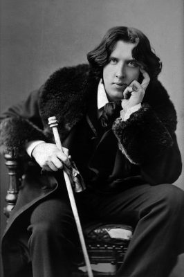

If you are one of the 51.8 million people in the U.S. who use a treadmill for exercise, you know there’s much pain for your muscle-and-fitness gain. On your next 30-minute jog, as you count down the final seconds, ponder whether the hard work made you a better person. Consider whether the workout would feel different if you had powered something, even a fan to cool yourself off.

如果您是美国使用跑步机锻炼的 5180 万人中的一员，您就会知道锻炼肌肉和健身会带来很多痛苦。 在接下来的 30 分钟慢跑中，当您倒数最后几秒时，思考一下努力工作是否让您成为了更好的人。 考虑一下，如果您给某些东西供电，即使是风扇让您凉快下来，锻炼的感觉是否会有所不同。

Two hundred years ago, the treadmill was invented in England as a prison rehabilitation device. It was meant to cause the incarcerated to suffer and learn from their sweat. It would mill a bit of corn or pump some water as a bonus.

200年前，跑步机作为一种监狱改造设备在英国发明。 它的目的是让被监禁的人受苦并从他们的汗水中吸取教训。 作为奖励，它会磨一点玉米或泵一些水。

#### Newsletter Signup

#### 通讯注册

William Cubitt, a civil engineer raised in a family of millwrights, created the treadmill—which was also called a treadwheel in the early days—in 1818. Cubitt  later became famous for overseeing the construction of The Crystal Palace in London in 1851, and was knighted by Queen Victoria for his efforts. Cubitt’s early attempts at the treadmill’s design took many forms, including two wheels you walked on whose cogs interlocked. But his most popular edition, which was installed at [Brixton Prison in London](https://www.bl.uk/collection-items/description-of-the-tread-mill), involved a wide wheel. Prisoners pressed down with their feet on steps embedded in the wheel, which moved it, presenting them with the next step. Picture it like the sport of log-rolling, only the log-like wheel was fixed in place. The Brixton treadmill was hooked up to subterranean machinery that ground corn. It wasn’t fun.

William Cubitt 是一名土木工程师，在一个磨坊工人家庭中长大，他于 1818 年创造了跑步机——早期也被称为跑步机。Cubitt 后来因 1851 年在伦敦监督水晶宫的建设而闻名，并且由于他的努力，被维多利亚女王封为爵士。 Cubitt 对跑步机设计的早期尝试采用多种形式，包括您行走在其齿轮互锁的两个轮子上。 但他最受欢迎的版本安装在 [伦敦的布里克斯顿监狱](https://www.bl.uk/collection-items/description-of-the-tread-mill) ，其中包含一个宽轮子。 囚犯用脚踩在嵌在轮子上的台阶上，轮子会移动，向他们展示下一步。 把它想象成原木滚动运动，只有原木般的轮子固定在原位。 Brixton 跑步机连接到地下磨玉米的机器上。 这不好玩。

This treadmill could busy as many as 24 prisoners, standing side-by-side along the wheel. Some devices at other prisons were smaller, and most treadmills soon included partitions so convicts could not socialize. They slogged for 10 hours a day in summer, and a mere seven in winter.

这台跑步机最多可容纳 24 名犯人，沿着轮子并排站立。 其他监狱的一些设备更小，大多数跑步机很快都包含隔板，因此囚犯无法进行社交活动。 他们在夏天每天辛苦工作 10 个小时，而在冬天则只有 7 个小时。

The invention arrived at an apt time. At the end of the eighteenth century, the British began reforming their prisons. According to the historian U. R. Q. Henriques’ 1972 article “[The Rise and Decline of the Separate System of Prison Discipline](http://www.jstor.org/stable/650199?mag=treadmills-were-meant-to-be-atonement-machines),” prisons previously offered their occupants next to nothing. Families had to bring in food and blankets, and the bribing of guards was rampant. As prisons began providing necessities, people worried that the poor would commit crimes just to get free stuff. Such luxuries needed to be offset by labor—ideally, labor that was painful and possibly even pointless.

这项发明来得正是时候。 十八世纪末，英国开始改革监狱。 根据历史学家 URQ Henriques 1972 年的文章“ [监狱纪律分离系统的兴衰](http://www.jstor.org/stable/650199?mag=treadmills-were-meant-to-be-atonement-machines) ”，监狱以前几乎没有为居住者提供任何服务。 家庭不得不带上食物和毯子，贿赂警卫的行为十分猖獗。 随着监狱开始提供必需品，人们担心穷人会为了得到免费的东西而犯罪。 这种奢侈需要用劳动来抵消——理想情况下，劳动是痛苦的，甚至可能是毫无意义的。

Recruitment of the next generation of hardened criminals was rampant in prisons. Poor kids who came in for petty crimes would leave with contacts and lock-picking and other subversive skills. Prison administrators wanted both to rehabilitate and to keep people separate.

招募下一代顽固的罪犯在监狱中十分猖獗。 因轻微犯罪而进来的可怜孩子会带着人脉、开锁和其他颠覆性技能离开。 监狱管理人员既希望改造人们，又希望将人们分开。

The likes of Oscar Wilde, imprisoned for gross indecency, worked the treadmill.

The partitioned treadmill delivered on both fronts. The long hours on it were mind-numbingly boring and physically exhausting. But it soon began to be used less as a work machine than as a torture device. “At first it was used to grind corn or pump water, or as a means of exercise. But it soon became a mere method of punishment, ‘grinding air,’” Henriques writes.

分区跑步机在两个方面都交付。 漫长的工作时间令人心烦意乱，身体疲惫不堪。 但它很快就开始不再用作工作机器，而是用作刑具。 “起初它被用来磨玉米或抽水，或者作为一种锻炼方式。 但它很快就变成了一种纯粹的惩罚方法，'研磨空气'，”Henriques 写道。

Since the treadmill ticked all the boxes, it rose in popularity. According to the historian David H. Shayt, by 1842, [treadmills were being used in 109 of 200 jails across England, Wales, and Scotland](http://www.jstor.org/stable/3106197?mag=treadmills-were-meant-to-be-atonement-machines). The likes of Oscar Wilde, imprisoned for gross indecency, worked the treadmill.

由于跑步机符合所有条件，它的人气上升了。 根据历史学家戴维·H·谢特 (David H. Shayt) 的说法，到 1842 年， [英格兰、威尔士和苏格兰的 200 所监狱中有 109 所使用了跑步机](http://www.jstor.org/stable/3106197?mag=treadmills-were-meant-to-be-atonement-machines) 。 奥斯卡·王尔德 (Oscar Wilde) 等人因严重猥亵罪入狱，在跑步机上工作。

But, over time, the device’s purported ability to cure criminality through sweat—never mind the actual work output—was called into question. For instance, a short article called “[Prison Electricity](http://www.jstor.org/stable/26079642?mag=treadmills-were-meant-to-be-atonement-machines)” in an 1882 edition of _Scientific American_ called for a more productive approach to treadmilling. “The convicts hated it, and no useful results came of it,” the author writes. The suggestion was for “attaching dynamoelectric machines to the cranks” to “store electrically the energy developed.” It argued that prisons could sell energy, and thus pay for their own upkeep.

但是，随着时间的推移，该设备声称的通过汗水治愈犯罪的能力——更不用说实际的工作输出——受到了质疑。 例如， [》中一篇名为“监狱电力](http://www.jstor.org/stable/26079642?mag=treadmills-were-meant-to-be-atonement-machines) 1882 年版《 _科学美国人_ ”的短文呼吁采用更高效的跑步机方法。 “囚犯们讨厌它，而且没有产生任何有用的结果，”作者写道。 该建议是“将电动机器连接到曲柄”以“将产生的能量储存起来”。 它认为监狱可以出售能源，从而支付自己的维护费用。

Meanwhile, treadmills were clearly not that safe. An 1885 _British Medical Journal_ article called “[Death on the Treadmill](http://www.jstor.org/stable/25272050?mag=treadmills-were-meant-to-be-atonement-machines),” chastized Durham Prison for the treadmill-induced death of a prisoner with heart disease. Its overall high death rate—one fatality a week—prompted the conclusion that “\[t\]he ‘mill’ is not useful, and has proved itself occasionally injurious.”

同时，跑步机显然不是那么安全。 1885 年 _英国医学杂志_ 的一篇名为“ [跑步机上的死亡](http://www.jstor.org/stable/25272050?mag=treadmills-were-meant-to-be-atonement-machines) ”的文章谴责达勒姆监狱因跑步机导致一名患有心脏病的囚犯死亡。 它的总体死亡率很高——每周有一个人死亡——得出的结论是“\[t\]他的‘磨坊’没有用，而且证明它自己偶尔会有害。”

More importantly among the minds of the day, the focus on breaking the body and mind was giving way to a more thoughtful approach to rehabilitation and to a focus on education. A series of prison acts passed throughout the 19th century increasingly restricted how long prisoners could be subjected to such devices, and the act of 1898 called for an end to their use. By 1895, there were just 39 in use across Britain, and merely 13 by 1901.

更重要的是，在当今的思想中，对打破身心的关注正在让位于更周到的康复方法和对教育的关注。 整个 19 世纪通过的一系列监狱法案越来越多地限制囚犯使用此类设备的时间，1898 年的法案要求停止使用此类设备。 到 1895 年，全英国只有 39 个在使用，到 1901 年只有 13 个。

Inside of a century, the once-popular prison treadmill proved too cruel and pointless for its home nation, but that did not stop it from being imported to the U.S. The treadmill came to America in 1822, and was set up in four different prisons. It was briefly popular at the prison on East 26th Street in New York City. The first one installed there, which cost $3,050.99 to build, busied 16 prisoners at a time, who ground 40-60 bushels of corn a day. Within two years, the prison had built three more, two of them used by women. But, by 1827, the mills had fallen into only sporadic use and then were abandoned when the prison relocated. In Newgate, Charleston, and Philadelphia, treadmills were installed, used sparingly, and given up on in short order.

一个世纪之内，曾经风靡一时的监狱跑步机被证明对本国来说过于残酷和毫无意义，但这并没有阻止它被进口到美国。跑步机于 1822 年来到美国，并在四个不同的监狱中设置。 它曾在纽约市东 26 街的监狱中短暂流行过。 第一个安装在那里，建造成本为 3,050.99 美元，一次可以让 16 名囚犯忙碌，他们每天研磨 40-60 蒲式耳玉米。 两年内，监狱又建了三座，其中两座供女性使用。 但是，到 1827 年，这些磨坊只是偶尔使用，然后在监狱搬迁时被废弃。 在纽盖特、查尔斯顿和费城，人们安装了跑步机，但很少使用，很快就放弃了。

Just as in Britain, Americans were struggling with what to do with their criminals. Should they work alone, contemplating their former bad ways? If they worked while in prison, what was the purpose?

就像在英国一样，美国人也在为如何处理他们的罪犯而苦苦挣扎。 他们应该单独工作，思考他们以前的错误做法吗？ 如果他们在监狱里工作，目的是什么？

In America, it seemed, the answer could not be “toil for its own sake.” In 1827, the Prison Discipline Society of Boston wrote that “the treadmill… teaches the convict nothing that can be useful to him on his discharge. It is not a profitable employment of human power.”

在美国，似乎答案不可能是“为自己的利益而努力”。 1827 年，波士顿监狱纪律协会写道：“跑步机……没有教给囚犯任何对他出院后有用的东西。 这不是人力的有利可图的使用。”

At a prison opened in 1822 in Auburn, NY, a new approach emerged. Dubbed “collective industry,” prisoners sat together and worked, turning the prison into a factory, albeit a strict one. “The rules typically called for downcast eyes, lockstep marching, no talking, and constant work when outside the cells. The usual punishment for infractions was the lash.” This new system was considered both humane and, most importantly, highly industrious. Outside the prison walls, there was a labor shortage. Instead of milling a few dozen bushels of corn a day— work that an animal could do—these convicts were making shoes, clothing, hardware, furniture, rifles, and clocks. Private manufacturers brought raw materials or unfinished products into the prison and paid for the labor.

1822 年在纽约州奥本开设的一所监狱出现了一种新方法。 被称为“集体工业”，囚犯们坐在一起工作，把监狱变成了一个工厂，尽管是一个严格的工厂。 “这些规则通常要求在牢房外保持低垂的眼神、步调一致的行进、不说话和持续工作。 通常对违规行为的惩罚是鞭打。” 这个新系统被认为既人性化，最重要的是，非常勤奋。 在监狱围墙外，劳动力短缺。 这些囚犯不是每天碾磨几十蒲式耳的玉米——动物可以做的工作——而是制造鞋子、衣服、硬件、家具、步枪和钟表。 私人制造商将原材料或未完成的产品带入监狱并支付劳务费。

The idea soon spread, and prisoners all over the country were put to work—until concerns about prisons interfering with the open market surfaced, that is. Prevailing ideas about incarceration, work, and punishment continued to evolve, but the treadmill was long gone.

这个想法很快传播开来，全国各地的囚犯都开始工作——直到对监狱干扰公开市场的担忧浮出水面，也就是说。 关于监禁、工作和惩罚的流行观念不断发展，但跑步机早已不复存在。

It resurfaced in 1913 with a U.S. patent for a “[training-machine](https://patents.google.com/patent/US1064968).” In the 1960s, the American mechanical engineer William Staub created a home fitness machine called the PaceMaster 600. He began manufacturing home treadmills in New Jersey. (He used it often himself, right up until the months before his death at the age of 96.)

它于 1913 年以“ [训练机](https://patents.google.com/patent/US1064968) ”的美国专利重新出现。 1960 年代，美国机械工程师 William Staub 发明了一款名为 PaceMaster 600 的家用健身器材。他开始在新泽西州制造家用跑步机。 （他自己经常使用它，直到他 96 岁去世前的几个月。）

Now, it’s the [top selling piece of exercise equipment](https://www.sfia.org/press/706_Sports-and-Fitness-Industry-Surpasses-%2484-Billion-in-Wholesale-Sales) in the U.S. It’s evolved, of course, as has America, and the two fit each other quite nicely. Today’s treadmill lets people run or walk even in inclement weather, at home or at the gym. It’s a painful, boring, and sometimes cruel device: People still do get injured and even die on treadmills. But we still climb on, by choice, letting our other devices amuse us while we sweat.

现在，它是美国 [最畅销的健身器材](https://www.sfia.org/press/706_Sports-and-Fitness-Industry-Surpasses-%2484-Billion-in-Wholesale-Sales) 。当然，随着美国的发展，这两者非常相配。 今天的跑步机让人们即使在恶劣天气下也能在家中或健身房跑步或步行。 这是一种痛苦、无聊，有时甚至是残忍的装置：人们仍然会在跑步机上受伤甚至死亡。 但我们仍然选择继续前进，让我们的其他设备在我们流汗的同时让我们开心。
