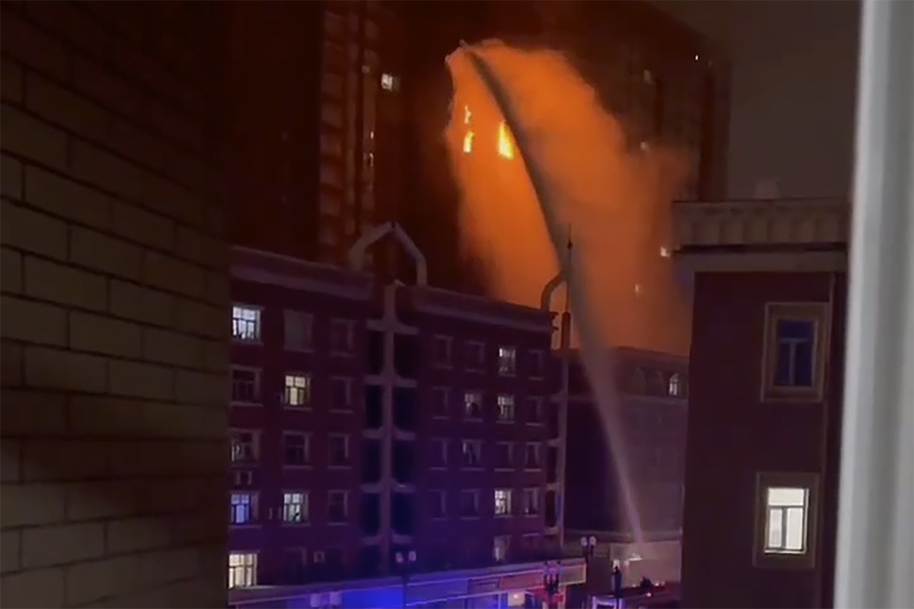
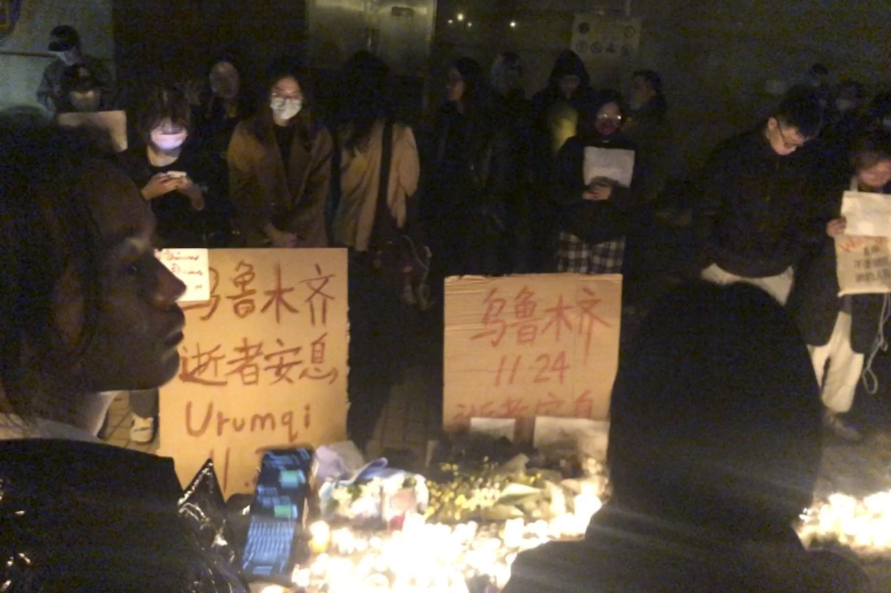

It began with a video on social media of a woman screaming in a burning building, an image that frightened people across China who have been facing rolling quarantines and lockdowns that can cause their apartment blocks to be closed off or blocked by steel gates.

它始于社交媒体上一名妇女在燃烧的建筑物中尖叫的视频，这一形象吓坏了中国各地一直面临轮流隔离和封锁的人，这些隔离和封锁可能导致他们的公寓楼被关闭或被钢门封锁。

Within hours, protests had spread online and residents of compounds in Beijing and other cities were filmed confronting local officials who were trying to install the infamous “iron guard” gates to isolate their communities. The protesters quoted the new [20-point rules](https://www.bloomberg.com/news/articles/2022-11-11/these-are-the-20-measures-guiding-china-s-covid-easing-efforts) introduced this month that were designed to try to make China’s Covid Zero policy less restrictive for people and less damaging to the economy. As more videos appeared online showing residents forcing officials to back down, protesters took to the streets in a public outpouring of anger and frustration, even calling for President Xi Jinping to step down, a level of national dissent unheard of since Xi took power a decade ago.

几个小时内，抗议活动在网上蔓延开来，北京和其他城市大院的居民被拍到与当地官员对峙，当地官员试图安装臭名昭著的“铁栅栏”大门以隔离他们的社区。 抗议者引用了本月出台的新的 [20 点规则](https://www.bloomberg.com/news/articles/2022-11-11/these-are-the-20-measures-guiding-china-s-covid-easing-efforts) ，这些规则旨在试图减少中国的 Covid 零政策对人们的限制，并减少对经济的损害。 随着网上出现更多显示居民强迫官员让步的视频，抗议者走上街头公开表达愤怒和沮丧，甚至呼吁国家主席习近平下台，这是习近平上台十年以来闻所未闻的全国异议程度前。

> Shanghai tonight. Protest at vigil for the dead in Urumqi. “Freedom. No more test. Throw off your masks” and The March of the Volunteers. Surrounded by police on all sides. 500-1000 people. [pic.twitter.com/CXWrnYhrQc](https://t.co/CXWrnYhrQc)
> 
> 今晚上海。 在乌鲁木齐为死者守夜抗议。 “自由。 没有更多的测试。 摘下你的面具”和《义勇军进行曲》。 四周被警察包围。 500-1000人。 [pic.twitter.com/CXWrnYhrQc](https://t.co/CXWrnYhrQc)
> 
> — Philip Róin (@brandhane) [November 26, 2022](https://twitter.com/brandhane/status/1596570091864608768?ref_src=twsrc%5Etfw)

The trigger for the discontent was a fire on Thursday night in a high-rise apartment block in Urumqi, capital of far western Xinjiang region, which has been under lockdown for more than three months. At least 10 people were reported to have died in the blaze and citizens vented their anger online, questioning whether prolonged lockdowns delayed or hampered rescue efforts. In a press briefing late Friday, city authorities apologized to the public and expressed condolences to victims of the fire, but denied claims that residents couldn’t evacuate because of Covid measures.

引发不满的导火索是周四晚上，位于新疆西部偏远地区首府乌鲁木齐的一座高层公寓楼发生火灾，该公寓楼已被封锁三个多月。 据报道，至少有 10 人在大火中丧生，市民们在网上发泄愤怒，质疑长期封锁是否延误或阻碍了救援工作。 在周五晚些时候的新闻发布会上，市政府向公众道歉并向火灾遇难者表示哀悼，但否认居民因新冠病毒措施而无法撤离的说法。

[China’s Urumqi Eases Public Transport Curbs Amid Rare Protests](https://www.bloomberg.com/news/articles/2022-11-27/china-s-urumqi-eases-public-transport-curbs-amid-rare-protests)

[中国乌鲁木齐在罕见的抗议活动中放松了公共交通限制](https://www.bloomberg.com/news/articles/2022-11-27/china-s-urumqi-eases-public-transport-curbs-amid-rare-protests)

But the following day, residents in Beijing and other cities were quoting the Urumqi incident as they argued with local officials that were trying to block off their buildings.

但第二天，北京和其他城市的居民在与试图封锁他们建筑物的地方官员发生争执时引用了乌鲁木齐事件。

On Saturday, crowds in Shanghai gathered on the Wulumuqi Middle Road, a street named after Urumqi. Hundreds of residents convened near midnight at the intersection to mourn the dead, lighting candles and holding white papers —  a symbolic protest against censorship — in silence, videos circulated on social networks showed. They then called for an easing of Covid controls and the end of the lockdown in Xinjiang.

周六，上海的人群聚集在以乌鲁木齐命名的乌鲁木齐中路。 社交网络上流传的视频显示，数百名居民在午夜时分聚集在十字路口哀悼死者，点燃蜡烛并手持白皮书——这是对审查制度的象征性抗议——沉默。 然后，他们呼吁放松对新冠病毒的控制并结束对新疆的封锁。

“I think you can say that this is the most confrontational street event since Tiananmen,” based on viewing the video footage of the Shanghai protest, said Perry Link, a professor at the University of California, Riverside, who helped edit the Tiananmen Papers, a collection of secret documents related to the 1989 military crackdown on protesters in Beijing. “These protests clearly have dozens, maybe hundreds, of people behind them, at least based on the video clips that I saw. And there is connection among the cities — it is a nationwide thing.”

“我认为你可以说这是自天安门事件以来最具对抗性的街头事件，”根据观看上海抗议活动的视频片段，帮助编辑天安门文件的加州大学河滨分校教授佩里林克说，与 1989 年北京军事镇压抗议者有关的一系列秘密文件。 “这些抗议显然有数十人，甚至数百人支持，至少根据我看到的视频片段。 城市之间存在联系——这是全国性的事情。”

China is in a difficult position. Having touted a much lower pandemic death toll as vindication of its Covid Zero strategy, Xi and top leaders are unwilling to endure the fatalities that ensue when even the most vaccinated nations open up. China’s vaccination rates lag those countries, particularly among the elderly, and exclusive use of less-effective domestic shots is also a vulnerability.

中国处境艰难。 习近平和最高领导人吹嘘大流行病死亡人数低得多，以此证明其 Covid 零战略是正确的，但即使是接种疫苗最多的国家开放，也不愿忍受随之而来的死亡人数。 中国的疫苗接种率落后于这些国家，尤其是在老年人中，而且只使用效果较差的国产疫苗也是一个弱点。

More transmissible variants also make it much harder to apply the more nuanced application of Covid Zero detailed in the 20-point playbook. Cities including Shijiazhuang near Beijing and Zhengzhou, home to the world’s largest iPhone factory, were forced to call sweeping lockdowns less than two weeks after China’s leaders said Covid policy needed a more targeted approach. Beijing, the Communist Party’s power center, is currently subject to a web of restrictions designed to discourage movement as cases hit new records every day.

更多可传播的变体也使得应用 20 点手册中详述的 Covid Zero 更细微的应用变得更加困难。 北京附近的石家庄和世界上最大的 iPhone 工厂所在地郑州等城市在中国领导人表示新冠疫情政策需要更有针对性的方法后不到两周就被迫宣布全面封锁。 作为共产党的权力中心，北京目前受到一系列旨在阻止人员流动的限制，因为案件每天都在刷新记录。

While China's government hasn't publicly responded to the growing unrest, the People’s Daily, the Communist party's mouthpiece, ran a front page story Sunday reiterating the need to stick to Covid Zero, which it said is in line with the party's nature and principles. 

尽管中国政府尚未对日益加剧的动荡局势做出公开回应，但共产党的喉舌《人民日报》周日在头版刊登了一篇文章，重申有必要坚持零冠状病毒，并称这符合党的性质和原则。

[Apple’s Reliance on China Grows Perilous With iPhone City Lockdown Chaos](https://www.bloomberg.com/news/articles/2022-11-25/china-iphone-factory-tensions-flamed-by-xi-jinping-s-covid-zero-policy)

[苹果对中国的依赖因 iPhone 封城混乱而变得危险](https://www.bloomberg.com/news/articles/2022-11-25/china-iphone-factory-tensions-flamed-by-xi-jinping-s-covid-zero-policy)

The fire in Urumqi took nearly three hours to extinguish and spread to several floors, according to Xinhua News Agency, which said the residential community was designated as a low-risk area for Covid-19 and people were allowed to leave their homes.

据新华社报道，乌鲁木齐的大火用了近三个小时才扑灭并蔓延到几层楼，该社称该住宅区被指定为 Covid-19 的低风险区，人们被允许离开家园。

Firefighters spray water on a fire at a residential building in Urumqi, Xinjiang on Nov. 24.

Source: AP Photo

But videos circulated online showing fire trucks struggling to get close to the building and spraying water at the flames from a distance. One clip depicted people removing barriers on the ground, while other posts said long-idled vehicles parked near the building because of the lockdowns may have blocked access. Social media users posted recordings of residents crying for help from the building and many questioned which was more dangerous, the virus or fallout from containment measures. Bloomberg wasn’t able to verify the posts.

但网上流传的视频显示，消防车奋力靠近大楼，并从远处向火焰喷水。 一个视频片段描绘了人们移除地面上的障碍物，而其他帖子则表示，由于封锁而停在建筑物附近的长期闲置车辆可能阻碍了通道。 社交媒体用户发布了居民向大楼求救的录音，许多人质疑病毒或遏制措施的后果哪个更危险。 彭博社无法核实这些帖子。

One thread on WeChat read: “The blockade of fire escapes due to Covid lockdowns will bring risks, these are the worst worries of everyone. Today, it finally happened.” Hu Xijin, retired editor-in-chief of Global Times, wrote on his account that lockdowns in Xinjiang “exceeded what local residents could endure.”

微信上的一则帖子写道：“由于Covid lockdowns导致的防火通道被封锁会带来风险，这是每个人最担心的事情。 今天，它终于发生了。” 《环球时报》退休总编辑胡锡进在他的账户上写道，新疆的封锁“超出了当地居民的承受能力”。

[Xinjiang Seeks to Calm Lockdown Anger After Deadly Fire](https://www.bloomberg.com/news/articles/2022-11-26/xinjiang-officials-seek-to-calm-lockdown-anger-after-deadly-fire)

[致命火灾后，新疆寻求平息对封锁的愤怒](https://www.bloomberg.com/news/articles/2022-11-26/xinjiang-officials-seek-to-calm-lockdown-anger-after-deadly-fire)

A video shot on Friday night in Beijing's Chaoyang district showed residents shouting at Taiyanggong township chief Chen Peng and police.

周五晚上在北京朝阳区拍摄的一段视频显示，居民向太阳宫乡镇长陈鹏和警察大喊大叫。

“You are the one breaking the law, not me! You cannot lock us down with ‘iron guard,’” residents shouted in the video. “The fire in Xinjiang gave us a warning. Firefighting vehicles were unable to enter the compound and that caused the deaths of 10 people. Who will be responsible for the deaths if this happened today at our compound? You, chief Chen Peng? Will you be responsible?”

“You are the one breaking the law, not me! You cannot lock us down with ‘iron guard,’” residents shouted in the video. “The fire in Xinjiang gave us a warning. Firefighting vehicles were unable to enter the compound and that caused the deaths of 10 people. Who will be responsible for the deaths if this happened today at our compound? You, chief Chen Peng? Will you be responsible?”

Part of the problem is that the neighborhood committees tasked with enforcing the 20 measures typically consist of a handful of officials who are ill equipped to manage communities with thousands of residents, said Victor Shih, an expert on elite Chinese politics at UC San Diego. “They were understaffed to begin with, but at least could enforce simple dictates like opening and closing. However, the 20 measures call for very nuanced treatment of individual households, depending on the level of exposure,” Shih said. “Under the 20 measures they are supposed to police these enormous neighborhoods to ensure that households with exposure do not leave their homes. That is an impossible task and has led to extreme measures like bolting people’s doors shut. This, of course, led to waves of complaints, and even protests across China.”

加州大学圣地亚哥分校研究中国精英政治的专家维克多·史说，部分问题在于，负责执行这 20 项措施的居委会通常由少数官员组成，他们没有能力管理拥有数千名居民的社区。 “他们一开始人手不足，但至少可以执行简单的命令，比如开门和关门。 然而，这 20 项措施要求根据暴露程度对个别家庭进行非常细致的处理，”Shih 说。 “根据 20 项措施，他们应该对这些庞大的社区进行监管，以确保有暴露的家庭不会离开家园。 这是一项不可能完成的任务，并导致采取极端措施，例如用螺栓将人们的门关上。 这当然在中国引发了一波又一波的抱怨，甚至是抗议。”

Demonstrators in Shanghai on Nov. 26.

Source: AP Photo

In one unverified video of the Shanghai street protest that has been widely circulated, people are seen chanting, “We want freedom, we want human rights.” They sang the national anthem and _Do You Hear the People Sing?_  from the musical _Les Misérables_, while observers posted and live-streamed videos and photos on Chinese social networks and Twitter and Instagram.

在一段广为流传的未经证实的上海街头抗议视频中，可以看到人们高呼“我们要自由，我们要人权”。 他们唱国歌， _你听到人民歌唱了吗？_ 来自音乐剧 _《悲惨世界》_ ，而观察员则在中国社交网络、推特和 Instagram 上发布和直播视频和照片。

In the video, police are seen surrounding the group and attempting to disperse protesters. 

在视频中，可以看到警察包围了这群人，并试图驱散抗议者。

The video shows a rare moment of defiance against the nation’s leader, with the crowd calling for Xi and the Chinese Communist Party leaders to resign. 

视频显示了一个罕见的反抗国家领导人的时刻，人群呼吁习近平和中国共产党领导人下台。

“CCP!” shouted a man in the crowd.

“中共！” 人群中一个人喊道。

“Step down!” the crowd chanted in response.

“下台！” 人群高呼回应。

“Xi Jinping!” shouted the man.

“Xi Jinping!” shouted the man.

“Step down!” the crowd echoed.

“下台！” 众人齐声。

After the hours-long protest, police began to disperse the crowd more forcefully and posts on social networks said a few of the protesters were arrested early Sunday. Attempts to contact the Beijing and Shanghai government news offices and other municipal authorities for comment on Sunday were unsuccessful. 

在长达数小时的抗议活动结束后，警方开始更有力地驱散人群，社交网络上的帖子称，一些抗议者在周日早些时候被捕。 周日试图联系北京和上海政府新闻办公室以及其他市政当局征求意见，但没有成功。

“This is frustration. Frustration with poor governance at the local level, mismanagement by epidemic officials, heavy handedness by local level officials,” said Drew Thompson, visiting senior research fellow at the Lee Kuan Yew School of Public Policy at the National University of Singapore. “I don't see this as being some sort of existential threat to the party, but it's definitely an embarrassment for Xi Jinping,” Thompson said from Taipei. 

“这是挫败感。 对地方治理不善、流行病官员管理不善、地方官员的粗暴行为感到失望，”新加坡国立大学李光耀公共政策学院访问高级研究员德鲁汤普森说。 汤普森在台北说：“我不认为这对党构成某种生存威胁，但这对习近平来说绝对是一种尴尬。”

Images and videos on the internet showed that protests were widespread across the country, with physical gatherings from groups of residents to street demonstrations of hundreds, while the government’s army of censors were kept busy removing a constant stream of online criticism.

互联网上的图片和视频显示，抗议活动在全国范围内蔓延，居民团体举行实体集会，数百人上街示威，而政府的审查大军一直忙于清除源源不断的在线批评。

Residents from Lanzhou in northwestern China were shown protesting on the street on Saturday night, with video showing some residents in a so-called “high risk area” tearing down a blockade to escape isolation, while others were shown overturning kiosks and tents set up for Covid tests.

周六晚上，来自中国西北部兰州的居民在街头抗议，视频显示所谓的“高风险地区”的一些居民拆除封锁线以逃避隔离，而其他人则推翻为抗议活动搭建的售货亭和帐篷。新冠病毒测试。

In Chengdu, a video on WeChat with more than 100,000 views, showed a male resident complaining over the phone to a government staffer at the Longquanyi district. The man is heard explaining that the impromptu restriction of residents from leaving their compounds was a violation of the 20 guidelines. “Which one of the measures in the 20 guidelines allow this kind of this temporary lockdown?” he asks. “This is in violation of these guidelines.”

在成都市，一段点击量超过 10 万的微信视频显示，一名男性居民通过电话向龙泉驿区的一名政府工作人员投诉。 听到这名男子解释说，即兴限制居民离开他们的住所违反了 20 条准则。 “20条指导方针中的哪一项措施允许这种临时封锁？” 他问。 “这违反了这些准则。”

Students in colleges around the nation added to the wave of anger. In Nanjing’s Communication University of China, hundreds gathered on Saturday, holding up illuminated phones, like candles, around a young man who lamented the fire in his “hometown.”

全国各地大学的学生加剧了愤怒的浪潮。 周六，在南京的中国传媒大学，数百人聚集在一起，举着像蜡烛一样发光的手机，围着一个年轻人，他为“家乡”的大火哀叹。

"I speak for those who lost family and friends in the fire," he said, as the crowd cheered and applauded.

“我为那些在火灾中失去家人和朋友的人说话，”他说，人群欢呼鼓掌。

[A video](https://twitter.com/whyyoutouzhele/status/1596461329203740672?t=-EWBSQZHRLiosiFHcDxovQ&s=19) showed some holding up blank white pieces of paper and chanting slogans such as “long live the people” and “rest in peace.”

[一段视频](https://twitter.com/whyyoutouzhele/status/1596461329203740672?t=-EWBSQZHRLiosiFHcDxovQ&s=19) 显示，一些人举着空白的白纸，高呼“人民万岁”、“安息”等口号。

College staff criticized the students and attempted to persuade them to disperse.

学院工作人员批评学生并试图劝他们散去。

“One day you will pay the price of what you did today,” a man said to the students over a loudspeaker.

“总有一天你们会为你们今天所做的付出代价，”一名男子通过扩音器对学生们说。

“You will too,” shouted the crowd.

“你们也会的，”人群喊道。

Colleges in Beijing, Guangzhou, Xi'an, Changsha, Harbin and Chongqing saw similar events, with students posting leaflets, singing songs and painting graffiti with slogans such as “Give me liberty or give me death,” according to social media posts, most of which were quickly blocked.

北京、广州、西安、长沙、哈尔滨和重庆的高校也发生了类似的事件，根据社交媒体的帖子，学生们张贴传单、唱歌和涂鸦，上面写着“不自由，毋宁死”等标语，大多数其中很快就被封锁了。

Many netizens have been circulating music videos designed to show their discontent. The Michael Jackson song _They Don't Care About Us_ garnered over 100,000 likes.

许多网民一直在传播旨在表达他们不满的音乐视频。 的 迈克尔杰克逊 _歌曲“他们不在乎我们”_ 获得了超过 100,000 个赞。

Other online complaints were directed at conditions in the temporary isolation facilities. Residents in some compounds signed petitions demanding that infected neighbors be allowed to remain in home quarantine with the full support of the neighborhood, rather than being taken off to the makeshift centers after several blogs showed patients in some of Beijing’s newly erected facilities scrambling for food and medicine.

其他在线投诉针对的是临时隔离设施的条件。 一些大院的居民签署请愿书，要求允许受感染的邻居在社区的全力支持下留在家中隔离，而不是在一些博客显示北京一些新建设施中的患者争先恐后地争抢食物和药物。

The widespread dissent has raised concern that the government may respond with a crackdown to stifle further protests.

广泛的异议引发了人们的担忧，即政府可能会采取镇压行动以遏制进一步的抗议活动。

“I think a crackdown is predictable. I think that will happen,” said Link at the University of California. “The determination that a man like Xi Jinping has to fight back is ironclad. He'll go to the mat.”

“我认为镇压是可以预见的。 我认为这会发生，”加州大学的 Link 说。 “像习近平这样的人要反击的决心是铁定的。 他会去垫子。

_— With assistance by Colum Murphy, Allen K Wan, Philip Glamann and John Liu_

_— 在 Colum Murphy、Allen K Wan、Philip Glamann 和 John Liu 的协助下_

(Updates with comment, details of protests from 24th paragraph.)
