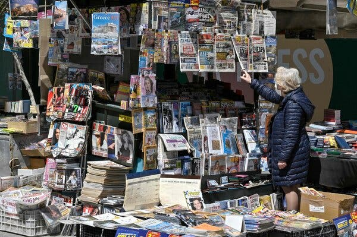
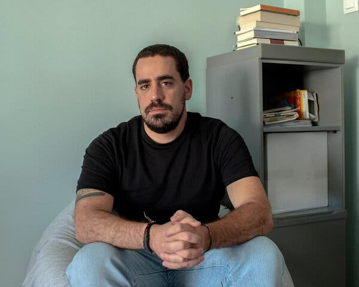
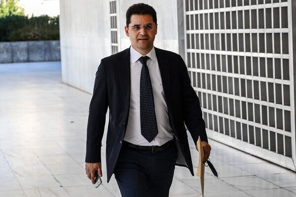
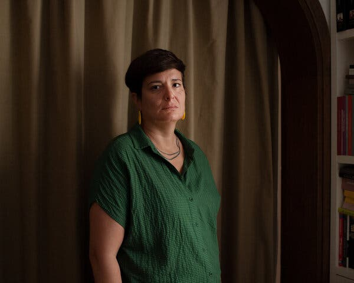
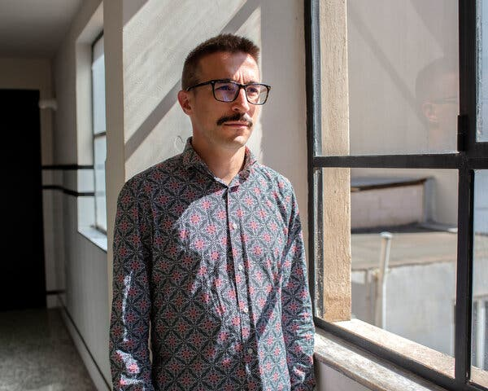
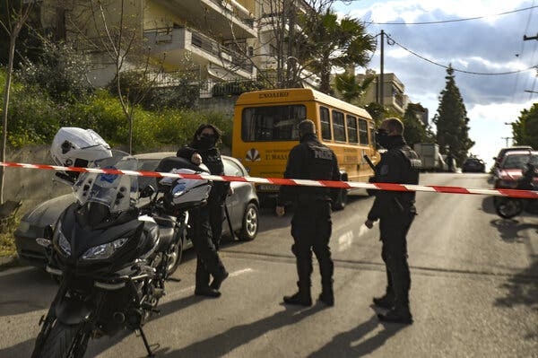

## How Free Is the Press in the Birthplace of Democracy?

## 民主发源地的新闻自由度如何？

Reporters under surveillance. Political opponents being wiretapped. The scandal is called the ‘Greek Watergate.’ But not enough people are paying attention.

Credit...Louisa Gouliamaki/Agence France-Presse — Getty Images

Lauren Markham and Lydia Emmanouilidou

Nov. 26, 2022

On a Saturday morning last November, Stavros Malichudis, a Greek journalist, made a cup of coffee and began scrolling Facebook, where he came across a bombshell exposé by the left-leaning news outlet EFSYN: According to the article, the centralized Greek intelligence service was closely monitoring the activities of people doing work related to refugees, and even tapping their phones. Mr. Malichudis was stunned.

去年 11 月的一个星期六早上，希腊记者 Stavros Malichudis 冲了杯咖啡，开始刷 Facebook，偶然看到左倾新闻媒体 EFSYN 的一则重磅报道：根据文章，希腊中央情报局正在密切监视从事难民相关工作的人的活动，甚至窃听他们的电话。 马里丘迪斯先生惊呆了。

As he read, he noticed that some of the details appeared strangely familiar. A journalist of interest to the intelligence services, the article revealed, had been reporting on a young refugee from Syria imprisoned on the Aegean island of Kos. Mr. Malichudis was in the process of reporting just such a story.

当他阅读时，他注意到一些细节似乎出奇地熟悉。 文章透露，情报部门感兴趣的一名记者一直在报道一名来自叙利亚的年轻难民被关押在爱琴海科斯岛上。 Malichudis 先生正在报道这样一个故事。

He contacted the EFSYN reporters, who confirmed that the unnamed journalist in the story was, in fact, him. According to their reporting, the Greek National Intelligence Service, or EYP — the equivalent of the Central Intelligence Agency — was monitoring his activities for the news outlet [Solomon](https://wearesolomon.com/) and had wiretapped his phone. Having secured a two-month surveillance warrant from a prosecutor, authorities were free to listen to any of his personal or professional calls. (Government officials did not respond to a request for comment on the wiretapping.)

他联系了 EFSYN 的记者，后者证实故事中未具名的记者就是他。 根据他们的报道，希腊国家情报局，或 EYP——相当于中央情报局——正在监视他为 [所罗门](https://wearesolomon.com/) 新闻媒体所做的活动，并窃听了他的电话。 在获得检察官为期两个月的监视令后，当局可以自由窃听他的任何私人或职业电话。 （政府官员没有回应就窃听发表评论的请求。）

“I got really scared,” Mr. Malichudis told us. For months, he was in a precarious emotional place. “When I talked with my mother, with my friends, with my sources, I felt really exposed.” He largely stopped using his phone.

“我真的很害怕，”Malichudis 先生告诉我们。 几个月来，他情绪不稳定。 “当我与母亲、朋友和线人交谈时，我感到自己真的暴露了。” 他基本停止使用手机。

In the year since Mr. Malichudis first read about his own work in another news outlet, the scandal has snowballed. A financial journalist learned he had also been wiretapped. The government of Prime Minister Kyriakos Mitsotakis admitted that the state intelligence service was monitoring an opposition leader. Two government officials, including the prime minister’s nephew, have resigned.

自从马里丘迪斯先生第一次在另一家新闻媒体上看到他自己的作品以来的一年里，这起丑闻就像滚雪球一样越滚越大。 一位财经记者得知他也被窃听了。 基里亚科斯·米佐塔基斯 (Kyriakos Mitsotakis) 总理领导的政府承认，国家情报部门正在监视一名反对派领导人。 包括总理侄子在内的两名政府官员已经辞职。

It’s been called the Greek Watergate.

它被称为希腊水门事件。

Image

Credit...Angelos Tzortzinis for The New York Times

But allegations of spying are ominous for Greek journalists in a different way: It took a long time for legacy media outlets and the general public to pay much attention.

但间谍指控以不同的方式对希腊记者来说是不祥之兆：传统媒体和公众花了很长时间才引起广泛关注。

We have both reported extensively on the forced migration crisis in Greece, Lauren from the United States and Lydia from Greece, where she was raised. But migration is becoming an increasingly dangerous beat. Today, any journalist who covers refugee arrivals to the Aegean Islands or the Evros land border with Turkey risks arrest. Journalists avoid refugee landings, fearing that we, like several [humanitarian workers](https://www.nytimes.com/2021/11/17/world/europe/greece-migrants-aid-workers-espionage.html) currently on trial, could even be unjustly accused of human trafficking and espionage.

我们都广泛报道了希腊的强迫移民危机，来自美国的劳伦和来自希腊的莉迪亚，她是在那里长大的。 但移民正变得越来越危险。 今天，任何报道抵达爱琴海群岛或埃夫罗斯与土耳其陆地边界的难民的记者都有被捕的危险。 记者避免难民登陆，担心我们和目前正在受审的几名 [人道主义工作者](https://www.nytimes.com/2021/11/17/world/europe/greece-migrants-aid-workers-espionage.html) 一样，甚至可能被不公正地指控贩卖人口和从事间谍活动。

We’ve also watched with growing alarm as Greek officials have outright denied well-sourced reporting and have slammed fellow journalists in news conferences and online. “I won’t accept anyone pointing the finger to this government and accusing it of inhumane behavior,” Mr. Mitsotakis told a Dutch reporter last year — even, it appears, if the accusations are backed up by facts. Since the wiretapping scandal broke, reporters in Greece have become highly vigilant. We’ve had our phones checked for spyware, deleted conversations with sources from our phones for their protection, and now chat exclusively on Signal or in person for fear of being surveilled.

我们也越来越警惕地看到，希腊官员完全否认来源可靠的报道，并在新闻发布会和网上抨击其他记者。 “我不会接受任何人将矛头指向本届政府并指责它的不人道行为，”米佐塔基斯先生去年对一位荷兰记者说——即使这些指控看起来有事实依据。 自窃听丑闻爆出后，希腊记者高度警惕。 我们已经检查了我们的手机是否存在间谍软件，删除了我们手机中与消息来源的对话以保护他们，现在只在 Signal 上或面对面聊天，以免被监视。

In response to questions about the state of freedom of the press in Greece, a government spokesman and deputy minister to the prime minister, Ioannis Oikonomou, rejected the idea that journalists there were operating in an increasingly repressive climate.

在回答有关希腊新闻自由状况的问题时，政府发言人兼总理副部长 Ioannis Oikonomou 否认了那里的记者在日益压抑的环境中工作的说法。

Daily business updates  The latest coverage of business, markets and the economy, sent by email each weekday.

“Democratic values like the rule of law, freedom of speech and transparency are at the very heart of what the government of Greece stands for,” Mr. Oikonomou said. “To suggest otherwise is simply wrong.”

“法治、言论自由和透明度等民主价值观是希腊政府所主张的核心，”Oikonomou 先生说。 “提出其他建议是完全错误的。”

Despite that statement, by external measures the state of the media in Greece is clearly on a downward slope. The surveillance against journalists has caused Greece to drop from 70th to 108th place in the latest [Reporters Without Borders press freedom report](https://rsf.org/en/country/greece) — the lowest ranking in all of Europe.

尽管有这样的声明，但从外部衡量来看，希腊媒体的状况显然处于下滑趋势。 中从第 70 位下降到第 108 位 [对记者的监视导致希腊在最新的无国界记者组织新闻自由报告](https://rsf.org/en/country/greece) ——在整个欧洲排名最低。

Image

Credit...Angelos Tzortzinis/Agence France-Presse — Getty Images

Other recent events reflect the dire position of the media in Greece. In April 2021, for instance, the Greek investigative journalist Giorgos Karaivaz, who covered organized crime and policing, was fatally shot in broad daylight outside his home in what police experts later described as a [“mafia-like death contract,”](https://www.mfrr.eu/greece-probe-into-killing-of-giorgos-karaivaz-remains-in-darkness/) and the investigation seems to have indefinitely stalled. In 2022, two Greek journalists [discovered makeshift bombs outside their homes](https://www.mfrr.eu/wp-content/uploads/2022/09/MFRR-Monitoring-Report-January-to-June-2022.pdf), and in early October, the American photojournalist Ryan Thomas was physically attacked by riot police while documenting a demonstration in the Exarcheia neighborhood of Athens, where residents have been protesting new development projects. Last week, Nikos Pilos, a photojournalist, was arrested while covering a police action in that city.

最近发生的其他事件反映了希腊媒体的可怕处境。 例如，2021 年 4 月，报道有组织犯罪和警务工作的希腊调查记者乔治·卡莱瓦兹 (Giorgos Karaivaz) 在光天化日之下在自家门外被枪杀，警方专家后来将其称为 [“类似黑手党的死亡契约”](https://www.mfrr.eu/greece-probe-into-killing-of-giorgos-karaivaz-remains-in-darkness/) ，调查似乎无限期地停滞不前。 2022 年，两名希腊记者 [在自家门外发现了临时炸弹](https://www.mfrr.eu/wp-content/uploads/2022/09/MFRR-Monitoring-Report-January-to-June-2022.pdf) ，10 月初，美国摄影记者 Ryan Thomas 在记录雅典 Exarcheia 街区的示威活动时遭到防暴警察的人身攻击，那里的居民一直在抗议新的开发项目。 上周，摄影记者尼科斯·皮洛斯 (Nikos Pilos) 在报道该市的一次警方行动时被捕。

But the spying scandal, and how it unfolded in the public eye, raised a more fundamental question about whether a country known for its beaches and ancient ruins is struggling to uphold the its democratic values.

但间谍丑闻及其在公众视野中的传播方式引发了一个更根本的问题，即一个以海滩和古代遗迹闻名的国家是否正在努力维护其民主价值观。

What happened to the media in Greece? How was even the suggestion of government spying on reporters and opposition leaders met initially with a shrug? For a long time, both ordinary Greeks and those with influence didn’t seem bothered by the government’s spying on journalists, or in much of a hurry to do anything about it.

希腊的媒体怎么了？ 政府监视记者和反对派领导人的建议最初是如何耸耸肩的？ 很长一段时间，普通希腊人和有影响力的人似乎都没有为政府 监视记者而烦恼，或者急于采取任何行动。

In the immediate aftermath of the revelations, the reported surveillance of Mr. Malichudis received almost no mention in Greek mainstream media. It was not until months later, when several independent news sites revealed details about the surveillance of another, more established reporter, Thanasis Koukakis, and shortly thereafter the leader of an opposition political party, Nikos Androulakis, that the story spiraled into a scandal worthy of widespread coverage.

事件曝光后，希腊主流媒体几乎只字未提所报道的对马里丘迪斯先生的监视。 直到几个月后，几个独立的新闻网站披露了对另一位更有名望的记者萨纳西斯·库卡基斯以及此后不久的反对党领袖尼科斯·安德鲁拉基斯的监视的细节，这个故事才演变成一场丑闻。覆盖面广。

Mr. Koukakis, a financial reporter who had written a series of articles scrutinizing the Greek banking sector, said he heard from government sources that he was being monitored by the Greek intelligence service. Soon he discovered something else: His phone had been infected with Predator, a malicious spyware program far more invasive than a wiretap.

Koukakis 先生是一名财经记者，曾撰写过一系列审查希腊银行业的文章，他说他从政府消息来源那里听说，他正受到希腊情报部门的监视。 很快他又发现了另外一件事：他的手机感染了 Predator，这是一种比窃听更具侵入性的恶意间谍软件程序。

Predator was developed by a company called Cytrox, based in North Macedonia, and is sold in Greece by Intellexa, a company with offices in Athens. As Mr. Koukasis learned, it could be used to listen to his calls, read his texts, and even had the capability to monitor his in-person conversations by remotely turning on the microphone or camera on his phone.

Predator 由位于北马其顿的一家名为 Cytrox 的公司开发，并由在雅典设有办事处的 Intellexa 公司在希腊销售。 Koukasis 先生了解到，它可以用来监听他的电话、阅读他的短信，甚至可以通过远程打开手机上的麦克风或摄像头来监控他的面对面谈话。

Government officials have denied deploying the Predator spyware.

政府官员否认部署了 Predator 间谍软件。

Image

Credit...Angelos Tzortzinis for The New York Times

No decisive link has been made between the wiretapping and spyware infections, but two journalists with Reporters United, a small, investigative outfit in Athens, [uncovered close connections](https://www.reportersunited.gr/9529/mesotoichia-to-maximoy-me-to-predator/) between a businessman who had dealings with Intellexa, and Grigoris Dimitriadis, then general secretary of the prime minister’s office, as well as the prime minister’s nephew. Mr. Dimitriadis resigned from his position in August after the news reports. He immediately sued the news organizations and journalists behind them, a [move that was widely condemned](https://rsf.org/en/abusive-lawsuits-against-journalists-amid-political-tension-greece) by international press freedom watchdogs.

窃听和间谍软件感染之间没有确定的联系，但雅典一家小型调查机构 Reporters United 的两名记者 [密切联系](https://www.reportersunited.gr/9529/mesotoichia-to-maximoy-me-to-predator/) 发现，一名与 Intellexa 有过往来的商人与时任总理总书记格里戈里斯·迪米特里亚迪斯 (Grigoris Dimitriadis) 之间存在 部长办公室，以及总理的侄子。 新闻报道后，Dimitriadis 先生于 8 月辞职。 他立即起诉了背后的新闻机构和记者， [广泛谴责。](https://rsf.org/en/abusive-lawsuits-against-journalists-amid-political-tension-greece) 此举遭到国际新闻自由监管机构的

“The stories are still up — not withdrawn,” said Thodoris Chondrogiannos, a journalist with Reporters United and one of the people Mr. Dimitriadis sued. “We’ll go on with our investigation. We will not be intimidated or afraid_.”_

“报道还在继续——没有撤回，”Reporters United 的记者 Thodoris Chondrogiannos 说，他也是 Dimitriadis 起诉的人之一。 “我们会继续调查。 我们不会被吓倒或害怕 _。”_

But pursuing such stories is becoming increasingly difficult in Greece’s current media climate. In spite of the newsworthiness of the wiretapping and spyware scandals, it continues to be covered mainly by the newer, smaller Greek news outlets and the international press.

但在希腊当前的媒体环境下，追寻此类报道变得越来越困难。 尽管窃听和间谍软件丑闻具有新闻价值，但它继续主要由更新、较小的希腊新闻媒体和国际媒体报道。

“For seven months, we were alone,” Eliza Triantafillou, an investigative journalist, told a European Parliament committee investigating the use of spyware during a hearing in September. She has broken several stories about Predator and spyware in Greece for [Inside Story](https://insidestory.gr/). “Two very small media outlets, with very limited resources … And for all the big media — newspapers, radio, TV — the story did not exist,” she said.

“七个月来，我们都是孤独的，”调查记者 Eliza Triantafillou 在 9 月的一次听证会上对调查间谍软件使用情况的欧洲议会委员会说。 她在希腊为 [Inside Story](https://insidestory.gr/) 揭露了几个关于 Predator 和间谍软件的故事。 “两家非常小的媒体机构，资源非常有限……对于所有大媒体——报纸、广播、电视——来说，这个故事并不存在，”她说。

In an interview, Ms. Triantafillou said that she believed the key challenge in contemporary Greek media was a lack of financial independence, which “year by year is deteriorating.” Longstanding media companies in Greece tend to receive government funding, and are owned by wealthy businesspeople with other interests — like those who run a shipping company, a telecommunications company and a bank. In the view of independent journalists, that means it’s difficult to report any story critical of the government, these businesses or their close associates.

在接受采访时，Triantafillou 女士说，她认为当代希腊媒体面临的主要挑战是缺乏财务独立性，这种情况“逐年恶化”。 希腊历史悠久的媒体公司往往接受政府资助，并且由拥有其他利益的富商所有——比如经营航运公司、电信公司和银行的人。 在独立记者看来，这意味着很难报道任何批评政府、这些企业或其亲密伙伴的故事。

Image

Credit...Angelos Tzortzinis for The New York Times

The financial precariousness of journalism in Greece compounds the problem of journalistic independence. During the Greek debt crisis beginning in late 2009, and again during the pandemic, newsrooms faced significant budget cuts and mass layoffs. During the Covid pandemic, the federal government allocated 20 million euros for a public health advertising campaign and distributed the funds largely to news organizations that championed their causes, excluding others.

希腊新闻业的财政不稳定加剧了新闻独立性的问题。 在 2009 年底开始的希腊债务危机期间，以及在大流行期间，新闻编辑室再次面临预算大幅削减和大规模裁员的情况。 在 Covid 大流行期间，联邦政府拨款 2000 万欧元用于公共卫生广告活动，并将资金主要分配给支持其事业的新闻机构，但不包括其他机构。

“Many outlets perceived as ‘opposition’ media received disproportionately lower levels of advertising revenue compared to more government-friendly media, despite the fact that many had higher circulation and readership,” the International Press Institute, a press freedom nonprofit, [wrote in a letter](https://ipi.media/greece-urged-to-ensure-fair-and-transparent-media-support-scheme/) to the Greek government at the time.

“与对政府更友好的媒体相比，许多被视为‘反对派’媒体的媒体获得的广告收入水平低得不成比例，尽管事实上许多媒体的发行量和读者人数更高，”新闻自由非营利组织国际新闻协会 [在一封信中写道](https://ipi.media/greece-urged-to-ensure-fair-and-transparent-media-support-scheme/) 当时的希腊政府。

In a [recent poll of the country’s journalists](https://imeddforumreport.blob.core.windows.net/main/documents/iMEdD_Survey_Journalists_Trust_in_Journalism_EN.pdf), 28 percent of respondents reported making less than 800 euros (about $797) per month from their journalism work, and 29 percent reported being paid fewer than 1,200 euros (roughly $1,195) per month.

在 [最近对该国记者进行的一项民意调查中](https://imeddforumreport.blob.core.windows.net/main/documents/iMEdD_Survey_Journalists_Trust_in_Journalism_EN.pdf) ，28% 的受访者表示他们的新闻工作每月收入低于 800 欧元（约合 797 美元），29% 的受访者表示每月收入低于 1,200 欧元（约合 1,195 美元）。

Image

Credit...Dimitris Lampropoulos/Anadolu Agency via Getty Images

In response, several small, independent news organizations — such as Reporters United, Inside Story and Solomon — have begun operating in Greece in recent years, funded by grants, subscriptions, reader contributions and partnerships in order to ensure more independent reporting.

作为回应，一些小型的独立新闻机构——例如 Reporters United、Inside Story 和 Solomon——近年来开始在希腊开展业务，资金来自赠款、订阅、读者贡献和合作伙伴关系，以确保更独立的报道。

Threats to a Greek free press are so dire that European Union Parliament members recently convened a round table discussion in Athens to, among other things, get to the bottom of the surveillance allegations. As Stefanos Loukopoulos of [Vouliwatch](https://vouliwatch.gr/about/en), a nonprofit government monitoring and transparency watchdog, said, the state of traditional media in Greece also threatens the state of democracy in the country.

对希腊新闻自由的威胁是如此可怕，以至于欧盟议会成员最近在雅典召开了一次圆桌讨论会，除其他外，要弄清监视指控的真相。 正如非营利性政府监督和透明度监督机构 Vouliwatch 的 Stefanos Loukopoulos [所说](https://vouliwatch.gr/about/en) ，希腊传统媒体的状况也威胁到该国的民主状况。

“What has happened with Greek mainstream media is, the corporate and government capture of the press,” he said. The prime minister, he added, placed the national broadcaster ERT under his direct control when he assumed office in 2019.

“希腊主流媒体的情况是，企业和政府控制了媒体，”他说。 他补充说，总理在 2019 年上任时将国家广播公司 ERT 置于他的直接控制之下。

Mr. Oikonomou, the government spokesman, rebuts that criticism, writing in a statement: “Greece has a vibrant, diverse, and open media,” adding, “a cursory look at any newsstand in Greece shows a vast plurality of titles, many of which hold the government and public officials to account on a daily basis, and in the strongest possible terms.”

政府发言人 Oikonomou 先生反驳了这一批评，他在一份声明中写道：“希腊拥有充满活力、多样化和开放的媒体，”并补充说，“粗略地看一下希腊的任何报摊都会发现大量的标题，其中许多是每天以最强烈的措辞追究政府和公职人员的责任。”

And yet last year, the New Democracy government passed a law making it even easier to arrest journalists. Ostensibly targeting “fake news,” this law threatens prison time to “anyone who publicly or via the internet spreads or disseminates in any way false news that is capable of causing concern or fear to the public or shattering public confidence in the national economy, the country’s defense capacity or public health.” According to Human Rights Watch, the sweeping language of this law means that journalists [could face jail time](https://www.hrw.org/news/2021/11/17/greece-alleged-fake-news-made-crime) for even appearing to criticize the government.

然而去年，新民主党政府通过了一项法律，使逮捕记者变得更加容易。 这项法律表面上针对“假新闻”，“任何公开或通过互联网散布或传播虚假新闻的人都可能被判入狱，这些虚假新闻能够引起公众的担忧或恐惧，或破坏公众对国民经济的信心，国家的防御能力或公共卫生。” 根据人权观察组织的说法，这项法律的笼统措辞意味着记者 [可能会因为看似批评政府而面临牢狱之灾](https://www.hrw.org/news/2021/11/17/greece-alleged-fake-news-made-crime) 。

It doesn’t help matters that Greek journalists are also working in a landscape of massive public distrust — which also tanks advertising revenue and circulation numbers, further destabilizing the industry. According to a recent [report](https://reutersinstitute.politics.ox.ac.uk/digital-news-report/2022/greece) by the Reuters Institute for the Study of Journalism, only 27 percent of Greeks said they felt they could trust the news generally.

希腊记者也在公众普遍不信任的环境中工作，这也无济于事——这也降低了广告收入和发行量，进一步破坏了该行业的稳定。 根据路透社新闻研究所最近的 [一份报告](https://reutersinstitute.politics.ox.ac.uk/digital-news-report/2022/greece) ，只有 27% 的希腊人表示他们总体上可以信任新闻。

Yet just 7 percent of Greeks said the country’s media were free from undue government influence, and 8 percent from commercial interests — the lowest rates in the 46 countries the report surveyed. A [2016 European Commission survey](https://ec.europa.eu/information_society/newsroom/image/document/2016-47/sp452-summary_en_19666.pdf) found that only [12 percent believe](https://europa.eu/eurobarometer/surveys/detail/2119) Greek media provide information free from political or commercial pressure. According to a recent report by the Media Freedom Rapid Response network in Europe, “Press freedom in Greece continued its marked deterioration” this year.

然而，只有 7% 的希腊人表示该国的媒体不受政府不当影响，8% 的人表示不受商业利益影响——该比例在该报告调查的 46 个国家中最低。 发现 [2016 年欧盟委员会的一项调查](https://ec.europa.eu/information_society/newsroom/image/document/2016-47/sp452-summary_en_19666.pdf) ，只有 [12% 的人认为](https://europa.eu/eurobarometer/surveys/detail/2119) 希腊媒体提供的信息不受政治或商业压力。 根据欧洲媒体自由快速反应网络最近的一份报告，今年“希腊的新闻自由继续显着恶化”。

Because of this negative perception of journalism, Mr. Malichudis told us, “When I meet someone at the bar and, over a beer, and I say I’m a journalist, I feel that I need to explain: but I’m OK. You know? I’m OK.”

由于对新闻业的这种负面看法，Malichudis 先生告诉我们，“当我在酒吧遇到某人并喝啤酒时，我说我是一名记者，我觉得我需要解释：但我很好. 你知道？ 我可以。”

A version of this article appears in print on Nov. 27, 2022, Section BU, Page 7 of the New York edition with the headline: In the Cradle of Democracy, Journalists Feel the Chill. [Order Reprints](https://www.parsintl.com/publication/the-new-york-times/) | [Today’s Paper](https://www.nytimes.com/section/todayspaper) | [Subscribe](https://www.nytimes.com/subscriptions/Multiproduct/lp8HYKU.html?campaignId=48JQY)
