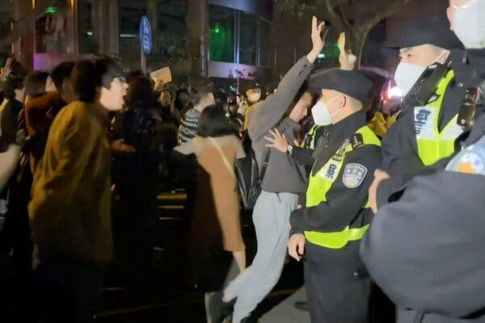
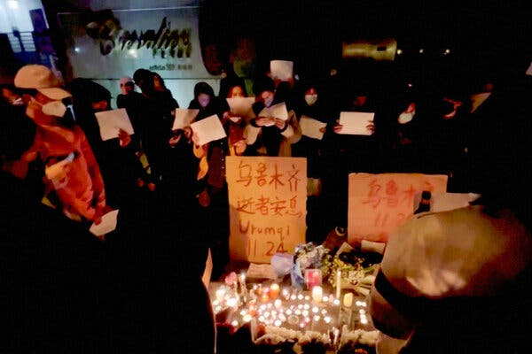
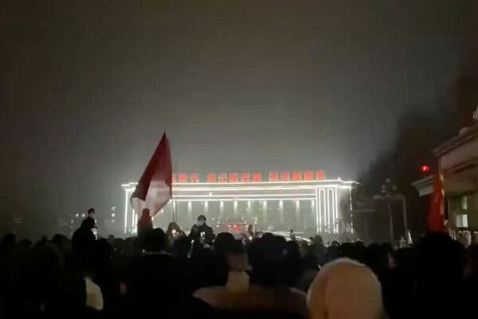
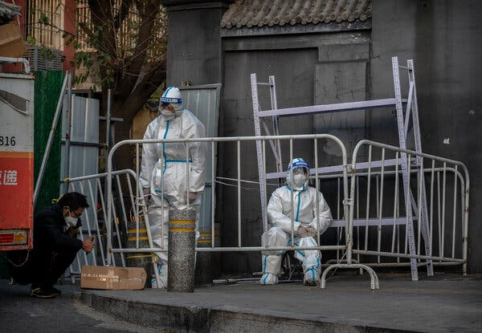

## 上海和中国其他城市爆发新冠肺炎控制措施抗议活动

A chanting crowd called for China’s leader, Xi Jinping, to step down, a rare act of defiance reflecting growing anger after nearly three years of lockdowns.

Credit...via Agence France-Presse — Getty Images

Published Nov. 26, 2022Updated Nov. 27, 2022, 1:15 a.m. ET

Protests spread to cities and college campuses around China on Saturday night, reflecting rising public anger at the country’s draconian Covid controls, with some in a crowd in Shanghai directing their fury at the Communist Party and its top leader, Xi Jinping.

周六晚上，抗议活动蔓延到中国各地的城市和大学校园，反映出公众对该国严厉的新冠病毒控制措施的愤怒情绪不断上升，上海人群中的一些人将他们的愤怒指向了共产党及其最高领导人习近平。

The wider demonstrations followed an outpouring of online anger and a street protest that erupted Friday [in Urumqi,](https://www.nytimes.com/2022/11/25/world/asia/china-fire.html) the regional capital of Xinjiang in western China, where at least 10 people died and nine others were injured in an apartment fire on Thursday. Many Chinese people say they suspect Covid restrictions prevented those victims from escaping their homes, a claim the government has rejected.

爆发了网上的愤怒情绪和街头抗议活动，随后发生了更广泛的示威活动，周四 [乌鲁木齐](https://www.nytimes.com/2022/11/25/world/asia/china-fire.html) 上周五在中国西部新疆自治区首府 ，至少有 10 人在公寓火灾中丧生，另有 9 人受伤。 许多中国人表示，他们怀疑 Covid 限制措施阻止了这些受害者逃离家园，但政府拒绝了这一说法。

The tragedy has fanned broader calls to ease China’s harsh regimen of Covid tests, urban lockdowns and limits on movement nearly three years into the pandemic. For much of that time, many accepted such controls as a price for avoiding the widespread illness and deaths that the United States, India and other countries endured. But public patience has eroded this year as other nations, bolstered by vaccines, moved back to something like normal, even as infections continued. And after years of enforcing the strict “zero Covid” rules, many local officials appear worn down.

这场悲剧引发了更广泛的呼吁，要求放宽中国在大流行近三年的严酷新冠病毒检测、城市封锁和行动限制制度。 在那段时间的大部分时间里，许多人接受这种控制作为避免美国、印度和其他国家遭受的广泛疾病和死亡的代价。 但今年公众的耐心已经消退，因为其他国家在疫苗的支持下恢复了正常状态，即使感染仍在继续。 在多年执行严格的“零 Covid”规则之后，许多地方官员显得疲惫不堪。

The widening discontent may test Mr. Xi’s efforts to hold those rules in place.

日益扩大的不满情绪可能会考验习近平为遵守这些规则所做的努力。

“The demonstrations across the country have been like the spark that lit a prairie fire,” James Yu, a resident of Shanghai, said in an interview, adopting a Chinese phrase used to describe the spread of Mao Zedong’s Communist revolution. “I feel like everyone can make their voice loud and clear. It feels powerful.”

“全国各地的示威活动犹如星火燎原，”上海居民余承东在接受采访时说。 “我觉得每个人都能发出响亮而清晰的声音。 感觉很强大。”

The biggest protest on Saturday appeared to be in [Shanghai](https://www.nytimes.com/interactive/2022/04/29/world/asia/shanghai-lockdown.html?searchResultPosition=4), where hundreds of people, mostly in their twenties, gathered at an intersection of Urumqi Road, named after the city in Xinjiang, to grieve the dead with candles and signs. Many there and elsewhere held sheets of blank white paper over their heads or faces in mournful defiance; white is a funeral color in China.

周六最大的抗议活动似乎发生在 [上海](https://www.nytimes.com/interactive/2022/04/29/world/asia/shanghai-lockdown.html?searchResultPosition=4) ，数百人聚集在以新疆城市命名的乌鲁木齐路的一个十字路口，用蜡烛和标语哀悼死者。 那里和其他地方的许多人悲哀地反抗着他们的头或脸上的白纸。 白色在中国是葬礼的颜色。

Image

Credit...via Reuters

The numbers grew, while lines of police officers looked on, and chants broke out, with people calling for an easing of the Covid controls, video footage showed. Some used obscene language to denounce the demand that residents check in with a Covid phone app in public places such as shops and parks. Their shouts took on a boldly political edge.

视频片段显示，人数在增加，警察排成一排观看，并爆发口号，人们呼吁放松对 Covid 的控制。 一些人使用淫秽语言谴责要求居民在商店和公园等公共场所使用 Covid 电话应用程序办理登机手续的要求。 他们的呼声带有大胆的政治色彩。

“We want freedom,” [protesters chanted](https://www.youtube.com/watch?v=QwATngtX620).

“我们要自由，” [抗议者高呼](https://www.youtube.com/watch?v=QwATngtX620) 。

Some also [directed their anger at Mr. Xi](https://twitter.com/whyyoutouzhele/status/1596578107540099076?s=20&t=IB_X4T6UojZiFkhkMODzZg), a rare act of political defiance likely to alarm Communist Party officials and to prompt tighter censorship and policing.

一些人还把 [怒火指向了习近平](https://twitter.com/whyyoutouzhele/status/1596578107540099076?s=20&t=IB_X4T6UojZiFkhkMODzZg) ，这是一种罕见的政治反抗行为，可能会惊动共产党官员并促使更严格的审查和监管。

“Xi Jinping!” a man in the crowd repeatedly shouted.

“习近平！” 人群中一名男子连声喊道。

“Step down!” some chanted in response. Many protesters used their phones to record the collective mourning and protests, images that may spread despite censorship, emboldening others to speak out.

“下台！” 一些人高喊着回应。 许多抗议者用手机记录集体哀悼和抗议，这些图像可能会在审查制度下传播，鼓励其他人大声疾呼。

The protest dispersed after more police officers moved in, dividing the crowd, and officers dragged some people away, according to Eva Rammeloo, a Dutch journalist who was there posting updates [on Twitter](https://twitter.com/eefjerammeloo/status/1596561813692219393).

发布最新消息的荷兰记者伊娃·拉默洛 (Eva Rammeloo) 称，在更多警察进入、将人群分开、警察将一些人拖走后，抗议活动散去 [据当时在 Twitter 上](https://twitter.com/eefjerammeloo/status/1596561813692219393) 。

Last month, Mr. Xi won a groundbreaking third term as the Communist Party’s general secretary, [entrenching his status](https://www.nytimes.com/2022/10/14/world/asia/china-xi-jinping-communist-party.html?) as China’s most powerful leader in decades. He also packed a new national leadership lineup with loyalist officials, making his hold seem assured.

上个月，习近平开创性地赢得了共产党总书记的第三个任期， [巩固了他](https://www.nytimes.com/2022/10/14/world/asia/china-xi-jinping-communist-party.html?) 几十年来中国最有权势领导人的地位。 他还组建了一个新的国家领导阵容，其中包括忠诚的官员，这让他的控制看起来很有把握。

But the night of public anger signals how his stringent Covid policies, initially heralded as a success for China after the pandemic spread globally from there in early 2020, are becoming a liability.

但当晚的公众愤怒表明，在 2020 年初大流行病从中国蔓延到全球之后，他最初被誉为中国成功的严厉 Covid 政策正在成为一种负担。

They have hurt restaurants, shops and other small businesses, worsening China’s economic slowdown. This month, thousands of factory workers angry over bungled lockdown measures and delays in payment of a promised bonus [clashed with riot police](https://www.nytimes.com/2022/11/24/world/asia/china-unrest-covid-lockdowns.html) and tore down barricades at a huge plant in central China that makes iPhones.

它们伤害了餐馆、商店和其他小企业，加剧了中国经济放缓。 本月，数千名工厂工人对拙劣的封锁措施和延迟支付承诺的奖金感到愤怒，他们 [与防暴警察发生冲突，并拆除了路障。](https://www.nytimes.com/2022/11/24/world/asia/china-unrest-covid-lockdowns.html) 在中国中部一家生产 iPhone 的大型工厂

Image

Credit...via Reuters

Officials continue to fear that unchecked spread of Covid, even in its less virulent forms, could lead to mass deaths. China’s domestically developed Covid vaccine is generally less effective than some developed abroad, but Beijing has not approved the foreign mRNA vaccines for domestic use. Many older Chinese people have resisted vaccination or booster shots, sometimes because they are wary of side effects, believe unfounded rumors about the risks, or feel they are safe from exposure to the virus.

官员们仍然担心，新冠病毒不受控制地传播，即使是毒性较小的形式，也可能导致大规模死亡。 中国国产的新冠疫苗普遍不如国外研发的疫苗有效，但北京方面还没有批准国外的mRNA疫苗在国内使用。 许多年长的中国人拒绝接种疫苗或加强针，有时是因为他们担心副作用，相信有关风险的毫无根据的谣言，或者觉得他们不会接触病毒。

On Sunday, the People’s Daily — the Chinese Communist Party’s main newspaper — called for sticking with Mr. Xi’s policies.

周日，中国共产党的主要报纸《人民日报》呼吁坚持习近平的政策。

Measured in Covid deaths and hospitalizations, “Chinese people have had the least impact from the pandemic,” the [front-page editorial](https://www.thepaper.cn/newsDetail_forward_20917814) said. Officials and the public, it said, must “firmly overcome slackening and war weariness.”

称，以新冠肺炎死亡人数和住院人数来衡量，“中国人受疫情影响最小” [头版社论](https://www.thepaper.cn/newsDetail_forward_20917814) 。 它说，官员和公众必须“坚决克服懈怠和厌战情绪”。

This month, the government issued measures to [ease the restrictions](https://www.nytimes.com/2022/11/22/world/asia/china-zero-covid.html) that have hampered travel and business. Yet local officials remain under intense pressure to keep infections near zero, leading to confusing flip-flops in rule enforcement. The resulting uncertainty over where China’s war on Covid is going and when it might end has fueled public frustration, as seen in Urumqi, Shanghai and beyond.

本月，政府出台措施 [放宽](https://www.nytimes.com/2022/11/22/world/asia/china-zero-covid.html) 阻碍旅行和商务的限制。 然而，地方官员仍然承受着将感染率保持在接近零的巨大压力，导致规则执行过程中出现混乱。 正如在乌鲁木齐、上海及其他地区所见，中国对新冠病毒的战争将走向何方以及何时结束的不确定性加剧了公众的沮丧情绪。

“There is only one disease in the world, that is, being unfree and poor, and now we have both,” a man in Chongqing, in southwest China, [declared in a video](https://www.youtube.com/watch?v=H9PuQlqrQB0) that spread widely in the country in recent days despite censorship.

“世界上只有一种病，那就是不自由和贫穷，而现在我们两者兼而有之，”中国西南部重庆市的一名男子在 [一段视频中宣称，](https://www.youtube.com/watch?v=H9PuQlqrQB0) 尽管受到审查，该视频最近几天在全国广泛传播。

“Give me liberty or give me death!” shouted the man, whose identity is unknown but who quickly acquired the nickname “Super Brother” online.

“要么给我自由，要么给我死亡！” 男子喊道，身份不详，但很快在网上获得了“超级大哥”的绰号。

Protests and mourning vigils also took place on at least three university campuses, according to online videos verified by The Times.

根据泰晤士报核实的在线视频，至少三所大学校园也发生了抗议和哀悼守夜活动。

“Before I felt I was a coward, but now at this moment I feel I can stand up,” a young man who said he was from Xinjiang [told a gathering](https://twitter.com/Pandazhq/status/1596532781583986688?s=20&t=izVnmG_FmmbS1N1jKmrnKA) at a campus of the Communication University of China in Nanjing, in eastern China. His comments were captured by a video that emerged online on Saturday night and whose location was verified by The Times.

“以前我觉得自己是个胆小鬼，但现在我觉得我可以站起来了，”一名自称来自新疆的年轻人 [一次聚会上说](https://twitter.com/Pandazhq/status/1596532781583986688?s=20&t=izVnmG_FmmbS1N1jKmrnKA) 在中国东部南京的中国传媒大学校园内的 。 他的评论被周六晚上出现在网上的一段视频记录下来，该视频的位置得到了《泰晤士报》的证实。

Hundreds held up their phones like lit candles. He said, “I speak for my home region, speak for those friends who lost relatives and kin in the fire disaster.”

数百人像点燃的蜡烛一样举起手机。 他说，“我为家乡发声，为那些在火灾中失去亲人的朋友们发声。”

“And,” he added, “for the deceased.”

“还有，”他补充说，“为了死者。”

Image

Credit...Kevin Frayer/Getty Images

Smaller protests and vigils also occurred at [Peking University](https://twitter.com/10min_WORLD/status/1596570518626312193?s=20&t=G9-9YIvNWGHV8SDR-8XKKw) and [Wuhan University of Technology](https://twitter.com/whyyoutouzhele/status/1596502881758482433?s=20&t=KeInaMpjv9ZqeoqD9qfKpA), videos, verifiable from the buildings in the background, showed.

也发生了规模较小的抗议和守夜活动。 [北京大学](https://twitter.com/10min_WORLD/status/1596570518626312193?s=20&t=G9-9YIvNWGHV8SDR-8XKKw) 和 [武汉理工大学](https://twitter.com/whyyoutouzhele/status/1596502881758482433?s=20&t=KeInaMpjv9ZqeoqD9qfKpA) 可从背景中的建筑物验证的视频显示，

A protest also broke out in another city in Xinjiang: Korla, in the region’s north. Hundreds of residents assembled at the prefecture’s government office, as seen in video footage that appeared [online on Saturday evening](https://twitter.com/whyyoutouzhele/status/1596530237868838912?s=20&t=i4PfO72csMYUMh7diUd6eA).

新疆的另一个城市也爆发了抗议活动：该地区北部的库尔勒市。 出现在网上的视频片段可以看出，数百名居民聚集在该县政府办公室 [从周六晚上](https://twitter.com/whyyoutouzhele/status/1596530237868838912?s=20&t=i4PfO72csMYUMh7diUd6eA) 。

“Lift the lockdown,” they shouted.

“解除封锁，”他们喊道。

The Xinjiang region has been under intense security controls for years as part of the government’s long clampdown on Uyghurs, a largely Muslim ethnic group. But many protesters in Korla seemed to be members of China’s Han ethnic majority, to judge by their accents and appearance, as were many protesters in Urumqi, the regional capital.

新疆地区多年来一直处于严格的安全控制之下，这是政府长期镇压维吾尔族的一部分，维吾尔族主要是穆斯林。 但库尔勒的许多抗议者似乎是中国占多数的汉族成员，从他们的口音和外表可以判断，地区首府乌鲁木齐的许多抗议者也是如此。

During the night, [an official came out](https://twitter.com/whyyoutouzhele/status/1596535092595331072?s=20&t=i4PfO72csMYUMh7diUd6eA) and promised the crowd in Korla that lockdowns would be eased, prompting applause and shouts of welcome.

当晚， [一名官员出来](https://twitter.com/whyyoutouzhele/status/1596535092595331072?s=20&t=i4PfO72csMYUMh7diUd6eA) 向库尔勒的人群承诺将放松封锁，引发掌声和欢迎声。

But before the latest demonstrations, the Xinjiang government had been warning residents that strict Covid measures remained necessary, and the security authorities there and elsewhere across China are also likely now to tighten monitoring and security in an effort to prevent further unrest.

但在最近的示威活动之前，新疆政府一直在警告居民，仍然有必要采取严格的抗疫措施，那里和中国其他地方的安全部门现在也可能会加强监控和安全，以防止进一步的骚乱。

“The pandemic risks have not been thoroughly eradicated, and the chains of transmission have not been totally broken, so the slightest relaxation may bring a rebound,” the Xinjiang leadership [announced on Saturday](https://archive.ph/DWex8). Officials, it said, must “sternly attack concocting and spreading rumors, inciting incidents, violently resisting pandemic control measures and other criminal conduct.”

，新疆领导层宣布：“大流行风险尚未彻底消除，传播链尚未完全断绝，因此丝毫放松可能会带来反弹 [周六](https://archive.ph/DWex8) 。 ” 它说，官员们必须“严厉打击编造和传播谣言、煽动事件、暴力抗拒疫情防控措施等违法犯罪行为。”

In Shanghai, many neighborhoods have begun demanding that residents do frequent, often time-consuming Covid nucleic acid tests again — only days after announcing that tests would be seldom needed going forward. In that city, which endured a grueling two-month lockdown earlier this year in an effort to stamp out a Covid outbreak, the deadly fire in Urumqi appeared to reignite public anger over that episode.

在上海，许多社区已经开始要求居民再次进行频繁且通常很耗时的 Covid 核酸检测——就在几天前，他们宣布以后将很少需要进行检测。 乌鲁木齐市今年早些时候为了遏制新冠疫情爆发而经历了为期两个月的艰苦封锁，而乌鲁木齐发生的致命火灾似乎再次点燃了公众对这一事件的愤怒。

“Yesterday, I saw about the fire tragedy in Urumqi and was crying all the time, and then I thought of the time when Shanghai was under lockdown this year,” said Kira Yao, a sales manager in Shanghai, who said she attended a candlelight vigil for victims of the Urumqi fire.

“昨天，我看到乌鲁木齐的火灾悲剧，一直在哭，然后我想起了今年上海封城的时候，”上海的一位销售经理 Kira Yao 说，她说她参加了烛光晚会为乌鲁木齐火灾遇难者守夜。

“Later we shouted ‘No nucleic acid tests, we want freedom’ and ‘No to health codes,’ and I and my friends cried — I felt like finally I could say what I’ve wanted to say.”

“后来我们高喊‘不做核酸检测，我们要自由’和‘不要健康码’，我和我的朋友们都哭了——我觉得我终于可以说出我想说的话了。”

Zixu Wang contributed research.

Zixu Wang 贡献的研究。

Chris Buckley is chief China correspondent and has lived in China for most of the past 30 years after growing up in Sydney, Australia. Before joining The Times in 2012, he was a correspondent in Beijing for Reuters. [@ChuBailiang](https://twitter.com/ChuBailiang)

Muyi Xiao is reporter on the [Visual Investigations](https://www.nytimes.com/spotlight/visual-investigations) team, which combines traditional reporting with advanced digital forensics. She has been covering China for the past decade. [@muyixiao](https://twitter.com/muyixiao)
