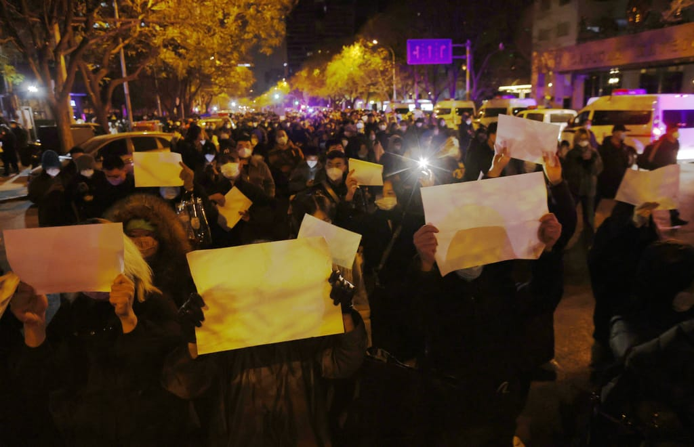

_Jamil Anderlini is editor-in-chief of POLITICO Europe and spent two decades as a reporter in China._

_贾米尔·安德利尼 (Jamil Anderlini) 是 POLITICO Europe 的主编，曾在中国做过二十年的记者。_

“Chinese people should be braver!” the young man with a handful of yellow flowers exhorted the large crowd gathered in central Shanghai on Sunday. “Am I breaking the law by holding these flowers? They don’t dare to arrest us!”

“中国人应该勇敢一点！” 周日，拿着一把黄色花朵的年轻人对聚集在上海市中心的大批人群进行了劝告。 “我拿着这些花是不是犯法了？ 他们不敢抓我们！”

Moments later he was tackled by plain-clothed agents and uniformed police and bundled, struggling, into [the back of a cruiser](https://twitter.com/whyyoutouzhele/status/1596773635112390657). 

片刻之后，他被便衣特工和穿制服的警察制服，并挣扎着被捆绑到 [一辆巡洋舰的后部](https://twitter.com/whyyoutouzhele/status/1596773635112390657) 。

As I watched scenes like this on social media over the weekend, it struck me how successfully Xi Jinping’s Communist Party has erased the traces of its brutality — from Mao’s Great Leap Famine and Cultural Revolution to the Tiananmen Square massacre to the crushing of the Uyghur, Tibetan and Hong Kong people.

当我周末在社交媒体上看到这样的场景时，令我震惊的是，习近平的共产党如何成功地抹去了其暴行的痕迹——从毛泽东的大跃进饥荒和文化大革命到天安门广场大屠杀再到镇压维吾尔人，西藏人和香港人。

### You may like

### 你可能喜欢

Each time the authorities grabbed somebody or laid into the crowd, the reaction was disbelief: “They’re beating people!” “We’re all Chinese,” or even, somewhat ironically, “Serve the people!” — the phrase adorning the main entrance to the Zhongnanhai leadership compound in Beijing.

每次当局抓人或冲进人群时，人们的反应都是难以置信的：“他们在打人！” “我们都是中国人”，甚至有点讽刺的是，“为人民服务！” - 装饰北京中南海领导大院正门的短语。

The brave young people who came out on scores of college campuses and on streets of major cities at the weekend are tragic victims of enforced collective amnesia. They have no idea what is in store for them.

周末出现在数十个大学校园和大城市街头的勇敢的年轻人是被迫集体失忆的悲惨受害者。 他们不知道等待他们的是什么。

As a reporter in China for more than two decades, I witnessed hundreds of protests and acts of civil disobedience. I sought these out to get a sense of the wider mood of the nation. Almost without exception, they involved localized or isolated grievances. All of them ended in a brutal crackdown.

作为一名在中国工作二十多年的记者，我亲眼目睹了数百起抗议和公民抗命行为。 我寻找这些是为了了解这个国家更广泛的情绪。 几乎无一例外，它们都涉及局部或孤立的申诉。 所有这些都以残酷镇压告终。

More often than not, the protesters would espouse loyalty to the Chinese Communist Party (CCP) and central government leadership, while railing against the provincial cadres they blamed for pollution, corruption or petty malfeasance. Their plight almost never resonated beyond their immediate communities.

通常情况下，抗议者会拥护对中国共产党 (CCP) 和中央政府领导层的忠诚，同时谴责他们指责污染、腐败或轻微渎职的省级干部。 他们的困境几乎从未在他们的直接社区之外引起共鸣。

The only times I witnessed anything like nationwide protests were when the CCP orchestrated them — against the United States after it bombed the Chinese embassy in Belgrade in 1999 and periodically against Japan when the leadership wanted to whip up nationalist fervor.

我唯一一次目睹类似全国性的抗议活动是在中共精心策划的情况下——在 1999 年美国轰炸中国驻贝尔格莱德大使馆后针对美国，以及在领导层想要煽动民族主义热情时定期针对日本。

## Calls for democracy

## 呼吁民主

So it was astonishing to hear people openly calling for democracy, the end of party rule and the toppling of Xi at the weekend. 

因此，周末听到人们公开呼吁民主、结束党的统治和推翻习近平，真是令人惊讶。

Something has definitely changed in the mood of the Chinese nation and it does not bode well for Xi or the CCP. This is not just pent-up frustration from three years of COVID lockdowns and a moribund economy. It is the consequence of a decade of steadily worsening repression, following two decades (the 1990s and 2000s) of relative loosening.

中华民族的情绪肯定发生了变化，这对习近平或中共来说都不是好兆头。 这不仅仅是三年的 COVID 封锁和垂死的经济所压抑的挫败感。 这是继 20 年（1990 年代和 2000 年代）相对放松之后镇压持续恶化的十年的结果。

Protesters march while holding blank sheets of paper — a symbol of protest against censorship | Mark R. Cristino/EPA-EFE

It is also the result of a propaganda and information control system that has been all too successful, until now.

这也是迄今为止非常成功的宣传和信息控制系统的结果。

Every historical injustice at the hands of foreigners is drilled into young minds from kindergarten while libraries, schools and the internet are purged of all mention of the tens of millions who perished thanks to CCP policy. 

外国人手中的每一次历史不公正都从幼儿园开始就深入到年轻人的脑海中，而图书馆、学校和互联网上的所有提及因中共政策而丧生的数千万人都被清除了。

I was once approached on a reporting trip by a slightly confused six-year-old who plucked up the courage to ask me why I had burned down the Summer Palace in Beijing — as a member of the Anglo-French occupying forces in 1860. He definitely had never heard of the Cultural Revolution or the Tiananmen massacre.

有一次，一个略显困惑的 6 岁孩子找我做报道，他鼓起勇气问我，为什么我在 1860 年作为英法占领军的一员烧毁了北京的颐和园。他绝对没有听说过文化大革命或天安门大屠杀。

All news and information from abroad is heavily censored and all domestic information tightly controlled, with uniformed police officers stationed in the offices of large Chinese tech companies and paramilitary troops on every university campus.

来自国外的所有新闻和信息都受到严格审查，所有国内信息都受到严格控制，身穿制服的警察驻扎在中国大型科技公司的办公室，准军事部队驻扎在每个大学校园。

It was almost [comical this weekend](http://xn--western%20media%20badmouth%20chinas%20epidemic%20like%20how%20washington%20fans%20the%20flames%20in%20russia-ukraine%20conflict%20-%20global%20times-9579g/) to watch Chinese state media tie itself in knots trying to blame the protests, which can’t be mentioned directly, on “Western media,” which is almost entirely blocked in China.

滑稽的。 [本周末](http://xn--western%20media%20badmouth%20chinas%20epidemic%20like%20how%20washington%20fans%20the%20flames%20in%20russia-ukraine%20conflict%20-%20global%20times-9579g/) 看到中国官方媒体纠缠不清试图将无法直接提及的抗议归咎于在中国几乎完全被屏蔽的“西方媒体”，这几乎是

Since they have little or no knowledge of past atrocities, young Chinese mostly believe the motherland loves them and would never really harm them.

由于对过去的暴行知之甚少或一无所知，中国年轻人大多认为祖国爱他们，永远不会真正伤害他们。

But the same applies to Xi and his minions. By turning the Chinese internet into a giant, sanitized, intranet, and without the ultimate barometer of public opinion — elections — they deny themselves proper intelligence on the mood of the masses. 

但这同样适用于习近平和他的爪牙。 通过将中国互联网变成一个巨大的、经过净化的内部网，并且没有最终的民意晴雨表——选举——他们否认自己对群众情绪有适当的了解。

So they start to get high on their own supply. 

所以他们开始依赖自己的供应。

## Zero hour

## 零时

That is what happened with “COVID-zero” — a signature Xi policy that allowed China to avoid high infection and death rates seen elsewhere but which, after three years, has left the economy floundering and the country closed off from a world that has moved on. 

“COVID-zero”就是这种情况——习近平的一项标志性政策使中国避免了在其他地方出现的高感染率和高死亡率，但三年后，这让经济陷入困境，该国与一个已经发生变化的世界隔绝开来上。

Xi and his underlings have often lauded the superiority of the Chinese political system in keeping Chinese people safe from the terrible virus. But this gloating wasn’t accompanied by a superior vaccine or a plan, other than harsh lockdowns, to deal with the more infectious outbreak we now see in the country.

习近平及其下属经常称赞中国政治制度在保护中国人民免受可怕病毒侵害方面的优越性。 但是，除了严厉的封锁之外，这种幸灾乐祸并没有伴随着更好的疫苗或计划来应对我们现在在该国看到的更具传染性的疫情。

The ostensible trigger for the weekend’s protests was a horrific fire that killed at least 10 in the city of Urumqi, the regional capital of the Xinjiang region where the party has incarcerated millions of Uyghurs and other Muslims in “re-education camps.” The city has been locked down for months and many blamed the deaths on COVID restrictions that sealed most exits and obstructed the fire department. 

周末抗议活动的表面导火索是一场可怕的大火，这场大火在新疆地区首府乌鲁木齐市造成至少 10 人死亡，该党将数百万维吾尔人和其他穆斯林关押在“再教育营”中。 这座城市已经被封锁了几个月，许多人将死亡归咎于 COVID 限制，这些限制封锁了大多数出口并阻碍了消防部门。

The shocking sight of huge maskless crowds at the World Cup in Qatar certainly contributed to widespread anger as COVID cases hit record highs and many cities went back into lockdown. In a belated attempt to fix their mistake, the authorities have apparently banned close-up shots of the Qatar crowds.

随着 COVID 病例创下历史新高，许多城市重新进入封锁状态，卡塔尔世界杯上大量未戴口罩的人群令人震惊，这无疑引发了广泛的愤怒。 为了纠正他们的错误，当局显然已禁止对卡塔尔人群进行特写镜头拍摄，但为时已晚。

After more than a decade on the throne, Xi has consolidated more formal power than any leader since Mao Zedong. But he has created legions of enemies in the process and, for the first time in decades, people are openly calling for wholesale political change in China.

在位十多年后，习巩固了比毛泽东以来任何领导人都多的正式权力。 但他在这个过程中树敌众多，几十年来，人们第一次公开呼吁在中国进行全面的政治变革。

That is why his reaction will be swift and brutal, using all the tools of digital totalitarianism. 

这就是为什么他的反应会迅速而残酷，使用数字极权主义的所有工具。

On Monday, I watched another poignant video filmed at Peking University that morning, where a student is snatched by a group of plain-clothed thugs and bundled off, but not before he yells out: [“Give me liberty or give me death!”](https://twitter.com/whyyoutouzhele/status/1597094269701214209?s=20&t=Df2BwSmhTNnNo7xxeCscsA)

星期一，我观看了那天早上在北京大学拍摄的另一段令人心酸的视频，一名学生被一群便衣暴徒抢走并绑起来，但在他大喊之前： [“不自由，毋宁死！”](https://twitter.com/whyyoutouzhele/status/1597094269701214209?s=20&t=Df2BwSmhTNnNo7xxeCscsA)

The idealistic people who came out over the weekend do not realize what horrors await them. But at least the mask has slipped and the Chinese masses can see the true face of the regime that rules them.

周末出来的理想主义者并没有意识到等待他们的是什么恐怖。 但至少面具已经脱落，中国群众可以看到统治他们的政权的真面目。
