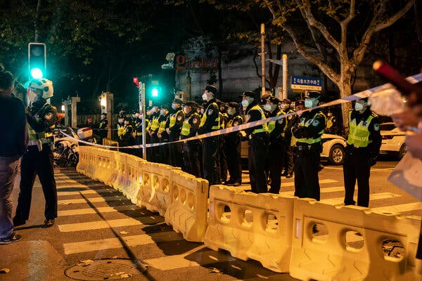

## 白宫权衡支持中国抗议者的力度

The demonstrations over Covid lockdowns present a challenge for President Biden, who has insisted he will call out abuses by authoritarian governments.

Credit...The New York Times

Nov. 28, 2022

Sign up for the Russia-Ukraine War Briefing.  Every evening, we'll send you a summary of the day's biggest news.

WASHINGTON — The surprise eruption of [protests in China over Covid lockdowns](https://www.nytimes.com/2022/11/28/world/asia/china-protests-covid-beijing.html) presents President Biden with his latest challenge in balancing an embrace of democracy with the need to prevent a fast-decaying relationship with an autocratic nation from rupturing.

华盛顿—— [中国因新冠病毒封锁而意外爆发的抗议活动](https://www.nytimes.com/2022/11/28/world/asia/china-protests-covid-beijing.html) 给拜登总统带来了最新挑战，他需要平衡拥抱民主与防止与专制国家迅速恶化的关系破裂的需要。

The White House reacted cautiously on Monday to the scenes of Chinese citizens denouncing the country’s zero-Covid policies and the revival of widespread censorship. In a statement, repeated almost verbatim in the White House press room by John F. Kirby, a spokesman for the National Security Council, the administration said only: “We’ve long said everyone has the right to peacefully protest, in the United States and around the world.”

周一，白宫对中国公民谴责该国的零新冠病毒政策和恢复广泛审查制度的场景反应谨慎。 国家安全委员会发言人约翰·柯比 (John F. Kirby) 在白宫新闻发布室几乎一字不差地重复了一份声明，政府只说：“我们长期以来一直说每个人都有权和平抗议，在美国和世界各地。”

“The president is not going to speak for protesters around the world,” Mr. Kirby, a former State Department and Pentagon press secretary who has juggled such questions repeatedly, told reporters who pressed him for a stronger statement. “They’re speaking for themselves.”

“总统不会为世界各地的抗议者说话，”前国务院和五角大楼新闻秘书柯比先生告诉那些敦促他发表更有力声明的记者，他曾多次权衡此类问题。 “他们在为自己说话。”

The statement was in sharp contrast to the repeated condemnations of Iranian authorities for their monthslong efforts to put down protests against Tehran’s government, and particularly their enforcement of regulations that women must wear a hijab. But administration officials said that the situations were not comparable, and that they had doubts that the protests that played out on the streets of Beijing and Shanghai over the weekend would be sustained, or that the calls for an end to Covid restrictions amounted to a fundamental call for government change. The officials spoke on the condition of anonymity to discuss sensitive deliberations.

该声明与伊朗当局一再谴责他们长达数月的努力镇压针对德黑兰政府的抗议活动，特别是他们执行妇女必须戴头巾的规定形成鲜明对比。 但政府官员表示，情况不可比，他们怀疑周末在北京和上海街头发生的抗议活动是否会持续下去，或者结束 Covid 限制措施的呼吁是否构成根本性的影响。呼吁政府变革。 这些官员在不愿透露姓名的情况下讨论了敏感的审议问题。

Instead, the administration focused on the substance of China’s Covid-containment policies, rather than on any police response to [the protests](https://www.nytimes.com/2022/11/27/world/asia/china-covid-protest.html).

相反，政府关注的是中国遏制新冠病毒政策的实质，而不是警察对 [抗议活动](https://www.nytimes.com/2022/11/27/world/asia/china-covid-protest.html) 的任何反应。

Zero Covid is not a policy that the United States is pursuing, the White House said in a statement. “And as we’ve said, we think it’s going to be very difficult for the People’s Republic of China to be able to contain this virus through their zero-Covid strategy.”

白宫在一份声明中说，零新冠不是美国奉行的政策。 “正如我们所说，我们认为中华人民共和国将很难通过其零新冠病毒战略遏制这种病毒。”

“For us, we are focused on what works, and that means using the public health tools like encouraging Americans to get their updated vaccine and making testing and treatment easily accessible.”

“对我们来说，我们专注于有效的方法，这意味着使用公共卫生工具，比如鼓励美国人接种更新的疫苗，并让检测和治疗变得容易获得。”

The calculus about how vocally to support the protesters is a difficult one. Mr. Biden has cast the competition with China as the first example of what he calls a struggle between “autocracy and democracy,” and he has insisted that he will call out abuses by authoritarian governments around the world.

计算如何发声支持抗议者是一件困难的事情。 拜登先生将与中国的竞争视为他所谓的“专制与民主”斗争的第一个例子，并坚称他将谴责世界各地威权政府的滥用职权。

But any encouragement of the street protests would almost certainly be seen in Beijing as an effort to destabilize President Xi Jinping, right after he met Mr. Biden for a three-and-a-half-hour session in Bali this month. Already the Chinese government has accused the United States of pursuing a “containment” policy — a phrase from the Cold War — by limiting China’s ability to import semiconductor production equipment and by restricting the sales of Chinese communications equipment inside the United States.

但是，就在本月拜登在巴厘岛与拜登进行了三个半小时的会晤后，北京方面几乎肯定会把任何鼓励街头抗议的行为视为破坏稳定的行为。 中国政府已经指责美国通过限制中国进口半导体生产设备的能力以及限制中国通信设备在美国境内的销售来奉行“遏制”政策——冷战时期的一个用语。

On Friday, the Federal Communications Commission formally banned Huawei, the Chinese communications giant, from selling almost all of its 5G cellular communications equipment in the United States, citing national security risks.

周五，美国联邦通信委员会以国家安全风险为由，正式禁止中国通信巨头华为在美国销售其几乎所有 5G 蜂窝通信设备。

___

**What we consider before using anonymous sources.** Do the sources know the information? What’s their motivation for telling us? Have they proved reliable in the past? Can we corroborate the information? Even with these questions satisfied, The Times uses anonymous sources as a last resort. The reporter and at least one editor know the identity of the source.

**我们在使用匿名来源之前考虑的事项。**   消息来源知道这些信息吗？ 他们告诉我们的动机是什么？ 他们在过去被证明是可靠的吗？ 我们可以证实这些信息吗？ 即使解决了这些问题，时报还是使用匿名消息来源作为最后的手段。 记者和至少一位编辑知道消息来源的身份。

But administration officials say they see a distinction between banning products that could help the Chinese military and trying to destabilize China’s domestic politics. And at a moment when Mr. Biden is seeking continued restraint from China in supporting Russia in its war with Ukraine and to resume cooperation on climate issues, North Korea and other projects that Washington and Beijing once worked on regularly, the White House wants to pick its fights with care.

但政府官员表示，他们看到了禁止可能有助于中国军方的产品与试图破坏中国国内政治稳定的产品之间的区别。 在拜登先生寻求中国继续保持克制以支持俄罗斯与乌克兰的战争并恢复在气候问题、朝鲜和华盛顿和北京曾经经常合作的其他项目上的合作之际，白宫想要选择它小心翼翼地战斗。

There is also concern that the appearance of backing the protests, even just rhetorically, could deepen suspicions.

还有人担心，支持抗议活动的表态，即使只是口头上的支持，也会加深猜疑。

“The danger of exaggerating the scope of the protests is that American media will lend credence to Chinese government claims that these tentative, spontaneous demonstrations are the result of a foreign plot,” said Robert Daly, the director of the Kissinger Institute on China and the United States at the Wilson Center in Washington. “Beijing will intimidate demonstrators by saying they are participating in a color revolution.”

“夸大抗议范围的危险在于，美国媒体会让中国政府相信这些试探性、自发的示威活动是外国阴谋的结果，”基辛格中国研究所所长罗伯特戴利说。美国在华盛顿的威尔逊中心。 “北京将通过说他们正在参加颜色革命来恐吓示威者。”

Mr. Daly noted that the nature of the protests was unclear. “This is neither a revolution nor a movement yet, and it probably won’t become one,” he said.

戴利先生指出，抗议活动的性质尚不清楚。 “这既不是一场革命，也不是一场运动，而且它可能不会成为一场革命，”他说。

In fact, there were no demonstrations evident on Monday, and he noted that the protesters were mostly seeking “the freedom to live everyday life that they had before Covid.”

事实上，周一没有明显的示威活动，他指出，抗议者主要是在寻求“他们在 Covid 之前拥有的日常生活的自由”。

“True, there were calls for Xi and the party to step down at demonstrations in Shanghai,” he said, “but the scale was extremely limited.”

“的确，在上海的示威游行中有人要求习近平和党下台，”他说，“但规模极其有限。”

The White House’s focus on the immediate origins of the protests — the Covid restrictions — stepped around the other element of the demonstrations, in which [blank sheets of paper](https://www.nytimes.com/2022/11/28/world/asia/china-protests-blank-sheets.html) were held up. It was a way around laws that ban pro-democracy slogans and that consider some of them sedition.

白宫对抗议活动的直接起源——Covid 限制——的关注绕过了示威活动的另一个要素，即 [举着白纸](https://www.nytimes.com/2022/11/28/world/asia/china-protests-blank-sheets.html) 。 这是一种绕过禁止民主口号并将其中一些口号视为煽动的法律的方法。

A year after declaring that the struggle between democracies and autocracies is the central issue of this era, Mr. Biden has confronted similarly difficult issues.

在宣布民主政体与专制政体之间的斗争是这个时代的核心问题一年后，拜登先生面临着类似的难题。

On a summer trip to Saudi Arabia, seeking to rebuild the foundations of the relationship with a country he once [labeled a “pariah” state](https://www.nytimes.com/2021/02/24/us/politics/biden-jamal-khashoggi-saudi-arabia.html), the president fist-bumped the prime minister, Crown Prince Mohammed bin Salman.

在夏季访问沙特阿拉伯时，为了重建与他曾被 [称为“贱民”国家](https://www.nytimes.com/2021/02/24/us/politics/biden-jamal-khashoggi-saudi-arabia.html) 的国家的关系基础，总统用拳头撞了首相、王储穆罕默德·本·萨勒曼。

The administration thought it had reached a quiet deal for the Saudis to increase oil production this fall. Instead, OPEC nations that included Saudi Arabia announced a production cut, forcing a furious Mr. Biden to [announce that he was ordering another review of the relationship](https://www.nytimes.com/2022/10/05/us/politics/opec-biden-saudi-arabia.html). That review is still underway.

政府认为它已经为沙特在今年秋天增加石油产量达成了一项安静的协议。 相反，包括沙特阿拉伯在内的欧佩克国家宣布减产，迫使愤怒的拜登先生 [宣布他正在下令重新审查这种关系](https://www.nytimes.com/2022/10/05/us/politics/opec-biden-saudi-arabia.html) 。 该审查仍在进行中。

As for China, Mr. Kirby said only that “the president is staying briefed on what is going on.”

至于中国，柯比先生只说“总统正在随时了解正在发生的事情。”

David E. Sanger is a White House and national security correspondent. In a 38-year reporting career for The Times, he has been on three teams that have won Pulitzer Prizes, most recently in 2017 for international reporting. His newest book is “The Perfect Weapon: War, Sabotage and Fear in the Cyber Age.”  [@SangerNYT](https://twitter.com/SangerNYT) • [Facebook](https://www.facebook.com/david.e.sanger)

A version of this article appears in print on Nov. 29, 2022, Section A, Page 8 of the New York edition with the headline: White House Weighs How Forcefully to Support Chinese Demonstrators. [Order Reprints](https://www.parsintl.com/publication/the-new-york-times/) | [Today’s Paper](https://www.nytimes.com/section/todayspaper) | [Subscribe](https://www.nytimes.com/subscriptions/Multiproduct/lp8HYKU.html?campaignId=48JQY)
