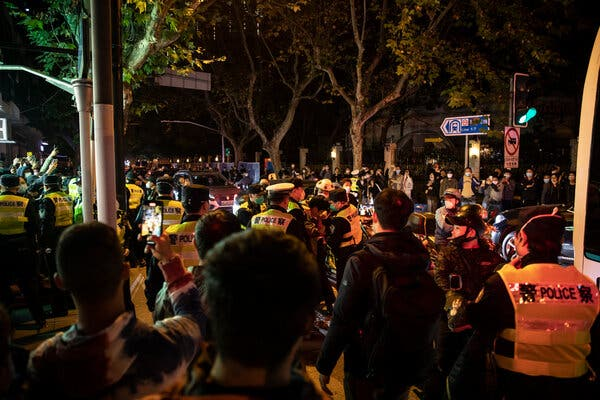
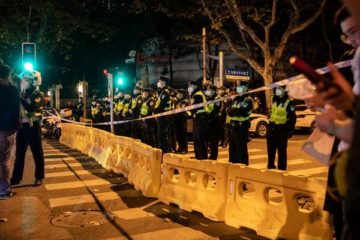
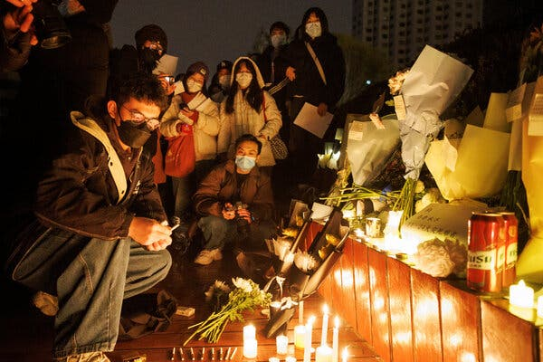
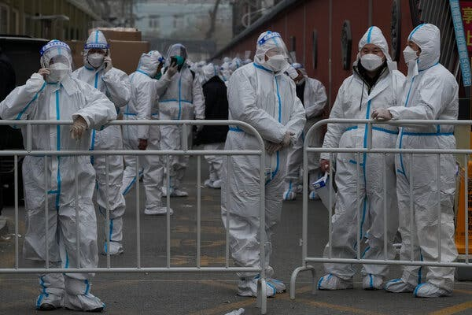

new new world

## 骄傲，害怕和冲突。 中国抗议者告诉我的。

In more than a dozen interviews, young people explained how the events of the past few days became what one called a “tipping point.”

Credit...The New York Times

Nov. 29, 2022Updated 9:10 a.m. ET

They went to their first demonstrations. They chanted their first protest slogans. They had their first encounters with the police.

他们参加了他们的第一次示威游行。 他们高喊他们的第一个抗议口号。 他们第一次遇到警察。

Then they went home, shivering in disbelief at how they had challenged the most powerful authoritarian government in the world and the most iron-fisted leader China has seen in decades.

然后他们回家了，不敢相信自己是如何挑战世界上最强大的威权政府和中国几十年来最铁腕的领导人的。

Young Chinese are protesting the country’s harsh “[zero-Covid](https://www.nytimes.com/2022/11/16/world/asia/china-zero-covid-policy-videos.html?action=click&pgtype=Article&state=default&module=styln-china-zero-covid&variant=show&region=BELOW_MAIN_CONTENT&block=storyline_flex_guide_recirc)” policy and even urging its top leader, Xi Jinping, to step down. It’s something China hasn’t seen since 1989, when the ruling Communist Party brutally cracked down on the pro-democracy demonstrators, mostly college students. No matter what happens in the days and weeks ahead, the young protesters presented a new threat to the rule of Mr. Xi, who has eliminated his political opponents and cracked down on any voice that challenges his rule.

中国年轻人抗议该国严厉的“ [零新冠病毒](https://www.nytimes.com/2022/11/16/world/asia/china-zero-covid-policy-videos.html?action=click&pgtype=Article&state=default&module=styln-china-zero-covid&variant=show&region=BELOW_MAIN_CONTENT&block=storyline_flex_guide_recirc) ”政策，甚至敦促其最高领导人习近平下台。 这是中国自 1989 年以来从未见过的情况，当时执政的共产党残酷镇压了民主示威者，其中大部分是大学生。 无论未来几天和几周发生什么，年轻的抗议者都对习近平的统治构成了新的威胁，习近平已经消灭了他的政治对手并镇压了任何挑战他统治的声音。

Such public dissent was unimaginable until a few days ago. These same young people, when they mentioned Mr. Xi online, used euphemisms like “X,” “he” or “that person,” afraid to even utter the president’s name. They put up with whatever the government put them through: harsh pandemic restrictions, high unemployment rates, fewer books available to read, movies to watch and games to play.

直到几天前，这种公众异议还是不可想象的。 同样是这些年轻人，当他们在网上提到习先生时，会使用“X”、“他”或“那个人”等委婉语，甚至不敢说出主席的名字。 他们忍受政府给他们的一切：严厉的流行病限制、高失业率、可供阅读的书籍、观看的电影和玩的游戏减少。

Then something cracked.

然后有东西裂开了。

After nearly three long years of “zero Covid,” which has turned into a [political campaign for Mr. Xi](https://www.nytimes.com/2022/09/09/business/china-covid-zero-xi-jinping.html), China’s future looks increasingly bleak. The economy is in its worst shape in decades. Mr. Xi’s foreign policy has antagonized many countries. His censorship policy, in addition to quashing challenges to his authority, has [killed nearly all fun](https://www.nytimes.com/2019/03/27/business/china-war-on-fun-earrings-tattoos.html).

在经历了将近三年的“零疫情”（已变成 [习近平的政治运动）](https://www.nytimes.com/2022/09/09/business/china-covid-zero-xi-jinping.html) 之后，中国的未来看起来越来越暗淡。 经济处于几十年来最糟糕的状态。 习近平的外交政策激怒了许多国家。 他的审查政策除了消除对他权威的挑战外， [几乎扼杀了所有的乐趣](https://www.nytimes.com/2019/03/27/business/china-war-on-fun-earrings-tattoos.html) 。

As a popular Weibo post put it, Chinese people are getting by with books published 20 years ago, music released a decade ago, travel photos from five years ago, income earned last year, frozen dumplings from a lockdown three months ago, Covid tests from yesterday, and a freshly baked [Soviet joke](https://www.nytimes.com/2022/11/28/world/asia/china-protests-blank-sheets.html) from today.

正如一条流行的微博帖子所说，中国人正在与 20 年前出版的书籍、10 年前发布的音乐、5 年前的旅行照片、去年赚取的收入、3 个月前封锁的冷冻饺子、来自昨天，以及今天新鲜出炉的 [苏联笑话](https://www.nytimes.com/2022/11/28/world/asia/china-protests-blank-sheets.html) 。

Image

Credit...The New York Times

“I think all of these have reached a tipping point,” said Miranda, a journalist in Shanghai who participated in the protest on Saturday evening. “If you don’t do anything about it, you could really explode.”

“我认为所有这些都已经达到了一个临界点，”周六晚上参加抗议活动的上海记者米兰达说。 “如果你什么都不做，你真的会爆炸。”

In the last few days, in interviews with more than a dozen young people who protested in Shanghai, Beijing, Nanjing, Chengdu, Guangzhou and Wuhan, I heard of a burst of pent-up anger and frustration with how the government implements “zero Covid.” But their anger and despair goes beyond that, all the way to questioning the rule of Mr. Xi.

在过去的几天里，在与上海、北京、南京、成都、广州和武汉抗议的十几名年轻人的访谈中，我听到政府如何实施“零冠状病毒”，压抑已久的愤怒和沮丧情绪爆发了。 ” 但他们的愤怒和绝望不止于此，一直到质疑习近平的统治。

Two of these people said that they don’t plan to have children, a new way to protest among young Chinese at a time when Beijing is encouraging more births. At least four of the protesters said that they were planning to emigrate. One of them refused to look for a job after being laid off by a video-game company in the aftermath of a [government crackdown on the industry](https://www.nytimes.com/2021/08/30/business/media/china-online-games.html) last year.

其中两人表示，他们不打算要孩子，这是在北京鼓励多生育之际，中国年轻人抗议的一种新方式。 至少有四名抗议者说他们打算移民。 后被一家视频游戏公司解雇后拒绝找工作。 [政府打击该行业](https://www.nytimes.com/2021/08/30/business/media/china-online-games.html) 其中一人在去年

Video

In Chinese cities where protests were held over the weekend, the police put on a show of force on Monday to deter gatherings. Some protesters showed up despite the tight security.CreditCredit...Kevin Frayer/Getty Images

They went to the protests because they wanted to let the government know how they felt about being tested constantly, locked inside their apartments or kept away from family and friends in the Covid dragnet. And they wanted to show solidarity for fellow protesters.

他们参加抗议活动是因为他们想让政府知道他们对不断接受测试、被锁在公寓内或在 Covid 天罗地网中远离家人和朋友的感受。 他们想表达对其他抗议者的声援。

They are members of a generation known as Mr. Xi’s children, the nationalistic [“little pinks”](https://www.nytimes.com/2020/06/24/business/china-nationalist-students-coronavirus.html) who defend China on Weibo, Facebook and Twitter. The protesters represent a small percentage of Chinese in their 20s and early 30s. By standing up to the government, they defied the perception of their generation. Some older Chinese people said that the protesters made them feel more hopeful about the country’s future.

他们是被称为习近平子女的一代人，即 [的民族主义“小粉红”](https://www.nytimes.com/2020/06/24/business/china-nationalist-students-coronavirus.html) 在微博、Facebook 和 Twitter 上捍卫中国 。 抗议者代表了一小部分 20 多岁和 30 多岁的中国人。 通过对抗政府，他们挑战了他们这一代人的看法。 一些年长的中国人说，抗议者让他们对国家的未来更有希望。

Zhang Wenmin, a former investigative journalist known under her pen name Jiang Xue, wrote on Twitter that she was moved to tears by the bravery of the protesters. “It’s hard for people who haven’t lived in China in the past three to four years to imagine how much fear these people had to overcome to take to the streets, to shout, ‘Give me liberty, or give me death,’” she wrote. “Amazing. Love you all!”

笔名江雪的前调查记者张文敏在推特上写道，她被抗议者的勇敢感动得流下了眼泪。 “过去三四年没有在中国生活过的人很难想象这些人要克服多少恐惧才能走上街头，高喊‘不自由，毋宁死’，”她写了。 “惊人。 爱你们！”

As first time marchers, most of them did not know what to expect. A Beijing protester said that she was so tense that she felt physically and emotionally exhausted the next day. More than one person told me that they needed a day to collect their thoughts before they could talk. At least three cried in our interviews.

作为第一次参加游行的人，他们中的大多数人不知道会发生什么。 一位北京抗议者说，她非常紧张，以至于第二天感到身心疲惫。 不止一个人告诉我，他们需要一天时间整理思绪才能开口说话。 在我们的采访中，至少有三个人哭了。

They are proud, scared and conflicted about their experiences. They have different views about how politically explicit their slogans should be, but they all said that they found shouting the slogans cathartic.

他们对自己的经历感到自豪、害怕和矛盾。 他们对自己的口号应该在政治上公开到什么程度有不同的看法，但他们都表示，他们觉得喊口号是一种宣泄。

Miranda, who has been a journalist for eight years, said that she couldn’t stop crying when she shouted with the crowd, “freedom of speech” and “freedom of press.” “It was the freest moment since I became a journalist,” she said, her voice cracking.

当了八年记者的米兰达说，当她和人群一起高喊“言论自由”和“新闻自由”时，她哭得停不下来。 “这是我成为记者以来最自由的时刻，”她说，声音沙哑。

All the people I interviewed asked me to use only their first name, family name or English name to protect their safety. They had felt a relative safety when marching with others just days earlier, but none dared to put their name to comments that would be published.

我采访的所有人都要求我只使用他们的名字、姓氏或英文名，以保护他们的安全。 几天前与其他人一起游行时，他们还感到相对安全，但没有人敢在即将发表的评论中署名。

The slogans that they recalled chanting were all over the place, illustrating the wide frustration with their lives. “End the lockdown!” “Freedom of speech!” “Give back my movies!”

他们回忆起高喊的口号到处都是，说明了他们对生活的广泛挫败感。 “结束封锁！” “言论自由！” “还我的电影！”

Quite a few of them were taken aback by how political the Saturday protest in Shanghai turned out to be.

他们中的不少人对周六上海抗议活动的政治色彩感到吃惊。

They were equally surprised, if not more, when more people returned on Sunday to request the release of protesters who had been detained hours earlier.

当周日有更多人返回要求释放几小时前被拘留的抗议者时，他们同样感到惊讶，甚至更多。

All six Shanghai protesters I spoke with thought that they were going to a vigil on Saturday evening for the 10 victims who died in a [fire Thursday in Urumqi](https://www.nytimes.com/2022/11/27/world/asia/china-covid-protest.html), the capital of the Xinjiang region in China’s west. In the beginning, the atmosphere was relaxed.

丧生的 10 名遇难者举行守夜活动 [乌鲁木齐的一场火灾中](https://www.nytimes.com/2022/11/27/world/asia/china-covid-protest.html) 与我交谈过的所有六名上海抗议者都认为，他们将在周六晚上为周四在中国西部新疆地区首府 。 一开始，气氛还算轻松。

Image

Credit...Thomas Peter/Reuters

When someone first chanted, “No more Communist Party,” the crowd laughed, according to Serena, a college student who is spending her gap year in Shanghai. “Everyone knew it was the redline,” she said.

据正在上海度过间隔年的大学生塞雷娜说，当有人第一次高呼“不再有共产党”时，人群都笑了。 “每个人都知道这是红线，”她说。

Then it became increasingly charged. When someone yelled, “Xi Jinping, step down!” and “C.C.P., step down!” the shouts were the loudest, according to Serena and other protesters who were also there.

然后它变得越来越收费。 当有人喊“习近平，下台！” 和“CCP，下台！” 据塞雷娜和当时在场的其他抗议者说，喊声是最响亮的。

In Beijing, a marketing professional in her mid-20s with the surname Wu told her fellow protesters not to shout those politically explicit slogans because that would guarantee a crackdown. Instead, she shouted slogans that urged the government to implement the rule of law and release detained Shanghai protesters.

在北京，一位 20 多岁的姓吴的营销专业人士告诉她的抗议者同伴们不要喊那些政治上露骨的口号，因为那会保证镇压。 相反，她高喊口号，敦促政府实施法治并释放被拘留的上海抗议者。

A protester in Chengdu and one in Guangzhou, separated by 1,000 miles, both said that they were stopped from shouting slogans that other demonstrators deemed too political and were told to stick to the Covid-related demands.

成都的一名抗议者和广州的一名抗议者相隔 1000 英里，他们都说他们被阻止喊出其他示威者认为过于政治化的口号，并被告知要坚持与 Covid 相关的要求。

For many of them, this weekend was their first brush with the police. A protester named Xiaoli in Chengdu said that she had never seen so many police in her life. After being chased by them, she said that she could hear her heart beating fast when she passed by officers on her way home.

对于他们中的许多人来说，这个周末是他们第一次与警察擦肩而过。 成都一位名叫小丽的抗议者说，她这辈子从没见过这么多警察。 被他们追赶后，她说在回家的路上经过警察时，她都能听到自己的心跳声。

It was clear that many protesters blame Mr. Xi for the extremely unpopular “zero-Covid” policy. A young Shanghai professional with the surname Zhang said that Mr. Xi’s norm-breaking third term, secured at last month's party congress, spelled the end of China’s progress. “We all gave up our illusions,” he said.

很明显，许多抗议者将极不受欢迎的“零新冠病毒”政策归咎于习近平。 一位姓张的年轻上海专业人士表示，习近平在上个月的党代会上打破常规的第三个任期，预示着中国进步的终结。 “我们都放弃了幻想，”他说。

He cried when he mentioned an old man’s question during this year’s Shanghai lockdown, “Why has our country come to this?” Mr. Zhang, who said that he grew up poor in a village, was grateful for the government’s assistance in his education. “I thought we would only move upward,” he added.

提起今年上海封城期间一位老人的疑问，他哭了：“我们国家怎么会变成这样？” 张先生说，他在农村长大，很感谢政府对他的教育帮助。 “我认为我们只会向上移动，”他补充道。

The young protesters are most conflicted about the impact of their actions. They felt powerless about changing the system as long as Mr. Xi and the Communist Party are in power. They believe that many people in the public supported them because the unyielding Covid rules have violated what they see as baseline norms of Chinese society. Once the government relaxes the policy, they worry, the public’s support for protests would evaporate.

年轻的抗议者对其行为的影响最为矛盾。 只要习近平和共产党还在执政，他们就无力改变这个制度。 他们认为，公众中有很多人支持他们，因为强硬的 Covid 规则违反了他们认为的中国社会基本规范。 他们担心一旦政府放宽政策，民众对抗议活动的支持就会烟消云散。

Image

Credit...Andy Wong/Associated Press

At the same time, some of them argued that their protests would make the public aware of their rights.

与此同时，他们中的一些人辩称，他们的抗议会让公众意识到他们的权利。

No one knows what the protests will become — a moment in history, or a footnote. The official state media has kept quiet, though some pro-government social media bloggers have pointed fingers at “foreign forces.” Police have enhanced their presence on the streets and called or visited protesters in an attempt to intimidate them.

没有人知道抗议活动会变成什么样——是历史的一个时刻，还是一个脚注。 官方官方媒体一直保持沉默，尽管一些亲政府的社交媒体博主指责“外国势力”。 警方加强了在街上的存在，并打电话或拜访抗议者，试图恐吓他们。

I asked Bruce, a Shanghai finance worker in his 20s, whether the protests meant that people have changed their view of Mr. Xi. He responded, “It was probably not because the public’s opinion of him changed, but because those who are critical of him have spoken up.”

我问 20 多岁的上海金融工作者布鲁斯，抗议活动是否意味着人们改变了对习近平的看法。 他回应说：“可能不是因为公众对他的看法改变了，而是因为那些批评他的人发声了。”

Li Yuan writes the [New New World column](https://www.nytimes.com/column/new-new-world), which focuses on the intersection of technology, business and politics in China and across Asia. [@liyuan6](https://twitter.com/liyuan6)
