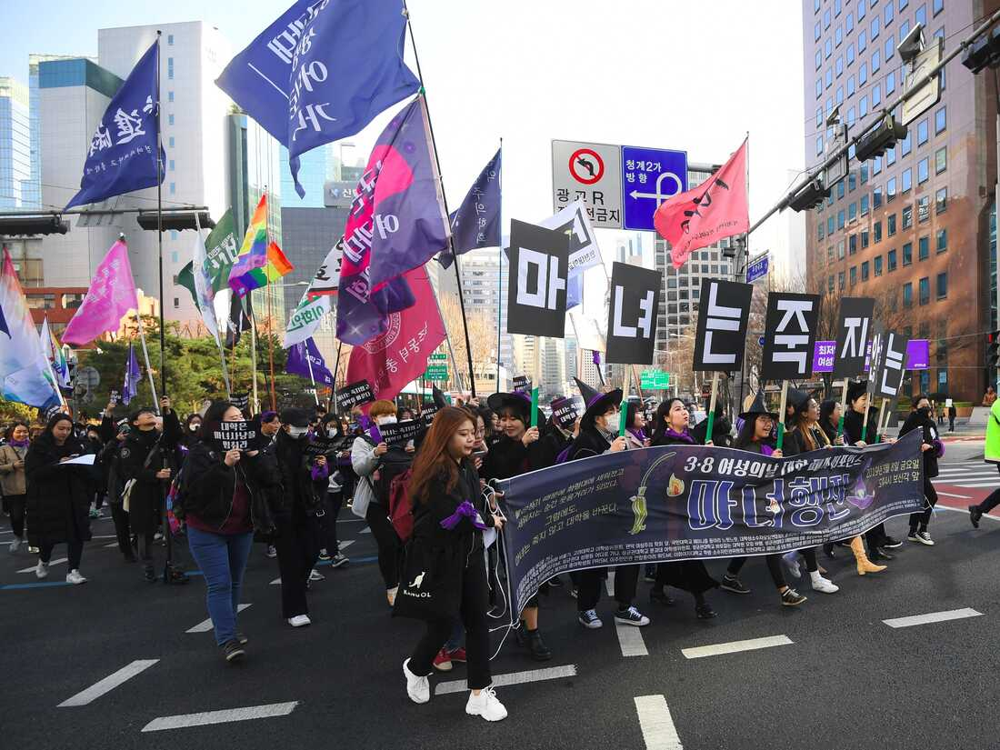
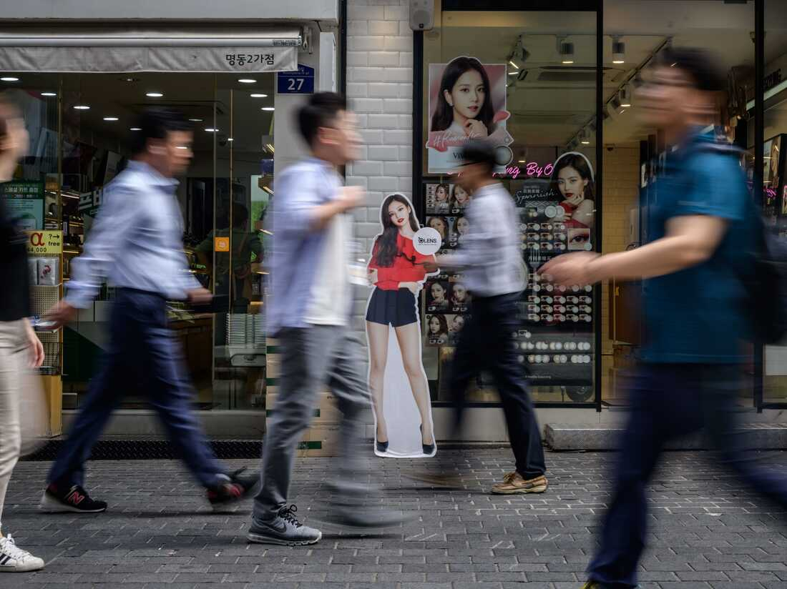
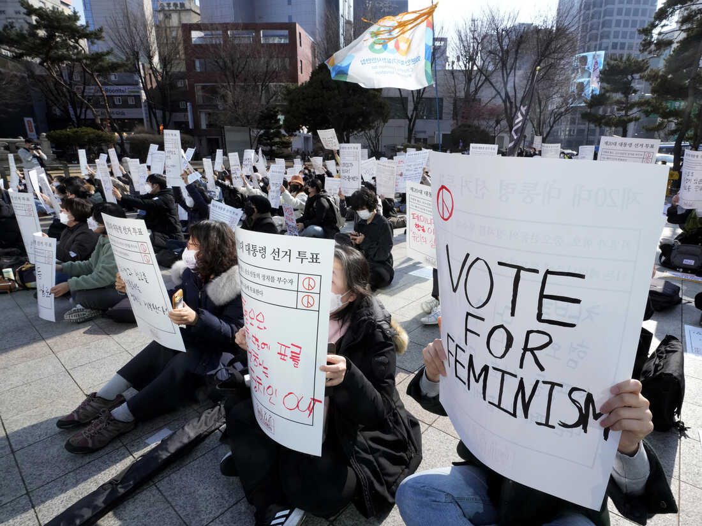

  

South Korean women take part in a march supporting feminism during a protest to mark International Women's Day in Seoul on March 8, 2019. Anti-feminism has been on the rise, turbocharged this year by President Yoon Suk Yeol.

2019 年 3 月 8 日，在首尔举行的纪念国际妇女节的抗议活动中，韩国妇女参加了支持女权主义的游行。反女权主义一直在抬头，总统尹锡烈今年助长了这种情绪。

Jung Yeon-Je/AFP via Getty Images

Feminists in [South Korea](https://www.npr.org/2022/11/07/1134772593/throughline-how-korean-culture-went-global) are planning to conduct nationwide protests against gender-based violence this weekend, the first to occur simultaneously in several major cities since the pandemic.

的女权主义者 [韩国](https://www.npr.org/2022/11/07/1134772593/throughline-how-korean-culture-went-global) 计划本周末在全国范围内举行反对基于性别的暴力的抗议活动，这是自大流行以来首次在几个主要城市同时举行抗议活动。

It's a response to an anti-feminist wave that has swept across South Korea, creating a tense gender war where discourse around women's rights is taboo and men claim they are now the victims of gender discrimination.

这是对席卷韩国的反女权主义浪潮的回应，引发了一场紧张的性别战争，围绕女性权利的讨论是禁忌，男性声称他们现在是性别歧视的受害者。

The pandemic had put a stop to most public gatherings, but with the loosening of restrictions this year, feminists are returning to the streets in larger numbers.

大流行已经停止了大多数公众集会，但随着今年限制的放松，更多的女权主义者重返街头。

In October, [thousands of people](https://www.hani.co.kr/arti/society/women/1062798.html) from across the country flocked to Seoul to protest President Yoon Suk Yeol's plans to [abolish](https://www.theguardian.com/world/2022/oct/07/outcry-as-south-korean-president-tries-to-scrap-gender-equality-ministry-to-protect-women) the Ministry of Gender Equality and Family. Civic, labor and social groups, including [Korean Women's Associations United](http://women21.or.kr/kwau/6858?ckattempt=1), joined forces to call on the government to advance women's rights.

10 月， [来自全国各地的数千人](https://www.hani.co.kr/arti/society/women/1062798.html) 涌入首尔，抗议尹锡烈总统 [废除](https://www.theguardian.com/world/2022/oct/07/outcry-as-south-korean-president-tries-to-scrap-gender-equality-ministry-to-protect-women) 性别平等和家庭部的计划。 在内的公民、劳工和社会团体 [包括韩国妇女联合会](http://women21.or.kr/kwau/6858?ckattempt=1) 联手呼吁政府促进妇女权利。

The feminist organization Haeil (Korean for "tsunami") is leading the [protests](https://twitter.com/Teamhaeil/status/1590671182428508161?s=20&t=U4d3ceIUgQSz-PYLMla7WA) in the cities of Seoul, Gwangju and Busan on Sunday.

周日，女权组织 Haeil（韩语为“海啸”）领导了 [的抗议活动。](https://twitter.com/Teamhaeil/status/1590671182428508161?s=20&t=U4d3ceIUgQSz-PYLMla7WA) 首尔、光州和釜山等城市

### An administration fueling anti-feminist sentiment

### 助长反女权主义情绪的政府

South Korea's feminist movement made strides in the last five years, creating one of the most successful [#MeToo movements](https://www.npr.org/2022/03/25/1088879026/south-korea-could-face-a-long-hard-winter-for-womens-rights-under-president-elec) in Asia. The movement took down major public figures accused of sexual misconduct, including the [mayor of Busan](https://www.nytimes.com/2020/04/23/world/asia/south-korea-busan-mayor-resigns-metoo.html#:~:text=%E2%80%8BOh%20Keo%2Ddon%2C%20the,%2Dminute%20meeting%2C%E2%80%9D%20Mr.), South Korea's second-largest city.

韩国的女权运动在过去五年取得了长足进步，创造了亚洲最成功的 [#MeToo 运动](https://www.npr.org/2022/03/25/1088879026/south-korea-could-face-a-long-hard-winter-for-womens-rights-under-president-elec) 之一。 该运动罢免了被指控性行为不端的主要公众人物，包括 [釜山市的市长。](https://www.nytimes.com/2020/04/23/world/asia/south-korea-busan-mayor-resigns-metoo.html#:~:text=%E2%80%8BOh%20Keo%2Ddon%2C%20the,%2Dminute%20meeting%2C%E2%80%9D%20Mr.) 韩国第二大城市

But now some men think things have gone too far.

但现在有些人认为事情太过分了。

Yoon won the presidency earlier this year on a [platform](https://www.npr.org/2022/03/08/1085111819/as-south-koreans-go-to-the-polls-a-backlash-against-feminism-has-become-politica) accusing feminists of misandry and appealing to young men who feel like they must bear the brunt of Korea's growing economic insecurity and shrinking job market. Policies meant to increase economic opportunity for women and close the gender pay gap have fueled young men's resentment toward women.

今年早些时候，尹在一个平台上赢得了总统职位，该 [平台](https://www.npr.org/2022/03/08/1085111819/as-south-koreans-go-to-the-polls-a-backlash-against-feminism-has-become-politica) 指责女权主义者的错误行为，并呼吁那些认为自己必须首当其冲地承受韩国日益严重的经济不安全和就业市场萎缩的年轻人。 旨在增加女性经济机会和缩小性别薪酬差距的政策加剧了年轻男性对女性的不满。

Anti-feminists have taken to social media and online communities to spread their belief that Korean feminists are radical man-haters. One YouTube channel with more than 500,000 subscribers uploads videos that target feminists as "mentally ill" radicals who promote female chauvinism.

反女权主义者已经在社交媒体和在线社区传播他们的信念，即韩国女权主义者是激进的仇恨者。 一个拥有超过 500,000 名订阅者的 YouTube 频道上传的视频将 女权主义者视为宣扬女性沙文主义的“精神病”激进分子。

Yoon has continued to push his anti-feminist agenda in recent months, insisting he will follow through with his campaign plans to [abolish](https://urldefense.com/v3/__https:/www.theguardian.com/world/2022/oct/07/outcry-as-south-korean-president-tries-to-scrap-gender-equality-ministry-to-protect-women__;!!Iwwt!VK4e5bsexSgBdyz6yl0mdBJO8a5HslQ8CouAoBjwD9Xrj9AhLSto0es5fULNLByah-JM2a9qSmT21Tydxw$) the Ministry of Gender Equality and Family. The ministry was [established](https://thediplomat.com/2022/08/does-the-south-korean-ministry-of-gender-equality-need-to-be-abolished/) in 2001 to provide resources for girls suffering from sexual and domestic violence and to ensure polices do not discriminate based on gender.

尹最近几个月继续推进他的反女权议程，坚称他将贯彻他的竞选计划， [废除](https://urldefense.com/v3/__https:/www.theguardian.com/world/2022/oct/07/outcry-as-south-korean-president-tries-to-scrap-gender-equality-ministry-to-protect-women__;!!Iwwt!VK4e5bsexSgBdyz6yl0mdBJO8a5HslQ8CouAoBjwD9Xrj9AhLSto0es5fULNLByah-JM2a9qSmT21Tydxw$) 性别平等和家庭部。 该部 [成立](https://thediplomat.com/2022/08/does-the-south-korean-ministry-of-gender-equality-need-to-be-abolished/) 于 2001 年，旨在为遭受性暴力和家庭暴力的女孩提供资源，并确保政策不存在性别歧视。

Yoon [blamed](https://urldefense.com/v3/__https:/time.com/6156537/south-korea-president-yoon-suk-yeol-sexism/__;!!Iwwt!VK4e5bsexSgBdyz6yl0mdBJO8a5HslQ8CouAoBjwD9Xrj9AhLSto0es5fULNLByah-JM2a9qSmR4Ia3d7A$) the ministry's officials for treating men like "potential sex criminals" and escalating gender inequality.

Yoon [指责](https://urldefense.com/v3/__https:/time.com/6156537/south-korea-president-yoon-suk-yeol-sexism/__;!!Iwwt!VK4e5bsexSgBdyz6yl0mdBJO8a5HslQ8CouAoBjwD9Xrj9AhLSto0es5fULNLByah-JM2a9qSmR4Ia3d7A$) 该部门的官员将男性视为“潜在的性犯罪者”，并加剧了性别不平等。

"Abolishing the gender ministry is about strengthening the protection of women, families, children and the socially weak," [he told reporters](https://en.yna.co.kr/view/AEN20221007003400315) in October.

“废除性别事务部是为了加强对妇女、家庭、儿童和社会弱势群体的保护，” [他在 10 月份对记者说](https://en.yna.co.kr/view/AEN20221007003400315) 。

### What it's like to be a woman in South Korea

### 在韩国当女人是什么感觉

  

Shoppers walks past cosmetic stores in the Myeongdong district of Seoul in 2019. Women in South Korea are held to a beauty standard many believe to be unfair and inappropriate.

2019 年，购物者走过首尔明洞区的化妆品店。韩国女性的美容标准被许多人认为是不公平和不合适的。

Ed Jones/AFP via Getty Images

For the [past couple decades](https://www.oecd.org/coronavirus/en/data-insights/the-gender-pay-gap-continues-to-close-but-slowly), South Korea has continued to boast the [largest gender pay gap](https://data.oecd.org/earnwage/gender-wage-gap.htm) among the countries in the Organisation for Economic Co-operation and Development (OECD). As of 2021, the gender pay gap in South Korea was 31% — more than double the OECD average of about 12%. For comparison, the wage gap is 16.9% in the United States.

在 [过去的几十年里](https://www.oecd.org/coronavirus/en/data-insights/the-gender-pay-gap-continues-to-close-but-slowly) ，韩国一直 [性别薪酬差距最大](https://data.oecd.org/earnwage/gender-wage-gap.htm) 是经济合作与发展组织 (OECD) 国家中 的国家。 截至 2021 年，韩国的性别薪酬差距为 31%——是经合组织平均水平 12% 的两倍多。 相比之下，美国的工资差距为 16.9%。

South Korean women largely must choose between career and family, with [The Economist's glass-ceiling index](https://www.economist.com/graphic-detail/glass-ceiling-index) ranking it the worst country in the OECD for working women in 2022. Strict [maternity leave](https://www.oecd.org/country/korea/thematic-focus/gender-equality-korea-has-come-a-long-way-but-there-is-more-work-to-do-8bb81613/) policies at workplaces are one of the reasons for South Korea's alarmingly low fertility rate at 0.8 children per woman — the lowest in the world, according to [The World Bank](https://data.worldbank.org/indicator/SP.DYN.TFRT.IN?most_recent_value_desc=false).

韩国女性基本上必须在事业和家庭之间做出选择， [《经济学人》的玻璃天花板指数](https://www.economist.com/graphic-detail/glass-ceiling-index) 将其列为2022 年经合组织中职业女性最差的国家。工作场所严格的 [产假](https://www.oecd.org/country/korea/thematic-focus/gender-equality-korea-has-come-a-long-way-but-there-is-more-work-to-do-8bb81613/) 政策是韩国生育率低得惊人的原因之一 的数据，每位妇女生育 0.8 个孩子，是世界上最低的 [根据世界银行](https://data.worldbank.org/indicator/SP.DYN.TFRT.IN?most_recent_value_desc=false) 。

Apart from discrimination in the workplace, women are held to a beauty standard many believe to be unfair and inappropriate. There's a stigma against women who do not wear makeup or who have short hair, said Yusu Li, a member of the feminist group Haeil.

除了工作场所的歧视外，女性还必须遵守许多人认为不公平和不合适的美容标准。 女权组织 Haeil 的成员 Yusu Li 说，不化妆或留短发的女性是一种耻辱。

Danbi Hwang, another member of Haeil, said if women do not wear makeup to work, coworkers ask, "Do you feel OK? Is something wrong?"

Haeil 的另一名成员 Danbi Hwang 说，如果女性不化妆上班，同事们会问，“你觉得还好吗？有什么不对吗？”

"They respond by directly attacking women's appearance," she said.

“他们的回应是直接攻击女性的外表，”她说。

The ["escape the corset" movement](https://www.npr.org/2019/05/06/703749983/south-korean-women-escape-the-corset-and-reject-their-countrys-beauty-ideals) took South Korea by storm in 2019, a rejection of the country's standards of beauty and social pressure to conform.

“ [摆脱紧身胸衣”运动](https://www.npr.org/2019/05/06/703749983/south-korean-women-escape-the-corset-and-reject-their-countrys-beauty-ideals) 在 2019 年席卷韩国，拒绝了该国的审美标准和社会压力。

But these societal expectations toward women still exist. In one notable case, at the Tokyo Olympics in 2021, South Korean archer An San — who won three gold medals at Tokyo — became the target of [online abuse](https://www.reuters.com/lifestyle/sports/archery-skorean-archers-short-hair-draws-anti-feminist-sentiment-home-2021-07-29/) from anti-feminists who claimed her hairstyle indicated she was a radical feminist.

但这些社会对女性的期望仍然存在。 一个值得注意的案例是，在 2021 年的东京奥运会上，在东京奥运会上获得三枚金牌的韩国射箭运动员安三成 [在网上辱骂的目标，他们声称她的发型表明她是一名激进的女权主义者。](https://www.reuters.com/lifestyle/sports/archery-skorean-archers-short-hair-draws-anti-feminist-sentiment-home-2021-07-29/) 为反女权主义者

### A witch hunt against feminists — or any woman who speaks about gender issues

### A witch hunt against feminists — or any woman who speaks about gender issues

  

People stage a rally supporting feminism in Seoul in February. Many feminist activists have to operate anonymously over fears of death threats.

2 月，人们在首尔举行集会支持女权主义。 由于害怕死亡威胁，许多女权主义活动家不得不匿名行动。

Ahn Young-joon/AP

When even one's hairstyle can become a reason for verbal abuse and accusations of man-hating, many young women in South Korea are fearful of speaking up about women's rights.

当甚至一个人的发型都可能成为辱骂和指责男人仇恨的理由时，韩国的许多年轻女性都害怕谈论女性权利。

Ellen Kwon, 25, said many young Korean men look down on women for being passionate about gender equality.

25 岁的 Ellen Kwon 说，许多年轻的韩国男性看不起女性，因为她们对性别平等充满热情。

Kwon, who has spent half her life in Korea and half in the U.S., said she would not openly talk about gender issues around her Korean friends.

权在韩国和美国度过了一半的人生，她说她不会在她的韩国朋友面前公开谈论性别问题。

"I know how guys will react," she said. "I know they're going to be like, 'This is another girl talking about gender issues again.'"

“我知道男人们会作何反应，”她说。 “我知道他们会说，‘又是一个女孩在谈论性别问题。’”

"Femi," short for feminist, has become a derogatory label for any person who speaks up about gender discrimination and women's empowerment in South Korea. Hwang, of Haeil, said asking someone if they are a "femi" in Korea is the same thing as asking if they have a mental illness.

“Femi”是女权主义者的缩写，在韩国已成为任何谈论性别歧视和女性赋权的人的贬义标签。 Haeil 的 Hwang 说，在韩国询问某人是否是“女性”与询问他们是否患有精神疾病是一回事。

"This type of rhetoric is censoring women's voices, especially when they try to support gender issues," said Jinsook Kim, a professor at Emory University who studies online misogyny and feminism. "A lot of women cannot talk about gender issues in public spaces, and they don't even talk to their close friends, because they don't know what their friends think about it."

“这种言论正在审查女性的声音，尤其是当她们试图支持性别问题时，”埃默里大学研究网络厌女症和女权主义的教授 Jinsook Kim 说。 “很多女性不能在公共场所谈论性别问题，甚至不和自己的好朋友说话，因为她们不知道朋友怎么想。”

For this reason, many feminists work online, anonymously. Many of those who work publicly receive death threats on a regular basis, leading some to leave the country.

出于这个原因，许多女权主义者在网上匿名工作。 许多公开工作的人定期收到死亡威胁，导致一些人离开该国。

With a lack of public figures openly advocating for women's rights, young Korean girls are struggling to find their role models, Kim said.

金说，由于缺乏公开倡导妇女权利的公众人物，年轻的韩国女孩正在努力寻找自己的榜样。

In the corporate world, women only hold about [21% of managerial positions](https://hrmasia.com/female-managers-still-under-represented-in-south-korea/) and only [5% of executive positions](http://www.koreaherald.com/view.php?ud=20210817000899) in South Korean companies. Politics reflects a similar makeup. In the legislature, only [19% of seats](https://data.worldbank.org/indicator/SG.GEN.PARL.ZS?locations=KR) are held by women. And, according to Kim, there are very few feminist professors teaching at Korean universities.

在企业界，女性 [仅担任约21% 的管理职位](https://hrmasia.com/female-managers-still-under-represented-in-south-korea/) 和 [5% 的高管职位](http://www.koreaherald.com/view.php?ud=20210817000899) 在韩国企业中 。 政治反映了类似的构成。 在立法机构中，只有 [19% 的席位](https://data.worldbank.org/indicator/SG.GEN.PARL.ZS?locations=KR) 由女性占据。 而且，据金说，在韩国大学任教的女权主义教授很少。

"It's hard to say there is hope when you look at the overall situation," said Li, of Haeil. "But what makes me hopeful are my fellow feminists, friends, seeing women like me who have short hair with no makeup, and women's rights protests that show we are not alone."

“从整体情况来看，很难说有希望，”Haeil 的李说。 “但让我充满希望的是我的女权主义者、朋友们，看到像我这样留着短发不化妆的女性，以及表明我们并不孤单的女权抗议活动。”
