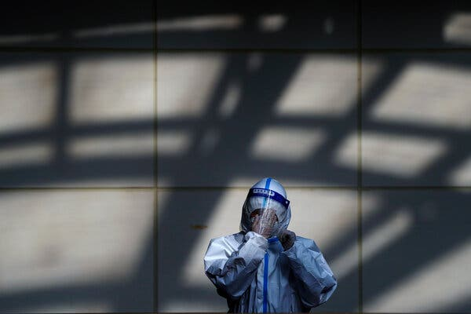

Nicholas Kristof

## 习放松。 这还不够。

Credit...Andy Wong/Associated Press

Sign up for the Opinion Today newsletter  Get expert analysis of the news and a guide to the big ideas shaping the world every weekday morning.

Xi Jinping may be the most powerful autocrat in the world, but he was forced this week to pirouette to meet the demands of ordinary Chinese fed up with his failed “zero Covid” strategy.

习近平可能是世界上最有权势的独裁者，但他本周被迫改变立场，以满足厌倦了他失败的“零 Covid”战略的普通中国人的要求。

Throngs of ordinary Chinese — “old hundred names” in Chinese parlance — took to the streets to express frustration with China’s repressive Covid lockdowns and, implicitly, with China’s overall repression. Many held up blank sheets of paper, signifying that they could not say what they wanted.

成群结队的普通中国人——用中国的话说是“老百名”——走上街头，表达对中国压制性的 Covid 封锁以及含蓄地表达对中国全面镇压的失望。 许多人举着白纸，表示他们无法说出自己想要说的话。

Xi read those blank sheets of paper, though. Police [detained](https://www.nytimes.com/2022/12/05/world/asia/china-covid-protests.html) many protesters and blocked off areas where people might gather — but the Chinese government still was forced to bow to public opinion. It brightly declared a “new situation” and on Wednesday relaxed its Covid policy.

不过，习读了那些白纸。 警方 [拘留](https://www.nytimes.com/2022/12/05/world/asia/china-covid-protests.html) 了许多抗议者并封锁了人们可能聚集的地方——但中国政府仍然被迫向舆论低头。 它明确宣布了一个“新形势”，并在周三放宽了其 Covid 政策。

Without much acknowledging the protests and while pretending that this was all its own idea, the Chinese leadership declared an end to many of the most burdensome elements of its Covid policy, which has kept down the virus, as well as the Chinese people.

中国领导层没有过多承认抗议活动，同时假装这完全是自己的主意，宣布结束其 Covid 政策中许多最繁重的部分，该政策抑制了病毒和中国人民。

Lockdowns will become shorter and more targeted, and people who test positive for the coronavirus with mild symptoms can stay at home instead of being taken away to quarantine. Negative tests will no longer be routinely required in most public spaces. Cold medicines, whose sales had been curtailed so people couldn’t hide their Covid symptoms, will be available again.

封锁将变得更短、更有针对性，冠状病毒检测呈阳性但症状较轻的人可以呆在家里，而不是被带走隔离。 大多数公共场所将不再常规要求进行阴性检测。 感冒药的销售量已经减少，因此人们无法隐藏他们的 Covid 症状，但它们将再次上市。

The government’s response, though, does not, of course, address the larger yearning for an end to autocracy.

不过，政府的回应当然没有解决人们对结束独裁统治的更大渴望。

The dictatorship remains, and those detained as a result of the street protests are presumably still in jail. But Wednesday’s announcement is a remarkable turnabout.

独裁统治依然存在，那些因街头抗议而被拘留的人大概还在监狱里。 但周三的公告是一个了不起的转变。

Historically, popular protests in modern China have not resulted in more freedom but in less. In 1956, Mao decided to “let 100 flowers bloom” — but then was horrified when some of this intellectual blooming was critical of his rule. The upshot was a crackdown that sent some of my Chinese friends to labor camps for two decades.

从历史上看，现代中国的民众抗议并没有带来更多的自由，反而导致了更少的自由。 1956 年，毛泽东决定“让 100 朵花绽放”——但当其中一些知识分子的绽放批评他的统治时，他感到震惊。 结果是一场镇压，将我的一些中国朋友送进劳改营长达二十年。

In April 1976, [a popular protest](https://academic.mu.edu/meissnerd/tiananmen-76.htm) against the hard-liners led them to sack one of the reformers, Deng Xiaoping. In 1978 and ’79, calls on the “Democracy Wall” for greater freedom led to the imprisonment of activists like [Wei Jingsheng](https://www.nytimes.com/1996/02/18/weekinreview/word-for-word-wei-jingsheng-letters-to-deng-from-the-pit-of-repression.html). In 1986, student protests for greater liberalization led to the firing of the Communist Party leader who favored liberalization, Hu Yaobang.

1976 年 4 月， [的民众抗议](https://academic.mu.edu/meissnerd/tiananmen-76.htm) 一场针对强硬派 导致他们解雇了改革者之一邓小平。 在 1978 年和 79 年，呼吁“民主墙”以获得更大自由的呼声导致像 [魏京生](https://www.nytimes.com/1996/02/18/weekinreview/word-for-word-wei-jingsheng-letters-to-deng-from-the-pit-of-repression.html) 这样的活动人士入狱。 1986 年，要求进一步自由化的学生抗议导致赞成自由化的共产党领导人胡耀邦被免职。

Then the 1989 Tiananmen democracy movement was a profound cry for greater freedom — and the result was a massacre, long prison sentences and the rise of hard-liners who have made the nation less free.

然后，1989 年的天安门民主运动是对更大自由的深刻呼声——结果是大屠杀、长期监禁和强硬派的崛起，他们让国家变得不那么自由。

So it feels like a historic milestone that Xi was forced to bow to protests, but the easing may be costly.

因此，习近平被迫向抗议低头似乎是一个历史性的里程碑，但放松政策可能代价高昂。

Xi managed the pandemic adeptly for a time, reducing Covid mortality to levels that almost any country would envy. Yet as vaccines became available, Xi didn’t adapt well. He didn’t import more effective mRNA vaccines from the West and didn’t sufficiently promote vaccinations and boosters for the vulnerable and elderly. He kept up the lockdown policy long after it was sustainable, partly because of the classic dictator’s difficulty in assessing the opinions of people when you imprison them for speaking up.

习近平在一段时间内巧妙地控制了这一流行病，将 Covid 死亡率降低到几乎任何国家都会羡慕的水平。 然而，随着疫苗的问世，习并没有很好地适应。 他没有从西方进口更有效的 mRNA 疫苗，也没有充分促进弱势群体和老年人的疫苗接种和加强剂。 在封锁政策可持续很久之后，他一直保持着封锁政策，部分原因是典型的独裁者很难评估人们的意见，因为他们因发表意见而被监禁。

The upshot is that any rapid relaxation of Covid rules today, without first raising vaccination rates among the elderly, may lead to hundreds of thousands of Chinese dying from Covid. That is on Xi.

结果是，如果不首先提高老年人的疫苗接种率，今天任何快速放宽新冠病毒规定，都可能导致数十万中国人死于新冠病毒。 那是在习上。

One of China’s great paradoxes is that in many areas, it is an administrative marvel adept at self-correction. It has overseen infrastructure development and education improvements that are extraordinary: The life expectancy of a child born in Beijing today is higher than that of a child born in Washington, D.C. Yet Chinese leaders have often struggled to self-correct in the ideological realm.

中国的一大悖论是，在许多领域，它是一个善于自我纠错的行政奇迹。 它监督了非凡的基础设施发展和教育改善：今天在北京出生的孩子的预期寿命高于在华盛顿特区出生的孩子的预期寿命然而，中国领导人常常在意识形态领域难以自我纠正。

The result: China’s authoritarian rulers have overseen the rise of an urban, well-educated middle class that aspires to greater participation, yet “People’s China” refuses to let people do so.

结果：中国的专制统治者见证了城市中受过良好教育并渴望更多参与的中产阶级的崛起，但“人民中国”拒绝让人们这样做。

In the reform era, China arguably bought off many of its citizens by raising incomes. The implicit deal was that the government would let people improve their lives but not fully determine their lives. Xi broke that deal with his Covid policy, which made lives worse.

在改革时代，中国可以说通过提高收入收买了许多公民。 隐含的交易是政府会让人们改善他们的生活，但不会完全决定他们的生活。 习近平打破了他的 Covid 政策，这让生活变得更糟。

Many years ago, when I was a Beijing correspondent for this newspaper, covering the Tiananmen protests, a young man put the nation’s aspiration this way: “We have rice, but we want rights.”

许多年前，当我还是本报的北京记者，报道天安门抗议活动时，一位年轻人这样表达了这个国家的愿望：“我们有米，但我们想要权利。”

In the latest protests, slogans were [similar](https://messaging-custom-newsletters.nytimes.com/template/oakv2?campaign_id=9&emc=edit_nn_20221207&instance_id=79527&nl=the-morning&productCode=NN&regi_id=102406454&segment_id=115256&te=1&uri=nyt%3A%2F%2Fnewsletter%2Fe914a228-be68-52d2-8500-ea2883e2e2ce&user_id=6d02a3ca7c2340ff9f05734d54221679): “We want freedom, not lockdowns. We want votes, not a ruler. We want dignity, not lies. We are citizens, not slaves.”

在最近的抗议活动中，口号很 [相似](https://messaging-custom-newsletters.nytimes.com/template/oakv2?campaign_id=9&emc=edit_nn_20221207&instance_id=79527&nl=the-morning&productCode=NN&regi_id=102406454&segment_id=115256&te=1&uri=nyt%3A%2F%2Fnewsletter%2Fe914a228-be68-52d2-8500-ea2883e2e2ce&user_id=6d02a3ca7c2340ff9f05734d54221679) ：“我们想要自由，而不是封锁。 我们要选票，而不是统治者。 我们要的是尊严，而不是谎言。 我们是公民，不是奴隶。”

Those brave protesters have changed China’s national policy, and their broader yearning for rights can no more be extinguished than a virus; someday the Chinese Communist leadership will have to respond to that very human aspiration. Xi may remain in charge, but a legacy of this year’s protests may be the reminder that this yearning still flickers, just beneath the surface, in the most populous nation on earth.

那些勇敢的抗议者改变了中国的国策，他们更广泛的权利诉求就像病毒一样无法扑灭； 总有一天，中国共产党领导层将不得不对这一非常人性化的愿望做出回应。 习近平可能仍然掌权，但今年抗议活动的遗留问题可能提醒人们，在这个地球上人口最多的国家，这种渴望仍在表面之下闪烁。

Nicholas Kristof joined The New York Times in 1984 and has been a columnist since 2001. He has won two Pulitzer Prizes, for his coverage of China and of the genocide in Darfur. You can follow him on [Instagram](https://www.instagram.com/nickkristof/) and [Facebook](https://www.facebook.com/kristof). [His latest book](https://www.penguinrandomhouse.com/books/588999/tightrope-by-nicholas-d-kristof-and-sheryl-wudunn/) is “Tightrope: Americans Reaching for Hope.”  [@NickKristof](https://twitter.com/NickKristof) • [Facebook](https://www.facebook.com/kristof)

A version of this article appears in print on Dec. 8, 2022, Section A, Page 27 of the New York edition with the headline: Xi Loosens Things Up, but It Won’t Be Enough. [Order Reprints](https://www.parsintl.com/publication/the-new-york-times/) | [Today’s Paper](https://www.nytimes.com/section/todayspaper) | [Subscribe](https://www.nytimes.com/subscriptions/Multiproduct/lp8HYKU.html?campaignId=48JQY)
