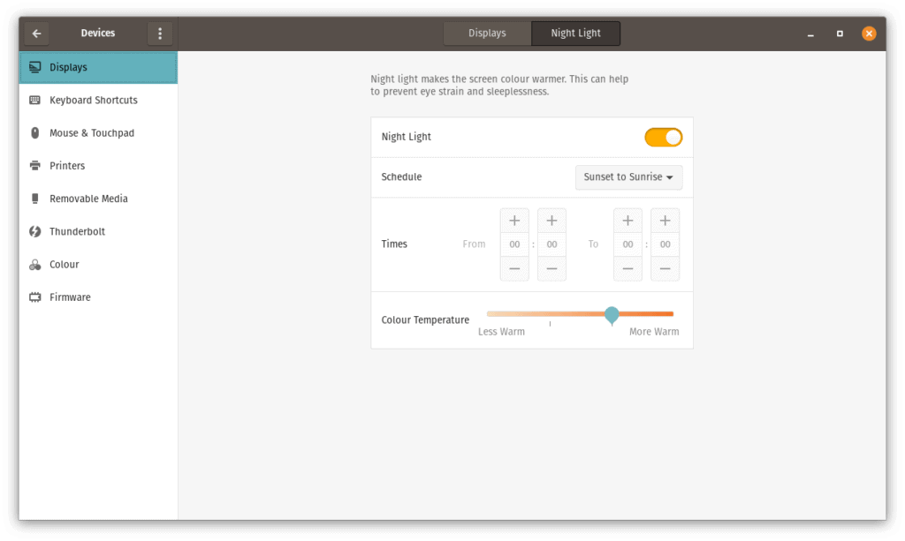
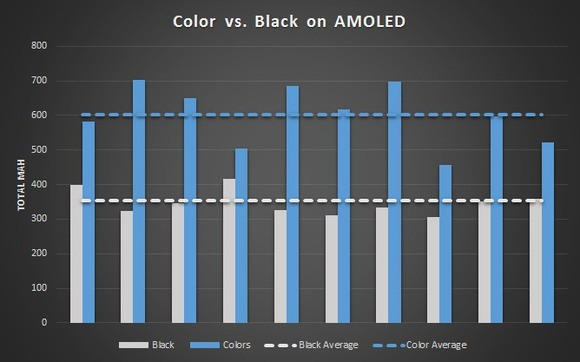

#### I’ve decided to stop using dark mode across all of my devices, because research suggests that going to the dark side ain’t all that.

我已经决定停止在我所有的设备上使用黑暗模式，因为研究表明，进入黑暗面并不是全部。

The darkness is _everywhere_. In fact, this very site that you’re on right now [automagically flips to dark mode](https://kevquirk.com/automatic-dark-mode/) if you’re that way inclined. There’s lots of hyperbole flying around about why the darkness is better than basking in the warm glow of _light mode_.

黑暗无处不在。事实上，如果你有这种倾向，你现在所在的这个网站会自动切换到黑暗模式。关于为什么黑暗比沐浴在温暖的光芒中更好，有很多夸张的说法。

> You know what, I really love using dark mode because it’s easier to read, doesn’t strain my eyes and saves my battery.
> 
> 你知道吗，我真的很喜欢使用黑暗模式，因为它更容易阅读，不会让我的眼睛疲劳，还可以节省我的电池。
> 
> Techbros everywhere  
> 科技公司无处不在  

I _was_ one of these techbros. I’ve used those very excuses in the past to justify my use of the darkness. But after doing some research on dark vs light, I’ve made the decision to stop using dark mode everywhere. Here’s why…

我就是这些技术人员中的一员。我过去曾用这些借口来证明我使用黑暗是正当的。但在做了一些关于暗与光的研究后，我决定停止在任何地方使用暗模式。这就是为什么…

## It’s Easier To Read  
它更容易阅读  

A nice dark screen with light text is easier to read, right? Well, according to multiple studies, that’s wrong apparently. The Nielson Norman Group, sum this up well in [their post about dark mode](https://www.nngroup.com/articles/dark-mode/), saying:

一个漂亮的深色屏幕上有明亮的文字，更容易阅读，对吗？嗯，根据多项研究，这显然是错误的。尼尔森·诺曼集团在他们关于暗模式的帖子中很好地总结了这一点，他们说：

> Results showed that light mode won across all dimensions: irrespective of age \[of the individual\], the positive contrast polarity \[light mode\] was better for both visual-acuity tasks and for proofreading tasks.
> 
> 结果表明，光模式在所有维度上都占上风：无论年龄\[个人\]，正对比极性\[光模式\]对视力任务和校对任务都更好。

Humans have evolved to hunt during the day. On a biological level, our eyes prefer the contrast between a light background and dark foreground.

人类已经进化到在白天捕猎。在生物学层面上，我们的眼睛更喜欢浅色背景和暗色前景之间的对比。

When I was in the military, a key tactic of camouflage was to never, under any circumstances, expose yourself on a hilltop or similar, where your silhouette could be easily identified. A dark blob on a light background is far easier for the human eye to see, than the reverse.

当我在军队时，伪装的一个关键战术是，在任何情况下，永远不要把自己暴露在山顶或类似的地方，那里你的轮廓很容易被识别出来。浅色背景上的深色斑点比反之更容易被肉眼看到。

## Eye Strain 眼疲劳

Many people quote light mode as being a contributory factor to eye strain. Based on the reading I’ve done, this doesn’t appear to be true. The NN Group also cover eye strain in their post:

许多人认为光线模式是导致眼睛疲劳的一个因素。根据我所做的阅读，这似乎不是真的。NN小组还在他们的帖子中提到了眼睛疲劳：

> The human pupil is the gateway to the retina: through it, light reaches the eye. By default, the human pupil changes size depending on the amount of light in the environment: when there is a lot of light, it contracts and becomes narrower, and when it’s dark, it dilates to allow more light to get in. Smaller pupil sizes make the eyes less susceptible to [**spherical aberrations**](https://en.wikipedia.org/wiki/Spherical_aberration) (in which the image appears unfocused) and increase the depth of field, so people don’t have to work so hard to focus on the text, which, in turn, means that their eyes are less likely to get tired.
> 
> 人类的瞳孔是通往视网膜的门户：通过它，光线到达眼睛。默认情况下，人类的瞳孔会根据环境中的光量改变大小：当光线很强时，它会收缩，变得更窄，当它变暗时，它会扩张，让更多的光线进入。较小的瞳孔尺寸使眼睛不太容易出现球面像差(图像看起来不对焦)，并增加景深，因此人们不必如此努力地专注于文本，这反过来意味着他们的眼睛不太可能感到疲倦。

Many people perceive light mode as the cause of eye strain. But blue light, among other things, is actually the cause of it most of the time. This is covered in more detail [by Vice](https://www.vice.com/en_us/article/ywyqxw/apple-dark-mode-eye-strain-battery-life), where they say:

许多人认为光线模式是导致眼睛疲劳的原因。但在大多数情况下，蓝光实际上是造成这种情况的原因。这一点在《副业》杂志上有更详细的报道，他们说：

> A [2018 study](https://www.ncbi.nlm.nih.gov/pmc/articles/PMC6020759/) published in _BMJ Open Ophthalmology_ notes that blue light could be a factor in eye tiredness, but cites dry eyes from not blinking for long periods as a more serious cause of eye strain, as well as too-small fonts, and conditions like uncorrected [astigmatism](https://en.wikipedia.org/wiki/Astigmatism).
> 
> 2018年发表在《英国医学杂志·开放眼科杂志》上的一项研究指出，蓝光可能是导致眼睛疲劳的一个因素，但他指出，长时间不眨眼导致的干眼是导致眼睛疲劳的更严重的原因，还有字体太小，以及未经矫正的散光等情况。

That’s part of the reason why I use nice large fonts on this website. I hate it when a website loads with a 12px serif font that just looks like a blur, even when I have my glasses on.

这就是我在这个网站上使用漂亮大号字体的部分原因。我讨厌网站加载一个12px的衬线字体，看起来就像一个模糊的字体，即使我戴着眼镜。

A better remedy for eye strain would be to enable _night light_ on your operating system, which will reduce the your screen’s blue light output. Also, take regular breaks and make sure you’re blinking often enough!

治疗眼睛疲劳的一个更好的方法是在你的操作系统上启用夜光，这将减少你屏幕上的蓝光输出。此外，要有规律地休息，并确保你的眨眼频率足够高！

If headaches and eye strain persist, go see an optician. I had the same problem about a year ago; it turns out I am long-sighted and require glasses. Since then, my headaches and eye strain have pretty much stopped.

如果头痛和眼睛疲劳持续存在，就去看眼镜店。大约一年前我也有过同样的问题，结果发现我是远视眼，需要戴眼镜。从那时起，我的头痛和眼睛疲劳基本上就停止了。

## Dark Mode Saves Battery  
暗模式可节省电池  

Unless you’re using an OLED or AMOLED screen and your dark mode is truly black – not dark grey, not dark blue, **BLACK**. There is no difference in power consumption.

除非你使用的是OLED或AMOLED屏幕，而且你的暗模式是真正的黑色--不是深灰色，也不是深蓝色，而是黑色。在耗电量方面没有差别。

How many dark sites or applications actually use true black for their dark background? Not many. Most use either a dark grey, or dark blue. This site included.

有多少黑色网站或应用程序真正使用真正的黑色作为其黑色背景？不是很多。大多数人要么使用深灰色，要么使用深蓝色。这个网站包括在内。

[MakeTechEasier](https://www.maketecheasier.com/are-dark-themes-better-for-eyes-battery/) elaborate on the whole OLED/AMOLED vs standard LCD argument. When an OLED/AMOLED pixel is black, it’s turned off, so no power is used. Yet power is still required for LCD to display black pixels.

MakeTechEasier详细阐述了OLED/AMOLED与标准LCD的整个论点。当OLED/AMOLED像素为黑色时，它将关闭，因此不会耗电。然而，LCD显示黑色像素仍然需要电力。

[Android Authority](https://www.androidauthority.com/black-amoled-display-power-saving-541984/) carried out tests using dark mode on a device with an AMOLED screen. The results showed a reduction in battery consumption by around 41%.

Android Authority在一款带有AMOLED屏幕的设备上使用黑暗模式进行了测试。结果显示，电池消耗减少了约41%。

Credit: Android Authority  
点评：安卓权威  

So although this argument holds some water, the majority of phones on the market are LCD. Around 30% of devices had AMOLED/OLED screens in 2019, and they are not projected to hit a majority market share until 2023 ([source](https://www.electronicsweekly.com/news/business/715229-2019-11/)).

因此，尽管这种说法有些站得住脚，但市场上的大多数手机都是LCD手机。2019年，约有30%的设备拥有AMOLED/OLED屏幕，预计它们在2023年之前不会达到大部分市场份额(来源)。

Conserving my device’s battery is the least of my concerns though. My health is far more important. Besides, I spend the vast majority of my time on my laptop or desktop, both of which have LCD screens. AMOLED/OLED is still rare in the laptop/desktop space.

不过，节省设备电池并不是我最不关心的问题。我的健康要重要得多。此外，我的大部分时间都花在笔记本电脑或台式机上，这两种电脑都有LCD屏幕。AMOLED/OLED在笔记本电脑/台式机领域仍然很少见。

## Conclusion 结论

According to the reading I’ve done, dark mode isn’t easier to read and it doesn’t prevent eye strain. However, in very specific circumstances it can improve battery life.

根据我所做的阅读，黑暗模式并不容易阅读，它也不能防止眼睛疲劳。然而，在非常特殊的情况下，它可以延长电池寿命。

I’m sure there are people out there who genuinely need dark mode for a specific health condition. For that reason, there will continue to be a dark mode on this site.

我相信有些人真的需要黑暗模式来满足特定的健康状况。出于这个原因，这个网站将继续处于黑暗模式。

But if you’re like me, and just prefer dark mode, you _may_ be making things more difficult for yourself and actually damaging your eyes in the long run.

但如果你像我一样，只是喜欢黑暗模式，你可能会让自己的事情变得更加困难，从长远来看，实际上会损害你的眼睛。

__This post is day 04 of my `#100DaysToOffload` challenge. If you want to get involved, you can get more info from [https://100daystooffload.com](https://100daystooffload.com/)_._

这篇帖子是我#100天要卸载挑战的第04天。如果你想参与进来，你可以从https://100daystooffload.com`#100DaysToOffload`获取更多信息。这篇帖子是我#100DaysToOffload挑战的第04天。如果你想参与进来，你可以从我的#100天卸载挑战的第04天的https://100daystooffload.com https://100daystooffload.comThis帖子中获得更多信息。如果您想参与进来，可以从https://100daystooffload.com.获取更多信息
