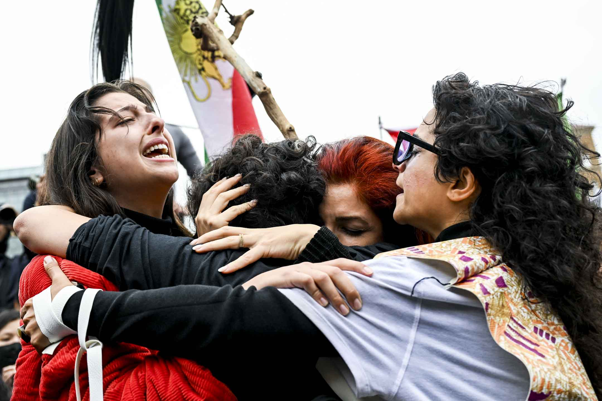
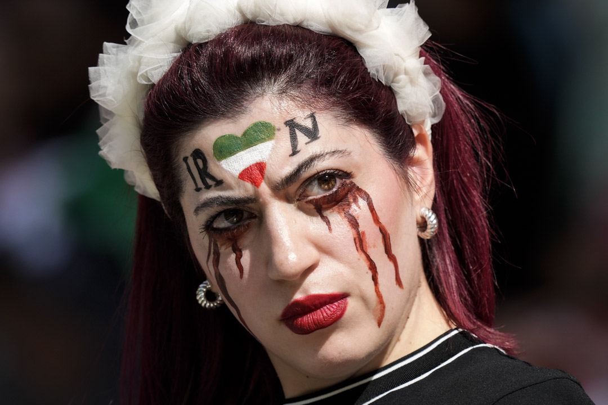
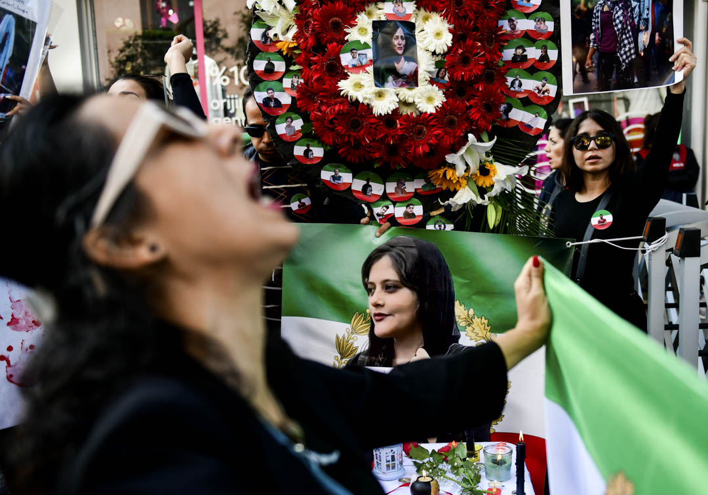
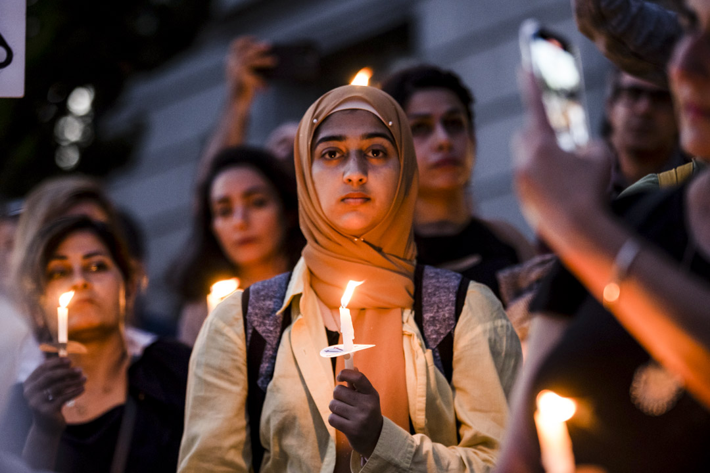

「这些人发出了声音，然后呢？」

越真

2022年10月1日，纽约曼哈顿有示威声援伊朗女士Mahsa Amini死于警察拘留所，一群示威者在现场拥抱并哭泣。摄：Alexi Rosenfeld/Getty Images

\[“女人没有国家？”\]\[1\]是端传媒新开设的专栏，名字源于伍尔芙的一句话“As a woman I have no country”，但我们保留了一个问号，希望能从问号出发，与你探讨女性和国家的关系，聆听离散中的女性故事和女性经验。我是这个栏目的编辑符雨欣。这是“女人没有国家？”的第二篇，讨论伊朗正在发生的抗议是否仅仅是一场女权运动，以及在这语境下讨论性别问题是否可以超越民族国家的框架。

**（越真，哲学博士候选人，研究领域包括身份哲学）**

伊朗抵制极权统治的性别运动已经持续了两个多月，并引起了世界范围内的关注。伊朗的女性运动是这个时代的产物——如果没有世界范围内的女性赋权和女性主义发展，以性别运动这种形式撼动极权，是过往无法想象的。伊朗女性的无畏感染了全世界珍视平等和自由的人，她们用自己的方式为民主运动增添了独有的女性色彩，更展现了女性在政治参与时所表现出的创新性、勇敢和强大。一些人开始期待：**是否伊朗的女性主义运动可以作为一个先例，使女性运动最终超越民族国家的叙事，并且成为人类自由抗争的新开端？**

诚然，这次运动很大程度上为世界范围内的女性运动或受压迫者赋权，一种更广泛的连结和身份认同概念也正在建立，但我认为，**这场运动对于超越以国家为单位的国际关系秩序而言，仍有一定的距离。**且最主要的问题不在于是否能超越这种叙事——因为超越本身不是难事，更困难的是超越原有的体系之后，我们应当如何建立一个新局面。

这篇文章将从伊朗的女性主义革命、以民族国家为单位的国际政治体系和女权主义者的政治参与这三个方面来探讨这个问题。

Mahsa Amini 示威是否只是一场女性运动？

厌女的极权社会是无法绕过极权只谈性别的，对性别秩序的撼动必须通过对独裁体制的撼动来实现，达不到这一点，就无从谈更加深远和长久的性别抗争。

我们在分析这场运动的时候，要注重伊朗本身的政治语境。伊朗的极权统治由来以久，且在Mahsa Amini 示威之前，不是没有人进行过反抗。例如在2009年，因反对马哈茂德·艾哈迈迪内贾德的连任和政治腐败，伊朗曾爆发绿色革命；2017、2019年伊朗也都曾爆发示威游行，抗议经济下行和专制统治。这些运动都受到了当局的严厉镇压。

由于极度的厌女，这些年伊朗政府对女性的骚扰和控制更是不计其数。相较于其他群体，女性承受着来自政治、宗教和性别暴力等多方面的压榨：例如女性无法享有穿衣自由，仅仅因为不规范佩戴头巾就会被处罚；女性骑自行车被认为是有伤风化等。但这些在我们看来荒谬可笑的要求，恰好就是伊朗女性每天都要面对的现状。与一些极权政府一样，伊朗政府通过剥夺和渗透普通人日常生活的方式来羞辱人民的尊严。这些偏执的獨裁者們認為，只有将权力渗透进人们的日常生活，才能建立起一个政权的绝对统治；只有一个人生活的方方面面都被控制，才能显示出人民对獨裁者的服从；而只有这种服从到位，才能满足独裁者膨胀但又充满恐惧的自我。

但在伊朗社会中其实一直存在女性主义的觉醒和发展。多年以来女权主义者们一直在尝试从个人行动、教育普及等方面来改善女性的生存境遇，虽然这些行动并没有能让当局放松对女性的管控和限制，但它们还是成功地在伊朗社会埋下了自由的火种。如果不是女性主义的启蒙和女权主义者们的不断抗争，伊朗女性群体很难从宗教文化语境和性别秩序中觉醒出来，而即便是爆发大规模的女性运动，她们也很难获得广泛的支持。

**但是这场运动不仅被定义为一场女性革命。**虽然女权主义者们旨在挑战性别结构和根本的父权统治，但是由于伊朗的极权统治这一政治现实，这场性别运动也最终被容纳进国家范围内的泛民主运动中的一环，承担着挑战伊朗极权统治的责任。

或许我们可以从伊朗人在国际社会上展现的态度来进一步窥探这场运动的性质。2022年卡塔尔世界杯上，伊朗球队拒绝唱国歌的画面震人心魄，而看台上高举的写着“Woman, Life, Freedom”标语的伊朗国旗也给国际社会留下了深刻的印象。但国旗与示威标语的同时出现也说明一点，即伊朗目前的示威运动仍然没有超出国家叙事。

2022年11月25日，卡塔尔世界杯，伊朗对威尔斯的赛事，一名在观众席的伊朗队支持者面上画有支持伊朗女性运动的图案。摄：Frank Augstein/AP/达志影像

女权运动并非一直与民主诉求联系在一起，一些例子表明，女权主义者们的抗争很有可能仅仅止步于获得更加平等的两性地位，却缺乏挑战原有父权政治秩序的野心。造成这一点的原因可能是复杂的。但伊朗的情形却不尽相同。权力的高度集中已经影响到了伊朗社会的方方面面，在伊朗不是只有女性失去自由，人们还面临着经济的困难，宗教和民族的挤压以及政治参与的受限。可以说，伊朗政府将伊朗塑造成了一个密不透风的社会，由于公民缺乏决定国家命运走向的空间，因而全体人民都要为极权政府的行为买单。近年来国际社会一直在给予伊朗经济制裁，这使得伊朗内部的经济下行严重；而极权政府在经济、文化、宗教等层面上的不作为也使得人民越来越难忍受日常的生活。

一些相对精明的极权统治者一直很关注权力关系中的博弈和制衡，例如利用地方和中央的关系来进一步巩固自身的统治——当下放一部分可控的自由给地方时，民众的不满也多会止步于地方政府，这使之不容易威胁到中央的集权统治。另有一些极权统治者用稳定经济的方式来维护自身的统治秩序——只要人们不干预政治，极权政府便可以兑现给人民以经济上的承诺，这时若政治宣传力度得当，民主诉求便也不容易成为主流。但是对于相对无能的独裁者来说，**一昧地权力集中则是把威胁自身统治合法性的风险同样提高到了难以招架的高度**，再辅以经济的下行、言论的进一步控制和文化的败落，看似密不透风的统治便实则变得岌岌可危。

这时无论是对女性的蹂躏、对言论的审查、对公民人身自由地控制还是经济的崩溃，都只会让民众将矛头最终指向极权统治本身。越是刚性的东西实则越容易脆裂，在部分极度依附于整体，并且与之享有高度一致性的时候， 打碎部分，便也意味着打碎了整体。因为两者之间已经没有缓冲地带，也不存在拉扯和博弈的可能。当社会的一切层面都像藤蔓般紧紧地缠依附在政权这一棵强大的树干之后，无论哪个层面的崩溃，都直接冲击着那个最庞大的权力中心。

而伊朗的这场性别运动的演变所包含的逻辑也是如此：独裁政府是女性痛苦境遇的主要造成者，如果可以彻底推翻这样的极权统治，女性的境遇似乎自然可以得到改善。因此一开始Free Women的诉求就演变成了反独裁统治的Free Iran，它不仅仅承担了女权主义的意义，更意味着直指专政的、由多民族、阶层、性别群体参与的更加广泛的民主革命，在维护每个人的生命与自由的口号之下，更多伊朗人的诉求和主体性能被容纳进来。而反过来，对自由和平等的争取永远不可能与女性主义相悖，**女性无法自由的社会永远不会是真正自由的社会**，因此有人相信Free Iran即意味着Free Women。

Griffin认为，女性并不像伍尔夫所说的那样，“作为女人我没有国家”。伍尔夫的愿景是高远的，是向往和平与自由的。但是在实操层面，仅有这样的愿景是远远不够的。

然而女性能多大程度上取得成功，或者说，将女性运动纳入国家叙事之下之后，女性群体的愿景能在何种程度上实现，是很难预料的。Griffin认为，女性并不像伍尔夫所说的那样，“作为女人我没有国家”。伍尔夫的愿景是高远的，是向往和平与自由的。但是在实操层面，仅有这样的愿景是远远不够的。Griffin说明，在上世纪广泛的民族独立运动中，女性为反抗殖民主义而在性别身份上让步，是为了使自身民族摆脱殖民主义的控制、国家独立之后，建立更加广泛的性别平等政策。但是很多现实的例子却表明，即使一些国家取得主权独立，女性的境遇也没有获得多大的改善。

因为民族、国家这些概念本身就是带有父权性质的，因而女性很有可能受到民族国家系统性的性别压榨。如上野千鹤子指出，在二战时，日本女性多承担生产或慰安的责任，这实则是对女性权益的剥夺和女性生存空间的挤压，然而这却在战时被当作是爱国主义的体现。**当国家主义或者民族主义的诉求与其他的身份认同相悖时，国家主义或民族主义往往会取得上风。它们把人套在一个宏大叙事的袋子里，并且号召所有人为更广大深远的目标做出牺牲。**因而无论是战争时期被迫承担生产和慰安工作的女性，还是拒绝为国家统一而战的和平主义者，在国家主义的叙事之下，都有可能面临艰难与复杂的身份困境。

同样的情况是否会发生在伊朗，我们暂时不得而知。但是显然，由于宗教文化的浸染，和历史上根深蒂固的厌女观念，伊朗女性想要获得更大程度的平等和自由，仍有很长的路需要走。在许多民主国家例如日本、印度、韩国等，民主的实现也并未给女性的地位带来多大的提升。不过在这类国家，女性群体便可以有更多选择。例如她们可以选择在现代国家的框架之下继续通过女权运动来争取更加平等的地位，更加广阔的权利——在一些女权主义者们眼里，关注弱势群体与具体的人并不与现代国家的概念冲突，人们依旧可以在国家范围内为更广泛的平等做出努力；也同样可以抛却民族国家叙事，以更广阔的身份，如女性身份，或者人类群体的这个身份来做更加广泛的追求。

不过，这似乎不是当前的伊朗需要考虑的方向。**厌女的极权社会是无法绕过极权只谈性别的**，对性别秩序的撼动必须通过对独裁体制的撼动来实现，达不到这一点，就无从谈更加深远和长久的性别抗争。

2022年10月31日，土耳其伊斯坦布尔有示威声援伊朗女性运动，抗议库尔德族女生玛沙·阿米尼（Mahsa Amini）在伊朗被道德警察逮捕、殴打后死亡。摄：Omer Kuscu/dia images via Getty Images

伊朗的女性运动是否可以超越国家叙事？

即便我们不将自己定义为民族主义者或国家主义者，我们的抗争也仍旧暂时无法跳出民族国家的叙事。为什么？

极权国家的政治语境与民主国家不同，极权国家更加缺乏超越国家叙事的条件。尽管疫情让我们看到了全球治理体系的崩溃，以及绝大部分政府的低效与无能，但是目前尚没有空间建立一种新的、非主权国家或无政府主义的国际秩序。在这里我们要尤其注意的一点是，当我们分析政治事件，包括国际格局的走向时，要注意到这是一个多方共同作用的过程。既然是过程，就一定在变动。因此笔者在这里得出上述的结论，也是由于此时此地的因果作用至此，如果未来相互作用的各条件发生改变，当然也会摇动结果。

**但这是否说明极权国家的人一定要作为一个民族主义者或国家主义者才能争取自由？答案当然是否定的。**从身份认同哲学的角度来看，身份认同皆是被构建起来的，没有一个人生下来就有美国人或者埃及人的认同，也没有一个人生下来就知道自己是个女权主义者。人们需要在跟世界广泛的交互中发展出自己的身份认同，而且这些身份一定具有流动性。一个人当然可以选择成为一个女性主义者或自由主义者，而不成为一个国家主义者或民族主义者。这关乎内部身份认同，而且人可以秉持这样的认同进行活动。

但是c从身份认同哲学来讲，一个人的身份认同无法脱离社会而存在，无论我们如何定义自己，我们的身份还是扎根于当前社会的语境。虽然国家的概念也是被发明出来的，但是当前的国际政治秩序是依据主权国家建立的，这是历史现实，**也是政治历史对我们的生活世界的塑造。**一个伊朗人走向世界时携带的身份首先是伊朗人，即便这个人不认同自己伊朗人的身份。她可能更愿意以一个女权主义者来定义自己，但身份认同不仅关乎于自己如何定义自己，还关乎外界如何回应她，只要她拥有伊朗护照，或长大在伊朗，她便还是会在某种程度上属于伊朗人、伊朗裔群体，那么这个国家的记忆、血泪、印象和冲突便都会涌向她。这是一个令人遗憾的局面，那就是直到现在我们还是以国籍来给人区分，一种更为根本和广泛的群体概念至今还没能形成，但除非有深远的观念或全球格局的转变，这种体系就仍然会留存。在这种秩序之下，**只有一个国家自己的人民可以决定这个国家未来的走向**，对于极权国家或受极权威胁的国家——例如乌克兰来说，这更是他们的必经之路。

或许我们可以考虑的，是在人们争来了更有自由、尊严和福祉的生活之后，弱化某国人，或者某个种族人的这种身份认同，而作为更广泛的人，为人类这个群体的福祉，以及全球环境做出更多的努力。

有人会说伊朗的这场革命并不只是关乎于伊朗的。例如它实则是在给全世界受独裁统治的人民赋权，给所有受欺压的女性群体赋权，也给所有渴望和珍视民主和自由的人赋权。的确，就像树叶撼动树叶一样，伊朗女性的勇敢感染着我们每个人的心灵，也启发、赋予我们更多的行动空间，这使得全球范围内的受压制者们有机会广泛地联合起来，形成一个新的群体概念。但这种概念将会容纳什么，在何种程度下可以超越目前的国际政治秩序，却实则很难预测。不过我们可以思考的是，当世界上所有的国家都分享一些共同的价值，例如自由、平等、人权之后，**是否可以建立一种新的国际秩序**。

例如届时**是否还需要政府**，是否仍要维持以主权国家为单位的国际政治体系，就会成为更值得思考的问题；回到每个国家来说，可以思考是否在争取完自由之后要更谨慎地使用民族主义。或许我们可以考虑的，是在人们争来了更有自由、尊严和福祉的生活之后，弱化某国人，或者某个种族人的这种身份认同，而作为更广泛的人，为人类这个群体的福祉，以及全球环境做出更多的努力。在很多情况下，民族主义只会使未来的图景趋于狭隘，因为它的发明实则是在制造割裂和分离，在这种叙事之下，必须要有一个敌人被创造出来，若缺乏这种对比，对自身范围的划定也就失去意义。而在狭隘与广阔之间，我们当然应该选择后者。但这一点的实现也并不容易，我们需要考虑如何完成这种转变，也需要在避免更大规模的战争的情况下来达到这一点。

但也许有人也会问，民族国家体系是否是坚不可摧的呢？答案是否定的。没有任何东西是一成不变的。**国家作为一种被创造出的概念**，当然也是如此。**女性群体当然可以广泛联结起来超越民族国家叙事**，实际上共产主义、世界无政府主义、新时代运动等，都一直在做类似的尝试，虽然他们的实践并没有能够在历史上成功，但却仍能在某些时刻成为鼓动人心的图景。但如何将理想有计划性地变成历史现实，是这些理想主义者们需要进一步考虑的方向。**为了避免误解，笔者也要在这里对以国家为单位的国际体系与爱国主义做出区分。笔者的分析均建立在当前的国际政治秩序以及历史现实之上，而不涉及到情感价值的选择。一个人在国家叙事之下追求自由，与选择爱国主义是两个层面的事。**更重要的问题是，民族国家体系不难超越，难的是我们超越之后要走向哪里？是否能够行之有效的理论来作为新秩序建立的指引？这些问题都需要仔细和审慎地考虑，同时也需要进行更加深刻而行之有效的哲学思考。不过，我期待有这样深远的改变可以发生，届时，也许饱受极权折磨的人们不必再阶段性地通向自由的境地，而人类之间的分裂和差异也将会更大程度地被消弭。

2022年9月23日，美国加州大学柏克莱分校，有民众手持蜡烛，悼念被道德警察拘捕后死于拘留所的伊朗女生玛沙·阿米尼（Mahsa Amini）。摄：Tayfun Coskun/Anadolu Agency via Getty Images

女性主义理论与国际政治

女权主义理论要求除却注重国家安全、公共领域之外，还要看到私人领域、权力结构的差异，她采取一种自下而上的研究方法，质疑“国家”在国际政治中的中心地位，将“人”置于国际政治舞台的中心。但这会使我们进一步思考：这些人发出了声音，然后呢？

女性主义国际关系理论已经对以男性气质主导的现实主义国际秩序提出了质疑，她们旨在质疑国家、主权、安全等概念。众所周知，女权主义理论要求除却注重国家安全、公共领域之外，还要看到私人领域、权力结构的差异，她采取一种自下而上的研究方法，质疑“国家”在国际政治中的中心地位，将“人”置于国际政治舞台的中心。这个提议是如此的深刻，并且已经深远地影响了其他的政治哲学领域，自由主义者们也提出“关怀具体的人”的口号，我想一些无政府主义者或者宗教活动家们也是这样想的。对于尚未实现人文启蒙的地方来说，这种口号无疑是更有力的。当大家把目光转移至“人”身上的时候，一种更广阔的、无差别的平等概念就开始形成，弱势群体，因性别、宗教、种族、文化、经济或国籍等问题饱受折磨的人也终于可以发出声音。

但这会使我们进一步思考：这些人发出了声音，然后呢？我们所追求的平等和自由是何种意义上的平等和自由，如何定义这些概念？使这些人获得平等和自由，是否一定要冲破现代国家的概念？如果要打破这种秩序，用何种方式，如果还是通过暴力和冲突，这是否又会与女性主义对和平的追求相悖？另外就是，这种使每个人站在阳光下被看到的愿景，是否一定要通过政治手段来实现？一些人或许认为这是不必要的，他们期待人类能完成一种深远的内在转化，最大程度自然地放下自私、分裂、竞争、好战这些人性中的常见性质，通过一种自发自治的形式使人们更好地生活在一起；届时，政府、国家、国界这些概念将会被消解，但实现这种理想并不容易。此外，我们也要明白“关怀人”指代的是什么，明白我们关怀的是人的哪些方面。当人们内部的诉求有所差别，我们是否要选择优先某些群体，这种优先权的决定有什么政治哲学基础？这些都将是我们需要思考的方向。

任何理想的实现都要稳扎于生活世界与历史现实，我们的愿景可以高远，但是理想的实现却需要很多人共同发力，需要借助观念的力量，也要结合因果、条件的互相作用，在扎根于现实语境的基础上做出行动。目前国际关系女性主义虽然已经深远地影响了全球社会政治的诸多方面，例如一些女性主义者已经在试图重新定义国家主义，这是一个非常有前景的尝试。

女性主义理论显然已经不再仅仅止步于性别，她将性少数群体、受种族和宗教文化欺压的人、穷人、残障人士等也都纳入到了叙事之中，同样为他们争取自由。

女性主义理论显然已经不再仅仅止步于性别，她将性少数群体、受种族和宗教文化欺压的人、穷人、残障人士等也都纳入到了叙事之中，同样为他们争取自由。或许女性主义学者们可以考虑的，是广泛地与其他有着相似愿景的群体合作，并尝试提出进一步的行动纲领——如果只停留在质疑主流国关理论的层面却无法在行动上建立切实可行的纲领，会让我们陷入两个困境，一是我们会因无可奈何、缺乏明确的行动目标而加深痛苦；二是当我们回归到现实时，仍然发现我们无法跳脱出历史塑造的精密而又庞大的国际政治结构。用海德格尔的话来说，我们是被扔进世界的，而生活世界的诸多体系是由历史观念塑造的，并且持续性地被这个星球上的人塑造着。但正如本文一直想强调的，这并不意味着我们应当接受这种现实。我们依旧可以怀揣更为终极的理想，只是这种理想的实现需要迈出更为扎实的脚步。女性主义者们已经在很多方面做出了深远的改革，而我相信未来我们还有更加广大的思考与行动空间。

参考书目：Michele Mchugh Griffin, “As a Woman I Have No Country,” Peace Review; Abingdon (Abingdon, United Kingdom, Abingdon: Taylor & Francis Ltd., June 19, 1998)上野千鹤子，《国家主义与社会性别》，1998

___

本文章由 [flowerss](https://github.com/indes/flowerss-bot) 抓取自RSS，版权归源站点所有。

查看原文：[伊朗女性运动与国家概念：一种新的国际秩序形成了吗？ - 端传媒 - 最新](https://theinitium.com/article/20221210-her-country-iran-movement/)
