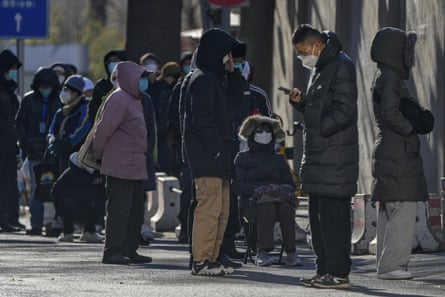

Chinese doctors and nurses are being told to keep working even when infected with Covid-19, staff and residents reported, as the virus rips through the population in the wake of eased restrictions.

工作人员和居民报告说，中国的医生和护士被告知即使感染了新冠肺炎也要继续工作，因为随着限制措施的放松，病毒在人群中肆虐。

Some hospitals in Beijing have up to 80% of their staff infected, but many of them are still required to work due to staff shortages, a doctor in a large public hospital in Beijing told Reuters, adding he had spoken to his peers at other big hospitals in the capital.

北京一家大型公立医院的一名医生告诉路透社，北京的一些医院有高达80%的工作人员感染，但由于人员短缺，他们中的许多人仍然被要求工作，并补充说，他已经与首都其他大医院的同行进行了交谈。

All operations and surgeries had been cancelled at his hospital unless the patient was “dying tomorrow”, he said, declining to be named due to the sensitivity of the subject.

他说，他所在医院的所有手术和手术都被取消了，除非病人“明天就要死了”。由于话题的敏感性，他拒绝透露姓名。

A senior World Health Organization official said on Wednesday that China’s flare-up started “long before” restrictions were lifted, but since the sudden shift in policy major cities in Beijing appear to have experienced [a huge surge in cases of Covid-19](https://www.theguardian.com/world/2022/dec/14/china-says-spread-of-covid-impossible-to-track-as-infections-soar-in-beijing). Authorities have said it is “impossible” to measure, since most people are not being tested.

世界卫生组织的一名高级官员周三表示，中国的突发事件早在限制措施取消之前就开始了，但自政策突然转变以来，北京主要城市似乎经历了新冠肺炎病例的大幅激增。当局表示，由于大多数人都没有接受检测，因此无法进行测量。

“The explosion of cases in [China](https://www.theguardian.com/world/china) had started long before any easing of the zero-Covid policy,” WHO emergencies chief Michael Ryan said on Wednesday. “There’s a narrative that, in some way, China lifted the restrictions and all of a sudden, the disease is out of control,” he added at the UN health agency’s headquarters in Geneva.

世卫组织紧急事务负责人迈克尔·瑞安周三表示，早在零冷政策放松之前，中国病例的爆炸性增长就已经开始了。他在联合国卫生机构日内瓦总部补充道：“有一种说法是，在某种程度上，中国取消了限制，突然之间，疾病失去了控制。”

“The disease was spreading intensively because the control measures in themselves were not stopping the disease.”

“这种疾病之所以蔓延得很厉害，是因为控制措施本身并没有阻止这种疾病。”

In Sichuan, a doctor surnamed Li told Reuters that their tertiary hospital was “overwhelmed with patients”.

在四川，一位姓李的医生告诉路透社，他们的三级医院“人满为患”。

“There are 700, 800 people with fever coming every day,” Li said. “We are running out of medicine stocks for fever and cold. A few nurses at the fever clinic were tested positive, there aren’t any special protective measures for hospital staff and I believe many of us will soon get infected.”

“每天都有700,800人发烧，”李说。“我们正在耗尽治疗发烧和感冒的药品库存。发烧诊所的几名护士检测呈阳性，医院工作人员没有任何特殊的保护措施，我相信我们中的许多人很快就会被感染。

Claims of rampant infections among hospital staff are also spreading across social media. One Chongqing resident said primary care in their city had “imploded”.

医院工作人员感染猖獗的说法也在社交媒体上传播。一位重庆市民表示，他们所在城市的初级医疗服务已经“崩溃”。

“80% of the newly admitted patients in our small third-level respiratory department in a remote city are positive,” they wrote on Weibo.

“From December 8, when the first positive patient was allowed to be admitted, to today, December 13, at least half of the medical staff in our department were infected. At the beginning the infected were allowed to go home to rest, but now as long as it is not very serious symptoms, they are not allowed to go home.”

从12月8日首例阳性患者获准入院至今天，即12月13日，我们科室至少有一半医护人员感染。刚开始感染者可以回家休息，现在只要症状不是很严重，就不能回家。

The Guardian was unable to reach management staff at several hospitals, and health authorities did not immediately respond to queries.

《卫报》无法联系到几家医院的管理人员，卫生当局也没有立即回复询问。

Beijing residents line up to enter the fever clinic of a hospital. Photograph: Andy Wong/AP

北京市民排队进入一家医院发烧门诊。摄影：Andy Wong/美联社

The outbreak is not limited to Beijing, and the sudden pivot in official policy and messaging about the dangers of the virus [brought alarm and fear](https://www.theguardian.com/world/2022/dec/15/relief-and-confusion-inside-china-as-the-country-hurtles-from-virus-free-to-mass-infections) to some. Residents across other major cities told the Guardian it felt like “positive cases are everywhere”.

疫情并不局限于北京，官方政策和有关该病毒危险的信息突然转向，给一些人带来了警报和恐惧。其他大城市的居民告诉《卫报》记者，他们感觉“积极的病例比比皆是”。

A Chongqing resident said all the teachers at their child’s school were positive and classes had moved online. In Zhengzhou, one person said many businesses had switched to working from home.

一位重庆居民说，他们孩子学校的所有老师都很积极，课程已经转移到了网上。在郑州，一位人士表示，许多企业已经转向在家办公。

A Guangzhou resident said the streets were quiet, with many people at home, but businesses and restaurants were still open. “I tried to call the hospital hotline for fever but no one answered the phone,” she said.

一位广州居民说，街道很安静，很多人都在家里，但商店和餐馆仍在营业。她说：“因为发烧，我试着拨打医院热线，但没人接电话。”

The White House national security spokesperson, John Kirby, said the US government was ready to assist China with the outbreak if Beijing requested. Kirby told reporters that China has not requested help at this stage.

白宫国家安全发言人约翰·柯比表示，如果北京方面提出要求，美国政府准备协助中国应对疫情。柯比告诉记者，中国目前还没有请求帮助。

“We have made that point that we are prepared to help in any way they might find acceptable. That was true back when the pandemic was raging, and that is true today,” he said.

我们已经表明了这一点，我们准备以他们认为可以接受的任何方式提供帮助。这在大流行肆虐的时候是正确的，今天也是如此。

The WHO also raised concerns that China’s population of 1.4bn was not adequately vaccinated.

世卫组织还对中国的14亿人口没有充分接种疫苗表示担忧。

China has said about 90% of its population is vaccinated and its National [Health](https://www.theguardian.com/society/health) Commission (NHC) on Wednesday announced it would roll out the second booster shots for high-risk groups and elderly people over 60 years old.

中国表示，大约90%的人口接种了疫苗，国家卫生委员会周三宣布，将为高危人群和60岁以上的老年人推出第二轮强化免疫接种。

Data from the NHC show vaccinations have been ramping up in recent days. The latest official data shows it administered 1.43 million shots on Tuesday, well above the November rate of 100,000-200,000 doses a day.

来自NHC的数据显示，最近几天疫苗接种一直在增加。最新的官方数据显示，周二接种了143万剂疫苗，远高于11月份每天10万至20万剂的速度。

_Reuters contributed to this report  
路透社对此报道也有贡献  
_
