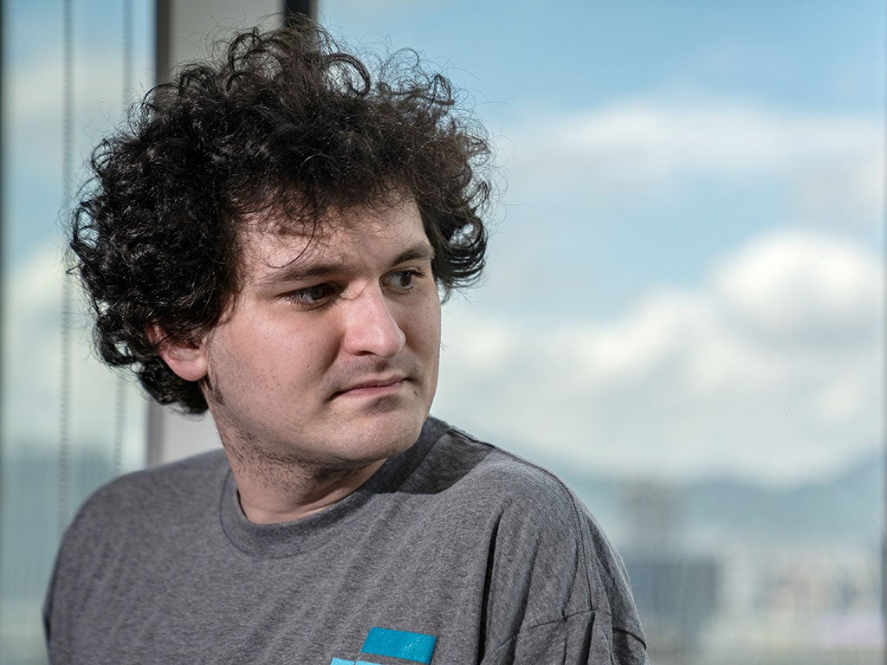

Sam Bankman-Fried was arrested this week on suspicion of wire fraud, securities fraud and money laundering. Photo by Lam Yik/Bloomberg via Getty Images

萨姆·班克曼-弗里德本周因涉嫌电信欺诈、证券欺诈和洗钱而被捕。摄影/彭博透过Getty Images

James Block is a junior doctor at a major university hospital in the midwestern United States. What his patients don’t know is that he has a hobby: in his spare time Block uses software to look through the hundreds of billions of dollars invested in [cryptocurrencies](https://www.newstatesman.com/tag/cryptocurrency) and digital assets, exploring how much they’re really worth and who, if anyone, is getting rich from the digital investment boom.

詹姆斯·布洛克是美国中西部一所主要大学医院的初级医生。他的病人不知道的是，他有一个爱好：在业余时间，Block使用软件查看投资于加密货币和数字资产的数千亿美元，探索它们的真正价值，以及谁(如果有的话)正从数字投资热潮中致富。

Block is one of a group of people – bloggers and independent researchers, many of whom are anonymous and unpaid – who have helped to expose the inner workings of the financial system’s most controversial assets. These amateur sleuths have helped to reveal the workings of FTX, the $32bn crypto exchange that collapsed last month and whose founder, Sam Bankman-Fried, was arrested on 12 December; he has been indicted on eight criminal charges including wire fraud, securities fraud and money laundering.

布洛克是一群人中的一员-博客作者和独立研究人员，其中许多人是匿名的，没有报酬-他们帮助揭露了金融体系最具争议性的资产的内部运作。这些业余侦探帮助揭开了FTX的运作。FTX是一家价值320亿美元的密码交易所，于上月倒闭，其创始人萨姆·班克曼-弗里德于12月12日被捕；他已被控8项刑事指控，包括电信欺诈、证券欺诈和洗钱。

“I have a weird fascination with fraud,” Block told me in one of several phone and video calls we’ve had in recent months, after I contacted him through Twitter. When he first started watching the news, the main items were Enron, the 2008 financial crisis and Bernie Madoff, the New York financier whose asset management business turned out to be a $50bn fraud. “Most of the people I knew in high school didn’t care, but I was always fascinated with it, how these things come about.”

在我通过Twitter联系了布洛克之后，布洛克在最近几个月我们接到的几个电话和视频中的一个电话和视频中告诉我：“我对欺诈有一种奇怪的迷恋。”当他第一次开始看新闻时，主要内容是安然(Enron)、2008年金融危机和纽约金融家伯尼·马多夫(Bernie Madoff)，事实证明，他的资产管理业务是一桩500亿美元的欺诈案。我在高中认识的大多数人都不在乎，但我总是对它着迷，这些事情是如何发生的。

Growing up in Michigan, Block, 30, noticed other people weren’t so bothered, either. “People I know, my age, who are my friends, almost all of them are very credulous. If somebody’s making a lot of money, they don’t think: where’s the money coming from? Or, is what they’re doing ethical or sustainable? They just think: how can I get in on this?”

30岁的布洛克在密歇根州长大，他注意到其他人也不那么在意。我认识的人，我的同龄人，是我的朋友，几乎都很容易轻信。如果有人赚了很多钱，他们不会想：钱是从哪里来的？或者，他们所做的是合乎道德的还是可持续的？他们只是在想：我怎么才能参与进来呢？

He recognises that his dedication is unusual. “Nobody does anything for free, right? It’s always, you have a side hustle, you try to make more money being an influencer or whatever. Nobody does anything for _fun_.”

他意识到自己的奉献精神是不同寻常的。“没有人做任何事都是免费的，对吗？它总是，你有一个副业，你试图赚更多的钱，成为一个有影响力的人或什么的。没有人会为了好玩而做任何事情。

For Block, it’s fun to look at complex problems. At university in Detroit, he studied not only for a medical degree but also a PhD in cancer biology, a science he “really enjoyed”. He says there are parallels with his work on crypto: in groups of cells and in financial markets, there are tests that can be run, data that can be gathered, and a story that can be told about how a handful of factors assemble the pattern of disaster.

对于Block来说，研究复杂的问题是一件有趣的事情。在底特律的大学里，他不仅攻读了医学学位，还攻读了癌症生物学博士学位，这是他“非常喜欢”的一门科学。他说，他在密码方面的研究与他的研究有相似之处：在细胞组和金融市场中，有可以运行的测试，可以收集的数据，以及可以讲述几个因素如何组合灾难模式的故事。

###### Content from our partners  
来自我们合作伙伴的内容  

But when he started to point out that, in crypto markets, the familiar pattern of the Ponzi scheme – a kind of fraudulent investment that only pays out as long as new investors are joining – could be seen again and again, no one seemed to want to know. Block’s posts on Twitter were studiously ignored by a world caught up in the great speculative investment boom of 2020 and 2021, when the stimulus programmes governments deployed during the pandemic created a huge bubble in asset prices. Novice investors piled into anything that offered enough risk – bankrupt companies, blank-cheque vehicles, crypto, NFTs (digital ownership tokens) – and in doing so sent their prices, as the saying goes, to the moon.

但是，当他开始指出，在密码市场上，人们熟悉的庞氏骗局模式--一种欺诈性投资，只有在新投资者加入的情况下才能获得回报--可以一次又一次地看到时，似乎没有人想知道。布洛克在Twitter上的帖子被深陷2020年和2021年大投机投资热潮的世界刻意忽视，当时各国政府在疫情期间实施的刺激计划制造了巨大的资产价格泡沫。新手投资者大举买入任何能带来足够风险的东西--破产的公司、空白支票工具、密码、NFT(数字所有权令牌)--正如俗话所说，这样做会把它们的价格推向月球。

“That made me upset,” Block admits, but it also gave him resolve. “I decided to keep going with it. It provoked me into taking it more seriously.”

“这让我很难过，”布洛克承认，但这也给了他决心。“我决定继续这样做。这激怒了我，让我更加认真地对待这件事。

Block began teaching himself about decentralised finance. Originally intended to let people make simpler transactions between each other, using cryptocurrencies, without needing to use (or pay for) banks, this soon became even more speculative and overcomplicated than regular finance. He learned about about the esoteric constructs – protocols, tokens, decentralised markets – that have been built to make it appear that something very clever is being done to produce returns. Occasionally, he would see something that looked recognisably pyramid-shaped.

布洛克开始自学去中心化金融。最初的目的是让人们使用加密货币在彼此之间进行更简单的交易，而不需要使用银行(或支付)，但很快这就变得比常规金融更具投机性和过于复杂。他了解了深奥的结构--协议、令牌、去中心化的市场--这些结构的建立让人觉得，为了产生回报，人们正在做一些非常聪明的事情。偶尔，他会看到一些看起来像金字塔形状的东西。

**_\[See also: [Will the crypto crash bring down Bitcoin?](https://www.newstatesman.com/business/finance/2022/11/will-crypto-crash-bring-down-end-bitcoin)\]_  
\[另见：密码崩溃会拖垮比特币吗？\]  
**

One company offered a guaranteed 12 per cent return to investors, but wouldn’t say how the money was being made. It was a very similar guarantee to that offered by Madoff, who offered reliable double-digit returns with little explanation of the magic that created them (until he went to prison in 2009, owing $170bn in restitutions). “That’s what I mean about recognising a Ponzi when you see it.”

一家公司向投资者提供了12%的保证回报率，但拒绝透露这笔钱是如何赚到的。这与马多夫提供的担保非常相似，马多夫提供了可靠的两位数回报，但几乎没有解释创造这些回报的魔力(直到他在2009年入狱，欠下1700亿美元的赔偿)。“这就是我所说的一眼就能认出庞氏骗局的意思。”

But more than this company itself – a crypto exchange and lender called Celsius – Block was captivated by its CEO, Alex Mashinsky. Mashinsky, a serial entrepreneur, was known for his brash, self-aggrandising demeanour. He claimed to have invented or created early versions of Skype and Uber, but to have been so far ahead of the curve he was unable to capitalise on his innovations. He had reportedly departed from a number of businesses leaving investors and colleagues riled. When it came to the new crypto religion, Mashinksy was a devout and vocal convert, preaching the litany of rising numbers from conference stages on which he would wear a T-shirt that read: “Banks are not your friends.”

但除了这家公司本身--一家名为Celsius的密码交易所和贷款人--Block还被其首席执行官亚历克斯·马辛斯基迷住了。马辛斯基是一位连续创业的人，他以傲慢、自大的举止而闻名。他声称自己发明或创造了Skype和Uber的早期版本，但由于走在了前列，他无法充分利用自己的创新。据报道，他已经离开了许多企业，这让投资者和同事们感到愤怒。当谈到新的密码宗教时，马辛西是一个虔诚的、直言不讳的皈依者，他在会议舞台上宣扬人数不断上升的长篇大论，他会穿着一件T恤，上面写着：“银行不是你的朋友。”

Mashinsky would hold regular “ask me anything” sessions online for investors, so Block joined one and asked questions he didn’t like. After some back and forth, Mashinsky told Block: “There are no rules in this business.”

马辛斯基会定期在网上为投资者举办“Ask Me Anything”会议，因此布洛克参加了一个会议，并提出了他不喜欢的问题。经过一番周旋之后，马辛斯基告诉布洛克：“这个行业没有规则。”

“It was him that really got me to focus on Celsius,” Block told me.  
布洛克告诉我：“是他让我真正把注意力放在了凯尔西亚斯。”  

The great thing about crypto for people like Block is that, while in some ways it conceals the identities of the people using it as money (which is why it is so widely used by drug dealers, fraudsters, illegal porn sites and tax evaders), the money itself is often public. In many cases transactions are recorded in the currency’s public database (its blockchain), which is shared with every other user of the system. “There are certain things you can’t hide,” he told me. Block began using software, much of it available for free, to scan blockchains and identify where the money flowed and who owned the accounts (known as wallets) behind the transactions. He began publishing his findings as Dirty Bubble Media. (The Dirty Bubble is a villain from the cartoon _Spongebob Squarepants_: he’s a bad guy, but you can see through him.)

对于布洛克这样的人来说，密码的伟大之处在于，虽然在某些方面它隐藏了将其用作金钱的人的身份(这就是为什么它被毒贩、欺诈者、非法色情网站和逃税者广泛使用)，但这些钱本身往往是公开的。在许多情况下，交易记录在货币的公共数据库(其区块链)中，该数据库与系统的其他所有用户共享。“有些事情是你无法隐藏的，”他告诉我。布洛克开始使用软件扫描区块链，识别资金流向哪里，以及交易背后的账户(称为钱包)的所有者，其中大部分软件是免费的。他开始在Dirty Bubble Media上发表他的发现。(《肮脏的泡泡》是动画片《海绵宝宝》中的反派：他是个坏人，但你可以看穿他。)

In the trading of Mashinsky’s Celsius crypto token (CEL), Block says [he saw a pattern](https://dirtybubblemedia.substack.com/p/anatomy-of-a-fake-market) of “very questionable and high-risk activities”: significant volumes of the token appeared to move between the same accounts, bouncing across different exchanges before returning to the Celsius Network in a manner that may have artificially inflated its value. And as the rising price of CEL persuaded more investors to put their money in the Celsius Network, Mashinsky and his fellow executives were withdrawing tens of millions of old-fashioned dollars (and placing them, presumably, in those banks about whose intentions Mashinsky was so concerned).

在马辛斯基的Celsius密码令牌(CEL)的交易中，布洛克表示，他看到了一种“非常可疑和高风险的活动”：大量令牌似乎在相同的账户之间移动，在不同的交易所之间跳跃，然后以一种可能人为抬高其价值的方式返回Celsius Network。随着CEL不断上涨的价格说服更多投资者将资金投入Celsius Network，马辛斯基和他的高管们正在提取数千万美元的老式资金(想必是把它们放在那些马辛斯基非常担心其意图的银行)。

In the end it was Mashinsky’s showboating that proved his undoing: Block was [able to identify different crypto wallets as belonging to him](https://dirtybubblemedia.substack.com/p/hodl-for-thee-but-not-for-me) because the crypto CEO would often boast about making deposits, posting screenshots that included details of the digital wallets he had used. Mashinsky’s profile picture on Twitter was “one of those stupid NFTs – of himself, of course – and if you track the wallet that holds that NFT, you can prove beyond any reasonable doubt that he controls one of these wallets that engaged in millions of dollars of sales”.

最终，马辛斯基的炫耀证明了他的失败：布洛克能够识别出不同的加密钱包是属于他的，因为这位加密首席执行官经常吹嘘自己存了钱，并发布截图，其中包括他使用过的数字钱包的细节。马辛斯基在推特上的头像是“一个愚蠢的非金融交易者--当然是他自己--如果你追踪持有该非金融交易者的钱包，你就可以毫无疑问地证明，他控制着其中一个从事数百万美元销售的钱包”。

In July this year, Celsius filed for bankruptcy, leaving its more than 300,000 active users out of pocket. Mashinsky’s statement claimed that market conditions and “misleading media coverage” had led to a “run on the bank”. Securities regulators across the US took a different view: officials in at least 40 states have begun investigating the company for what the Vermont state regulator [called](https://cases.stretto.com/public/x191/11749/PLEADINGS/1174909072280000000015.pdf) “unregistered securities activity, mismanagement, securities fraud, and market manipulation”. Block’s work would later be [cited](https://cases.stretto.com/public/x191/11749/PLEADINGS/1174909122280000000064.pdf) by Celsius creditors in their court filings.

今年7月，Celsius申请破产，导致其30多万活跃用户损失惨重。马辛斯基的声明称，市场状况和“误导性的媒体报道”导致了“银行挤兑”。美国各地的证券监管机构持不同观点：至少40个州的官员已开始调查该公司，佛蒙特州监管机构称其为“未注册的证券活动、管理不善、证券欺诈和市场操纵”。布洛克的工作后来被摄氏度的债权人在他们的法庭文件中引用。

Among the largest creditors listed in the Celsius bankruptcy filing were a hedge fund called Alameda Research and a fund owned by a company called Lantern Ventures, whose CEO was also a co-founder of Alameda. Alameda was a sister company to FTX, the world’s second-largest crypto exchange. Both were founded by someone who would soon become a household name: Sam Bankman-Fried.

Celsius破产申请中列出的最大债权人包括一家名为Alameda Research的对冲基金和一家名为Lantern Ventures的公司拥有的一只基金，该公司的首席执行官也是Alameda的联合创始人。Alameda是世界第二大密码交易所FTX的姊妹公司。这两家公司都是由一个很快成为家喻户晓的名字创立的：萨姆·班克曼-弗里德。

In July 2021 a source messaged me to say that FTX was “the new Bitmex” (Bitmex is a crypto exchange co-founded by an “effective altruist” who was found guilty in 2021 of violating securities laws). The source claimed that Bankman-Fried was raising large amounts of capital from investors “to cover up losses”. At the time Bankman-Fried, now 30, was the rising star of crypto, a cartoon of the disruptive entrepreneur: a 29-year-old who lived in the Bahamas, slept on beanbags in the office and was worth $16bn. He played video games in meetings with venture capitalists, and paid Bill Clinton and Tony Blair to appear at his conference.

2021年7月，一位消息人士给我发消息说，FTX是“新的Bitmex”(Bitmex是一家密码交易所，由一名“有效的利他主义者”共同创立，此人于2021年被判违反证券法)。该消息人士称，Bankman-Fry正在从投资者那里筹集大量资金，“以掩盖损失”。当时，现年30岁的班克曼-弗里德是《Crypto》的后起之秀，这是一部讲述颠覆性企业家的漫画：29岁的他住在巴哈马群岛，睡在办公室的豆袋里，身价160亿美元。他在与风险资本家的会议上玩电子游戏，并付钱让比尔·克林顿和托尼·布莱尔出席他的会议。

When I spoke to that source this month he said I could call him “Andrew Ryan”, although that’s not his real name. Ryan describes himself as “kind of the original sceptic” when it comes to crypto. While people have been questioning crypto’s uses and purpose since it launched in 2009, Ryan began looking at movements in the price of [Bitcoin](https://www.newstatesman.com/tag/bitcoin) in 2017. What made him suspicious was that, every now and then, for no apparent reason, the price of Bitcoin would suddenly rise.

本月，当我与这位消息人士交谈时，他说我可以叫他“安德鲁·瑞安”，尽管那不是他的真名。瑞安称自己在密码方面是“最初的怀疑论者”。自2009年推出以来，人们一直在质疑加密的用途和目的，但瑞安在2017年开始关注比特币价格的变动。让他产生怀疑的是，比特币的价格时不时地会突然上涨，没有明显的原因。

“It’s almost like a restaurant that claims they have a booming restaurant business, but the restaurant, every time you go there, it’s closed. There’s nobody there. But they’re claiming, ‘Oh, yeah, it’s packed!’ It doesn’t make sense. That’s kind of what triggered me.”

这几乎就像一家餐厅声称他们的餐厅业务蓬勃发展，但这家餐厅，每次你去那里，它都关门了。那里没有人。但他们声称，‘哦，是的，这里挤满了人！’这没有意义。这在某种程度上触发了我的想法。

**_\[See also: [Is Elon Musk too rich to fail?](https://www.newstatesman.com/business/2022/11/elon-musk-destroying-twitter)\]_  
\[另见：埃隆·马斯克是不是太富有而不能失败？\]  
**

Like Block, Ryan used blockchain tools to create an account of what was really happening in crypto. Unlike Block, he didn’t have a particular fascination for fraud. Ryan could spot the pattern of market manipulation not because he had a background in finance, but because he had a background in financial crime. “There was a period of my history,” he told me, “where I did the same exact thing. I printed a bunch of currency units, and I inflated a market. And I got caught. And I kind of got in trouble.”

和Block一样，瑞安使用区块链工具来创建密码中真实发生的事情的账户。与布洛克不同，他对欺诈没有特别的兴趣。瑞安之所以能发现市场操纵的模式，不是因为他有金融背景，而是因为他有金融犯罪背景。“在我的历史上，有一段时间，”他告诉我，“我做了同样的事情。我印制了一大堆货币单位，我夸大了市场。然后我就被抓了。我有点麻烦了。“

What Ryan’s research concluded was that the price of Bitcoin was being moved by another cryptocurrency, Tether. As a “stablecoin”, Tether is designed to be redeemable for $1, which allows it to be traded as a replacement dollar on crypto exchanges. There is supposed to be a dollar (or, since 2019, a dollar-equivalent asset) in a bank account somewhere for every Tether issued. The company that owns Tether should therefore have $65bn in assets, which would make it considerably larger than some UK high-street banks and building societies. But as Ryan pointed out in 2017 – and a subsequent investigation by Letitia James, the New York attorney-general, [agreed in 2021](https://ag.ny.gov/press-release/2021/attorney-general-james-ends-virtual-currency-trading-platform-bitfinexs-illegal) – there was at least one period in which most Tethers were not backed by dollars, at which time the company did not even have a correspondent bank to carry out dollar transactions with clients.

瑞安的研究得出的结论是，比特币的价格正在受到另一种加密货币Tether的影响。作为一种“稳定货币”，Tether被设计成可以兑换1美元，这使得它可以在密码交易所作为替代美元进行交易。据推测，每发行一条绳索，银行账户中就应该有一美元(或者从2019年起，银行账户中应该有一美元等值资产)。因此，拥有Tether的公司应该拥有650亿美元的资产，这将使其比英国一些商业街银行和建房互助会大得多。但正如瑞安在2017年指出的那样--纽约州总检察长利蒂夏·詹姆斯(Letitia James)随后在2021年同意进行的一项调查--至少有一段时间大多数特瑟没有美元支持，当时该公司甚至没有代理银行与客户进行美元交易。

Ryan also revealed that Tether had the same owner as a crypto exchange, Bitfinex (which was confirmed by the “Paradise Papers” leak of offshore ownership information) and that Tether’s money-printing was being used to cover losses from Bitfinex (which, again, the attorney-general’s investigation agreed). His work, published as anonymous blog posts and tweets under the handle “Bitfinex’ed”, helped to lead regulators and prosecutors in the right direction: his findings were cited in an influential 2020 paper by the academic John Griffin, which also concluded that Tether was the most likely cause of large rises in the price of Bitcoin. Griffin’s company, Integra, is also a [supplier](https://www.usaspending.gov/recipient/b422953a-85b0-e681-dc60-8f54bcb40c71-C/latest) of services to government agencies including the US financial regulator, the Securities and Exchange Commission.

瑞安还透露，Tether与密码交易所Bitfinex拥有相同的所有者(这一点得到了离岸所有权信息泄露的《天堂文件》的证实)，Tether的印钞被用来弥补Bitfinex的损失(再次，总检察长的调查同意了这一点)。他的工作以匿名博客帖子和推文的形式发表，署名为“Bitfinex‘ed”，帮助将监管机构和检察官引向了正确的方向：他的发现被学者约翰·格里芬(John Griffin)在2020年发表的一篇颇具影响力的论文中引用，该论文还得出结论，拴系是比特币价格最有可能大幅上涨的原因。格里芬的公司Integra也是政府机构的服务供应商，包括美国金融监管机构美国证券交易委员会(Securities And Exchange Commission)。

Like Block, Ryan wasn’t thanked for pointing out what he sees as a problem at “the centre of the whole thing”. He has received death threats and hacking attempts, a common theme among crypto critics. Block, too, had his Twitter account hacked; it took him three months to regain access. The economist Nouriel Roubini also told me he had received death threats and racist abuse from more than 1,000 Twitter accounts when he spoke out against Bitmex in 2018: “armies of bots clogging my feed with thousands of spam messages and attacks”, hacking attempts and a denial of service attack against his email address. When Roubini criticised the world’s biggest crypto exchange, Binance, this year, the bot attacks resumed.

就像布洛克一样，瑞安并没有因为指出他眼中的问题所在而被感谢。他收到过死亡威胁和黑客企图，这是密码批评者的常见主题。布洛克的Twitter账户也被黑客入侵；他花了三个月的时间才重新获得访问权限。经济学家努里埃尔·鲁比尼(Nouriel Roubini)还告诉我，他在2018年公开反对Bitmex时，收到了1000多个Twitter账户的死亡威胁和种族主义辱骂：“成群结队的机器人堵塞了我的信息源，充斥着数千条垃圾信息和攻击”，黑客企图攻击他的电子邮件地址，并对他的电子邮件地址进行拒绝服务攻击。今年，当鲁比尼批评世界上最大的密码交易所Binance时，机器人攻击重新开始。

And like Block, Ryan eventually found his work leading him towards one person. Of all the Tether that was printed, one company stood out as a buyer, taking in more than $36bn of the currency, according to [research by the crypto news site Protos](https://protos.com/tether-papers-crypto-stablecoin-usdt-investigation-analysis/): Alameda Research. And of that, $30bn went to the crypto exchange FTX. Both were founded – and FTX was run – by Bankman-Fried. “Almost every penny that he got, he sends to Tether,” said Ryan.

和布洛克一样，瑞安最终发现自己的工作让他找到了一个人。根据加密新闻网站Protos：Alameda Research的研究，在所有打印的系绳中，有一家公司作为买家脱颖而出，获得了超过360亿美元的货币。其中300亿美元流向了密码交易所FTX。这两家公司都是由Bankman-Fry创立的，FTX是由Bankman-Fry运营的。瑞安说：“他几乎把得到的每一分钱都花在了系绳上。”

It was a blog post from Block that helped precipitate the downfall of Bankman-Fried, whose net worth fell from an estimated $20bn to around $100,000 last month after his network of companies, including FTX and Alameda Research, filed for bankruptcy. The US Department of Justice described Bankman-Fried’s real business as “a massive, years-long fraud diverting billions of dollars of the trading platform’s customer funds for his own personal benefit”. It’s likely he will be extradited to the US.

正是Block的一篇博客文章促成了Bankman-Fry的破产。上月，在旗下FTX和Alameda Research等公司网络申请破产后，Bankman-Fry的净资产从估计的200亿美元降至10万美元左右。美国司法部将Bankman-Fry的真实业务描述为“一场长达数年的大规模欺诈案，将该交易平台数十亿美元的客户资金挪用来谋取个人利益”。他很可能会被引渡到美国。

The crisis for Bankman-Fried began when the balance sheet for his trading firm, Alameda Research, was published by a crypto news website called Coindesk. Block immediately began to analyse the $14.6bn of assets listed. The largest of these was almost $6bn in a crypto token called FTT – a currency issued by Bankman-Fried’s own FTX exchange.

班克曼-弗里德的危机始于他的交易公司阿拉米达研究公司(Alameda Research)的资产负债表被一家名为CoinDesk的加密新闻网站公布。布洛克立即开始分析上市的146亿美元资产。其中最大的一笔是一种名为FTT的加密令牌，价值近60亿美元。FTT是由Bankman-Fry旗下的FTX交易所发行的一种货币。

FTX was then the second-largest crypto exchange in the world; at its peak in 2021, more than $21bn was traded through the platform in 24 hours. What Block showed, however, was that only a fraction of 1 per cent of FTT was traded on a daily basis. “And if you look at how it’s trading, it’s all trading in a big circle, suggesting that most of the transactions are not actually real economic trades made by real people.” Elsewhere on the balance sheet were unusable “locked” tokens, some of them made by companies Bankman-Fried had also founded. Alameda’s supposed collateral consisted of billions of dollars in money that Bankman-Fried and his colleagues had made up, and which very few people wanted to buy.

FTX当时是全球第二大密码交易所；在2021年的巅峰时期，该平台在24小时内的交易额超过210亿美元。然而，布洛克的数据显示，FTT的日交易量只有1%的一小部分。如果你看看它是如何交易的，你会发现它都在一个大圈子里交易，这表明大多数交易实际上并不是真正的人进行的实体经济交易。在资产负债表的其他地方，有一些无法使用的“锁定”代币，其中一些是由Bankman-Fry也创立的公司制造的。阿拉米达所谓的抵押品包括数十亿美元的钱，这些钱是班克曼-弗里德和他的同事虚构的，几乎没有人想买。

As the implications began to spread, Changpeng Zhao, the CEO of Binance, recognised the analysis Block had done on Twitter. He announced that Binance would be selling off everything that remained of the FTT tokens it held from a deal previously valued at $2.1bn. As head of the world’s biggest crypto exchange, Zhao caused FTX’s customers to run for the doors, but it was too late for many: FTX halted customer withdrawals the same day and within a week had filed for bankruptcy, leaving more than a million unsecured creditors.

随着影响开始扩散，Binance的首席执行官赵昌鹏认识到了Block在Twitter上所做的分析。他宣布，Binance将出售其持有的所有FTT代币，此前这笔交易的估值为21亿美元。作为世界上最大的密码交易所的负责人，赵导致FTX的客户纷纷逃之夭夭，但对许多人来说已经太晚了：FTX在同一天停止了客户取款，一周内就申请破产，留下了100多万无担保债权人。

For Ryan and Block, a lot of questions remain: where did all the money people trusted to FTX end up? Did Bankman-Fried really send tens of billions of dollars to Tether? But the other fundamental question is: why didn’t anyone believe them? For this the blame is shared by a credulous media, politicians who were [too eager to get in on a tech trend](https://www.newstatesman.com/business/finance/2022/11/politicians-public-cryptocurrency-trend), but most of all the decade-long splurge of quantitative easing and low interest rates which led a new generation of investors to conclude that money itself had lost all meaning. In this environment, it made as much sense to invest in a weird internet joke as anything else.

对于瑞安和布洛克来说，很多问题仍然存在：人们信任FTX的所有资金最终都到哪里去了？班克曼-弗里德真的把数百亿美元送到了系绳上吗？但另一个根本问题是：为什么没有人相信他们？对于这一点，轻信的媒体、过于急于参与科技趋势的政客们也有同样的指责，但最重要的是，长达十年的量化宽松和低利率的挥霍导致新一代投资者得出结论，认为货币本身已经失去了所有意义。在这种环境下，投资于一个奇怪的网络笑话和其他任何事情一样有意义。

When there’s money to be made in ignoring the facts, Ryan says, there’s no incentive to look for the truth: “It’s easier to scam somebody than it is to convince them that it’s a scam.”

瑞安说，当无视事实可以赚钱时，就没有动力去寻找真相：“欺骗某人比说服他们相信这是一个骗局容易得多。”

Block agrees that the problem is not so much that scammers exist – they always will – but that the world has made people so ready to believe them. “I did this for free, because it was interesting, and no one can believe that. It’s disappointing, actually. I don’t think too many people are sceptical of anything, any more.”

布洛克同意，问题并不在于骗子的存在--他们永远都会存在--而是世界已经让人们如此愿意相信他们。我免费做了这件事，因为它很有趣，没人能相信。事实上，这很令人失望。我认为不再有太多人对任何事情持怀疑态度。

**_\[See also: [Bitcoin’s most basic principle has become crypto’s biggest problem](https://www.newstatesman.com/business/2022/11/bitcoin-basic-principle-crypto-problem)\]_**

**\[另见：比特币最基本的原理已成为密码的最大问题\]**
