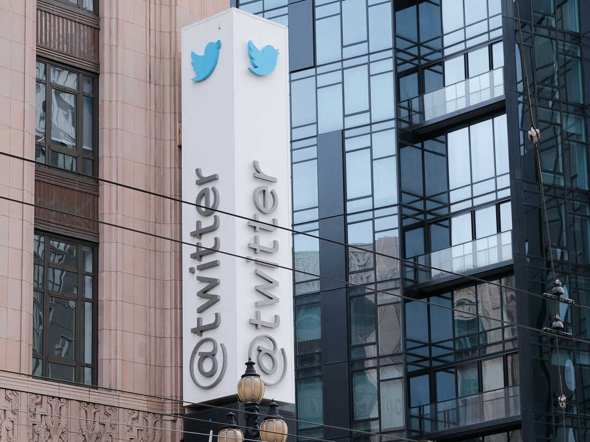
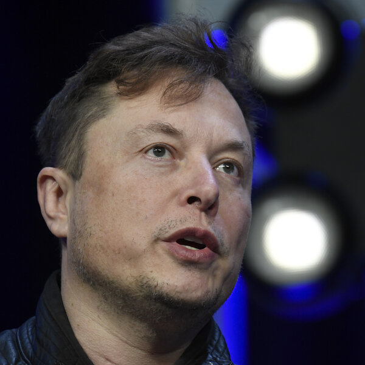
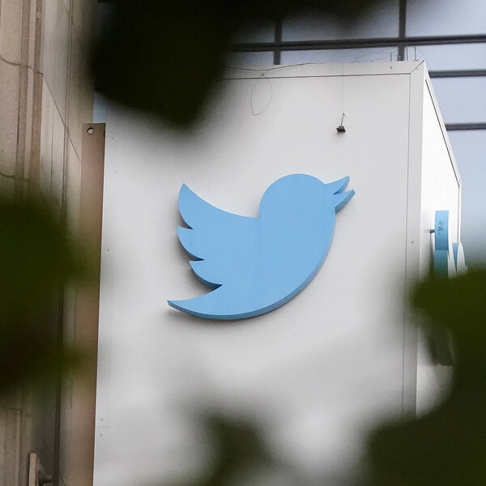
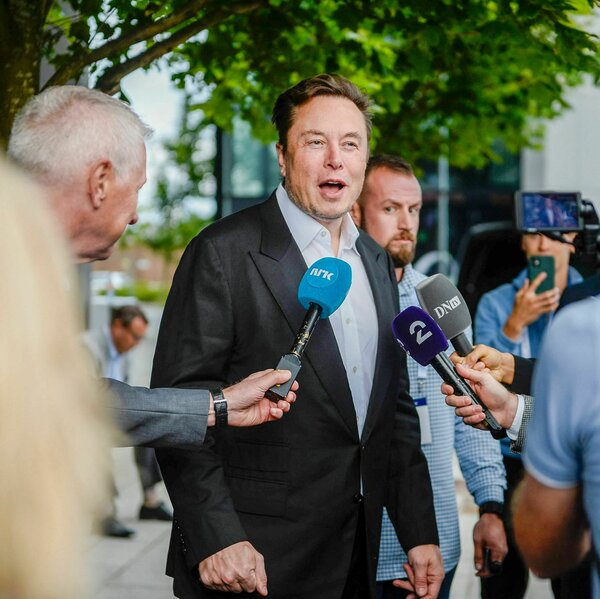

  

Twitter headquarters in San Francisco on Nov. 4. The United Nations and the European Union are among the groups that condemned Elon Musk's decision to suspend several journalists from the social media platform.

11月4日，推特总部在旧金山。联合国和欧盟等组织谴责埃隆·马斯克暂停几名记者在社交媒体平台上的职务的决定。

David Odisho/Getty Images  
David Odisho/Getty Images  

Amid intense backlash and accusations of violating press freedom, Twitter has reinstated the accounts of [several journalists who were suspended](https://www.npr.org/2022/12/15/1143291081/twitter-suspends-journalists-elon-musk-jet) earlier this week, though at least one remains suspended.

在强烈的反弹和侵犯新闻自由的指控下，Twitter恢复了本周早些时候被暂停的几名记者的账号，尽管至少有一名记者仍被暂停。

On Thursday night, the social media platform suspended several reporters who had tweeted or written about Elon Musk's ownership of the company.

周四晚上，这家社交媒体平台暂停了几名记者的职务，这些记者曾在Twitter上发帖或撰写关于埃隆·马斯克拥有该公司的文章。

The accounts that went dark included Donie O'Sullivan of CNN; Ryan Mac of _The New York Times_; Drew Harwell of _The Washington Post_; Micah Lee of The Intercept; and journalist Aaron Rupar.

被曝光的账号包括CNN的唐尼·奥沙利文、《纽约时报》的瑞安·麦克、《华盛顿邮报》的德鲁·哈维尔、The Intercept的米卡·李以及记者亚伦·鲁帕。

 

On Friday evening, Musk put the decision of whether to reinstate suspended accounts up for a public vote. He [tweeted](https://twitter.com/elonmusk/status/1603600001057185792) an informal poll which asked Twitter users to choose when to "unsuspend accounts who doxxed my exact location in real-time."

周五晚上，马斯克将是否恢复被暂停的账户的决定提交给公众投票。他在推特上发布了一项非正式的民意调查，要求推特用户选择何时“解除对我准确位置的实时解禁”。

According to the poll, 58.7% of voters favored lifting the suspensions immediately over 41.3% of respondents who said Musk should wait seven more days.

民调显示，58.7%的选民赞成立即解除停职，41.3%的受访者认为马斯克应该再等七天。

Rupar, whose account was reinstated on Friday, said the suspensions signaled Twitter's instability.

Rupar的账号于周五恢复，他表示，暂停使用Twitter标志着Twitter的不稳定。

"It's a clear illustration that it is no longer a rules-based company," Rupar told NPR. "It's basically a company based on Elon Musk's whims and the terms of service depend on his mood each day."

鲁帕尔对NPR说：“这清楚地表明，它不再是一家以规则为基础的公司。”“这基本上是一家基于埃隆·马斯克突发奇想的公司，服务条款取决于他每天的心情。”

Joan Donovan, the research director at Harvard's Shorenstein Center on Media, Politics and Public Policy, thinks this week's spree of suspensions is only the beginning.

哈佛大学肖伦斯坦媒体、政治和公共政策中心的研究主任琼·多诺万认为，本周的停职狂潮只是个开始。

"The way Musk is targeting particular mainstream journalists, I think we're going to see more of these shenanigans, and not less, over the next couple of months," she told NPR's Michel Martin on _All Things Considered._

她在接受NPR记者米歇尔·马丁采访时表示：“按照马斯克针对主流记者的方式，我认为在接下来的几个月里，我们会看到更多这样的恶作剧，而不是更少。”

Linette Lopez, a Business Insider reporter who previously covered Musk, said her account was suspended on Friday after she tweeted court documents that revealed Musk had hacked and doxxed people in the past.

之前报道马斯克的Business Insider记者Linette Lopez表示，她的账号在周五被暂停，此前她在推特上发布了法庭文件，显示马斯克过去曾黑客攻击和欺骗人们。

"Its funny that Elon suddenly has a problem with doxxing and harassing people because he has a history of doing that before people were paying such close attention to him," she told NPR.

她在接受NPR采访时表示：“有趣的是，埃隆突然有了骚扰他人的问题，因为在人们如此密切地关注他之前，他就有过这样做的历史。”

Lopez's account remains suspended. As of Saturday afternoon, Lopez said she still has not heard from Twitter as to why.

洛佩兹的账号仍处于暂停状态。截至周六下午，洛佩兹表示，她仍然没有从推特上得到关于原因的消息。

NPR has reached out to Twitter and Musk but has not gotten a response.

NPR已经联系了推特和马斯克，但没有得到回应。

### It all started with a jet-tracking Twitter account  
这一切都始于一个追踪飞机的Twitter账户  

Prior to suspending the accounts of the journalists, Musk took issue with several accounts that tracked the movement of private planes used by billionaires, government officials and others.

在暂停这些记者的账户之前，马斯克对几个追踪亿万富翁、政府官员和其他人使用的私人飞机移动的账户提出了异议。

Musk was particularly concerned with the jet-tracking account, @ElonJet, run by a 20-year-old University of Central Florida student, which Musk alleges was used by a "[crazy stalker](https://twitter.com/elonmusk/status/1603190155107794944)" in Los Angeles to follow one of Musk's children.

马斯克特别关注飞机跟踪账户@ElonJet，该账户由一名20岁的中佛罗里达大学学生运营，马斯克声称该账户被洛杉矶的一个“疯狂的跟踪者”用来跟踪马斯克的一个孩子。

Journalists who tweeted or wrote about Musk's rift with the account found themselves later suspended.

那些在推特上发帖或写下马斯克与该账号不和的记者后来被停职。

 

Musk, a self-professed "free speech absolutist," has denied accusations that the suspensions were in retaliation for critical coverage. Instead, he argued that the accounts are a "physical safety violation" and can lead to "doxxing," or sharing of personal information to encourage harassers.

自称“言论自由绝对主义者”的马斯克否认了停职是为了报复批评性报道的指控。取而代之的是，他辩称，这些账户是“违反人身安全的行为”，可能会导致“doxting”，即共享个人信息以鼓励骚扰者。

"Criticizing me all day long is totally fine, but doxxing my real-time location and endangering my family is not," Musk [tweeted](https://twitter.com/elonmusk/status/1603575877538680832) Thursday night.

周四晚上，马斯克在推特上写道：“整天批评我是完全可以的，但破坏我的实时定位并危及我的家人就不是这样了。”

### Musk's crackdown was condemned by the U.N. and EU  
马斯克的镇压行动遭到联合国和欧盟的谴责  

A number of organizations around the globe have criticized Musk's apparent silencing of high-profile journalists on Twitter.

全球许多组织批评马斯克在推特上明显压制知名记者的行为。

Melissa Fleming, the United Nations undersecretary-general for global communications, said she was "deeply disturbed" by the suspensions.

联合国负责全球传播事务的副秘书长梅丽莎·弗莱明表示，她对停职“深感不安”。

"Media freedom is not a toy. A free press is the cornerstone of democratic societies and a key tool in the fight against harmful disinformation," Fleming [tweeted](https://twitter.com/MelissaFleming/status/1603763517642907655) on Friday.

周五，弗莱明在推特上写道：“媒体自由不是玩具。新闻自由是民主社会的基石，也是打击有害虚假信息的关键工具。”

 

Věra Jourová, the European Commission vice president, warned Twitter of potentially violating the European Union's Digital Services Act and Media Freedom Act.

欧盟委员会副主席Věra Jourová警告推特可能违反欧盟的《数字服务法案》和《媒体自由法》。

"There are red lines. And sanctions, soon," Jourová [tweeted](https://twitter.com/VeraJourova/status/1603689440710369281?s=20&t=dUR9L5132TApMsXHmrkMQQ) Friday.  
周五，朱罗瓦在推特上写道：“有红线。很快就会有制裁。”  

The suspensions have also drawn outrage from several news organizations that are demanding explanations for why their reporters were temporarily banned.

停职也引起了几家新闻机构的愤怒，他们要求解释为什么他们的记者被暂时禁止。

"Twitter's increasing instability and volatility should be of incredible concern for everyone who uses the platform," CNN said in a [statement](https://twitter.com/CNNPR/status/1603579612612665344) on Thursday. "We will reevaluate our relationship based on that response."

美国有线电视新闻网周四在一份声明中表示：“推特日益增长的不稳定性和波动性，应该令所有使用该平台的人感到难以置信的担忧。”“我们将根据这一回应重新评估我们的关系。”

For Rupar, though he was initially worried about how the Twitter ban would negatively impact his career, the opposite turned out to be true.

对于鲁帕来说，尽管他最初担心推特禁令会对他的职业生涯产生负面影响，但事实证明情况恰恰相反。

"The consequences for me were pretty positive overall," he said.  
“总体来说，结果对我来说是相当积极的，”他说。  

In the hours following his suspension, Rupar said he received an onslaught of support and a mass of followers on his newly created [Mastodon](https://www.npr.org/2022/11/10/1135243276/mastodon-twitter-elon-musk) account — which he plans to use more frequently.

在被停职后的几个小时里，鲁帕说他在新创建的Mastodon账号上收到了猛烈的支持和大量的粉丝-他计划更频繁地使用这个账号。

"Even though I'm back on Twitter, in light of this experience, it seems like a good time to spend more energy developing a following elsewhere," Rupar said.

鲁帕尔说：“尽管我又回到了推特上，但鉴于这次经历，现在似乎是花更多精力在其他地方培养追随者的好时机。”
