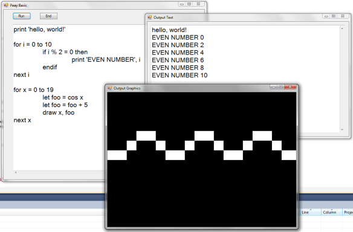

## Austin Z. Henley  
奥斯汀·Z·亨利  

I work on AI + dev tools.  
我从事AI+开发工具的工作。  

___

___

12/11/2019 2019年12月11日

_Update 12/14/2019: This post spurred a lot of discussion on [Hacker News](https://news.ycombinator.com/item?id=21790779) and [Reddit](https://www.reddit.com/r/programming/comments/ean6ch/challenging_projects_every_programmer_should_try/). I collected some of the suggested projects and put them in a list at the end of this post._

_2019年12月14日更新：这篇帖子在黑客新闻和Reddit上引发了大量讨论。我收集了一些建议的项目，并将它们放在本文末尾的列表中。_

**Check out the sequel to this post: [More challenging projects every programmer should try](https://austinhenley.com/blog/morechallengingprojects.html).**

**看看这篇文章的续篇：每个程序员都应该尝试更具挑战性的项目。**

I talk to a lot of students and professional developers that often want to start a side project, but aren't sure what to build. Below is a handful of software projects that taught me a lot. In fact, they're great because you could build them multiple times and learn new things each time. So whenever I don't know what to build or I want to learn a new programming language or framework, I start with one of these:

我与许多学生和专业开发人员交谈过，他们经常想开始一个副项目，但不确定要构建什么。下面是几个让我学到很多的软件项目。事实上，它们很棒，因为您可以多次构建它们，每次都可以学习新的东西。因此，每当我不知道要构建什么，或者我想学习一种新的编程语言或框架时，我都会从以下其中之一开始：

-   Text editor 文本编辑器
-   2D game - Space Invaders  
    2D游戏空间入侵者  
    
-   Compiler - Tiny BASIC  
    编译程序-微型BASIC  
    
-   Mini operating system  
    迷你操作系统  
    
-   Spreadsheet (_hard!_)  
    电子表格(硬！)  
    
-   Video game console emulator (_hard!_)  
    视频游戏机模拟器(Hard！)  
    

  

### Text Editor 文本编辑器

We use text editors everyday, but do you know how it really works? Ignoring all of the fancy features that your favorite editor has, how would you implement a textbox that supports a movable text cursor and selecting, inserting, and deleting text? No, you can't use the builtin textbox component from your favorite GUI framework!

我们每天都使用文本编辑器，但你知道它是如何工作的吗？忽略您最喜欢的编辑器所具有的所有奇特功能，您将如何实现支持可移动文本光标以及选择、插入和删除文本的文本框？不，您不能使用您最喜欢的图形用户界面框架中的内置文本框组件！

The biggest challenge is figuring out how to store the text document in memory. My first thought was to use an array, but that has horrible performance if the user inserts text anywhere other than the end of the document. Luckily, there are some nice data structures to learn to solve this.

最大的挑战是找出如何将文本文档存储在内存中。我的第一个想法是使用数组，但如果用户在文档末尾以外的任何位置插入文本，性能会很差。幸运的是，有一些很好的数据结构可以学习来解决这个问题。

Another hurdle was learning how a text cursor behaves in popular editors. For example, if I press the up arrow key with the cursor in the middle of the document, where will the cursor move? Same column? Not if that line is shorter. Keep pressing up. The cursor will snap back to the original column once a line is long enough. It turns out that the cursor has a memory for the column and tries to get back to it. It is these details that I never noticed until I tried to implement it.

另一个障碍是了解文本光标在流行编辑器中的行为方式。例如，如果我在光标位于文档中间时按向上箭头键，光标将移动到哪里？同样的专栏？如果这条线更短，就不会。继续往上压。一旦一行足够长，光标就会回到原始列。事实证明，游标对该列有记忆，并试图返回到它。直到我尝试实现它，我才注意到这些细节。

After implementing the basic editor, I challenge you to implement two more features: undo/redo and word wrapping. Implementing undo/redo in an efficient way was mind blowing to me! I first tried keeping an array of previous states, then tried the Memento pattern, before finally settling on the Command pattern. Word wrapping forces you to separate the _visual_ aspects of a text line from the memory aspects.

在实现了基本的编辑器之后，我要求您再实现两个特性：撤消/重做和自动换行。以一种高效的方式执行撤消/重做让我大吃一惊！我首先尝试保留以前的状态数组，然后尝试Memento模式，最后确定使用Command模式。文字换行迫使您将文本行的视觉方面与记忆方面分开。

Things to learn:  
需要了解的事项：  

-   Data structures for storing the text: array, [rope](https://en.wikipedia.org/wiki/Rope_(data_structure)), [gap buffer](https://en.wikipedia.org/wiki/Gap_buffer), [piece table](https://en.wikipedia.org/wiki/Piece_table).
    
    用于存储文本的数据结构：数组、绳索、间隙缓冲区、片表。
    
-   Behavior and implementation of the text cursor.  
    文本光标的行为和实现。  
    
-   Design patterns for undo/redo: [memento](https://en.wikipedia.org/wiki/Memento_pattern), [command](https://en.wikipedia.org/wiki/Command_pattern).  
    撤消/重做的设计模式：纪念品、命令。  
    
-   Abstractions to separate the visual and memory aspects of the text.  
    将文本的视觉和记忆方面分开的抽象。  
    

Further reading:  
进一步阅读：  

-   Text Editor: Data Structures ([web](https://www.averylaird.com/programming/the%20text%20editor/2017/09/30/the-piece-table/))  
    文本编辑器：数据结构(Web)  
    
-   Design and Implementation of a Win32 Text Editor ([web](http://www.catch22.net/tuts/neatpad#))  
    Win32文本编辑器(WEB)的设计与实现  
    
-   Data Structures and Algorithms in Java ([Amazon](https://amzn.to/36k1kEv))  
    Java中的数据结构和算法(Amazon)  
    

  

### 2D game - Space Invaders  
2D游戏空间入侵者  

Even the most simple games require some unique data structures and design patterns. The idea here is to implement a well-defined game from start to finish without getting bogged down on the other fun stuff (e.g., game design and art). Also, it is best if you use a barebones 2D graphics library (e.g., SDL, SFML, PyGame), not a big game engine that'll hide all of the interesting bits from you.

即使是最简单的游戏也需要一些独特的数据结构和设计模式。这里的想法是从头到尾实现一个定义良好的游戏，而不会陷入其他有趣的事情(例如，游戏设计和艺术)的泥潭。此外，最好是使用基本的2D图形库(例如，SDL、SFML、PyGame)，而不是一个会对您隐藏所有有趣部分的大型游戏引擎。

First, you'll have to learn to draw to the screen. I had no idea how this worked. You are actually clearing the screen then drawing each portion of the screen in rapid succession, many times a second, to create the effect that objects are moving.

首先，你必须学会在屏幕上画画。我不知道这是怎么回事。你实际上是在清除屏幕，然后快速连续地绘制屏幕的每一部分，每秒多次，以创造对象正在移动的效果。

Second, you'll learn all about the game loop. A game is effectively looping between drawing, getting user input, and processing the game logic.

其次，您将了解所有关于游戏循环的知识。游戏实际上是在绘制、获取用户输入和处理游戏逻辑之间循环。

Third, you'll learn how to process user input. I never paid attention to the subtlties of initially pressing, holding, and releasing keys or mouse buttons, let alone handling things like a double click. And how often do you check for user input? If you are constantly checking then that means the rest of the game is frozen!

第三，您将学习如何处理用户输入。我从来没有注意到最初按下、按住和释放键或鼠标按钮的微妙之处，更不用说处理双击之类的事情了。您多久检查一次用户输入？如果你一直在检查，那就意味着游戏的其余部分被冻结了！

Fourth, you'll learn how to create and manage all of your game objects and their state. For example, how do you generate a dynamic number of enemies? The factory pattern helps a lot.

第四，您将学习如何创建和管理所有游戏对象及其状态。例如，如何生成动态数量的敌人？工厂模式有很大帮助。

Fifth, you'll learn how to apply the game's logic. When do bullet positions get updated? When do more enemies come onscreen? How do you know when an enemy is destroyed? When is the game over? I had never used the modulo operator prior to making games but it is littered all over my games' code.

第五，你将学习如何应用游戏的逻辑。子弹位置什么时候更新？什么时候会有更多的敌人出现在银幕上？你怎么知道敌人什么时候被消灭？游戏什么时候结束？我在做游戏之前从来没有用过模运算符，但它到处都是我的游戏代码。

Once you get the basic game working, add a title screen menu, a game over screen, make sure the game runs at the same speed even on different computers, and explore how to implement more interesting enemies with AI. Still not enough? Add shader effects, sound, and online multiplayer!

一旦你得到了基本的游戏工作，添加一个标题屏幕菜单，一个游戏在屏幕上，确保游戏运行速度相同，即使在不同的电脑，并探索如何实现更多有趣的敌人与人工智能。还不够吗？添加着色器效果、声音和在线多人游戏！

Things to learn:  
需要了解的事项：  

-   Drawing to the screen.  
    画到屏幕上。  
    
-   Handling user input.  
    处理用户输入。  
    
-   Game loop. 游戏循环。
-   Creating and managing a dynamic number of objects (e.g., [factory pattern](https://en.wikipedia.org/wiki/Factory_(object-oriented_programming))).
    
    创建和管理动态数量的对象(例如，工厂模式)。
    
-   State machines for enemy AI.  
    敌方人工智能的状态机。  
    
-   Playing sound.  
    播放声音。  
    
-   Using shaders.  
    使用着色器。  
    
-   Networking for online features.  
    用于在线功能的联网。  
    

Further reading:  
进一步阅读：  

-   Game Programming Patterns ([Amazon](https://amzn.to/2RDtk1K), [web](https://gameprogrammingpatterns.com/contents.html))  
    游戏编程模式(亚马逊、网络)  
    
-   Data Structures for Game Programmers ([Amazon](https://amzn.to/2qEb79b))  
    面向游戏程序员的数据结构(亚马逊)  
    
-   Programming Game AI by Example ([Amazon](https://amzn.to/2RDtk1K))  
    编程游戏AI by Example(亚马逊)  
    
-   The 8 lessons I learned from releasing 8 video games ([web](https://austinhenley.com/blog/8lessons8games.html))  
    我从发布8个视频游戏(网络)中学到的8个教训  
    

  

### Compiler - Tiny BASIC  
编译程序-微型BASIC  

The most-eye opening projects I have worked on are compilers. Even now, if I have a free Sunday afternoon to do some coding, chances are it is a compiler. It is a great feeling when you create something that enables others to create more things. By implementing one I had to learn so much more about the intricacies of compilers that I normally would never think about (e.g., when do expressions get implicitly type converted).

我参与过的最令人大开眼界的项目是编译器。即使是现在，如果我有一个周日下午的空闲时间来做一些编码工作，它很可能是一个编译器。当你创造了一些东西，让别人能够创造更多的东西时，这是一种很棒的感觉。通过实现一个表达式，我必须更多地了解编译器的复杂性，这是我通常永远不会想到的(例如，表达式何时进行隐式类型转换)。

I suggest writing the compiler from scratch for a very small BASIC-like language (see [Tiny BASIC](https://en.wikipedia.org/wiki/Tiny_BASIC)) and compile to any other language that you know well. For example, you could write a Tiny BASIC compiler in Python that outputs C# code. It does **not** have to output assembly or C! Avoiding those will let you focus on the compiler itself.

我建议从头开始编写一种非常小的类似于BASIC的语言的编译器(请参阅Tiny Basic)，然后编译成您熟悉的任何其他语言。例如，您可以用Python语言编写一个输出C#代码的微型BASIC编译器。它不必输出汇编或C！避免这些会让您专注于编译器本身。

The first hurdle is figuring out how to lex (or tokenize) the input code. Then you will parse the code, that is check the structure of the input and produce a tree representation of the code. The recursive descent parsing technique is beautiful! Next you will semantically check the input, ensuring the code makes sense and that the type rules are being followed. Finally, you can generate output!

第一个障碍是找出如何对输入代码进行lex(或标记化)。然后，您将解析代码，即检查输入的结构并生成代码的树表示。递归下降解析技术非常漂亮！接下来，您将对输入进行语义检查，确保代码有意义，并且遵循类型规则。最后，您可以生成输出！

This project has a ton of existing resources to help you, and a simple compiler can be completed in a few days. Don't let the jargon scare you. Plus the possibilities are endless to what you can add! Once you have the basic compiler working, you can add a standard library (in PeayBASIC I added simple 2D graphics functionality), optimization passes, and improve the error messages. Finally, you should write some example programs in your own language to show off to the world!

这个项目有大量的现有资源可以帮助您，一个简单的编译器可以在几天内完成。别让这些行话吓着你。加上你可以添加的可能性是无穷无尽的！一旦基本的编译器开始工作，您就可以添加一个标准库(在PeayBASIC中，我添加了简单的2D图形功能)、优化过程和改进错误消息。最后，您应该用您自己的语言编写一些示例程序来向世界展示！

Things to learn:  
需要了解的事项：  

-   [Lexical analysis  
    词法分析](https://en.wikipedia.org/wiki/Lexical_analysis)
-   [Syntactic analysis  
    句法分析](https://en.wikipedia.org/wiki/Parsing)
-   [Recursive descent parsing  
    递归下降分析](https://en.wikipedia.org/wiki/Recursive_descent_parser)
-   [Abstract syntax tree  
    抽象语法树](https://en.wikipedia.org/wiki/Abstract_syntax_tree)
-   [Semantic analysis  
    语义分析](https://en.wikipedia.org/wiki/Semantic_analysis_(compilers))
-   [Optimization passes  
    优化通道](https://en.wikipedia.org/wiki/Optimizing_compiler)
-   [Code generation  
    代码生成](https://en.wikipedia.org/wiki/Code_generation_(compiler))

Further reading:  
进一步阅读：  

-   _My tutorial:_ Let's make a Teeny Tiny compiler ([web](https://austinhenley.com/blog/teenytinycompiler1.html))  
    我的教程：让我们做一个极小的编译器(Web)  
    
-   Crafting Interpreters ([Amazon](https://amzn.to/3l8FePX), [web](https://www.craftinginterpreters.com/contents.html))  
    精心制作翻译器(亚马逊、网络)  
    
-   Write an Interpreter in Go ([Amazon](https://amzn.to/2PA5LEh))  
    在Go(亚马逊)中编写一个解释器  
    
-   Let's Build a Compiler ([web](https://compilers.iecc.com/crenshaw/))  
    让我们构建一个编译器(Web)  
    
-   PeayBASIC source code ([GitHub](https://github.com/AZHenley/PeayBASIC))  
    PeayBASIC源代码(GitHub)  
    

  

### Mini Operating System  
迷你操作系统  

Over the years I have found myself applying fundamental concepts from operating systems to a variety of domains, like games and even predictive models of human behavior. In a classroom setting the algorithms and data structures used by operating systems might seem abstract or useless, but they really are useful. Implementing an operating system also helped me understand far more about what is going on under the hood.

多年来，我发现自己将操作系统的基本概念应用到了各种领域，比如游戏，甚至人类行为的预测模型。在课堂环境中，操作系统使用的算法和数据结构可能看起来抽象或毫无用处，但它们真的很有用。实施操作系统也帮助我更好地了解了幕后的情况。

There is a bit of a learning curve and some barriers to get started since it is dependent on hardware. However, by following a book or tutorial then you should be able to get a bootable OS working that can run your own programs. I highly recommend my colleague's free online book, [Making a RISC-V Operating System using Rust](http://osblog.stephenmarz.com/index.html).

由于它依赖于硬件，因此需要一些学习曲线和一些障碍才能入门。然而，通过遵循一本书或教程，你应该能够获得一个可以运行你自己的程序的可引导操作系统。我强烈推荐我的同事的免费在线书籍《使用Rust制作RISC-V操作系统》。

Things to learn:  
需要了解的事项：  

-   [Cross compiling  
    交叉编译](https://en.wikipedia.org/wiki/Cross_compiler)
-   [Bootloading 引导加载](https://en.wikipedia.org/wiki/Booting#Modern_boot_loaders)
-   [BIOS interrupts  
    BIOS中断](https://en.wikipedia.org/wiki/BIOS_interrupt_call)
-   x86 modes X86模式
-   Memory management and paging  
    内存管理和分页  
    
-   [Scheduling](https://en.wikipedia.org/wiki/Scheduling_(computing)) (e.g., round robin)  
    调度(例如，循环调度)  
    
-   [File systems](https://en.wikipedia.org/wiki/File_system) (e.g., FAT)  
    文件系统(例如FAT)  
    

Further reading:  
进一步阅读：  

-   OSDev.org's wiki of resources ([web](https://wiki.osdev.org/Main_Page))  
    OSDev.org的维基资源(网络)  
    
-   Making a RISC-V Operating System using Rust ([web](http://osblog.stephenmarz.com/index.html))  
    使用Rust制作RISC-V操作系统(Web)  
    
-   Operating System Concepts ([Amazon](https://amzn.to/2E9mMjy))  
    操作系统概念(亚马逊)  
    

  

___

_Still not difficult enough for you? Try these two projects:  
对你来说还不够难吗？试试这两个项目：  
_

### Spreadsheet 电子表格

A spreadsheet application, like Excel, combines some of the challenges from a text editor with those of a compiler. You'll have to learn how to represent the cell contents in memory and implement an interpreter for the programming language used for equations.

像Excel这样的电子表格应用程序结合了文本编辑器和编译器的一些挑战。您将必须学习如何表示内存中的单元格内容，并为用于公式的编程语言实现一个解释器。

Further reading:  
进一步阅读：  

-   Directed acyclic graph ([web](https://en.wikipedia.org/wiki/Directed_acyclic_graph))  
    有向无环图(Web)  
    
-   Reactive programming paradigm ([web](https://en.wikipedia.org/wiki/Reactive_programming))  
    反应式编程范例(Web)  
    
-   Spreadsheet Implementation Technology ([Amazon](https://amzn.to/38k5m1o))  
    电子表格实施技术(亚马逊)  
    

  

### Video game console emulator  
视频游戏控制台仿真器  

Writing an emulator (or virtual machine) for a video game console combines the challenges of writing a compiler, an operating system, and a compiler all into one. It is quite rewarding to play a real game made by someone else with your emulator!

为视频游戏控制台编写仿真器(或虚拟机)将编写编译器、操作系统和编译器的挑战合二为一。用你的模拟器玩别人做的真正的游戏是很有价值的！

Emulating a real video game console means writing a virtual machine that pretends to function just like the actual CPU and other hardware components. This allows you to run games designed for the video game console with your emulator.

模拟真实的视频游戏机意味着编写一个假装与实际的CPU和其他硬件组件一样工作的虚拟机。这允许您使用模拟器运行为视频游戏控制台设计的游戏。

I recommend starting by emulating CHIP-8, which is a simple, fictitious console, before moving on to a real video game console. The NES, SNES, Gameboy, and Gameboy Advance are all quite feasible to emulate, with a far amount of documentation and open source emulators already, though they each have their own quirks to make things interesting (e.g., certain games may rely on undocumented bugs/features of the specific hardware). There is also the PICO-8, which has become a very profitable "fantasy" console.

我建议先模仿CHIP-8，这是一款简单的虚拟游戏机，然后再转向真正的视频游戏机。NES、SNES、GameBoy和GameBoy Advance都是非常可行的，已经有了大量的文档和开源模拟器，尽管它们都有自己的怪癖来使事情变得有趣(例如，某些游戏可能依赖于未记录的错误/特定硬件的功能)。还有Pico-8，它已经成为一款非常有利可图的“奇幻”游戏机。

Further reading:  
进一步阅读：  

-   Writing a Chip-8 emulator ([web](https://aymanbagabas.com/2018/09/17/chip-8-emulator.html))  
    编写Chip-8仿真器(Web)  
    
-   JavaScript Chip-8 Emulator ([web](http://blog.alexanderdickson.com/javascript-chip-8-emulator)  
    JavaScript Chip-8仿真器(Web  
    
-   How to Emulate a Game Boy ([web](https://blog.ryanlevick.com/DMG-01/public/book/))  
    如何模仿游戏机(网络)  
    
-   PyBoy source code ([GitHub](https://github.com/Baekalfen/PyBoy))  
    PyBoy源代码(GitHub)  
    

___

Please let me know if you have any other project ideas! Here is a list of suggestions from [Hacker News](https://news.ycombinator.com/item?id=21790779), [Reddit](https://www.reddit.com/r/programming/comments/ean6ch/challenging_projects_every_programmer_should_try/), Twitter, and emails I received:

如果您有任何其他项目的想法，请让我知道！以下是来自黑客新闻、Reddit、Twitter和我收到的电子邮件的建议列表：

-   Database from scratch  
    数据库从头开始  
    
-   Ray tracer 光线跟踪器
-   MS Paint clone  
    MS Paint克隆  
    
-   Vector graphics editor  
    矢量图形编辑器  
    
-   Image decoder  
    图像解码器  
    
-   Chatroom web app  
    聊天室Web应用程序  
    
-   Digits of pi calculator  
    圆周率计算器的位数  
    
-   Common terminal utilities (e.g., grep)  
    通用终端实用程序(例如grep)  
    
-   FTP client and server  
    Ftp客户端和服务器  
    

___

There are Amazon affiliate links on this page.  
此页面上有亚马逊会员链接。
