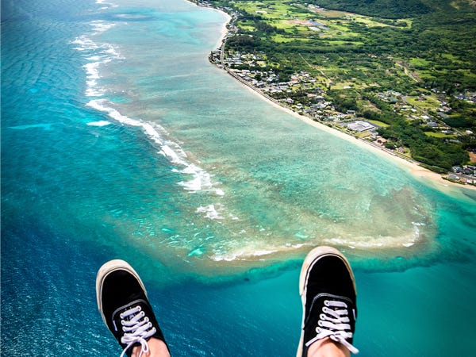
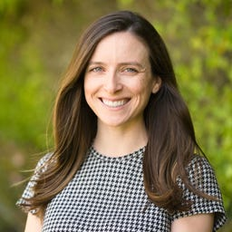

## The multi-millionaire founder of MySpace retired before he was 40 to travel the world — here are some of his most stunning photos

这位MySpace的百万富翁创始人不到40岁就退休了，准备周游世界--以下是他最令人惊叹的照片

Tom Anderson tells young people who want to travel, "Do it now! Don't wait."

Courtesy of Tom Anderson

汤姆·安德森告诉想要旅行的年轻人：“现在就去做！不要等。”汤姆·安德森提供

If you were a teenager with a computer in the early aughts, there's a good chance you had a profile on MySpace, the music-centered predecessor to Facebook.

如果你在早期是一个有电脑的青少年，你很有可能在MySpace上有个人资料，MySpace是Facebook以音乐为中心的前身。

Nearly [76 million people used](https://www.bloomberg.com/news/articles/2011-06-22/the-rise-and-inglorious-fall-of-myspace) the social networking site in the US at the height of its popularity in 2008, and they all had one thing in common: first "friend" Tom Anderson.

2008年，社交网站在美国人气最旺的时候，有近7600万人使用它，他们都有一个共同点：第一个“朋友”汤姆·安德森。

Anderson cofounded MySpace in August 2003 at just 32 years old, serving as the company's president. His now-iconic profile would default to every new user's friend list; his persona and the company [became ubiquitous.](https://www.theverge.com/2017/2/17/14647596/tom-from-myspace-profile-picture-twitter-instagram)

2003年8月，年仅32岁的安德森担任公司总裁，与他人共同创立了MySpace。他现在的标志性个人资料将默认为每个新用户的朋友列表；他的角色和公司变得无处不在。

In 2005, News Corp. [bought MySpace](https://www.nytimes.com/2005/07/18/business/news-corp-to-acquire-owner-of-myspacecom.html?_r=0) — then the largest social network in the world — and its parent company, Intermix, for $580 million. Anderson retired as a multi-millionaire in 2009, leaving MySpace behind to explore a passion for architecture and design.

2005年，新闻集团以5.8亿美元收购了当时世界上最大的社交网络MySpace及其母公司InterMix。安德森于2009年以千万富翁身份退休，离开了MySpace，开始探索对建筑和设计的热情。

"When I left the work world, I started designing my dream house," [he recently told the Red Bulletin](https://www.redbulletin.com/int/en/lifestyle/this-is-what-myspace-tom-is-doing-these-days). "I dived into architecture and bought seven vacant lots. My plan was to build one house, move in, and build the next. If the next was better, I'd move in and sell the previous one – so on and so forth."

“当我离开职场时，我开始设计我梦想中的房子，”他最近告诉《红色公报》。“我投身建筑业，买了7块空地。我的计划是建一栋房子，搬进来，再建一栋。如果下一栋更好，我会搬进来，卖掉前一栋--以此类推。”

Anderson only finished construction on the third home before an interest in photography took over. Since then, he's been traveling all over the world, moving between his three homes in Las Vegas, Los Angeles, and Hawaii to photograph landscapes and nature. He posts the best shots to his Instagram account, aptly named [@myspacetom](https://www.instagram.com/myspacetom/).

安德森在对摄影产生兴趣之前，才完成了第三套房子的建设。从那时起，他一直在世界各地旅行，在拉斯维加斯、洛杉矶和夏威夷的三个家之间移动，拍摄风景和自然。他在他的Instagram账户上发布了最好的照片，名字恰如其分地命名为@myspace etom。

Business Insider recently caught up with Anderson to learn more about his travels, how he defines retirement, and his advice for aspiring travelers.

商业内幕最近采访了安德森，了解了更多关于他的旅行，他如何定义退休，以及他对有抱负的旅行者的建议。

## When Anderson left MySpace, he was serious about retirement. "For years it literally meant no work — I just didn't want to spend one minute doing something for money," he told Business Insider.

当安德森离开MySpace时，他对退休是认真的。他在接受《商业内幕》采访时表示：“多年来，它的字面意思就是没有工作--我只是不想为了钱而花一分钟做点什么。”

 _Kauai. 考艾岛。_

## When he picked up photography in 2011 after an inspired trip to Burning Man, Anderson decided to maintain it as a hobby. "I haven't wanted to take commissions or sell my photos, or do anything commercial with it — that would just feel like work, which I don't want to do," he said.

2011年，在一次灵感四射的《燃烧的人》之旅之后，安德森开始了摄影之旅，他决定把摄影作为一种爱好。“我不想收取佣金或出售我的照片，也不想用它做任何商业活动--这只会让人感觉像是工作，而我不想做，”他说。

 _Bagan, Burma.  
缅甸蒲甘。_

## Instead, he travels for pleasure and to visit friends, choosing destinations mainly by thumbing through photos online. "Instagram has really changed the travel industry," he said.

相反，他旅行是为了娱乐和拜访朋友，主要通过在网上浏览照片来选择目的地。“Instagram真的改变了旅游业，”他说。

 _Zion National Park in Utah.  
犹他州锡安国家公园。_

## "People see a photo on Instagram and decide to go. It's that simple. Tourism has skyrocketed in photogenic places because of Instagram," Anderson said.

安德森说：“人们在Instagram上看到一张照片就决定去。就这么简单。因为Instagram，上镜的地方的旅游业迅速增长。”

 _Alberta, Canada.  
加拿大艾伯塔省。_

## Anderson says Iceland is a great example of Instagram's influence over the travel industry. "It's photogenic, and easy to photograph. The most amazing things are just right there on the side of the main highway. ... It's no coincidence that Iceland has gone from 100K visitors a year to millions of visitors in just a few 'internet' years!"

安德森说，冰岛是Instagram对旅游业影响的一个很好的例子。“它很上镜，很容易拍照。最令人惊叹的东西就在主干道的一侧……冰岛在短短几年内从每年10万游客增加到数百万游客，这并不是巧合！”

 _Iceland. 冰岛。_

## Anderson isn't much of a planner, usually booking hotels minutes before he's ready for bed. Occasionally, he'll camp, but "only when the shot requires it."

安德森不是一个很有计划的人，通常在他准备睡觉前几分钟就预订了酒店。偶尔，他也会露营，但“只有在拍摄需要的时候。”

_Angkor Wat in Cambodia.   
柬埔寨的吴哥窟。  
_

## "I tend to 'splurge' for convenience," Anderson said. "I'll pay a lot to not waste time. Time is the most important thing to me — how can you do all the things you want to do with such limited time. ... I'm hoping science of life extension makes progress."

安德森说：“我倾向于为了方便而‘挥霍’。”“为了不浪费时间，我会花很多钱。时间对我来说是最重要的--你怎么能在这么有限的时间里做所有你想做的事情……我希望延年益寿的科学能有所进步。”

_Hong Kong.  香港。_

## In the past year alone, Anderson has photographed sites in "Peru, Chile, Argentina, Bolivia, Hawaii, Japan, China, Canada, Alaska, Hawaii, and virtually every Northwest and Southwest state," he said.

仅在过去的一年里，安德森就拍摄了“秘鲁、智利、阿根廷、玻利维亚、夏威夷、日本、加拿大中国、阿拉斯加、夏威夷，以及几乎所有西北部和西南部各州的照片，”他说。

 _Guilin, China.  
桂林，中国。  
_

## Anderson says he typically uses pro-quality DSLRs to shoot his photos, but the brand doesn't really matter. "When people ask about my gear, I tell them not to worry too much about the camera," he said, adding that smart phones and second-hand cameras work just fine.

安德森说，他通常使用高质量的单反来拍摄照片，但品牌并不重要。“当人们问起我的设备时，我告诉他们不要太担心相机，”他说，并补充说，智能手机和二手相机工作得很好。

_Norway.  挪威。_

## To young people itching to travel, Anderson advises: "Do it now! Don't wait. If you have this inclination at all, it's only going to get more difficult and 'impossible' the more responsibilities you take on. Work and family commitments will put you in a position where it's very difficult to travel. Do it while you're young and it's so much easier."

对于渴望旅行的年轻人，安德森建议：“现在就去做！不要等待。如果你有这种倾向，你承担的责任越多，旅行只会变得越困难，越‘不可能’。工作和家庭的承诺会让你处于旅行非常困难的境地。趁你年轻的时候去旅行，这就容易多了。”

 _Uyuni, Bolivia.  
玻利维亚乌尤尼。_

Tanza is a CFP® professional and former correspondent for Personal Finance Insider. She broke down personal finance news and wrote about [taxes](https://www.businessinsider.com/personal-finance/taxes), [investing](https://www.businessinsider.com/personal-finance/what-are-the-best-investment-apps), [retirement](https://www.businessinsider.com/started-saving-for-retirement-early-recommend-compound-growth-2020-12), [wealth building](https://www.businessinsider.com/strategies-save-money-not-earning-enough-2020-11), and [debt management](https://www.businessinsider.com/millennial-couple-debt-payoff-strategies-2020-12). She helmed a biweekly [newsletter](http://newsletter.businessinsider.com/join/4np/personal-finance) and a [column](https://www.businessinsider.com/category/ask-financial-planner) answering reader questions about money.  Tanza is the author of two ebooks, [A Guide to Financial Planners](https://www.businessinsider.com/personal-finance/financial-planners-guide-business-insider-premium-2020-9) and "[The One-Month Plan to Master your Money](https://www.businessinsider.com/one-month-plan-master-your-money-free-e-book-2020-12)." In 2020, Tanza was the editorial lead on [Master Your Money](https://www.businessinsider.com/master-your-money), a yearlong original series providing financial tools, advice, and inspiration to millennials. Tanza joined Business Insider in June 2015 and is an alumna of Elon University, where she studied journalism and Italian. She is based in Los Angeles.

Read more

坦扎是CFP®专业人士，曾任《个人理财内幕》记者。她分析了个人财务新闻，并撰写了关于税收、投资、退休、财富积累和债务管理的文章。她主持了一份双周刊时事通讯和一个专栏，回答读者关于金钱的问题。Tanza是两本电子书的作者，《理财规划师指南》和《掌握金钱的一个月计划》。2020年，Tanza担任《掌握你的钱》(Master Your Money)的编辑主管，这是一个为期一年的原创系列，为千禧一代提供金融工具、建议和灵感。Tanza于2015年6月加入Business Insider，是埃隆大学的校友，在那里她学习了新闻学和意大利语。她常驻洛杉矶。

Read next  阅读下一页

[Features](https://www.businessinsider.com/category/features) [MySpace](https://www.businessinsider.com/category/myspace) [Your Money Travel](https://www.businessinsider.com/category/your-money-travel)

More...
