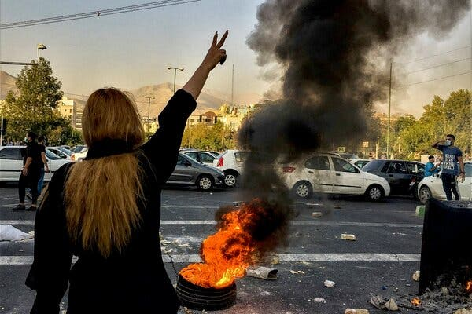
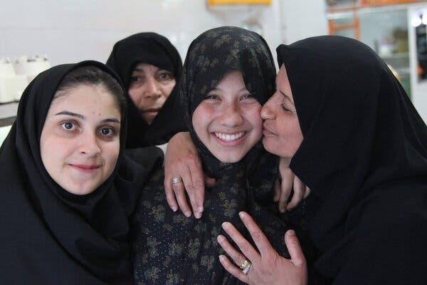

Nicholas Kristof  
尼古拉斯·克里斯托夫  

Credit...via Associated Press  
信用..。 通过美联社  

Sign up for the Opinion Today newsletter  Get expert analysis of the news and a guide to the big ideas shaping the world every weekday morning.

订阅《今日观点》时事通讯--每个工作日的早上，都可以获得新闻的专家分析，以及塑造世界的重大想法的指南。把它发送到你的收件箱。

One gauge of the hypocrisy of the Iranian regime is that there are credible reports that it is enforcing its supposedly strict moral code by arresting women and girls accused of advocating immodesty, and then sexually assaulting them.

衡量伊朗政权虚伪的一个标准是，有可信的报道称，伊朗正在通过逮捕被控倡导不谦虚的妇女和女孩，然后对她们进行性侵，来执行其本应严格的道德准则。

In [a searing report](https://www.cnn.com/interactive/2022/11/middleeast/iran-protests-sexual-assault/index.html) about the rape of protesters by security forces, CNN recounted how a 20-year-old woman was arrested for supposedly leading protests and later was brought by the police to a hospital in Karaj, shaking violently, head shaven, her rectum hemorrhaging. The woman is now back in prison.

在一篇关于安全部队强奸抗议者的尖锐报道中，CNN讲述了一名20岁的女子是如何因据称领导抗议活动而被捕，后来被警方带到卡拉吉的一家医院的，当时她剧烈颤抖，剃着头，直肠出血。这名女子现在又回到了监狱。

[Human Rights Watch](https://www.hrw.org/news/2022/11/03/iran-thousands-detained-protesters-and-activists-peril) and [Amnesty International](https://www.amnesty.org/en/latest/news/2022/09/iran-protester-killings-must-be-urgently-investigated-by-international-accountability-mechanism-says-amnesty-chief/) have independently documented multiple cases of sexual assault. Hadi Ghaemi of the [Center for Human Rights in Iran](https://iranhumanrights.org/), a watchdog organization in New York, told me of a 14-year-old girl from a poor neighborhood in Tehran who protested by taking off her head scarf at school.

人权观察和大赦国际独立记录了多起性侵犯案件。纽约监督组织伊朗人权中心的哈迪·盖米告诉我，德黑兰一个贫困社区的一名14岁女孩在学校摘下头巾表示抗议。

The girl, Masooumeh, was identified by school cameras and detained; soon afterward, she was taken to the hospital to be treated for severe vaginal tears. The girl died and her mother, after initially saying she wanted to go public, has disappeared.

这位名叫Masooumeh的女孩被学校的摄像头认出并被拘留；不久之后，她因严重的阴道撕裂被送往医院接受治疗。女孩去世了，她的母亲在最初说她想要公开之后，已经失踪了。

Accounts of sexual violence are difficult to verify because of the victims’ feelings of shame and fear, and CNN reported that the authorities sometimes film assaults to blackmail protesters into silence. What’s absolutely clear is that protesters keep turning up dead.

由于受害者的羞耻感和恐惧感，性暴力的描述很难得到证实，CNN报道称，当局有时会拍摄性侵事件，以勒索抗议者保持沉默。完全清楚的是，抗议者不断出现死亡。

Consider [Nika Shahkarami](https://www.cnn.com/2022/10/27/middleeast/iran-nika-shahkarami-investigation-intl-cmd/index.html), a 16-year-old girl who burned her head scarf in public. Security forces closed in on her. Days later, the authorities announced she had died. An autopsy reportedly found that her skull, pelvis, hip, arms and legs had been fractured.

以妮卡·沙赫卡拉米为例，她是一名16岁的女孩，在公共场合烧毁了自己的头巾。安全部队包围了她。几天后，当局宣布她已经死亡。据报道，尸检发现她的头骨、骨盆、臀部、手臂和腿都骨折了。

So the uprising across Iran isn’t just about head coverings. It’s about toppling a regime that is incompetent, corrupt, repressive and brutal.

因此，伊朗各地的起义不仅仅是头巾的问题。这是关于推翻一个无能、腐败、专制和残暴的政权。

“Should there be a government doing something wrong, the nation should punch it in the mouth,” Ayatollah Ruhollah Khomeini [declared](https://nsarchive.gwu.edu/document/28043-document-03-ayatollah-ruhollah-khomeini-address-nation-april-1-1979) in 1979 after the revolution he led established the Islamic Republic. That’s what Iranians are now trying to do.

1979年，在他领导的革命建立了伊斯兰共和国之后，阿亚图拉·鲁霍拉·霍梅尼在声明中说：“如果一个政府做错了什么，国家就应该打它的嘴巴。”这就是伊朗人现在正试图做的事情。

I’m surprised and disappointed that today’s grass-roots Iranian revolution hasn’t received more support in America and around the world. I think there are a couple of reasons for this.

我感到惊讶和失望的是，今天的伊朗草根革命并没有在美国和世界各地得到更多的支持。我认为这有几个原因。

First, Iran has barred most foreign reporters, so we don’t have television crews on the streets to record school kids risking their lives to take on regime thugs. Because we aren’t on the ground, I think we journalists collectively haven’t given this story the importance that it deserves.

首先，伊朗已经禁止了大多数外国记者，所以我们没有电视摄制组在街上记录学生冒着生命危险挑战政权暴徒。因为我们不在现场，我认为我们记者集体没有给予这篇报道应有的重视。

Second, there’s some American sourness toward Iranians, a misperception that they are fanatics chanting “Death to America.” In fact, at the people-to-people level, Iran may be the most pro-American country in the Middle East.

其次，美国人对伊朗人有些不满，误以为他们是高呼“美国去死”的狂热分子。事实上，在民间层面上，伊朗可能是中东地区最亲美的国家。

On one trip, I brought my daughter, who was 14 at the time. This is a glimpse of how she was treated, reflecting how thrilled ordinary Iranians are to meet Americans:

有一次，我带上了当时14岁的女儿。这是她受到的待遇的一瞥，反映出普通伊朗人见到美国人是多么兴奋：

Image

Caroline Kristof, center, in Iran in 2012.Credit...via Kristof family

卡洛琳·克里斯托夫，中，2012年在伊朗。 Via Kristof家族

I chatted [once](https://www.nytimes.com/2004/05/05/opinion/those-friendly-iranians.html) with a young Revolutionary Guard protecting an anti-American museum. Surrounded by huge banners denouncing America as the “Great Satan,” he asked me for advice about how to emigrate to the United States. “To hell with the mullahs,” he told me.

我曾与一名年轻的革命卫队聊过一次，他在保护一家反美博物馆。他被谴责美国是“大撒旦”的巨大横幅包围着，向我请教如何移民到美国。“让毛拉见鬼去吧，”他告诉我。

Fearless young girls are at the forefront of today’s protests. When a member of the Basij paramilitary force [spoke](https://www.bbc.com/news/world-middle-east-63143504) at one school, the girls pulled off their hijabs and heckled him. At a girls’ school in Karaj, students threw water bottles at an official and [chased](https://www.bloomberg.com/news/articles/2022-10-05/school-girls-join-iran-s-protests-as-classrooms-stage-rebellions) him out.

无所畏惧的年轻女孩站在今天抗议活动的最前线。当巴斯基准军事部队的一名成员在一所学校演讲时，女孩们摘下头巾，质问他。在Karaj的一所女子学校，学生们向一名官员投掷水瓶，并将他赶走。

The United States and other governments are speaking up, and Iranians are grateful. [Nasrin Sotoudeh](https://www.frontlinedefenders.org/en/profile/nasrin-sotoudeh), an Iranian human rights lawyer now on medical furlough from a 10-year prison sentence (reduced from 38.5 years and 148 lashes), told me that she particularly appreciated the [ejection of Iran](https://www.nytimes.com/2022/12/14/world/middleeast/iran-un-womens-rights-vote.html) from a United Nations commission on women’s rights. But Sotoudeh and others would like the Biden administration to do more to delegitimize the Iranian government and criticize executions, and she calls on Western governments that have embassies in Iran to recall their ambassadors.

美国和其他国家的政府都在发声，伊朗人对此心存感激。伊朗人权律师纳斯林·索图德(Nasrin Sooudeh)目前正在休病假，她被判处10年监禁(从38.5年监禁和148下鞭刑减少)，她告诉我，她特别欣赏联合国妇女权利委员会将伊朗排除在外。但索图德和其他人希望拜登政府采取更多行动，使伊朗政府合法化，并批评处决，她呼吁在伊朗设有大使馆的西方国家政府召回大使。

“The Biden administration hasn’t done enough,” said [Tala Raassi](https://talaraassi.com/), an Iranian-American fashion designer who knows firsthand the brutality of the regime: At 16, she was [arrested and given 40 lashes](https://www.marieclaire.com/politics/a4492/tala-raassi-punishment-iran/) for wearing a T-shirt and miniskirt at a private party.

“拜登政府做得还不够，”伊朗裔美国时装设计师塔拉·拉西(Tala Raassi)说。她亲身体会到拜登政权的残暴：16岁时，她因在私人派对上穿T恤和迷你裙而被捕，并被鞭打40下。

I’d like to see Biden work with other countries to raise the volume of international, top-level outrage at the repression.

我希望看到拜登与其他国家合作，提高国际社会高层对镇压的愤怒程度。

“Just as Kennedy delivered his ‘Ich bin ein Berliner’ speech and Reagan his ‘Mr. Gorbachev, tear down this wall’ speech, Biden could signal American resolve with an ‘Ayatollah, open the gates of Evin prison, free Iran’ speech,” suggested [Amir Soltani](http://www.amirsoltani.org/), an Iranian-American writer.

伊朗裔美国作家阿米尔·索尔塔尼表示：“就像肯尼迪发表了‘我在柏林’的演讲，里根发表了‘戈尔巴乔夫先生，推倒这堵墙’的演讲一样，拜登可以用‘阿亚图拉’来表明美国的决心，打开埃文监狱的大门，解放伊朗。”

The West can also try to ramp up targeted sanctions on officials and their family members who party abroad or funnel assets overseas. Meanwhile, the intelligence community should be spying more on Iran’s mass repression — and leaking information, where possible, to hold the country’s authorities accountable.

西方还可以尝试加大对在国外聚会或将资产转移到海外的官员及其家人的有针对性的制裁。与此同时，情报界应该对伊朗的大规模镇压进行更多的间谍活动，并在可能的情况下泄露信息，以追究伊朗当局的责任。

Pressuring Iran is difficult, for it is already isolated and heavy sanctions have already been imposed on it. But we must try because Iran is now beginning its next phase: It has begun executing protesters to try to terrify the population into surrender. Two protesters are known to have been [hanged](https://www.nytimes.com/2022/12/12/world/middleeast/iran-protests-execution.html) so far, and at least [35 others](https://iranhumanrights.org/2022/12/irans-courts-using-death-penalty-charges-to-crush-protests/) have either been sentenced to death or are being held on capital charges.

向伊朗施压是困难的，因为它已经被孤立，而且已经受到了严厉的制裁。但我们必须尝试，因为伊朗现在正在开始其下一阶段：它已经开始处决抗议者，试图恐吓民众投降。到目前为止，已知有两名抗议者被绞死，另有至少35人被判处死刑或因死刑指控被关押。

In 1978, as Khomeini’s revolution gathered steam, The Times [quoted](https://www.nytimes.com/1978/12/11/archives/stern-symbol-of-opposition-to-the-shah-ruhollah-khomeini-man-in-the.html?timespastHighlight=Ayatollah,Khomeini?timespastHighlight=Ayatollah,Khomeini?timespastHighlight=Ayatollah,Khomeini) an Iranian lawyer with prescient misgivings: “I hope we don’t climb out of a ditch,” he said, “only to fall into a well.”

1978年，当霍梅尼的革命愈演愈烈时，《纽约时报》引用了一名伊朗律师的先见之明：“我希望我们不会爬出沟去，结果掉进了井里。”

More than four decades later, Iranians are desperately trying to pull themselves out of that well, led by schoolgirls who persevere despite the threat of arrests, torture and execution. They understand that gross immorality lies not in a girl’s uncovered hair but in the government that rapes her for it, and they should receive far more international support.

40多年后，伊朗人在女学生的带领下，拼命试图摆脱困境，尽管面临逮捕、酷刑和处决的威胁，她们仍然坚持不懈。他们明白，严重的不道德行为不在于女孩裸露的头发，而在于强奸她的政府，他们应该得到更多的国际支持。

_The Times is committed to publishing_ [_a diversity of letters_](https://www.nytimes.com/2019/01/31/opinion/letters/letters-to-editor-new-york-times-women.html) _to the editor. We’d like to hear what you think about this or any of our articles. Here are some_ [_tips_](https://help.nytimes.com/hc/en-us/articles/115014925288-How-to-submit-a-letter-to-the-editor)_. And here’s our email:_ [_letters@nytimes.com_](mailto:letters@nytimes.com)_._

《泰晤士报》致力于发表给编辑的各种信件。我们想听听您对这篇文章或我们的任何一篇文章的看法。以下是一些小贴士。这是我们的电子邮件：Letters@nytimes.com。

Nicholas Kristof joined The New York Times in 1984 and has been a columnist since 2001. He has won two Pulitzer Prizes, for his coverage of China and of the genocide in Darfur. You can follow him on [Instagram](https://www.instagram.com/nickkristof/) and [Facebook](https://www.facebook.com/kristof). [His latest book](https://www.penguinrandomhouse.com/books/588999/tightrope-by-nicholas-d-kristof-and-sheryl-wudunn/) is “Tightrope: Americans Reaching for Hope.”  [@NickKristof](https://twitter.com/NickKristof) • [Facebook](https://www.facebook.com/kristof)

尼古拉斯·克里斯托夫于1984年加入《纽约时报》，自2001年以来一直是一名专栏作家。他因报道中国和达尔富尔种族灭绝事件而两次获得普利策奖。你可以在Instagram和Facebook上关注他。他的最新著作是《走钢丝：美国人寻求希望》。@NickKristof·Facebook

A version of this article appears in print on Dec. 18, 2022, Section SR, Page 3 of the New York edition with the headline: Iran Uses Rape to Enforce Women’s Modesty. [Order Reprints](https://www.parsintl.com/publication/the-new-york-times/) | [Today’s Paper](https://www.nytimes.com/section/todayspaper) | [Subscribe](https://www.nytimes.com/subscriptions/Multiproduct/lp8HYKU.html?campaignId=48JQY)
