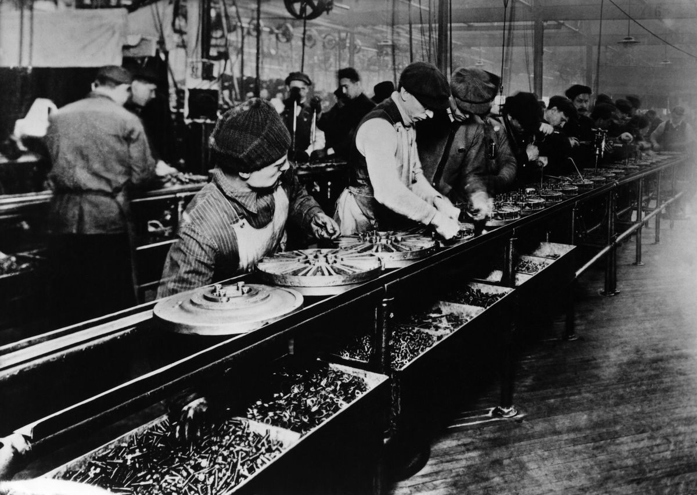
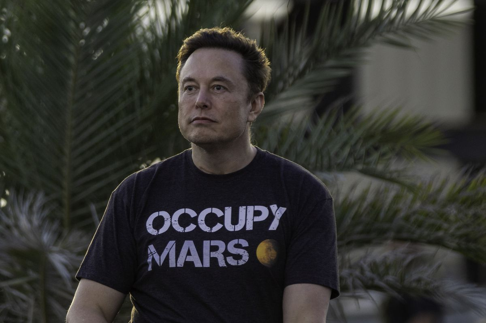

Since the launch of [the so-called “Twitter Files”](https://nymag.com/intelligencer/2022/12/twitter-files-explained-elon-musk-taibbi-weiss-hunter-biden-laptop.html) — Elon Musk’s self-styled exposé of the alleged excesses of the “woke” managers of Twitter before he bought it — there’s been a lively debate over what exactly Musk is trying to accomplish.

所谓的“推特文件”是埃隆·马斯克自封的对推特“觉醒”管理人员在收购前的过度行为的揭露。自那以来，关于马斯克到底想要达到什么目的，一直存在激烈的争论。

His statements clearly indicate that he sees himself as being engaged in some kind of culture war — “The woke mind virus is either defeated or nothing else matters,” [as he tweeted on Monday morning](https://twitter.com/elonmusk/status/1602278477234728960). But what does the highly public censure of Twitter’s previous management team have to do with fighting the “woke mind virus”?

他的声明清楚地表明，他认为自己正在进行某种文化战争--正如他周一上午在推特上所说的那样，“唤醒心灵的病毒要么被击败，要么其他一切都不重要了。”但是，对Twitter前管理团队的高调公开指责与抗击“唤醒心灵病毒”有什么关系？

To understand how Musk sees the connection, it’s helpful to look at [a recent tweet from Antonio García Martínez](https://twitter.com/antoniogm/status/1593606745955348481), a writer who’s very plugged into the world of right-leaning Silicon Valley founders. García Martínez describes a project that looks something like reverse class warfare: the revenge of the capitalist class against uppity woke managers at their companies.

为了理解马斯克如何看待两者之间的联系，看看安东尼奥·加西亚·马丁内斯最近发布的一条推文是有帮助的。马丁内斯是一名作家，非常热衷于硅谷右倾创始人的世界。加西亚·马丁内斯描述了一个看起来有点像反向阶级斗争的项目：资本主义阶级对傲慢的报复唤醒了他们公司的经理们。

“What Elon is doing is a revolt by entrepreneurial capital against the professional-managerial class regime that otherwise everywhere dominates (including and especially large tech companies),” García Martínez writes.

加西亚·马丁内斯写道：“埃隆的所作所为是创业资本对专业管理阶层制度的反抗，否则这种制度在任何地方都占主导地位(包括尤其是大型科技公司)。”

On the face of it, this seems absurd: Why would billionaires who own entire companies need to “revolt” against anything, let alone their own employees? To explain, García Martínez [cites a book](https://twitter.com/antoniogm/status/1593608629763985408) by conservative political theorist James Burnham: [_The Managerial Revolution: What Is Happening in the World_](https://www.amazon.com/Managerial-Revolution-What-Happening-World/dp/0837156785?ascsubtag=[]vx[p]23269352[t]w[r]i.buzzing.cc[d]D).

从表面上看，这似乎是荒谬的：拥有整个公司的亿万富翁为什么要对任何事情“反抗”，更不用说他们自己的员工了？为了解释，加西亚·马丁内斯引用了保守派政治理论家詹姆斯·伯纳姆的一本书：管理革命：世界上正在发生的事情。

Published in 1941, Burnham’s book predicted that capitalism had reached a terminal stage; the capitalist class’s power would soon decline, giving way to the rise of the “managerial class” — people who direct industry and the complex operations of the state. His examples of this new state were Nazi Germany and Soviet Russia, which Burnham believed to be rooted in a more efficient economic model than liberal capitalism. For this reason, he predicted [a Nazi victory in World War II was all but inevitable](https://www.orwellfoundation.com/the-orwell-foundation/orwell/essays-and-other-works/second-thoughts-on-james-burnham/).

伯纳姆在1941年出版的这本书中预言，资本主义已经走到了尽头；资产阶级的力量将很快衰落，取而代之的是“管理阶层”的崛起--管理阶层是指导工业和国家复杂运作的人。他的例子是纳粹德国和苏联，伯纳姆认为这两个国家植根于比自由资本主义更有效率的经济模式。出于这个原因，他预测纳粹在第二次世界大战中的胜利几乎是不可避免的。

Burnham’s predictions were wildly wrong, in ways that should cast significant doubt on the viability of his entire theory of “the managerial revolution.” But his conceptualization of an unaccountable managerial class has nonetheless been extremely influential in the right-leaning tech world and in the broader conservative intellectual firmament.

伯纳姆的预测大错特错，这让人对他的整个“管理革命”理论的可行性产生了极大的怀疑。尽管如此，他对不负责任的管理阶层的概念在右倾的科技界和更广泛的保守派知识分子中仍具有极大的影响力。

Marc Andreessen, a leading tech venture capitalist, [called Burnham’s work](https://a16z.com/2022/10/04/what-ive-been-up-to-lately/) “the best explanation for the current structure of our society and politics.” [Julius Krein](https://americanaffairsjournal.org/2017/02/james-burnhams-managerial-elite/), a leading conservative policy intellectual, wrote that Burnham was “enjoying something of a revival” because “[David Brooks](http://www.nytimes.com/2016/03/01/opinion/the-movement-mentality.html?_r=0), [Ross Douthat](http://www.nytimes.com/2016/10/26/opinion/campaign-stops/what-the-rights-intellectuals-did-wrong.html), and [Matthew Continetti](https://www.washingtonexaminer.com/weekly-standard/the-managers-vs-the-managed), among others, have recently pointed to his work as essential to understanding the current political moment.”

领先的科技风险投资家马克·安德森称伯纳姆的工作“是对当前社会和政治结构的最好解释”。著名的保守派政策知识分子朱利叶斯·克莱因写道，伯纳姆“正在享受某种复兴”，因为“大卫·布鲁克斯、罗斯·杜塔特和马修·康托莱蒂等人最近指出，他的工作对于理解当前的政治时刻至关重要。”

So, while Burnham’s work got some big things wrong, it’s still worth taking seriously. In many ways, he’s the progenitor of the right’s current cultural obsessions with so-called “[woke managers](https://www.city-journal.org/wokeness-the-highest-stage-of-managerialism)” — and the godfather of the approach to politics that Musk has spent $44 billion advancing.

因此，尽管伯纳姆的工作犯了一些重大错误，但它仍然值得认真对待。在许多方面，他都是当前右翼对所谓“觉醒的经理人”的文化痴迷的鼻祖，也是马斯克花费440亿美元推进的政治方法的教父。

### Who is James Burnham, and what is the managerial revolution?  
詹姆斯·伯纳姆是谁，什么是管理革命？  

Burnham, born in 1905, began political life as a Marxist of the [Trotskyite persuasion](https://www.bbc.com/news/uk-politics-37025649) — but would decisively break with this tradition and become a stalwart of the American right. After [Burnham’s death in 1987](https://www.washingtonpost.com/archive/local/1987/07/31/james-burnham-82-national-review-editor/6eec0cfe-2bdc-4122-9a82-b5139f78b8fe/), then-President Ronald Reagan said that he was “one of those principally responsible for the great intellectual odyssey of our century — the journey away from totalitarian statism and toward the uplifting doctrines of freedom.”

出生于1905年的伯纳姆以托洛茨基教义的马克思主义者的身份开始了政治生涯--但他果断地打破了这一传统，成为美国右翼的坚定拥护者。1987年伯纳姆去世后，时任总统罗纳德·里根表示，他“是我们这个世纪伟大的知识分子之旅的主要责任人之一--从极权主义的国家主义走向振奋人心的自由学说的旅程。”

_The Managerial Revolution_, one of Burnham’s earliest and most influential works, shows signs of both his youthful Marxism and his later turn toward anti-communist conservatism. It begins with the very Marxist idea that history is, at root, a story of conflicting social groups struggling for control over a society’s wealth and means of production.

《管理革命》是伯纳姆最早和最有影响力的著作之一，它既显示了他年轻的马克思主义，也显示了他后来转向反共产主义保守主义的迹象。它始于一个非常马克思主义的观点，即历史从根本上讲是一个相互冲突的社会群体为控制一个社会的财富和生产资料而斗争的故事。

“It is a historical law, with no apparent exceptions so far known, that all social and economic groups of any size strive to improve their relative position with respect to power and privilege in society,” he writes.

他写道：“任何规模的社会和经济团体都在努力改善它们在社会中的权力和特权的相对地位，这是一条历史规律，迄今还没有明显的例外。”

Burnham also concurred with Marxists that the capitalist class would inevitably lose the contemporary iteration of this struggle — but disagreed about who would win it. In his view, the working class was too weak and disorganized to overthrow the capitalists in the way that Marxist theory predicted. Instead, he argues, a new group was rising: the managerial class.

伯纳姆还同意马克思主义者的观点，即资产阶级将不可避免地输掉这场斗争的当代迭代--但对谁会赢得这场斗争存在分歧。在他看来，工人阶级太软弱，太没有组织，不能像马克思主义理论预测的那样推翻资本家。相反，他认为，一个新的群体正在崛起：管理阶层。

Managers, in Burnham’s definition, are the people responsible for “the tasks of the technical direction and coordination of the process of production.” This does not mean technical experts, like chemists or architects, but the people that direct these technical experts: “operating executives, superintendents, administrative engineers, supervisory technicians; or, in government ... administrators, commissioners, bureau heads, and so on.”

在伯纳姆的定义中，经理是负责“生产过程的技术指导和协调任务”的人。这不是指化学家或建筑师等技术专家，而是指指导这些技术专家的人：“运营主管、主管、行政工程师、监督技术人员；或者，在政府中……行政人员、专员、局长等等。

The managerial class’s growing strength stems from two elements of the modern economy: its technical complexity and its scope. Because the tasks needed to manage the construction of something like an automobile require very specific technical knowledge, the capitalist class — the factory’s owners, in this example — can’t do everything on their own. And because these tasks need to be done at scale given the sheer size of a car company’s consumer base, its owners need to employ others to manage the people doing the technical work.

管理阶层日益壮大的实力源于现代经济的两个要素：技术的复杂性和范围。因为管理像汽车这样的东西的建造所需的任务需要非常具体的技术知识，资产阶级--在这个例子中是工厂的所有者--不能独立完成所有的事情。考虑到汽车公司庞大的消费者基础，这些任务需要大规模完成，因此其所有者需要雇佣其他人来管理从事技术工作的人员。

 

The first assembly line at Ford’s Highland Park factory in 1913.

Ullstein Bild via Getty Images

1913年，福特高地公园工厂的第一条装配线。乌尔斯坦画报通过Getty Images

As a result, the capitalists have unintentionally made themselves irrelevant: It is the managers who actually control the means of production. While managers may in theory still be employed by the capitalist class, and thus subject to their orders, this is an unsustainable state of affairs: Eventually, the people who actually control the means of production will seize power from those who have it in name only.

结果，资本家无意中让自己变得无关紧要：实际上控制生产资料的是管理者。虽然从理论上讲，管理人员可能仍然受雇于资产阶级，因而服从于他们的命令，但这是一种不可持续的状态：最终，实际控制生产资料的人将从名义上拥有生产资料的人手中夺取权力。

How would this happen? Mainly, through nationalization of major industry.

这怎么会发生呢？主要是通过对主要行业进行国有化。

“An economic structure based upon state ownership of production provides the framework for the social domination of the managers,” he writes. “It must also be noticed that this apparently is the _only_ economic structure through which the social domination of the managers can be consolidated.”

他写道：“基于生产国有制的经济结构为管理者的社会支配提供了框架。”“还必须注意到，这显然是唯一一种可以巩固经理人的社会支配地位的经济结构。”

Given the complexity and scale of modern economic tasks, Burnham argues, it is simply more efficient for the state to take over from individual capitalists. Nazi Germany and the Soviet Union, with their state-directed economies, provided a blueprint that the rest of the world would soon follow. The United States hadn’t made the leap, but the rise of the administrative state after the New Deal proved it was heading there.

伯纳姆认为，考虑到现代经济任务的复杂性和规模，国家从个人资本家手中接管更有效率。纳粹德国和苏联凭借其国家主导的经济，提供了一幅世界其他国家很快就会效仿的蓝图。美国还没有实现这一飞跃，但新政后行政国家的崛起证明了它正在朝着这一方向发展。

Hence, “the managerial revolution”: the inevitable decline of capitalist democracy and the rise of a new social regime defined by managerial control of the economy using “the unlimited state” as a vehicle.

因此，“管理革命”：资本主义民主不可避免的衰落，以及一种新的社会制度的兴起，其定义是以“无限国家”为载体对经济进行管理控制。

### How James Burnham explains Elon Musk and the right’s obsessions  
詹姆斯·伯纳姆如何解释埃隆·马斯克和右翼的痴迷  

At first blush, Burnham’s theory is not an especially promising candidate for explaining the world today.

乍一看，伯纳姆的理论并不是解释当今世界的一个特别有前途的候选者。

Virtually all of _The Managerial Revolution’s_ major predictions — the coming collapse of capitalism, an Axis victory in World War II, the superior efficiency of state-run enterprises — were proven wrong. The power of the capitalist class has become more entrenched since the neoliberal revolution of the 1970s and ’80s and attendant skyrocketing inequality. The rise of tech capitalism, with firms founded by individual innovators and technical experts, seems to disprove his theory that capitalists cannot themselves perform technical and management tasks at scale.

事实上，管理革命的所有主要预测--资本主义即将崩溃、轴心国在第二次世界大战中取得胜利、国有企业的卓越效率--都被证明是错误的。自20世纪70年代和80年代的新自由主义革命以及随之而来的不平等飙升以来，资产阶级的权力变得更加根深蒂固。随着科技资本主义的兴起，由个人创新者和技术专家创建的公司似乎反驳了他的理论，即资本家自己不能大规模执行技术和管理任务。

Yet Burnham’s early thought has in fact experienced a renaissance of late, including in unexpected quarters: the right-leaning titans of Silicon Valley and allied political thinkers. Why?

然而，伯纳姆早期的思想实际上在最近经历了复兴，包括在意想不到的领域：硅谷的右倾巨头和联合的政治思想家。为什么？

The answer, in brief, is the culture war. The right’s new Burnhamites have revived his theory of managers as a distinct social class — the one, in their view, most responsible for imposing the malign ideology of “wokeness” on the American public.

简而言之，答案就是文化战争。右翼的新伯恩哈米特人重振了他的理论，即经理人是一个独特的社会阶层--在他们看来，这个阶层最应该对将“清醒”的恶毒意识形态强加给美国公众负责。

“Woke managers want to impose a new political and social order,” [Malcom Kyeyune argues in City Journal](https://www.city-journal.org/wokeness-the-highest-stage-of-managerialism), a publication of the right-wing Manhattan Institute. “Wokeness has accomplished what New Dealism never set out to do in the 1940s: it serves as a comprehensive, flexible, and ruthless ideology that can justify almost any act of institutional subversion and overreach.”

马尔科姆·凯尤恩在右翼曼哈顿研究所出版的《城市杂志》上写道：“觉醒的管理者想要强加一种新的政治和社会秩序。”《觉醒》完成了20世纪40年代新神学从未打算做的事情：它是一种全面、灵活和无情的意识形态，可以为几乎任何机构颠覆和越权的行为辩护。

Modern Burnhamites have come to see their most fundamental enemy not so much as the Democratic Party but as a series of institutions that they believe have been fully captured by this ideology: academia, Hollywood, the media, and (for some) Big Tech. These institutions make up what Curtis Yarvin, [a Silicon Valley entrepreneur and anti-democratic political theorist](https://www.vox.com/policy-and-politics/23373795/curtis-yarvin-neoreaction-redpill-moldbug), calls “the Cathedral”: America’s true power elite, one that uses its cultural hegemony to impose far-left values on everyone else. (Yarvin, not coincidentally, is [deeply influenced by Burnham](https://www.stitcher.com/show/the-chris-buskirk-show/episode/through-the-gray-mirror-talking-about-the-future-with-curtis-yarvin-78204325).)

现代的伯恩哈米特人已经开始看到他们最根本的敌人，而不是民主党，而是他们认为已经完全被这种意识形态俘获的一系列机构：学术界、好莱坞、媒体，以及(对一些人来说)大型科技公司。这些机构构成了硅谷企业家、反民主政治理论家柯蒂斯·亚文所说的“大教堂”：美国真正的权力精英，他们利用自己的文化霸权将极左翼价值观强加给其他所有人。(并非巧合的是，亚文深受伯纳姆的影响。)

The brute reality of economic inequality creates some difficulty for this theory. In today’s America, the billionaire class has far more power to shape society than random university professors or even most celebrities. Their sheer wealth allows right-wing billionaires like Musk and Peter Thiel to do things, like purchase Twitter or [shut down Gawker](https://www.theatlantic.com/business/archive/2018/02/hogan-thiel-gawker-trial/554132/) or [bankroll a Senate campaign](https://www.politico.com/news/2022/05/03/jd-vance-win-ohio-primary-00029881), that are unthinkable for 99.999 percent of Americans. When these people exist, it seems implausible to describe the Harvard faculty office or Twitter Trust and Safety team as the true loci of social power.

经济不平等的残酷现实给这一理论带来了一些困难。在今天的美国，亿万富翁阶层塑造社会的力量远远超过随机的大学教授甚至大多数名人。他们的巨额财富让马斯克和彼得·泰尔等右翼亿万富翁能够做一些对99.999的美国人来说是不可想象的事情，比如收购推特、关闭Gawker或资助参议员竞选活动。当这些人存在时，将哈佛大学教职员工办公室或Twitter信托与安全团队描述为真正的社会权力中心似乎是不可信的。

Burnham’s theory helps the modern right square this circle. If power is increasingly moving away from capitalists and toward the managers they employ, then it’s totally coherent for even the wealthiest people in the country to see themselves as victims of a “woke mind virus” infecting middle and upper management. This is how you get the odd spectacle of people like Musk deploring alleged censorship perpetrated by their own companies: They see their staff not as subordinates whose conduct is an internal company matter, but as rivals in the struggle for power who must be defeated.

伯纳姆的理论帮助现代右翼摆正了这个圈子。如果权力越来越多地从资本家转向他们雇佣的管理者，那么即使是这个国家最富有的人也会完全一致地认为自己是感染中高层管理人员的“觉醒思维病毒”的受害者。这就是为什么你会看到像马斯克这样的人谴责自己公司所谓的审查制度的奇怪场面：他们将员工视为必须被击败的权力斗争中的竞争对手，而不是行为属于公司内部事务的下属。

 

Elon Musk at a T-Mobile/SpaceX event in Boca Chica Beach, Texas, on August 25.

Michael Gonzalez/Getty Images

8月25日，在德克萨斯州博卡奇卡海滩，埃隆·马斯克在T-Mobile/SpaceX活动上。迈克尔·冈萨雷斯/盖蒂图片公司

“In Burnham’s formulation, this new managerial class would supplant the former business-owning bourgeois and even capital itself as the elite ruling class,” García Martínez writes. “Most woke ‘labor’ scandals in tech are an entitled middle-management class at odds with founders.”

加西亚·马丁内斯写道：“在伯纳姆的描述中，这个新的管理阶层将取代以前拥有商业的资产阶级，甚至是资本本身，成为精英统治阶级。”“大多数被唤醒的科技业‘劳工’丑闻都是名副其实的中层管理阶层，与创始人意见相左。”

The Burnham of 1941 likely would not have agreed with this analysis. In his view, the managerial revolution could never take place as long as capitalists still owned the corporations where they worked — that the right cannot coherently adopt his theory of a managerial revolution while jettisoning the underlying material analysis.

1941年的伯纳姆可能不会同意这种分析。在他看来，只要资本家仍然拥有他们工作的公司，管理革命就永远不会发生--右翼人士不能在抛弃基本材料分析的同时，连贯地采用他的管理革命理论。

“Within capitalist society the power of the managers is... interfered with, limited by the capitalists and by capitalist economic relations,” he writes. “The manager is never secure. He can always be fired by someone or some group of persons possessing capitalist ownership rights.”

“在资本主义社会中，管理者的权力是……受到了资本家和资本主义经济关系的干扰和限制。“主教练从来都不安全。他总是可以被某个拥有资本主义所有权的人或某一群人解雇。

The real lesson of Musk’s ownership of Twitter is that this remains true today.

马斯克拥有Twitter的真正教训是，这一点在今天仍然是正确的。

### _You've read 2 articles in the last 30 days.  
在过去的30天里，你已经阅读了2篇文章。  
_

**[Help us reach our year-end goal](http://vox.com/pages/support-now?itm_campaign=Year-end-goal-eoy-22&itm_medium=site&itm_source=article-footer%20)  
帮助我们实现年终目标  
**

In a recent reader survey, we were delighted to hear that people value Vox because we help them educate themselves and their families, spark their curiosity, explain the moment, and make our work approachable.

在最近的一次读者调查中，我们很高兴听到人们重视Vox，因为我们帮助他们教育自己和他们的家人，激发他们的好奇心，解释这一时刻，并使我们的工作变得平易近人。

We believe that everyone deserves access to clear, factual information that helps them educate themselves on the issues of the day and the things that pique their curiosity. That's why we're committed to keeping Vox free.

我们认为，每个人都有权获得清楚、真实的信息，帮助他们就当今的问题和激发他们好奇心的事情进行自我教育。这就是我们致力于保持Vox免费的原因。

Reader gifts enable us to offer free articles, videos, and podcasts to everyone, while relying less on advertising. In service of that mission, we're aiming to add 3,000 new gifts from readers by December 31.[Will you help us reach our goal, and continue to keep Vox free, by making a gift today?](http://vox.com/pages/support-now?itm_campaign=Year-end-goal-eoy-22&itm_medium=site&itm_source=article-footer)

读者礼物使我们能够向每个人提供免费的文章、视频和播客，同时减少对广告的依赖。为了履行这一使命，我们的目标是在12月31日之前从读者那里添加3000份新礼物。你会帮助我们实现目标，并继续保持Vox免费，今天就做一份礼物吗？

$95/year

$120/year

$250/year

Other

[Yes, I'll give $120/year

  
好的，我出120美元 /年](https://vox.memberful.com/checkout?plan=81108&referrer=https%3A%2F%2Ft.co%2F)

We accept credit card, Apple Pay, and Google Pay. You can also contribute via

我们接受信用卡、Apple Pay和Google Pay。您也可以通过以下方式投稿

