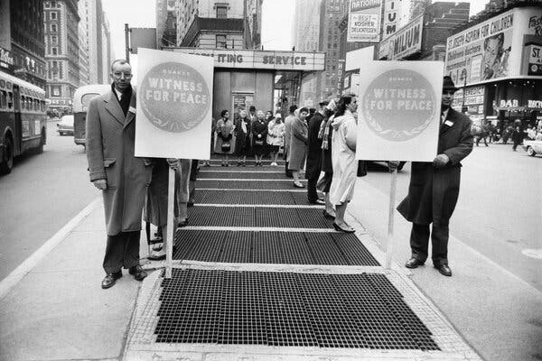

Ezra Klein  埃兹拉·克莱因

Dec. 11, 2022  
2022 年 12 月 11 日

Quakers at a prayer vigil in front of the armed forces recruitment booth in Times Square in 1961. The Quaker way has a lot to teach us about social media.Credit...Allyn Baum/The New York Times

1961 年，贵格会在时代广场武装部队征兵亭前守夜祈祷。贵格会教给我们很多关于社交媒体的知识。信用... Allyn Baum/纽约时报

Sign up for the Opinion Today newsletter  Get expert analysis of the news and a guide to the big ideas shaping the world every weekday morning.

For what feels like ages, we’ve been told that Twitter is, or needs to be, the world’s town square. That was Dick Costolo’s line in 2013, when he was Twitter’s chief executive (“We think of it as the global town square”), and Jack Dorsey, one of Twitter’s founders, used it, too, in 2018 (“People use Twitter as a digital public square”). Now the line comes from the “chief twit,” Elon Musk (“The reason I acquired Twitter is because it is important to the future of civilization to have a common digital town square”).

多年来，我们一直被告知 Twitter 是或需要成为世界的城市广场。这是 Dick Costolo 在 2013 年担任 Twitter 首席执行官时的台词（“我们认为它是全球城市广场”），而 Twitter 的创始人之一 Jack Dorsey 在 2018 年也使用了它（“人们使用 Twitter 作为数字公共广场”）。现在这句话来自“首席智者”埃隆马斯克（“我收购 Twitter 的原因是因为拥有一个共同的数字城市广场对文明的未来很重要”）。

This metaphor is wrong on three levels.  
这个比喻在三个层面上是错误的。

First, there isn’t, can’t be and shouldn’t be a “global town square.” The world needs many town squares, not one. Public spaces are rooted in the communities and contexts in which they exist. This is true, too, for Twitter, which is less a singular entity than a digital multiverse. What Twitter is for [activists in Zimbabwe](https://www.wired.com/story/musk-denial-true-cost-twitter-implosion/) is not what it is for gamers in Britain.

首先，没有、不能也不应该是“全球城市广场”。世界需要许多城镇广场，而不是一个。公共空间植根于它们所在的社区和环境。对于 Twitter 来说也是如此，它与其说是一个单一的实体，不如说是一个数字多元宇宙。 Twitter 对津巴布韦活动家的意义与对英国游戏玩家的意义不同。

Second, town squares are public spaces, governed in some way by the public. That is what makes them a town square rather than a square in a town. They are not the playthings of whimsical billionaires. They do not exist, as Twitter did for so long, to provide returns to shareholders. (And as wild as Musk’s reign has already been, remember that he tried to back out of this deal, and Twitter’s leadership, knowing he neither wanted the service nor would treat it or its employees with care, [forced it through](https://www.nytimes.com/2022/07/13/business/dealbook/elon-musk-twitter-lawsuit.html) to ensure that executives and shareholders got their payout.) A town square controlled by one man isn’t a town square. It’s a storefront, an art project or possibly a game preserve.

其次，城镇广场是公共空间，以某种方式由公众管理。这就是使它们成为城镇广场而不是城镇广场的原因。它们不是异想天开的亿万富翁的玩物。它们的存在并不像 Twitter 长期以来所做的那样，是为了向股东提供回报。 （尽管马斯克的统治已经变得疯狂，但请记住，他曾试图退出这笔交易，而 Twitter 的领导层知道他既不想要这项服务，也不会谨慎对待它或它的员工，迫使它通过，以确保高管和股东得到了他们的报酬。）一个人控制的城镇广场不是城镇广场。它是一个店面、一个艺术项目或可能是一个游戏保护区。

Third, what matters for a polity isn’t the mere existence of a town square but the condition the townspeople are in when they arrive. Town squares can host debates. They can host craft fairs. They can host brawls. They can host lynchings. Civilization does not depend on a place to gather. It depends on what happens when people gather.

第三，对于一个政体而言，重要的不仅仅是城镇广场的存在，而是城镇居民到达时所处的状况。城镇广场可以举办辩论会。他们可以举办手工艺品展览会。他们可以举办斗殴。他们可以主持私刑。文明不依赖于聚集的地方。这取决于人们聚集时会发生什么。

So much genius and trickery and money have gone into a mistaken metaphor. The competition to create and own the digital square may be good business, but it has led to terrible politics. Think of the hopeful imaginings that accompanied the early days of social media: We would know one another across time and space; we would share with one another across cultures and generations; we would inform one another across borders and factions. Billions of people use these services. Their scale is truly civilizational. And what have they wrought? Is the world more democratic? Is G.D.P. growth higher? Is innovation faster? Do we seem wiser? Do we seem kinder? Are we happier? Shouldn’t something, anything, have gotten noticeably better in the short decades since these services fought their way into our lives?

如此多的天才、诡计和金钱都变成了一个错误的比喻。创建和拥有数字广场的竞争可能是一门好生意，但它导致了可怕的政治。想想伴随着社交媒体早期的充满希望的想象：我们会跨越时空认识彼此；我们将跨越文化和世代彼此分享；我们会跨越国界和派别相互通报。数十亿人使用这些服务。他们的规模是真正的文明。他们做了什么？世界更民主了吗？是 G.D.P.增长更高？创新更快吗？我们看起来更聪明吗？我们看起来更友善吗？我们更快乐吗？自从这些服务进入我们的生活以来的短短几十年里，难道不应该有什么事情明显好转吗？

I think there is a reason that so little has gotten better and so much has gotten worse. It is this: The cost of so much connection and information has been the deterioration of our capacity for attention and reflection. And it is the quality of our attention and reflection that matters most.

我认为很少有好转而有很多变得更糟是有原因的。就是这样：如此多的联系和信息的代价是我们注意力和思考能力的退化。最重要的是我们关注和思考的质量。

In a recent [paper](https://journals.sagepub.com/doi/abs/10.1177/00323217221138414), Benjamin Farrer, a political scientist at Knox College in Illinois, argues that we have mistaken the key resource upon which democracy, and perhaps civilization, depends. That resource is attention. But not your attention or my attention. Our attention. Attention, in this sense, is a collective resource; it is the depth of thought and consideration a society can bring to bear on its most pressing problems. And as with so many collective resources, from fresh air to clean water, it can be polluted or exhausted.

在最近的一篇论文中，伊利诺伊州诺克斯学院的政治学家本杰明·法雷尔 (Benjamin Farrer) 认为，我们误解了民主乃至文明所依赖的关键资源。这种资源就是注意力。但不是你的注意力或我的注意力。我们的关注。从这个意义上说，注意力是一种集体资源；它是一个社会可以对其最紧迫的问题进行思考和考虑的深度。与许多集体资源一样，从新鲜空气到干净的水，它可能会被污染或耗尽。

Borrowing an approach from Elinor Ostrom, the first woman to win the Nobel in economic science, Farrer argues that attention is subject to a problem known as the tragedy of the commons. A classic example of a tragedy of the commons is an open pasture that any shepherd can use for his flock. Without wise governance, every shepherd will send his flock to graze, because if he doesn’t, the other shepherds will do so first. Soon enough, the pasture is bare, and the resource is depleted.

法雷尔借用第一位获得诺贝尔经济学奖的女性埃莉诺·奥斯特罗姆 (Elinor Ostrom) 的方法，认为注意力受制于一个被称为公地悲剧的问题。公地悲剧的一个典型例子是任何牧羊人都可以为他的羊群使用的开阔牧场。如果没有明智的管理，每个牧羊人都会放自己的羊群去吃草，因为如果他不放羊，其他牧羊人就会先放羊。很快，牧场就光秃秃的，资源也枯竭了。

Farrer argues that our collective attention is like a public pasture: It is valuable, it is limited, and it is being depleted. Everyone from advertisers to politicians to newspapers to social media giants wants our attention. The competition is fierce, and it has led to more sensationalism, more outrageous or infuriating content, more algorithmic tricks, more of anything that might give a brand or a platform or a politician an edge, even as it leaves us harried, irritable and distracted.

法雷尔认为，我们的集体注意力就像一片公共牧场：它很有价值，也很有限，而且正在被耗尽。从广告商到政治家，从报纸到社交媒体巨头，每个人都希望得到我们的关注。竞争是激烈的，它导致了更多的耸人听闻、更离谱或令人愤怒的内容、更多的算法技巧，更多可能给品牌、平台或政客带来优势的东西，即使它让我们感到烦恼、烦躁和分心.

One telling [study](https://www.pnas.org/doi/10.1073/pnas.1908369116) recruited participants across 17 countries and six continents and measured skin conductivity — a signal of emotional response — when participants saw positive, negative and neutral news. Negative news was, consistently, the most engaging. If you’ve ever wondered why the news is so focused on tragedy and conflict or why social media furnishes more outrage than inspiration, that’s the reason. Negativity captures our attention better than positivity or neutrality.

一项有说服力的研究在 17 个国家和六大洲招募了参与者，并测量了当参与者看到正面、负面和中性新闻时的皮肤电导率——一种情绪反应的信号。负面消息始终是最吸引人的。如果你想知道为什么新闻如此关注悲剧和冲突，或者为什么社交媒体提供的愤怒多于鼓舞人心，这就是原因。消极情绪比积极情绪或中立情绪更能吸引我们的注意力。

This is not a new dynamic, and it is by no means unique to Twitter. “The mission of the press is to spread culture while destroying the attention span,” Karl Kraus, the Austrian satirist, wrote in the early 1900s. But it is worse now. The tools available to those who would command our attention are far more powerful than in past eras.

这不是一个新动态，也绝不是 Twitter 独有的。 “媒体的使命是传播文化，同时破坏注意力广度，”奥地利讽刺作家卡尔克劳斯 (Karl Kraus) 在 1900 年代初期写道。但现在更糟了。那些会引起我们注意的人可用的工具比过去时代强大得多。

Twitter’s problems did not begin and will not end with Musk. They are woven into the fabric of the platform. Twitter makes it easy to discuss hard topics poorly. And it does that by putting its participants in the worst state of mind for a discussion.

推特的问题不是从马斯克开始，也不会结束。它们被编织到平台的结构中。 Twitter 可以很容易地讨论棘手的话题。它通过让参与者处于最糟糕的心态来进行讨论来做到这一点。

Twitter forces nuanced thoughts down to bumper-sticker bluntness. The chaotic, always moving newsfeed leaves little time for reflection on whatever has just been read. The algorithm’s obsession with likes and retweets means users mainly see (and produce) speech that flatters their community or demonizes those they already loathe. The quote tweet function encourages mockery rather than conversation. The frictionless slide between thought and post, combined with the absence of an edit function, encourages impulsive reaction rather than sober consideration. It is not that difficult conversations cannot or have not happened on the platform. It is more that they should not happen on the platform.

推特迫使细微的想法变成直截了当的保险杠贴纸。混乱的、总是移动的新闻源几乎没有时间去思考刚刚阅读的内容。该算法对点赞和转发的痴迷意味着用户主要看到（并产生）奉承他们的社区或妖魔化他们已经厌恶的人的言论。引用推文功能鼓励嘲笑而不是对话。想法和帖子之间的无摩擦滑动，加上没有编辑功能，鼓励冲动反应而不是清醒的考虑。这并不是说平台上不能或没有发生过困难的对话。更重要的是，它们不应该发生在平台上。

But they do. Of course they do. And this is what critics of the platform, including me, need to reckon with.

但他们确实如此。他们当然知道。这就是包括我在内的平台批评者需要考虑的问题。

“The whole issue of police violence against Black people was fully exposed because of Twitter,” Sherrilyn Ifill, a former president of the NAACP Legal Defense Fund, told me. “Because of videos of Walter Scott running in that park and Philando Castile and Freddie Gray and so many others. Presenting this incontrovertible evidence of the truth we’d been living with and that was so disparaged by white political leaders has forever transformed the conversation over public safety.”

“由于 Twitter，整个警察对黑人的暴力问题得到了充分的曝光，”全国有色人种协进会法律辩护基金前主席雪莉琳·伊菲尔告诉我。 “因为 Walter Scott 在那个公园里跑步的视频，还有 Philando Castile 和 Freddie Gray 以及其他许多人的视频。提出这一无可辩驳的证据，证明我们一直生活在其中，并被白人政治领导人如此贬低，这永远改变了关于公共安全的对话。”

Twitter has real strengths, many of which are the flip side of its weaknesses. It is as flat a medium as any that has existed. It is as fast a medium as has ever existed; that can be maddening, but it can also draw attention to something that is happening and has to change right now. It is an unusually confrontational medium, and that has permitted movements like Black Lives Matter and #MeToo to flower and for socialists to get a new hearing in American politics — and it has also, of course, given new succor and life to the racist right. Put simply, Twitter’s value is how easy it makes it to talk. Its cost is how hard it makes it to listen.

Twitter 具有真正的优势，其中许多是其弱点的另一面。它与现有的任何媒介一样平坦。它是一种前所未有的快速媒介；这可能令人抓狂，但它也可以引起人们对正在发生并且必须立即改变的事情的关注。这是一种不同寻常的对抗性媒体，它让 Black Lives Matter 和#MeToo 等运动蓬勃发展，并让社会主义者在美国政治中获得新的关注——当然，它也为种族主义右翼提供了新的帮助和生命.简而言之，Twitter 的价值在于它让交谈变得多么容易。它的成本是它有多难听。

It is a failure of imagination to think that our choice is the social media platforms we have now or nothing. I keep thinking about something that Robin Sloan, a novelist and former Twitter employee, [wrote](https://www.robinsloan.com/lab/lost-thread/) this year: “There are so many ways people might relate to one another online, so many ways exchange and conviviality might be organized. Look at these screens, this wash of pixels, the liquid potential! What a colossal bummer that Twitter eked out a local maximum, that its network effect still (!) consumes the fuel for other possibilities, other explorations.”

认为我们的选择是我们现在拥有的社交媒体平台或什么都没有，这是想象力的失败。我一直在思考小说家和前 Twitter 员工罗宾·斯隆 (Robin Sloan) 今年写的一句话：“人们可以通过多种方式在网上相互联系，可以通过多种方式组织交流和欢乐。看看这些屏幕，这些像素，液体的潜力！ Twitter 勉强达到了局部最大值，它的网络效应仍然（！）消耗了其他可能性和其他探索的燃料，这真是一个巨大的失败。”

What’s surprised me most as Twitter has convulsed in recent weeks is how threadbare the social media cupboard really is. So many are open to trying something new, but as of yet, there’s nothing that feels all that new to try. Everything feels like a take on Twitter. It may be faster or slower, more decentralized or more moderated, but they’re all variations on the same theme: experiments in how to capture attention rather than deepen it, platforms built to encourage us to speak rather than to help us listen or think.

最让我惊讶的是，最近几周 Twitter 一直在抽搐，社交媒体柜真的是多么陈旧。很多人愿意尝试新事物，但到目前为止，还没有什么新鲜事物值得尝试。一切都感觉像是在推特上。它可能更快或更慢，更分散或更温和，但它们都是同一主题的变体：关于如何吸引注意力而不是加深注意力的实验，旨在鼓励我们说话而不是帮助我们倾听或思考的平台.

Permit me a weird turn here. I became interested this year in how Quakers deliberate. As a movement, Quakers have been far ahead of the moral curve time and again — early to abolitionism, to equality between the sexes, to prison reform, to pressuring governments to help save Jews from the Holocaust. That is not to say Quakers have gotten nothing wrong, but what has led them to get so much right?

请允许我在这里进行一个奇怪的转弯。今年我开始对贵格会如何深思熟虑感兴趣。作为一项运动，贵格会一次又一次地走在道德曲线的前面——早期废奴主义、男女平等、监狱改革、向政府施压以帮助将犹太人从大屠杀中拯救出来。这并不是说贵格会教徒没有做错任何事，但是是什么让他们做对了这么多事呢？

The answer suggested by Rex Ambler’s lovely book “[The Quaker Way](https://quakerbooks.org/products/the-quaker-way-21)” is silence. In a typical Quaker meeting, Ambler writes, community members “sit in silence together for an hour or so, standing up to speak only if they are led to do so, and then only to share some insight which they sense will be of value to others.” If they must decide an issue collectively, “they will wait in silence together, again, to discern what has to be done.” There is much that debate can offer but much that it can obscure. “To get a clear sense of what is happening in our lives, we Quakers try to go deeper,” he writes. “We have to let go our active and fretful minds in order to do this. We go quiet and let a deeper, more sensitive awareness arise.”

雷克斯·安布勒 (Rex Ambler) 的可爱著作《贵格会之道》(The Quaker Way) 给出的答案是沉默。安布勒写道，在一次典型的贵格会会议上，社区成员“静静地坐在一起大约一个小时，只有在被引导时才站起来发言，然后只分享他们认为对他们有价值的一些见解。其他。”如果他们必须集体决定一个问题，“他们将再次静静地等待，以确定必须做什么。”辩论可以提供很多东西，但也可以掩盖很多东西。 “为了清楚地了解我们生活中正在发生的事情，我们贵格会教徒试图更深入地了解，”他写道。 “为了做到这一点，我们必须放下我们活跃和烦躁的思想。我们安静下来，让更深刻、更敏感的意识升起。”

I find this powerful in part because I see it in myself. I know how I respond in the heat of an argument, when my whole being is tensed to react. And I know how I process hard questions or difficult emotions after quiet reflection, when there is time for my spirit to settle. I know which is my better self.

我觉得这很强大，部分原因是我在自己身上看到了它。当我的整个人都紧张地做出反应时，我知道在激烈的争论中我会如何回应。而且我知道在安静的反思之后，当我的精神有时间安定下来时，我是如何处理棘手的问题或困难的情绪的。我知道哪个是更好的自己。

Democracy is not and will not be one long Quaker meeting. But there is wisdom here worth mulling. We do not make our best decisions, as individuals or as a collective, when our minds are most active and fretful. And yet “active and fretful” is about as precise a description as I can imagine of the Twitter mind. And having put us in an active, fretful mental state, Twitter then encourages us to fire off declarative statements on the most divisive possible issues, always with one eye to how quickly they will rack up likes and retweets and thus viral power. It’s insane.

民主不是，也不会是一场长时间的贵格会会议。但这里有值得深思的智慧。当我们的思想最活跃和烦躁时，无论是作为个人还是作为集体，我们都不会做出最好的决定。然而，“活跃而烦躁”是我所能想象的对 Twitter 思维的最准确描述。推特让我们处于一种活跃、烦躁的精神状态，然后鼓励我们就最具分裂性的可能问题发表声明，同时始终关注它们获得赞和转发的速度以及病毒式传播的力量。这太疯狂了。

And it will get so much worse from here. OpenAI recently released [ChatGPT](https://www.nytimes.com/2022/12/08/briefing/ai-chatgpt-openai.html), an artificial intelligence system that can be given requests in plain language (“Write me an argument for the benefits of single-payer health care, in the style of a Taylor Swift song”) and spit out remarkably passable results.

从这里开始，情况会变得更糟。 OpenAI 最近发布了 ChatGPT，这是一种人工智能系统，可以用通俗易懂的语言（“以泰勒·斯威夫特歌曲的风格，给我写一篇关于单一付款人医疗保健好处的论据”），并给出非常令人满意的结果。

What ChatGPT can do is a marvel. We are at the dawn of a new technological era. But it is easy to see how it could turn dark — and quickly. A.I. systems like this make the production and manipulation of text (and code and images and eventually audio and video) functionally costless. They will be deployed to produce whatever makes us most likely to click. But these systems do not and cannot know what they are producing. The cost of creating and optimizing content that grabs our attention is plummeting, but the cost of producing valuable and truthful work isn’t.

ChatGPT 能做的事令人惊叹。我们正处于一个新技术时代的黎明。但很容易看出它是如何变黑的——而且很快。人工智能像这样的系统使文本（以及代码和图像，最终是音频和视频）的生产和操作在功能上是无成本的。他们将被部署来生产任何让我们最有可能点击的东西。但是这些系统不知道也不能知道它们在生产什么。创建和优化引起我们注意的内容的成本正在直线下降，但制作有价值和真实的作品的成本却没有。

These are technologies that lend themselves to cacophony, not community. I fear a world in which the business models behind them run on our attention or profit off our anger. But other worlds and other models are possible.

这些技术会导致杂音，而不是社区。我担心他们背后的商业模式会吸引我们的注意力或从我们的愤怒中获利。但其他世界和其他模型是可能的。

A few weeks back, I spoke to Audrey Tang, Taiwan’s minister of digital affairs. I asked her what it would mean for social media to be run democratically, given the mistrust many Americans have — and for good reason — of the state. (Imagine if the Trump administration had owned Twitter.) “Does the social sector mean anything in the American context?” she asked me.

几周前，我与台湾数字事务部长 Audrey Tang 进行了交谈。我问她，鉴于许多美国人对国家的不信任——并且有充分的理由——，社交媒体的民主运作意味着什么。 （想象一下，如果特朗普政府拥有推特。）“在美国的背景下，社会部门有什么意义吗？”她问我。

By the social sector, Tang meant what we sometimes call civil society — the layer of associations and organizations between the government and the market. In Taiwan, key parts of digital infrastructure are managed at this level. The PTT Bulletin Board System, which she described as Taiwan’s Reddit, if Reddit were far more central to social and political life, is still owned by the student group that started it. It was [part of how](https://www.cato.org/commentary/two-cheers-unfiltered-information) Taiwan responded so early and so effectively to the coronavirus. “It has no shareholders,” Tang said. “No advertisers. It is entirely within the academic network. It’s entirely open source. It's entirely community governed. People can freely join it. It’s a public digital space.”

唐所说的社会部门指的是我们有时所说的公民社会——政府和市场之间的协会和组织层。在台湾，数字基础设施的关键部分在这个级别进行管理。 PTT 公告板系统，她称之为台湾的 Reddit，如果 Reddit 对社会和政治生活更为重要的话，仍然由发起它的学生团体所有。这是台湾如此早、如此有效地应对冠状病毒的一部分。 “它没有股东，”唐说。 “没有广告商。它完全在学术网络内。它是完全开源的。它完全由社区管理。人们可以自由加入。这是一个公共数字空间。”

It sounded like utopia to me, before I remembered that a key part of our digital infrastructure is run similarly. Wikipedia remains one of the most-visited sites on the web, and it is owned and managed by the nonprofit Wikimedia Foundation. It shows. Wikipedia has never tried to become more than it is. It never pivoted to video or remade itself around an algorithmic feed in order to harvest more of our attention. It is a commons but one that is governed so we may use it rather than so that it may use us. It gives so much more than it takes. It thrives, quietly and gently, as a reminder that a very different internet, governed in a very different way, intended for a very different purpose, is possible.

在我记起我们数字基础设施的一个关键部分以类似方式运行之前，这对我来说听起来像是乌托邦。维基百科仍然是网络上访问量最大的网站之一，它由非营利组织维基媒体基金会拥有和管理。表明。维基百科从未试图变得比现在更多。它从未转向视频或围绕算法提要重新制作自己以吸引我们更多的注意力。它是一种公地，但受到治理，因此我们可以使用它而不是它可以使用我们。它给予的远远多于索取的。它悄悄地、温和地蓬勃发展，提醒人们一个非常不同的互联网是可能的，以非常不同的方式进行管理，旨在实现非常不同的目的。

There are those who believe the social web is reaching its [terminal point](https://www.theatlantic.com/technology/archive/2022/11/twitter-facebook-social-media-decline/672074/). I hope they’re right. Platform after platform was designed to make it easier and more addictive for us to share content with one another so the corporations behind them could sell ever more of our attention and data. In different ways, most of these platforms are now in decline.

有些人认为社交网络正在到达终点。我希望他们是对的。一个接一个的平台旨在让我们更容易、更容易地相互分享内容，这样它们背后的公司就可以出售我们更多的注意力和数据。以不同的方式，这些平台中的大多数现在都在衰落。

What if the next turn of the media dial was measured not by how much attention we gave to a platform but by how much it gave to us? I am not sure what such a service would look like. But I am hungry for it, and I suspect a lot of other people are, too.

如果媒体转盘的下一轮不是根据我们对平台的关注程度而是根据平台对我们的关注程度来衡量的，那会怎么样？我不确定这样的服务会是什么样子。但我渴望它，我怀疑很多其他人也是如此。

_The Times is committed to publishing_ [_a diversity of letters_](https://www.nytimes.com/2019/01/31/opinion/letters/letters-to-editor-new-york-times-women.html) _to the editor. We’d like to hear what you think about this or any of our articles. Here are some_ [_tips_](https://help.nytimes.com/hc/en-us/articles/115014925288-How-to-submit-a-letter-to-the-editor)_. And here’s our email:_ [_letters@nytimes.com_](mailto:letters@nytimes.com)_._

《纽约时报》致力于发布多种多样的致编辑信件。我们想听听您对这篇文章或我们任何一篇文章的看法。这里有一些提示。这是我们的电子邮件：letters@nytimes.com。

_Follow The New York Times Opinion section on_ [_Facebook_](https://www.facebook.com/nytopinion)_,_ [_Twitter (@NYTopinion)_](http://twitter.com/NYTOpinion) _and_ [_Instagram_](https://www.instagram.com/nytopinion/)_._

在 Facebook、Twitter (@NYTopinion) 和 Instagram 上关注《纽约时报》的观点部分。

Ezra Klein joined Opinion in 2021. Previously, he was the founder, editor in chief and then editor-at-large of Vox; the host of the podcast “The Ezra Klein Show”; and the author of “Why We’re Polarized.” Before that, he was a columnist and editor at The Washington Post, where he founded and led the Wonkblog vertical. [@ezraklein](https://twitter.com/ezraklein)

Ezra Klein 于 2021 年加入 Opinion。此前，他是 Vox 的创始人、主编和特约编辑；播客“The Ezra Klein Show”的主持人；和《为什么我们两极分化》一书的作者。在此之前，他是华盛顿邮报的专栏作家和编辑，在那里他创立并领导了 Wonkblog 垂直。 @ezraklein
