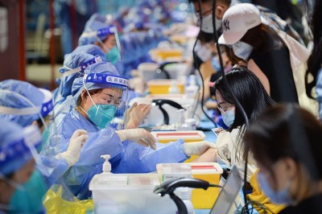
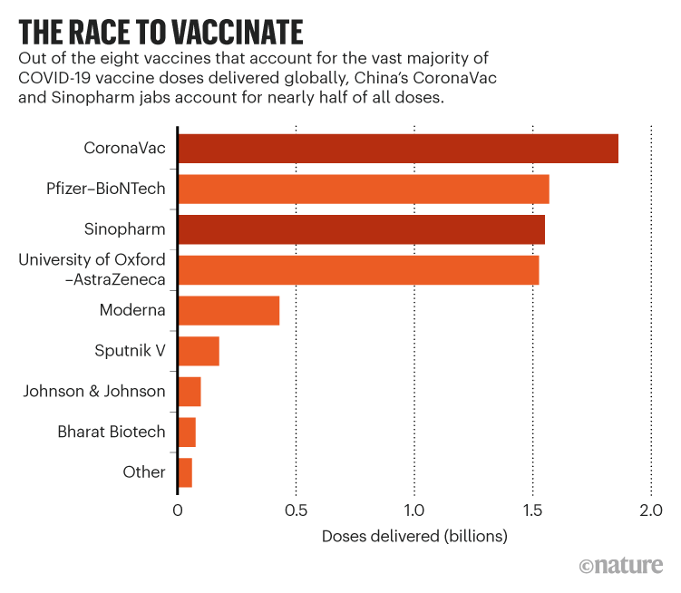
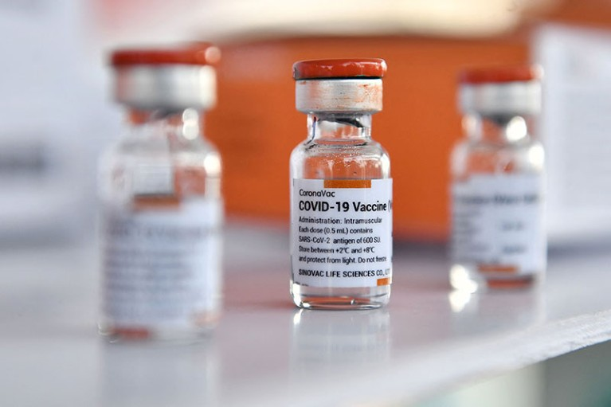
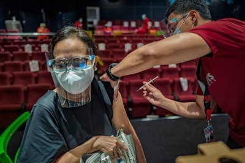
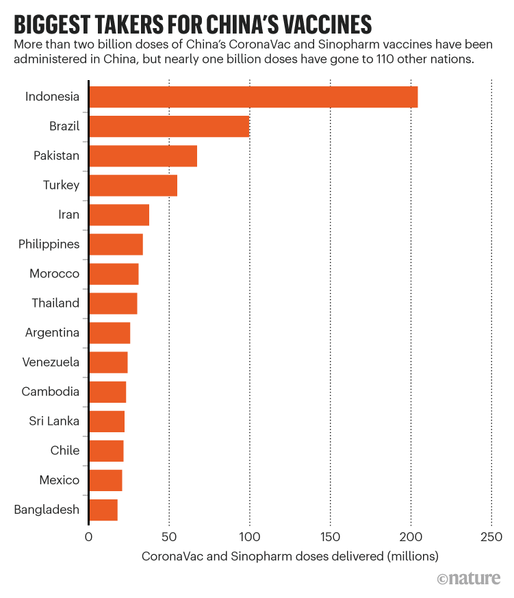
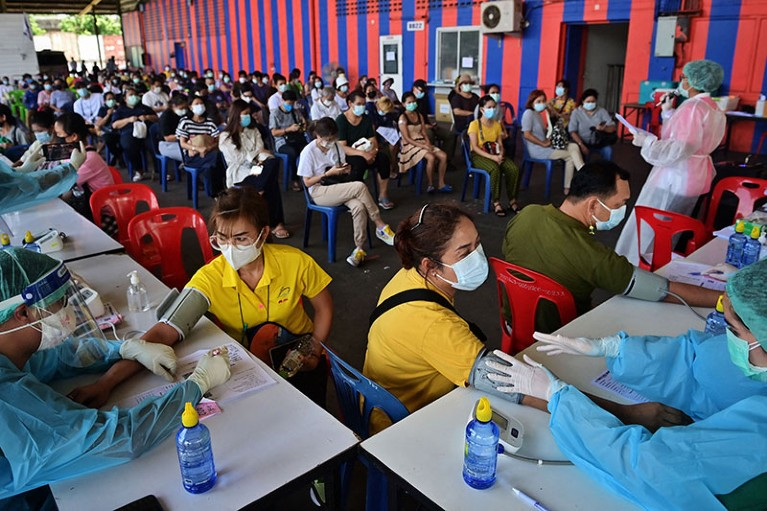
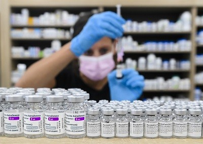

China’s CoronaVac and Sinopharm vaccines account for almost half of the 7.3 billion COVID-19 vaccine doses delivered globally, and have been enormously important in fighting the pandemic, particularly in less wealthy nations.

中国的 CoronaVac 和 Sinopharm 疫苗占全球交付的 73 亿剂 COVID-19 疫苗的近一半，并且在抗击这一流行病方面发挥了极其重要的作用，特别是在较不富裕的国家。

But as the doses mount, so have the data, with studies suggesting that the immunity from two doses of either vaccine wanes rapidly, and the protection offered to older people is limited. This week the World Health Organization [announced advice](https://cdn.who.int/media/docs/default-source/immunization/sage/2021/october/sage_oct2021_meetinghighlights.pdf) from its Strategic Advisory Group of Experts on Immunization (SAGE) that people over 60 should receive a third dose of the same or another vaccine to ensure sufficient protection.

但随着剂量的增加，数据也随之增加，研究表明，两种疫苗中的任何一种疫苗的免疫力都会迅速减弱，并且为老年人提供的保护是有限的。本周，世界卫生组织宣布了其免疫战略咨询专家组 (SAGE) 的建议，即 60 岁以上的人应该接种第三剂相同或另一种疫苗，以确保充分保护。

[

China’s COVID vaccines are going global — but questions remain

  
中国的 COVID 疫苗正在走向全球——但问题依然存在](https://www.nature.com/articles/d41586-021-01146-0)

The recommendation is “sensible and necessary”, says Manoel Barral-Netto, an immunologist at the Oswaldo Cruz Foundation in Salvador, Brazil.

巴西萨尔瓦多 Oswaldo Cruz 基金会的免疫学家 Manoel Barral-Netto 说，这项建议是“明智且必要的”。

A number of countries are already offering [third doses](https://www.nature.com/articles/d41586-021-02516-4) to all adults or are trying [mix-and-match](https://www.nature.com/articles/d41586-021-01805-2) approaches. Some experts are even questioning whether China’s jabs — based on inactivated virus — should continue to be used at all when other options are available.

许多国家已经在向所有成年人提供第三剂疫苗，或者正在尝试混合搭配的方法。一些专家甚至质疑，在有其他选择的情况下，是否应该继续使用基于灭活病毒的中国疫苗。

But others say that the vaccines still have a major part to play. “These are not bad vaccines. They’re just vaccines that haven’t been optimized yet,” says Gagandeep Kang, a virologist at the Christian Medical College in Vellore, India, who advises SAGE.

但其他人表示，疫苗仍可发挥重要作用。 “这些都不是坏疫苗。它们只是尚未优化的疫苗，”印度韦洛尔基督教医学院的病毒学家 Gagandeep Kang 说，他是 SAGE 的顾问。

 

Source: Data from Airfinity.  
资料来源：来自 Airfinity 的数据。

## Inactivated vaccines  
灭活疫苗  

CoronaVac, produced by Beijing-based company Sinovac, is the world’s most widely used COVID-19 vaccine. Not far behind is the vaccine developed in Beijing by state-owned Sinopharm (see 'The race to vaccinate').

CoronaVac 由总部位于北京的 Sinovac 公司生产，是世界上使用最广泛的 COVID-19 疫苗。紧随其后的是国有国药集团在北京开发的疫苗（参见“接种疫苗的竞赛”）。

In mid-2021, the World Health Organization (WHO) [approved the shots](https://www.nature.com/articles/d41586-021-01146-0) for emergency use, on the basis of limited clinical-trial data suggesting that [CoronaVac](https://www.nature.com/articles/d41586-021-01497-8) was 51% and Sinopharm 79% effective at preventing symptomatic disease. This was on a par with the 63% efficacy reported for the University of Oxford–AstraZeneca’s viral-vector vaccine at the time of its WHO listing, but lower than the 90% and higher efficacies of the mRNA vaccines developed by Pfizer–BioNTech and Moderna.

2021 年年中，世界卫生组织 (WHO) 根据有限的临床试验数据批准紧急使用疫苗，这些数据表明 CoronaVac 在预防症状性疾病方面的有效性为 51%，国药集团为 79%。这与牛津大学 - 阿斯利康病毒载体疫苗在 WHO 上市时报告的 63% 功效相当，但低于辉瑞 - BioNTech 和 Moderna 开发的 mRNA 疫苗的 90% 和更高功效.

Both the Chinese vaccines are inactivated vaccines, which use killed SARS-CoV-2 virus. Researchers say this type of vaccine seems to be less potent because it triggers an immune response against many viral proteins. By contrast, mRNA and viral-vector vaccines target the response to the spike protein, which is what the virus uses to enter human cells.

这两种中国疫苗都是灭活疫苗，使用的是灭活的 SARS-CoV-2 病毒。研究人员说，这种类型的疫苗似乎不太有效，因为它会引发针对许多病毒蛋白的免疫反应。相比之下，mRNA 和病毒载体疫苗针对的是对刺突蛋白的反应，而刺突蛋白正是病毒用来进入人体细胞的物质。

“You don’t choose the target with inactivated vaccines, you just throw in all these different antigens,” explains Jorge Kalil, a physician and immunologist at the University of São Paulo Medical School, Brazil.

巴西圣保罗大学医学院的内科医生和免疫学家 Jorge Kalil 解释说：“你不用选择灭活疫苗的目标，你只需投入所有这些不同的抗原。”

About 2.4 billion doses of the Chinese vaccines have been administered in China, but almost 1 billion doses have gone to 110 other countries (see 'Biggest takers for China's vaccines'). Reports earlier this year of COVID-19 surges in several countries that had vaccinated many people with these vaccines — such as the Seychelles and Indonesia — prompted questions about the protection they offered.

大约 24 亿剂中国疫苗已在中国接种，但近 10 亿剂已流向其他 110 个国家（参见“中国疫苗的最大接受者”）。今年早些时候有报道称，塞舌尔和印度尼西亚等几个为许多人接种了这些疫苗的国家出现了 COVID-19 激增，这引发了人们对它们提供的保护的质疑。

Numerous studies have now been undertaken in nations including Brazil, Chile and Thailand, to understand waning immunity and protection in different groups.

现在已经在包括巴西、智利和泰国在内的国家进行了大量研究，以了解不同群体的免疫力和保护减弱情况。

 

Vials of China’s CoronaVac vaccine, ready to be administered in Bangkok.Credit: Lillian Suwanrumpha/AFP via Getty

几瓶中国的 CoronaVac 疫苗，准备在曼谷接种。图片来源：Lillian Suwanrumpha/AFP via Getty

## Lower antibody responses  
较低的抗体反应  

Some studies have found that compared with vaccines made using other technologies, China’s inactivated vaccines initially generate lower levels of ‘neutralizing’ or virus-blocking antibodies — considered a proxy for protection — and that these levels drop quickly over time.

一些研究发现，与使用其他技术生产的疫苗相比，中国的灭活疫苗最初会产生较低水平的“中和”或病毒阻断抗体——被认为是保护的代表——而且这些水平会随着时间的推移迅速下降。

One study of 185 health-care workers in Thailand<a href="https://www.nature.com/articles/d41586-021-02796-w#ref-CR1" data-track="click" data-action="anchor-link" data-track-label="go to reference" data-track-category="references">1</a>, not yet peer-reviewed, found that 60% had high levels of neutralizing antibodies one month after receiving a second dose of CoronaVac, compared with 86% of those who had received two shots of the Oxford–AstraZeneca vaccine.

一项针对泰国 185 名医护人员的研究（尚未经过同行评审）发现，在接受第二剂 CoronaVac 一个月后，60% 的人中和抗体水平较高，而在接受两次 CoronaVac 疫苗接种的人中，这一比例为 86%牛津-阿斯利康疫苗。

Co-author Opass Putcharoen, an infectious-diseases specialist at the Thai Red Cross Emerging Infectious Diseases Clinical Center in Bangkok, says the team also found that three months after receiving the second CoronaVac shot, the antibody prevalence dropped to just 12%.

合著者 Opass Putcharoen 是曼谷泰国红十字会新发传染病临床中心的传染病专家，他说研究小组还发现，在接受第二次 CoronaVac 注射后三个月，抗体流行率降至仅 12%。

But “waning of antibodies isn’t necessarily the same as waning of immune protection”, says Ben Cowling, an epidemiologist at the University of Hong Kong. He says that vaccines induce complex immune responses, including B cells and T cells, which might be more long lived than neutralizing antibodies.

但“抗体的减弱并不一定等同于免疫保护的减弱”，香港大学的流行病学家本考林说。他说，疫苗会诱导复杂的免疫反应，包括 B 细胞和 T 细胞，它们可能比中和抗体寿命更长。

One study from Hong Kong<a href="https://www.nature.com/articles/d41586-021-02796-w#ref-CR2" data-track="click" data-action="anchor-link" data-track-label="go to reference" data-track-category="references">2</a>, which has not been peer-reviewed, showed that CoronaVac induces a significantly lower antibody response compared with Pfizer–BioNTech’s mRNA jab one month after two doses, but that the T-cell response was comparable.

来自香港的一项尚未经过同行评审的研究表明，与辉瑞-BioNTech 的 mRNA 注射剂相比，CoronaVac 在两次给药一个月后诱导的抗体反应显着降低，但 T 细胞反应相当。

[

WHO approval of Chinese CoronaVac COVID vaccine will be crucial to curbing pandemic

世卫组织批准中国 CoronaVac COVID 疫苗对于遏制大流行至关重要](https://www.nature.com/articles/d41586-021-01497-8)

Another non-peer-reviewed study, of health-care workers in China<a href="https://www.nature.com/articles/d41586-021-02796-w#ref-CR3" data-track="click" data-action="anchor-link" data-track-label="go to reference" data-track-category="references">3</a>, also found that B cells and T cells specific for SARS-CoV-2 could be detected five months after two doses of the Sinopharm vaccine.

另一项针对中国医护人员的非同行评审研究也发现，在接种两剂国药疫苗五个月后，可以检测到特异性针对 SARS-CoV-2 的 B 细胞和 T 细胞。

So far, studies assessing protection over time are limited. But preliminary analysis of a mass-vaccination campaign with CoronaVac in Chile suggests a small but significant decline in efficacy against symptomatic disease, although protection against hospitalization remains high, says Eduardo Undurraga, a public-health researcher at the Pontifical Catholic University of Chile in Santiago.

到目前为止，随着时间的推移评估保护的研究是有限的。圣地亚哥智利天主教大学公共卫生研究员 Eduardo Undurraga 说，但对智利 CoronaVac 大规模疫苗接种运动的初步分析表明，尽管对住院的保护率仍然很高，但对有症状疾病的疗效略有下降，但显着下降.

Vaccines made using other technologies have seen a similar trend of waning antibodies and protection against infection, but more-robust protection against severe disease and death. But researchers say that because the Chinese inactivated vaccines start at a lower base of neutralizing antibodies, the protection they offer could drop faster than those with a stronger head start.

使用其他技术制造的疫苗也出现了类似的抗体减弱趋势和对感染的保护作用，但对严重疾病和死亡的保护作用更强。但研究人员表示，由于中国的灭活疫苗起始于较低的中和抗体基础，因此它们提供的保护可能比起先机更强的疫苗下降得更快。

 

Source: Data from Airfinity.  
资料来源：来自 Airfinity 的数据。

## To boost, or not to boost  
提升还是不提升  

The less-potent immune response from inactivated vaccines also has implications for the protection they offer to older people. The immune system weakens with age and vaccines are generally less effective in older people, says Kang, but the effect seems to be more pronounced with the inactivated vaccines.

灭活疫苗的免疫反应较弱，这也影响到它们为老年人提供的保护。 Kang 说，免疫系统随着年龄的增长而减弱，疫苗对老年人的效果通常较差，但灭活疫苗的效果似乎更为明显。

A massive analysis of some one million people who were hospitalized with COVID-19 in Brazil<a href="https://www.nature.com/articles/d41586-021-02796-w#ref-CR4" data-track="click" data-action="anchor-link" data-track-label="go to reference" data-track-category="references">4</a> found that CoronaVac offered up to 60% protection against severe disease up to the age of 79 — not far off the 76% protection offered by the Oxford–AstraZeneca vaccine.

对巴西约 100 万因 COVID-19 住院的人进行的大规模分析发现，CoronaVac 为 79 岁以下的人提供了高达 60% 的严重疾病保护——与牛津-阿斯利康疫苗提供的 76% 保护相差不远.

But the picture changes drastically in people over 80, says co-author Daniel Villela, an epidemiologist at the Oswaldo Cruz Foundation at Rio de Janeiro, Brazil. In that group, CoronaVac was only 30% effective at preventing severe disease and 45% effective against death, compared with 67% and 85%, respectively, for the Oxford–AstraZeneca jab.

但巴西里约热内卢 Oswaldo Cruz 基金会的流行病学家、共同作者 Daniel Villela 说，这种情况在 80 岁以上的人群中发生了巨大变化。在该组中，CoronaVac 在预防严重疾病方面的有效性仅为 30%，在预防死亡方面的有效性仅为 45%，而 Oxford-AstraZeneca 疫苗的预防效果分别为 67% 和 85%。

Research by Barral-Netto and his colleagues<a href="https://www.nature.com/articles/d41586-021-02796-w#ref-CR5" data-track="click" data-action="anchor-link" data-track-label="go to reference" data-track-category="references">5</a> found that CoronaVac prevented only 33% of deaths due to COVID-19 in people 90 and older. Neither study has been peer-reviewed, but Villela says they influenced Brazil’s government to start giving people older than 70 a third shot of an mRNA or viral-vector vaccine in August — that decision has now been extended to people older than 60.

Barral-Netto 及其同事的研究发现，CoronaVac 仅阻止了 90 岁及以上人群因 COVID-19 死亡的 33%。这两项研究都没有经过同行评审，但 Villela 说，他们影响了巴西政府，从 8 月开始给 70 岁以上的人注射第三针 mRNA 或病毒载体疫苗——该决定现在已扩大到 60 岁以上的人。

“It was better to receive CoronaVac than nothing,” says Barral-Netto, but now that other vaccines are flowing into Brazil “it is probably not very wise to keep vaccinating people with this vaccine”, he says, adding that the Brazilian government has said it will stop purchasing CoronaVac.

Barral-Netto 说：“接受 CoronaVac 总比什么都不接受要好，”但现在其他疫苗正在流入巴西，“继续为人们接种这种疫苗可能不是很明智”，他补充说，巴西政府已经表示将停止购买 CoronaVac。

Other countries, including Chile, Abu Dhabi in the United Arab Emirates and China, are also giving booster jabs to those who received the CoronaVac or Sinopharm vaccines.

其他国家，包括智利、阿拉伯联合酋长国的阿布扎比和中国，也在向接种了 CoronaVac 或国药集团疫苗的人进行加强免疫。

Clinical-trial data from China<a href="https://www.nature.com/articles/d41586-021-02796-w#ref-CR6" data-track="click" data-action="anchor-link" data-track-label="go to reference" data-track-category="references">6</a>, not yet peer-reviewed, suggest that a third dose of CoronaVac increases neutralizing antibody levels, and a similar boost has been observed in studies of third doses of Sinopharm’s vaccine.

来自中国的尚未经过同行评审的临床试验数据表明，第三剂 CoronaVac 可提高中和抗体水平，在国药第三剂疫苗的研究中也观察到了类似的提升。

And earlier this month, the Chilean government reported preliminary results on the effectiveness of booster shots, based on data from some two million people who had received two shots of CoronaVac, and a third shot of the CoronaVac, Pfizer–BioNTech or Oxford–AstraZeneca vaccines. Protection against COVID-19 jumped from 56% after two shots to 80% or higher after a third shot of any vaccine, with protection against hospitalization rising from 84% to 87%.

本月早些时候，智利政府根据大约 200 万人接种了两针 CoronaVac 和第三针 CoronaVac、Pfizer–BioNTech 或 Oxford–AstraZeneca 疫苗的数据，报告了加强针有效性的初步结果.对 COVID-19 的保护从两针后的 56% 跃升至任何疫苗第三针后的 80% 或更高，对住院的保护从 84% 上升到 87%。

 

Health-care workers prepare to give doses of either the CoronaVac or the Oxford–AstraZeneca vaccine at a mass vaccination hub in Bangkok.Credit: Lillian Suwanrumpha/AFP via Getty

医护人员准备在曼谷的大规模疫苗接种中心接种 CoronaVac 或 Oxford-AstraZeneca 疫苗。图片来源：Lillian Suwanrumpha/AFP via Getty

## Mix and match  
连连看  

Some researchers say an alternative to a three-dose schedule might be to mix and match with just two doses.

一些研究人员表示，三剂方案的替代方案可能是混合搭配两剂。

Sompong Vongpunsawad, a virologist at Chulalongkorn University in Bangkok, led a team that looked at antibody levels in 54 people who received one dose of CoronaVac and one of Oxford–AstraZeneca. The results<a href="https://www.nature.com/articles/d41586-021-02796-w#ref-CR7" data-track="click" data-action="anchor-link" data-track-label="go to reference" data-track-category="references">7</a>, not yet peer-reviewed, suggested that the immune response was similar to two doses of AstraZeneca, and higher than two doses of CoronaVac.

曼谷朱拉隆功大学的病毒学家 Sompong Vongpunsawad 领导的一个团队研究了 54 名接受一剂 CoronaVac 和一剂 Oxford-AstraZeneca 疫苗的人的抗体水平。尚未经过同行评审的结果表明，免疫反应类似于两剂阿斯利康，但高于两剂 CoronaVac。

Vongpunsawad says the finding is useful in places where doses of some vaccines are in short supply. “It was like bingo — we can actually solve the vaccine limitation crisis,” he says. The result spurred the Thai government to recommend mix-and-match schedules, he says.

Vongpunsawad 说，这一发现在某些疫苗剂量短缺的地方很有用。 “这就像宾果游戏——我们实际上可以解决疫苗限制危机，”他说。他说，结果促使泰国政府推荐混合搭配时间表。

[

Mix-and-match COVID vaccines: the case is growing, but questions remain

混合搭配 COVID 疫苗：病例在增加，但问题依然存在](https://www.nature.com/articles/d41586-021-01805-2)

A trial in China also found that using an adenovirus-vector vaccine produced by the Tianjin-based company CanSino Biologics, in addition to one or two doses of CoronaVac, induced higher neutralizing antibody levels, compared with two doses of CoronaVac alone<a href="https://www.nature.com/articles/d41586-021-02796-w#ref-CR8" data-track="click" data-action="anchor-link" data-track-label="go to reference" data-track-category="references">8</a>.

在中国进行的一项试验还发现，与单独使用两剂 CoronaVac 相比，使用天津公司 CanSino Biologics 生产的腺病毒载体疫苗以及一剂或两剂 CoronaVac 可诱导更高的中和抗体水平。

It is not yet clear how long that protection will last, and how these antibody levels translate to actual protection, but researchers say such mixing has merit.

目前尚不清楚这种保护会持续多久，以及这些抗体水平如何转化为实际保护，但研究人员表示，这种混合是有好处的。

“For all vaccines, it’s very much an evolving situation,” says Kang. “Inactivated vaccines are a big part of our portfolio. So we really need to figure out how to use them.”

“对于所有疫苗来说，情况都在不断变化，”康说。 “灭活疫苗是我们产品组合的重要组成部分。所以我们真的需要弄清楚如何使用它们。”

_doi: https://doi.org/10.1038/d41586-021-02796-w  
doi: https://doi.org/10.1038/d41586-021-02796-w  
_
