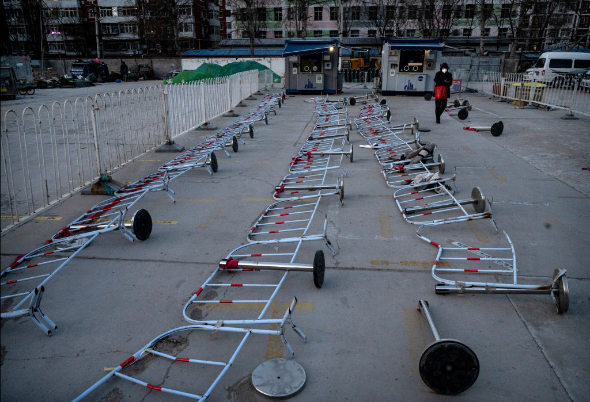
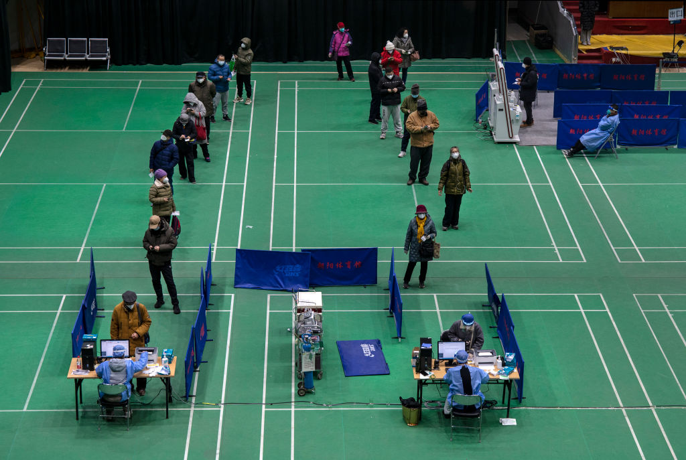

Even for China, where the distance between official narrative and empirical evidence is often a chasm, the last few days have been jarring. On Tuesday, officials announced five deaths from COVID-19—up from two the previous day, which were the first recorded in the country since Dec. 3. On Wednesday, there were [officially none](https://www.reuters.com/world/china/beijing-braces-surge-severe-covid-cases-world-watches-with-concern-2022-12-21/). But a glance online tells a different story. Dozens of [hearses line up](https://twitter.com/leolordjones/status/1604790466389622784) at a Beijing crematorium; bodies wrapped in orange [plastic pile in hospitals](https://twitter.com/DrEricDing/status/1604749306245922817); patients on ventilators are [crammed on a ward floor](https://twitter.com/Joshuajered/status/1604770410951806976).

即使是在官方说法和经验证据之间往往存在鸿沟的中国，过去几天也是不和谐的。周二，官方宣布有5人死于COVID-19，高于前一天的2人，这是该国自12月3日以来首次有记录。周三，官方宣布没有。但在网上浏览一下，情况就不同了。数十辆灵车在北京的一个火葬场排队等候;医院内以橙色胶堆包裹的尸体;呼吸机上的病人挤在病房地板上。

The decision by Chinese Communist Party (CCP) leadership to roll back its stringent zero-COVID policy and allow the virus to proliferate has led to a surge in cases and an immense strain on health services. It’s a quite staggering reversal. On Nov. 10, President Xi Jinping—the self-anointed [“commander-in-chief” of a “people’s war”](http://www.npc.gov.cn/npc/c16175/202005/c71b686a60e643f58aede49469a2b0d3/files/68c6cdeefeb145b89efe9a2c653c43d3.pdf) against the virus—instructed his Politburo to stick “resolutely” to “dynamic zero-COVID.” Residents of Shanghai were [forcibly detained in quarantine facilities](https://time.com/6175179/shanghai-covid-lockdown-residents/) over the summer because of a single case in a neighboring housing block.

中国共产党领导层决定取消其严格的零新冠病毒政策，允许病毒扩散，导致病例激增，给卫生服务带来巨大压力。这是一个相当惊人的逆转。11月10日，自封为抗击病毒"人民战争""总指挥"的国家主席习近平指示政治局"坚决"坚持"动态零新冠"。今年夏天，上海的居民因为邻近住宅区的一起病例而被强制拘留在隔离设施中。

**Read More:** [_China’s Zero-COVID Trap_](https://time.com/6237990/china-end-zero-covid-policy/)  
阅读更多：中国的零新冠病毒陷阱  

But zero-COVID was virtually abandoned on Dec. 7, with China’s top medical adviser now [comparing](https://www.bloomberg.com/news/articles/2022-12-11/china-s-top-medical-adviser-says-omicron-risks-similar-to-flu) the Omicron variant to “flu.” On Dec. 13, a tracking app that had tyrannized every life in China for the past three years was [abruptly taken offline](https://hongkongfp.com/2022/12/12/china-scraps-major-covid-tracking-app-as-virus-rules-ease/). On Sunday, officials in the central city of Chongqing [decreed](https://www.cq.gov.cn/zwgk/zfxxgkml/szfwj/qtgw/202212/t20221218_11400537.html) that mild or asymptomatic COVID-19 cases could “go to work as normal.”

但12月7日，零新冠病毒几乎被抛弃，中国最高医学顾问现在将奥米克龙变种比作"流感"。12月13日，一款在过去三年里欺压中国每一个人的追踪应用突然下线。周日，重庆市中心的官员颁布法令，新冠肺炎轻症或无症状病例可以"正常上班"。

The screeching U-turn underlines the fickle nature of strongman rule but also the immense paranoia of the CCP when faced with public discontent, such as the protests that [erupted in late November](https://time.com/6237068/china-zero-covid-protests/) across several Chinese cities. The catalyst was the [deaths of at least 10 people](https://apnews.com/article/china-fires-6a1b6902e6ccf87e064f1232045a2848) in an apartment block fire in China’s western city of Urumqi that observers blamed on draconian pandemic controls keeping residents locked in their homes. (Officials deny this.) It spurred a wave of [protests](https://time.com/6238050/china-protests-censorship-urumqi-a4/), with scores of people gathering on streets and university campuses across the country, shouting “we want freedom, not PCR tests,” and even “down with Xi Jinping.”

这一尖锐的180度大转弯突显出强人统治的变化无常，但也突显出中共在面对公众不满时的极度偏执，比如11月底在中国多个城市爆发的抗议活动。催化剂是中国西部城市乌鲁木齐一栋公寓楼发生火灾，造成至少10人死亡。观察人士将此归咎于严格的疫情控制措施，将居民锁在家中。（官方对此予以否认。）这引发了抗议浪潮，数十人聚集在全国各地的街道和大学校园，高呼"我们要自由，不要PCR测试"，甚至"打倒习近平"

**Read More:** [_Detained Zero-COVID Protesters in China Share Their Stories_](https://time.com/6240747/shanghai-china-protests-zero-covid-fear/)

阅读更多：中国被拘留的零新冠肺炎抗议者分享他们的故事

The sudden rollback of restrictions that followed “could be seen as a victory for people power,” says Yanzhong Huang, a senior fellow for global health at the Council on Foreign Relations.

外交关系理事会全球卫生高级研究员黄彦忠说，随后突然取消的限制“可以被视为人民力量的胜利”。

Still, the policy climbdown is surprising. China’s security services were swift to track down and detain demonstrators, who were never close to forming a political opposition. “They never quite galvanized into a single, unified, politically actionable message,” says Wen-Ti Sung, a scholar specializing in Chinese elite politics at the Australian National University. But what likely spooked Xi was the breadth of discontent that zero-COVID engendered. Affluent Shanghainese, [embattled students facing bleak job prospects](https://www.channelnewsasia.com/asia/university-students-lockdown-protest-china-campus-covid-19-3125176), and [migrant workers in southern factories](https://www.pbs.org/newshour/world/workers-beaten-detained-after-zero-covid-protests-at-chinese-iphone-factory) all railed against its privations and related economic blowback in distinct but analogous acts of rebellion. Their concerns were well-founded; models suggest zero-COVID [may have cost](https://www.project-syndicate.org/commentary/zero-covid-china-economy-costs-benefits-by-shang-jin-wei-2022-10) the Chinese economy $384 billion and reduced GDP growth by 2.2 percentage points.

尽管如此，政策的让步还是令人惊讶的。中国安全部门迅速追踪并拘留了示威者，他们从未接近形成政治反对派。澳大利亚国立大学专门研究中国精英政治的学者宋文迪说：“他们从来没有形成一个单一的、统一的、政治上可行的信息。”但可能让习近平感到恐慌的是零新冠肺炎所引发的广泛不满。富裕的上海人、面临黯淡就业前景的四面楚歌的学生以及南方工厂的农民工，都在不同但相似的反抗行动中谴责中国的匮乏和相关的经济反弹。他们的关切是有根据的;模型显示，零新冠肺炎可能使中国经济损失了3840亿美元，GDP增长率下降了2.2个百分点。

___

   

A woman walks by barricades as they are seen scattered on the ground at a testing site for COVID-19, on Dec. 19, 2022 in Beijing, China.

2022年12月19日，中国北京，一名妇女走过路障，看到路障散落在COVID-19检测点的地面上。

Kevin Frayer—Getty Images  
凯文·弗雷尔-盖蒂图片社  

It’s perhaps unsurprising that a CCP spawned from popular revolution should fear the wrath of the masses most of all. In truth, however, [over two-thirds](https://politicalscience.yale.edu/publications/politics-authoritarian-rule) of the 303 autocrats ousted from power worldwide between 1946 and 2008 were unseated by elite coups, with only a small minority bested by popular uprisings. The lesson being that rather than fear a mob over the horizon, leaders like Xi should be looking over their shoulder. It’s clear that he does the latter too, of course; by [assuming a protocol-breaking third leadership](https://time.com/6220661/xi-jinping-third-term-china-ccp/) term in November, while stocking his inner circle with loyalists and lackeys, Xi has doggedly insulated himself from potential rivals.

这也许并不奇怪，一个从人民革命中诞生的共产党应该最害怕群众的愤怒。但事实上，在1946年至2008年间被赶下台的303位独裁者中，超过三分之二是被精英政变推翻的，只有一小部分是被民众起义击败的。教训是，习近平这样的领导人不应该害怕地平线上的暴民，而应该回头看。很明显，他当然也做了后者;通过在11月打破常规的第三届领导人任期，同时在他的核心圈子里安插忠诚者和走狗，习近平顽强地将自己与潜在的竞争对手隔离开来。

Herein may lie the problem. The fear was always that this new leadership’s homogeneity would [undermine the quality of its policy-making](https://time.com/6220661/xi-jinping-third-term-china-ccp/). “That it has been having a hard time facing its first major test—smooth transition out of zero-COVID—has not been helpful in dispelling those concerns,” says Sung. The government saw the economic pain of zero-COVID and wanted to make adjustments. But local officials who for the past three years have been judged first and foremost on stamping out the virus were naturally hesitant. So the central leadership had to take bolder steps to force their arm such as dismantling the nationwide tracking apparatus. Cue the lurch from one extreme to another. Today, China is caught between Xi’s two festering paranoias—fear of the people, and of challenges within the party.

问题可能就在这里。人们总是担心，新领导层的同质性会削弱其决策的质量。宋说："它一直很难面对其第一个重大考验--从零新冠肺炎平稳过渡--这无助于消除这些担忧。"政府看到了零COVID带来的经济痛苦，希望做出调整。但过去三年来，当地官员在消灭病毒方面一直是首要的评判标准，他们自然会犹豫不决。因此，中央领导层不得不采取更大胆的措施，迫使他们的手臂，如拆除全国跟踪装置。暗示着从一个极端到另一个极端的剧变。如今，中国正陷入习近平的两种日益恶化的偏执狂--害怕人民和党内挑战。

The consequences [may be dire](https://time.com/6237990/china-end-zero-covid-policy/). With virtually no community exposure to the virus, and only low efficacy domestic vaccines, the surge in cases will no doubt result in many deaths—some models [predict](https://time.com/6242070/covid-china-deaths-explainer/) over 1 million—despite official denials. Zhang Wenhong, a prominent Chinese doctor often likened to America’s Dr. Anthony Fauci, has [warned](https://twitter.com/YanzhongHuang/status/1602316630171815936) that China’s medical institutions will face their “darkest hour” by next month.

后果可能是可怕的。由于几乎没有社区接触到这种病毒，而且只有低效的国产疫苗，病例的激增无疑将导致许多人死亡一些模型预测超过100万人尽管官方否认。张文宏，一位著名的中国医生，经常被比作美国的安东尼·福奇医生，警告说中国的医疗机构将在下个月面临他们的“最黑暗的时刻”。

Instead, a new propaganda campaign has taken over. Previously, pandemic chaos in the West was painted as evidence of liberal democracy’s failings. Meanwhile, China’s success in banishing the virus was proof of a superior political system. But on Dec. 12, the CCP mouthpiece _People’s Daily_ newspaper instead framed zero-COVID as a necessary stopgap to buy time while the virus’s severity waned and effective treatments were developed. Its dismantling, so it went, was always in the works. “Be the first person responsible for your own health,” it wrote.

相反，一场新的宣传攻势已经开始。此前，西方的大流行性混乱被描绘成自由民主失败的证据。与此同时，中国成功驱除病毒证明了其上级的政治制度。但在12月12日，中共喉舌《人民日报》却将零新冠肺炎视为必要的权宜之计，以争取时间，让病毒的严重程度减轻，并开发出有效的治疗方法。它的拆除，就这样进行着，一直在进行中。“做对自己健康负责的第一人，”它写道。

The problems with this account are myriad and glaring. If this opening up was long-planned, then surely more efforts should have been made to vaccinate the elderly. Currently, only 42% of over-80s have had three doses of the vaccines, according to [government figures.](https://sg.news.yahoo.com/china-covid-surge-sparks-fears-millions-could-die-150536328.html?guccounter=1&guce_referrer=aHR0cHM6Ly93d3cuZ29vZ2xlLmNvbS8&guce_referrer_sig=AQAAAGxLdxMinmFv-Ex3Y-2-nwvRdCHB4Mmeylfq4c0Qy-fhAW55e7-wjXraGbNHqZPH_gU57k3mowRjfj3a4-oyeECW3Kv45xXos4pUpAC0iJPiS0JMXMtxCAL7dEbkbcUQlzrqPAQOoU304b2mXCnITp6oJu1_XegcuroGsARG_5Rf) Today, people seeking boosters are being turned away from clinics due to a lack of supply. The most vulnerable could have been given more effective foreign vaccines. (On Tuesday, the U.S. [offered](https://www.voanews.com/a/us-offers-covid-vaccines-to-china-to-stem-outbreak-/6884740.html) China mRNA vaccines, though nobody expects the nationalistic CCP to accept.) In addition, effective antivirals like Paxlovid should have been stockpiled; one Chinese website [sold out](https://www.reuters.com/business/healthcare-pharmaceuticals/chinas-111inc-app-starts-retail-sales-pfizers-paxlovid-covid-treatment-2022-12-13/) its supply in half-an-hour.

这个账户的问题是无数的和明显的。如果这种开放是早就计划好的，那么肯定应该做出更多努力为老年人接种疫苗。根据政府数据，目前只有42%的80岁以上的人接种了三剂疫苗。今天，由于缺乏供应，寻求助推器的人被诊所拒之门外。最脆弱的人群本可以获得更有效的外国疫苗。(On周二，美国向中国提供mRNA疫苗，但没有人指望民族主义的中共会接受。）此外，应该储备Paxlovid等有效的抗病毒药物;一家中国网站在半小时内就销售一空。

Public health experts also struggle with the logic of opening up some six months after most Chinese have had their last jab, given the rapidly decreasing efficacy of vaccines over time. Not to mention there’s just weeks before China’s Spring Festival—humanity’s largest annual migration, when some 200 million Chinese cram into buses and trains for long journeys to ancestral villages where medical facilities are rudimental at best.

公共卫生专家也在纠结于在大多数中国人打完最后一针大约六个月后才开放的逻辑，因为疫苗的效力随着时间的推移迅速下降。更不用说离中国春节只有几周的时间了，春节是人类最大的年度迁徙，届时大约有2亿中国人挤进公共汽车和火车，长途跋涉前往医疗设施最差的祖居。

“Even healthcare workers were caught off-guard \[by the reversal\],” says Huang.

“甚至连医护人员都对（这种逆转）措手不及，”黄说。

___

   

People wait in line to see a health worker at a temporary fever clinic set up by a hospital to treat potential COVID-19 patients in a sports centre on Dec. 18, 2022 in Beijing, China.

2022年12月18日，在中国北京的一个体育中心，人们在一家医院为治疗潜在的新冠肺炎患者而设立的临时发热门诊排队等候卫生工作者。

Kevin Frayer—Getty Images  
凯文·弗雷尔-盖蒂图片社  

Yet the CCP’s account is already written. On Dec. 14, authorities stopped reporting infections deemed “asymptomatic,” which in China is often stringently defined as those not confirmed with a chest scan. Then, on Dec. 20, officials said that they would only include on [its official COVID-19 death tally](https://www.scmp.com/news/china/politics/article/3203992/china-says-it-will-only-count-covid-deaths-respiratory-failure-official-toll) those who had tested positive for the virus and died of respiratory failure or pneumonia—excluding anyone with complicating conditions, as is frequently the case with elderly patients. The aim is to push home the message that China suffered the lowest COVID-19 toll of any major power.

然而，中共的账已经写好了。12月14日，当局停止报告被视为“无症状”的感染者，在中国，“无症状”通常被严格定义为未经胸部扫描证实的感染者。然后，在12月20日，官员们表示，他们只会将病毒检测呈阳性、死于呼吸衰竭或肺炎的人纳入官方的COVID-19死亡统计--不包括患有复杂病症的人，老年患者经常出现这种情况。其目的是让人们明白，中国是所有大国中新冠死亡人数最低的国家。

Many Chinese will no doubt buy the propaganda. But a large number have had their eyes opened by the bungling of zero-COVID, the lives lost to suicides and treatable ailments that worsened in an ultimately futile attempt to stamp out the virus. The protests only serve to show that the party is, in fact, fallible and responsive to public anger, that the people have more power than anyone thought. “This will be very encouraging for Chinese civil society, which has had very little space to work in for years,” says Sung. The irony is, of course, that so far they have only nudged the CCP from suffocating control to callous inaction.

许多中国人无疑会相信这种宣传。但很多人都被零新冠肺炎的拙劣表现睁大了眼睛，这些人死于自杀和可治疗的疾病，这些疾病在最终徒劳的消灭病毒的努力中恶化。抗议活动只能表明，事实上，党是容易犯错的，对公众的愤怒反应迅速，人民比任何人想象的都有更大的权力。“这将是非常令人鼓舞的中国公民社会，这是非常小的空间，多年来一直在工作，”宋说。当然，具有讽刺意味的是，到目前为止，他们只是把中共从令人窒息的控制推向了麻木不仁的不作为。

“I don’t know how anybody can have confidence in China anymore,” says one Shanghai resident, speaking to TIME on condition of anonymity for fear of official reprisals. “Disruption and unexpected things is one thing, but a government pulling the rug under your feet is quite another.”

“我不知道人们怎么还能对中国有信心，”一位上海居民说，由于担心官方报复，他要求匿名接受《时代》采访。“破坏和意想不到的事情是一回事，但政府在你脚下拉地毯是另一回事。”

**Write to** Charlie Campbell at [charlie.campbell@time.com](mailto:charlie.campbell@time.com?subject=(READER%20FEEDBACK)%20China%E2%80%99s%20Stunning%20U-Turn%20on%20Zero-COVID%20Takes%20Xi%20Jinping%20From%20Suffocating%20Control%20to%20Callous%20Inaction&body=https%3A%2F%2Ftime.com%2F6242854%2Fchina-zero-covid-reversal-xi-jinping%2F).  
写信给查理·坎贝尔，地址：查理·坎贝尔@时代周刊。
