Dec 19th 2022  
2022 年 12 月 19 日  

By Sevindj Nurkiyazova  
塞文吉·努尔基亚佐娃 (Sevindj Nurkiyazova)  

Late one May evening in 2018, 19-year-old Burulai Turdaly kyzy stepped out of her house on the outskirts of Bishkek, the capital of Kyrgyzstan. Just out of the shower, and wearing white pyjamas and flip-flops with a towel wrapped around her head, she went to the shop next door to buy _airan_, fermented cow’s milk. As she left the store, a man jumped out of a car and bundled her into it. The shopkeeper heard her scream, but by the time she ran outside the only trace of Burulai was her flip-flops.

2018 年 5 月的一个深夜，19 岁的 Burulai Turdaly kyzy 走出她位于吉尔吉斯斯坦首都比什凯克郊区的房子。刚洗完澡，她穿着白色的睡衣和人字拖，头上裹着毛巾，就去隔壁的商店买了发酵牛奶。当她离开商店时，一名男子从车里跳下来，将她塞进了车里。店主听到了她的尖叫声，但当她跑到外面时，布鲁莱唯一的踪迹就是她的人字拖。

Two hours later, a policeman called her father. Burulai was safe and her abductors had been caught. When her parents arrived at the police station to pick her up, an officer told them to wait in the car. An hour passed, then another. They started worrying that Burulai would get cold in her pyjamas. Finally, the police chief called her father inside. In a few curt sentences, he explained that Burulai’s abductor had slinked into the waiting room at the police station and stabbed her. Burulai was dead.

两个小时后，一名警察给她父亲打了电话。布鲁莱很安全，绑架她的人也被抓获了。当她的父母赶到派出所接她时，一名警察让他们在车里等着。一个小时过去了，又一个小时过去了。他们开始担心布鲁莱穿着睡衣会着凉。最后，警察局长把她父亲叫进来了。他用简短的几句话解释说，绑架布鲁莱的人偷偷溜进警察局的候诊室并刺伤了她。布鲁莱死了。

News of the killing spread fast on social media, sparking a hashtag, #ForgiveUsBurulai. People in Kyrgyzstan were shocked by the murder – less so by the fact that Burulai’s killer had snatched her from the street only the day before, with plans to marry her.

杀戮的消息在社交媒体上迅速传播，引发了#ForgiveUsBurulai 标签。吉尔吉斯斯坦的人们对这起谋杀案感到震惊——而杀害布鲁莱的凶手仅在前一天才从街上将她抢走，并计划与她结婚这一事实让人们感到震惊。

In a Kyrgyz government survey conducted in 2016 and funded by the UN, some 22% of the country’s women reported that their marriage had begun with an abduction, known as _ala-kachuu_, or “grab and run”. The researchers broke this figure down into those abducted “without consent” (6%) and those “with consent” (16%). Yet the idea of consent is difficult to parse in a country where half of Kyrgyz men and a third of women say that it’s OK to beat your wife in at least one of the following situations: she burns the food, neglects the kids, argues with her husband, goes out without telling him or refuses to have sex. The upshot is that, in 21st-century Kyrgyzstan, it’s as common to have kidnapped your future wife as it is to have met her on a dating app in 21st-century America.

在吉尔吉斯斯坦政府于 2016 年进行并由联合国资助的一项调查中，该国约 22% 的女性报告说，她们的婚姻始于绑架，即所谓的 ala-kachuu，即“抢劫”。研究人员将这一数字分为“未经同意”被绑架的人 (6%) 和“征得同意”的人 (16%)。然而，在一个一半的吉尔吉斯男性和三分之一的女性表示在以下至少一种情况下可以殴打你的妻子的国家，同意的概念很难解析：她烧了食物，忽视了孩子，与她的丈夫，在没有告诉他的情况下出去或拒绝发生性关系。结果是，在 21 世纪的吉尔吉斯斯坦，绑架你未来的妻子和在 21 世纪的美国通过约会应用程序认识她一样普遍。

According to legend, the tradition of grab and run originated in a small village named Kyz-Kuioo – which translates as bride and groom – 100km south-east of the country’s capital. In the story, which dates from long before Kyrgyzstan became part of the Russian Empire in 1876, a wealthy young woman falls in love with a poor man but her father forbids her to marry him. When the couple run away, the girl’s father sends a party of locals after them. Chased to the edge of a gorge, the lovers join hands and jump.

据传说，抢跑的传统起源于该国首都东南 100 公里处的一个名为 Kyz-Kuioo 的小村庄，意思是新娘和新郎。故事发生在吉尔吉斯斯坦于 1876 年成为俄罗斯帝国的一部分之前很久，一位富有的年轻女子爱上了一个穷人，但她的父亲禁止她嫁给他。当这对夫妇逃跑时，女孩的父亲派了一群当地人追赶他们。追到峡谷边缘，这对恋人手挽手纵身一跃。

Over the past half-century, _ala-kachuu_ has come to describe a range of situations. Some are like the myth, where sweethearts elope in defiance of their parents’ wishes or to avoid [the cost of a wedding](https://www.economist.com/1843/2018/05/29/the-price-of-love). Other versions are more sinister: men kidnapping ex-girlfriends who’ve refused to marry them; abducting women whom they’ve grown up around but barely spoken to; even men grabbing complete strangers whom they hope to coax into staying with romantic promises, emotional terrorism or rape.

在过去的半个世纪里，ala-kachuu 已经用来描述一系列情况。有些就像神话一样，恋人不顾父母的意愿私奔或避免婚礼费用。其他版本更险恶：男人绑架拒绝嫁给他们的前女友；绑架她们长大但几乎没有交谈过的女性；甚至男人也会抓住完全陌生的人，他们希望通过浪漫的承诺、情感恐怖主义或强奸来哄骗他们。

The shopkeeper heard her scream, but by the time she emerged the only trace of Burulai was her flip-flops

店主听到她的尖叫声，但当她出现时，布鲁莱唯一的踪迹就是她的人字拖

Kyrgyzstan was once a caravan stop on the Silk Road. Like many Central Asian countries, it declared independence from the Soviet Union in the early 1990s. Though corruption remains rife, the country has a robust civil society and a relatively free press. Yet bride abduction persists, both in the cities, as in Burulai’s case, and in rural areas, where it is even more common. A female grappling champion who lives in the capital told me that her coach let her return home to rural Talas only once a year because several of her sisters were kidnapped there; he’s afraid she’ll be next.

吉尔吉斯斯坦曾经是丝绸之路上的商队驿站。与许多中亚国家一样，它在 1990 年代初宣布脱离苏联独立。尽管腐败依然盛行，但该国拥有强大的公民社会和相对自由的新闻界。然而，抢婚现象在城市中依然存在，如布鲁莱的案例，在农村地区则更为普遍。一位住在首都的女子格斗冠军告诉我，她的教练每年只让她回塔拉斯农村一次，因为她的几个姐妹在那里被绑架；他害怕她会是下一个。

Marriage is still seen as the pinnacle of a woman’s life, even in progressive families like mine. My grandmother had a PhD in history and published a scholarly study of feminism in the Soviet Union, yet I remember her being dismayed when, as a teenager in the 2000s, I joked about staying single. I say “joked” because I couldn’t imagine that as an option: the average woman marries at 23; if you’re unwed at 25, you’re thought to be on the verge of spinsterhood, pretty much the worst failure imaginable.

婚姻仍然被视为女性生命的顶峰，即使在像我这样进步的家庭中也是如此。我的祖母拥有历史学博士学位，并发表了一篇关于苏联女权主义的学术研究，但我记得当我在 2000 年代还是个十几岁的孩子时开玩笑说要保持单身时，她感到很沮丧。我说“开玩笑”是因为我无法想象这是一种选择：普通女性在 23 岁结婚；如果你在 25 岁未婚，你就会被认为处于未婚状态的边缘，这几乎是可以想象到的最糟糕的失败。

Despite some expansion in girls’ education in recent years, and more women in government, there is evidence that, if anything, _ala-kachuu_ is on the rise. In an in-depth analysis of bride kidnapping, conducted in 2004, 27% of women over 76 said they had been abducted “by deception or force”. For women aged 16 to 25, more than half had been abducted against their will.

尽管近年来女童教育有所扩大，政府中的女性人数有所增加，但有证据表明，如果有的话，ala-kachuu 正在上升。在 2004 年进行的一项对新娘绑架的深入分析中，27% 的 76 岁以上的女性表示她们是“被欺骗或强迫”绑架的。在 16 至 25 岁的女性中，超过半数曾被强行绑架。

No such study has been repeated. But bride abduction continues. In a horrific case in 2012, a 20-year-old committed suicide after she was kidnapped and raped; for the first time in 30 years, an abductor was imprisoned for the crime. There were national protests against the custom. In response, the Kyrgyz parliament raised the maximum sentence for bride kidnapping from three to seven years. From one perspective that marked progress, from another it was a dark joke. At the time, any other form of abduction could lead to ten years behind bars, while car theft carried a maximum sentence of eight years, cattle rustling 11 years.

没有重复这样的研究。但绑架新娘仍在继续。在 2012 年的一起恐怖案件中，一名 20 岁的少女在被绑架和强奸后自杀； 30 年来第一次，一名绑架者因犯罪而入狱。全国都在抗议这一习俗。作为回应，吉尔吉斯议会将绑架新娘的最高刑期从三年提高到七年。从一个角度来看，这标志着进步，但从另一个角度来看，这是一个黑暗的笑话。当时，任何其他形式的绑架都可能导致 10 年监禁，而盗窃汽车最高可判 8 年徒刑，盗牛罪最高可判 11 年徒刑。

Burulai lived in a working-class neighbourhood of Bishkek. She was one of six children, all girls but one: her name, which means “turning moon”, is supposed to increase the chance that the next baby will be a boy. The naming tradition didn’t work: Burulai’s parents had no more children.

布鲁莱住在比什凯克的工人阶级社区。她是六个孩子中的一个，除了一个都是女孩：她的名字，意思是“转弯的月亮”，应该会增加下一个孩子是男孩的机会。命名传统没有用：布鲁莱的父母没有孩子了。

In the early 2000s Burulai’s family had moved to Bishkek from a village in south-west Kyrgyzstan, hoping for a better life: many Russians left the capital after the Soviet Union fell and opportunities for ethnic Kyrygz improved (three-quarters of Bishkek’s population is now ethnic Kyrygz, compared with less than a quarter in 1989). Burulai’s home was opposite an informal bus terminal for _marshrutkas,_ or “minibuses from hell”, as the packed jitneys are sometimes referred to. Burulai’s father, Turdaly, worked as a jitney driver for a while. Later the family opened a canteen; his wife cooked, his daughters served. Two of the girls met their future husbands there**.**

2000 年代初期，布鲁莱一家从吉尔吉斯斯坦西南部的一个村庄搬到比什凯克，希望过上更好的生活：苏联解体后许多俄罗斯人离开了首都，吉尔吉斯族的机会增加了（比什凯克四分之三的人口现在Kyrygz 族裔，而 1989 年还不到四分之一）。 Burulai 的家对面是一个非正式的 marshrutkas 巴士总站，或者“来自地狱的小巴”，有时也被称为拥挤的 jitneys。 Burulai 的父亲 Turdaly 曾当过一段时间的吉特尼司机。后来这家人开了一家食堂；他的妻子做饭，他的女儿们服务。其中两个女孩在那里遇到了她们未来的丈夫。

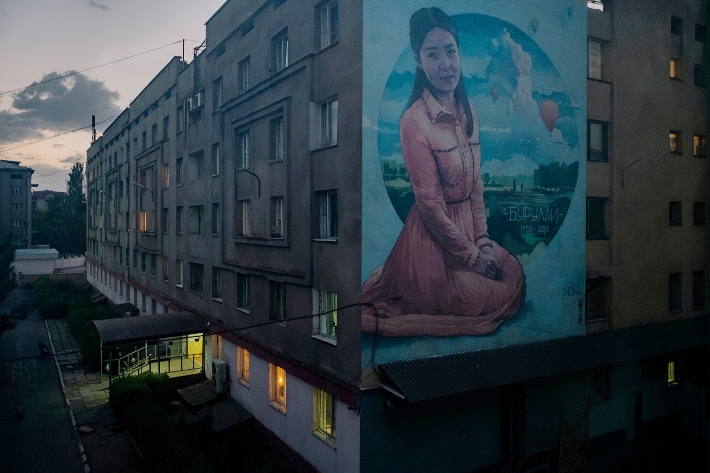

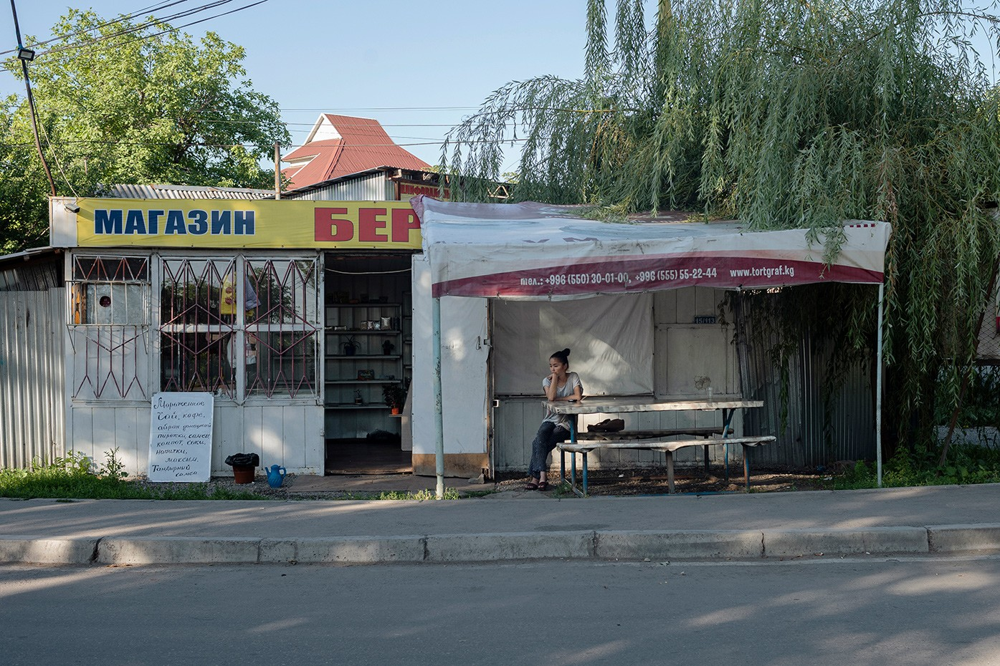

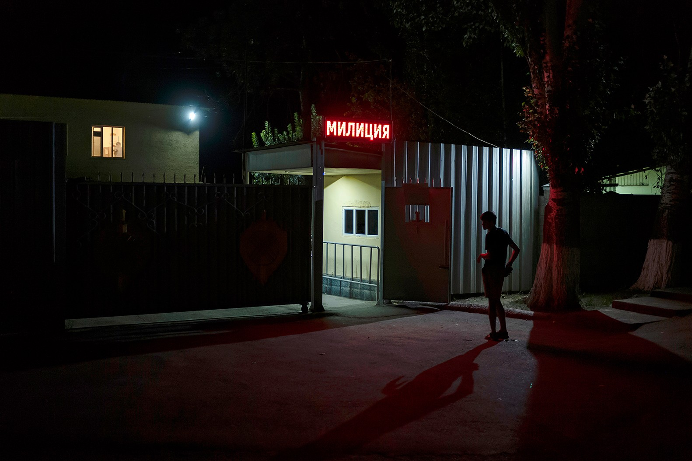

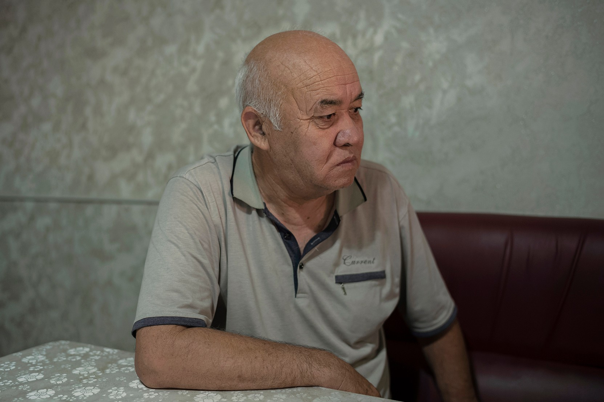

**Unholy union** _Opening image_: Nineteen-year-old Burulai Turdaly kyzy was murdered by her abductor. _From top to bottom_: People around Kyrgyzstan paid tribute to Burulai. There is evidence that bride kidnapping has become more common in Kyrgyzstan. Marsbek Bodoshev stabbed Burulai in a police station. Her father regrets not taking Marsbek’s threats against his daughter seriously

Unholy union 开场图片：19 岁的 Burulai Turdaly kyzy 被她的绑架者谋杀。从上到下：吉尔吉斯斯坦各地民众对布鲁莱表示敬意。有证据表明，绑架新娘在吉尔吉斯斯坦变得更加普遍。 Marsbek Bodoshev 在警察局刺伤了 Burulai。她的父亲后悔没有认真对待马斯贝克对他女儿的威胁

With her long black hair, heart-shaped face and large brown eyes, Burulai was a favourite with patrons, according to her parents. “She was calm and spoke softly,” her father said. “She was a very tender girl.” Her mother, who had laid out pastries, sweets and salads for my visit, pulled a handkerchief from her pocket to wipe her eyes.

据她的父母说，布鲁莱有着长长的黑发、心形脸和棕色大眼睛，是顾客的最爱。 “她很平静，说话也很轻声，”她的父亲说。 “她是一个非常温柔的女孩。”她的母亲为我的来访准备了糕点、糖果和沙拉，从口袋里掏出手帕擦了擦眼睛。

By the time Burulai was a young teenager, she had almost a dozen nieces and nephews. She was the adored and adoring aunt, the one who actually liked babysitting. Burulai decided to turn her love of kids into a living, and enrolled in Bishkek Medical College to train as a nurse and then study to become an obstetrician. To pay her tuition fees, she stitched on buttons at a small sewing workshop close to home.

到布鲁莱十几岁的时候，她已经有了将近十几个侄女和侄子。她是那个受人宠爱的阿姨，那个真正喜欢保姆的阿姨。 Burulai 决定将她对孩子的热爱变成一种谋生方式，并进入比什凯克医学院接受培训，成为一名护士，然后学习成为一名产科医生。为了支付学费，她在家附近的一家小缝纫作坊缝制纽扣。

She met Marsbek Bodoshev at the family canteen. Nine years older than Burulai, he was a stocky, taciturn man who wore a tracksuit and baseball cap and drove a jitney, like his father and two brothers. Burulai kept the relationship secret – only her sister, Aiperi, knew about it. Burulai’s next-door neighbour, a close friend, said that whenever she asked Burulai about her love life she gave the same response: “Nothing is going on right now.”

她在家庭食堂遇到了 Marsbek Bodoshev。他比 Burulai 大 9 岁，身材魁梧、沉默寡言，穿着运动服，戴着棒球帽，开着一辆轻便摩托车，就像他的父亲和两个兄弟一样。 Burulai 对这段关系保密——只有她的姐姐 Aiperi 知道这件事。布鲁莱的隔壁邻居，一位密友说，每当她向布鲁莱询问她的爱情生活时，她都会给出同样的回答：“现在什么都没有发生。”

From what I could piece together, over the course of three months in the summer of 2017, Burulai and Marsbek occasionally went to the cinema or out for a meal. The relationship ended around the time Burulai began her second year of medical college, when she started dating a young man she met at the sewing workshop. She didn’t tell her friends about him at first, either.

据我所知，在 2017 年夏天的三个月里，Burulai 和 Marsbek 偶尔会去看电影或出去吃饭。大约在 Burulai 开始她的医学院二年级时，这段关系结束了，当时她开始和一个在缝纫车间认识的年轻人约会。起初她也没有告诉她的朋友关于他的事。

One day in May 2018, Burulai returned home from university with a bunch of red roses from Marsbek – and an engagement ring. Crying, Burulai told her sister and mother that she loved someone else; though she’d made it clear to Marsbek that she didn’t want to marry him, he refused to take back the ring. Her mother said that was untenable: she had to find a way to give it back.

2018 年 5 月的一天，Burulai 带着一束来自 Marsbek 的红玫瑰和一枚订婚戒指从大学回到家。布鲁莱哭着告诉姐姐和妈妈，她爱上了别人；虽然她已经向马斯贝克明确表示她不想嫁给他，但他拒绝收回戒指。她的母亲说那是站不住脚的：她必须想办法把它还回去。

A few days later, Burulai was in an obstetrics class when she got a phone call and left the room. Within a couple of hours, Burulai called her friend and classmate Umutai, and asked her to bring her stuff outside. There, Umutai found a man she’d never met before, who said he’d give Burulai her things. When Umutai refused to hand them over, Burulai appeared around the corner. With tears in her eyes, she told her friend that Marsbek had abducted her. “She looked as if somebody had frightened her,” Umutai said in her police statement. But then Burulai returned the way she’d come.

几天后，布鲁莱正在上产科课，接到电话后离开了房间。几个小时后，布鲁莱给她的朋友兼同学乌穆泰打电话，让她把东西带到外面。在那里，Umutai 找到了一个她从未见过的男人，他说他会把她的东西给 Burulai。当乌穆泰拒绝交出他们时，布鲁莱出现在拐角处。她眼里含着泪水，告诉她的朋友，马斯贝克绑架了她。 “她看起来好像有人吓坏了她，”乌穆泰在她的警方声明中说。但随后 Burulai 原路返回。

Many Kyrgyz say it’s OK to beat your wife if she burns the food, neglects the kids, argues with her husband or refuses to have sex

许多吉尔吉斯人说，如果你的妻子烧毁食物、忽视孩子、与丈夫争吵或拒绝发生性关系，你可以打她

By the time Burulai’s family heard what had happened, she was halfway to Marsbek’s native village, hundreds of kilometres from Bishkek. Burulai’s father knew Marsbek’s older brother Zholdoshbek from his days as a driver. He called to demand the return of his daughter, but Zholdoshbek instead suggested meeting. He arrived with a contingent of family members – who were there, he announced, for _achuu basar_ (“suppressing the wrath”), a ceremony in which messengers for the abductor offer money and gifts to appease a kidnapped woman’s parents. “If my daughter agrees, I will give her into marriage,” Burulai’s father said. “But you should come in two months, when Burulai finishes the school year, and marry her properly.”

当 Burulai 的家人听到发生的事情时，她正在前往距离比什凯克数百公里的 Marsbek 家乡的半路上。 Burulai 的父亲在当司机时就认识了 Marsbek 的哥哥 Zholdoshbek。他打电话要求返回他的女儿，但 Zholdoshbek 却建议见面。他带着一队家庭成员抵达——他宣布，他们在那里是为了 achuu basar（“抑制愤怒”），绑架者的信使会提供金钱和礼物来安抚被绑架妇女的父母。 “如果我女儿同意，我就把她嫁出去，”布鲁莱的父亲说。 “但是你应该在两个月后回来，等布鲁莱学完学年，然后好好娶她。”

It was too late, Zholdoshbek said. The family had already slaughtered a sheep for the feast.

Zholdoshbek 说，为时已晚。一家人已经宰了一只羊来过节。

Marsbek’s mother insisted that Burulai wanted to marry her son and said the girl had even asked for a wedding robe, size 46. Burulai’s parents didn’t believe her – the size was wrong, for a start – and demanded to speak to their daughter. They finally reached her by phone, but she was on speaker: “Shall I stay?” Burulai asked meekly. “OK, my dear,” said her father, trying to keep things calm, “you can marry him, but this abduction wasn’t right. They should take you in two months.” He again demanded her return.

Marsbek 的母亲坚称 Burulai 想嫁给她的儿子，并说那个女孩甚至要了一件 46 号的婚纱。Burulai 的父母不相信她的说法——首先，尺码不对——并要求和他们的女儿谈谈。他们终于通过电话联系到了她，但她一直在讲话：“我可以留下来吗？”布鲁莱温顺的问道。 “好吧，亲爱的，”她父亲说，试图让事情平静下来，“你可以嫁给他，但这次绑架是不对的。他们应该会在两个月内带走你。”他再次要求她回来。

Six hours later, Burulai was dropped off back at the family’s home, and she confirmed their suspicions: when she’d met Marsbek outside the school to return his ring, he and another man abducted her. A photo on his phone shows Burulai squinting and grimacing, wearing a baby-blue chemise, black jeans and dark-red trainers; Marsbek is hugging her, a big grin on his face. He planned to send the snapshot to her boyfriend, he said, to prove that she’d been with another man.

六个小时后，布鲁莱被送回了他们家，她证实了他们的怀疑：当她在学校外面遇到马斯贝克要还他的戒指时，他和另一个男人绑架了她。他手机上的一张照片显示，Burulai 穿着淡蓝色衬衣、黑色牛仔裤和深红色运动鞋，眯着眼睛做着鬼脸； Marsbek 拥抱着她，脸上挂着灿烂的笑容。他说，他打算把快照发给她的男朋友，以证明她和另一个男人在一起。

Her father threatened to report Marsbek to the police, but when Marsbek’s brother promised on his behalf that Burulai wouldn’t be abducted again, her father relented. _Why ruin a man’s life_? _After all, he was young and in love_.

她的父亲威胁要向警方报告 Marsbek，但当 Marsbek 的兄弟代表他保证不会再次绑架 Burulai 时，她的父亲心软了。为什么要毁掉一个人的一生？毕竟，他还年轻，恋爱了。

A couple of days later, however, Marsbek arrived at Burulai’s home with his parents, who begged that their son be allowed to talk to Burulai. The two went to her room, while Aiperi listened from the hall. “What’s wrong with you? Why did you say you didn’t want to marry me?” Marsbek asked angrily. “You knew I didn’t want to,” Burulai replied. Marsbek stormed out: “I will get you, even if I end up rotting in prison.” He repeated the threat to her father. But nobody took him seriously.

然而，几天后，Marsbek 和他的父母来到了 Burulai 的家，父母请求允许他们的儿子与 Burulai 交谈。两人去了她的房间，艾佩丽则在大厅里听着。 “你这人怎么回事？你为什么说不想娶我？”马斯贝克愤怒地问道。 “你知道我不想，”布鲁莱回答。 Marsbek 冲了出去：“我会得到你，即使我最终在监狱里腐烂。”他重复了对她父亲的威胁。但是没有人认真对待他。

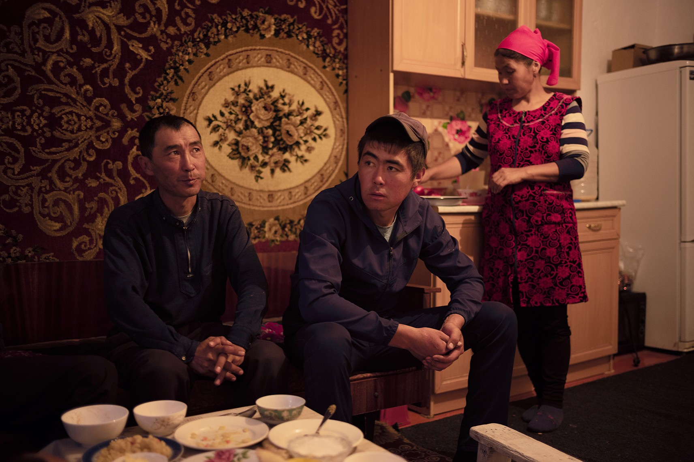

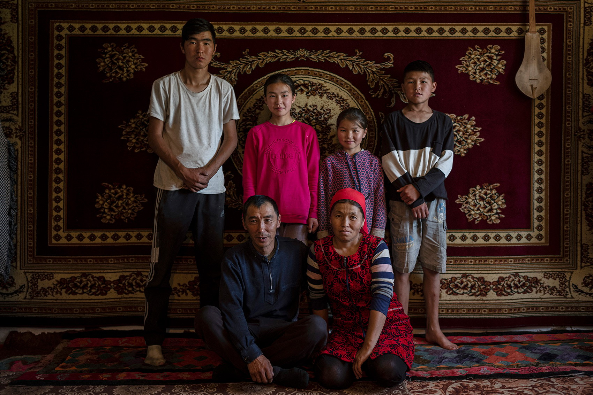

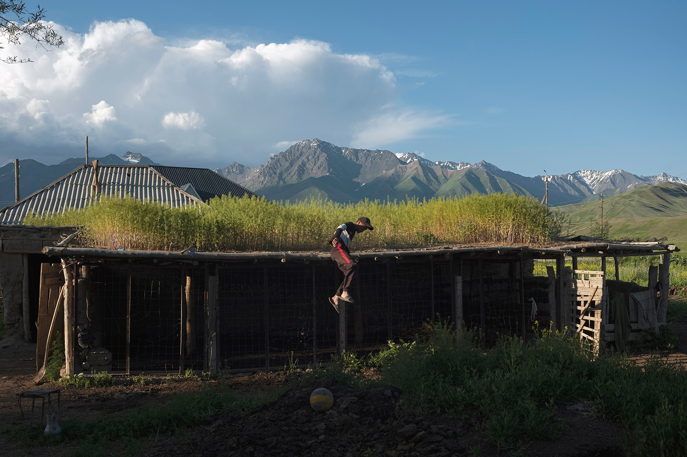

**Lifting the veil** (_from top to bottom_) Nurlan Akunov abducted Boldukan Isaeva when she was 16. Akunov had been searching for a bride who could tend to his livestock. The couple have four children and live in Naryn, the largest and poorest province in Kyrgyzstan

揭开面纱（从上到下）Nurlan Akunov 在 Boldukan Isaeva 16 岁时绑架了她。Akunov 一直在寻找可以照料他的牲畜的新娘。这对夫妇有四个孩子，住在吉尔吉斯斯坦最大和最贫穷的纳伦省

Except for Burulai. Fearing what Marsbek might do, she moved in with Aiperi, who lived on the other side of town. She wouldn’t go to class unless her boyfriend drove her. When he proposed to her, Burulai said yes, even though she’d originally hoped to marry after she finished her studies. The couple performed an engagement ceremony called _soiko saluu_, “putting on the earrings”, and the wedding was scheduled for the end of August, a couple of weeks after Burulai would turn 20.

除了布鲁莱。由于担心 Marsbek 会做出什么事，她搬去和住在镇子另一边的 Aiperi 住在一起。除非她的男朋友开车送她，否则她不会去上课。当他向她求婚时，布鲁莱答应了，尽管她原本希望完成学业后结婚。这对夫妇举行了一个名为 soiko saluu 的订婚仪式，“戴上耳环”，婚礼定于 8 月底举行，也就是 Burulai 满 20 周岁之后的几周。

Connubial theft appears in Mayan legends, the Indian epic of “Ramayana”, Homer’s “Iliad” and in the founding myths of Rome: Romulus and his followers abducted 30 women to create the city’s first families. The average Kyrgyz will tell you that bride abduction in the country emerged from the harsh conditions of ancient nomadic life. Yet there is no mention of the practice in the 500,000-line epic poem about a ninth-century mythological warrior called Manas that constitutes the centrepiece of Kyrgyz literature.

夫妻间盗窃出现在玛雅传说、印度史诗《罗摩衍那》、荷马的《伊利亚特》和罗马的建国神话中：罗穆卢斯和他的追随者绑架了 30 名妇女，建立了这座城市的第一个家庭。普通的吉尔吉斯人会告诉你，该国的新娘绑架事件源于古代游牧生活的恶劣条件。然而，在构成吉尔吉斯文学核心作品的 500,000 行史诗中，却没有提及这种做法。

Arranged marriages were the norm for Turkic tribes that roamed the Silk Road. As elsewhere, families chose their children’s spouses for economic and political reasons – love was a lucky accident. In the early 20th century, when the Soviet Union absorbed Kyrgyzstan and its neighbours, women were given the right to vote, divorce, terminate a pregnancy and, at least on paper, to choose a spouse. Consensual civic unions became the only legally recognised form of marriage.

包办婚姻是漫游丝绸之路的突厥部落的常态。与其他地方一样，家庭出于经济和政治原因选择孩子的配偶——爱情是一种幸运的意外。 20 世纪初，当苏联吞并吉尔吉斯斯坦及其邻国时，妇女被赋予了投票权、离婚权、终止妊娠权，以及至少在纸面上选择配偶的权利。自愿的公民结合成为唯一合法承认的婚姻形式。

References to _ala-kachuu_ first appeared in ethnographic documents in the 1940s. Two sociologists, an American and a Kyrgyz, theorised in an academic paper in 2007 that _ala-kachuu_ gained traction to help people move from an arranged model of marriage to a consensual one. It was a nod to old ways – an imitation of a traditional but rare practice – yet still based on the wishes of a couple.

对 ala-kachuu 的引用首次出现在 1940 年代的民族志文件中。两位社会学家，一位美国人和一位吉尔吉斯人，在 2007 年的一篇学术论文中提出理论，ala-kachuu 获得了吸引力，可以帮助人们从包办婚姻模式转变为双方自愿婚姻模式。这是对旧方式的一种认可——模仿一种传统但罕见的做法——但仍然基于一对夫妇的意愿。

Other scholars have speculated that _ala-kachuu_ became more common after the collapse of the Soviet Union when, after 120 years of Russian and communist rule, the newly independent republic sought to reclaim its Kyrgyz identity. All kinds of traditions, or supposed traditions, were revived, including men wearing _ak kalpaks,_ peaked white felt hats that represented the region’s snow-covered mountains; sports such as _kok boru,_ in which teams on horseback battle to grab the carcass of a dead goat; and a fermented drink made of grains called _maksym_. Was _ala-kachuu_ another such tradition?

其他学者推测，在苏联解体后，在经过 120 年的俄罗斯和共产主义统治后，新独立的共和国试图恢复其吉尔吉斯身份，阿拉卡丘语变得更加普遍。各种各样的传统，或者所谓的传统，都得到了恢复，包括戴着 ak kalpaks 的男人，尖顶的白色毡帽代表了该地区白雪皑皑的山脉；像kok boru这样的运动，骑马的队伍为抢夺死山羊的尸体而战；还有一种用谷物制成的发酵饮料，叫做 maksym。 ala-kachuu 是另一个这样的传统吗？

Most kidnappings begin with the woman being shoved into a car – you can see grainy videos of it on YouTube

大多数绑架都是从女人被推上车开始的——你可以在 YouTube 上看到它的模糊视频

The economic and political chaos sparked by the shift to a market-based economy probably played a part, too. In 1992 inflation in Kyrgyzstan reached 2,000%; within a few years a quarter of the population was living below the subsistence line. Bride abduction takes place in a context of widespread violence against women in Kyrgystan. In a Georgetown University study in 2021, 13% of Kyrgyz women reported being subjected to violence by their partner in the previous year, among the highest in Central Asia. “Marriage is a sort of a contract,” Altyn Kapalova, an artist and anthropologist, told me. “If you don’t have the means to come to an agreement, you can just go and take what you want. The state bodies cease protecting people because everything is in ruins.”

向市场经济转变引发的经济和政治混乱也可能起到了一定作用。 1992年吉尔吉斯斯坦的通货膨胀率达到2000%；几年之内，四分之一的人口生活在温饱线以下。绑架新娘发生在吉尔吉斯斯坦普遍存在暴力侵害妇女行为的背景下。在乔治敦大学 2021 年的一项研究中，13% 的吉尔吉斯女性报告称在前一年遭受过伴侣的暴力行为，在中亚地区名列前茅。 “婚姻是一种契约，”艺术家兼人类学家阿尔金·卡帕洛娃 (Altyn Kapalova) 告诉我。 “如果你没有办法达成协议，你可以去拿你想要的。国家机构不再保护人民，因为一切都成了废墟。”

Kapalova visited scores of villages in Kyrgyzstan during a decade of fieldwork. Did she, I asked, ever worry about being kidnapped? “Abducting some crazy researcher is just useless,” she said. Men choose their victims pragmatically, as labour units. A classmate of hers, the daughter of a shepherd, was kidnapped soon after graduating: “She studied art history but could milk nine cows in an evening.” Eventually, the former classmate escaped from her abductor-husband with her young daughter. When she returned to Bishkek, Kapalova said, “She recalled how, when he was hitting her and chasing her around the yard, her father-in-law would yell at his son: ‘Don’t touch her! If you kill her, who will do the housework?’”

卡帕洛娃在十年的实地考察中走访了吉尔吉斯斯坦的数十个村庄。我问她，她有没有担心被绑架？ “绑架一些疯狂的研究人员是没有用的，”她说。男人务实地选择他们的受害者，作为劳动单位。她的一个同学，牧羊人的女儿，毕业后不久就被绑架了：“她学的是艺术史，但一个晚上能挤九头奶牛。”最终，这位前同学带着年幼的女儿逃离了绑架她的丈夫。当她回到比什凯克时，卡帕洛娃说，“她回忆说，当他打她并在院子里追她时，她的公公会对他的儿子大喊：‘别碰她！如果你杀了她，谁来做家务？’”

The largest and poorest of Kyrgyzstan’s seven provinces is Naryn, a harsh region with more sheep than people, where winter temperatures drop to -30°C. There I met Nurlan Akunov, who abducted his bride, Boldukan Isaeva, when she was 16; they have now been married for 17 years.

吉尔吉斯斯坦七个省份中最大和最贫穷的是纳伦，这是一个羊多于人的严酷地区，冬季气温降至 -30°C。在那里，我遇到了 Nurlan Akunov，他绑架了 16 岁的新娘 Boldukan Isaeva；他们现在已经结婚 17 年了。

The couple talked to me both separately and together over endless cups of tea with cream and strawberry jam in their kitchen-cum-bedroom. Boldukan was slender and tanned, with wide, freckled cheekbones and black hair tucked beneath a bright-red headscarf. Nurlan was even skinnier, and had countless burn-scars on his arms and legs, a tribute to his trial-and-error method of fixing his ageing tractor and two cars he used for his local taxi service.

这对夫妇在他们的厨房兼卧室里喝着无数杯加奶油和草莓酱的茶，分别和我一起聊天。 Boldukan 身材苗条，皮肤黝黑，宽阔的颧骨上长着雀斑，黑色的头发盘在一条鲜红色的头巾下。 Nurlan 甚至更瘦，他的胳膊和腿上有无数烧伤疤痕，这是对他修理老化拖拉机和他用于当地出租车服务的两辆汽车的反复试验方法的致敬。

Nurlan told me that he had spent almost a decade searching for a bride who could tend the livestock, cope with the rough, remote conditions and care for his ailing grandfather. Boldukan lived on the next dirt-road over from his, but he didn’t consider courting her, largely because she was [nine years younger than him](https://www.economist.com/1843/2017/06/26/whats-the-best-age-gap-in-a-relationship).

Nurlan 告诉我，他花了将近十年的时间寻找一位可以照料牲畜、应对艰苦、偏远的条件并照顾他生病的祖父的新娘。 Boldukan 住在他家隔壁的一条土路上，但他没有考虑追求她，主要是因为她比他小九岁。

Most kidnappings begin with a woman being shoved into a car – you can see grainy videos of such abductions on YouTube – and so it was with Boldukan. After being plied with vodka, a distant relative of Boldukan’s agreed to lure her out of her house. Soon she was heading off in a car with five drunk men. A terrified Boldukan hoped her older brother would rescue her. “If you get married very young, you won’t see or learn anything. [I really wanted to study](https://www.economist.com/1843/2018/03/05/a-wife-less-ordinary).”

大多数绑架案都是从一名妇女被推上车开始的——你可以在 YouTube 上看到此类绑架案的模糊视频——Boldukan 也是如此。在喝了伏特加之后，Boldukan 的一位远房亲戚同意引诱她离开她的房子。很快，她就和五个喝醉的男人一起乘车离开了。一个害怕的 Boldukan 希望她的哥哥能救她。 “如果你很早就结婚了，你将看不到或学到任何东西。我真的很想学习。”

When the party arrived at the home of Nurlan’s uncle in Bishkek, 400km away, the older man put several copies of the Koran on the floor by Boldukan’s feet. To leave she’d have to step over the Holy Book and stain her soul. One of the men intoned a Kyrgyz proverb often used on kidnapped brides – “The stone is heavy in a place of falling” – in essence imploring her to go with the flow, to stay where she was. As Boldukan knew, many Kyrgyz considered it shameful to return home after being kidnapped, akin to losing your virginity.

当一行人到达 400 公里外 Nurlan 叔叔在比什凯克的家时，老人将几本古兰经放在 Boldukan 脚边的地板上。要离开，她必须跨过圣书，玷污她的灵魂。其中一名男子朗诵了一句经常用于被绑架新娘的吉尔吉斯谚语——“石头在坠落的地方很重”——本质上是在恳求她顺其自然，留在原地。正如博尔杜坎所知，许多吉尔吉斯人认为被绑架后回家是可耻的，就像失去童贞一样。

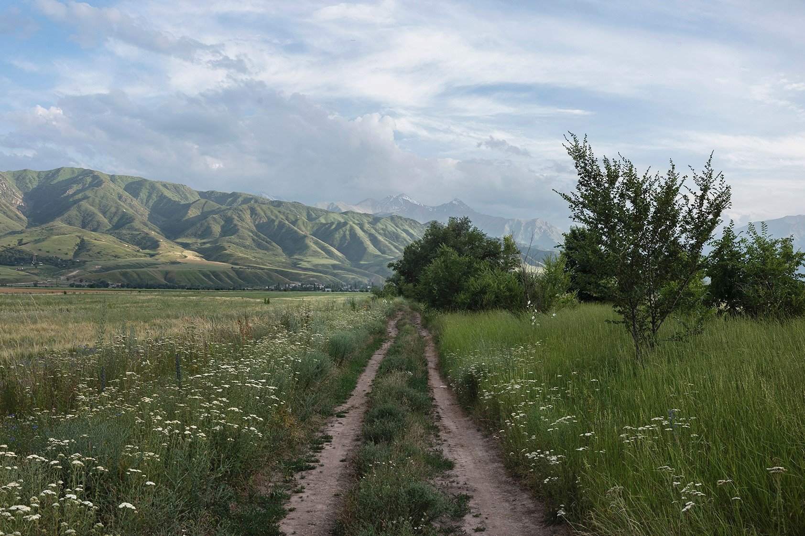

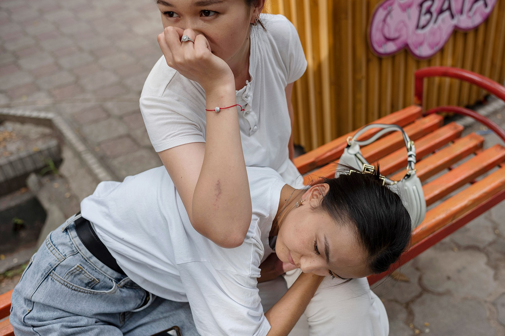

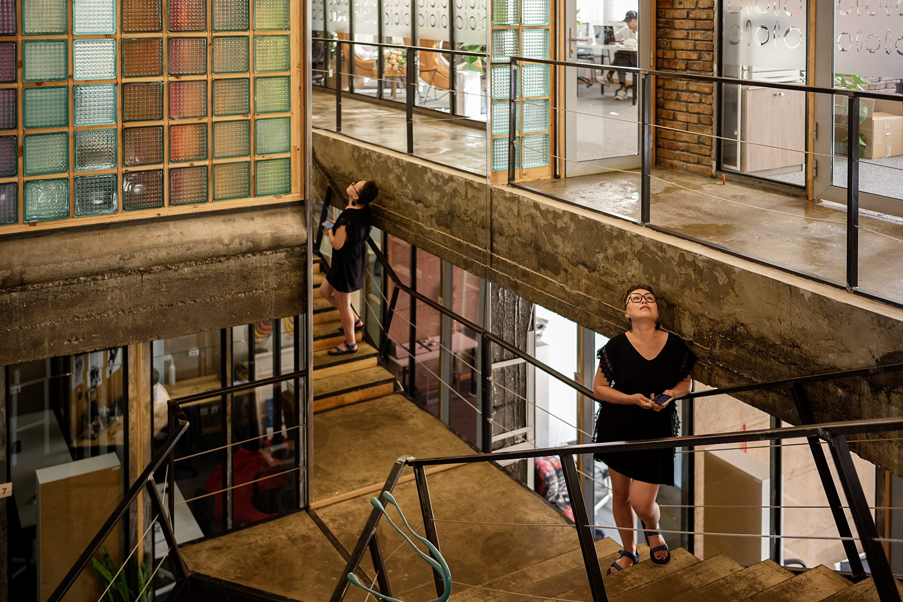

**Marriage of inconvenience** (_from top to botto_m) Burulai’s family had hoped for a better life in Bishkek. In 2021 Aizada Kanatbekova was abducted in broad daylight on the outskirts of Bishkek and later killed. In Kyrgyzstan, marriage is still seen as the pinnacle of a woman’s life. Altyn Kapalova, a researcher, doesn’t worry about being kidnapped

不便的婚姻（从上到下） Burulai 的家人曾希望在比什凯克过上更好的生活。 2021 年，Aizada Kanatbekova 在光天化日之下在比什凯克郊区被绑架，随后被杀害。在吉尔吉斯斯坦，婚姻仍然被视为女性人生的巅峰之作。研究员 Altyn Kapalova 不担心被绑架

She also worried about her family’s future. Her mother had died when she was 11, so she lived with her grandparents and her older brother’s family. Her brother had offered to sell his only cow to pay for her to attend the local teachers’ college, but she didn’t think the family could survive without it. When her brother turned up two days later, he told her she could make up her own mind – which is how Boldukan ended up graduating not from Naryn Teachers College, Nurlan joked to me, but from “Women’s Kitchen University”. Within a year, she gave birth to their [first son](https://www.economist.com/1843/2016/05/03/are-sons-the-secret-to-a-long-lasting-marriage); they now have four children.

她还担心家人的未来。她的母亲在她 11 岁时去世，因此她与祖父母和哥哥一家生活在一起。她的哥哥曾提出卖掉他唯一的一头牛来支付她上当地师范学院的费用，但她认为没有它这个家庭就无法生存。两天后，当她哥哥出现时，他告诉她，她可以自己做决定——这就是 Boldukan 最终不是从 Naryn 师范学院毕业的原因，Nurlan 跟我开玩笑说，而是从“女子厨房大学”毕业。一年之内，她生下了他们的第一个儿子。他们现在有四个孩子。

Boldukan recounted her kidnapping dispassionately, as though telling someone else’s story. But when Nurlan went outside to repair one of his vehicles**,** she confided that she wanted her two girls, then aged five and nine, to marry men they loved and who they found themselves. “Even if it would be the end of me, I won’t let them be married off because somebody else wants it,” she said, her voice suddenly firm.

Boldukan 冷静地讲述了她被绑架的经历，就像在讲述别人的故事一样。但当 Nurlan 出去修理他的一辆车时，她吐露说她希望她的两个女儿，分别是 5 岁和 9 岁，嫁给她们所爱的男人，她们找到了自己。 “即使这将是我的末日，我也不会因为别人想要而让他们结婚，”她说，她的声音突然变得坚定。

Yet, later in our conversation, she sounded less sure about the benefits of choosing your husband. A close friend of hers had married a man she loved, but he ended up cheating on her and abusing her. Boldukan’s husband was sober, they didn’t fight, and her children were safe and by her side. She was happy with her life, she told me. Did it really matter how her marriage started?

然而，在我们谈话的后期，她似乎不太确定选择你丈夫的好处。她的一个好朋友嫁给了一个她爱的男人，结果他却背叛了她，虐待了她。 Boldukan 的丈夫很清醒，他们没有打架，她的孩子也很安全，就在她身边。她对自己的生活很满意，她告诉我。她的婚姻如何开始真的很重要吗？

Among the dozens of abductees I spoke to, the woman whose circumstances differed most from Boldukan’s, at least superficially, was Zarima Koichumanova. Zarima worked at an organisation aiding rural women and young people, and her mother had spent the past decade helping women found small businesses and participate in local politics.

在与我交谈过的数十名被绑架者中，至少从表面上看，情况与 Boldukan 的情况最不同的女人是 Zarima Koichumanova。扎里玛 (Zarima) 在一家帮助农村妇女和年轻人的组织工作，她的母亲在过去十年里一直在帮助妇女创办小企业并参与地方政治。

In 2003 a family from a nearby village contacted Zarima’s parents to arrange a marriage with their son Aidin. Though Zarima’s parents told her they didn’t want to force anything on her, at 23 they thought it was time she found a mate. After meeting her potential husband, Zarima declined the proposal; she thought Aidin seemed sullen and brusque. When he asked to meet her again, her parents urged her to give him another chance.

2003 年，附近村庄的一户人家联系 Zarima 的父母，为他们的儿子 Aidin 安排婚事。虽然 Zarima 的父母告诉她，他们不想强迫她做任何事情，但在她 23 岁时，他们认为是时候找个伴侣了。在见到她未来的丈夫后，扎里玛拒绝了求婚。她认为艾丁看起来阴沉而粗鲁。当他要求再次见到她时，她的父母敦促她再给他一次机会。

Following some desultory small talk, Aidin told Zarima he’d drive her home. Instead, he speeded over to his family’s place. There, about a dozen people surrounded her and forced her inside, kicking and screaming. Her would-be mother-in-law, along with some other women, pinned down Zarima’s hands and forced the white scarf of a newlywed onto her head. She ripped it off. They tried again and she again pulled it away. Eventually, she gave up, exhausted. She was sure her father would come for her.

在闲聊了几句之后，艾丁告诉扎里玛他会开车送她回家。相反，他加速前往他家人的住处。在那里，大约有十几个人围住了她，将她强行推到里面，又踢又叫。她的准婆婆和其他几个女人一起按住扎里玛的手，把新婚的白围巾强行戴在她头上。她撕掉了它。他们又试了一次，她又把它拉开了。最终，她放弃了，筋疲力尽。她确信她的父亲会来接她。

She was happy with her life. Did it really matter how her marriage started?

她对自己的生活很满意。她的婚姻如何开始真的很重要吗？

About three hours later, Zarima’s uncle arrived instead and handed her a letter from her mother. Despite being an advocate for women’s rights, in two short paragraphs her mother instructed her daughter to marry Aidin. Her grandfather had added a postscript requesting the same. “My grandfather’s plea destroyed all my hope,” Zarima told me, her voice cracking, “because I never turned him down.”

大约三个小时后，Zarima 的叔叔来了，递给她一封她母亲的信。尽管她是妇女权利的倡导者，但她的母亲在短短的两段中指示她的女儿嫁给艾丁。她的祖父添加了一个请求相同的后记。 “祖父的恳求摧毁了我所有的希望，”扎里玛 (Zarima) 的声音沙哑地告诉我，“因为我从未拒绝过他。”

Though Zarima felt she had no choice but to go ahead with the wedding, she naively assumed that she wouldn’t have to have sex with her husband, she said. Aidin tried to wrestle her into bed, leaving her arms covered in bruises, until she threatened him with a kitchen knife. “He stopped, but every night I went to bed fully clothed and couldn’t sleep because I expected he might rape me.”

扎里玛说，尽管她觉得自己别无选择，只能继续举行婚礼，但她天真地认为自己不必与丈夫发生性关系。艾丁试图把她摔到床上，结果她的胳膊上全是瘀伤，直到她用菜刀威胁他。 “他停了下来，但每天晚上我都穿着衣服上床睡觉，无法入睡，因为我预计他可能会强奸我。”

Aidin’s mother berated Zarima for not performing her wifely duties. When that didn’t work, she asked Zarima’s parents to intervene. Her father had initially felt powerless to defy his own father**,** but now asked his wife to find out what was happening. The newlyweds met up with their mothers and Zarima’s mother chastised her counterpart: “Since when does a bride’s mother put her daughter into a groom’s bed!” She asked to speak privately with her daughter, but after only a few minutes Aidin’s mother barged in, grabbing the young woman by the arm to take her away. Zarima’s mother had seen enough. They were going, she told her daughter.

艾丁 (Aidin) 的母亲斥责扎里玛 (Zarima) 没有履行妻子的职责。当这不起作用时，她请求 Zarima 的父母进行干预。她的父亲起初觉得无力反抗自己的父亲，但现在要求他的妻子弄清楚到底发生了什么。新婚夫妇见了他们的母亲，扎里玛的母亲训斥了对方：“新娘的母亲什么时候把女儿放到新郎的床上了！”她要求与女儿私下交谈，但几分钟后，艾丁的母亲闯进来，抓住年轻女子的手臂，将她带走。 Zarima 的母亲已经看够了。他们要走了，她告诉她的女儿。

For months afterwards, Zarima said she had nightmares in which she begged Aidin to let her go. But she didn’t tell anyone. After she returned home, the family never discussed her abduction. Zarima’s mother had once been one of the women in her village who was regularly tapped to urge kidnapped women to marry. “They call women who know how to persuade others: skilled psychologists who understand the right words to make a bride stay,” she told me. “They ask: ‘Please put a scarf on her so that she will be a good daughter-in-law like you.’” Zarima’s mother considered the requests a token of respect, and if she’d refused, “people wouldn’t have understood”. She had been abducted, aged 19, though she considered it an elopement because she had been dating her future husband for two years.

几个月后，Zarima 说她做了噩梦，梦里她恳求 Aidin 放过她。但她没有告诉任何人。回家后，家人再也没提过她被拐的事情。 Zarima 的母亲曾经是村里的妇女之一，经常被要求敦促被绑架的妇女结婚。 “她们把懂得如何说服别人的女人称为：熟练的心理学家，她们懂得用正确的词来让新娘留下来，”她告诉我。 “他们问：'请给她戴上一条围巾，这样她就会像你一样成为一个好儿媳。'”Zarima 的母亲认为这些请求是一种尊重的象征，如果她拒绝了，“人们就不会明白了”。她在 19 岁时被绑架，尽管她认为这是私奔，因为她已经和未来的丈夫约会了两年。

It took her daughter’s traumatic experience for her to appreciate the cruelty of _ala-kachuu_. She started talking to local women about the abusive and pseudo-traditional nature of the practice. My own mother, an academic and women’s rights advocate who once brought Zarima’s mother to speak at a panel on violence against women in New York, explained her contemporary’s blind spot to me: “She wasn’t even conscious that she followed those patriarchal values. If Zarima’s abductors had, say, told her that they planned to sell Zarima into slavery, the whole family would have run to save her. But this was about marriage – something good.”

直到女儿经历了痛苦的经历，她才意识到 ala-kachuu 的残忍。她开始与当地妇女谈论这种做法的虐待和伪传统性质。我自己的母亲是一名学者和妇女权利倡导者，她曾经带 Zarima 的母亲在纽约的一个关于暴力侵害妇女行为的座谈会上发言，她向我解释了她同时代人的盲点：“她甚至没有意识到自己遵循了那些父权价值观。如果绑架 Zarima 的人告诉她，他们计划将 Zarima 卖为奴隶，那么全家人都会跑去救她。但这是关于婚姻的——一件好事。”

It’s still something of a mystery how Marsbek Bodoshev managed to kill Burulai when there were police officers all around. An hour after Marsbek and his friend dragged her into his car outside the grocers, traffic cops caught up with them 60km from the capital. The officers took the three of them to a police station and informed Burulai’s family that they’d found their daughter. The two abductors were left in a yard by the building, with one guard and no restraints. Burulai waited inside for her parents.

Marsbek Bodoshev 是如何在周围全是警察的情况下杀死 Burulai 的，这仍然是一个谜。在马斯贝克和他的朋友把她拖到杂货店外的车里一小时后，交通警察在距离首都 60 公里的地方追上了他们。警察将三人带到派出所，并通知布鲁莱的家人他们找到了女儿。两名绑匪被留在大楼旁边的院子里，只有一名警卫，没有任何束缚。布鲁莱在里面等着她的父母。

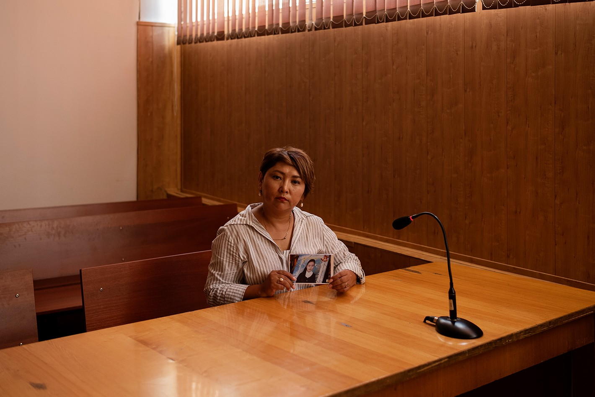

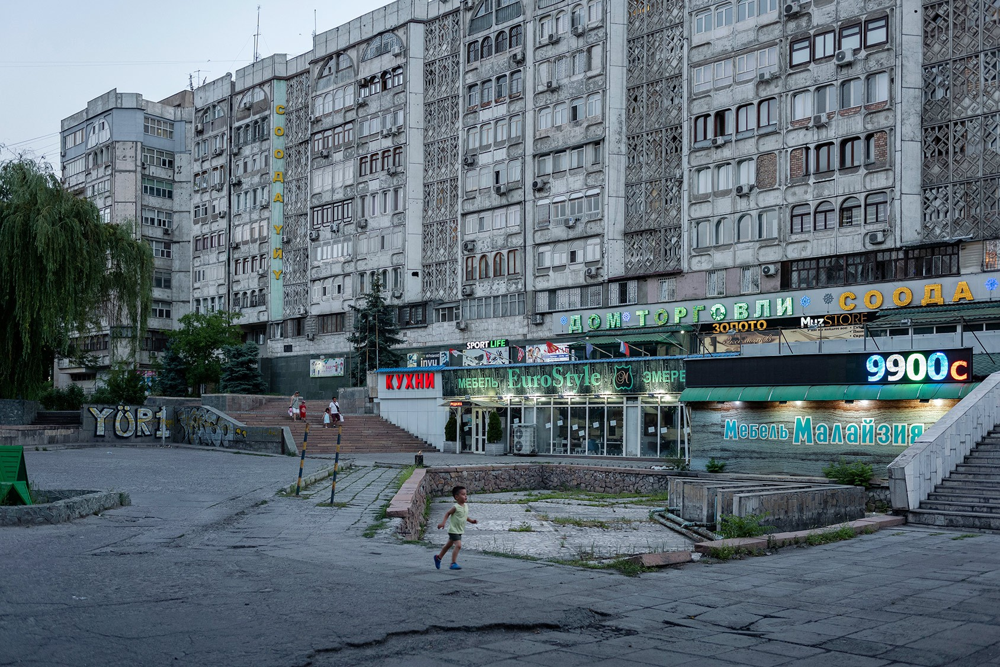

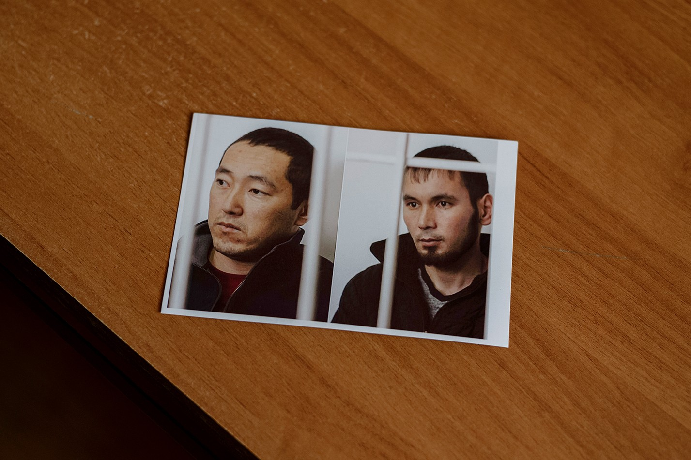

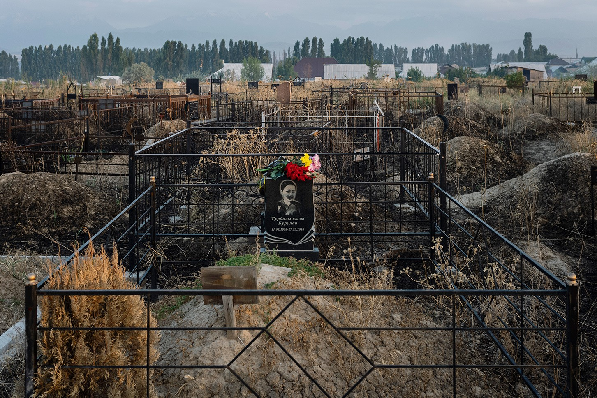

**Groomed** (_from top to bottom_) A lawyer represented Burulai’s family at the trial in which Bodoshev was sentenced to 20 years in prison. Kyrgyzstan declared independence from the Soviet Union in the early 1990s. Bodoshev kidnapped Burulai with the help of a friend. Some had hoped that her death might signify a turning point in attitudes towards bride abduction

修饰（从上到下）一名律师代表 Burulai 的家人参加了 Bodoshev 被判处 20 年监禁的审判。吉尔吉斯斯坦于 1990 年代初宣布脱离苏联独立。 Bodoshev 在朋友的帮助下绑架了 Burulai。一些人曾希望她的死可能标志着对新娘绑架态度的转折点

A little after midnight, a detective heard a piercing shriek. The guard and detective ran into the station, but the door to the room where Burulai had been was locked from the inside. They could hear her screaming. By the time the detective kicked down the door, the room was silent. Burulai lay on the floor, blood dripping from her mouth and a burgundy stain spreading across her chest. Marsbek was beside her with blood all over his stomach, having apparently stabbed himself.

午夜过后不久，一名侦探听到了刺耳的尖叫声。警卫和侦探跑进了车站，但布鲁莱所在房间的门从里面反锁了。他们能听到她的尖叫声。当侦探踢开门时，房间里一片寂静。布鲁莱躺在地板上，鲜血从她的嘴里滴下来，一块紫红色的污渍在她的胸口扩散开来。马斯贝克在她身边，肚子上全是血，显然是刺伤了自己。

The murder of Burulai attracted so much attention that Kyrgyzstan’s president instructed the prime minister personally to oversee the investigation. In December 2018 Marsbek, who had survived the stabbing, was sentenced to 20 years in prison for abducting Burulai twice and murdering her. His defence was that he’d blacked out: the last thing he recalled telling Burulai, he said during his trial, was “Hey, tell your father that you came with me by choice.”

布鲁莱遇害事件引起了极大关注，以至于吉尔吉斯斯坦总统亲自指示总理监督调查。 2018 年 12 月，在刺伤中幸存下来的马尔斯贝克因两次绑架布鲁莱并谋杀她而被判处 20 年徒刑。他的辩护是他已经昏过去了：他记得在审判期间告诉 Burulai 的最后一件事是“嘿，告诉你父亲你是自愿和我一起来的。”

Burulai’s father, who still castigates himself for ignoring Marsbek’s threats, told me he’d been buoyed during the trial by a lawyer’s suggestion that his daughter’s name, the “turning moon”, might signify a turning point in the country’s attitude towards bride abduction. He lost faith after the policemen were let off so easily. At best they were sloppy in their dealings with Marsbek – not only did they allow him to slip their grasp, they later reportedly lost the videotape of the yard and failed to collect fingerprints from the knife and crime scene. Though five officers were fired, none faced criminal penalties.

Burulai 的父亲仍在为无视 Marsbek 的威胁而自责，他告诉我，在审判期间，一位律师的建议让他感到鼓舞，他女儿的名字“转弯的月亮”可能标志着该国对新娘拐卖态度的一个转折点。在警察如此轻易地被放过后，他失去了信心。充其量他们在与 Marsbek 打交道时草率——他们不仅让他失去了控制，据报道他们后来丢失了院子的录像带，也没有从刀和犯罪现场收集指纹。尽管有五名警察被解雇，但没有人受到刑事处罚。

Marsbek’s conviction seemed to herald no larger change in handling such cases, nor in attitudes. A Kyrgyz legislator proposed building a monument to Burulai in front of the Ministry of Internal Affairs, but another official questioned the project: “In my opinion, the responsibility for the murder is also shared by her parents because it wasn’t the first time she was abducted.” No statue was erected.

Marsbek 的定罪似乎预示着处理此类案件或态度不会发生更大的变化。一名吉尔吉斯议员提议在内政部前为布鲁莱建造一座纪念碑，但另一名官员质疑该项目：“在我看来，谋杀的责任也由她的父母共同承担，因为这不是她第一次被绑架了。”没有竖立雕像。

Though the sentence for bride abduction is now the same as that for other kinds of kidnapping, the criminal-justice system remains lax. An investigation conducted in 2021 by Kloop, a news site based in Bishkek, found that only 14 of the 233 abductions reported to Kyrgyz police in 2019 went to trial. The following year even fewer did so: 11 out of 210. Although the law now classifies bride kidnapping as an “exceptionally aggravated” criminal offence, which means cases must be pursued even if the parties reconcile, police and court officers often let victims change their statements, a lawyer told Kloop. That way, abduction complaints can be reclassified and dismissed.

虽然现在对绑架新娘的判刑与其他类型的绑架相同，但刑事司法系统仍然松懈。位于比什凯克的新闻网站 Kloop 于 2021 年进行的一项调查发现，在 2019 年向吉尔吉斯斯坦警方报告的 233 起绑架事件中，只有 14 起进行了审判。第二年，这样做的人更少：210 人中有 11 人。虽然现在法律将抢亲归类为“特别严重”的刑事犯罪，这意味着即使双方和解也必须追究案件，但警察和法院官员经常让受害者改变他们的身份声明，一位律师告诉 Kloop。这样，绑架投诉可以重新分类并驳回。

“Without ala-kachuu, our girls will remain spinsters. They will become prostitutes”

“没有 ala-kachuu，我们的女孩将一直是老处女。他们将成为妓女”

Most _ala-kachuu_ cases that do go to court end in fines or suspended sentences. The exception tends to be if a woman dies, in which case the news goes viral. This happened again in April 2021 when a 27-year-old was kidnapped on her way to work in the capital. A man had stalked her for months, and she had decided to move to Turkey to escape him: her ticket was for the following week. When she disappeared, police officers told her mother not to worry, that she’d soon be dancing at her daughter’s wedding. Instead, a shepherd found her in a car parked in a field outside the city, raped and strangled to death. Her abductor lay next to her; he had killed himself.

大多数上法庭的 ala-kachuu 案件都以罚款或缓刑告终。例外情况往往是如果一名妇女死亡，在这种情况下，新闻会像病毒一样传播开来。这种情况在 2021 年 4 月再次发生，当时一名 27 岁的女孩在去首都工作的路上被绑架。一个男人跟踪了她几个月，她决定搬到土耳其躲避他：她的票是下周的。当她失踪时，警察告诉她的母亲不要担心，她很快就会在女儿的婚礼上跳舞。相反，一个牧羊人在一辆停在城外田野的汽车里发现了她，强奸并勒死了她。绑架她的人躺在她旁边；他自杀了。

In a minibus terminal just outside Bishkek I tracked down Marsbek’s brother Zholdoshbek, whom Burulai’s father had called after she was abducted. A wiry man in his late 30s, he eventually agreed to talk to me in the canteen while waiting for his next fare. Marsbek was one of six children, five boys and one girl – the mirror image of Burulai’s family – all of whom married through _ala-kachuu_, Zholdoshbek told me. He assumed his father had abducted his mother as well. This was an old tradition, he said. “A girl and a boy meet, and he doesn’t abduct her like a sheep. They get to talk. Then, if they hit it off, he abducts her.” He added: “Sometimes, the girl doesn’t agree, but if her parents agree, she stays. Men rarely abduct complete strangers.”

在比什凯克郊外的一个小巴总站，我找到了 Marsbek 的兄弟 Zholdoshbek，Burulai 的父亲在她被绑架后给他打电话。他 30 多岁，身材魁梧，最终同意在等下一顿饭时在食堂与我交谈。 Zholdoshbek 告诉我，Marsbek 是六个孩子之一，五个男孩和一个女孩——Burulai 家族的镜像——他们都是通过 ala-kachuu 结婚的。他认为他的父亲也绑架了他的母亲。他说，这是一个古老的传统。 “一个女孩和一个男孩相遇，他没有像羊一样绑架她。他们开始交谈。然后，如果他们一拍即合，他就会绑架她。”他补充说：“有时候，女孩不同意，但如果她的父母同意，她就会留下来。男人很少绑架完全陌生的人。”

The Kyrgyz language doesn’t have a word for “dating”. Zholdoshbek said he abducted his wife a decade earlier after a year of “talking”, a word that can mean anything from exchanging text messages to going to a party together or even having sex. Too much talking isn’t the norm in his community, he added: “Say, if my sister-in-law introduces me to you and I like you, that’s enough: I can take you.”

吉尔吉斯语没有“约会”一词。 Zholdoshbek 说，他在十年前绑架了他的妻子，经过一年的“谈话”，这个词可以指从交换短信到一起去参加派对甚至发生性关系的任何事情。他补充说，在他的社区里，多说话不是常态，“比如说，如果我嫂子把我介绍给你，而且我喜欢你，那就足够了：我可以带你去。”

Before I left the canteen, I met Ainura, the receptionist who assigns drivers their rides. A short-haired spark plug of a woman in her 40s, she told me she was kidnapped at 18. “When I got married, I didn’t know my husband. The second time I met him was in bed.” Bride abduction is acceptable, Ainura had decided, because it worked out for her.

离开食堂前，我遇到了为司机安排行程的接待员 Ainura。一个40多岁的短发女人，她告诉我她18岁被绑架了。“我结婚的时候，我不认识我的丈夫。”我第二次见到他是在床上。”绑架新娘是可以接受的，Ainura 决定了，因为这对她很有效。

At a neighbouring table, several drivers snacked on pastries while listening to our conversation. “I abducted my wife too, and she doesn’t complain,” a tall, bald man chimed in. He hadn’t been keen to marry, he said, but his mother insisted and personally found a woman for him to kidnap.

在邻桌，几位司机一边吃着糕点一边听着我们的谈话。 “我老婆也被我拐走了，她也没有怨言。”一个秃顶的高个男人附和道。他说，他本来不想结婚的，但他的母亲坚持要他亲自找一个女人让他拐走。

“I did it too,” another driver interjected. “It’s all fine now. We have five children.” I asked why he didn’t simply ask his wife to marry him. He paused briefly: “I didn’t want to bother. You just go, kidnap her, and that’s it.”

“我也做到了，”另一位司机插话说。 “现在一切都很好。我们有五个孩子。”我问他为什么不简单地向他的妻子求婚。他停顿了一下：“我不想打扰。你去吧，绑架她，就这样。”

A third driver complained that courting was a waste of time and money: you date a girl for five years, take her to restaurants, shower her with gifts and expensive holidays, and then she dumps you. Abducting is more practical. “Today’s girls – of your age – became more selfish,” the driver said, wagging his finger at me. “They live for themselves. After they give birth they don’t even need a man anymore.”

第三位司机抱怨说求爱是浪费时间和金钱：你和一个女孩约会五年，带她去餐馆，给她送礼物和昂贵的假期，然后她就甩了你。绑架更实际。 “现在的女孩——你这个年纪——变得更自私了，”司机一边说一边冲我摇着手指。 “他们为自己而活。她们生完孩子，就不再需要男人了。”

“Now that it’s been prohibited, how will our girls find husbands?” Ainura burst out. “Who will marry them? Without _ala-kachuu_, our girls will remain spinsters. They will become prostitutes.”

“现在被禁止了，我们的女孩子怎么找老公？”爱努拉爆发了。 “谁会嫁给他们？没有 ala-kachuu，我们的女孩将仍然是老处女。他们将成为妓女。”

When I was ready to go, Zholdoshbek arranged for me to catch the next jitney back to the city. The driver was a man in his 20s who’d sat quietly by himself the whole time I was there. I followed him outside. “Now _you_ will get abducted!” one of the other men called after me. He chuckled and waved goodbye.

当我准备出发时，Zholdoshbek 安排我搭下一班 jitney 回城。司机是一个 20 多岁的男人，在我在那里的整个过程中他一直一个人安静地坐着。我跟着他出了门。 “现在你会被绑架！”另一个男人在我身后叫道。他笑着挥手告别。

Sitting in the front row of the bus, I noticed that my driver wore a wedding band. After a moment of hesitation, I asked whether he had kidnapped his wife. “Of course not,” he said calmly, keeping his eyes on the road. “I asked her to marry me. Abducting is savage.” ■

坐在公共汽车的前排，我注意到我的司机戴着结婚戒指。犹豫了一下，我问他是不是绑架了他的妻子。 “当然不是，”他平静地说，眼睛一直盯着路面。 “我向她求婚了。绑架是野蛮的。”■

**Sevindj Nurkiyazova** is a freelance writer and film-maker who lives in Bishkek

Sevindj Nurkiyazova 是住在比什凯克的自由作家和电影制作人

PHOTOGRAPHS: **maxime fossat**  
摄影：maxime fossat  

The Economist today  
今日经济学家  

## Handpicked stories, in your inbox  
精心挑选的故事，在您的收件箱中  

A daily newsletter with the best of our journalism  
每日时事通讯与我们最好的新闻
