Mar 10th 2021  
2021 年 3 月 10 日  

By Nicolas Pelham  
尼古拉斯·佩勒姆  

Last summer a photograph of Syria’s First Lady circulated on social media. At the time, government troops in north-west Syria were battering the last pockets of rebel resistance to the regime. The picture showed Asma Assad, her husband Bashar al-Assad and their three children standing on a wind-swept hilltop, flanked by soldiers in camouflage. Bashar, dressed in an anorak, trainers and an untucked polo shirt, looks more suited to corralling the kids for a Sunday walk than torturing dissidents. Asma stands more stiffly, arms by her sides, wearing white jeans, trainers and the kind of aviator sunglasses beloved of Middle Eastern strongmen. She is at the centre of the photo; Bashar, president of Syria, hangs awkwardly at her shoulder.

去年夏天，一张叙利亚第一夫人的照片在社交媒体上流传。当时，叙利亚西北部的政府军正在打击最后一批反抗政权的叛军。照片显示阿斯玛·阿萨德、她的丈夫巴沙尔·阿萨德和他们的三个孩子站在一个被风吹过的山顶上，两侧是身着迷彩服的士兵。巴沙尔身穿连帽衫、运动鞋和一件敞开的马球衫，看起来更适合把孩子们围起来进行周日散步，而不是折磨持不同政见者。阿斯玛站得更加僵硬，双臂放在身体两侧，穿着白色牛仔裤、运动鞋和中东强人钟爱的那种飞行员太阳镜。她在照片的中央；叙利亚总统巴沙尔笨拙地靠在她肩上。

The tranquillity of the landscape behind Asma is deceptive. Ten years on from the Arab spring, in which millions of people across the Middle East turned on repressive regimes, Syria’s ruling family has retained power – but at a terrible cost.

阿斯玛背后风景的宁静是骗人的。阿拉伯之春十年后，中东地区数以百万计的人转向专制政权，叙利亚的统治家族保留了权力——但付出了可怕的代价。

The regime’s forces have killed hundreds of thousands of Syrians, and tortured more than 14,000 people to death. Half the population have fled their homes, precipitating the greatest refugee crisis since the second world war. Iran and Turkey, as well as America and Russia, have fought proxy battles for influence on Syrian soil. Throughout the Arab world the hopeful dreams of a decade ago have been crushed, but nowhere more bloodily than in Syria.

该政权的军队杀害了数十万叙利亚人，并用酷刑折磨致死 14,000 多人。一半的人口逃离家园，引发了二战以来最严重的难民危机。伊朗和土耳其，以及美国和俄罗斯，都在争夺对叙利亚领土的影响力。在整个阿拉伯世界，十年前充满希望的梦想已经破灭，但没有比叙利亚更血腥的了。

Asma, however, is more powerful than she has ever been. Her journey to supremacy over this devastated land has been a winding one, and the road is littered with her many incarnations: a J.P. Morgan banker cutting late-night deals; the glamorous First Lady who thought social reform and sharp tailoring would modernise a pariah state; the Marie Antoinette of Damascus, shopping as her country burned; mother to the nation, battling cancer while her husband’s troops crushed insurgents.

然而，阿斯玛比以往任何时候都更强大。她在这片被摧毁的土地上取得霸权的旅程是曲折的，这条路充满了她的许多化身：摩根大通银行家进行深夜交易；迷人的第一夫人认为社会改革和锐利的剪裁将使一个贱民国家现代化；大马士革的玛丽·安托瓦内特在她的国家燃烧时购物；国家的母亲，在丈夫的军队镇压叛乱分子的同时与癌症作斗争。

“She was very English and seemed to want to have nothing to do with Syria”

“她非常英国化，似乎不想与叙利亚有任何关系”

Where will the journey end? Her ascendance in the court of the Assads is no longer just fodder for gossiping Syria watchers. Last year the American government described Asma as one of Syria’s “most notorious war profiteers”. There are now whispers that she could one day succeed her husband as president. Asma Assad has certainly come a long way from the pebble-dash, semi-detached house in London where she was raised.

旅程将在哪里结束？她在阿萨德宫廷中的崛起不再只是八卦叙利亚观察家的素材。去年，美国政府将阿斯玛描述为叙利亚“最臭名昭著的战争奸商”之一。现在有传言说她有朝一日可以接替她的丈夫成为总统。阿斯玛·阿萨德 (Asma Assad) 与她在伦敦长大的鹅卵石破败的半独立式住宅相比，无疑已经走了很长一段路。

It was an unlikely beginning for a dictator’s wife. Asma Akhras was born in 1975 in Acton, a nondescript pocket of west London bordering far wealthier neighbourhoods. Like most Syrians her parents are Sunni Muslims, the dominant group in Syria until the 1960s, when a small, marginalised sect called the Alawites staged a coup. Bashar's father, Hafez Assad, was part of the plot, and declared himself leader in 1970.

对于独裁者的妻子来说，这是一个不太可能的开始。阿斯玛·阿赫拉斯 (Asma Akhras) 于 1975 年出生在阿克顿 (Acton)，这是伦敦西部一个不起眼的地区，毗邻富裕的街区。和大多数叙利亚人一样，她的父母是逊尼派穆斯林，在 1960 年代之前一直是叙利亚的主导群体，当时一个被边缘化的小教派阿拉维派发动了政变。巴沙尔的父亲哈菲兹·阿萨德是阴谋的一部分，并于 1970 年宣布自己为领导人。

Asma’s parents arrived in London in the 1970s in search of better opportunities. The family remained religious in exile: her father attended Friday prayers and her mother discarded her hijab only after Asma married. Friends describe the family as culturally conservative but eager for their children to assimilate. At her local Church of England primary school Asma was known as Emma. “You’d be hard-pressed to recognise her as a Syrian,” a neighbour recalled.

阿斯玛的父母在 1970 年代抵达伦敦寻找更好的机会。这个家庭在流亡期间仍然保持宗教信仰：她的父亲参加了周五的祈祷，她的母亲在阿斯玛结婚后才丢掉了头巾。朋友们形容这个家庭在文化上很保守，但渴望孩子们融入其中。在她当地的英格兰教会小学，阿斯玛被称为艾玛。 “你很难认出她是叙利亚人，”一位邻居回忆道。

She seemed destined for a life among London’s monied elite. As a teenager Asma went to one of Britain’s oldest private girls’ schools, Queen’s College, a few doors down from her father’s private medical practice in Harley Street. She did a degree in computer science at King’s College London, where both friends and detractors recall her as clever and hard-working.

她似乎注定要在伦敦富有的精英阶层中生活。十几岁的时候，阿斯玛就读于英国最古老的私立女子学校之一——皇后学院，离她父亲在哈雷街的私人诊所只有几户之遥。她在伦敦国王学院获得了计算机科学学位，朋友和批评者都认为她聪明又勤奋。

No one remembers her showing any interest in the Middle East. On visits to Damascus with her parents she’d spend her time by the pool at the Sheraton hotel. “She was very English and seemed to want to have nothing to do with Syria,” said a family friend.

没有人记得她对中东表现出任何兴趣。在与父母一起访问大马士革时，她会在喜来登酒店的泳池边消磨时光。 “她非常英国化，似乎不想与叙利亚有任何关系，”一位家庭朋友说。

Few were surprised when she landed a job at J.P. Morgan, an investment bank. Staff were expected to work up to 48 hours on the trot, and even sleep in the office. Some trainees were brash and overtly ambitious but Paul Gibbs, who managed Asma, remembers her as “demure, polite and subservient”, dressed in prim black suits. Asma specialised in mergers and acquisitions (experience that later proved useful in Syria). She dated the odd banker and even had offers of marriage. Despite her ample salary, she continued to live with her parents while she was working in London.

当她在投资银行 J.P. Morgan 找到一份工作时，几乎没有人感到惊讶。员工预计要连续工作 48 小时，甚至还要睡在办公室里。一些实习生很傲慢，野心勃勃，但管理 Asma 的保罗吉布斯记得她“端庄、礼貌和顺从”，穿着朴素的黑色西装。 Asma 专门从事并购（后来在叙利亚证明有用的经验）。她和那个古怪的银行家约会，甚至有人向她求婚。尽管她的薪水丰厚，但她在伦敦工作期间继续与父母住在一起。

Her mother, Sahar, had ambitious plans for Asma. Her own great-uncle had helped Hafez Assad seize power. Sahar used this connection to get a job at Syria’s embassy in London. She was also keen to promote a match between Asma and Bashar, Hafez’s second son, according to Sam Dagher, author of "Assad Or We Burn the Country”. The two met several times when Bashar was a gangly medical student in London in the 1990s.

她的母亲萨哈尔 (Sahar) 为阿斯玛 (Asma) 制定了雄心勃勃的计划。她自己的叔祖父曾帮助哈菲兹·阿萨德夺权。萨哈尔利用这种联系在叙利亚驻伦敦大使馆找到了一份工作。据《阿萨德或我们烧毁国家》一书的作者萨姆·达格说，她还热衷于宣传阿斯玛和哈菲兹的次子巴沙尔之间的比赛。1990 年代，当巴沙尔在伦敦还是一名身材瘦削的医科学生时，两人见过几次面.

Bashar grew up in the shadow of his commanding father, and was the only one of six siblings to study abroad. Bashar’s distaste for blood led him to specialise in ophthalmology, one of the less prestigious medical disciplines. His tutor, Edmund Schulenburg, says he was adept at draining cysts.

巴沙尔在父亲的阴影下长大，是六个兄弟姐妹中唯一一个出国留学的人。巴沙尔对血液的厌恶使他专攻眼科，这是一个不太知名的医学学科。他的导师 Edmund Schulenburg 说他擅长引流囊肿。

Bashar’s distaste for blood led him to specialise in ophthalmology  
巴沙尔对血液的厌恶使他专攻眼科  

Bashar’s older brother, Basil, served in the Syrian army, drove fast cars and chased women. Bashar, by contrast, was “hard-working, punctual, went every day to college and avoided the wild life,” said Wafic Said, a wealthy Syrian expat. He listened to Phil Collins and the Electric Light Orchestra, drank green tea and cycled around town. Unlike his father, who retained a peasant brogue, Bashar spoke the refined lilt of the Damascene elite.

巴沙尔的哥哥巴兹尔在叙利亚军队服役，开快车，追女人。相比之下，巴沙尔“勤奋、准时，每天都上大学，远离野外生活，”富有的叙利亚侨民瓦菲克·赛义德 (Wafic Said) 说。他听菲尔·柯林斯 (Phil Collins) 和电灯乐团 (Electric Light Orchestra) 的音乐，喝绿茶，骑自行车在城里转转。与保留着农家土话的父亲不同，巴沙尔说着大马士革精英们优雅的轻快语调。

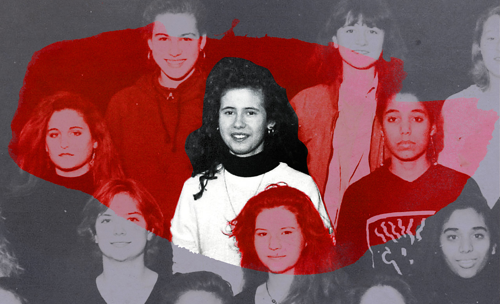

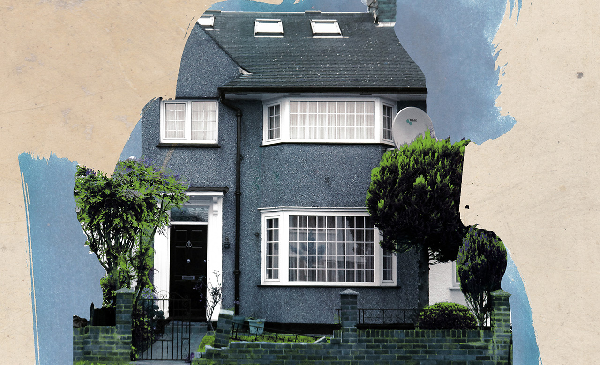

He did have an eye for women, often dating his brother’s manicured discards. But the choice of wife wasn’t his alone. When Basil died in a car crash in 1994 (reportedly while racing to Damascus airport in his Mercedes), the fate of the Assad dynasty suddenly fell on Bashar’s shoulders.

他确实对女人很有眼光，经常和他哥哥修剪整齐的丢弃物约会。但妻子的选择不是他一个人的。 1994 年巴兹尔死于车祸（据报道是在他的奔驰车前往大马士革机场时），阿萨德王朝的命运突然落在了巴沙尔的肩上。

Bashar was still unmarried when his father died in June 2000. He became president two months later, after a sham election. At this point, Asma had been chained to her desk at J.P. Morgan for two years. Suddenly she disappeared for three weeks without notice. On her return she told her employer that she’d been swept off her feet by a dashing Syrian, who whisked her off to Libya where he sealed the deal in a tent in the Sahara. Asma resigned immediately, also giving up a place she’d just won at Harvard Business School. An interviewer later asked her whether this choice left her with regrets. Her reply: “Who would choose Harvard over love?”

巴沙尔的父亲于 2000 年 6 月去世时，他仍未婚。两个月后，他在一次虚假选举后成为总统。此时，阿斯玛已经被锁在摩根大通的办公桌前两年了。突然间，她消失了三个星期，没有任何通知。回来后，她告诉她的雇主，她被一个潇洒的叙利亚人冲昏了头脑，后者把她带到了利比亚，在那里他在撒哈拉沙漠的一个帐篷里敲定了这笔交易。阿斯玛立即辞职，也放弃了她刚刚在哈佛商学院获得的名额。后来有采访者问她，这个选择是否让她后悔。她的回答是：“谁会选择哈佛而不是爱情？”

Syria becomes complicated when you leave the Sheraton hotel. Its mountains and deserts shelter a patchwork of ethnic and religious groups, most of which have oppressed each other at one time or another. France prised the country from the Ottomans, and its rule between the world wars was brief and resented. The early years of Syria’s independence were marked by relentless internal strife as coup followed coup.

离开喜来登酒店，叙利亚就变得复杂起来。它的群山和沙漠庇护着错落有致的种族和宗教团体，其中大多数人曾经或曾互相压迫过。法国将这个国家从奥斯曼帝国手中夺走，它在两次世界大战之间的统治是短暂的，并且引起了怨恨。叙利亚独立的早期以政变接二连三的无情内乱为标志。

The turmoil came to an end in 1970 with the ascent of Hafez Assad, an uncompromising air-force officer from the ruling Baath party. During his reign of fear the security services ran informant networks, tapped phones and tortured people indiscriminately. When Sunni Islamist dissidents rose up against Baathist rule in Hama in 1982, Hafez razed whole sections of the city to the ground.

1970 年，哈菲兹·阿萨德 (Hafez Assad) 上台后，这场动荡结束了。在他恐惧统治期间，安全部门运行线人网络、窃听电话并不分青红皂白地折磨人们。 1982 年，当逊尼派伊斯兰持不同政见者起来反对复兴党在哈马的统治时，哈菲兹将整个城市夷为平地。

Hafez was dead by the time Asma moved to Damascus at the end of 2000, but his legacy was ubiquitous, from the Soviet-style architecture to adulatory billboards bearing his face. His support for terrorist organisations across the region had cut off Syria from the West. Bashar’s ascendance was an opportunity to reset relations.

2000 年底阿斯玛搬到大马士革时，哈菲兹已经去世，但他的遗产无处不在，从苏联风格的建筑到印有他头像的阿谀奉承的广告牌。他对整个地区恐怖组织的支持切断了叙利亚与西方的联系。巴沙尔的上台是重新建立关系的机会。

In his inaugural speech, Bashar vowed to fight corruption and allow genuine multi-party elections. Soon after, he closed one of the country’s biggest prisons. In the cafés of Damascus, people cautiously began to discuss politics.

在他的就职演说中，巴沙尔发誓要打击腐败并允许真正的多党选举。不久之后，他关闭了该国最大的监狱之一。在大马士革的咖啡馆里，人们开始谨慎地讨论政治。

Asma seemed a promising consort for the new Syrian leader. Queen Rania of Jordan, Sheikha Moza of Qatar, even Princess Diana in Britain, all served as models for how a glamorous first lady might become a force for reform. Syria’s secularist Baath party made it more receptive than most Arab countries to women taking public roles. “I thought the combination of these two would make Syria a heaven,” said Wafic Said, a wealthy Syrian expat who befriended the couple.

对于新的叙利亚领导人来说，阿斯玛似乎是一个很有前途的配偶。约旦王后拉尼娅、卡塔尔的谢赫·莫扎，甚至英国的戴安娜王妃，都为魅力四射的第一夫人如何成为改革力量树立了典范。叙利亚的世俗复兴党使其比大多数阿拉伯国家更容易接受女性担任公共职务。 “我认为这两者的结合会让叙利亚成为天堂，”与这对夫妇成为朋友的富有的叙利亚侨民瓦菲克赛义德说。

But like many women before her, Asma had to reckon with her in-laws. Bashar’s mother, Anisa, had wanted her son to marry within the clan to create a long-lasting dynasty like the Sauds of Arabia. Some family members even suggested that Bashar should forfeit the presidency for marrying a Sunni.

但就像她之前的许多女性一样，阿斯玛不得不与她的公婆打交道。巴沙尔的母亲阿妮莎希望她的儿子在氏族内通婚，以建立一个像阿拉伯沙特王朝那样的持久王朝。一些家庭成员甚至建议巴沙尔因与逊尼派结婚而放弃总统职位。

Having failed to thwart the wedding, Bashar’s mother resolved to conceal it. There were no news bulletins about the low-key event. No official photos have ever been released. Asma was repeatedly told that her job was to produce heirs and stay out of the news. Bashar’s mother insisted on retaining the title “First Lady”; state media referred to Asma as _akilatu al-rais_, the president’s spouse. No one recognised her in the street.

由于未能阻止婚礼，巴沙尔的母亲决定隐瞒此事。没有关于这一低调事件的新闻公告。官方照片从未发布过。阿斯玛一再被告知，她的工作是培养继承人并远离新闻。巴沙尔的母亲坚持保留“第一夫人”的称号；官方媒体称阿斯玛为总统的配偶 akilatu al-rais。在街上没有人认出她。

“They kept her inside the house for years”  
“他们把她关在屋子里好多年了”  

Home life was miserable. “They hated her,” said Ayman Abdel Nour, an adviser to Bashar at the time. “They kept her inside the house for years.” Asma was not yet fluent in Arabic. When the family gathered for meals they made a point of conversing in their impenetrable Alawite patois.

家庭生活很悲惨。 “他们恨她，”时任巴沙尔顾问的艾曼·阿卜杜勒·努尔 (Ayman Abdel Nour) 说。 “他们把她关在屋子里好多年了。”阿斯玛的阿拉伯语还不是很流利。当一家人聚在一起吃饭时，他们特意用难以理解的阿拉维方言交谈。

The rest of the ruling elite was no friendlier. Bashar’s reforms faced roadblocks, particularly from his father’s former allies. “Hafez Assad was an octopus that controlled the tentacles,” said a businessman who works with the regime. “Bashar began as an octopus controlled by his tentacles.”

其余的统治精英也不友好。巴沙尔的改革面临障碍，尤其是来自他父亲的前盟友。 “哈菲兹·阿萨德是一只控制触手的章鱼，”一位与该政权合作的商人说。 “巴沙尔最初是一只被触手控制的章鱼。”

Within months it became clear that Bashar’s promises of reform were flimsy, made in part to bolster support for his succession. “Bashar would tell you exactly what you wanted to hear and then do absolutely nothing,” said Wafic Said. He soon backtracked. Academics were jailed. Posters of Bashar were put up, even bigger than those of his father. The right to public assembly became so restricted that couples had to get a government permit to hold a wedding in a hotel.

几个月后，很明显巴沙尔的改革承诺是站不住脚的，部分原因是为了加强对他继任的支持。 “巴沙尔会准确地告诉你你想听什么，然后什么都不做，”瓦菲克赛义德说。他很快就回过神来。学者被判入狱。巴沙尔的海报张贴起来，比他父亲的海报还要大。公众集会的权利受到如此严格的限制，以至于新人必须获得政府许可才能在酒店举行婚礼。

Hopes that Syria might change were repeatedly dashed. After the terrorist attacks of 9/11, Bashar provided the Americans with facilities in which to interrogate suspected terrorists, but the Bush administration had got a taste for “spreading democracy” and suggestions that Syria would be the next target after Iraq pushed Syria’s regime to change tack. Bashar dispatched homegrown jihadists across the border to support the Iraqi insurgency against the Americans.

希望叙利亚可能会改变的希望一再破灭。 9/11 恐怖袭击后，巴沙尔为美国人提供了审讯恐怖分子嫌疑人的设施，但布什政府已经尝到了“传播民主”的滋味，并暗示叙利亚将成为伊拉克推翻叙利亚政权后的下一个目标。改变策略。巴沙尔派遣本土圣战分子越过边境支持伊拉克反抗美国人的叛乱。

As Bashar cemented his power, Asma dutifully fulfilled the role of broodmare. She had three children in quick succession, two of them sons. She still dressed like a demure banker. The only time she made headlines was on trips abroad. Even then, her in-laws fumed.

随着巴沙尔巩固他的权力，阿斯玛尽职尽责地履行了母马的角色。她接连生了三个孩子，其中两个是儿子。她仍然穿得像个端庄的银行家。她唯一一次成为头条新闻是出国旅行。即便如此，她的公婆还是很生气。

The cruelty within the family was mirrored by its viciousness without. On Valentine’s Day 2005 a car-bomb killed one of Lebanon’s most prominent politicians, Rafik Hariri. Syria kept its small, dysfunctional neighbour on a tight leash and many assumed that Bashar had ordered the hit. Faced with the threat of international sanctions and massive Lebanese demonstrations, Bashar blinked. He withdrew Syrian troops from Lebanon after 30 years of occupation, infuriating Syrian hardliners.

家庭内部的残酷反映在家庭外部的恶毒上。 2005 年情人节，一场汽车炸弹炸死了黎巴嫩最著名的政治家之一拉菲克·哈里里 (Rafik Hariri)。叙利亚对这个功能失调的小邻国束手无策，许多人认为是巴沙尔下令发动袭击。面对国际制裁的威胁和黎巴嫩的大规模示威，巴沙尔眨了眨眼。在占领黎巴嫩 30 年后，他从叙利亚撤军，这激怒了叙利亚强硬派。

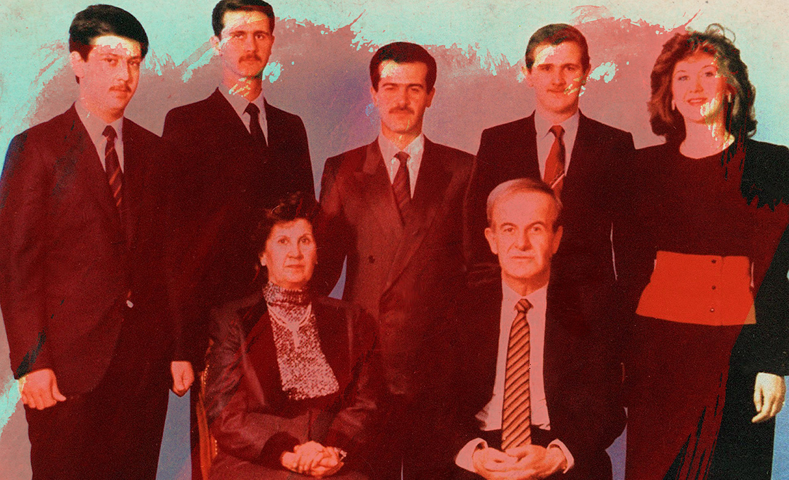

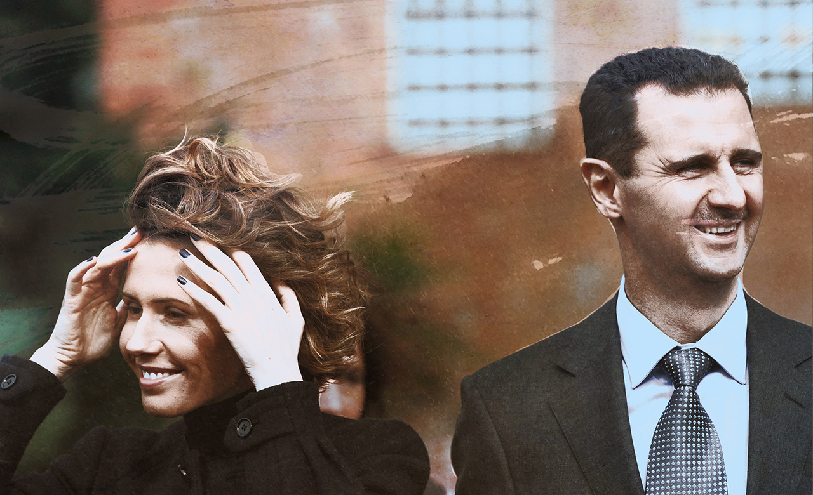

Bashar had never needed his allies more: his British wife might help placate Western governments. He promised Asma that he would muzzle the in-laws and agreed to designate her “First Lady” (Syria’s state media started using the term only after Anisa died in 2016). Asma had finally won a seat at the table.

巴沙尔从未像现在这样需要他的盟友：他的英国妻子可能会帮助安抚西方政府。他向阿斯玛保证，他会封住公婆的嘴，并同意指定她为“第一夫人”（叙利亚官方媒体在阿妮莎于 2016 年去世后才开始使用这个词）。阿斯玛终于赢得了一席之地。

Two months after Hariri’s assassination, in April 2005, Asma stood by her husband’s side at the funeral of Pope John Paul II. Few were keen to shake Bashar’s hand but Asma, discreetly glamorous in a black lace veil, had more appeal. Photos show her hobnobbing with world leaders.

哈里里遇刺两个月后，即 2005 年 4 月，阿斯玛在教皇约翰保罗二世的葬礼上站在她丈夫的身边。很少有人愿意与巴沙尔握手，但戴着黑色蕾丝面纱低调迷人的阿斯玛更具吸引力。照片显示她与世界各国领导人的亲密接触。

This was a pivotal moment for the couple. Until now Asma, the foreign wife, had been relegated to the sidelines. Now she came to play a central role in Bashar’s international rehabilitation. “She was his ambassador to all the countries with whom he couldn’t mingle and mix,” says Abdel Nour, Bashar’s former adviser.

这是这对夫妇的关键时刻。到目前为止，外国妻子阿斯玛一直被边缘化。现在她开始在巴沙尔的国际康复中扮演核心角色。巴沙尔的前顾问阿卜杜勒·努尔 (Abdel Nour) 说：“她是他派往所有他无法打成一片的国家的大使。”

In interviews with Western media she couldn’t help outshining Bashar (in an attempt to appeal to Christian audiences, he would refer to Jews as Christ-killers). At home, too, Asma softened the couple’s image. The Assads made a show of their modesty. They shunned the gargantuan, $1bn, marble-clad palace the Saudis had built the Assads, and lived in a modest three-storey house nearby. Asma would pick up her children from the local Montessori school each day. When Wafic Said had supper at their home, he was astonished by the lack of pomp. “We didn’t see any servants. He and his wife served us dinner.”

在接受西方媒体采访时，她忍不住要超过巴沙尔（为了吸引基督教观众，他将犹太人称为基督杀手）。在家里，阿斯玛也软化了这对夫妇的形象。阿萨德展示了他们的谦虚。他们避开了沙特人为阿萨德建造的耗资 10 亿美元、铺着大理石的庞大宫殿，并住在附近一栋不起眼的三层楼房里。 Asma 每天都会从当地的蒙台梭利学校接她的孩子。当 Wafic Said 在他们家吃晚饭时，他对没有盛况感到惊讶。 “我们没有看到任何仆人。他和他的妻子为我们准备了晚餐。”

With the help of a new hairdresser, Asma turned up the volume of her own look. Her stilettos and earrings grew a few inches; her nails were manicured and painted. Though neither she nor Bashar wore a wedding ring, regal agates hung at her neck. Syrian Airlines ground staff in London remember a never-ending stream of crates containing clothes from London’s finest department stores. Syrian diplomats dubbed her Imelda Marcos, after the Filipina first lady with an addiction to shoes.

在一位新理发师的帮助下，阿斯玛调高了自己造型的音量。她的细高跟鞋和耳环长了几英寸；她的指甲经过修剪和涂漆。尽管她和巴沙尔都没有戴结婚戒指，但她的脖子上挂着富丽堂皇的玛瑙。叙利亚航空公司在伦敦的地勤人员记得源源不断的板条箱，里面装着伦敦最好的百货公司的衣服。叙利亚外交官称她为伊梅尔达·马科斯 (Imelda Marcos)，以纪念这位对鞋子上瘾的菲律宾第一夫人。

Syrian diplomats dubbed her Imelda Marcos  
叙利亚外交官称她为伊梅尔达·马科斯  

The charm offensive worked. Just months after Hariri’s assassination, the _New York Times_ asked whether they represented “the essence of secular Western-Arab fusion”. “I was enchanted,” says a Syrian diplomat now in exile, who organised a European tour for the pair. “She’s lovable the moment you meet her. He’s different to other dictators in the Middle East. He looks modern and sophisticated. That’s what makes him so dangerous.”

魅力攻势奏效了。就在哈里里遇刺几个月后，《纽约时报》问他们是否代表了“世俗的西方-阿拉伯融合的本质”。 “我被迷住了，”一位现在流亡的叙利亚外交官说，他为这对夫妇组织了一次欧洲之旅。 “你一见到她，她就很可爱。他与中东的其他独裁者不同。他看起来现代而精致。这就是他如此危险的原因。”

Asma’s next project was Syria itself. After the decades of central planning and import restrictions, she wanted to rejuvenate Syria. Asma blinded her husband with financial jargon and pushed for the banking sector to open up to private and foreign-run companies. “She wanted to turn Damascus into a regional Dubai, a tax-haven free from financial controls,” recalled a well-connected Syrian economist.

阿斯玛的下一个项目是叙利亚本身。经过几十年的中央计划和进口限制，她想要振兴叙利亚。阿斯玛用金融术语蒙蔽了她的丈夫，并推动银行业向私营和外资公司开放。 “她想把大马士革变成地区性的迪拜，一个不受金融管制的避税天堂，”一位人脉广泛的叙利亚经济学家回忆道。

Unfortunately, economic reform threatened the interests of some of Syria’s most powerful people. To change how business was done, Asma would have to go up against Rami Makhlouf, Bashar’s cousin through his mother’s aristocratic clan. By some estimates Makhlouf’s companies controlled over half the Syrian economy. Asma tried to challenge his supremacy in 2007 by creating her own holding company, but was unable to attract enough of Syria's business heavyweights to join her – they largely remained in Makhlouf's sphere. Her plans for the Syrian economy would have to wait.

不幸的是，经济改革威胁到叙利亚一些最有权势的人的利益。为了改变做生意的方式，阿斯玛将不得不与巴沙尔母亲贵族家族的堂兄拉米·马赫卢夫对抗。据估计，马赫卢夫的公司控制着叙利亚经济的一半以上。 2007 年，阿斯玛试图通过创建自己的控股公司来挑战他的霸权，但无法吸引足够多的叙利亚商业重量级人物加入她的行列——他们大部分仍留在马赫卢夫的范围内。她对叙利亚经济的计划将不得不等待。

Asma soon found a new way to extend her influence. She had toyed with charity work early in her marriage, and now sought to unify her projects within a single organisation, the Syria Trust for Development. She aimed to make the trust the primary conduit through which Syria encountered the world, recruiting Anglophone Syrians living abroad, former United Nations officials, strategists from the Monitor Group, a Boston-based management consultancy, even a German diplomat’s daughter. “It was licensed to engage with foreigners when other bodies weren’t,” recalls a diplomat then in Damascus.

阿斯玛很快找到了扩大影响力的新方法。她在婚姻早期曾玩弄慈善工作，现在寻求将她的项目统一在一个组织内，即叙利亚发展信托基金。她的目标是让信托成为叙利亚与世界接触的主要渠道，招募居住在国外的讲英语的叙利亚人、前联合国官员、总部位于波士顿的管理咨询公司 Monitor Group 的战略家，甚至德国外交官的女儿。 “当其他机构没有时，它被许可与外国人接触，”当时在大马士革的一位外交官回忆道。

With its rugged landscape and archaeological riches, Asma reckoned Syria ought to be a desirable tourism destination. She recruited curators from the Louvre and British Museum to redesign central Damascus. A cement factory would become a gallery, modelled on London’s Tate Modern. The banks of a dirty river running through the city were to be regenerated as a cultural park. A new railway line was planned to connect Damascus to the ancient Assyrian cities in the underdeveloped north-east.

凭借其崎岖的地貌和丰富的考古资源，阿斯玛认为叙利亚应该成为一个理想的旅游目的地。她从卢浮宫和大英博物馆招募了策展人来重新设计大马士革市中心。一家水泥厂将成为一个画廊，仿照伦敦的泰特现代美术馆。一条穿过城市的肮脏河流的河岸将被重建为一个文化公园。计划修建一条新铁路线，将大马士革与欠发达东北部的古亚述城市连接起来。

For the most part, Western diplomats in Damascus gladly supported Asma’s trust. She charmed the European Union, the UN, the World Bank and Qatar, yielding millions of dollars to finance her vision. A flurry of newspaper articles celebrated Damascus’s “cultural renaissance”, as Asma called it. “This is how you fight extremism – through art,” Bashar said.

大多数情况下，驻大马士革的西方外交官很高兴支持阿斯玛的信任。她吸引了欧盟、联合国、世界银行和卡塔尔，为她的愿景提供了数百万美元的资金。一系列报纸文章庆祝大马士革的“文化复兴”，正如阿斯玛所说。 “这就是你如何通过艺术来对抗极端主义，”巴沙尔说。

Her colleagues saw a different side. On a good day she was “enormously curious” and “amazingly accommodating”, according to a former employee. But another consultant remembered her “princess-like temper. She would shout and vent”. (He resigned after eight months.) “She’s a control freak, a scary person,” said the consultant.

她的同事看到了不同的一面。据一位前雇员说，在美好的一天，她“非常好奇”并且“非常乐于助人”。但另一位顾问记得她“公主般的脾气”。她会大喊和发泄”。 （八个月后他辞职了。）“她是一个控制狂，一个可怕的人，”顾问说。

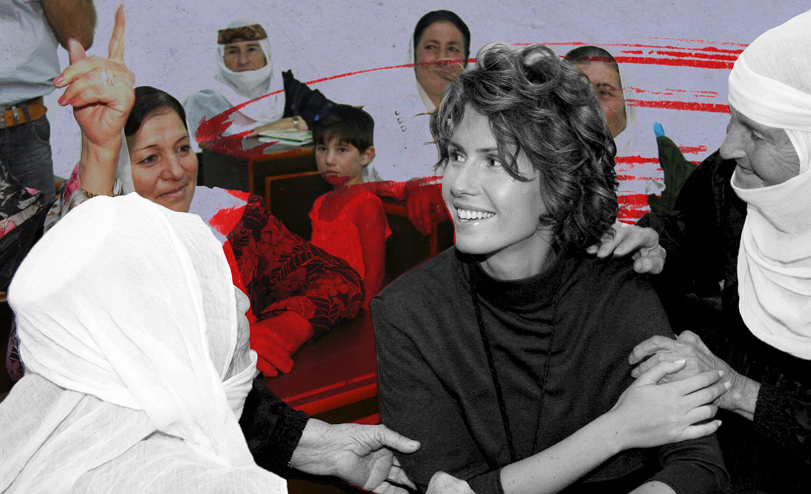

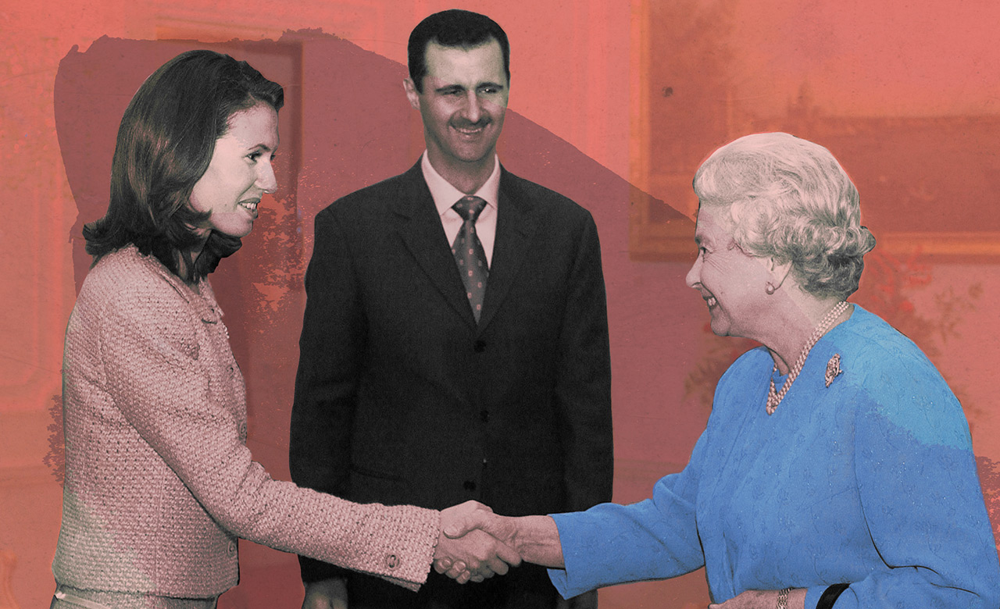

She was also effective. “It was surprising how many times she said ‘I’d like something to happen’, and it happened,” said someone who worked for her in Damascus for six years. Her staff kept to the punishing schedule she’d grown accustomed to at J.P. Morgan: the office opened at 6am and work continued into the evening. Officials knew to consult Asma, not the culture minister, on major questions.

她也很有效。 “令人惊讶的是，她说了多少次‘我希望发生一些事情’，而且它发生了，”一位在大马士革为她工作了六年的人说。她的员工遵守她在 J.P. Morgan 已经习惯的惩罚性时间表：办公室早上 6 点开门，工作一直持续到晚上。官员们知道在重大问题上咨询阿斯玛，而不是文化部长。

Asma hired PR firms in Britain and America to buff her image. They flew in parliamentarians from around the world to admire her good deeds. Celebrities came to Damascus, including Angelina Jolie and Brad Pitt, Sting and Damon Albarn. The grand mufti invited Syrian Jews who had fled persecution decades earlier. Brown Lloyd James, an American PR company, arranged a cover story in _Vogue_ in March 2011, which portrayed Asma as “a rose in the desert” who was determined to make Syria into a “brand”.

阿斯玛聘请了英国和美国的公关公司来提升她的形象。他们飞来了来自世界各地的议员，以欣赏她的善行。名人来到大马士革，包括安吉丽娜朱莉和布拉德皮特、斯汀和达蒙阿尔巴恩。大穆夫提邀请了几十年前逃离迫害的叙利亚犹太人。 2011年3月，美国公关公司Brown Lloyd James为Vogue安排了封面故事，将阿斯玛描绘成“沙漠中的玫瑰”，决心将叙利亚打造成“品牌”。

The trust’s remit was limited. “We didn’t get into anything related to the mosque, religion and politics,” said an employee. Such boundaries were hard to police. Educators toured Syria with a large inflatable igloo designed as a storytelling space, built with the help of a former executive of the Science Museum in London. They were supposed to focus on uncontroversial questions, such as a child’s right to clean air, but conversation turned to the regime’s abuses. “One kid said I’ve got a story about human rights, and explained how he’d been arrested, stripped and made to sit on a bottle,” said an organiser. “We had to take it to the First Lady, and I understand that someone lost their job in the local security services.”

信托的职权范围有限。 “我们没有涉及任何与清真寺、宗教和政治有关的事情，”一名员工说。这样的界限很难监管。教育工作者带着一个大型充气冰屋参观了叙利亚，这个冰屋被设计成一个讲故事的空间，是在伦敦科学博物馆前任主管的帮助下建造的。他们本应专注于无争议的问题，例如儿童享有清洁空气的权利，但谈话却转向了该政权的滥用职权。 “一个孩子说我有一个关于人权的故事，并解释了他是如何被捕、被剥光衣服并被迫坐在瓶子上的，”一位组织者说。 “我们不得不把它带给第一夫人，我知道有人失去了当地安全部门的工作。”

The trust’s foreign consultants lived in a gilded bubble in Damascus: they ordered sushi from room service and drew large salaries as they nattered about capacity-building. “Many villages had no proper sewerage or electricity, and she turned up with her consultants and talked about entrepreneurship, civil society, sustainable development and cheese-making training,” said Samir Aita, a consultant to the finance ministry. Asma “thought the Syria Trust could save everything, but it was just stupid people speaking English to poor peasants.”

该信托的外国顾问生活在大马士革的镀金泡沫中：他们通过客房服务订购寿司，并在喋喋不休地谈论能力建设时领取高额薪水。 “许多村庄没有适当的下水道或电力，她和她的顾问一起出现，谈论创业、公民社会、可持续发展和奶酪制作培训，”财政部顾问萨米尔艾塔说。阿斯玛“认为叙利亚信托基金可以挽救一切，但它只是愚蠢的人对贫穷的农民说英语。”

Even some employees questioned whether the trust was merely a vehicle for Asma’s self-aggrandisement. Advisers were expected to address her as “Your Excellency” and stand up when she entered a room. One former associate maintains that Asma was genuinely committed to liberalising Syria. Others are unconvinced. “Was it ever real? That’s the question I asked myself,” said a Western ambassador who served in Damascus at the time.

甚至一些员工质疑信托是否仅仅是阿斯玛自我扩张的工具。顾问们应该称呼她为“阁下”，并在她进入房间时站起来。一位前同事坚持认为，阿斯玛真诚地致力于自由化叙利亚。其他人不服气。 “它曾经是真的吗？这就是我问自己的问题，”一位当时在大马士革任职的西方大使说。

Among those who did well out of Asma’s rise was her own father, Fawaz Akhras. Soon after Asma married Bashar, Akhras established the British-Syrian Society, an organisation in London that drummed up political and financial support for Syria. He co-ordinated the society’s activities with Asma’s organisation, attracting a crowd of rich Syrians.

因阿斯玛的崛起而大获成功的人包括她自己的父亲法瓦兹·阿赫拉斯 (Fawaz Akhras)。阿斯玛与巴沙尔结婚后不久，阿赫拉斯在伦敦成立了英国-叙利亚协会，这是一个为叙利亚争取政治和财政支持的组织。他与阿斯玛的组织协调协会的活动，吸引了一群富有的叙利亚人。

Akhras was frank about his proximity to power: his preferred opener when giving speeches was, “As the father-in-law of the president...”. “Compared to him the Syrian ambassador was a busboy,” said Yahya al-Aridi, who ran communications for the Syrian government in London. It was said that even Syria’s prime minister asked Asma’s father to forward messages to Bashar.

阿赫拉斯坦言他与权力的接近：他在演讲时首选的开场白是“作为总统的岳父……”。 “与他相比，叙利亚大使是个杂工，”在伦敦为叙利亚政府负责通讯的叶海亚·阿里迪 (Yahya al-Aridi) 说。据说，连叙利亚总理都要求阿斯玛的父亲转达给巴沙尔的信息。

Officials knew to consult Asma, not the culture minister, on major questions

官员们知道在重大问题上咨询阿斯玛，而不是文化部长

Asma’s father, a cardiologist at a private hospital in Kensington, was known for his preoccupation with money. Patients say that he asked for cash payment in advance. His defenders point out that for decades he has lived in the same, modest semi-detached house near a busy motorway in west London: weeds wriggle through the paving stones in the front garden; the paint on the porch is peeling. But a long history of violent politics has taught Syrians to hide their wealth.

阿斯玛的父亲是肯辛顿一家私立医院的心脏病专家，以贪财着称。患者说，他要求提前支付现金。他的捍卫者指出，几十年来，他一直住在伦敦西部一条繁忙的高速公路附近的同一栋朴素的半独立式房屋中：杂草在前花园的铺路石上蠕动；门廊上的油漆正在剥落。但长期的暴力政治历史教会了叙利亚人隐藏他们的财富。

As Asma’s star was in the ascendant, Syria’s international profile was also improving. American officials began to visit Damascus again, particularly after Barack Obama was elected in 2008. An invitation to Washington was rumoured to be pending. The French were even more sympathetic. Paparazzi stalked the Assads when they visited Paris. _Paris Match_ praised Asma for shining “light in a country full of shadows”.

随着阿斯玛的星位方兴未艾，叙利亚的国际形象也在不断提升。 American officials began to visit Damascus again, particularly after Barack Obama was elected in 2008. An invitation to Washington was rumoured to be pending.法国人甚至更有同情心。狗仔队在阿萨德访问巴黎时跟踪他们。 《巴黎竞赛》称赞阿斯玛“在一个充满阴影的国家闪耀着光芒”。

On December 10th 2010, Asma addressed the assembled French elite at the International Diplomatic Academy, a think-tank in Paris, where she talked without notes about the “change that’s happening in my country”. A few days later, a Tunisian vegetable seller set himself on fire, sparking uprisings across north Africa and the Middle East that came to be known as the Arab spring. Soft power and sharp heels were not going to be enough for the Assads to survive it.

2010 年 12 月 10 日，阿斯玛在巴黎智库国际外交学院向聚集的法国精英发表讲话，她在没有笔记的情况下谈到了“我的国家正在发生的变化”。几天后，一名突尼斯菜贩自焚，引发了北非和中东各地的起义，后来被称为“阿拉伯之春”。软实力和尖锐的脚跟不足以让阿萨德幸免于难。

In the first two months of 2011, the mood in the Middle East was electric. After decades of stasis and repression, demonstrations erupted from Tunisia to Libya, Algeria to Bahrain, Jordan to Yemen. Mass protests in Cairo toppled Hosni Mubarak, dictator of Egypt for nearly 30 years. The tide of revolution seemed unstoppable.

2011 年的前两个月，中东的情绪异常激动。经过数十年的停滞和镇压，从突尼斯到利比亚，从阿尔及利亚到巴林，从约旦到也门爆发了示威活动。开罗的大规模抗议活动推翻了统治埃及近 30 年的独裁者胡斯尼·穆巴拉克 (Hosni Mubarak)。革命的浪潮似乎势不可挡。

Many Syrians were intoxicated by what they saw, but fear inhibited most from coming onto the streets. Then, one night in February in a drab agricultural town called Deraa, south of Damascus, a group of schoolchildren sprayed graffiti on a wall: “It’s your turn next, doctor.”

许多叙利亚人被他们所见所闻陶醉，但大多数人因恐惧而不敢走上街头。然后，2 月的一个晚上，在大马士革南部一个名为德拉的单调农业小镇，一群学童在墙上喷了涂鸦：“接下来轮到你了，医生。”

The local security chief was a cousin of Bashar, a thug even by the standards of Syria’s secret services. His men rounded up the children and tortured them. When their fathers pleaded for their release, the security chief offered to give them more children if they sent their wives over. Crowds gathered outside Deraa’s mosques, demanding dignity and freedom. Troops opened fire.

当地安全负责人是巴沙尔的堂兄，即使按照叙利亚特工部门的标准，巴沙尔也是个暴徒。他的手下围捕了孩子们并折磨他们。当他们的父亲请求释放他们时，安全主管提出如果他们把妻子送过去，就可以给他们更多的孩子。人群聚集在德拉的清真寺外，要求尊严和自由。部队开火了。

It wasn’t clear at first – including, it seems, to Asma – how Bashar would respond. One of his generals counselled him to imprison the local security chief and apologise for the bloodshed in Deraa. Syria’s bigger cities were still tranquil, so public contrition and renewed promises of change might have kept a lid on things.

一开始并不清楚——包括阿斯玛在内——巴沙尔会如何回应。他手下的一位将军建议他关押当地的安全主管，并为德拉的流血事件道歉。叙利亚的大城市仍然平静，因此公众的忏悔和对变革的新承诺可能会掩盖事情的发展。

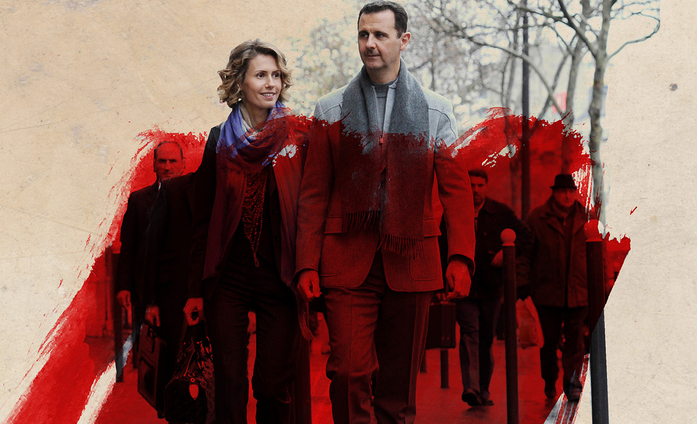

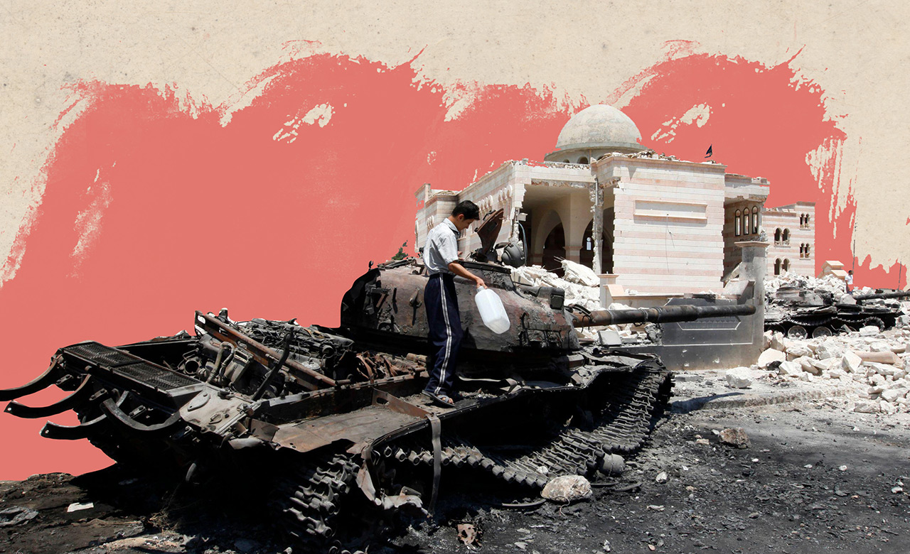

In Washington, Syria’s ambassador helped Bashar draft a speech announcing new reforms. The Assads’ friends in the West were told of it. Asma, too, seems to have been expecting a crowd-pleaser. As the Arab spring gathered pace, she’d said that the regime knew it had to change and a former associate says she tried to talk to the opposition. On March 30th, Bashar addressed Syria’s largely ceremonial parliament.

在华盛顿，叙利亚大使帮助巴沙尔起草了一份宣布新改革的演讲稿。阿萨德在西方的朋友们被告知了这件事。阿斯玛似乎也一直在期待一个讨人喜欢的人。随着阿拉伯之春的步伐加快，她曾说该政权知道它必须改变，一位前同事说她试图与反对派对话。 3 月 30 日，巴沙尔在叙利亚主要是礼仪性的议会发表讲话。

“Syria is facing a great conspiracy,” Bashar declared, confounding expectations. He labelled footage of security forces shooting protesters as “fake information”. He dismissed calls for reform, saying they were cover for an unspecified foreign plot. “It was the old regime speaking,” says one of Asma’s board members (he left Syria straight after the speech). “There was not one word of conciliation, no recognition that things could be done differently. When I met Bashar he would talk about reform. It was devastating to discover it was just a sham.”

“叙利亚正面临一个巨大的阴谋，”巴沙尔宣称，这出乎人们的意料。他将安全部队射杀抗议者的镜头标记为“虚假信息”。他驳回了改革的呼吁，称他们是在掩盖一个未指明的外国阴谋。 “这是旧政权在讲话，”阿斯玛的一位董事会成员说（他在讲话后立即离开了叙利亚）。 “没有一个和解的词，没有认识到事情可以以不同的方式做。当我见到巴沙尔时，他会谈论改革。发现这只是一个骗局是毁灭性的。”

After the speech, demonstrations grew in number and size each week, usually massing after Friday prayers. So began an escalating cycle of funerals, protests and violence. Over the course of a month the regime’s response became more vicious: first goons, then snipers, then heavy artillery.

演讲结束后，示威活动的数量和规模每周都在增加，通常在周五祈祷后聚集。于是开始了不断升级的葬礼、抗议和暴力循环。在一个月的时间里，该政权的反应变得更加恶毒：首先是暴徒，然后是狙击手，然后是重炮。

The influence of Syria’s army generals, intelligence chiefs and Baath party had all waned over the previous ten years. Now they were back with a vengeance. Anisa, Bashar’s mother, also pressed for a firm response. What would your father have done, she taunted Bashar. When an uprising broke out against his rule in 1982 he had brutally suppressed it. A former French ambassador to Damascus reports that, around this time, Bashar was overheard saying: “My father was right. Thousands of deaths in Hama bought us three decades of stability.”

在过去的十年里，叙利亚军队将领、情报部门负责人和复兴党的影响力都在减弱。现在他们带着复仇回来了。巴沙尔的母亲阿妮莎也要求作出坚定回应。你父亲会怎么做，她嘲笑巴沙尔。当 1982 年爆发反对他的统治的起义时，他残酷地镇压了它。一位前法国驻大马士革大使报告说，大约在这个时候，有人无意中听到巴沙尔说：“我父亲是对的。哈马数千人的死亡为我们换来了三个十年的稳定。”

As Syria descended into chaos, Asma’s castles in the air came tumbling down. A gala marking the relaunch of the national museum was cancelled. Her cultural regeneration projects never materialised. After seven years of planning, the Museum of Discovery, modelled on the Science Museum in London, remained a concrete shell. Funding dried up and consultants left the country, expunging the Syria Trust from their CVs. The most prominent Western visitors were pariahs like Nick Griffin, then head of the far-right British National Party.

随着叙利亚陷入混乱，阿斯玛的空中楼阁轰然倒塌。一场标志着国家博物馆重新开放的晚会被取消。她的文化复兴计划从未实现。经过七年的规划，以伦敦科学博物馆为蓝本的发现博物馆仍然是一个混凝土外壳。资金枯竭，顾问离开了这个国家，从他们的简历中删除了叙利亚信托基金。最著名的西方访客是像尼克格里芬这样的贱民，他是极右翼英国国家党的领导人。

One former friend left a coffee morning with her wiping away tears: “It was always a lie. I had been used”

一位前朋友离开了一个咖啡早晨，她擦干眼泪：“这总是一个谎言。我被利用了”

Wafic Said says he pleaded with Bashar to pursue a moderate course. “They love you and your wife, you’re not like Mubarak,” he told them. “Don’t miss this opportunity to become the greatest leader in the Arab world. Just give them some rights, a bit of dignity and you could be loved for ever.” But Bashar’s course was set. In a second speech, in June, he likened protesters to “germs”. A dark chapter was about to begin.

瓦菲克赛义德说，他恳求巴沙尔采取温和的做法。 “他们爱你和你的妻子，你不像穆巴拉克，”他告诉他们。 “不要错过这个成为阿拉伯世界最伟大领袖的机会。只要给他们一些权利，一点尊严，你就会永远被爱。”但巴沙尔的路线已经确定。在 6 月的第二次演讲中，他将抗议者比作“细菌”。一个黑暗的篇章即将开始。

In February 2012, a year into the Arab spring, Syria’s Fourth Armoured Division, under the command of Bashar’s younger brother, Maher, trained its artillery on Homs in western Syria. Asma’s parents had grown up in the city; now protests there were escalating into armed insurrection. Soldiers defected to the rebels and some 7,000 civilians had already died across the country.

2012 年 2 月，也就是阿拉伯之春的一年，叙利亚第四装甲师在巴沙尔的弟弟马希尔的指挥下，在叙利亚西部的霍姆斯训练炮兵。阿斯玛的父母在城里长大；现在那里的抗议活动正在升级为武装叛乱。士兵投奔叛军，全国已有约 7,000 名平民丧生。

As tanks rumbled towards her family’s hometown, Asma emailed a friend. “Does anything catch your eye?” She was forwarding her information about an exclusive collection of Christian Louboutin heels. Asma had barely appeared in public since the protests started, provoking speculation. Was she a prisoner of circumstance or did she support her husband's actions? Perhaps she had even fled abroad.

当坦克隆隆驶向她家的家乡时，阿斯玛给一位朋友发了电子邮件。 “有什么吸引你的眼球吗？”她正在转发有关 Christian Louboutin 高跟鞋独家系列的信息。自抗议活动开始以来，阿斯玛几乎没有出现在公众面前，这引发了猜测。她是环境的俘虏还是支持她丈夫的行为？也许她甚至逃到了国外。

People who spoke with her in private in the early days of the crisis say she stuck rigidly to the official line: the uprising was a foreign conspiracy. One former friend left a coffee morning with her wiping away tears. “It was always a lie,” she said. “I had been used.” Others, though, insist Asma was appalled as Bashar’s viciousness grew. Who could watch the fate of Muammar Qaddafi, whose mutilated body was dragged through the streets of Libya in October 2011, without flinching?

在危机初期与她私下交谈过的人说，她严格遵守官方路线：起义是外国的阴谋。一位前朋友离开了一个咖啡早晨，她擦干了眼泪。 “这总是一个谎言，”她说。 “我被利用了。”不过，其他人坚持认为，阿斯玛对巴沙尔的恶毒增长感到震惊。 2011 年 10 月，穆阿迈尔·卡扎菲 (Muammar Qaddafi) 残缺不全的尸体被拖过利比亚街头，谁能毫不畏惧地看着他的命运？

In theory, Asma could have gone to London. There were offers of safe passage, apparently accompanied by handsome rewards from Gulf states. The British government repeatedly stated that, as a British citizen, they couldn’t prevent her entering the country – which some observers interpreted as a discreet offer of protection. Even in London, the atmosphere was uninviting. Protesters gathered outside her family home in Acton and smeared red paint on the door. Queen’s College scrubbed her name from its list of honoured alumnae.

理论上，阿斯玛本可以去伦敦。有安全通道的提议，显然伴随着海湾国家的丰厚回报。英国政府一再声明，作为英国公民，他们无法阻止她进入该国——一些观察家认为这是一种谨慎的保护提议。即使在伦敦，气氛也不吸引人。抗议者聚集在她位于阿克顿的家外，并在门上涂上红色油漆。皇后学院将她的名字从荣誉校友名单中删除。

There were rumours that Asma had gone. An official who worked in the Syrian embassy in London at the time remembers security officials preparing to receive or dispatch a VIP at the end of 2011 (though this may not have been Asma). Others say she was stopped on her way to Damascus airport by henchmen who took her children – and she baulked against travelling without them.

有传言说阿斯玛已经走了。一名当时在叙利亚驻伦敦大使馆工作的官员记得，安全官员准备在 2011 年底接待或派遣一名贵宾（尽管这可能不是阿斯玛）。其他人说，她在前往大马士革机场的途中被带走她孩子的追随者拦下——她不愿在没有他们的情况下旅行。

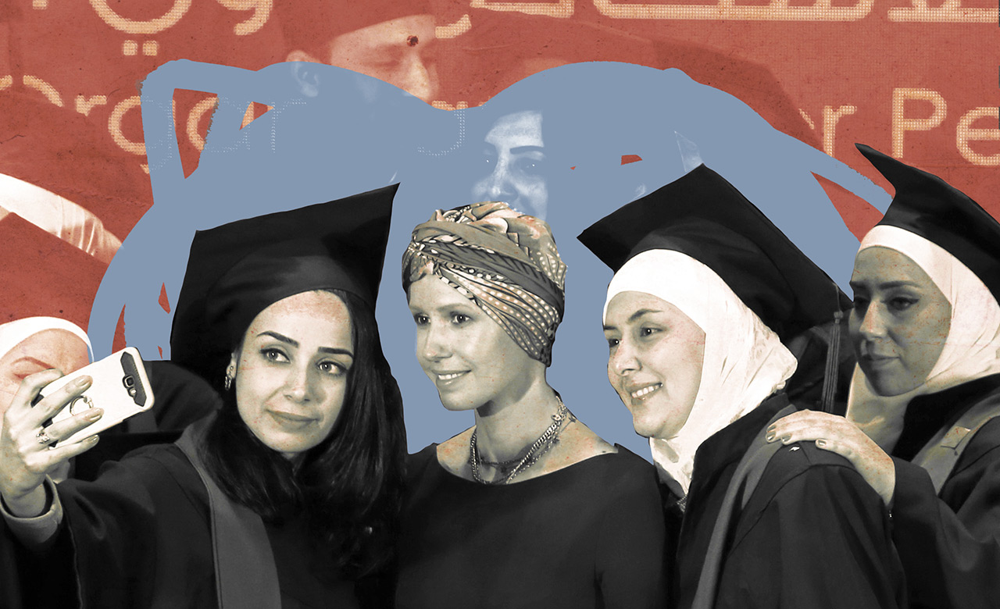

For months, Asma stopped giving interviews. Former friends describe her as looking emaciated on a rare public outing to a pro-government rally in January 2012. At some point she and her children moved to the family’s summer palace near the coast, far from any shelling or tear gas.

几个月来，阿斯玛停止接受采访。在 2012 年 1 月一次罕见的亲政府集会公开郊游中，她以前的朋友形容她看起来很憔悴。在某个时候，她和她的孩子搬到了靠近海岸的家庭颐和园，远离任何炮击或催泪瓦斯。

Without a public role, Asma focused instead on home refurbishments. In the first year of the uprising she advertised for a gardener and spent £250,000 on furniture. To circumvent sanctions she sent her hairdresser shopping in Dubai and used an alias when ordering from Harrods. The Assad family’s fixer in London fielded her requests for chandeliers. Asma jokingly referred to herself as the “real dictator” in the Assad household.

由于没有担任公共职务，阿斯玛转而专注于家居翻新。在起义的第一年，她登广告招聘一名园丁，并在家具上花费了 25 万英镑。为了规避制裁，她让她的美发师在迪拜购物，并在从哈罗德百货公司订购时使用了化名。阿萨德家族在伦敦的修理工满足了她对枝形吊灯的要求。阿斯玛开玩笑地称自己是阿萨德家族中的“真正的独裁者”。

Asma’s shopping sprees were revealed in a collection of thousands of emails from the Assads’ inner circle, leaked in 2012 to the _Guardian_ by Syrian opposition activists, as well as others published by WikiLeaks. The messages also suggest that Asma may have been wavering. In December 2011 she exchanged emails with the daughter of the then emir of Qatar, a friend of hers until the Qataris aligned themselves with Syrian rebels. The princess told Asma it was “not too late for reflection and coming out of the state of denial”, then apologised if she’d overstepped the mark. It is possible she was encouraging Asma to defect.

2012 年，叙利亚反对派活动人士将阿萨德的数千封电子邮件泄露给了卫报，维基解密还公布了其他电子邮件，这些电子邮件揭示了阿斯玛的疯狂购物行为。这些消息还表明，阿斯玛可能一直在动摇。 2011 年 12 月，她与当时的卡塔尔埃米尔的女儿交换了电子邮件，她是她的朋友，直到卡塔尔人与叙利亚叛军结盟。公主告诉阿斯玛“现在反思并从否认状态中走出来还为时不晚”，然后为她越界道歉。她有可能鼓励阿斯玛叛逃。

The response Asma gave was surprisingly ambiguous, first welcoming the “frankness” then seeming to check herself. “Life is not fair my friend – but ultimately there is a reality we all need to deal with!!!” She hinted of forces compelling her to stay.

阿斯玛给出的回应出奇地模棱两可，先是欢迎“坦率”，然后似乎在克制自己。 “生活是不公平的，我的朋友——但最终我们都需要面对一个现实！！！”她暗示有力量迫使她留下来。

The emails also shed light on the Assads’ marriage. Many believe the alliance was primarily aimed at securing both families’ interests. Bashar was known for his philandering, an impression reinforced by adoring emails from young female assistants in the leaked emails. Yet Bashar and Asma corresponded with affection. On December 28th 2011, as tanks shelled her family’s hometown of Homs, Asma wrote to Bashar, “If we are strong together, we will overcome this together...I love you.” It’s unclear whether the troubles they needed to “overcome” were in Syria or their marriage.

这些电子邮件还揭示了阿萨德的婚姻。许多人认为，该联盟的主要目的是确保双方家族的利益。巴沙尔以风流韵事而闻名，泄露的电子邮件中年轻女助理的爱慕邮件进一步强化了这种印象。然而，巴沙尔和阿斯玛却充满感情地通信。 2011 年 12 月 28 日，当坦克炮击她家的家乡霍姆斯时，阿斯玛写信给巴沙尔，“如果我们一起坚强，我们将一起克服这个……我爱你。”目前尚不清楚他们需要“克服”的麻烦是在叙利亚还是在他们的婚姻中。

To circumvent sanctions she sent her hairdresser shopping in Dubai and used an alias when ordering from Harrods

为了规避制裁，她让理发师去迪拜购物，并在从 Harrods 百货公司订购时使用化名

A few days later, when she emailed her _batta_ (“duck” in Arabic), her pet name for her husband, he responded with a heart. She replied, “Sometimes at night, when I look to the sky, I start thinking of you and ask myself, why? Why do I love you? I think and smile, because I know the list could run on for miles.” In February 2012 Bashar seemed to be offering a veiled apology for his dalliances, sending her a country-and-western song with the lyrics: “I've made a mess of me/The person that I've been lately/Ain't who I wanna be.”

几天后，当她通过电子邮件发送她的 batta（阿拉伯语中的“鸭子”）（她对丈夫的爱称）时，他用心回应。她回答说：“有时在晚上，当我仰望天空时，我开始想你，问自己，为什么？为什么我爱你？我想了想并微笑，因为我知道这份名单可能会持续数英里。” 2012 年 2 月，巴沙尔似乎在为自己的风流韵事道歉，寄给她一首乡村和西部歌曲，歌词是：“我把自己弄得一团糟/我最近成为的那个人/不是我想成为谁。”

Soon afterwards, Asma issued her first official statement since the start of the uprising: “The president is the president of all of Syria, not the head of a faction of Syrians, and the First Lady supports him in this role.” She was standing by her man.

不久之后，阿斯玛发表了自起义开始以来的第一份正式声明：“总统是整个叙利亚的总统，而不是叙利亚某个派系的领袖，第一夫人支持他担任这一职务。”她站在她的男人身边。

If dissidents are to be believed, as part of her reconciliation with Bashar, Asma negotiated her return to public life with the help of her father. Henceforth she would be a fully-fledged partner in the presidency. In the summer of 2012 Bashar’s sister, Bushra, fled to Dubai after her husband was killed in a bomb blast. The rebels claimed responsibility, but it was well beyond the capacity that they’d demonstrated so far. Bushra and her husband had represented one of the biggest sources of anti-Asma sentiment in the inner circle. Many assumed the assassination was an inside job.

如果持不同政见者可信，作为与巴沙尔和解的一部分，阿斯玛在父亲的帮助下通过谈判重返公众生活。从今以后，她将成为总统职位上的成熟伙伴。 2012 年夏天，巴沙尔的姐姐布什拉 (Bushra) 在丈夫死于炸弹爆炸后逃往迪拜。叛乱分子声称对此负责，但这远远超出了他们迄今为止所展示的能力。 Bushra 和她的丈夫代表了内部圈子中反阿斯玛情绪的最大来源之一。许多人认为暗杀是内部工作。

Over the following year, Bashar’s prospects also improved. He checked rebel advances and drove them out of their stronghold in Homs. Anti-government forces still controlled some suburbs of Damascus and lobbed shells into the city centre, but were unable to unseat the Assads.

在接下来的一年里，巴沙尔的前景也有所改善。他阻止了叛军的进攻，并将他们赶出了霍姆斯的据点。反政府武装仍然控制着大马士革的一些郊区，并向市中心发射炮弹，但无法推翻阿萨德。

As the war continued, Bashar became more ruthless. One Western diplomat recalls the slow escalation of violence – using artillery against civilians, then air raids, then barrel-bombs. “They would...use it once, there’d be an outcry, but not to the point of international intervention,” said the diplomat. “So they would roll it out, and that would become the new normal.” International condemnation of Bashar’s crimes grew, yet this incremental choking of Syria, rather than all-out attack, helped forestall intervention.

随着战争的继续，巴沙尔变得更加冷酷无情。一位西方外交官回忆起暴力的缓慢升级——对平民使用大炮，然后是空袭，然后是桶装炸弹。 “他们会......使用一次，会有强烈抗议，但不会达到国际干预的程度，”这位外交官说。 “所以他们会推出它，这将成为新常态。”国际社会对巴沙尔罪行的谴责越来越多，但这种对叙利亚的逐步扼杀，而不是全面进攻，有助于阻止干预。

On August 21st 2013 new footage appeared, showing people in the rebel-held suburbs of Damascus with bubbles foaming at their noses and mouths, and their limbs jerking. Hundreds died. A UN investigation later confirmed that they had been killed by sarin, a nerve gas. It was the worst chemical-weapons attack anywhere since Saddam Hussein had gassed Kurds in Halabja in 1988.

2013 年 8 月 21 日出现了新的镜头，显示在大马士革反叛分子控制的郊区，人们的鼻子和嘴巴里冒出泡沫，四肢抽搐。数百人死亡。后来的一项联合国调查证实，他们是被一种神经毒气沙林杀死的。这是自萨达姆侯赛因于 1988 年在哈拉卜贾用毒气毒杀库尔德人以来发生的最严重的化学武器袭击。

Asma wrote to Bashar, “If we are strong together, we will overcome this together”

阿斯玛写信给巴沙尔，“如果我们团结一致，我们将一起克服这个问题”

The next day, as the world absorbed the images, photos were posted on Facebook chronicling the First Lady’s official activities in minute detail. One showed her and her husband sitting on a flower-trimmed balcony with the caption: “Love is a country led by a lion who stamped out conspiracies and a First Lady devoted to her homeland”. One user commented underneath: “Are you not ashamed? Your people are being slaughtered and you are just observing and even worse…ordering shoes.”

第二天，随着全世界都在关注这些图片，Facebook 上发布了详细记录第一夫人官方活动的照片。其中一张展示了她和她的丈夫坐在一个装饰着鲜花的阳台上，标题是：“爱是一个国家，由一头消灭阴谋的狮子和一位献身于祖国的第一夫人领导”。一位网友在下方评论道：“你不害臊吗？你的人民正在被屠杀，而你只是在观察，更糟糕的是……订购鞋子。”

It’s hard to compute the scale of destruction in Syria over the years that followed. In 2014 Islamic State, a Sunni extremist group, took advantage of the chaos to establish a so-called caliphate straddling Syria and Iraq. Its sectarian ferocity presented a serious threat to Bashar’s forces but also weakened support for his opposition and justified Iran and Russia in propping him up.

很难计算随后几年叙利亚遭受的破坏规模。 2014年，逊尼派极端组织伊斯兰国趁乱建立横跨叙利亚和伊拉克的所谓哈里发国。其凶猛的宗派主义对巴沙尔的军队构成了严重威胁，但也削弱了对他的反对派的支持，并使伊朗和俄罗斯有理由支持他。

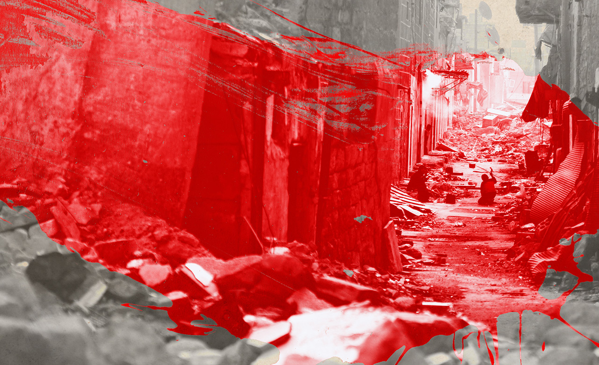

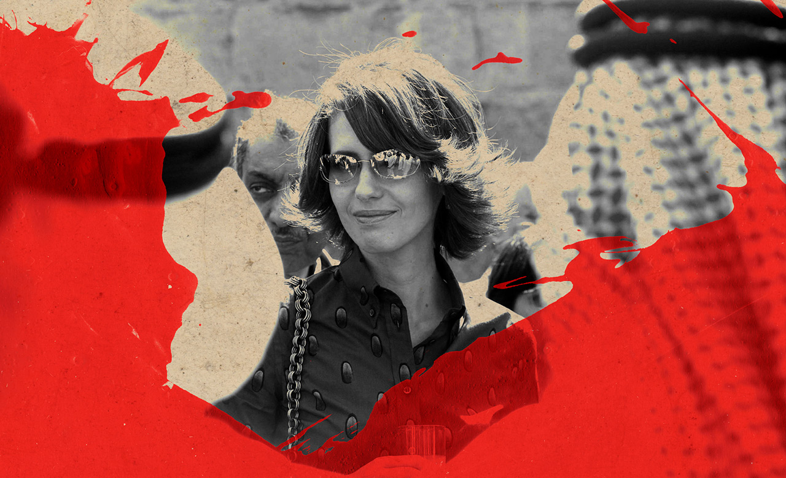

Almost every inch of the country was fought over. Though Bashar recaptured Aleppo, the last of the big cities, in 2016, he kept on dropping bombs: nearly half of Syria’s towns and cities have been reduced to rubble. The UN gave up trying to count the war’s death toll in 2016, when it had already reached nearly half a million. More than 10m Syrians are refugees.

这个国家的每一寸土地几乎都被争夺了。尽管巴沙尔在 2016 年夺回了最后的大城市阿勒颇，但他继续投下炸弹：近一半的叙利亚城镇已化为废墟。联合国在 2016 年放弃了计算战争死亡人数的尝试，当时死亡人数已经接近 50 万。超过 1000 万叙利亚人是难民。

Chanel frocks and stilettos don’t go down well in the ruins of a civil war. Syria’s new reality required a new Asma. Out went the heels, the manicures, the power jackets and the jewellery. In came flat shoes, T\-shirts and trousers that exposed her emaciated arms and petite frame. When Anisa, Bashar’s mother, died in February 2016, Asma lost her most powerful opponent. The biggest change, however, was a gruelling personal ordeal.

在内战的废墟中，香奈儿连衣裙和细高跟鞋不太受欢迎。叙利亚的新现实需要一个新的阿斯玛。高跟鞋、美甲、动力夹克和珠宝都被淘汰了。平底鞋、T 恤和裤子暴露了她消瘦的手臂和娇小的身躯。 2016年2月，巴沙尔的母亲阿妮莎去世，阿斯玛失去了最强大的对手。然而，最大的变化是一场艰苦的个人磨难。

In 2018 Asma was diagnosed with breast cancer. The illness didn’t stop her from carefully managing her public image, or making sure that everyone knew she’d stayed in Syria for her treatment. Her struggle was documented in detail by state media and on the presidency’s social-media channels. She was even filmed being wheeled into the operating theatre.

2018 年，阿斯玛被诊断出患有乳腺癌。疾病并没有阻止她谨慎管理自己的公众形象，也没有阻止她确保每个人都知道她留在叙利亚接受治疗。官方媒体和总统的社交媒体渠道详细记录了她的斗争。她甚至被拍到被推进手术室。

When her hair fell out she was photographed wearing chic headscarves, projecting both vulnerability and strength, an irresistible metaphor for her husband’s own struggle against the insurgency. “Congratulations on your victory over cancer,” began one TV interviewer. “Thank you,” replied Asma. “And I hope we will soon celebrate Syria’s victory.”

当她的头发脱落时，她戴着别致的头巾被拍到，既脆弱又坚强，这是对她丈夫与叛乱的斗争的不可抗拒的隐喻。 “恭喜你战胜了癌症，”一位电视采访者开始说道。 “谢谢你，”阿斯玛回答。 “我希望我们很快就能庆祝叙利亚的胜利。”

Even before she had fully recovered, pro-government media showed Asma sharing in Syria’s grief. Accompanied by camera crews, she knocked on doors in impoverished highland villages, hugged the surprised mothers of martyrs and offered them handouts.

甚至在她完全康复之前，亲政府的媒体就报道了阿斯玛对叙利亚的悲痛。在摄制组的陪同下，她走访了贫困的高原村庄，拥抱了惊讶的烈士母亲，并向她们提供了施舍。

Asma made a conscious effort to disguise her Britishness. She worked so hard on her Arabic that even Syrians could no longer detect an English accent. She ignored interview requests from Western media, accepting only bids from Russian and local outlets. Though Asma had turned her back on the West, her facility with international donors persisted. The income of her charity, the Syria Trust, dried up after the EU imposed sanctions in 2012. Now, international humanitarian aid flooded in to support Syrians devastated by war. Much of that money was about to come Asma’s way.

阿斯玛有意掩饰她的英国身份。她非常努力地学习阿拉伯语，以至于连叙利亚人都听不出英语口音了。她无视西方媒体的采访要求，只接受俄罗斯和当地媒体的出价。尽管阿斯玛背弃了西方，但她与国际捐助者的关系仍然存在。在 2012 年欧盟实施制裁后，她的慈善机构 Syria Trust 的收入枯竭。现在，国际人道主义援助涌入，以支持饱受战争摧残的叙利亚人。这笔钱的大部分都将以阿斯玛的方式出现。

For UN agencies looking to deliver aid to regime-held areas, the trust was an invaluable interlocutor: its English-speaking staff were familiar with international regulations. Asma could open doors and checkpoints. By 2017 more UN funds were being channelled through the trust than virtually any other Syrian organisation.

对于希望向政权控制地区提供援助的联合国机构来说，信托基金是一个非常宝贵的对话者：其讲英语的工作人员熟悉国际法规。阿斯玛可以打开门和检查站。到 2017 年，通过信托基金输送的联合国资金比几乎任何其他叙利亚组织都要多。

The UN often deals with corrupt and brutal counterparts: in many countries this is the only way to deliver aid. But even UN veterans were shocked by the degree to which the institution co-operated with Syrian government organisations. From 2016-19, the Syria Trust received increasing amounts of money from UN agencies each year (the UN refugee agency alone donated $6.5m in the first five months of 2018). The trust had nearly 1,500 employees by 2020, a ten-fold increase in ten years, as well as 5,000 volunteers.

联合国经常与腐败和残暴的同行打交道：在许多国家，这是提供援助的唯一途径。但即使是联合国退伍军人也对该机构与叙利亚政府组织的合作程度感到震惊。从 2016-19 年开始，叙利亚信托基金每年从联合国机构收到的资金越来越多（仅联合国难民机构就在 2018 年前五个月捐赠了 650 万美元）。到 2020 年，该信托拥有近 1,500 名员工，十年内增长了十倍，还有 5,000 名志愿者。

As head of the Syria Trust, Asma gained more than just wealth. Funnelling UN aid, she developed a vast network of patronage that included Syrian warlords. People reportedly showed gratitude for her protection and benevolence in the form of suitcases full of cash delivered to organisations she was associated with.

作为叙利亚信托基金的负责人，阿斯玛获得的不仅仅是财富。通过汇集联合国援助，她建立了一个庞大的赞助网络，其中包括叙利亚军阀。据报道，人们以装满现金的手提箱的形式将装满现金的手提箱交付给与她有联系的组织，以表达对她的保护和仁慈的感激之情。

Out went the heels, the manicures, the power jackets and the jewellery. In came flat shoes, T-shirts and trousers

高跟鞋、美甲、动力夹克和珠宝都被淘汰了。来了平底鞋、T恤和裤子

Asma profited from the war economy more directly, too. A business she has been linked to won a government contract to manage smart-card payments. She also launched a mobile-phone distributor called Emmatel, after her childhood name. This was registered in the name of Khodr Ali Taher, whom one businessman refers to as “Asma’s façade for everything”.

阿斯玛也更直接地从战争经济中获利。她所联系的一家企业赢得了管理智能卡支付的政府合同。她还推出了一家名为 Emmatel 的手机经销商，这是她儿时的名字。这是以 Khodr Ali Taher 的名义注册的，一位商人称他为“Asma 的一切门面”。

Asma's own family became increasingly influential in Syria’s economy. Syrian news sites (some of them affiliated to the opposition) say that her brother, Firas, and cousin, Muhannad Dabbagh, effectively run the smart-card company on her behalf. A recent report by a former employee of the American embassy in Damascus labelled Tarif Akhras, Asma’s cousin, as “one of the regime’s most prominent economic figures”. In December the American government targeted the Akhrases with sanctions.

阿斯玛自己的家族在叙利亚经济中的影响力越来越大。叙利亚新闻网站（其中一些与反对派有关联）称，她的兄弟 Firas 和堂兄 Muhannad Dabbagh 代表她有效地经营着这家智能卡公司。美国驻大马士革大使馆前雇员最近的一份报告称，阿斯玛的堂兄塔里夫·阿赫拉斯 (Tarif Akhras) 是“该政权最著名的经济人物之一”。 12 月，美国政府针对阿赫拉塞斯人实施制裁。

Former associates say Bashar is pleased at his wife’s financial success and grateful for her help: he is tired after a decade-long war – and economics was never his strong suit. Asma has become his “chief economic adviser”, according to a lobbyist for the Assads in Europe.

前同事说，巴沙尔对妻子的财务成功感到高兴，并感谢她的帮助：经过长达十年的战争，他感到疲倦——经济学从来都不是他的强项。据一位阿萨德在欧洲的说客称，阿斯玛已成为他的“首席经济顾问”。

By 2019 the Russians were harassing Bashar to repay Syria’s loans and America was tightening sanctions. The Syrian government desperately needed money and the Assads looked for a target. Over the course of decades, Rami Makhlouf, Bashar’s cousin, used his connections to the ruling family to amass a vast empire of companies, import monopolies and smuggling routes. Among his prize assets was Syriatel, the main mobile-phone operator. On paper Makhlouf was just a successful businessman. In practice he acted like Syria’s chief executive. It was said that he could sack a minister with a single telephone call.

到 2019 年，俄罗斯人骚扰巴沙尔以偿还叙利亚的贷款，而美国正在收紧制裁。叙利亚政府急需资金，而阿萨德正在寻找目标。在几十年的时间里，巴沙尔的堂兄拉米·马克卢夫利用他与统治家族的关系建立了一个庞大的公司帝国、进口垄断和走私路线。他的重要资产之一是主要的移动电话运营商 Syriatel。在纸面上，马赫卢夫只是一个成功的商人。实际上，他的行为就像叙利亚的首席执行官。据说他一个电话就能罢免一位部长。

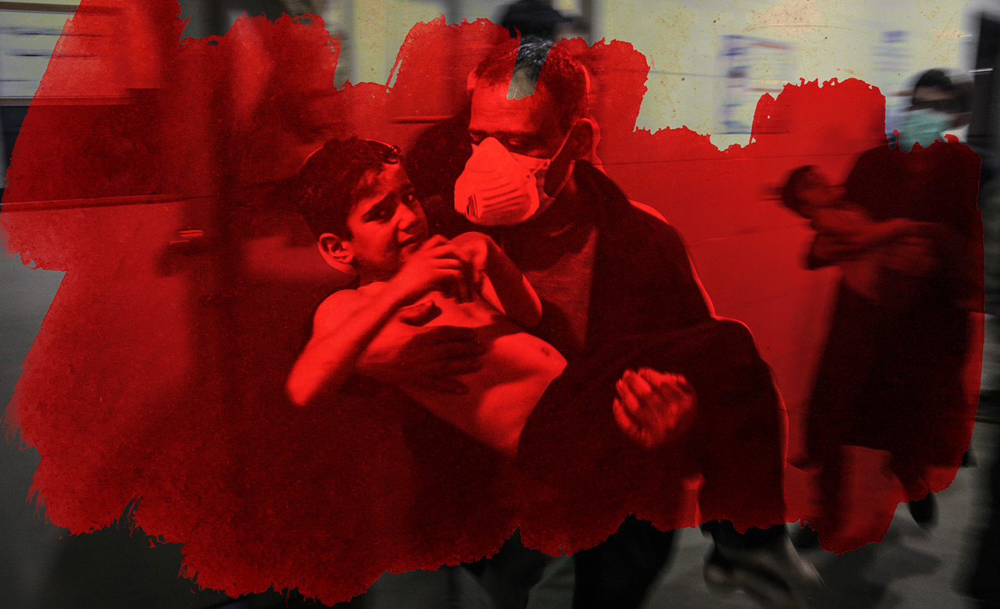

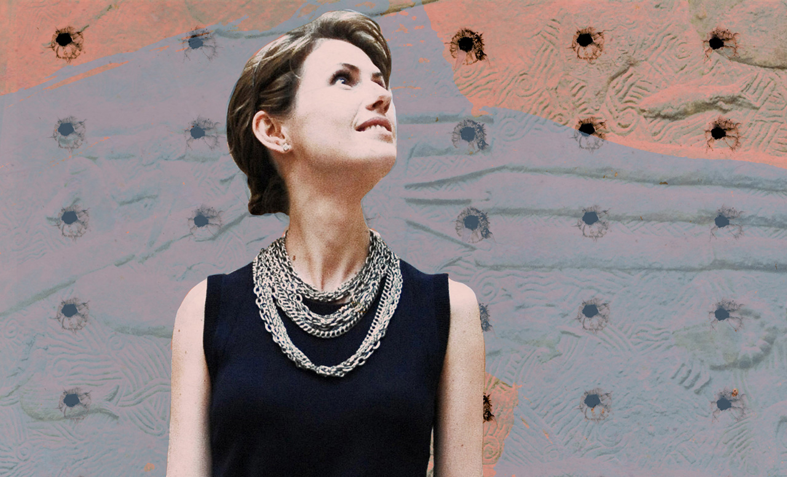

With Anisa dead, Makhlouf had lost his protector. The Syria Trust now took over the charity Makhlouf had used to curry favour in the Alawite heartlands. The government put Syriatel into receivership. Makhlouf’s bank accounts were frozen and Asma’s people installed on the boards of his enterprises.

Anisa 死了，Makhlouf 失去了他的保护者。叙利亚信托基金现在接管了马赫卢夫用来讨好阿拉维派中心地带的慈善机构。政府将 Syriatel 接管。 Makhlouf 的银行账户被冻结，Asma 的人进入了他的企业董事会。

In response Makhlouf tried to tear down Asma. In May 2020 he released a video on Facebook accusing “a group at the top” of plotting against him. At the same time, Russian media ran reports, citing Arab sources, that Bashar had spent $30m on a David Hockney painting for his wife (the story was false). But to little avail. Makhlouf remains under partial house arrest, rumoured to be kept alive only because he holds the passwords and deeds to overseas assets worth an estimated $10bn.

作为回应，马克鲁夫试图拆毁阿斯玛。 2020 年 5 月，他在 Facebook 上发布了一段视频，指责“高层团体”密谋反对他。与此同时，俄罗斯媒体援引阿拉伯消息来源报道称，巴沙尔花了 3000 万美元为他的妻子购买了一幅大卫霍克尼的画作（这个故事是假的）。但收效甚微。 Makhlouf 仍处于部分软禁状态，据传他之所以能活着，只是因为他持有价值约 100 亿美元的海外资产的密码和契约。

Asma’s mergers and acquisitions continue apace. Syria’s second-biggest mobile-phone firm has also gone into receivership; last month Asma’s cronies were appointed to its board. Emmatel – the phone company with her name – now has branches countrywide (even in areas her husband doesn’t control).

Asma 的并购继续快速进行。叙利亚第二大移动电话公司也进入破产管理程序；上个月，阿斯玛的亲信被任命为董事会成员。 Emmatel——以她的名字命名的电话公司——现在在全国都有分支机构（甚至在她丈夫无法控制的地区）。

The financial success and ruthless machinations have eroded Asma’s carefully cultivated image. “Some still love her, put her photo on their Instagram page. But most now perceive her as a sneaky greedy person,” said one Syrian businessman. These days, though, no one accuses Asma of failing to understand how Syria works.

经济上的成功和无情的阴谋侵蚀了阿斯玛精心打造的形象。 “有些人仍然爱她，把她的照片放在他们的 Instagram 页面上。但现在大多数人认为她是一个狡猾贪婪的人，”一位叙利亚商人说。不过，如今没有人指责阿斯玛不了解叙利亚的运作方式。

Late last year residents of the Damascus neighbourhood where Asma lives noticed a surreal change in the landscape. An old statue depicting a lauded colonel was joined by a new one: a vast sculpture of a horse’s head, at the direction of Asma’s business associates. Locals complained about the extravagance. According to reports in Gulf newspapers, the authorities had the horse’s head removed. Hours later it was back. The message was clear: in post-war Syria, Asma calls the shots.

去年年底，阿斯玛居住的大马士革社区的居民注意到景观发生了超现实的变化。在阿斯玛的商业伙伴的指导下，一尊描绘一位受人称赞的上校的旧雕像加入了一座新雕像：一尊巨大的马头雕塑。当地人抱怨这种铺张浪费。据海湾报纸报道，当局已将马的头砍掉。几个小时后它回来了。信息很明确：在战后的叙利亚，阿斯玛做主。

State media gives increasing air time to “the Lady of Jasmine”. Huge posters of her image have been spotted in her parents’ hometown of Homs, covering entire housing blocks. Uniquely for a Syrian First Lady, ministers have taken to displaying her portrait in their offices alongside Bashar’s.

官方媒体增加了“茉莉花夫人”的播出时间。在她父母的家乡霍姆斯发现了她形象的巨幅海报，覆盖了整个街区。对于叙利亚第一夫人来说，这是独一无二的，部长们已经开始在他们的办公室里与巴沙尔的肖像一起展示她的肖像。

With Makhlouf hobbled and Bashar’s sister and mother gone, Asma has few substantial rivals within the inner circle. Many of her closest advisers fill top posts in the president’s office. “She’s in control of palace appointees,” said a businessman who travels between Damascus and Europe. “She can nominate whomever she wants.”

随着 Makhlouf 步履蹒跚，Bashar 的姐姐和母亲离开，Asma 在核心圈内几乎没有强大的竞争对手。她的许多最亲密的顾问都担任总统办公室的高级职位。 “她控制着宫廷任命的人选，”一位往返于大马士革和欧洲之间的商人说。 “她可以提名任何她想要的人。”

“She would love to be president”  
“她很想当总统”  

Both in Damascus and foreign capitals, Syrians openly speculate whether she harbours political ambitions to climb to the very top. If Bashar’s position becomes untenable, could a President Asma offer a sop to the country’s Sunni majority while preserving continuity? There are even rumours that a family member recently met American officials to seek backing for such a scheme. “Bashar and Asma are both thinking about this,” says a former Syrian diplomat. “She would love to be president and both are considering it as a revolutionary solution to save the regime.”

在大马士革和外国首都，叙利亚人公开猜测她是否怀有攀登最高层的政治野心。如果巴沙尔的立场变得站不住脚，阿斯玛总统能否在保持连续性的同时向该国占多数的逊尼派提供安抚？甚至有传言说，一位家庭成员最近会见了美国官员，为这样的计划寻求支持。 “巴沙尔和阿斯玛都在考虑这个问题，”一位前叙利亚外交官说。 “她很想成为总统，双方都认为这是拯救政权的革命性解决方案。”

Once Britain might have supported Asma’s aspirations, happy to add to the collection of Middle Eastern leaders with British ties. Despite voluble denunciation of the Assads, the British government never revoked Asma’s citizenship, as it did with Shamima Begum, the east Londoner who travelled to Syria to join Islamic State in 2015 when she was still a teenager.

曾经英国可能支持阿斯玛的愿望，乐于增加与英国有联系的中东领导人的收藏。尽管对阿萨德政府进行了大声谴责，但英国政府从未撤销阿斯玛的公民身份，就像对待东伦敦人沙米玛·贝古姆 (Shamima Begum) 所做的那样，这位东伦敦人于 2015 年前往叙利亚加入伊斯兰国，当时她还是一名青少年。

Alawite hardliners are unlikely to support any bid by Asma for the presidency. Perhaps her most powerful potential opponent is Maher, Bashar’s younger brother, who still commands the feared Fourth Armoured Division of the army. “The military and the sect will conspire to stop her standing as president,” said a well-connected Syrian trader in Dubai.

阿拉维派强硬派不太可能支持阿斯玛竞选总统职位。也许她最强大的潜在对手是巴沙尔的弟弟马希尔，他仍然指挥令人生畏的陆军第四装甲师。 “军方和教派将密谋阻止她担任总统，”一位在迪拜人脉广泛的叙利亚商人说。

She is more powerful than ever, but also more vulnerable. Even talk of presidential ambitions could be dangerous for Asma. Though many of Asma’s friends distanced themselves from her years ago, they remain concerned about her well-being. In aiming for the biggest prize, the girl from west London could finally overreach. “I worry for her,” says Wafic Said. But as Asma realised long ago, there is no turning back.■

她比以往任何时候都更强大，但也更脆弱。甚至谈论总统野心对阿斯玛来说都是危险的。尽管阿斯玛的许多朋友多年前就与她疏远了，但他们仍然关心她的健康。为了获得最高奖项，这位来自西伦敦的女孩终于可以越界了。 “我为她担心，”Wafic Said 说。但正如 Asma 很久以前就意识到的那样，没有回头路可走。■

**Nicolas Pelham** is _The_ _Economist_’s Middle East correspondent  
尼古拉斯·佩勒姆 (Nicolas Pelham) 是《经济学人》驻中东记者  

ILLUSTRATIONS: **MICHELLE THOMPSON**  
插图：米歇尔·汤普森  

Additional images: Getty, EPA, Eyevine, Ken Goff Photos, Alamy, Camera Press, Anas Alkharboutli/Picture Alliance/Avalon

附加图片：getty、epa、eyevine、ken goff photos、alamy、camera press、anas alkharboutli/picture alliance/avalon

The Economist today  
今日经济学家  

## Handpicked stories, in your inbox  
精心挑选的故事，在您的收件箱中  

A daily newsletter with the best of our journalism  
每日时事通讯与我们最好的新闻
