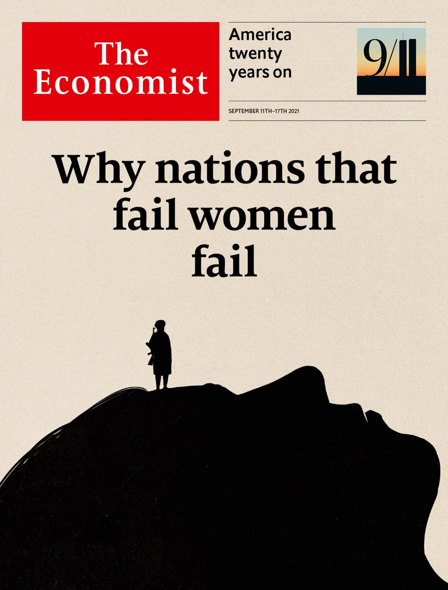

[Leaders](https://www.economist.com/leaders/) | Sex and geopolitics  
领袖 |性和地缘政治  

## And why foreign policy should pay more heed to half of humanity  
为什么外交政策应该更加关注人类的一半  

Sep 11th 2021  
2021 年 9 月 11 日  

AFTER AMERICA and its allies toppled the Taliban in 2001, primary-school enrolment of Afghan girls rose from 0% to above 80%. Infant mortality fell by half. Forced marriage was made illegal. Many of those schools were ropy, and many families ignored the law. But no one seriously doubts that Afghan women and girls have made great gains in the past 20 years, or that [those gains are now in jeopardy](https://www.economist.com/asia/the-taliban-announce-afghanistans-new-government/21804366).

2001 年美国及其盟友推翻塔利班后，阿富汗女孩的小学入学率从 0% 上升到 80% 以上。婴儿死亡率下降了一半。强迫婚姻被定为非法。这些学校中有许多是鲁莽的，许多家庭无视法律。但没有人会认真怀疑阿富汗妇女和女童在过去 20 年中取得的巨大成就，或者说这些成就现在正处于危险之中。

Listen to this story.  
听听这个故事。  

Enjoy more audio and podcasts on [iOS](https://economist-app.onelink.me/d2eC/bed1b25) or [Android](https://economist-app.onelink.me/d2eC/7f3c199).  
在 iOS 或 Android 上享受更多音频和播客。  

Your browser does not support the <audio> element.

Listen to this story  
听听这个故事  

Save time by listening to our audio articles as you multitask  
在处理多项任务时通过收听我们的音频文章来节省时间  

The United States is “committed to advancing gender equality” through its foreign policy, according to the State Department. Bequeathing billions of dollars-worth of arms and a medium-size country to a group of violent misogynists is an odd way to show it. Of course, foreign policy involves [difficult trade-offs](https://www.economist.com/leaders/2021/09/11/the-real-lessons-from-9/11). But there is growing evidence that Hillary Clinton was on to something when she said, a decade ago, that “The subjugation of women is…a threat to the common security of our world.” [Societies that oppress women](https://www.economist.com/international/2021/09/11/societies-that-treat-women-badly-are-poorer-and-less-stable) are far more likely to be violent and unstable.

据国务院称，美国“致力于通过其外交政策促进性别平等”。将价值数十亿美元的武器和一个中等规模的国家遗赠给一群暴力厌恶女性的人是一种奇怪的表现方式。当然，外交政策涉及艰难的取舍。但越来越多的证据表明，希拉里·克林顿 (Hillary Clinton) 十年前说“压制妇女……是对我们世界共同安全的威胁”时，她说的很有道理。压迫妇女的社会更有可能是暴力和不稳定的。

There are several possible reasons for this. In many places girls are selectively aborted or fatally neglected. This has led to skewed sex ratios, which mean millions of young men are doomed to remain single. Frustrated young men are more likely to commit violent crimes or join rebel groups. Recruiters for Boko Haram and Islamic State know this, and promise them “wives” as the spoils of war. Polygamy also creates a surplus of single young men. Multiple wives for men at the top means brooding bachelorhood for those at the bottom.

这有几个可能的原因。在许多地方，女孩被选择性地堕胎或被忽视得要死。这导致了性别比例失调，这意味着数百万年轻男性注定要保持单身。沮丧的年轻人更有可能实施暴力犯罪或加入反叛组织。博科圣地和伊斯兰国的招募人员知道这一点，并向他们承诺“妻子”作为战利品。一夫多妻制也造成单身青年过剩。高层男人有多妻意味着底层男人要沉思单身生活。

All conflicts have complex causes. But it may be no coincidence that Kashmir has one of the most unbalanced sex ratios in India, or that all of the 20 most turbulent countries on the Fragile States index compiled by the Fund for Peace in Washington practise polygamy. In Guinea, where a [coup](https://www.economist.com/middle-east-and-africa/2021/09/09/alpha-conde-the-president-of-guinea-is-ousted-in-a-coup) took place on September 5th, 42% of married women aged 15-49 are in polygamous unions. China’s police state keeps a lid on its many surplus men, but its neighbours sometimes wonder whether their aggression may some day seek an outlet.

所有冲突都有复杂的原因。但克什米尔是印度性别比例最不平衡的国家之一，或者华盛顿和平基金会编制的脆弱国家指数中最动荡的 20 个国家都实行一夫多妻制，这可能并非巧合。在 9 月 5 日发生政变的几内亚，42% 的 15-49 岁已婚妇女处于一夫多妻制。中国的警察国家对其许多过剩人员进行了压制，但其邻国有时会怀疑他们的侵略是否有朝一日会寻求发泄。

Outside rich democracies, the male kinship group is still the basic unit of many societies. Such groups emerged largely for self-defence: male cousins would unite to repel outsiders. Today, they mostly cause trouble. Tit-for-tat clan feuds spatter blood across the Middle East and the Sahel. Tribes compete to control the state, often violently, so they can divvy up jobs and loot among their kin. Those states become corrupt and dysfunctional, alienating citizens and boosting support for jihadists who promise to govern more justly.

在富裕的民主国家之外，男性亲属团体仍然是许多社会的基本单位。这些团体的出现主要是为了自卫：表兄弟会联合起来排斥外来者。今天，他们大多制造麻烦。针锋相对的氏族仇恨在中东和萨赫勒地区溅起鲜血。部落为了控制国家而竞争，通常是暴力的，这样他们就可以在他们的亲戚之间分配工作和掠夺。这些国家变得腐败和功能失调，疏远了公民，并增加了对承诺更公正治理的圣战分子的支持。

Societies based on male bonding tend to subjugate women. Fathers choose whom their daughters will marry. Often there is a bride price—the groom’s family pay what are sometimes hefty sums to the bride’s family. This gives fathers an incentive to make their daughters marry early. It is not a small problem. Dowries or bride prices are common in half the world’s countries. A fifth of the world’s young women were married before the age of 18; a twentieth before 15. Child brides are more likely to drop out of school, less able to stand up to abusive husbands and less likely to raise healthy, well-educated children.

基于男性关系的社会往往会压制女性。父亲选择他们的女儿嫁给谁。通常会有彩礼——新郎的家人有时会向新娘的家人支付巨额款项。这让父亲们有动力让女儿早婚。这不是一个小问题。嫁妆或彩礼在世界上一半的国家都很普遍。世界上五分之一的年轻女性在 18 岁之前结婚； 15 岁之前的二十分之一。童养媳更有可能辍学，更难以忍受虐待丈夫，更不可能抚养健康、受过良好教育的孩子。

Researchers at Texas A&M and Brigham Young universities compiled a global index of pre-modern attitudes to women, including sexist family laws, unequal property rights, early marriage for girls, patrilocal marriage, polygamy, bride prices, son preference, violence against women and legal indulgence of it (for example, can a rapist escape punishment by marrying his victim?). It turned out to be highly correlated with violent instability in a country.

德州农工大学和杨百翰大学的研究人员编制了一份关于前现代女性态度的全球指数，包括性别歧视的家庭法、不平等的财产权、女孩早婚、父居婚姻、一夫多妻制、新娘价格、重男轻女、对妇女的暴力行为和法律放纵它（例如，强奸犯可以通过与受害者结婚来逃避惩罚吗？）。事实证明，它与一个国家的暴力不稳定高度相关。

Various lessons can be drawn from this. In addition to their usual analytical tools, policymakers should study geopolitics through the prism of sex. That index of sexist customs, had it existed 20 years ago, would have warned them how hard nation-building would be in Afghanistan and Iraq. Today, it suggests that stability cannot be taken for granted in Saudi Arabia, Pakistan or even India.

从中可以得出各种教训。除了通常的分析工具外，政策制定者还应该通过性的棱镜来研究地缘政治。这种性别歧视习俗指数如果在 20 年前就已经存在，就会警告他们在阿富汗和伊拉克建设国家会有多么困难。今天，它表明沙特阿拉伯、巴基斯坦甚至印度都不能想当然地保持稳定。

Peace talks should include women. Between 1992 and 2019, only 13% of negotiators and 6% of signatories of peace deals were female. Yet peace tends to last longer when women are at the table. This may be because they are more ready to compromise; or perhaps because a room without women implies a stitch-up between the men with guns without input from non-combatants. Liberia got this right and ended a ghastly civil war; Afghanistan’s new rulers have not.

和平谈判应包括妇女。 1992 年至 2019 年间，只有 13% 的谈判者和 6% 的和平协议签署者是女性。然而，当女性在谈判桌前时，和平往往会持续更长时间。这可能是因为他们更愿意妥协；或者也许是因为一个没有女人的房间意味着在没有非战斗人员参与的情况下，持枪男子之间的缝合。利比里亚做对了，结束了一场可怕的内战。阿富汗的新统治者没有。

More broadly, governments should mean it when they say they want to liberate half of humanity. Educate girls, many of whom have quit school to work or marry since covid-19 impoverished their families. Enforce bans on child marriage and on female genital mutilation, hard though that is in remote villages. Do not recognise polygamy. Equalise inheritance rights. Teach boys not to hit women. Introduce public pensions, which undermine the tradition whereby couples are expected to live with the man’s parents, because the elderly have no other means of support.

更广泛地说，当政府说他们想要解放一半的人类时，他们应该是认真的。教育女孩，自从 covid-19 使她们的家庭陷入贫困以来，她们中的许多人已经辍学去工作或结婚。强制禁止童婚和切割女性生殖器官，尽管这在偏远的村庄很困难。不承认一夫多妻制。平等继承权。教导男孩不要打女人。引入公共养老金，破坏了夫妻应与男方父母同住的传统，因为老人没有其他养活方式。

Most of these are tasks for national governments, but outsiders have some influence. Since Western donors started harping on about girls’ education, more girls have gone to school (primary enrolment has risen from 64% in 1970 to nearly 90% today). Campaigners against early marriage have prompted more than 50 countries to raise the minimum age since 2000. Boys need to learn about non-violence from local mentors, but ideas about how to design such programmes are shared through a global network of charities and think-tanks. Donors such as USAID and the World Bank have done a fair job of promoting property rights for women, even if their Afghan efforts are about to go up in smoke.

其中大部分是国家政府的任务，但外界也有一些影响。自从西方捐助者开始对女童教育喋喋不休以来，更多的女童上学（小学入学率从 1970 年的 64% 上升到今天的近 90%）。自 2000 年以来，反对早婚的活动家已促使 50 多个国家提高最低年龄。男孩需要从当地导师那里学习非暴力，但有关如何设计此类计划的想法通过全球慈善机构和智库网络共享.美国国际开发署和世界银行等捐助者在促进妇女财产权方面做得很好，即使他们在阿富汗的努力即将化为乌有。

## The radical notion  
激进的观念  

Foreign policy should not be naive. Countries have vital interests, and need to deter foes. Geopolitics should not be viewed solely through a feminist lens, any more than it should be viewed solely in terms of economics or nuclear non-proliferation. But policymakers who fail to consider the interests of half the population cannot hope to understand the world. ■

外交政策不应该天真。国家有切身利益，需要威慑敌人。地缘政治不应该仅仅从女权主义的角度来看，就像它不应该仅仅从经济学或核不扩散的角度来看一样。但是，不考虑半数人口利益的政策制定者就没有希望了解这个世界。 ■

This article appeared in the Leaders section of the print edition under the headline "Why nations that fail women fail"

这篇文章出现在印刷版的领导人部分，标题为“为什么让女性失败的国家会失败”

### From the September 9th 2021 edition  
从 2021 年 9 月 9 日起  

Discover stories from this section and more in the list of contents  
发现本节中的故事以及目录中的更多内容  

[Explore the edition](https://www.economist.com/printedition/2021-09-11)

The Economist today

## Handpicked stories, in your inbox

A daily newsletter with the best of our journalism
