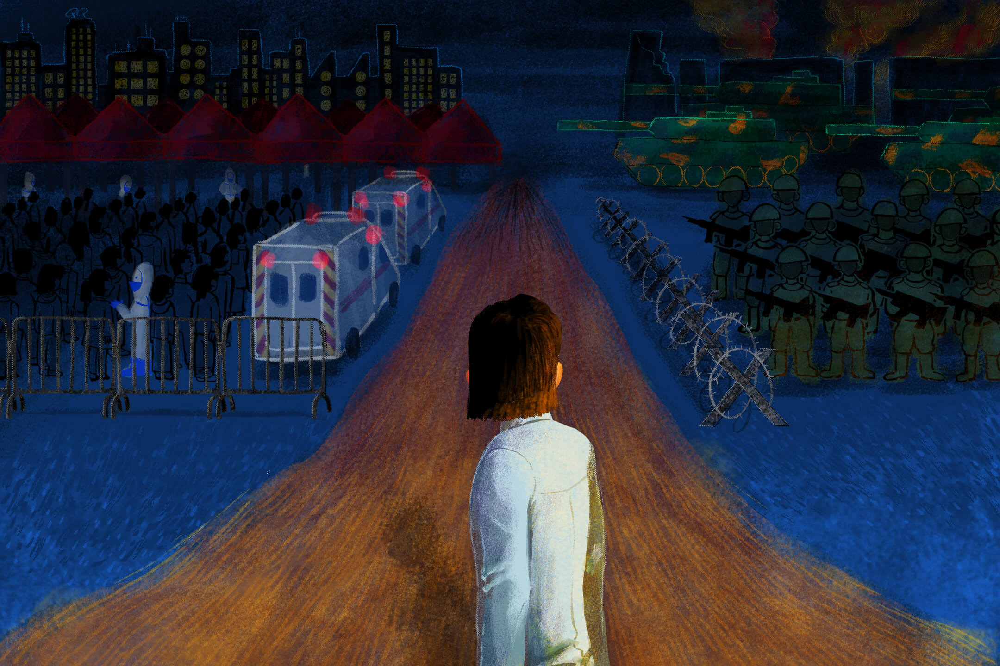
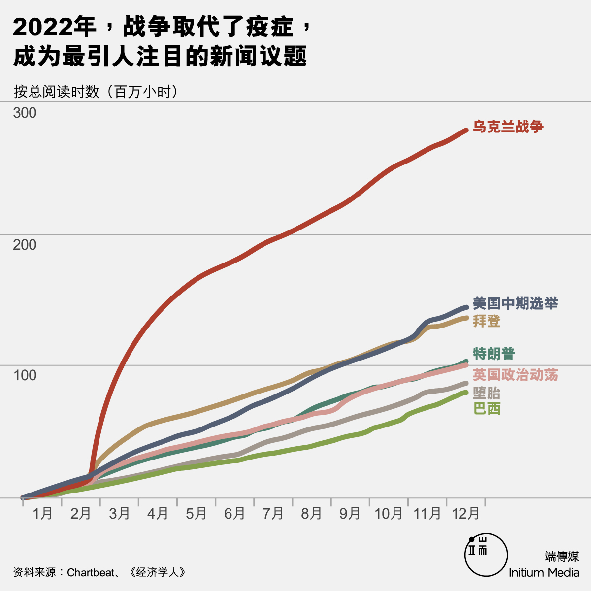
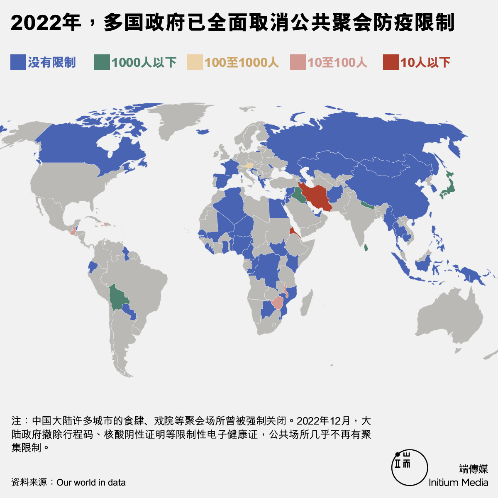
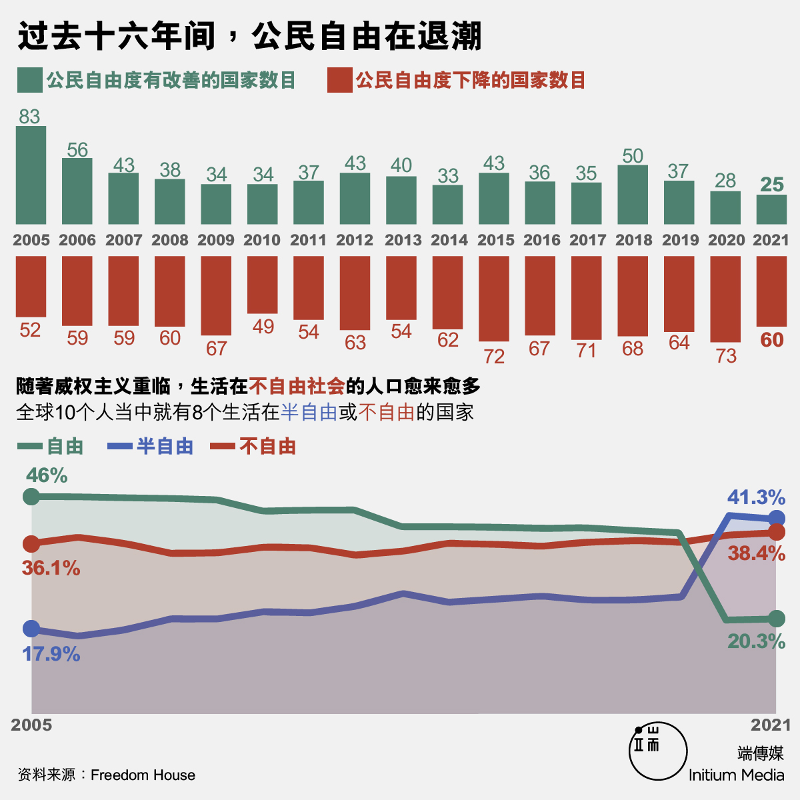
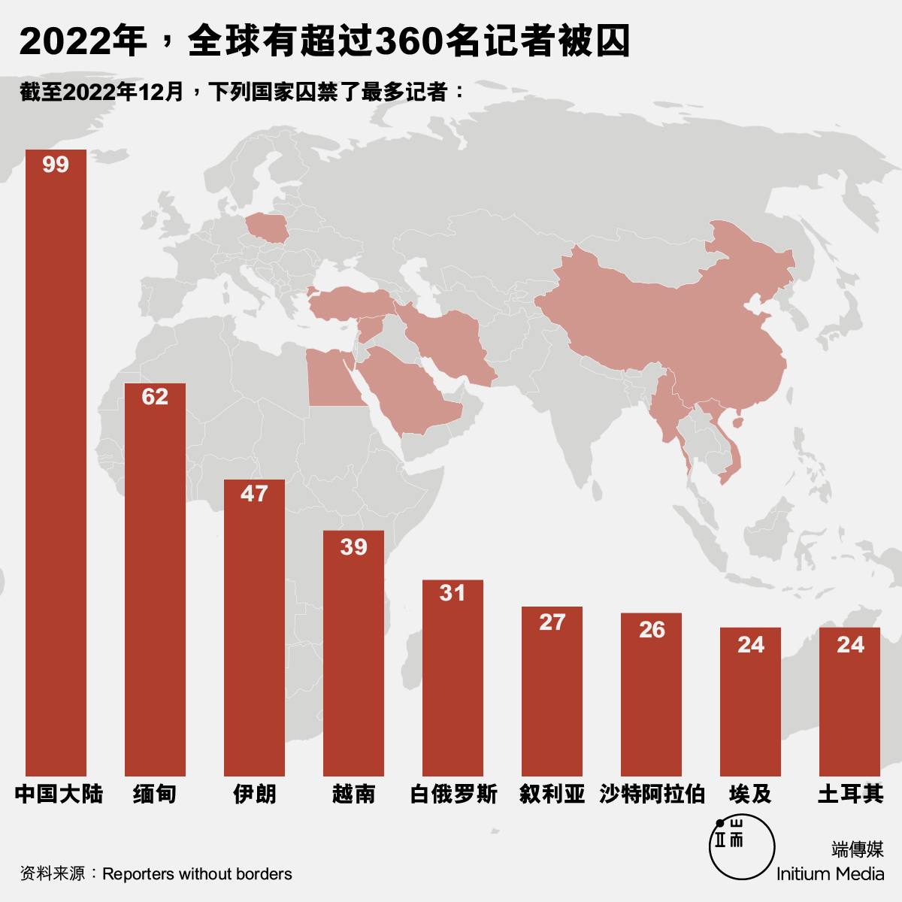
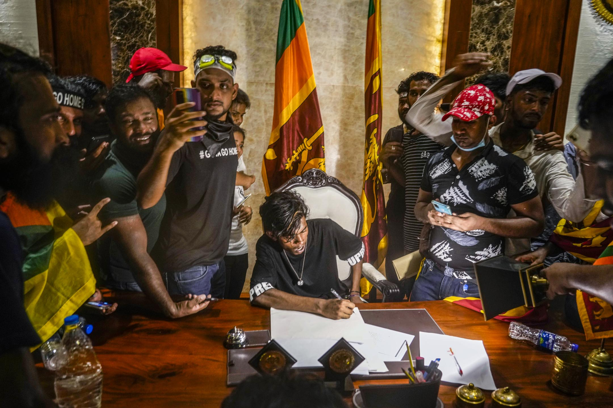
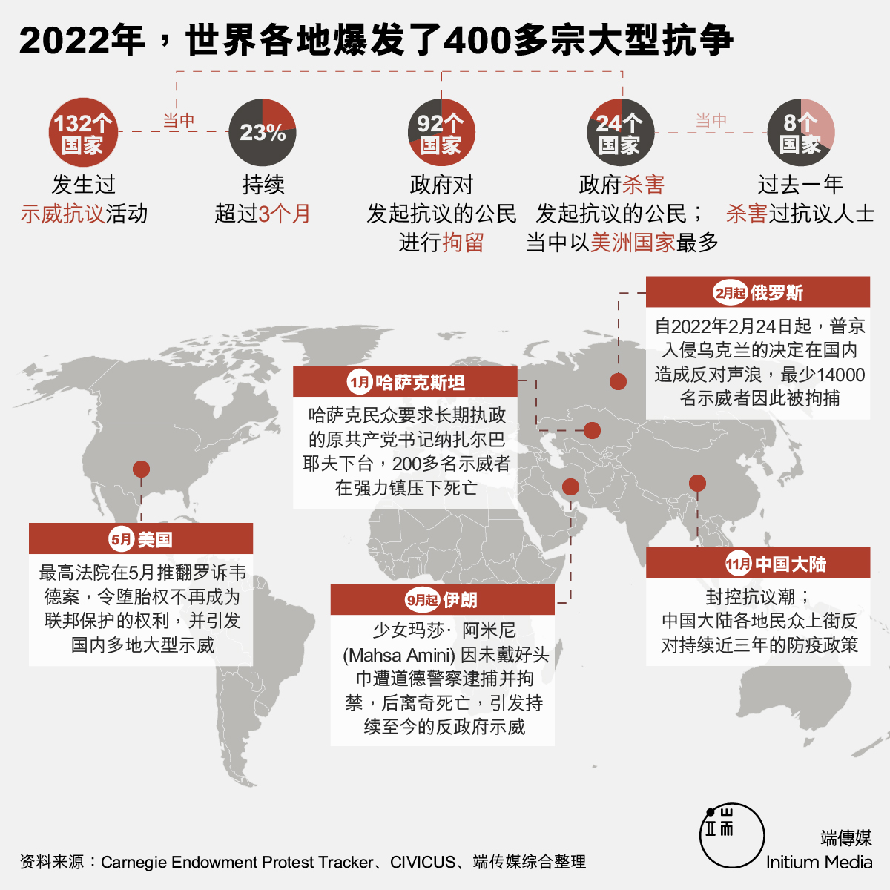
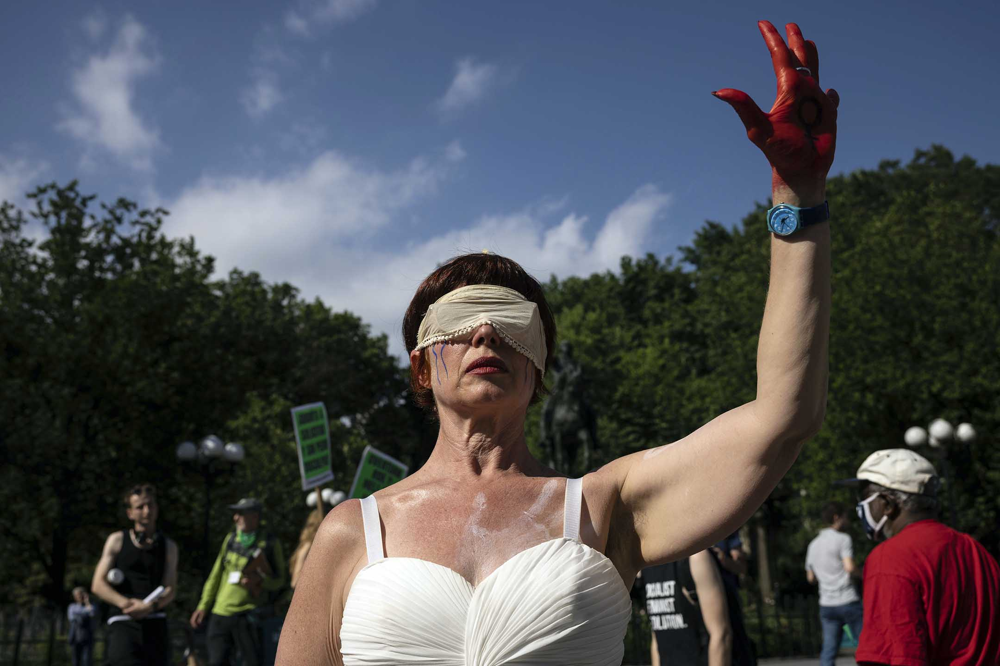
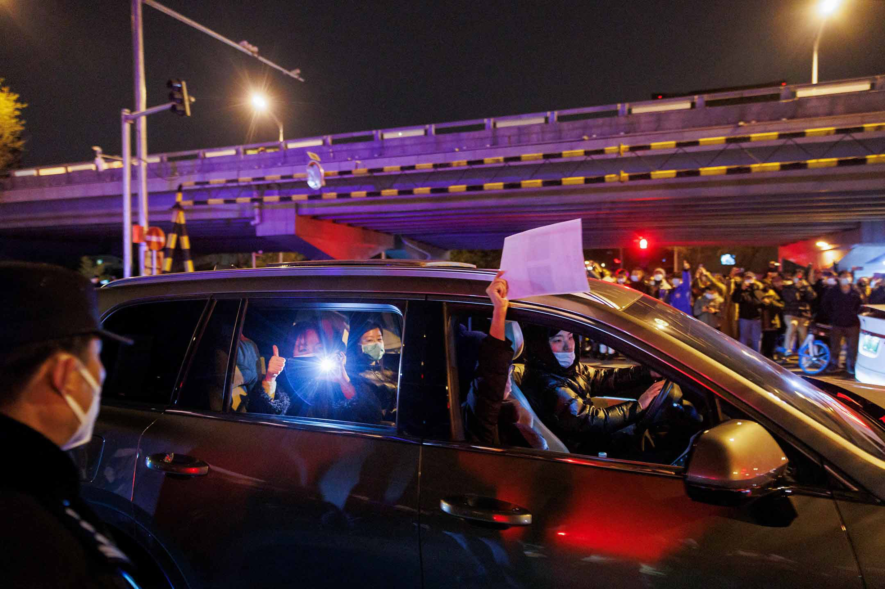
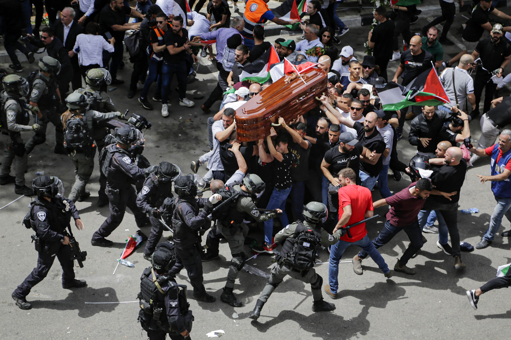

插画：Bronzebucket

在俗套地用狄更斯的《双城记》开篇名句来形容 2022 前，我负责任地研究了一下，历史上“最坏的一年”到底是哪一年。

关于这个问题，哈佛历史学家 Michael McCormick 提出的答案是：公元 536 年。那年一座相信位于现今印尼的火山爆发了，火山灰直上高空，远至欧洲的天空都被染成一片灰黑色。当时拜占庭帝国学者 Procopius 说：“这年一个最可怕的预兆发生了，太阳黯淡无光，看起来像日蚀。”那不是日蚀，只是中世纪全球寒冷期之始：此后十年气温骤降，六月飞霜，从中国到欧洲都经历了农作物歉收，造成大规模饥荒。更不用说当时欧洲在打仗：查士丁尼大帝决心收复罗马帝国国土，开始了将持续二十年的哥德战争，将欧洲打成了一片废墟。而且西征后返乡的士兵还带来了鼠疫。这场“查士丁尼大瘟疫”灭了欧洲一半人口，死亡人数[估计](https://www.nationalgeographic.com/animals/article/140129-justinian-plague-black-death-bacteria-bubonic-pandemic#:~:text=The%20Justinian%20plague%20struck%20in,Africa,%20Arabia,%20and%20Europe.)在 3 千万至 5 千万之间。

战争和疫症总是密不可分。罗马史上第一场瘟疫是镇压叙利亚叛乱后，随士兵回到罗马的。在中世纪后期，英法打百年战争打得正高兴的时候爆发黑死病，被逼停战八年，直到死人死得差不多了，才重新开始打起来。1666 年，英国跟荷兰因争夺航线开战，同年大[鼠疫](https://www.historic-uk.com/HistoryUK/HistoryofEngland/The-Great-Plague/)爆发，半个伦敦还被一场[大火](https://www.historic-uk.com/HistoryUK/HistoryofEngland/The-Great-Fire-of-London/)烧掉了。1918 年，一战刚刚落幕，西班牙流感就席卷全球，杀死 5 千万人。而也有一说是曹操输了赤壁之战，不单是因为战略错误，还是因为当时疫病流行，曹军本来就因瘟疫损兵折将。著名的“建安七子”就有四个因染疫而死。

\[

\]4

2022 年，大疫三年似乎快要过去，欧美在年初就不需要过著戴口罩的生活，也不必保持社交距离了；连防疫封控最严厉的中国大陆，也在 11 月的[反封控抗议潮](https://theinitium.com/channel/mainland-zero-covid-protest)后颁布了“新十条”，宣布大规模的解封措施。这一年本来是世界可以喘一口气的一年。但这年二月，欧洲大陆再起战端，打破了许多人对现有世界秩序的幻想。研究苏联史的著名学者﹑记者 Anne Applebaum 在《大西洋》[撰文](https://www.theatlantic.com/magazine/archive/2022/12/putin-russia-must-lose-ukraine-war-imperial-future/671891/)，指在苏联治下贫困恐怖的数十年间，也曾有许多自由派相信苏联可以民主化；但这些自由派都有个盲点：帝国计划正是苏联威权主义的根源。数十年以后由俄罗斯发动的这场战争，仍是历史的沉疴。

我们从来没有脱离过历史的羁绊，即使我们活在一个谈“元宇宙”的世界，一个人工智能可以胜出绘画比赛，又可以写文案写[论文](https://www.google.com/search?q=chatgpt%20paper&rlz=1C5CHFA_enUS912US912&oq=chatgpt%20paper&aqs=chrome..69i57j0i10i131i433i512j0i10i512l8.4318j0j9&sourceid=chrome&ie=UTF-8#fpstate=ive&vld=cid:7c72d810,vid:QhQzZdjgOf4)的赛博世界。而 2023 年，有甚么在等著我们呢？世界本来有望告别疫情，但中国大陆在药物短缺﹑老人疫苗接种率低下的环境下突然全面解封，有可能催使病毒再次[变种](https://www.aljazeera.com/news/2022/12/21/beijing-expects-surge-in-covid-19-as-mutation-concerns-experts)；俄罗斯在乌克兰没有得到预期中的胜利，但这场战争短期内似乎不会[完结](https://www.bbc.co.uk/news/world-us-canada-63987113)。欧洲正面对数十年来最严重的停滞性[通膨](https://theinitium.com/article/20221205-international-cost-of-living-crisis-in-uk/)和随战事而来的能源危机。美国法院[推翻](https://theinitium.com/article/20220707-international-why-is-abortion-issue-so-divisive-in-us/)罗诉韦德案，在人权上倒退了一大步。世界仍然未能团结应对气候问题，2022 年是史上[最热](https://theinitium.com/article/20220815-international-heat-wave-2022/)的一年。世界似乎没给我们任何期待新一年的理由。

对比在古代因战乱流离失所，因不知源头的疫症不明不白地死去的人，我们今天过得安稳得多，物质资源也要丰富得多。但物质没有让我们对未来更充满希望。写稿时在网上看到一个流传甚广的 meme，标题是“2022 年度总结”：从 1 月到 11 月都是“做核酸”，到了 12 月是“阳性”。朋友打趣说那是“中国人的 2022”。我们不是谁都有经历过这种日子，但这种徒劳﹑无奈﹑身不由己，大概人类共通。那是我们所有人的 2022。

世界正转向威权和保守主义

如果要选一个 2022 年的关键字，应该许多人会选“封控”或“隔离”。“Quarantine”源自意大利文 quaranta giorni，意思是四十天。在 14 世纪黑死病流行的时代，位于亚德里亚海岸，当时受威尼斯管治的杜邦力（Dubrovnik；位于现今克罗地亚）颁布了一条隔离令：所有人和船入城前都要先与世隔绝四十日。一直到 19 世纪末年，法国巴斯德研究院的耶尔森（Alexandre Yersin）才在研究香港鼠疫时，发现了鼠疫病毒由鼠疫杆菌引起（故鼠疫杆菌学名为 Yersinia pestis）。在此之前，人们只知道病了的人体内有甚么可怕的东西会传到别人身上，所以健康的人和发烧﹑流鼻水﹑呕吐不止的人应该隔开。但正如 The History and Future of Quarantine 一书所说的：这样的区隔同时“开启了哲学上的不确定性﹑伦理风险﹑以及政治权力可能的滥用。”

无疑，在 COVID-19 全球大流行以前，威权主义就已经有卷土重来的痕迹。2016 年，哈佛著名政治学家 Pippa Norris 在《华邮》撰文，指出威权民粹主义崛起是一种对“进步西方”的文化反弹。自 1960 年代起，黑人民权运动﹑女权运动﹑同性恋平权等等，都在直接挑战传统价值，引起了许多群体被边缘化的恐惧。这个解释可能有点西方视角，但威权主义的确有千千万万张脸孔，不是全部都是大棒，有些就是有种文化捍卫者的意味，例如中国大陆近年对“爹”的文化崇拜，对女性传统生儿育女角色的维护等等，都仍然是专制主义的特色。社会学者徐贲在《暴政史》里也提出：鼓吹对所有权威，包括家庭的权威服从，也是威权政体的一大特色。而这些对“传统文化”的捍卫，的确不止见于西方社会。

美国人权倡议机构“自由之家”（Freedom House）发表了一份《2022 世界自由研究报告》，题目非常明确：“威权统治的全球扩张”。报告里每一项数字都怵目惊心：从 2005 年到 2021 年的十六年间，不自由或半自由的政体愈来愈多。全球有更多人活在不自由的社会。选举不公和滥权情况在许多国家已成为常态，例如专制的巴西前总统波索纳洛（Jair Bolsonaro）跟特朗普一样，在选举前就先指控选举舞弊。而即使是被视为民主灯塔的美国，也在 2021 年初经历了有组织地意图推翻民主选举结果的国会山事件，今年也在各项指标上大幅退步。报告也特别指出，威权国家如中国和俄罗斯，正在国际体系中获得愈来愈多的话语权，并以此威胁世界民主自由。

而在许多人认为科技会解放人类的同时，互联网自由在许多国家都受到限制，缅甸和伊朗政府以“断网”来打击示威，大概证明了科技本身完全不足以“解放人类”。而在 COVID-19 期间，[中国](https://theinitium.com/article/20220916-mainland-surveillance-in-china/)和[俄罗斯](https://theinitium.com/article/20220909-international-surveillance-in-moscow/)更大幅扩张国内监控网络；莫斯科利用 17 万个天眼镜头配合人脸识别系统，一方面抓国内的反战示威者，一方面就抓那些“违反防疫规定的人”。2022 年中，俄罗斯已经取消了绝大部份 COVID-19 的防疫措施，但在疫情期间增强的监控软硬件，会继续威胁公民的个体自由。

威权扩张之下，许多人的选择是“润”－－在中国大陆的防疫封控似乎会无了期的延续的这一年，润学（runology﹑runxue）成为了网络显学。“润”不止包括离开出生地，也包括不生孩子：中国大陆一名年轻男子和“大白”冲撞中说了一句“这是我们最后一代”，影片后来被疯传，一时成为了网络迷因，直至被全网删除。

但人们仍然在反抗

社会学家徐贲在《暴政史》里，爬梳了古往今来极权和暴政的意识形态和运作手法。关于“暴政究竟在做甚么”的问题，徐贲认为能从八个方面归纳：

2022 年 7 月 13 日，一名示威者冲进斯里兰卡总理威克瑞米辛赫 (Ranil Wickremesinghe) 的办公室，并坐在他的办公桌，斯里兰卡面对严重的经济危机，加上示威者不满政府管治，触发大型示威。摄：Rafiq Maqbool/AP/达志影像

**统治者通常是一个利益集团，而不是个人**。这就是阿伦特（Hannah Arendt；另译鄂兰）所说的“洋葱式结构”：极权的领袖坐在中心，然后是他的亲信﹑近臣﹑党羽；外面还有一群崇拜他，迷恋他的普通人。但当然只有接近圆圈内围的，才是真正的统治者。

**在暴政下的公民也会愈来愈虚伪奸狡**。 他们出于绝望，只能相信暴政是“救世主和明君”，发展出一种卑微的奴隶心态。

**专制下的公民会对政治避而不谈**。他们出于恐惧，不敢妄议政事；而且政权会让他们终日为生计劳碌奔波，没时间多管闲事。国家以外的组织，例如教会﹑工会，只能有限度存在，或一概不准存在。

**大棒和胡萝卜要一起用**。 洗脑学习班﹑秘密警察﹑武警等少不了，但也偶尔要派些糖果，最好不必使用暴力，公民就对政权感恩戴德。

**垄断信息来源。** 传媒要杀掉，用一堆官方组织取而代之成为“真相来源”，其他事情禁问禁提。

**私人生活和家庭结构也要符合暴政需要**。 君臣父子﹑三纲五常家庭伦理﹑“天下无不是之父母”－－对家庭的权威服从，也是对党服从的一部份。

**有些暴政会有向外扩张的野心** 。国内人民吃不饱也要去打仗，除了经济还有意识形态的原因。

**让一群人先富起来**。 只要有廉价娱乐，声色犬马，既得利益者就会成为“发财梦”的代言人，让其他人都发梦致富，爬上社会上层。不肯遵循这个游戏规则的，就关在监狱里，或流放国外。

在这八个威权或极权“特色”清名单中，有一半是关于控制公民思想的。2020 年由牛津出版的《暴政史》长近五百页，第一部份讲何谓极权主义，第二部份讲希特勒﹑毛泽东﹑斯大林如何推动个人崇拜，第三部份讲极权如何向听话的公民派发胡萝卜，第四部份题为“伪神时代的诱惑﹑幻灭和反抗”－－当中终于有关于反抗的篇章（例如[末章](https://theinitium.com/article/20190825-book-xuben-george-orwell-erika-gottlieb/)“即使是被打败，也要充满勇气”－－《奥威尔难题》）。研究现代权力运作的傅柯（Michel Foucault）同样是个驱欢者。去年 COVID-19 防控措施仍然非常严格时，我在[年末](https://theinitium.com/article/20211231-international-end-of-year-search-for-meaning/)的文章中写了圆形监狱（panopticon），但没有写傅柯教我们怎样逃出去，如何避过监狱中心那个全知全能的典狱长。事实上相比对权力的描述，他对反抗著墨确实不多，但他的确没有排除抵抗的可能性。例如他说过知识不是为了“理解”而创造，而是为了“切割”而创造的（knowledge is not made for understanding; it is made for cutting）。他要切割的，自然是千丝万缕，无处不在，极难抵抗的现代权力与暴力。

2022 年正好证明，那怕有多么多的洗脑﹑监控，反抗仍然可能－－这年除了是威权继续扩张的一年，却也是公民表现能动性的一年。这年全球爆发了 400 多起抗争，当中有不少甚至持续三个月以上。而这一年，全球许多女性也走到了抗议队伍的前方。在伊朗，因库尔德族少女阿米尼之死而引发的大型抗争动员了许多伊朗女性，被视为一场“feminist revolution”（[女性主义的抗争](https://theinitium.com/article/20221226-opinion-international-iran-revolution/)）：这场运动由许多妇女﹑年轻女孩领导，但抗议的不是头巾，而是伊朗整个腐败的政治系统。今年 5 月美国政府推翻罗诉韦德案，全国各地爆发示威抗议，参与和组织者也多是女性。在缅甸，反政府在 11 月中国大陆的反封控抗议潮中，参与的不止有女性，也有酷儿群体。在抗争现场，女性关注的议题仍然[无法](https://theinitium.com/article/20221221-her-country-china-protest-female-queer/)获得多数人回应，但她们还是展现了更多元，也更包容的视角。

几年前读柏克莱历史学家 Shana Penn 写的八十年代波兰反抗史，写女性抗争者的那几章让我印象特别深刻。在保守﹑男女严重不平等的波兰，那些西方社会自六十年代就闹得风风火火的“女性解放”几近不存在，女人的角色就是母亲﹑女儿﹑妻子，人生属于锅碗瓢盆，而家国大事是怎么样都轮不到她们管的。但也是因为这样，女性在那些见不得光的地方组织了天罗地网，并用之来颠覆一个看不起她们的政权。当警察以为她们是打扮精致，供人玩赏的洋娃娃时，她们在口红筒里，在裙子里藏秘密信息；警察来家里翻箱倒箧找被禁的地下刊物时，她们把文件都塞到卫生用品里﹑或者婴儿床底下，那些大男人们连踫都不屑踫的地方。那些年连老奶奶和怀孕妇女都加入了反抗，而她们的脆弱也是她们最大的武器：在国家叙事里她们并不存在，所以她们是透明的。

在 2021 年政变后的缅甸，女性抗争者利用了相同手法来组织反抗活动。在缅甸文化中，男性优于女性是因为他们有“hpone”，意即荣誉﹑权力；所以男女的衣服不能一起洗，因为跟女人的内衣裤太污秽，会夺走男性天生有的 hpone。所以缅甸的女抗争者就将自己的纱裙吊在大街上，让军人不敢穿过；又把卫生棉贴在夺权的军方领袖照片上。从八十年代的波兰到今日的缅甸，女性在抗争中一直没有缺席。

2022 年 6 月 24 日，纽约联合广场，最高法院决定推翻“罗诉韦德案”后，一名示威者在抗议。摄：Yuki Iwamura/AP/达志影像

为何爱这个世界如此艰难？

有时候，我觉得人生有点像我小时候玩过的一个接鸡蛋游戏。九十年代我外婆家楼下有一档文具店，门口有一列长长的扭蛋机﹑游戏机和明星 Yes!卡机。我和妹妹每次去看外婆，就会央求舅母给我们零钱，在那家文具店消磨一个下午。其中有一部机，是要控制一个拿著篮子的农夫，去接从天上不停掉下来的鸡蛋。放进一个一块硬币后，“Ol’ Mcdonald had a farm”的音乐响起，代表鸡蛋的橙色小球不断从顶部掉下来；我和妹妹就兴奋地把农夫拉往左又拉往右，尝试接到最多的鸡蛋。我们很喜欢那部游戏机，能连续玩个十来二十次。

香港租愈来愈贵，那家文具店早就没了；外婆也搬离了以前的家，住进了老人院。而近年和朋友聊天的话题，早就不是去哪里玩，而是要不要离开香港？父母年纪开始大了，就这样丢下吗？如果离开（留下）了，我们会后悔吗？然后，舍得吗－－这个我们曾经以为永远都是家的地方？2022 年初外婆悄悄地走了，而我在外地已经三年没能去看她，只能让她偶尔透过视像看看我。当时香港的疫情防控措施仍很严格，她在医院离开时没半个家人在身边。

游戏好玩是因为游戏会停。而人生就好像拿著个篮子，要接稳源源不绝的，从头上掉下来的鸡蛋，直到我断气的那一天。而我才活了多久？就已经一身都是蛋汁了。

外婆离开之后，我想起白发渐多的父母，突然明白自己的人生往后都会有很多悔恨。“悔恨”二字真好，中文真好。那不止是英语语境里的 grief 或 remorse，我不只是在哀悼我失去了的一切；也不是有宗教意味的 penitence 或 repentence，我没有自己承担不起的罪责。悔恨是为了一些我无法改变的事，心中产生了无法消弭的，几乎伸手可触的实实在在的恨。午夜梦回仍咬牙切齿但不敢宣之于口的恨。

2022 年底，香港的疫情防控措施终于放松不少，但在香港想念我的人愈来愈少了，我没提得起劲回去。又要再说一次中文真好，因为那些诗词我终于都懂透了：“近乡情更怯，不敢问来人”。2019 年后，我花了好长一段时间接受自己的离散身分，接受有一部份的我在那一年之后已经死了。此后的人生仍能精彩﹑幸福，但我已经是另一个人。我也发现，最近两年我常常在害怕身边人突然生病或车祸死掉。有一晚我突然想出来为甚么：从今以后，只有他跟我相依为命了。

经历了 2019 年的“死亡”，我也开始研究[希望](https://theinitium.com/tags/_1540/)这回事，研究韦伯说的志业能不能让我们心怀希望，又读了一堆共产东欧的反抗史。小时候香港有个家传户晓的广告金句：“希望在明天丫嘛！”但我发现是希望不在明天，因为明天也还不存在（除非你相信过去现在将来同时存在，宇宙剧本早已写好，那另当别论）。希望在我们的记忆里，在我们已经经过的时间里，在我们无数次的失败与眼泪当中，在我们最深最不愿提起的伤痛中。

2022 年 11 月 28 日，北京，为乌鲁木齐火灾受害者守夜后的集会上，一名车内的人拿著一张白纸抗议。摄：Thomas Peter/Reuters/达志影像

不久前我在网上看到一句话，印象很深：“爱自由的心情是按捺不住的，都来人间一趟了。”我有点感动，但之后几乎立刻陷入怀疑。这句话是甚么意思？人真的是生而爱自由的吗？弗洛姆（Erich Fromm）应该会说事情没那么简单，现代社会的各种解放可能是让人自由了，但却没能给他们幸福感﹑安全感；有些人还是会宁愿放弃一部份的自己，依赖权威。随便问别的，毕生研究像纳粹这样的极权的法兰克福学派学者，一个个大概也会对这句话表示怀疑，例如阿多诺不也说有喜爱服从的权威性人格（authoritarian personality）？

后来我却隐隐觉得：某程度上，这些都不太重要，重要的是那一切有发生过。美国作家 Rebecca Solnit 在小书《黑暗中的希望》（Hope in the Dark）里写道：“因果关系假定了历史是向前推进的，但历史不是一支军队。历史是一只蠕蠕侧行的螃蟹，是缓缓磨平硬石的温柔水滴，是一场打破持续数世纪的张力的地震。”谁赢了谁输了，谁成功谁失败，谁都不知道。唯一要记住的是，曾经有那么一刹，人们发出了要自由的呼声。那是真实的，应该要留存在我们的记忆里的。

十年前我在伊朗，途上认识的女生朋友们向我展示她们在 2009 年绿色革命中，除下头巾走上伊朗街头的照片。伊朗男生们也骄傲地跟我说，那年他们跟他们的姐妹﹑女性朋友一起上街，她们全都除下了头巾，和所有人一起手握绿色的，印著“我的选票去了哪里”的旗帜，在街上叫著自由民主的口号。那时刚巧也在进行世界杯比赛，伊朗球员手上挂著绿色的手带支持运动。但那场运动当然不只得情绪高涨﹑充满希望的一面。一个伊朗社运女生跟我说，她的前男友在绿色革命期间，在大学宿舍目睹同学被民兵枪杀，自此不肯见人不肯说话，变得疯疯癫癫。许多反对派领袖逃亡到外国。超过百人死亡，当中有大学生，有记者，有妇女。

即使如此，说起三年前的那场全民运动各种高光时刻，伊朗人眼里都仍闪著光。过了好几年，他们的脸书头像还是 2009 年在街上，除下头巾意气风发的照片。我能理解他们的情感，但也不禁有点愤世地想：那场运动到底是失败了。但这一年，他们再一次除下了头巾，投入了另一场更大型，诉求更多元，更包容，更持久的抗争。他们让我想到了神学家 Walter Brueggemann 的话：记忆产生希望，如同失忆产生绝望（Memory produces hope the same way as amnesia produces despair）。那些伤痛是真实的，但他们有过的团结﹑热情﹑自由，也同样是真实的。如果是真实的，即使一时看不到，仍会继续存在。

研究极权主义和人的生存状态的阿伦特在自己的日记里问：“为甚么爱这个世界（Amor Mundi）如此艰难？”她续问：“到底‘爱这个世界’是甚么意思？有可能吗？”有好一段日子，我也有同一个疑问，并且刻意回避关于香港的一切，因为它们正是我难以爱这个世界的理由。但现在我想要在每次“不小心想起”的时候，都再逼自己多想一些。那家文具店不见了，那部接鸡蛋机不见了，外婆不见了，未经忧患的我也不见了，但它们（他们）真真实实地存在过，给过我许多幸福﹑快乐和勇气。我想多想想那些不再自由的朋友。我想多想想那些与我未曾谋面，但让我佩服的年轻面孔。

2023 年，我想开始设想一个有他们的未来，一个自由的未来。

2022 年 5 月 13 日，耶路撒冷举行的葬礼上，哀悼者抬著被杀害的半岛电视台巴勒斯坦裔记者 Shireen Abu Akleh 的棺材，与以色列警察发生冲突。摄：Maya Levin/AP/达志影像
