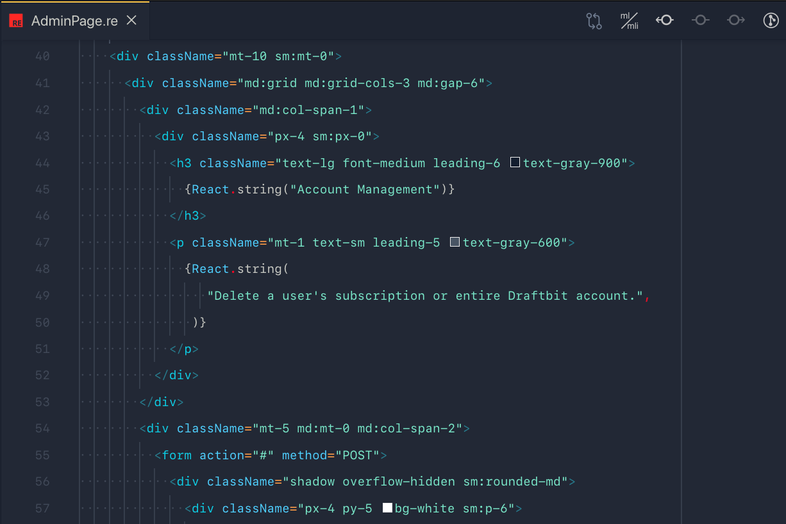
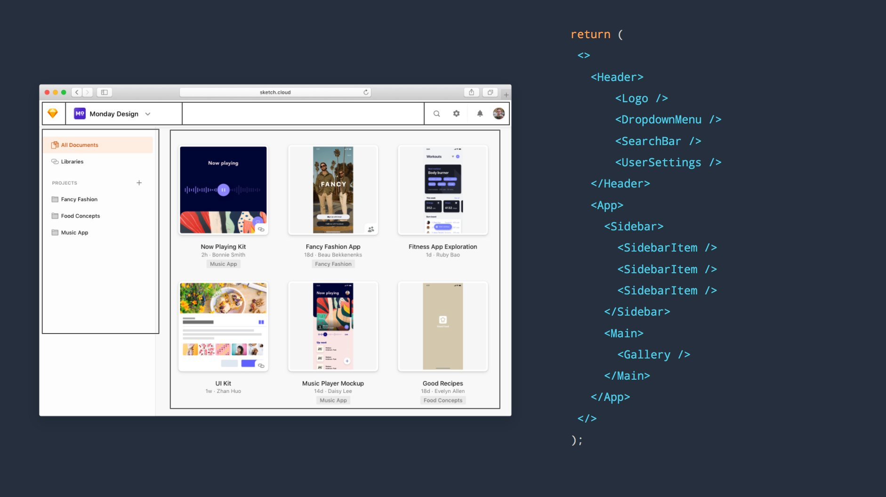
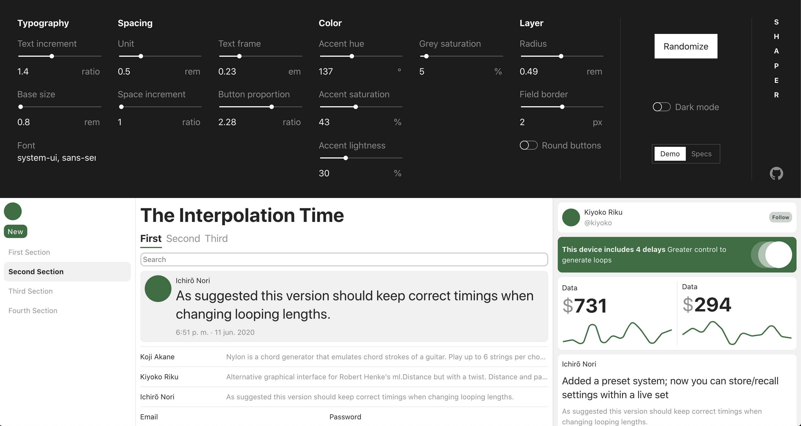
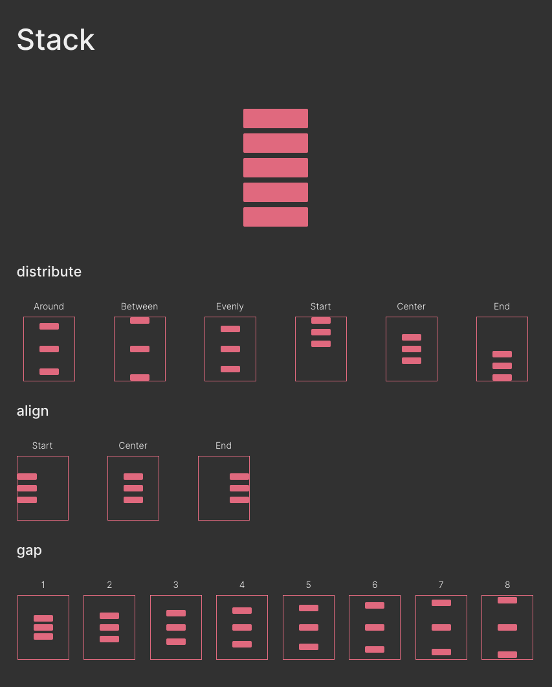

or your UI Framework or component system, call it whatever you prefer. Tailwind isn't component-driven, which they claim to be, and you might struggle making a Design system with it, let me explain it in this post.

或者你的用户界面框架或组件系统，随便你怎么称呼它。顺风不是他们声称的组件驱动的，你可能很难用它来制作一个设计系统，让我在这篇文章中解释一下。

Recently I read a lot of opinions about Tailwind ([mxstbr's thoughts](https://mxstbr.com/thoughts/tailwind), [jaredcwhite's opinion](https://dev.to/jaredcwhite/why-tailwind-isn-t-for-me-5c90), [Tailwind versus BEM](https://thoughtbot.com/blog/tailwind-versus-bem)) and nevertheless I agree with most of the points there, I got a different perspective.

最近我读了很多关于顺风的观点（mxstbr 的想法，jaredcWhite 的观点，顺风对 BEM），尽管如此，我同意那里的大部分观点，我有一个不同的视角。

I will try to explain the drawbacks to make a Design system with Tailwind, with focus on the technical part of the components. I'm assuming that the reader is familiar with Design systems, React and basic programming. Otherwise, can read more about in [here](https://www.invisionapp.com/inside-design/guide-to-design-systems/) or [here](https://uxdesign.cc/everything-you-need-to-know-about-design-systems-54b109851969).

我将尝试解释用顺风制作设计系统的缺点，重点是组件的技术部分。我假设读者熟悉设计系统、反应和基本编程。否则，可以在这里或这里阅读更多信息。

### A little bit about my experience

关于我的一点经历

At the time of writing I'm working at Draftbit and our frontend is build on top of [ReasonReact](https://reasonml.github.io/reason-react) using Tailwind. It's about ~500 components and the main page, called the `builder` looks like this:

在撰写本文时，我正在 Draftbit 工作，我们的前端是使用顺风在 ReasonReact 之上构建的。它大约有 500 个组件，名为 `builder` 的主页如下所示：


Aside from Draftbit's design system I contributed in a few Design Systems in my career, I even write my own.

除了 Draftbit 的设计系统，我在职业生涯中为一些设计系统做出了贡献，我甚至编写了自己的设计系统。

I'm obsessed with the conjunction of design with functional programming and how those enable writing modular UIs.

我痴迷于设计与函数式编程的结合，以及它们如何能够编写模块化 UI。

But now, let's talk about Tailwind.  
但是现在，让我们来谈谈顺风。

### First, the good parts

首先，好的部分

The reason why I think Tailwind is amazing have nothing to do with the patter of utility classes. This pattern have been around the Frontend community for a long time - [tachyons](http://tachyons.io/) has been created around 2016. Even some people found them pleasant to use I personally prefer to write directly CSS.

我认为 Tail 风令人惊叹的原因与实用程序类的模式无关。这种模式在前端社区已经存在了很长时间——超光速粒子在 2016 年左右被创造出来。甚至有些人觉得它们使用起来很愉快。我个人更喜欢直接编写 CSS。

The reasons why I think Tailwind shines are:  
我认为顺风闪闪发光的原因是：

- **Theme with strong defaults, beautiful and scalar** The config generates all the values needed to produce a scaled system based on all those tokens. For example, spacing. The defaultConfig will generate spacing based on a scale from 0 to 96 that goes from 0px until 24rems. [defaultConfig](https://github.com/tailwindlabs/tailwindcss/blob/master/stubs/defaultConfig.stub.js#L7)

  具有强默认值、漂亮和标量的主题配置生成基于所有这些令牌生成缩放系统所需的所有值。例如，行间距。defaultConfig 将根据从 0 到 96 的比例生成行间距，从 0px 到 24rem。defaultConfig

- **Extendability** being able to extend those values in the config brings the possibility to represent any design and being propagated to the right CSS properties. Ex, spacing would generate the values for margin, padding, width, min-height, min-height, etc.

  可扩展性能够在配置中扩展这些值，从而可以表示任何设计并传播到正确的 CSS 属性。例如，行间距将生成边距、填充、宽度、最小高度、最小高度等值。

- **Just CSS** It's not an abstraction, or coupled to any framework. It can be used with minimal setup. All IDE would have support for it, all frontend/fullstack frameworks can integrate easily, there's ton of build tools to optimise performance, because it's just The Platform makes the adopation easier and future-proof.

  只是 CSSIt 不是抽象，也不是耦合到任何框架。它可以用最少的设置来使用。所有 IDE 都支持它，所有前端/全栈框架都可以轻松集成，有大量的构建工具来优化性能，因为它只是平台使采用更容易和面向未来。

### How is used in React

如何在 React 中使用

I use React as example, but it's similar to other component-based UI libraries. In particular, React uses JSX via Babel (or any transpiler) which to transform JSX to function calls and eventually will endup as DOM Elements.

我使用 React 作为示例，但它类似于其他基于组件的 UI 库。特别是，React 通过 Babel（或任何转译器）使用 JSX 将 JSX 转换为函数调用，并最终将变为 DOM 元素。

During this transformation `className` gets renamed to `class` (since it's a reserved keyword in JavaScript) which applies CSS classes to elements.

在此转换期间， `className` 被重命名为 `class` （因为它是 JavaScript 中的保留关键字），它将 CSS 类应用于元素。

This is the defacto method to use Tailwind with React, you will often will see:  
这是将顺风与 React 一起使用的事实方法，您会经常看到：

```
<div className="flex md:block w-32 h-full" />
```

## What's wrong with className

类名称有什么问题



### Hard to maintain  难以维护

It's error prone to remove one of the `classNames` from the list, is a similar situation when you want to remove an unused CSS class in an [append only stylesheet](https://css-tricks.com/oh-no-stylesheet-grows-grows-grows-append-stylesheet-problem). They can collide and override with other properties.

从列表中删除其中一个 `classNames` 很容易出错，当您想删除仅附加样式表中未使用的 CSS 类时，情况类似。它们可能会与其他属性发生冲突和覆盖。

There're a lot of tools to solve that particular issue, such as linters or editor plugins. But it's still a problem.

有很多工具可以解决这个特定的问题，例如 linter 或编辑器插件。但这仍然是个问题。

Aside from hard to remove, it's hard to change. Adding those classes might seem simple and fast while creating those components, but it will slow you down when modify or refactor them: when your component is made by nested elements with many Tailwind utilities you aren't capable to safely refactor your structure.

除了很难删除之外，很难更改。在创建这些组件时添加这些类可能看起来简单快捷，但在修改或重构它们时会减慢您的速度：当您的组件由具有许多顺风实用程序的嵌套元素生成时，您无法安全地重构您的结构。

### It is optimised for writing, but not for reading

它针对写作进行了优化，但不适用于阅读

When reading JSX, I feel confortable to imagine a 1-to-1 match with the UI. I can easily navigate thought the component tree and map with the reality.

在阅读 JSX 时，我很容易想象与 UI 的一对一匹配。我可以轻松地浏览思想组件树并与现实进行映射。



Even that this snapshot of code-UI is doable in Tailwind, at some level of those components you will find a layer with a bunch of `classNames` that you need to parse in your head in order to imagine the UI.

即使代码用户界面的快照在顺风中是可行的，在这些组件的某些级别上，您会发现一个包含一堆 `classNames` 的图层，您需要在头脑中解析这些图层才能想象用户界面。

There's a famous quote floating around... **"Best code isn't optimised to be written, instead, it's optimised to be read"**.

有一句名言流传开来……“最好的代码不是为了编写而优化的，而是为了阅读而优化的”。

### Fail at dynamic styling

动态样式失败

**Dynamic Styling** makes your components re-usable across all your codebase and can be dependent to a global theme. Providing those versions of the same component available to their user. Having a component API coherent, versatile and scoped is relatively hard by itself. Doing so, requires a good understanding of the problems that the component is trying to solve. Allowing those values to be driven by Tailwind it's a complexity on top that I found very annoying.

动态样式使您的组件可以在所有代码库中重复使用，并且可以依赖于全局主题。向用户提供相同组件的这些版本。拥有一个连贯、通用和范围的组件 API 本身相对较难。这样做需要很好地理解组件试图解决的问题。允许这些值由顺风驱动，这是一个非常复杂的问题，我觉得很烦人。

> There's a definite disconnect between a CSS API and a component API. For a design system, I care more about getting the component one right - [@sarah_federman](https://twitter.com/sarah_federman)
>
> CSS API 和组件 API 之间存在明显的脱节。对于设计系统，我更关心组件一的正确性- [@sarah_federman](https://twitter.com/sarah_federman)

To give a simple example: If you want to create a component with a prop like `gap`. `gap` accepts all the possible spacing values that Tailwind does, let's see how we need to do that:

举一个简单的例子：如果你想创建一个带有像 `gap` 这样的道具的组件。 `gap` 接受所有可能的行间距值，让我们看看我们需要如何做到这一点：

```
const Card = (props) => {
  const className = "p-" + props.gap.toString();
  return <div className={className} />;
};

<Card gap={3} />;
```

Now our `Card` component accepts the value for padding. This have a few issues by itself. Such as `gap` could technically be any string, like `"4 flex"` and it will break all the UI. If you abuse the dynamism inside your components can be a real pain to implement the intermediate logic between your component API and your Tailwind utility classes. That dynamism is often needed while making your Design system.

现在我们的 `Card` 组件接受填充值。这本身有一些问题。例如 `gap` 在技术上可以是任何字符串，如 `"4 flex"` ，它将破坏所有 UI。如果您滥用组件内部的动态性，在组件 API 和 Tail 风实用程序类之间实现中间逻辑可能会非常痛苦。在设计系统时，这种动态性通常是需要的。

### Impossible to derive styles

无法派生样式

derive styles are a nice usage of JavaScript values to generate scalar UI. Since Tailwind uses those utilities it's very tempting to use them for your components, making derive impossible.

派生样式是 JavaScript 值的一个很好的用法，可以生成标量 UI。由于泰风使用这些实用程序，因此很容易将它们用于您的组件，从而使派生成为不可能。

For example, having a **`<Link />`** component with `color="text-mono-100"`. At the beginning it would make sense since `text-mono-100` represents the desired color. Maybe later, appears a need to style the link with a different color on hover. You would add another prop called `hoverColor="text-mono-200"` and call it a day.

例如，具有 `<Link />` 的 `color="text-mono-100"` 组件。一开始这是有意义的，因为 `text-mono-100` 代表所需的颜色。也许后来，似乎需要在悬停时使用不同的颜色设置链接的样式。您将添加另一个名为 `hoverColor="text-mono-200"` 的道具并收工。

The fact that `color` is represented in another format it's a nightmare, often UIs derive styles from props. In the example above, you could have a color be their hexadecimal representation `color="#b54c4c"` and derive the `hoverColor` with a library.

`color` 以另一种格式表示的事实是一场噩梦，UI 通常从道具派生样式。在上面的示例中，您可以将颜色作为其十六进制表示 `color="#b54c4c"` ，并使用库派生 `hoverColor` 。

The Tailwind language is nice to avoid typing CSS but isn't made for component APIs that use any sort of dynamic theme, making impossible (or very hard) to accomplish generative UI.

顺风语言很好地避免了键入 CSS，但不适用于使用任何类型动态主题的组件 API，因此不可能（或非常困难）完成生成式 UI。

As an example [https://hihayk.github.io/shaper](https://hihayk.github.io/shaper/#system-ui,%20sans-serif/1.4/0.8/2.28/0.23/1/0.5/137/43/30/5/0.49/2/false)  
作为一个例子 [https://hihayk.github.io/shaper](https://hihayk.github.io/shaper/#system-ui,%20sans-serif/1.4/0.8/2.28/0.23/1/0.5/137/43/30/5/0.49/2/false)



### Breaks style encapsulation  打破样式封装

I consider harmful allowing `className` as a prop on the component's API. This is often made to have flexibility from the outside to enable any sort of customisation to your component.

我认为允许 `className` 作为组件 API 的道具是有害的。这通常是为了从外部获得灵活性，以便对您的组件进行任何类型的定制。

```
const Button = ({ ...props, className }) => (
  <button className={"flex text-mono-100 p-4 " + className} />
)
```

It's a trap, designing a closed API for those customisations would battle-test your component and force you to decide on an API that have some boundaries, which is the initial goal of making a component.

这是一个陷阱，为这些定制设计一个封闭的应用编程接口会对你的组件进行战斗测试，并迫使你决定一个有一些边界的应用编程接口，这是制作组件的最初目标。

Tailwind doesn't have any opinion on this, but it's very tempting to allow any sort of className from the outside in your `classNames`, given that you need customisation from the outside.

顺风对此没有任何意见，但是考虑到您需要从外部定制，在您的 `classNames` 中允许从外部创建任何类型的类名称是非常诱人的。

### Stack: Example of variants

堆栈：变体示例

There're a [lot](https://seek-oss.github.io/braid-design-system/foundations/layout#stack) [of](https://polaris.shopify.com/components/structure/stack) [implementations](https://chakra-ui.com/docs/layout/stack) [of](https://www.framer.com/api/stack/) [Stack](https://v2.grommet.io/stack). That's a screenshot of [mine](https://taco-davesnx.vercel.app/?path=/story/distribute--stack).  
有很多 Stack 的实现。这是我的截图。

**Stack** places a list of elements on the Y axis, one on top of the other. Adds consistent spacing between and moves them horizontally or vertically. It's an abstraction on top of **`flexbox`**, but limited. Those constraints are defined mostly by the designer, having a Component that enforces the number of variants it's generally a good think.

堆栈将元素列表放在 Y 轴上，一个在另一个之上。添加一致的行间距，并水平或垂直移动它们。这是 `flexbox` 之上的抽象，但有限制。这些约束主要由设计者定义，有一个组件来强制执行变体的数量，这通常是一个好主意。



### Composing at the wrong layer

在错误的层创作

The key feature of **React** is composition of components. Composition here means the possibility to plug those components like a lego which enables create more complex components based on more simple ones.

React 的主要特点是组件的组合。这里的组合意味着可以像乐高一样插入这些组件，从而可以基于更简单的组件创建更复杂的组件。

Composition is a concept that more or less you might feel familiar with it, which applies to many areas of Software development.

组合是一个您可能或多或少感到熟悉的概念，它适用于软件开发的许多领域。

I see those **"Components"** are a set of rules that React forces on top of just functions. The rules are simple and allow the React library to perform many benefits that we take for granted. Those rules, are better explained by _Dan Abramov_ in one of his posts, [Writing resilent components](https://overreacted.io/writing-resilient-components/#writing-resilient-components).

我看到这些“组件”是一组规则，React 在功能之上强制执行。这些规则很简单，允许 React 库执行许多我们认为理所当然的好处。这些规则，由丹·阿布拉莫夫在他的一篇文章中更好地解释，编写弹性组件。

As I mentioned before, appending strings to style your component feels like a step backwards. Composing components that are made to solve one thing, It's the pattern that I trend to prefer.

正如我之前提到的，附加字符串来设置组件的样式感觉像是倒退了一步。组成组件是为了解决一件事，这是我倾向于喜欢的模式。

The composition of components allows React components, to benefit from  
组件的组成允许 React 组件受益于

- **Declarative representation of the UI**. Create complex pieces of UI based on smaller ones.  
  UI 的声明性表示。基于较小的 UI 创建复杂的部分。
- **Decoupled**: Isolate UI problems into black boxes that doesn't know anything about it's context.  
  解耦：将 UI 问题隔离到对其上下文一无所知的黑盒中。
- **Variants** Implement variants of the same component, without he need to re-implement different versions.

  变体实现相同组件的变体，而不需要重新实现不同的版本。

### Example of component composition over Tailwind

顺风上的组件组合示例

Re-implementation of Charkra's UI [Box component](https://chakra-ui.com/docs/layout/box) into a pseudo design-system and Tailwind.  
将 Charkra 的 UI Box 组件重新实现为伪设计系统和顺风。


Here you can see the different approaches to the same UI  
在这里，您可以看到相同 UI 的不同方法

```
<Box padding={5} width="320px" border="sm">
  <Stack gap={2}>
    <Image borderRadius="md" src="https://bit.ly/2k1H1t6" />
    <Row gap={2}>
      <Badge color="#702459">Plus</Badge>
      <Spacer left={2}>
        <Text size="sm" weight="bold" color="#702459">
          VERIFIED &bull; CAPE TOWN
        </Text>
      </Spacer>
    </Row>
    <Text size="xl" weight="semibold">
      Modern, Chic Penthouse with Mountain, City & Sea Views
    </Text>
    <Text>$119/night</Text>
    <Row gap={1}>
      <Icon src={MdStar} color="#ED8936" />
      <Text size="sm">
        <Text size="sm" weight="bold">
          4.84
        </Text>{" "}
        (190)
      </Text>
    </Row>
  </Stack>
</Box>
```

```
<div className="p-5 w-32 rounded">
  <div className="flex">
    
    <div className="flex flex-row mt-2">
      <div className="rounded py-2 px-4 bg-mono-400">
        <div className="text-mono-100">Plus</div>
      </div>
      <div className="text-sm font-bold text-pale-100">
        VERIFIED &bull; CAPE TOWN
      </div>
    </div>
    <span className="text-xl font-semibold">
      Modern, Chic Penthouse with Mountain, City & Sea Views
    </span>
    <span className="text-xl font-semibold">$119/night</span>
    <div className="flex flex-row items-center">
      <Icon src={MdStar} color="#ED8936" />
      <span className="text-sm">
        <span className="font-bold">4.84</span>
        (190)
      </span>
    </div>
  </div>
</div>
```

### A mention to `@apply`

对 `@apply` 的提及

**`@apply`** is the directive that Tailwind recommend to extract repeated utility patterns. Since it's a static definition, you would only abstract those lists into a CSS file. I don't want to get into much details about it, but it does not solve the problems mentioned before.

`@apply` 是顺风推荐的提取重复实用程序模式的指令。由于这是一个静态定义，您只能将这些列表抽象到 CSS 文件中。我不想详细介绍它，但它并没有解决之前提到的问题。

### When I would use Tailwind again then?

那么我什么时候会再次使用顺风？

1.  **Document-like websites**, styling content that is structured as a big chunk. Using [Tailwind Typography](https://blog.tailwindcss.com/tailwindcss-typography) it does come with good defaults for raw content like a blog or a newsletter.

    类似文档的网站，将内容设置为大块的样式。使用顺风排版，它确实为博客或时事通讯等原始内容提供了很好的默认值。

2.  **Prototyping**, creating a UI that visually doesn't need to be high quality or needs a unique style.  
    原型设计，创建一个视觉上不需要高质量或需要独特风格的 UI。

### What should I use instead of Tailwind for my design system?

我应该在我的设计系统中使用什么来代替顺风？

Not all the teams can have the possibility to invest time on building tooling and systems to give super-powers to the rest of the engineering team. In fact, create a Design system it's a full-time job.

并非所有团队都有可能在构建工具和系统上投入时间，以赋予工程团队的其他成员超能力。事实上，创建一个设计系统是一项全职工作。

But, there's a bunch of people who spend a lot of time thinking about those problems and tried to create a few abstractions that you could benefit from.

但是，有一群人花了很多时间思考这些问题，并试图创建一些您可以从中受益的抽象概念。

1.  [https://theme-ui.com](https://theme-ui.com/)
2.  [https://rebassjs.org](http://rebassjs.org/)
3.  [https://stitches.dev](https://stitches.dev/)
4.  [https://radix-ui.com](https://radix-ui.com/primitives/docs/overview/introduction)

If you still like what Tailwind offers, I recommend a similar approach that we do at **Draftbit**. Create a tiny layer on top of it: Treat all the Tailwind tokens as code and maintain Tailwind scoped inside those components. Abstract those utility components that you found repeated in your code into a more strict version, and minimise Tailwind for your app.

如果你仍然喜欢顺风提供的东西，我推荐我们在 Draftbit 上做的类似方法。在上面创建一个小层：将所有顺风令牌视为代码，并在这些组件中维护顺风范围。将您在代码中发现重复的实用程序组件抽象为更严格的版本，并为您的应用程序最小化顺风。

### How do I try to do it

我该怎么做

Mentioned before that I made my own Design system, which is a set of components that only cares about layout disposition, doesn't contain any opinions about cosmetics and allows to compose those elegantly. It's called **taco**.

之前提到过，我做了自己的设计系统，这是一套只关心布局配置的组件，不包含任何关于化妆品的意见，并允许优雅地创作这些意见。这叫做塔科。

It's currently still a work in progress, since there's a lot of patterns that aren't solved yet. But I have been using them for all my projects. Even that is public, isn't for consumption. I didn't write all of this for a plot-twist to sell my library, but you can use it as an example for inspiration.

它目前仍然是一个半成品，因为有很多模式还没有解决。但是我一直在我所有的项目中使用它们。即使是公开的，也不是用来消费的。我写这些并不是为了出售我的库而情节扭曲，但是你可以用它作为灵感的例子。

[Storybook](https://taco.davesnx.vercel.app/) and repository [https://github.com/davesnx/taco](https://github.com/davesnx/taco).  
故事书和存储库 [https://github.com/davesnx/taco](https://github.com/davesnx/taco) 。

I hope this post doesn't get in the wrong form, any tool is perfect and using those to solve problems is part of who we are.

我希望这篇文章不会以错误的形式出现，任何工具都是完美的，用它们来解决问题是我们的一部分。

**Thanks for reaching the end.** Let me know if you have any feedback, correction or question. Always happy to chat.

感谢到达终点。如果您有任何反馈、更正或问题，请告诉我。总是很乐意聊天。

If you like it enough, consider to  
如果你喜欢的话，考虑一下
