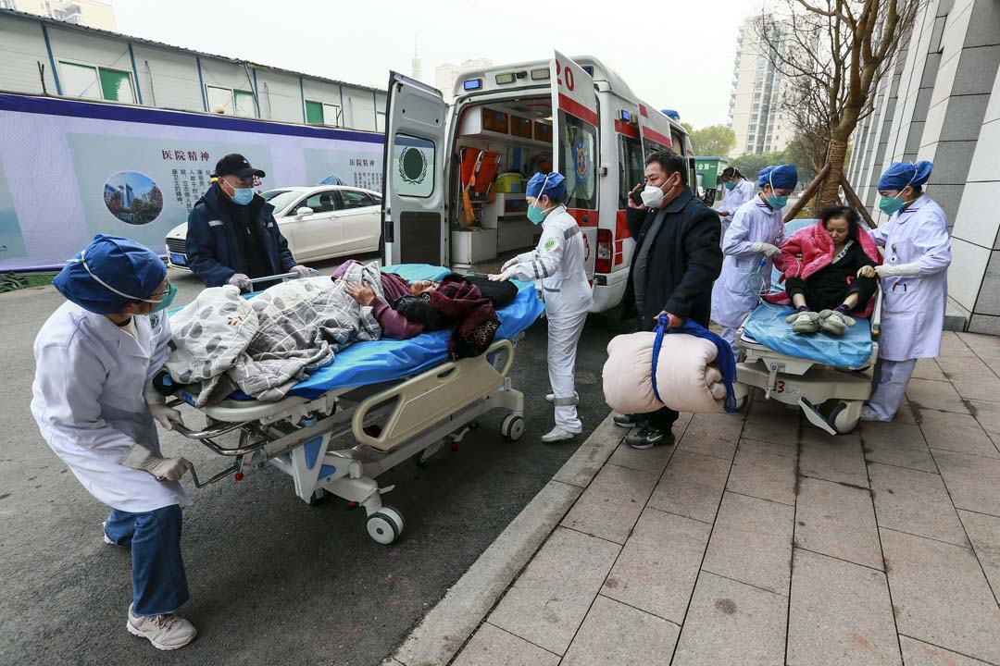
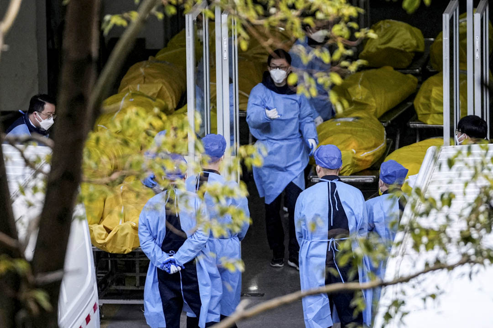
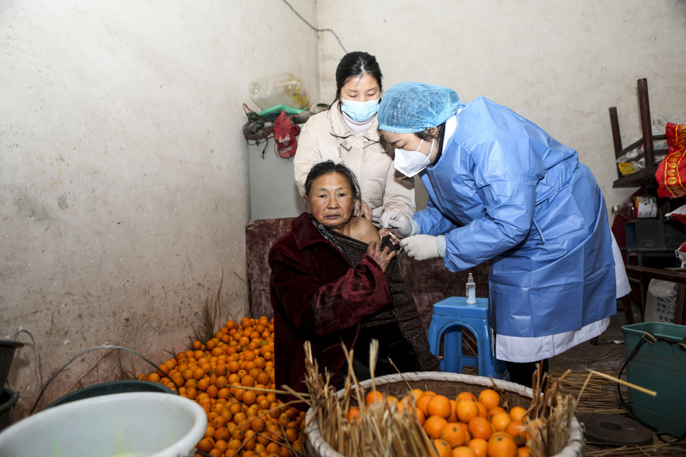
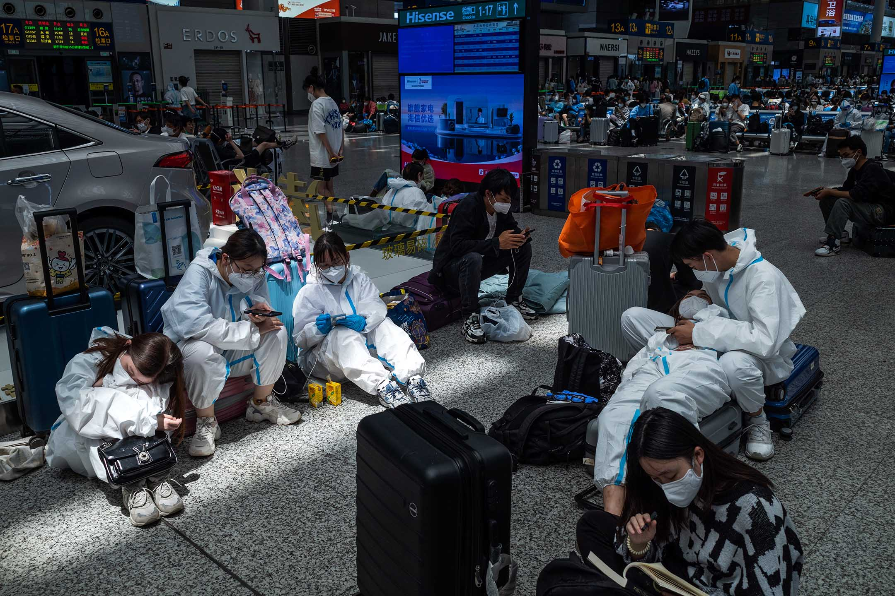
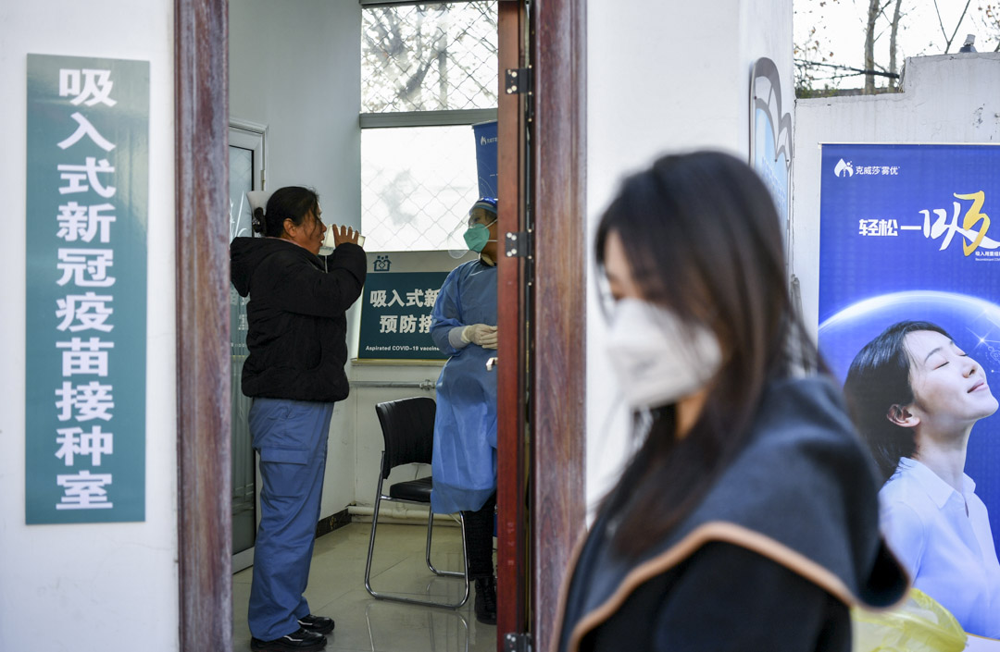
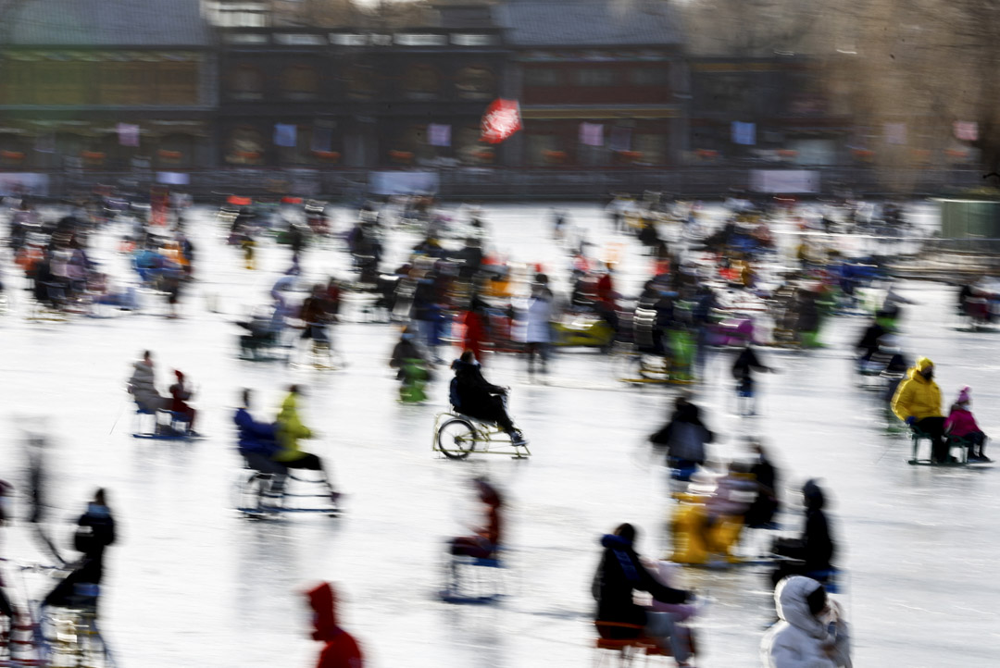

自2022年12月初以來，中國各地紛紛取消行程碼、四十八小時核酸檢測、強制方艙隔離等各種防控措施。12月7日，國家衛建委發布《新十條》，實際上宣布了「清零」政策的終結。12月27日凌晨，中國宣布取消入境隔離。

短期內政策轉向的幅度之大，在現代公共衛生歷史上也是罕見的。與此同時中國社會出現了洶涌的Omicron感染海嘯，筆者在北美「疫區」生活了三年，歷經數波COVID高峰，從來沒有聽說過北京這種三週之內親朋好友全數陽性、同城數十萬人同時發燒的慘況。即使是2020年春第一波COVID感染浪潮中受創最重的北美城市紐約，也未曾出現如此陡峭的感染高峰。中國這波感染傳播速度之快，簡直令人難以置信。

而多地醫院出現醫療擠兌，意味着很多年老體弱人士可能熬不過這個冬天。如果說COVID對全世界都是一部災難片，中國疫情在經歷三年暫停後，突然以十倍快進的速度實現群體感染，這可能超過了所有人之前的想象力。

在沉重的現實面前，中文輿論場中不乏懷念「清零」的聲音，認為如果當初不是被「開放派人士」忽悠，堅持動態清零路線不動搖，就沒有當下的慘況。這種思維就像一戰後的德國人，幻想如果沒有被社會主義者和猶太人「背後捅刀」，就不會在1918年戰敗，殊不知自己彼時已經走到山窮水盡、難以從容下場的地步了。在快速變化的現實面前緬懷舊日好時光，雖不理性，倒是符合人性。

對防控COVID疫情，清零策略的根本問題是沒有顯然的退出終點。在2022年中國執行清零政策的大部分時間裏，這個退出終點應該如何定義，在官方口徑中始終模糊不清。

中國清零政策的基本邏輯是：病毒主要通過人與人之間的近距離接觸傳播，只要儘可能切斷接觸鏈，就可以將病毒的傳播控制在低水平。清零政策的主要優勢在於不依賴「存在可廣泛獲取的有效疫苗和藥物」這一先決條件。在過去的三年COVID疫情中，2021年是關鍵的轉折點。

在2020年底之前，全世界沒有任何通過實踐檢驗的疫苗和藥物，當時能夠說服民衆配合管控措施的社會往往能獲得較好的公共衛生績效。在2021年中，疫苗逐漸鋪開，藥物研發領域也取得多項進展。2021年後大部分國家普遍採取了有序開放的防疫政策。其邏輯是：在有效的疫苗和藥物出現後，個體的免疫力輔以藥物可以顯著降低病毒的殺傷力。雖然病毒傳播不能完全控制，但整體公共衛生代價可控。這種策略主要着眼於構築個體的免疫力，而控制病毒的傳播鏈則是次要的。

對防控COVID疫情，清零策略的根本問題是沒有顯然的退出終點。迄今為止，在大規模流行後被人類社會成功消滅的病毒只有天花病毒。天花病毒能夠被人們消滅，是因為天花病毒只能以人類為宿主，且天花感染或天花疫苗帶來的免疫力可以持續終身。而這兩個條件對SARS-CoV-2的原始株和後續變種株都不成立：通過自然感染或現存各種疫苗獲得的對SARS-CoV-2感染的保護效力，基本不超過一年。

2022年12月31日，中國遂寧市，醫護人員協助兩位被救護車送往醫院的病人。攝：Zhong Min/Feature China/Future Publishing via Getty Images

更重要的是，SARS-CoV-2，包括最近的Omicron變種，可以在野生動物體內複製。近期來自[中科院的基因組分析](https://www.sciencedirect.com/science/article/pii/S1673852721003738)和來自[美國西奈山醫學院的結構生物學研究](https://www.pnas.org/doi/10.1073/pnas.2206509119)表明，Omicron的幾個關鍵突變可能來自老鼠。野生動物不會服從人類社會的管理措施。這意味着即使全世界都配合中國的清零策略，停止正常的人員流動，堅壁清野，也只能暫時停止Omicron的快速傳播。更誇張地說，即使人類抱定了與病毒偕亡的決心堅持清零，也只是人類先滅絕而已。

既然徹底消滅SARS-CoV-2已經沒有現實可能，那麼公共衛生政策制定者就必須主動定義清零的退出終點。在2022年中國執行清零政策的大部分時間裏，這個退出終點應該如何定義，在官方口徑中始終模糊不清。就在12月初官方突然出台「新十條」之前，《人民日報》2022年11月15日「仲音」社論仍然宣稱「堅定不移貫徹『動態清零』總方針」。與此同時，[部分地方政府宣告發行方艙建設專項債務](http://czt.shandong.gov.cn/module/download/downfile.jsp?classid=0&filename=a7bd5817d8ec46008b9c5dc8fa1d3da5.pdf)。

這些官方行為只能被解讀為動態清零政策的長期化。而清零帶來的各種次生災害和經濟困境，則被歸結為基層治理水平的技術問題。清零遲遲不成功，而民生日益窘迫，都是因為清零執行得不夠堅決，部分基層幹部懶政，防控措施不夠「科學」。然而動態清零長期化真的可行嗎？無序放開在當下導致的種種慘狀，在公共醫療政策上還能如何亡羊補牢及防患於未然？

清零為何失敗？

清零要成功，需要的是工廠流水線級別的完美控制。而現實社會是一個龐大的複雜系統，沒有任何管理者能夠準確掌握和預判個體需求並將其納入標準化管理流程。

清零和有序開放這兩種政策邏輯的投入-產出曲線是非常不一樣的。清零策略必須覆蓋絕大多數人口才能在公共衛生層面看到成效，局部的潰敗隨時可擴大為整體的傾覆。而對基於個體免疫力的防疫策略，其人口覆蓋率和宏觀效用則大致同步增長，局部的失敗對整體目標的影響有限。投入-產出曲線決定了清零是一種容錯率極低的防疫策略，無論是否用「動態」修飾「清零」，都不能改變其容錯率低的本質特點。

容錯率低這一特點直接導致了清零政策在實踐中廣為詬病的「層層加碼」。清零要成功，需要的是工廠流水線級別的完美控制。而現實社會是一個龐大的複雜系統，沒有任何管理者能夠準確掌握和預判個體需求並將其納入標準化管理流程。為了追求清零，管理者只好強制將紛繁複雜的現實需求壓縮到極低的標準。清零政策不僅剝奪了「被管理者」的主體性，實質上也剝奪了基層管理人員的能動性。管理複雜系統需要適度向下賦權，向下賦權必然要給予具體執行人員一定的失誤空間，而這和清零的基本邏輯是相悖的。海底撈的員工可以自主為顧客打折，封控小區管理人員批准居民緊急就醫，反而可能需要層層上報。

清零的另一個可行性問題在於其對病毒自身傳播能力的提高極其敏感。為解釋這個問題，我們可以借用程序員估計算法的複雜度的方法。對基於個體免疫力的防疫政策，其複雜度大致與人口數量（問題規模）的一次方成正比，換言之這是一個線性階問題。Omicron這種高傳播力變種的出現改變的是問題規模之前的係數，這意味着其成本只會有限增長。而對清零策略而言，其複雜度與人群之間的網狀連接數量相關。病毒的傳播力變強，改變的是問題規模的指數。這意味着病毒傳播力顯著提高几乎一定會導致精準防控失敗。這也是在清零路線下各地官員不約而同選擇「一刀切」封鎖居民區甚至整個城市的原因：只有將人群之間的網狀連接切斷，才能達到清零的目的。然而人類社會，特別是城市文明，正是基於交流網絡的邏輯發展出來的。在現代社會形態下，對Omicron這種高傳播力的病毒，清零和經濟民生不可兼得。

在中國的現實中，清零必然依賴官僚體制，而幾乎所有官僚體制都是向上負責的。清零政策的具體執行者實際上也並沒有太多的激勵機制回應普通人具體而多樣的需求。

在中國的現實中，清零必然依賴官僚體制，而幾乎所有官僚體制都是向上負責的。清零政策的具體執行者實際上也並沒有太多的激勵機制回應普通人具體而多樣的需求。對基層官員來說，在上級強大壓力下，清零失敗可能會導致其丟官去職，解決普通人的日常困難大概只換回朋友圈的一個點贊。「層層加碼」和「一刀切」實際上正是官僚體制最理性的集體抉擇。只不過這官僚理性和民衆需求相差太遠了。在自上而下的動員機制下，這是個無解的問題。

在官僚體制的管理運行中，量化指標必不可少。對大型機構有些了解的人都知道，量化指標一旦被確定核心地位，最後幾乎必然會異化。清零政策使COVID在中國公衛體系中獲得了超然的地位，而其它老年人中常見慢性的疾病，包括普通人談之變色的癌症，在清零政策下被耽誤治療的案例倒是比比皆是。「放開」之前的包括北京在內的多地政府，為了避免有發熱症狀的居民被清零之網遺漏，退燒、止咳、抗病毒、抗生素四類藥品的銷售[受到嚴格管控](http://bj.people.com.cn/n2/2021/1101/c233081-34983868.html)，普通人自助的權利實際被剝奪了。這導致了在12月突然放開之前，這些基本藥物的生產、物流和銷售已經有一段時間處於壓抑狀態，而中國作為這些基本藥物的生產大國，竟然出現了布洛芬變成黑市緊俏貨的奇景。

2023年1月4日，中國上海，一所殯儀館的停屍間放滿死者遺體。攝：Reuters/達志影像

清零政策導致的錯誤激勵，不侷限於對COVID之外醫療需求的擠壓。在放開後，中國社會彷彿如夢初醒一般意識到大量高齡和有基礎病的人群並沒有疫苗保護。[根據中國疾控的官方信息](https://www.caixin.com/2022-11-16/101965816.html)，「截至2022年11月11日，中國80歲以上老年人的全程接種率為65.7%，80歲以上老年人加強針接種人數佔80歲以上老年人總數的40%」。相比之下，[英國80歲老人全程接種疫苗的比例超過97%](https://www.statista.com/statistics/1283986/covid-19-vaccinations-in-england-by-gender-and-age/)。

中國政府確實為老年人提供了免費接種疫苗的機會。但在清零長期化的心理預期下，這些最需要疫苗保護的人群在衡量接種疫苗的得失的時候，更多考慮的不是一旦感染COVID後的健康風險，反而是疫苗的副反應。既然全社會不惜一切代價清零，那麼普通個體在現實中被感染的概率確實很低，退休後的老年人遊離於單位這個中國社會最重要的動員體制之外，接種疫苗的動力自然不足。而一線的醫生也往往對動員高齡和基礎病人群接種疫苗採取了「多一事不如少一事」的態度：病人感染COVID的可能性很遙遠，而接種疫苗後如果出現問題，反而會招來醫患糾紛。清零長期化的預期一旦被突然打破，對某些人來說，後果是致命的。

比一個低容錯率的策略更可怕的，是一個容錯率低且沒有預備計劃的策略。而中國到12月之前所做的，正是在一個容錯率已經很低的策略上傾其所有，並為此付出了慘痛的代價。

Omicron病毒的強大傳播能力造成精準防疫難以奏效，大規模封控嚴重破壞經濟民生，全民核酸運動不僅勞民傷財，而且是一個沒有終點的怪圈。造成清零最終失敗的這幾個因素，早在2022年春上海Omicron疫情中就已經顯而易見。而有序開放的前提在2022年春天也已經存在。2022年初香港疫情為疫苗在真實世界中的表現提供了重要的參考數據，讓我們知道疫苗的確可以顯著降低感染Omicron後重症死亡的概率。當時中國社會已經普遍接受兩針滅活疫苗，部分人群新近接種了三針疫苗。而能顯著降低高危人群重症死亡的抗病毒藥物Paxlovid已經通過臨床測試。實際上，在2022春上海疫情中，上海醫學界已經積累了一定的Paxlovid使用經驗。而夏天有利的氣候條件也有利於減緩呼吸道病毒的傳播。

中國醫療系統收治重症危症的能力的確不可能在幾個月內大幅擴容，但藥物儲備冗餘、醫療人員應對Omicron的專業技能和組織水平、公衆的知識和心理準備水平都可以在較短時間內顯著提高。如果中國在上海封城後主動轉型，讓公衆、各級政府、醫療機構有足夠的準備時間和明確預期，出台退出清零的時間表，以「漸進改革」的方式有序走向開放，中國或許無法完全避免生命健康的損失，但完全可能避免史無前例的COVID海嘯。可惜當時的中國社會既不能總結自己的教訓，也無意睜眼看世界，沒有及時尋找一條可持續的公共衛生道路，反而在清零的道路上越走越遠，終於導致了中小企業大面積陷入困境，民衆收入和財政斷崖式下降，社會不滿日益高漲，最終在倉促解封后迎來了COVID出現以來全世界最大的感染浪潮。

比一個低容錯率的策略更可怕的，是一個容錯率低且沒有預備計劃的策略。而中國到12月之前所做的，正是在一個容錯率已經很低的策略上傾其所有，並為此付出了慘痛的代價。

拒絕引進非國產疫苗和藥物的代價

與之前追求清零不惜代價形成鮮明對照的，是中國社會對引進疫苗和藥物的疑慮重重。迄今為止，沒有任何非國產疫苗在中國大陸境內被准許在本土居民中使用。

和清零相比，疫苗對全社會的性價比要高得多，因此大部分國家都會選擇疫苗作為應對傳染病的第一道防線。中國主要使用國產滅活疫苗，發達國家主要使用mRNA疫苗，此外[美國Novavax公司的重組蛋白疫苗的臨床試驗表現並不亞於mRNA疫苗](https://www.nature.com/articles/s41541-022-00455-3)，並已獲得美國FDA批准。但這款疫苗由於研發成功較晚，真實世界數據不如mRNA充足，在大衆輿論中的影響力也較小。由於中國境內接受mRNA疫苗的人口可以忽略不計，而歐美國家基本不使用中國產滅活疫苗，因此mRNA疫苗和滅活疫苗的真實世界平行比較主要來自中國之外的亞洲國家和地區，如[香港](https://www.sciencedirect.com/science/article/pii/S1473309922003450)、[新加坡](https://jamanetwork.com/journals/jamanetworkopen/article-abstract/2795654)、[馬來西亞](https://www.sciencedirect.com/science/article/pii/S1201971222001679)、[巴林](https://www.nature.com/articles/s41598-022-12543-4)等。

2022年12月14日，中國重慶，一名醫護人員為一名長者接種2019冠狀病毒疫苗。攝：CFOTO/Future Publishing via Getty Images

多地研究結果的基本結論是相近的：兩針mRNA疫苗防感染和重症死亡的表現顯著好於兩針滅活疫苗。大量的免疫學研究表明，mRNA疫苗誘導生成的中和抗體量比滅活疫苗高了一個數量級，而中和抗體是評價疫苗抗感染能力的關鍵指標。雖然mRNA疫苗和滅活疫苗在三至五個月後保護力都會下降，但由於起始點不同，mRNA疫苗提供的保護力仍然要顯著高於滅活疫苗。根據2022年初香港的經驗，三針滅活疫苗對重症和死亡的保護效力可以達到兩針mRNA疫苗的水平。但對已經接種兩針滅活疫苗的人群，[第三針加強針如果改用mRNA疫苗，對Omicron變種的中和抗體水平幾乎可與三針mRNA疫苗媲美](https://www.nature.com/articles/s41467-022-30340-5)。有鑑於此，[新加坡政府推薦](https://www.gov.sg/article/groups-eligible-for-covid-19-booster-vaccination)，前兩針接種滅活疫苗的，第三針加強針應該優先使用兩款mRNA疫苗之一，或Novavax的重組蛋白疫苗。

多地研究結果的基本結論是相近的：兩針mRNA疫苗防感染和重症死亡的表現顯著好於兩針滅活疫苗。

中文輿論場對mRNA疫苗的質疑主要集中於三點。一、mRNA疫苗同樣無法完全切斷Omicron傳染鏈條，和滅活疫苗並沒有本質差別。這種說法是短視的。對公共衛生系統而言，人群平均的中和抗體濃度更高，意味着每一次病毒暴露事件造成感染的概率更低，病毒的傳播速度會更慢，人群的感染時間更可能錯開，醫療系統承壓更小。

二、mRNA疫苗的副作用更大，因此對高齡和有基礎病的人群不適用。mRNA疫苗的副作用確實值得關注。根據過去兩年的經驗，與mRNA疫苗明確相關的各種不良事件中，最顯著的問題是mRNA疫苗會提高青年男性心肌炎發病率。所以部分歐洲國家對為青年男性接種mRNA疫苗採取了更為謹慎保守的態度。此外，mRNA疫苗的常見全身副反應包括發燒、頭痛、肌肉關節疼痛，全身乏力等，這是由於人體免疫系統對疫苗發生反應。[但根據美國CDC的官方數據](https://www.cdc.gov/vaccines/covid-19/info-by-product/pfizer/reactogenicity.html)，mRNA疫苗（BioNTech/復必泰）在55歲以上人群中的副反應反而低於18-55歲組，這是因為老年人的免疫系統對疫苗的響應不如年輕人。

這與筆者的所見所聞是吻合的：二十歲出頭的人在接種第二針mRNA疫苗後一般需要請假一天，而四五十歲的人反而一般在接種次日能堅持上班。此外，醫學屆已經積累了大量mRNA疫苗在各種基礎病群體中的使用數據。[美國的數據證明，mRNA疫苗在大部分癌症病人群體中使用是安全的。](https://journals.lww.com/md-journal/Fulltext/2022/01140/Safety_of_the_BNT162b2_mRNA_COVID_19_vaccine_in.53.aspx)由於老年人和有基礎病的人群本身就是COVID脆弱人群，對大部分脆弱人群，接種mRNA疫苗的收益遠超過副作用。

三、進口mRNA疫苗會讓國際資本家得利，打擊本土民族生物醫藥企業，而推薦mRNA疫苗的聲音無非是為歐美企業帶貨。這種說法今天仍然有相當的市場。這簡直是對「生命至上」口號的莫大諷刺。中國社會可以因為清零讓經濟民生陷入困境，又在倉促放開的過程中造成了大量本可以避免的死亡，唯獨不可以掏出真金白銀為國民提供切實的保護。

2022年5月22日，上海，旅客在上海虹橋火車站等候火車。攝：Ming De/Future Publishing via Getty Images

中國社會可以因為清零讓經濟民生陷入困境，又在倉促放開的過程中造成了大量本可以避免的死亡，唯獨不可以掏出真金白銀為國民提供切實的保護。

2022年底中國大陸這波COVID海嘯中傳播速度聞所未聞，遠高於2021年底和2022年夏天西方國家的兩次Omicron感染高峰。由於中國官方統計數據的缺位，我們並不知道確切的感染數字。但[根據流行病學專家曾光在12月底的估計](https://www.163.com/dy/article/HPSE58NP0552Y94G.html)，北京感染率已超過80%。而[根據美國公共衛生專家的估計](https://www.covidstates.org/reports/state-of-the-covid-19-pandemic)，美國的累計感染率約為50%。即使考慮正式放開之前社會面已經存在廣泛的潛伏感染，而中國面對的恰好是傳播能力最強的Omicron，這個對比也是極其驚人的：中國社會可能在兩個月內走完了西方國家三年的感染軌跡。中國的人口密度固然是重要因素，但西方發達國家同樣存在人口密集地區。中國北京西城區人口密度超過每平方公里2萬人，上海虹口、黃埔和廣州越秀超過每平方公里3萬人，但美國紐約曼哈頓和法國巴黎市區的人口密度也達到了每平方公里2.7萬人和每平方公里2萬人。此外，紐約與巴黎同樣存在大量的百年老樓，通風和下水道的現代化水平未必顯著高於中國一線城市的普通居民樓。

在兩次Omicron高峰中，紐約和巴黎始終保持了基本開放的狀態，在2022年夏天更是出現了報復性旅遊熱潮，而其Omicron病毒的傳染烈度卻遠不如中國大城市。這之間的巨大反差提示我們要考慮中國和歐美人群的免疫力或存在相當差距。

無準備放開，避免醫療擠兌和超額死亡幾無可能

在這個冬天，中國要避免醫療擠兌和顯著的超額死亡已無可能。中國社會應當感謝醫護人員的堅守，但更應該思考如何在與病毒共存的前提下嚴肅應對疫情挑戰。中國正在經歷的COVID海嘯或許是最大的一波感染高峰，但大概率不是最後一次。中國上一輪大規模接種滅活疫苗是在2021年底到2022年初。在2023年，中國的公共衛生政策重點應當是從高危人群開始，向全體人口推廣高效疫苗加強針的接種。

有人可能會說，中國在未來兩三個月內大半人口都將感染一遍Omicron，難道不是等於一次天然加強針嗎？問題是自然感染誘導中和抗體的水平差異很大，對無症狀和輕度感染，自然感染帶來的保護力一般低於疫苗，且同樣會隨着時間顯著下降。中國人口衆多，平均醫療資源不足，這是短期無法改變的客觀現實，因此為全體國民多接種一輪疫苗需要相當的時間。而滅活疫苗保護效力衰減較快這一特點意味着，如果中國國民不能獲得更高效的疫苗作為加強針，等最後一批人接種完加強針，頭一批接種者體內免疫力可能已經下降到不足以顯著延緩病毒傳播的程度了。

更重要的是，高齡和體弱人群由於免疫應答不夠強健，在第一輪自然感染後的免疫力可能並不充足，這意味着脆弱群體更需要考慮短期內二次感染的可能，反覆感染造成的傷害對其也會更顯著。在2021年，滅活疫苗以其廉價易得的優點不失為中國社會不錯的選擇，而此前的大規模接種為中國人口奠定了免疫基礎。從2023年春開始為人群接種比滅活疫苗更高效的加強針，可以在這一輪全國性Omicron疫情過後為中國社會爭取到更長的平靜期，為2023年冬天包括COVID在內的呼吸道疾病感染高峰做好更充分的準備。

從2023年春開始為人群接種比滅活疫苗更高效的加強針，可以在這一輪全國性Omicron疫情過後為中國社會爭取到更長的平靜期，為2023年冬天包括COVID在內的呼吸道疾病感染高峰做好更充分的準備。

在近期COVID疫苗研發進展中，中國的鼻噴疫苗值得關注。與一般由肌肉注射的疫苗不同，鼻噴式疫苗將疫苗霧化，從鼻腔黏膜吸入。鼻噴疫苗的一個顯著優勢在於使用簡便，使用的依從性更好。理論上，鼻噴疫苗甚至可以由本人操作，從而節省寶貴的醫療人力資源。 此外科學家猜想，從鼻腔黏膜吸入的疫苗對刺激上呼吸道內抗體生成可能更為有效，而上呼吸道作為SARS-CoV-2侵入人體的第一道關口，其抗體濃度對防禦感染可能格外重要。

但作為公共衛生工具，此刻國產鼻噴疫苗最大的缺點是沒有大規模三期臨床數據：我們並不知道鼻噴疫苗在真實世界中針對Omicron變種保護效力如何，持續時間多久。特別是其對重症和死亡的保護效力如何，目前尚沒有公開的高質量數據。而在醫藥研發歷史中，早期數據喜人而大規模臨床試驗差強人意的案例並不罕見。因此我們對鼻噴疫苗應該持謹慎樂觀的態度。

另一個為人矚目的是由軍事醫學研究院、艾博生物和沃森生物研發的國產mRNA疫苗。近日中國駐法國大使盧沙野在公開訪談中[提及](http://fr.china-embassy.gov.cn/ttxw/202212/t20221214_10990094.htm)「既然現在中國也有了自己的信使RNA疫苗，就不需要西方疫苗了」。筆者認為，為這款中國製造歡呼為時尚早。

[根據研發單位於2022年初公開發表的一期試驗結果，](https://www.thelancet.com/journals/lanmic/article/PIIS2666-5247%2822%2900150-1/fulltext)和Moderna及BioNTech/復必泰兩款在發達國家廣泛使用的mRNA疫苗相比，這款國產mRNA疫苗副反應顯著偏高，而誘導中和抗體的能力卻十分平庸。2022年6月的論文[表明](https://www.nature.com/articles/s41422-022-00681-3)這款國產mRNA疫苗作為滅活疫苗的第三針加強針，效果優於滅活疫苗作為加強針。但這第二篇論文並沒有做國產mRNA疫苗和Moderna、BioNTech/復必泰疫苗的頭對頭比較。

實際上，對已經接種過兩針滅活疫苗的人群，選擇不同疫苗作為加強針（異源增強）的效果[幾乎總是好於](https://jamanetwork.com/journals/jama/fullarticle/2794352)繼續[使用滅活疫苗同源增強](https://www.tandfonline.com/doi/full/10.1080/22221751.2021.1957401)。mRNA疫苗的設計和生產需要長期的積累和精細的工藝。和Moderna及BioNTech相比，中國的mRNA技術起步較晚，國產mRNA疫苗表現差強人意並不奇怪。中國固然不因該放棄本土研發mRNA的努力，但更不應以民衆的生命健康為代價，支持產業利益。

中國固然不因該放棄本土研發mRNA的努力，但更不應以民衆的生命健康為代價，支持產業利益。

2022年12月21日，中國河北石家莊的鄉鎮，一名市民於衛生院接受吸入式 COVID-19 加強疫苗接種。攝：Zhai Yujia/China News Service/VCG via Getty Images

當務之急是投入疫苗、有效藥物和社區醫療

在洶涌而來的Omicron海嘯面前，中國社會不可以再自困於民族驕傲和排外心態。當務之急，不是「振興民族醫藥」、「填補國內空白」，而是盡一切努力守護國民健康，減少疫情對脆弱群體的打擊。BioNTech/復必泰和Moderna兩款mRNA疫苗最大的優勢在於其防重症死亡的效果已經被來自不同國家地區的獨立研究反覆證實，目前尚沒有任何其它疫苗在真實世界中的表現超過mRNA疫苗。一劑mRNA疫苗在美國的政府採購價略低於20美元，亦即不到150元人民幣。相比之下，一個療程的輝瑞Paxlovid定價超過2000人民幣，一個療程的國產抗病毒藥物阿茲夫定也要300人民幣，而重症入院治療的價格更是上不封頂。

更不要說在醫療資源薄弱地區，老弱人士一旦染病可能連入院的機會都沒有。中國社會沒有理由以國民健康為代價拒絕國外研發的mRNA疫苗。中國社會中當然可能有部分人群不信任非本國生產的疫苗，但政府不應該無視科學數據，剝奪本國人民自費選擇進口mRNA疫苗的權利。對年輕無基礎病的人群，中國醫保可以出於成本控制的考量，優先推廣更為廉價的國產疫苗（包括像鼻噴疫苗這種尚沒有大規模三期臨床數據的疫苗）作為加強針。畢竟這些人群發展為重症危症的可能性本來就很小，就算最後發現其保護效果不如進口mRNA疫苗，全社會的機會成本也是有限的。

但對脆弱群體，中國社會有資源、也有倫理義務提供在目前已知範圍內最好的保護。這個國家已經在2022年的冬天辜負過他們一次，難道還要看着大規模的悲劇反覆上演嗎？

如果說疫苗是公共衛生第一道防線，那麼有效的藥物和社區醫療就是第二道防線。

中國社會應該正視任由民族情緒裹挾藥物監管的代價。

中國社會應該正視任由民族情緒裹挾藥物監管的代價。藥物市場的特殊之處在於，消費者和生產者之間的信息不對稱是難以填補的鴻溝。食客很容易評價奶茶好不好喝，病人卻幾無可能預判藥物的好壞。醫藥監管部門首先要對國民生命健康負責，而不是對本國產業和地方利益負責。自2020年初，連花清瘟雖然沒有可靠的臨床證據，卻屢獲官方肯定。在上海封城物資短缺的時刻，地方政府甚至將連花清瘟作為必需物質配送。其生產商以嶺藥業的股價也在過去三年率創新高。諷刺的是，當「新十條」出台，中國社會開始面對真正的COVID疫情時，以嶺藥業的股價卻掉頭向下，三週內跌去40%市值。

在過去三年的疫情中，以嶺藥業始終沒有能拿出高標準的臨床證據證明連花清瘟對COVID確有療效，只能說「非不為也，是不能也」。如果中國藥物監管部門放任沒有獲得臨床實證的藥物流通，付出最大代價的自然是億萬普通的中國人。中國藥監可以在國內自欺欺人，但並不能糊弄全世界的人。而以嶺藥業這樣的企業在國內或可以依靠監管部門的庇護活得有滋有味，但在有嚴格醫藥監管的國家和地區，蓮花清瘟基本是不可以合法銷售的。中國藥物監管這種揮霍自身信用的做法，也打擊了有操守有專業的製藥企業。製藥是資本密集產業。如果企業不需要遵循現代藥物開發的規範也賺得盆滿鉢滿，那本可以用於做真藥、做好藥的投資一定會有一部分去追逐連花清瘟這樣的「國民神藥」。

與連花清瘟的這款走不出過國門的藥物形成鮮明對比的，是美國輝瑞製藥研製的抗病毒藥物Paxlovid。圍繞這款藥物的爭論，是中國近日輿論場中的焦點，真實世界數據證明，[Paxlovid可以有效降低高齡人群感染COVID後發展為重症的概率。](https://www.nejm.org/doi/full/10.1056/NEJMoa2204919)而Paxlovid也得到[世界衛生組織的強烈推薦](https://www.who.int/zh/news/item/22-04-2022-who-recommends-highly-successful-covid-19-therapy-and-calls-for-wide-geographical-distribution-and-transparency-from-originator)。雖然Paxlovid在多個國家已經納入政府採購體系，但中國在放開前的儲備對這次感染浪潮可謂杯水車薪。而Paxlovid作為處方藥需要在感染早期使用與COVID患者看病難的矛盾，更是凸顯了中國社區醫療的滯後。結果Paxlovid的黑市價格居高不下，一藥難求。與此同時，Paxlovid的高昂定價和美國血統，也引來了形形色色的陰謀論。

2023年1月6日，中國北京，市民到結冰的湖面滑冰。攝：Tingshu Wang/Reuters/達志影像

輝瑞的的醫保談判報價到底是多少，目前沒有官方消息。筆者贊同公共醫保體系需要考慮性價比，且不宜向單一疾病過度傾斜。但對疫情全局而言，最昂貴的公共衛生措施無疑是清零路線下大規模的封城禁足，2022年因此造成的經濟損失肯定以上萬億人民幣計。

日前，這款廣受爭論的Paxlovid未能通過談判納入醫保目錄。[根據媒體報道](http://m.caijing.com.cn/article/285219?target=blank)，談判失敗的主要因素是價格期望差距太大。輝瑞的的醫保談判報價到底是多少，目前沒有官方消息。假設輝瑞不願降低單個療程接近兩千元的價格，而中國未來一年有五千萬人可能需要這款藥物，總價格可能達到千億。即使考慮到由於醫療渠道限制，大量Paxlovid的適應人群實際上是用不上這款藥物的，對醫保基金的壓力仍然相當沉重。

筆者贊同公共醫保體系需要考慮性價比，且不宜向單一疾病過度傾斜。但對疫情全局而言，最昂貴的公共衛生措施無疑是清零路線下大規模的封城禁足，2022年因此造成的經濟損失肯定以上萬億人民幣計。全民核酸運動的花費，大概也要以千億計。而對重症病人如果能做到應治盡治，花費幾乎肯定超過推廣Paxlovid。 清零不計代價的大手筆和醫保談判的錙銖必較兩相對比，令人費解。

筆者推測，中國抗疫雖然號稱舉國體制，但始終沒有建立基於公共衛生經濟學的通盤規劃。而官僚體制的本能是追逐由上級定義的本部門的關鍵績效指標（Key performance indicator, KPI)。 在新十條出台之前，地方政府的KPI是清零而不是經濟民生。現在醫保談判團隊的KPI是能通過砍價為醫保基金「節省」多少花費，因此對Paxlovid這種有效但價格昂貴的藥物疑慮重重，反而有很強的衝動為沒有臨床實證但價格足夠低廉的藥物買單。而此前清零政策對整個國家經濟民生造成破壞，醫保部門本來就不是主要決策者，大概也不覺得需要揹負相應的道義責任。結果是中國式抗疫「抓小放大」，進退失據。

中國醫療資源集中在一二線城市，在一二線城市中又集中於三甲醫院。三甲醫院的醫生固然擅於難症、重症，但對公共衛生更有意義的，是疾病的預防和早期干預。中國醫療體系中分診制度和社區醫療的薄弱在三年疫情中暴露無遺：病毒傳播的速度，可以輕鬆超過醫療資源調配的能力。社區醫療的定位不應該是應對COVID的臨時性措施，而其建設也不可能在短期內見效。對現在四十歲以下的人，COVID大概率不會是有生之年見證的最後一次流行全球的傳染病。投資社區醫療，對快速老齡化的中國社會，將是和高鐵、高速公路網一樣重要的公共工程。

清零政策長期化失敗，與計劃經濟失敗有其異曲同工之處。個體自主性、能動性被剝奪，激勵機制被扭曲，公共政策討論被壓制，自命為全知全能的家長型政府則大包大攬。中國在改革開放四十年後重蹈覆轍，實在令人感慨萬千。幾乎可以肯定，在被迫放開後，中國社會和病毒之間會在反覆拉鋸中逐漸達到新的穩態。但此前三年的疫情和封控，對中國社會的影響是深遠的。普通人安全感的喪失，對政府行為可預期性的損害，對中小企業和就業環境的破壞，輿論場中排外心態和陰謀論的興起，2020年到2022年這段歷史無疑會在未來的十年中留下長遠的回聲。

只是，中國社會會選擇反思，還是選擇遺忘？
