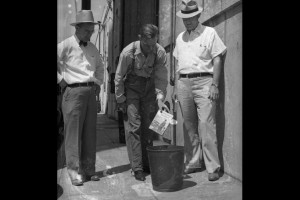
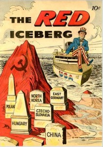

As we briefly touched upon in the discussion of this film, “The Grapes of Wrath” can be symbolically used as a criticism of the capitalist system during the 1930s, specifically the proletariat being exploited by the system. Critics labeled the film “socialist” or “Marxist”, and farming unions and government agencies alike condemned it.  
正如我们在讨论这部电影时简要提到的，《愤怒的葡萄》可以象征性地用来批判 1930 年代的资本主义制度，特别是对被制度剥削的无产阶级。评论家给这部电影贴上了“社会主义”或“马克思主义”的标签，农业工会和政府机构都对它进行了谴责。

Clell Pruett burns a copy of The Grapes Of Wrath as Bill Camp and another leader of the Associated Farmers stand by. “One member of the county board of supervisors denounced the book as a ‘libel and lie.’  
克莱尔·普鲁特 (Clell Pruett) 烧掉了一份《愤怒的葡萄》(The Grapes Of Wrath)，而比尔·坎普 (Bill Camp) 和联合农民协会的另一位领导人站在一旁。 “县监事会的一名成员谴责这本书是‘诽谤和谎言’。”

Despite critics in the United States giving the film a Red label, it received a different criticism from a country that no one could question fit all of those same labels: the Soviet Union. In 1948, Joseph Stalin allowed theaters in the Soviet Union to show “The Grapes of Wrath” for reasons that we can assume to be anti-capitalism propaganda, showing destitution that the Okies endured in the face of an oppressive capitalist system (Whitfield). Just a few short years after these two countries were allied in the Second World War, now propaganda attacks against each other were the norm and tensions were rising.  
尽管美国的评论家给这部电影贴上了红色标签，但它收到了来自一个国家的不同批评，没有人可以质疑是否符合所有这些相同的标签：苏联。 1948 年，约瑟夫·斯大林允许苏联的剧院放映《愤怒的葡萄》，原因我们可以假设是反资本主义宣传，展示了俄基人在面对压迫的资本主义制度时所忍受的贫困（惠特菲尔德）。就在这两个国家在第二次世界大战中结盟后短短几年，现在相互攻击的宣传已成为常态，紧张局势正在加剧。

This screening of “The Grapes of Wrath” in the Soviet Union, however, did not land the way that Stalin anticipated. Rather than stir up anti-capitalist emotions, the Soviets that viewed “The Road to Wrath”, as it was titled in the U.S.S.R, were in complete awe that even the poorest of the poor in the United States were able to save their money and afford an automobile. As the wrong message continued to spread, Stalin decided to pull the film from theaters after a few short weeks (Whitfield). In this sense, “The Grapes of Wrath” aptly foreshadowed not only the Cold War itself but the outcome and the reasons behind it. The definition of the term “poor” in the two countries was vastly different, and the enormous economic gap between the capitalist system of the United States and the centrally planned economy of the Soviet Union was clear. There is a particularly funny quote from the text that I discovered, regarding the poor central planning of the Soviet economy: “Ineptitude and inefficiency permeated the command economy he (Stalin) established—so much so that, had the Kremlin ever gained control of the Sahara, Western analysts liked to quip, there would soon have been a shortage of sand.”  
然而，《愤怒的葡萄》在苏联的放映并没有像斯大林预想的那样落地。看到“愤怒之路”（在苏联被称为“愤怒之路”）的苏联人并没有激起反资本主义情绪，而是完全敬畏，因为即使是美国最穷的人也能省下钱，买得起汽车。随着错误信息的不断传播，斯大林决定在短短几周后将这部电影从影院撤下（惠特菲尔德）。从这个意义上说，《愤怒的葡萄》不仅恰当地预示了冷战本身，而且预示了结果及其背后的原因。两国对“穷”一词的定义大相径庭，美国资本主义制度与苏联中央计划经济之间的巨大经济差距显而易见。我从课文中发现了一段特别有趣的引述，是关于苏联经济中央计划不力的：“无能和低效渗透到他（斯大林）建立的计划经济中——如此之多，以至于克里姆林宫曾经控制过撒哈拉沙漠，西方分析家喜欢打趣道，那里很快就会出现沙子短缺。”

I thought that this anecdote about the “The Grapes of Wrath” was a very interesting insight into the future of our country, much more than Ford ever planned or anticipated, and added an extra layer to an already complex tale.  
我认为这个关于“愤怒的葡萄”的轶事是对我们国家未来的一个非常有趣的洞察，远远超过福特的计划或预期，并为本已复杂的故事增添了额外的一层。

Sources: 资料来源：  
http://lisa.revues.org/802?lang=en#ftn2  
http://www.pbs.org/wnet/need-to-know/culture/slideshow-steinbecks-salinas-valley/16441/#3

> [Examples of american cold-war propaganda  
> 美国冷战宣传的例子](http://www.designer-daily.com/examples-of-american-cold-war-propaganda-2918)
