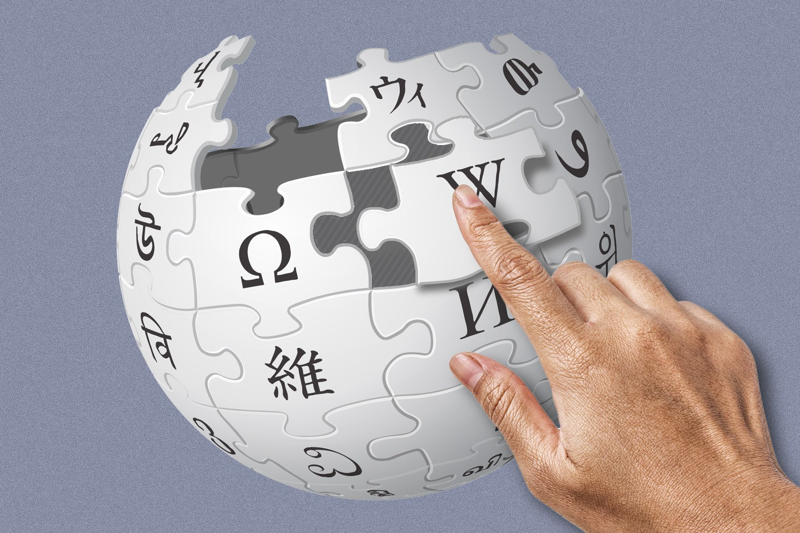

Jan 18, 20235:54 AM 2023 年 1 月 18 日：上午 54 点

Photo illustration by Slate. Photos by Wikipedia and Getty Images Plus.  
Slate 的照片插图。维基百科和 Getty Images Plus 提供的照片。

The Wikipedia editors are waiting to hear you scream. On Wednesday, Wikipedia is set to make its new skin the default on English Wikipedia—its first new skin since 2010—and the team of designers and volunteer editors are waiting with some mix of excitement and trepidation.  
维基百科的编辑们正等着听你尖叫。周三，维基百科将把它的新皮肤设为英文维基百科的默认皮肤——这是自 2010 年以来的第一个新皮肤——设计师和志愿编辑团队正在等待，既兴奋又惶恐。

On Sunday, several dozen Wikipedia editors nursed cocktails in midtown Manhattan at the afterparty for Wikipedia Day, the annual celebration of Wikipedia’s Jan. 14, 2001, founding. The group—a nerdy crowd of librarians, students, software engineers, and others who spend their free time creating an encyclopedia—usually meets in quiet libraries instead of ritzy open bars, but this was a special occasion: Wikipedia’s 22nd birthday (as well as its 21st and 20th, which the group had only commemorated online). Plus, someone had offered the space as a donation.  
周日，维基百科日是维基百科于 2001 年 1 月 14 日成立的年度庆典，维基百科日的余兴派对上，数十名维基百科编辑在曼哈顿中城喝鸡尾酒。这个小组——一群书呆子，包括图书馆员、学生、软件工程师和其他利用空闲时间创建百科全书的人——通常在安静的图书馆而不是豪华的开放式酒吧聚会，但这是一个特殊的场合：维基百科 22 nd 生日 (以及它的 21 st 和 20 th ，该小组只在网上纪念过）。另外，有人提供了这个空间作为捐赠。

Gathered on a leather couch, speaking loudly over the DJ’s groovy music, their conversation meandered from [class-action lawsuits against a water park](https://en.wikipedia.org/wiki/Action_Park) to bird photography to Vector 2022, Wikipedia’s first big redesign in 12 years, set to debut as the default on English Wikipedia on Wednesday. Eyes lit up. People leaned in. Anticipation was palpable. “We’re going to be able to hear screams from space,” joked a Wikimedian who goes by the username Enterprisey, who has spent months contributing to the redesign. Pharos, a longtime contributor, mentioned that Swahili Wikipedia had unanimously voted to reject the new skin and [curtly demanded](https://www.mediawiki.org/wiki/Talk:Reading/Web/Desktop_Improvements#Please_revert_to_old_skin_on_swwiki) a return to the old skin. “I had never seen Swahili Wikipedia so outspoken about something. Pretty exciting,” he said.  
聚集在皮沙发上，边听 DJ 的绝妙音乐大声说话，他们的谈话从针对水上乐园的集体诉讼到鸟类摄影，再到 Vector 2022，这是维基百科 12 年来的首次重大重新设计，将作为英语维基百科的默认设置首次亮相周三。眼睛亮了。人们靠了过来。期待是显而易见的。 “我们将能够听到来自太空的尖叫声，”一位用户名为 Enterprisey 的维基人开玩笑说，他花了几个月的时间为重新设计做出贡献。 Pharos 是一位长期撰稿人，他提到斯瓦希里维基百科一致投票拒绝新皮肤，并直截了当地要求恢复旧皮肤。 “我从未见过斯瓦希里语维基百科对某事如此直言不讳。非常令人兴奋，”他说。

For all the hype, Vector 2022 isn’t dramatically different—[that’s why](https://www.mediawiki.org/wiki/Reading/Web/Desktop_Improvements/Frequently_asked_questions#Why_do_you_use_this_naming:_Vector_2022_and_legacy_Vector?) it shares a name with the previous skin, Vector 2010. All the scaffolding is the same: Wikipedia is still Wikipedia, just with [more](https://en.wikipedia.org/wiki/Wikipedia:Requests_for_comment/Deployment_of_Vector_(2022)/More_about_Vector_(2022)#New_features) whitespace, a more prominent search bar and language switcher, and a sticky table of contents. There’s also a collapsible sidebar and maximum line width, which make the site more clean and less cluttered. But those changes have been scrupulously discussed and debated (over and over and over).  
对于所有的炒作，Vector 2022 并没有太大的不同——这就是为什么它与以前的皮肤 Vector 2010 共享一个名称。所有的脚手架都是一样的：维基百科仍然是维基百科，只是有更多的空白、更突出的搜索栏和语言切换器和粘性目录。还有一个可折叠的侧边栏和最大线宽，使网站更干净、更整洁。但这些变化已被仔细讨论和辩论（一遍又一遍）。

Wikipedia is not the scrappy web experiment it once was. In Wikipedia’s 22 years online, its content has exploded to more than 300 languages (more than twice as many as Google Translate). The Wikimedia Foundation, which was formed in 2003 to oversee Wikipedia and its sister projects like Wikimedia Commons, has an endowment that’s [$100 million](https://wikimediafoundation.org/news/2021/09/22/wikimedia-foundation-reaches-100-million-endowment-goal/) and growing. But it doesn’t look all that different than it did 23 years ago, when it was run by a few guys in an office in Florida. The text-heavy website resembles an email inbox, or Craigslist, or Old Reddit. It’s a barrage of straightforward white and blue text, a rather unsightly assemblage of lines and squares. It’s not trendy.  
维基百科不再是它曾经的那种草率的网络实验。在维基百科 22 年的在线历史中，其内容已激增至 300 多种语言（是谷歌翻译的两倍多）。维基媒体基金会成立于 2003 年，负责监督维基百科及其姊妹项目，如维基共享资源，拥有 1 亿美元的捐赠基金，并且还在不断增长。但它看起来与 23 年前并没有什么不同，当时它由佛罗里达州办公室的几个人经营。这个以文本为主的网站类似于电子邮件收件箱、Craigslist 或旧版 Reddit。这是一连串简单的白色和蓝色文本，是线条和方块的相当难看的组合。这不是时髦的。

Wikipedia throught the years. Animation by Annie Rauwerda. Photos by Wikipedia.  
多年来的维基百科。 Annie Rauwerda 的动画。维基百科的照片。

“When I say I’m a designer for Wikipedia, some people are surprised that a job like that exists,” Wikimedia Foundation staff member Alex Hollender told me over the phone. He’s one of 23 people on Wikimedia’s design team. But there are far, far more unpaid designers. Practically everyone who uses Wikipedia has opinions about how it looks, and unlike other internet titans like Facebook and Amazon, Wikipedia invites users to share their feedback and really listens to their points. The paid design team regularly meets for office-hour video calls with interested volunteers, and since the skin was proposed in 2019, Wikipedians have spilled more than 200,000 words on the page for Vector 2022 feedback, offering suggestions and criticism—meaning that there’s a corpus longer than _Jane Eyre_ (and almost as long as _Moby-Dick_) about button positioning and table formatting. A page-turner!  
“当我说我是维基百科的设计师时，有些人会对这样的工作感到惊讶，”维基媒体基金会的工作人员亚历克斯霍伦德在电话中告诉我。他是维基媒体设计团队的 23 人之一。但是还有更多的无偿设计师。几乎每个使用维基百科的人都对它的外观有自己的看法，与 Facebook 和亚马逊等其他互联网巨头不同，维基百科邀请用户分享他们的反馈并真正倾听他们的观点。付费设计团队定期与感兴趣的志愿者进行办公时间视频通话，自 2019 年提出皮肤以来，维基百科已经在 Vector 2022 反馈页面上溢出了超过 200,000 个单词，提供了建议和批评——这意味着有一个语料库关于按钮定位和表格格式的内容比《简爱》还长（几乎和《白鲸记》一样长）。翻页机！

That’s not even counting the 90,000-word-long [discussion](https://en.wikipedia.org/wiki/Wikipedia:Requests_for_comment/Deployment_of_Vector_(2022)) on whether the new skin should be default, which went down in autumn of 2022. It was a bloodbath: Crotchety Wikipedia veterans practically yelled “too much white space!” in unison while starry-eyed progressives condemned the kneejerk resistance to change. A few clever thinkers crafted a compromise plan. In the end, the 165 people who voted to oppose the redesign outnumbered the 153 supporters. Nevertheless, it’s happening. (The vote in a request for comment is not binding; the closing remarks reflect the consensus, and in this case, the closing remarks were in favor of the redesign.) The design team took some of the advice, adding a toggle to appease the whitespace-haters, and set a launch date for Wednesday.  
这甚至还不包括 2022 年秋季关于新皮肤是否应该默认的长达 90,000 字的讨论。那是一场大屠杀：Crotchety 维基百科的资深人士几乎大喊“太多的空白！”乐观的进步人士齐声谴责对变革的下意识抵制。一些聪明的思想家制定了一个折衷方案。最终，投票反对重新设计的 165 人超过了 153 名支持者。尽管如此，它正在发生。 （评论请求中的投票不具有约束力；结束语反映了共识，在这种情况下，结束语支持重新设计。）设计团队采纳了一些建议，添加了一个开关来安抚whitespace-haters，并将发布日期定在星期三。

Wikipedians, characteristically skeptical, aren’t the only online community that has put forth a big fat resistance to redesign. When Reddit got a sleek makeover in 2018, [1.2 million](https://www.inc.com/christine-lagorio/how-reddit-redesigned-its-website-without-angering-users-too-much.html) users signed a petition to revert to its old design.  
以怀疑为特征的维基百科并不是唯一一个强烈反对重新设计的在线社区。当 Reddit 在 2018 年进行时尚改造时，有 120 万用户签署了一份请愿书，要求恢复其旧设计。

Some Wikipedia contributors have a hard time trusting Wikimedia Foundation designers. No one on the paid [design team](https://diff.wikimedia.org/2021/08/12/the-story-behind-wikipedias-upcoming-new-look/) was around 12 years ago when the last skin was made, and only some of them were involved with the wiki communities before they were hired.  
一些维基百科贡献者很难信任维基媒体基金会的设计者。大约 12 年前制作最后一个皮肤时，付费设计团队中没有人，只有他们中的一些人在被雇用之前参与了 wiki 社区。

Wikimedia Foundation “often hires designers who aren’t familiar with the community, and they come in and try to make all these changes—running head-first into a buzz saw—and the community understandably resists,” said Brandon Harris, who was a senior designer at Wikipedia from 2010 to 2014. As we talked on a video call, I realized where I’d seen his long brown ponytail before—he was featured on a donation banner a decade ago.  
维基媒体基金会“经常聘请不熟悉社区的设计师，他们进来并尝试做出所有这些改变——一头扎进圆锯——而社区的抵制是可以理解的，”Brandon Harris 说，他是一名从 2010 年到 2014 年在维基百科担任高级设计师。当我们在视频通话中交谈时，我意识到我以前在哪里见过他长长的棕色马尾辫——十年前他出现在捐赠横幅上。

No one _has_ to use the default skin. Many people don’t. Harris, who also goes by the username [Jorm](https://en.wikipedia.org/wiki/User:Jorm), has been tinkering with the Wikipedia layout for more than a decade. At Wikimania in 2012, the same year that founder Jimmy Wales named him staff member of the year, he presented a few ideas for a more user-friendly layout called Athena, which he eventually turned into a working prototype named [Winter](https://www.mediawiki.org/wiki/Winter). The project stagnated until 2015, when a volunteer who goes by Isarra [wrote](https://en.wikipedia.org/wiki/Wikipedia:Village_pump_(proposals)/Archive_125#New_skin_for_Wikipedia) “Hi. I’m considering making a new skin for the Wikimedia projects. Yes, I know this is a terrible idea. I don’t really care.” She took Jorm’s principles and built a skin called Timeless, which you can choose by navigating to “Preferences” and then “Appearance.” True to its name, Timeless has been a cult favorite among Wikipedia users who appreciate its color, prominent display of editing tools, and mobile formatting. An indie hit, if you will.  
没有人必须使用默认皮肤。很多人不知道。哈里斯的用户名也为 Jorm，十多年来一直在修改维基百科的布局。在 2012 年的 Wikimania，创始人吉米·威尔士 (Jimmy Wales) 将他评为年度最佳员工的同一年，他提出了一些关于名为 Athena 的更加用户友好的布局的想法，他最终将其变成了名为 Winter 的工作原型。该项目停滞不前，直到 2015 年，一位名叫 Isarra 的志愿者写道：“嗨。我正在考虑为维基媒体项目制作一个新皮肤。是的，我知道这是个糟糕的主意。我真的不在乎。”她采用了 Jorm 的原则并打造了一款名为 Timeless 的皮肤，您可以通过导航至“首选项”然后选择“外观”来选择它。顾名思义，Timeless 一直深受维基百科用户的喜爱，他们喜欢它的颜色、突出显示的编辑工具和移动格式。一个独立的热门，如果你愿意的话。

Timeless isn’t the only non-default layout you can choose. You can manually choose to use Monobook, the default skin from 2004 to 2010, which British comedian Stephen Fry appears to have done, based on his [tweet of a screenshot](https://twitter.com/stephenfry/status/1584467255039258625) of a “2022 United Kingdom government crisis” Wikipedia article outfitted in the Monobook skin. There’s also [Minerva](https://www.mediawiki.org/wiki/Skin:Minerva_Neue), a skin for mobile devices.  
Timeless 并不是您可以选择的唯一非默认布局。你可以手动选择使用 Monobook，这是 2004 年到 2010 年的默认皮肤，英国喜剧演员斯蒂芬弗莱似乎已经这样做了，根据他发布的“2022 年英国政府危机”维基百科文章的截图，该文章配备了 Monobook 皮肤。还有 Minerva，一种用于移动设备的皮肤。

If you want a _real_ trip down memory lane, you can check out [Nostalgia Wikipedia](https://nostalgia.wikipedia.org/wiki/HomePage), a preserved copy of Wikipedia as it appeared in December 2001. The site is instantly recognizable: the white minimalist background, the globe logo in the corner, the blue links. But it’s from a different era, and there isn’t even a search bar. A few other aughts skins, such as “Cologne Blue,” reek of early 2000s design trends ([check it out here](https://en.wikipedia.org/wiki/List_of_animals_awarded_human_credentials?useskin=cologneblue)). “Modern” now [feels very dated](https://en.wikipedia.org/wiki/List_of_animals_awarded_human_credentials?useskin=modern), despite its name.  
如果您想要一次真正的回忆之旅，您可以查看 Nostalgia Wikipedia ，它是 2001 年 12 月出现的维基百科的保存副本。该网站一眼就能认出来：白色极简主义背景，角落里的地球标志，蓝色链接.但它来自不同的时代，甚至没有搜索栏。其他一些 aughts 皮肤，例如“科隆蓝”，散发着 2000 年代初期设计趋势的气息（请在此处查看）。 “现代”现在感觉非常过时，尽管它的名字。

Not into the new look? Not into any of the old looks, either? Wikipedia doesn’t _just_ allow users to contribute encyclopedia content. It also allows you to make some kooky CSS customizations. Neon background! Blinking links! Even more, you can also inject [your own arbitrary Javascript](https://en.wikipedia.org/wiki/Wikipedia:User_scripts/List) into the site to change it according to your preferences, however odd they may be. Wikipedians have made scripts to display IP addresses as [emoji](https://en.wikipedia.org/wiki/User:Opencooper/IPtoEmoji), show [dark mode](https://en.wikipedia.org/wiki/User:MusikAnimal/nightpedia), and [highlight questionable sources](https://en.wikipedia.org/wiki/User:Headbomb/unreliable). If you want to make a more drastic customization, you’re invited to create your own skin or choose from the [101](https://skins.wmcloud.org/#/explore) that already exist—including a [flower-themed](https://www.mediawiki.org/wiki/Skin:Bouquet) design and a layout that resembles a [messy desk](https://skins.wmcloud.org/#/skin/deskmessmirrored).  
不喜欢新外观？也不喜欢任何旧外观？维基百科不仅仅允许用户贡献百科全书内容。它还允许您进行一些古怪的 CSS 自定义。霓虹灯背景！闪烁的链接！更重要的是，您还可以将自己的任意 Javascript 注入站点，以根据您的喜好对其进行更改，无论它们多么奇怪。维基百科已经制作了脚本来将 IP 地址显示为表情符号、显示黑暗模式并突出显示可疑来源。如果您想进行更彻底的定制，我们邀请您创建自己的皮肤或从已有的 101 种皮肤中进行选择——包括以花卉为主题的设计和类似于凌乱办公桌的布局。

To an outsider, the meticulous, sometimes combative arguments about, say, moving a button five pixels to the left seem pointless. _I beg of thee, please, touch grass!_ But to many, Wikipedia is sort of a home on the internet. And people want to live somewhere nice.  
对于局外人来说，关于将按钮向左移动五个像素的细致的、有时是好斗的争论似乎毫无意义。我求求你，请触摸草！但对许多人来说，维基百科有点像互联网上的家。人们想住在一个不错的地方。

“Maybe all I’ll be remembered for is making the already-visited links a little bit _more_ purple,” design team member Hollender told me. “Or the guy who made the table of contents stay on the screen as you’re reading. It sounds small. But maybe, if I’m doing my job, people will be able to find information a tiny bit faster.”  
“也许我会被记住的只是让已经访问过的链接多一点紫色，”设计团队成员 Hollender 告诉我。 “或者在你阅读时制作目录的人留在屏幕上。听起来很小。但也许，如果我在做我的工作，人们将能够更快地找到信息。”

Update, Jan. 19, 2023: This article was updated to clarify that a vote in a request for comment is not binding; what is important is the closing remarks, which reflect the consensus.  
更新，2023 年 1 月 19 日：本文已更新，以澄清评论请求中的投票不具有约束力；重要的是结束语，它反映了共识。

[Future Tense](http://www.slate.com/articles/technology/future_tense/2012/03/future_tense_emerging_technologies_society_and_policy_.html) is a partnership of [Slate](https://slate.com/), [New America](https://www.newamerica.org/), and [Arizona State University](https://www.asu.edu/?feature=research) that examines emerging technologies, public policy, and society.  
Future Tense 是 Slate 、 New America 和亚利桑那州立大学的合作伙伴关系，旨在研究新兴技术、公共政策和社会。
