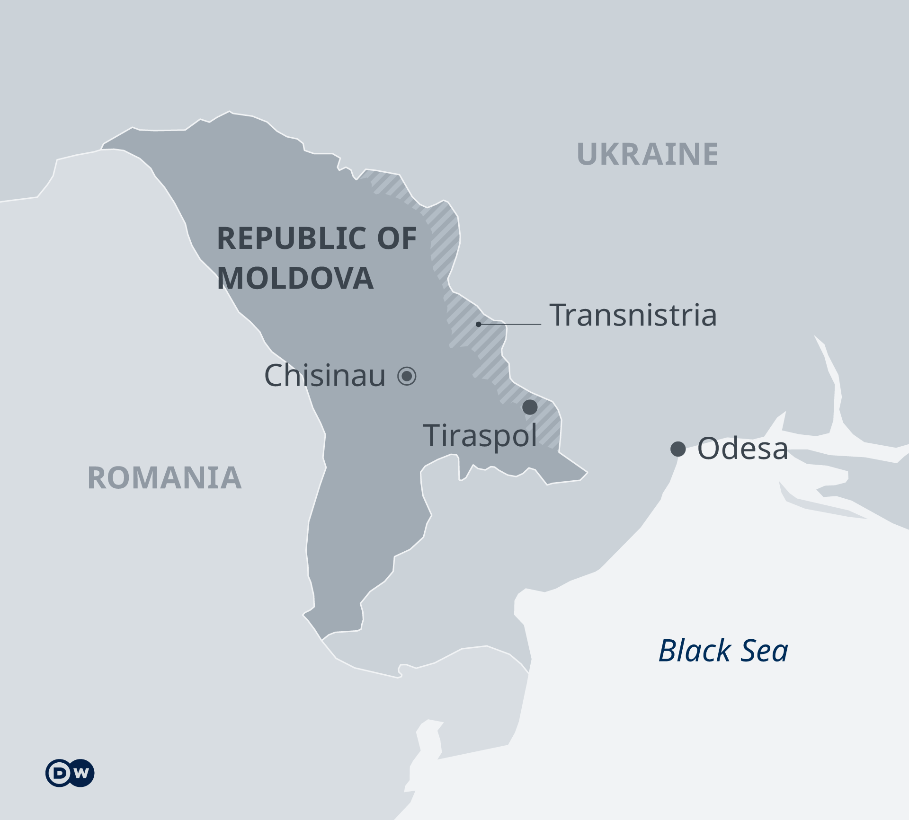
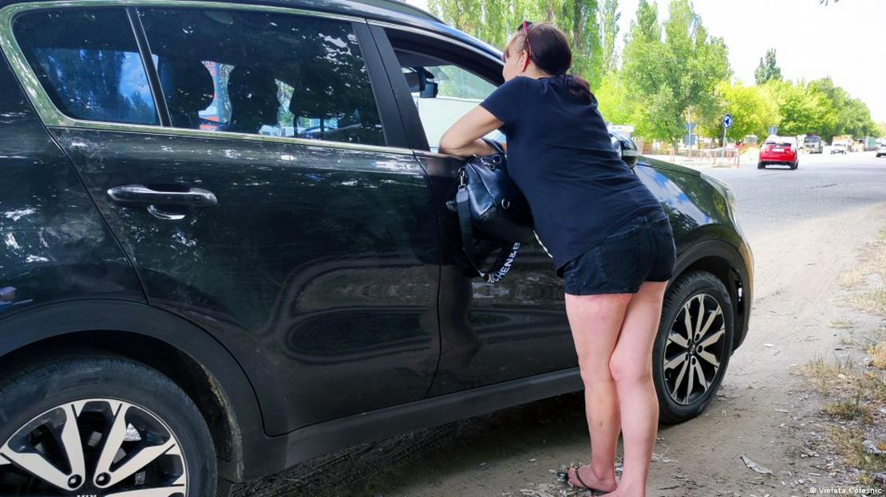
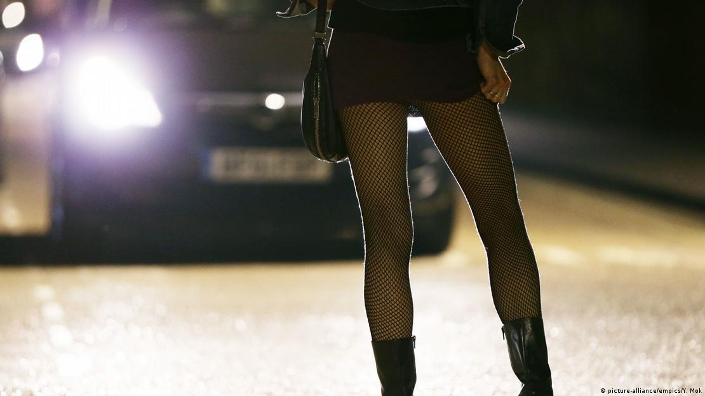

"Behind the polite facade of a well-dressed client can be a monster," said one Moldovan [sex worker](https://www.dw.com/en/giving-faceless-sex-workers-in-germany-a-face/a-59931653). She knows what she's talking about; she works on a street in northern [Moldova](https://www.dw.com/en/moldova/t-38385367), where DW met her and two of her colleagues.  
“穿着考究的顾客礼貌的外表背后可能隐藏着一个怪物，”一位摩尔多瓦性工作者说。她知道自己在说什么；她在摩尔多瓦北部的一条街道上工作，DW 在那里遇到了她和她的两个同事。

The women described how dangerous the work is: "They hanged Mariana and drowned Natasha. I can't remember exactly how Iulia died," said one. "They beat Tanea to death. Her body was found at the side of a country road. The body of another sex worker was dumped in a canal. When it was found, she could only be identified by her clothes."               
女人们描述了这项工作的危险性：“他们绞死了玛丽安娜，淹死了娜塔莎。我不记得尤利亚是怎么死的，”其中一位说。 “他们把 Tanea 打死了。她的尸体在乡间小路边被发现。另一名性工作者的尸体被扔在运河里。被发现时，只能通过衣服辨认出她的身份。”

The Republic of Moldova, a former [Soviet republic](https://www.dw.com/en/soviet-union/t-63006351), is one of the poorest countries in Europe and has a population of less than three million. About one-third of the country's 15,800 female sex workers ply their trade in the capital, Chisinau. There are no statistics for male sex workers.  
摩尔多瓦共和国是前苏联共和国，是欧洲最贫穷的国家之一，人口不到 300 万。该国 15,800 名女性性工作者中约有三分之一在首都基希讷乌从事性交易。没有男性性工作者的统计数据。

Prostitution is illegal in Moldova, so the women cannot rely on any kind of government protection. On the contrary, if the authorities find out how they earn their money, the women are fined between €88 and €118 ($95–128).  
卖淫在摩尔多瓦是非法的，因此妇女不能依赖任何形式的政府保护。相反，如果当局查明她们的赚钱方式，这些妇女将被处以 88 至 118 欧元（95 至 128 美元）的罚款。

## Fear, violence and humiliation 恐惧、暴力和羞辱

The sex workers spoke to DW of fear and humiliation, saying they are often chased by police officers at night. The "Johns" who pay for their services often degrade, beat and abuse them. Most of these women say they went into sex work out of desperation, because it was the only way they could feed their families and survive.    
这些性工作者向德国之声表达了恐惧和羞辱，称她们经常在晚上被警察追赶。为他们的服务付费的“Johns”经常贬低、殴打和虐待他们。这些女性中的大多数人说，她们从事性工作是出于绝望，因为这是她们养家糊口和生存的唯一途径。

The "Calea Basarabiei," in Moldova's capital Chisinau, passes through an industrial park. Over a stretch of 5 kilometers (3 miles), female sex workers wait on both sides of the road for potential clients. The women have divided up the road among the different groups working there.  
位于摩尔多瓦首都基希讷乌的“Calea Basarabiei”穿过一个工业园区。在 5 公里（3 英里）的延伸范围内，女性性工作者在道路两旁等待潜在客户。妇女们把这条路分给了在那里工作的不同群体。

New arrivals are not always welcome: "We are old, 36 or even 46, and the men who come here for sex would always choose the younger ones, so we chase the young women away," said one woman who has been a sex worker for over 20 years.  
新来的人并不总是受欢迎的：“我们年纪大了，36 岁甚至 46 岁，来这里做爱的男人总是选择年轻的，所以我们把年轻的女人赶走了，”一位曾经做过性工作者的妇女说20 多年来。

## In Moldova, sex can be had for as little as €5  
在摩尔多瓦，性生活只需 5 欧元

She said that since the start of the [war in Ukraine](https://www.dw.com/en/war-in-ukraine/t-60931789), several groups of Ukrainian women have appeared on the streets of Chisinau, but that they have [pimps](https://www.dw.com/en/german-police-warn-ukraine-refugees-of-human-traffickers/a-61086922). "And they only work nights; always in the same place."  
她说，自从乌克兰开战以来，基希讷乌的街头出现了多批乌克兰妇女，但她们有皮条客。 “而且他们只在晚上工作；总是在同一个地方。”

Others confirmed that sex work in Moldova today is not usually organized by pimps, instead women work independently and negotiate prices directly with clients.  
其他人证实，如今摩尔多瓦的性工作通常不是由皮条客组织的，而是女性独立工作并直接与客户协商价格。

Many sex workers would welcome the chance to earn a different living Image: Violeta Colesnic  
许多性工作者会欢迎有机会赚取不同的生活图片：Violeta Colesnic

While luxury escorts earn several hundred euros a night, women who work on the streets get between €10 and €25 per client. The smaller the town, the lower the rates: In a town with 30,000 inhabitants, rates can drop to as low as €5.  
豪华护送每晚可赚取数百欧元，而在街头工作的女性每位客户可赚取 10 至 25 欧元。城镇越小，税率越低：在一个拥有 30,000 居民的城镇，税率可低至 5 欧元。

## Discrimination and disrespect 歧视和不尊重

One sex worker in her early 40s said that it is particularly tough in small towns — and not just because of the low prices: "Everyone has a negative opinion of women like me and treat us badly. I've been arrested and had to pay fines. The police know what I do." She went on to say that it's particularly hard on her children: "At school, in the yard between the prefabs, or when playing, they are taunted because their mother is a prostitute."  
一位 40 岁出头的性工作者说，在小城镇尤其艰难——不仅仅是因为价格低：“每个人都对像我这样的女性有负面看法，对我们很不好。我被捕了，不得不付钱罚款。警察知道我做什么。”她接着说，这对她的孩子来说尤其艰难：“在学校，在预制房屋之间的院子里，或者在玩耍时，他们会因为母亲是妓女而受到嘲笑。”

A recent survey conducted in Moldova illustrates the level of [discrimination](https://www.dw.com/en/discrimination/t-45018312) faced by these women: 88% of those surveyed said they would not even want to be near a person who engages in sex work.  
最近在摩尔多瓦进行的一项调查说明了这些女性面临的歧视程度：88% 的受访者表示，她们甚至不想靠近从事性工作的人。

These women engage in this work simply because they have no other choice, no other way to earn a living: "Many people think prostitution is one of the easiest ways to get money," she said. "Whoever says that has no idea how hard it is for a woman who sells her body to regain her physical and mental equilibrium."  
这些妇女从事这项工作仅仅是因为她们别无选择，没有其他谋生方式：“许多人认为卖淫是最简单的赚钱方式之一，”她说。 “说这话的人都不知道，对于一个出卖自己身体的女人来说，要恢复身心平衡有多难。”

What she needs, one woman said, is a chance to earn a living in a different way. "Everyone treats us disrespectfully, they see us as something dirty and disgusting. Sometimes we are treated even worse than criminals who kill other people."  
一位女士说，她需要的是一个以不同方式谋生的机会。 “每个人都对我们不尊重，他们认为我们是肮脏和令人作呕的东西。有时我们受到的待遇甚至比杀人的罪犯还要糟糕。”

## Leading a double life 过着双重生活

In addition to the women who walk the streets, there are the so-called "apartment girls" who offer their services in their own home or the client's home. Many are students or married women who don't want the people close to them to know they work in the sex trade and are terrified it will come out. Nevertheless, none of them wants to give up the stable income it brings.  
除了走在街上的妇女，还有所谓的“公寓女孩”，她们在自己家里或客户家里提供服务。许多是学生或已婚妇女，她们不想让亲近的人知道她们从事性交易，并且害怕它会暴露出来。尽管如此，他们都不想放弃由此带来的稳定收入。

## Moldova fears a winter without Russian gas  
摩尔多瓦担心没有俄罗斯天然气的冬天

To view this video please enable JavaScript, and consider upgrading to a web browser that

Diana is one of them. She has two children, and her husband is unemployed. She has a secure job and often works paid overtime but the €172 she takes home at the end of the month is simply not enough for a family of four.  
戴安娜就是其中之一。她有两个孩子，她的丈夫失业了。她有一份稳定的工作，经常加班，但她月底带回家的 172 欧元根本不够一家四口吃。

That is why she turned to sex work: "I would do anything to stop my children going hungry," she says. "I lead a double life, no-one knows about the second one. I am still very present in my children's lives, I am a good mother."  
这就是她转向性工作的原因：“我愿意做任何事情来阻止我的孩子挨饿，”她说。 “我过着双重生活，没有人知道第二种生活。我在孩子们的生活中仍然很重要，我是一个好母亲。”

## Many sex workers experienced sexual violence in their youth  
许多性工作者在年轻时经历过性暴力

According to a study by the non-governmental organization (NGO) Act for Involvement, about half of all female sex workers in Chisinau were victims of sexual violence in their childhood or early youth. Olga, who has been a sex worker for 26 years, said she was raped by her teacher's husband at the age of 12. She says she kept her mouth shut because the rapist threatened to kill her if she told anyone. "I said nothing because I was too scared. That's how I came to sleep with men for money ..."  
根据非政府组织 (NGO) 参与法案 (Act for Involvement) 的一项研究，基希讷乌所有女性性工作者中约有一半是童年或青年时期性暴力的受害者。从事性工作者 26 年的奥尔加说，她在 12 岁时被老师的丈夫强奸。她说她闭上了嘴，因为强奸犯威胁说如果她告诉任何人就杀了她。 “我什么都没说，因为我太害怕了。这就是我为了钱和男人上床的原因……”

According to [the Joint United Nations Programme on HIV/AIDS (UNAIDS)](https://www.unaids.org/en/regionscountries/countries/republicofmoldova "External link — the Joint United Nations Programme on HIV/AIDS (UNAIDS)"), 2.7% of female sex workers in the country are infected with HIV. A former luxury escort said that Moldovan dignitaries, successful businessmen, mayors and politicians had all paid for her services. She doesn't know which one of them infected her with HIV.  
根据联合国艾滋病毒/艾滋病联合规划署 (UNAIDS) 的数据，该国 2.7% 的女性性工作者感染了 HIV。一位前豪华护送人员说，摩尔多瓦的政要、成功的商人、市长和政客都为她的服务付出了代价。她不知道他们中的哪一个将她感染了艾滋病毒。

Although some sex workers are terrified people will find out what they do, they don't want to give up the stable income their work providesImage: picture-alliance/empics/Y. Mok  
尽管一些性工作者害怕人们会发现他们的所作所为，但他们不想放弃工作提供的稳定收入。图片：picture-alliance/empics/Y。莫

She lost her clients and her only source of income when she became infected. Out of desperation and poverty, she began to exchange sexual services for food. She later became an alcoholic and once ended up in the hospital with alcohol poisoning. Her biggest regret is that she dropped out of medical school when the offer to do sex work came along.  
当她被感染时，她失去了客户和唯一的收入来源。出于绝望和贫困，她开始以性服务换取食物。后来她成了酒鬼，有一次因酒精中毒住进了医院。她最大的遗憾是，当出现从事性工作的机会时，她从医学院退学了。

## Fines for prostitution 卖淫罚款

Some women pay fines for prostitution. Others, like Larisa, who has been a sex worker for 26 years, can avoid them. Larisa comes from the region of [Transnistria](https://www.dw.com/en/will-the-war-in-ukraine-spell-the-end-of-transnistria/a-64363639), which broke away from Moldova in 1992 with the support of Russia. Since she doesn't hold a Moldovan passport, she doesn't have to pay such fines.  
有些妇女因卖淫而被罚款。其他人，比如从事性工作者 26 年的拉里萨，可以避开他们。拉里萨来自德涅斯特河沿岸地区，该地区在俄罗斯的支持下于 1992 年脱离摩尔多瓦。由于她没有摩尔多瓦护照，她不必支付此类罚款。

For Iraida, on the other hand, the fines are a real problem: She has already paid over 200 of them. Although she is eight months pregnant, she is still working. Iraida already has two children, and her husband is doing time in prison for dealing drugs. "He'll be inside for 7–15 years," she said, "so I have to provide for the kids on my own."  
另一方面，对于 Iraida 来说，罚款是一个真正的问题：她已经支付了 200 多笔罚款。尽管她已经怀孕八个月，但她仍在工作。 Iraida 已经有两个孩子，她的丈夫因贩毒而入狱。 “他会在里面呆 7 到 15 年，”她说，“所以我必须自己养活孩子。”

Many sex workers from different Moldovan cities have also expressed shock at the growing number of juveniles on the streets. "The youngest girls are just 12," said one sex worker. "The police are aware of it; the social workers probably are too, but no-one is lifting a finger to rescue them." She pauses, and then continues pensively, "I think the men should have a few basic morals, too..."      
来自摩尔多瓦不同城市的许多性工作者也对街头青少年数量的增加表示震惊。 “最小的女孩只有 12 岁，”一名性工作者说。 “警察知道这一点；社会工作者可能也知道，但没有人伸出一根手指来拯救他们。”她顿了顿，若有所思地说：“我觉得男人也应该有一些基本的道德……”

_This article is the result of extensive, long-term research by a team of journalists in the Republic of Moldova that included DW correspondent Violeta Colesnic in Chisinau. The journalists spoke to over 40 sex workers from a variety of towns and cities across the country. It was originally published in Romanian.  
这篇文章是摩尔多瓦共和国记者团队广泛、长期研究的结果，其中包括驻基希讷乌的德国之声记者 Violeta Colesnic。记者采访了来自全国各个城镇的 40 多名性工作者。它最初以罗马尼亚语出版。_
