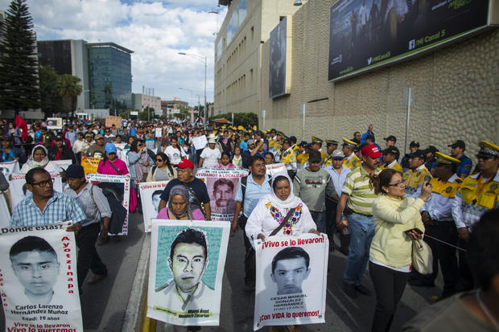

January 20, 2023 / 4:20 PM / CBS/AP

A prime suspect in the disappearance of 43 college students has been deported to Mexico by U.S. authorities. Federal authorities said the man was caught trying to cross the border on Dec. 20 without proper documents.   
43 名大学生失踪案的主要嫌疑人已被美国当局驱逐到墨西哥。联邦当局表示，这名男子于 12 月 20 日在没有适当证件的情况下试图越过边境时被抓获。

Demonstrators and relatives of 43 missing students from Ayotzinapa protest outside the Mexican television network Televisa's headquarters in March 2015 in Mexico City.  
2015 年 3 月，示威者和 43 名 Ayotzinapa 失踪学生的亲属在墨西哥电视网络 Televisa 总部外抗议。 Miguel Tovar/LatinContent via Getty Images  
MIGUEL TOVAR/拉丁内容来自 GETTY IMAGES

U.S. federal agents confirmed to the Associated Press Thursday that the man is Alejandro Tenescalco. Tenescalco was a police supervisor in the city of Iguala, where municipal police abducted the students from a rural teachers' college.   
美国联邦特工星期四向美联社证实，这名男子就是亚历杭德罗·特内斯卡尔科。 Tenescalco 是伊瓜拉市的一名警察主管，当地警察绑架了一所乡村师范学院的学生。

Alejandro Encinas, Mexico's Interior Undersecretary and the government official leading the truth commission, has called Tenescalco "one of the main perpetrators" of the crime.   
墨西哥内政部副部长兼领导真相委员会的政府官员亚历杭德罗·恩西纳斯 (Alejandro Encinas) 称特内斯卡尔科是该罪行的“主要肇事者之一”。

Numerous government and independent investigations have failed to reach a single conclusive narrative about what happened to the 43 students, but it appears that local police pulled the students off several buses in Iguala that night and turned them over to a drug gang. The motive remains unclear. Their bodies have never been found, though fragments of burned bone have been matched to three of the students.  
许多政府和独立调查未能就这 43 名学生的遭遇得出一个结论性的说法，但似乎当地警方当晚在伊瓜拉将这些学生从几辆公共汽车上拉下来，并将他们交给了一个贩毒团伙。动机尚不清楚。他们的尸体从未被发现，尽管烧焦的骨头碎片与其中三名学生相匹配。

However, from the beginning of the investigation, parents questioned the military's involvement in the killings. In August 2022, a truth commission tasked by the current government to investigate the atrocity [branded the case a "state crime"](https://www.cbsnews.com/news/mexican-students-killed-six-given-to-army-official-says/) involving agents of various institutions and said that military personnel bore "clear responsibility," either directly or through negligence for the murders.   
然而，从调查开始，父母就质疑军方是否参与了杀人事件。 2022 年 8 月，受现任政府委托调查暴行的真相委员会将此案称为涉及各机构特工的“国家犯罪”，并表示军方人员对谋杀案负有直接或过失的“明确责任”。

Encinas suggested at the time that six of the students were allegedly kept alive in a warehouse for days before they were turned over to a local army commander, who then ordered for them to be killed. His comments marked the first time an official had directly connected the military to the students' disappearance.  
恩西纳斯当时表示，据称其中 6 名学生在仓库中被关押了数天，然后被移交给一名当地军队指挥官，后者随后下令将他们处死。他的评论标志着一名官员首次将军方与学生失踪直接联系起来。

The [43 teaching students](https://www.cbsnews.com/news/mexico-remands-into-custody-jesus-murillo-karam-2014-disappearance-43-students/) had commandeered buses in the southern state of Guerrero to travel to a demonstration in Mexico City before they went missing in 2014. Authorities had been [closely monitoring the students](https://www.cbsnews.com/news/mexican-students-killed-six-given-to-army-official-says/) from the teachers' college at Ayotzinapa from the time they left their campus through their abduction by local police in the town of Iguala that night, a Mexican government truth commission found. A soldier who had infiltrated the school was among the abducted students, and Encinas asserted the army did not follow its own protocols and try to rescue him.  
这 43 名教学学生在 2014 年失踪之前曾在南部格雷罗州征用公共汽车前往墨西哥城的示威活动。当局一直密切监视 Ayotzinapa 师范学院的学生，从他们离开校园到墨西哥政府真相委员会发现，他们当晚在伊瓜拉镇被当地警察绑架。一名渗入学校的士兵是被绑架的学生之一，恩西纳斯声称军队没有遵守自己的规程并试图营救他。

In August 2022, prosecutors announced that [arrest warrants](https://www.cbsnews.com/news/mexico-remands-into-custody-jesus-murillo-karam-2014-disappearance-43-students/) had been issued for more than 80 suspects, including 20 military personnel, 44 police officers, and 14 cartel members. They are accused of involvement in [organized crime, forced disappearance](https://www.cbsnews.com/news/cartels-corruption-and-the-case-of-43-missing-mexican-students/), torture, homicide, and obstruction of justice, they said.  
2022 年 8 月，检方宣布已对 80 多名嫌疑人发出逮捕令，其中包括 20 名军人、44 名警察和 14 名卡特尔成员。他们说，他们被指控参与有组织犯罪、强迫失踪、酷刑、杀人和妨碍司法公正。

Tenescalco faces charges of kidnapping and organized crime. The Mexican government had offered a $500,000 reward for his arrest.  
Tenescalco 面临绑架和有组织犯罪的指控。墨西哥政府悬赏 50 万美元逮捕他。

In:-   [Mexico](https://www.cbsnews.com/tag/mexico/)
-   [Mexico-United States Border  墨西哥-美国边境](https://www.cbsnews.com/tag/mexico-united-states-border/)
