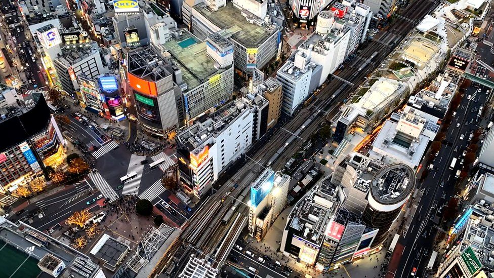
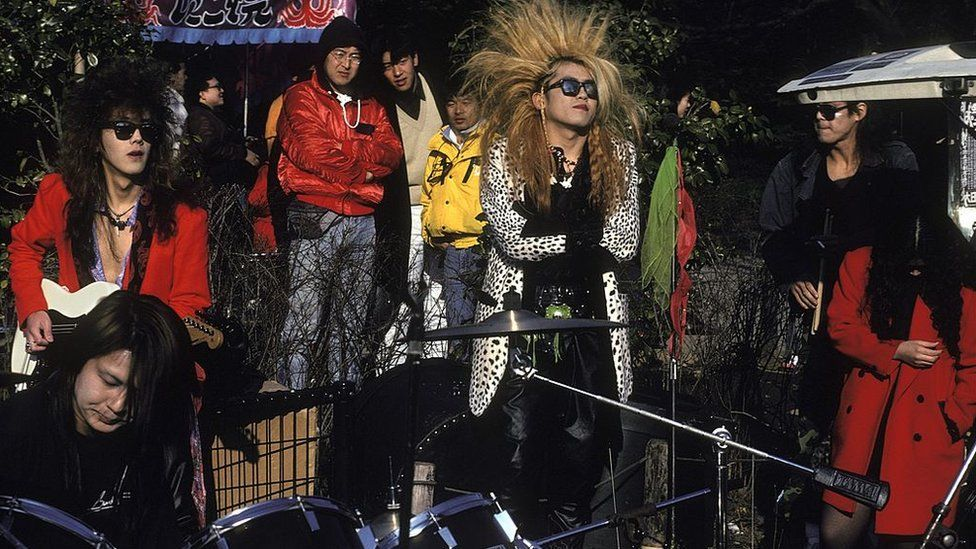
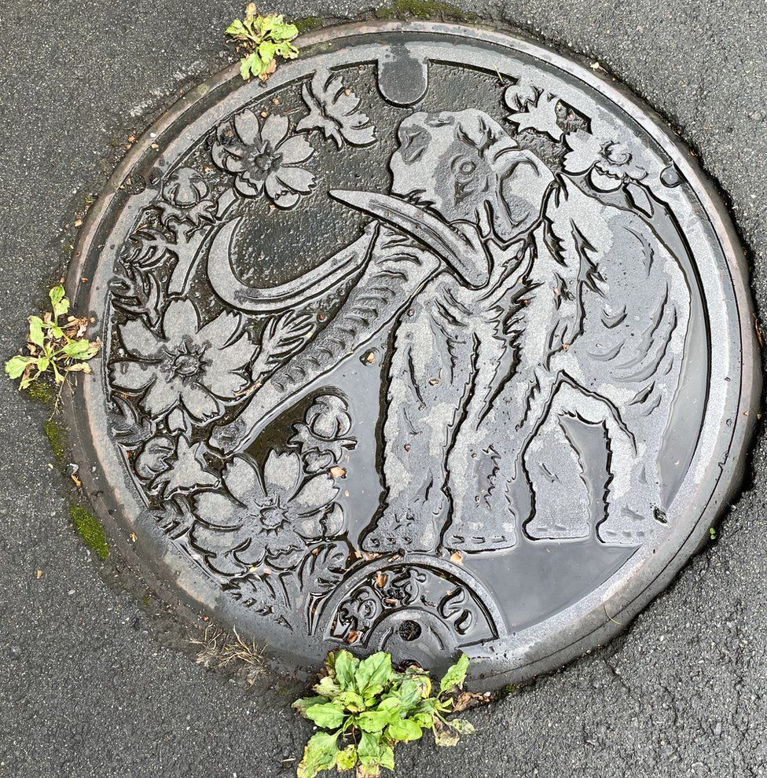
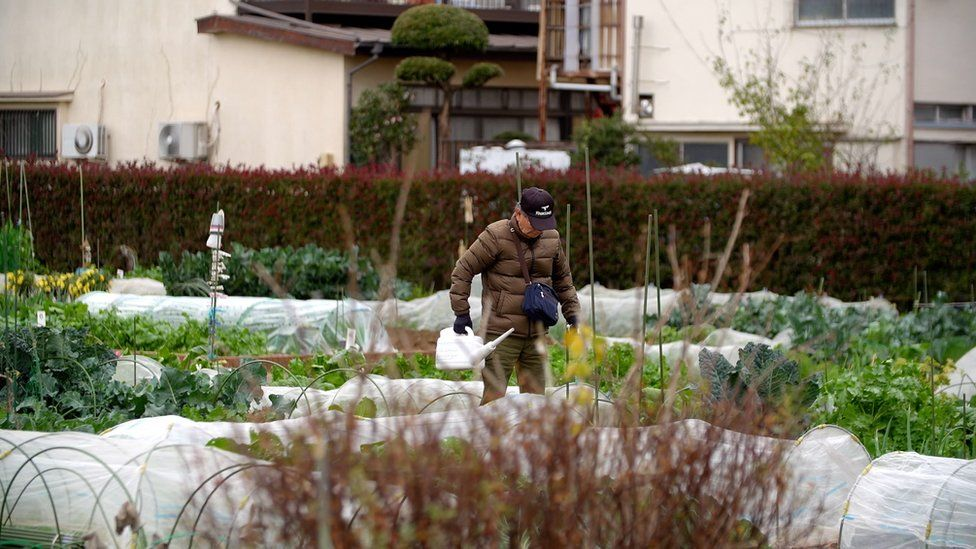
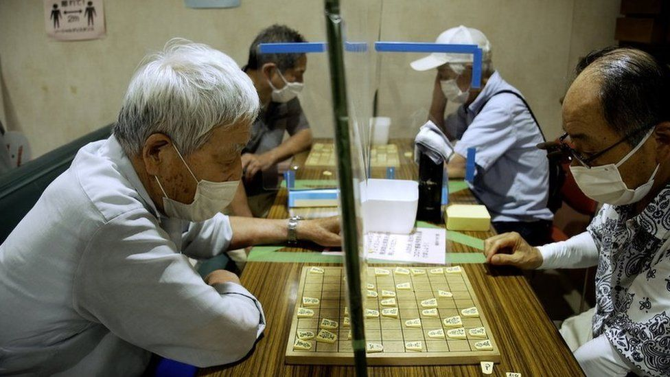

Image source, Jiro Akiba/ BBC 秋叶二郎/ BBC

Image caption,

Japan's economy, the world's third-largest, has been stagnant for years  
世界第三大经济体日本多年来一直停滞不前

**In Japan, houses are like cars.  
在日本，房子就像汽车。**

As soon as you move in, your new home is worth less than what you paid for it and after you've finished paying off your mortgage in 40 years, it is worth almost nothing.  
一旦您搬进来，您的新房子的价值就低于您购买时的价值，而在您还清 40 年的抵押贷款后，它几乎一文不值。

It bewildered me when I first moved here as a correspondent for the BBC - 10 years on, as I prepared to leave, it was still the same.  
当我作为 BBC 的记者第一次搬到这里时，我感到很困惑 - 10 年过去了，当我准备离开时，它仍然是一样的。

This is the world's third-largest economy. It's a peaceful, prosperous country with the longest life expectancy in the world, the lowest murder rate, little political conflict, a powerful passport, and the sublime Shinkansen, the world's best high-speed rail network.  
这是世界第三大经济体。这是一个和平、繁荣的国家，拥有世界上最长的预期寿命、最低的谋杀率、极少的政治冲突、强大的护照和崇高的新干线，世界上最好的高铁网络。

America and Europe once feared the Japanese economic juggernaut much the same way they fear China's growing economic might today. But the Japan the world expected never arrived. In the late 1980s, Japanese people were richer than Americans. Now they earn less than Britons.  
美国和欧洲曾经担心日本的经济主宰，就像他们今天担心中国日益增长的经济实力一样。但世界所期待的日本从未到来。在 20 世纪 80 年代后期，日本人比美国人更富有。现在他们的收入低于英国人。

For decades Japan has been struggling with a sluggish economy, held back by a deep resistance to change and a stubborn attachment to the past. Now, its population is both ageing and shrinking.  
几十年来，日本一直在与低迷的经济作斗争，受制于对变革的强烈抵制和对过去的顽固依恋。现在，它的人口正在老龄化和萎缩。

## The future was here 未来就在这里

When I arrived in Japan for the first time in 1993, it wasn't the neon-lit streets of Ginza and Shinjuku that struck me - nor the wild "Ganguro" fashion of the "Harajuku" girls.  
当我 1993 年第一次来到日本时，给我留下深刻印象的不是银座和新宿的霓虹灯街道，也不是“原宿”女孩狂野的“黑帮”时尚。

It was how much richer Japan felt than anywhere else I'd been in Asia; how exquisitely clean and orderly Tokyo was compared to any other Asian city. Hong Kong was an assault on the senses, noisy, smelly, a city of extremes - from gaudy mansions on Victoria Peak to the "dark satanic" sweatshops at the north end of Kowloon.  
这是日本比我在亚洲其他任何地方都要富有的感觉；与任何其他亚洲城市相比，东京干净整洁、秩序井然。香港是对感官的冲击，嘈杂、恶臭，是一座极端的城市——从太平山顶的华而不实的豪宅到九龙北端“黑暗邪恶”的血汗工厂。

In Taipei, where I was studying Chinese, the streets thronged to the sound of two-stroke scooters spewing acrid smoke that enveloped the city in a blanket of smog so thick you could often see barely two blocks.  
在我学习中文的台北，街道上挤满了二冲程小型摩托车喷出刺鼻烟雾的声音，城市笼罩在一层浓重的烟雾中，通常只能看到两个街区。

If Hong Kong and Taipei were Asia's raucous teenagers, Japan was the grown-up. Yes, Tokyo was a concrete jungle, but it was a beautifully manicured one.  
如果香港和台北是亚洲喧闹的少年，那么日本就是成年人。是的，东京是一座钢筋水泥丛林，但它是一座修剪整齐的丛林。

Image source, Getty Images 盖蒂图片社

Image caption,

Tokyo's Harajuku district has long been a magnet for subcultures and alternative fashion  
东京的原宿区长期以来一直吸引着亚文化和另类时尚

In front of the Imperial Palace in Tokyo, the skyline was dominated by the glass towers of the country's corporate titans - Mitsubishi, Mitsui, Hitachi, Sony. From New York to Sydney, ambitious parents were imploring their offspring to "learn Japanese". I had wondered whether I'd made a mistake plumping for Chinese.  
在东京皇宫前，天际线被该国企业巨头——三菱、三井、日立、索尼的玻璃塔所占据。从纽约到悉尼，雄心勃勃的父母都在恳求他们的后代“学习日语”。我想知道我是否错误地选择了中文。

Japan had emerged from the destruction of World War Two and conquered global manufacturing. The money poured back into the country, driving a property boom where people bought anything they could get their hands on, even chunks of forest. By the mid-1980s, the joke was that the grounds of the imperial palace in Tokyo were worth the same as all of California. The Japanese call it the "Baburu Jidai" or the bubble era.  
日本已经摆脱了第二次世界大战的破坏，并征服了全球制造业。资金涌回该国，推动了房地产繁荣，人们购买了任何他们能拿到手的东西，甚至是大片的森林。到 20 世纪 80 年代中期，开玩笑说东京皇宫的土地价值与整个加利福尼亚州的土地相同。日本人称之为“Baburu Jidai”或泡沫时代。

Then in 1991 the bubble burst. The Tokyo stock market collapsed. Property prices fell off a cliff. They are yet to recover.  
然后在 1991 年，泡沫破灭了。东京股市崩盘。房地产价格跌落悬崖。他们尚未康复。

A friend was recently negotiating to buy several hectares of forest. The owner wanted $20 per square metre. "I told him forest land is only worth $2 a square metre," my friend said. "But he insisted he needed $20 a square metre, because that's what he'd paid for it in the 1970s."  
一位朋友最近正在洽谈购买几公顷的森林。业主要价每平方米 20 美元。 “我告诉他林地每平方米只值 2 美元，”我的朋友说。 “但他坚称他需要每平方米 20 美元，因为那是他在 1970 年代支付的价格。”

Think of Japan's sleek bullet trains, or Toyota's "just-in-time" marvel of assembly-line manufacturing - and you could be forgiven for thinking Japan is a poster child for efficiency. It is not.  
想想日本时尚的子弹头列车，或丰田的“准时制”装配线制造奇迹——您可能会认为日本是效率的典范，这是情有可原的。它不是。

Rather the bureaucracy can be terrifying, while huge amounts of public money are spent on activities of dubious utility.  
相反，官僚主义可能是可怕的，而大量的公共资金被花在了可疑效用的活动上。

Last year, I discovered the story behind the stunning manhole covers in a little town in the Japanese Alps. In 1924, the fossilised bones of an ancient elephant species were found in the nearby lake. It became a symbol of the town - and a few years ago, someone decided to have all the manhole covers replaced with new ones that would have an image of the famous elephant cast in the top.  
去年，我在日本阿尔卑斯山的一个小镇发现了令人惊叹的井盖背后的故事。 1924 年，在附近的湖中发现了一种古代大象的骨骼化石。它成为了该镇的象征 - 几年前，有人决定将所有井盖更换为新的井盖，顶部铸有著名大象的图像。

This has been happening all over Japan. There is now a Japan Society for Manhole Covers that claims there are 6,000 different designs. I understand why people love the covers. They are works of art. But each one costs up to $900.  
这在日本各地都在发生。现在日本窨井盖协会声称有 6,000 种不同的设计。我明白为什么人们喜欢封面。它们是艺术品。但每一个的成本高达 900 美元。

Image caption,

These stunning manhole covers can be seen all over Japan  
这些令人惊艳的窨井盖在日本随处可见

It's a clue to how Japan has ended up with the world's largest mountain of public debt. And the ballooning bill isn't helped by an ageing population that cannot retire because of the pressure on healthcare and pensions.  
这是日本如何背负世界上最大的公共债务的线索。由于医疗保健和养老金的压力而无法退休的人口老龄化也无助于不断膨胀的账单。

When I renewed my Japanese driving licence, the exquisitely polite staff shuttled me from eye test to photo booth to fee payment and then asked me to report to "lecture room 28". These "safety" lectures are compulsory for anyone who's had a traffic infraction in the previous five years.  
当我更新我的日本驾驶执照时，彬彬有礼的工作人员把我从视力检查到照相亭再到缴费，然后让我到“28号讲堂”报到。这些“安全”讲座对于过去五年内有过交通违规行为的人来说是必修课。

Inside I found a group of disconsolate-looking souls waiting for our punishment to begin. A smartly-dressed man walked in and told us our "lecture" would begin in 10 minutes and last two hours!  
在里面，我发现一群看起来忧郁的灵魂在等待我们的惩罚开始。一位衣冠楚楚的男士走进来告诉我们，我们的“讲座”将在 10 分钟后开始，持续两个小时！

You are not required to even understand the lecture. Much of it was lost on me. As it droned in to its second hour several of my classmates fell asleep. The man next to me completed a rather fine sketch of Tokyo tower. I sat bored and resentful, the clock on the wall mocking me.  
你甚至不需要理解讲座。我失去了很多。当它嗡嗡作响到第二个小时时，我的几个同学睡着了。我旁边的人完成了一幅相当精美的东京塔草图。我无聊而愤恨地坐着，墙上的钟在嘲笑我。

"What's the point of it?" I asked my Japanese colleague when I got back to the office. "It's punishment, right?"  
“这有什么意义？”回到办公室后，我问了我的日本同事。 “这是惩罚，对吧？”

"No," she said laughing. "It's a job creation scheme for retired traffic cops."  
“不，”她笑着说。 “这是为退休交通警察创造就业机会的计划。”

But the longer you live here, even the frustrating bits turn familiar, even endearing. You start to appreciate the quirks - like the four petrol station attendants who clean all your car windows while they fill the tank and bow in unison as you depart.  
但你在这里住的时间越长，即使是令人沮丧的部分也会变得熟悉，甚至可爱。您开始欣赏这些怪癖 - 就像四个加油站服务员在给油箱加满油并在您离开时齐声鞠躬时清洁您所有的车窗。

Japan still feels like Japan, and not a reproduction of America. It's why the world is so thrilled by all things Japanese, from the powder snow to the fashion. Tokyo is home to superlative restaurants; Studio Ghibli makes the world's most enchanting animation (sorry, Disney); sure, J-pop is awful, but Japan is undoubtedly a soft-power superpower.  
日本仍然感觉像日本，而不是美国的翻版。这就是为什么世界对日本的一切都如此激动，从粉雪到时尚。东京是顶级餐厅的所在地；吉卜力工作室制作了世界上最迷人的动画（对不起，迪士尼）；诚然，J-pop 很糟糕，但日本无疑是一个软实力超级大国。

The geeks and oddballs love it for its wonderful weirdness. But it also has alt-right admirers for refusing immigration and maintaining the patriarchy. It is often described as a country that has successfully become modern without abandoning the ancient. There is some truth to this, but I'd argue the modern is more a veneer.  
极客和古怪的人都喜欢它的奇妙怪异。但它也有拒绝移民和维护父权制的另类右翼崇拜者。它经常被描述为一个在不放弃古代的情况下成功实现现代化的国家。这有一定的道理，但我认为现代更像是一种外表。

When Covid struck, Japan closed its borders. Even permanent foreign residents were excluded from returning. I called up the foreign ministry to ask why foreigners who'd spent decades in Japan, had homes and businesses here, were being treated like tourists. The response was blunt: "they are all foreigners."  
当 Covid 来袭时，日本关闭了边界。甚至永久性外国居民也被排除在外。我打电话给外务省，问为什么在日本生活了几十年、在这里有家和做生意的外国人被当作游客对待。回答直截了当：“他们都是外国人。”

A hundred and fifty years after it was forced to open its doors, Japan is still sceptical, even fearful of the outside world.  
在被迫敞开大门一百五十年之后，日本仍然对外界持怀疑态度，甚至感到恐惧。

## The outside factor  外部因素

I remember sitting in a village hall on the Boso Peninsula on the far side of Tokyo Bay. I was there because the village was listed as endangered, one of 900 in Japan. The old men gathered in the hall were concerned. Since the 1970s they had watched young people leave for jobs in cities. Of the 60 left, there was only one teenager and no children.  
我记得坐在东京湾另一边房总半岛的一个村堂里。我在那里是因为这个村庄被列为濒危村庄，是日本 900 个村庄之一。聚集在大厅里的老人们都很关心。自 20 世纪 70 年代以来，他们就看到年轻人离开城市工作。剩下的60人中，只有一名少年，没有孩子。

"Who will look after our graves when we are gone?" one elderly gentleman lamented. Taking care of the spirits is serious business in Japan.  
“我们走了以后谁来照看我们的坟墓？”一位老先生感叹道。在日本，照顾灵魂是一件严肃的事情。

But to me, a native of south-east England, the death of this village seemed absurd. It was surrounded by picture postcard rice paddies and hills covered in dense forest. Tokyo was less than two hours' drive away.  
但对我这个土生土长的英格兰东南部人来说，这个村庄的消亡似乎很荒谬。它被风景如画的明信片稻田和茂密森林覆盖的山丘所环绕。距东京不到两小时车程。

Image source, Jiro Akiba/BBC 秋叶二郎/BBC

Image caption,

Japanese farmers are the oldest in the world  
日本农民是世界上最年长的

"This is such a beautiful place," I said to them. "I'm sure lots of people would love to live here. How would you feel if I brought my family to live here?"  
“这是一个如此美丽的地方，”我对他们说。 “我敢肯定很多人会喜欢住在这里。如果我带着我的家人住在这里，你会有什么感觉？”

The air in the room went still. The men looked at each other in silent embarrassment. Then one cleared his throat and spoke, with a worried look on his face: "Well, you would need to learn our way of life. It wouldn't be easy."  
房间里的空气静止了。男人们尴尬地面面相觑。随即清了清嗓子开口，一脸担忧：“嗯，你得学学我们的生活方式，不容易。”

The village was on the path to extinction, yet the thought of it being invaded by "outsiders" was somehow worse.  
村子快要灭亡了，但一想到被“外来者”入侵，就更糟了。

A third of Japanese people are over 60, making Japan home to the oldest population in the world, after tiny Monaco. It is recording fewer births than ever before. By 2050, it could lose a fifth of its current population.  
三分之一的日本人超过 60 岁，这使日本成为世界上人口老龄化最多的国家，仅次于面积不大的摩纳哥。它记录的出生人数比以往任何时候都少。到 2050 年，它可能会失去现有人口的五分之一。

Yet its hostility to immigration has not wavered. Only about 3% of Japan's population is foreign-born, compared to 15% in the UK. In Europe and America, right-wing movements point to it as a shining example of racial purity and social harmony.  
然而，它对移民的敌意并没有动摇。日本只有约 3% 的人口出生在国外，而英国的这一比例为 15%。在欧洲和美国，右翼运动将其视为种族纯洁和社会和谐的光辉典范。

But Japan is not as ethnically pure as those admirers might think. There are the Ainu of Hokkaido, Okinawans in the south, half a million ethnic Koreans, and close to a million Chinese. Then there are Japanese children with one foreign parent, which include my own three.  
但日本并不像那些仰慕者想象的那样种族纯洁。有北海道的阿伊努人、南部的冲绳人、50 万朝鲜族人和近 100 万中国人。然后是日本的孩子有一个外国父母，其中包括我自己的三个。

These bi-cultural kids are known as "hafu" or halves - a pejorative term that's normal here. They include celebrities and sports icons, such as tennis star Naomi Osaka. Popular culture idolises them as "more beautiful and talented". But it's one thing to be idolised and quite another to be accepted.  
这些双文化孩子被称为“hafu”或 halfs——这是一个在这里很常见的贬义词。他们包括名人和体育偶像，例如网球明星大坂直美。流行文化将她们奉为“更美丽更有才华”的偶像。但被崇拜是一回事，被接受又是另一回事。

Media caption,

Why do more than four in 10 young Japanese say they are still virgins?  
为什么超过十分之四的日本年轻人说自己还是处女？

If you want to see what happens to a country that rejects immigration as a solution to falling fertility, Japan is a good place to start.  
如果你想看看一个拒绝移民作为生育率下降解决方案的国家会发生什么，日本是一个很好的起点。

Real wages haven't grown here in 30 years. Incomes in South Korea and Taiwan have caught up and even overtaken Japan.  
这里的实际工资已经 30 年没有增长了。韩国和台湾的收入已经赶上甚至超过了日本。

But change feels distant. In part it's because of a rigid hierarchy that determines who holds the levers of power.  
但改变感觉很遥远。部分原因是严格的等级制度决定了谁掌握权力。

## The old are still in power  
旧的仍然掌权

"Look there's something you need to understand about how Japan works," an eminent academic told me. "In 1868 the Samurai surrendered their swords, cut their hair, put on Western suits and marched into the ministries in Kasumigaseki (the government district of central Tokyo) and they're still there today."  
“看，关于日本的运作方式，你需要了解一些东西，”一位著名学者告诉我。 “1868 年，武士们交出刀剑，剪掉头发，穿上西装，进入霞关（东京市中心的政府区）的各部，他们今天仍然在那里。”

In 1868, fearing a repeat of China's fate at the hands of Western imperialists, reformers overthrew the military dictatorship of the Tokugawa Shogunate and set Japan on a course of high-speed industrialisation.  
1868 年，由于担心中国在西方帝国主义手中重蹈覆辙，改革者推翻了德川幕府的军事独裁统治，使日本走上了高速工业化的道路。

But the Meiji restoration, as it's known, was no storming of the Bastille. It was an elite putsch. Even after a second convulsion of 1945, the "great" families survived. This overwhelmingly male ruling class is defined by nationalism and a conviction that Japan is special. They do not believe Japan was the aggressor in the war, but its victim.  
但众所周知，明治维新并不是攻占巴士底狱。这是一场精英政变。即使在 1945 年的第二次动荡之后，“伟大”的家庭仍然幸存下来。这个以男性为主的统治阶级被民族主义和日本的特殊信念所定义。他们不认为日本是战争的侵略者，而是受害者。

Slain former prime minister Shinzo Abe, for instance, was the son of a foreign minister, and grandson of another prime minister, Nobusuke Kishi. Grandpa Kishi was a member of the wartime junta and was arrested by the Americans as a suspected war criminal. But he escaped the hangman and in the mid-1950s helped found the Liberal Democratic Party (LDP), which has ruled Japan ever since.  
例如，被杀的前首相安倍晋三是一位外相的儿子，也是另一位首相岸信介的孙子。岸爷爷是战时军政府的成员，被美国人当作战犯嫌疑人逮捕。但他逃脱了刽子手，并在 1950 年代中期帮助创立了自民党 (LDP)，自那以后一直统治着日本。

Some people joke Japan is a one-party state. It isn't. But it's reasonable to ask why Japan continues to re-elect a party run by an entitled elite, which yearns to scrap American-imposed pacifism, but has failed to improve living standards for 30 years.  
有人戏称日本是一党制国家。它不是。但有理由问为什么日本继续重新选举一个由有资格的精英领导的政党，这个政党渴望废除美国强加的和平主义，但 30 年来未能改善生活水平。

During a recent election I drove up a narrow river valley cut into the mountains two hours west of Tokyo - LDP country. The local economy depends on cement making and hydropower. In a tiny town I met an elderly couple walking to the polling station.  
在最近的一次选举中，我开车经过一条狭窄的河谷，在东京以西两小时车程的山区——自民党国家。当地经济依赖水泥制造和水力发电。在一个小镇上，我遇到了一对老年夫妇，他们正走向投票站。

"We'll be voting LDP," the husband said. "We trust them, they will take care of us."  
“我们将投票给自民党，”丈夫说。 “我们信任他们，他们会照顾我们的。”

"I agree with my husband," his wife said.  
“我同意我丈夫的看法，”他的妻子说。

The couple pointed across the valley to a recently-completed tunnel and bridge they hope will bring more weekend tourists from Tokyo. But it's often said the LDP's support base is made of concrete. This form of pork-barrel politics is one reason so much of Japan's coastline is blighted by tetra pods, its rivers walled with grey concrete. It's essential to keep the concrete pumping.  
这对夫妇指着山谷对面一座最近完工的隧道和桥梁，他们希望这能带来更多来自东京的周末游客。但人们常说自民党的支持基础是用混凝土做的。这种形式的猪肉桶政治是日本大部分海岸线被四角豆荚破坏的原因之一，它的河流用灰色混凝土围起来。保持混凝土泵送至关重要。

Image source, Jiro Akiba/ BBC 秋叶二郎/ BBC

Image caption,

Japan's biggest economic challenge is its ageing population  
日本最大的经济挑战是人口老龄化

These rural strongholds are crucial now because of demographics. They should have reduced as millions of young people moved to cities for work. But that never happened. The LDP likes it that way because it means older, rural votes count more.  
由于人口结构，这些农村据点现在至关重要。随着数百万年轻人搬到城市工作，它们本应减少。但那从未发生过。自民党喜欢这样，因为这意味着年长的农村选票更重要。

As this older generation passes, change is inevitable. But I am not certain it means Japan is going to become more liberal or open.  
随着老一辈人的逝去，改变是不可避免的。但我不确定这是否意味着日本会变得更加自由或开放。

Younger Japanese are less likely to be married or have children. But they are also less likely to speak a foreign language or to have studied overseas than their parents or grandparents. Just 13% of Japanese managers are women, and fewer than one in 10 MPs.  
年轻的日本人不太可能结婚或生孩子。但与他们的父母或祖父母相比，他们也不太可能会说外语或出国留学。只有 13% 的日本经理是女性，不到十分之一的国会议员。

When I interviewed Tokyo's first female governor Yuriko Koike, I asked her how her administration planned to help address the gender gap.  
当我采访东京首位女知事小池百合子时，我问她她的政府计划如何帮助解决性别差距问题。

"I have two daughters who will soon graduate from university," I told her. "They are bi-lingual Japanese citizens. What would you say to them to encourage them to stay and make their careers here?"  
“我有两个女儿，她们很快就要大学毕业了，”我告诉她。 “他们是双语日本公民。你会对他们说些什么来鼓励他们留下来并在这里发展他们的事业？”

"I would tell them if I can succeed here, so can they," she said. "Is that all you have?" I thought.  
“我会告诉他们，如果我能在这里取得成功，他们也能，”她说。 “你就只有这些吗？”我想。

And yet, despite all this I am going to miss Japan, which inspires in me both enormous affection and the not-so-occasional bout of exasperation.  
然而，尽管如此，我还是会想念日本，它激发了我巨大的感情和不那么偶尔的愤怒。

On one of my last days in Tokyo, I went with a group of friends to a year-end street market. At one stall I rifled through boxes of beautiful old woodworking tools. A short distance away a group of young women dressed in gorgeous silk Kimonos stood chatting. At midday we squeezed into a tiny restaurant for a "set lunch" of grilled mackerel, sashimi and miso soup. The food, the cosy surroundings, the kindly old couple fussing over us - it had all become so familiar, so comfortable.  
在东京的最后几天，我和一群朋友去了一个年终街头市场。在一个摊位上，我翻阅了一箱箱漂亮的旧木工工具。不远处，一群穿着华丽丝绸和服的年轻女子站在那里聊天。中午，我们挤进一家小餐馆享用烤鲭鱼、生鱼片和味增汤的“午餐套餐”。食物，舒适的环境，慈祥的老夫妇为我们操心——一切都变得那么熟悉，那么舒服。

After a decade here I have got used to the way Japan is and come to accept the fact that it is not about to change.  
在这里待了十年，我已经习惯了日本的现状，也开始接受它不会改变的事实。

Yes, I worry about the future. And Japan's future will have lessons for the rest of us. In the age of artificial intelligence, fewer workers could drive innovation; Japan's aged farmers may be replaced by intelligent robots. Large parts of the country could return to the wild.  
是的，我担心未来。日本的未来将为我们其他人提供教训。在人工智能时代，更少的工人可以推动创新；日本老年农民或被智能机器人取代该国大部分地区可能会回归自然。

Will Japan gradually fade into irrelevance, or re-invent itself? My head tells me that to prosper anew Japan must embrace change. But my heart aches at the thought of it losing the things that make it so special.  
日本会逐渐变得无关紧要，还是会重新发明自己？我的头脑告诉我，要重新繁荣，日本必须拥抱变革。但一想到它失去了使它如此特别的东西，我的心就痛。

## More of our Japan coverage:  更多我们的日本报道：

-   [Tokyo](https://www.bbc.com/news/topics/c20jdmwgj3xt)
-   [Asia](https://www.bbc.com/news/topics/c5rznn0nvvyt)
-   [Japan](https://www.bbc.com/news/topics/cjnwl8q4g7nt)
