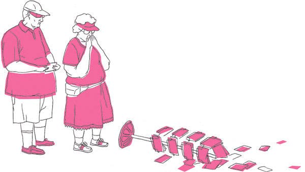

Letter From London 伦敦来信

Credit...Illustration by Brian Rea 布赖恩·雷 (Brian Rea) 的插图

-   Dec. 31, 2009 2009 年 12 月 31 日

The first thing I ever heard about Americans was that they all carried guns. Then, when I came across people who’d had direct contact with this ferocious-sounding tribe, I learned that they were actually rather friendly. At university, friends who had traveled in the United States came back with more detailed stories, not just of the friendliness of Americans but also of their hospitality (which, in our quaint English way, was translated into something close to gullibility). When I finally got to America myself, I found that not only were the natives friendly and hospitable, they were also incredibly polite. No one tells you this about Americans, but once you notice it, it becomes one of their defining characteristics, especially when they’re abroad.  
我听说美国人的第一件事就是他们都带着枪。然后，当我遇到与这个听起来很凶猛的部落有过直接接触的人时，我才知道他们其实很友善。在大学里，在美国旅行过的朋友们带着更详细的故事回来了，不仅是美国人的友善，还有他们的好客（用我们古朴的英语，这被翻译成近乎轻信的东西）。当我终于亲自来到美国时，我发现当地人不仅友好好客，而且非常有礼貌。没有人告诉你关于美国人的这一点，但一旦你注意到它，它就会成为他们的决定性特征之一，尤其是当他们在国外时。

This is very strange, or at least it says something strange about the way that perception routinely conforms to the preconceptions it would appear to contradict. The archetypal American abroad is perceived as loud and crass even though actually existing American tourists are distinguished by the way they address bus drivers and bartenders as “sir” and are effusive in their thanks when any small service is rendered. We look on with some confusion at these encounters because, on the one hand, the Americans seem a bit country-bumpkinish, and, on the other, good manners are a form of sophistication.  
这是非常奇怪的，或者至少它说明了一些奇怪的事情，即感知通常符合它似乎矛盾的先入之见的方式。在国外，典型的美国人被认为是吵闹和粗鲁的，尽管实际上现有的美国游客以他们称呼公共汽车司机和调酒师为“先生”的方式而著称，并且在提供任何小服务时都热情洋溢地表示感谢。我们看着这些遭遇有些困惑，因为一方面，美国人似乎有点乡巴佬，另一方面，礼貌是一种老练的形式。

Granted, these visiting Americans often seem to have loud voices, but on closer examination, it’s a little subtler than that. Americans have no fear of _being overheard_. Civic life in Britain is predicated on the idea that everyone just about conceals his loathing of everyone else. To open your mouth is to risk offending someone. So we mutter and mumble as if surrounded by informers or, more exactly, as if they are living in our heads. In America the right to free speech is exercised freely and cordially. The basic assumption is that nothing you say will offend anyone else because, deep down, everyone is agreed on the premise that America is better than anyplace else. No such belief animates British life. On the contrary. A couple of years ago a survey indicated that British Muslims were the most fed-up of any in Europe: a sign, paradoxically, of profound assimilation.  
诚然，这些来访的美国人的声音似乎常常很大，但仔细观察，它比那更微妙。美国人不怕被偷听。英国的公民生活是基于这样一种观念，即每个人都只是掩饰自己对其他人的厌恶。张开嘴就是冒着冒犯别人的风险。所以我们喃喃自语，仿佛被告密者包围，或者更确切地说，好像他们就住在我们的脑海里。在美国，言论自由的权利得到自由和真诚的行使。基本假设是你说的任何话都不会冒犯任何人，因为在内心深处，每个人都同意美国比其他任何地方都好。没有这样的信念能激发英国人的生活。相反。几年前的一项调查表明，英国穆斯林是欧洲最厌烦的穆斯林：矛盾的是，这是一种深刻同化的迹象。

If the typical American interaction involves an ostensibly contradictory mixture of the formal (politeness), the casual and the cordial, what happens when one moves beyond the transactional? Like many Europeans, I always feel good about myself in America; I feel appreciated, liked. It took a while to realize that this had nothing to do with _me_. It was about the people who made me feel this way: it was about charm. Yes, this is the bright secret of life in the United States: Americans are not just friendly and polite — they are also charming. And the most charming thing of all is that it rarely looks like charm. The French put a rather charmless emphasis on charm, are consciously or unconsciously persuaded that it is either part of a display of sophistication or — and it may amount to the same thing — a tool in the service of seduction.  
如果典型的美国互动涉及正式（礼貌）、随意和亲切的表面上矛盾的混合体，那么当人们超越交易时会发生什么？和许多欧洲人一样，我在美国总是自我感觉良好；我感到被欣赏，被喜欢。花了一段时间才意识到这与我无关。这是关于让我有这种感觉的人：这是关于魅力。是的，这就是美国生活的亮丽秘密：美国人不仅友善礼貌——他们也很有魅力。最迷人的是它很少看起来像魅力。法国人对魅力的强调相当无趣，他们自觉或不自觉地认为，魅力要么是展示成熟的一部分，要么——而且可能是同一回事——一种为诱惑服务的工具。

You can see all of this in operation on flights back across the Atlantic from America to Euroland. At first we are under the spell of America. Instead of plunking ourselves down next to someone without a word, we say “Hi.” Maybe even indulge in a little conversation, though this American readiness to chat is counterbalanced by the fear that once we’ve got into a conversation we might not be able to extricate ourselves from it. By the time we’re mid-ocean, a kind of preparatory freeze has set in. As the flight stacks up in the inevitable holding pattern over Heathrow, we begin to revert to our muttering and moaning national selves. But, for a week or so after landing, a form of what might be called Ameristalgia makes us conscious of a rudeness in British life — a coarsening in the texture of daily life — that had hitherto seemed quite normal.  
您可以在从美洲飞回欧洲大陆的航班上看到所有这一切。起初我们被美国迷住了。我们不会一言不发地坐在某人旁边，而是说“嗨”。甚至可以沉迷于进行一些简短的交谈，尽管这种美国人乐于聊天的态度被担心一旦我们开始交谈我们可能无法从中解脱出来的恐惧所抵消。当我们在大洋中部时，一种预备性的冻结已经开始。随着航班在希思罗机场上空不可避免地等待，我们开始恢复到我们喃喃自语和呻吟的民族自我。但是，在着陆后大约一周的时间里，一种可能被称为美国痛的形式让我们意识到英国生活中的粗鲁——日常生活质地的粗糙——这在迄今为止似乎是很正常的。

For example. I pay a considerable sum of money to play indoors at Islington Tennis Centre. Eighty percent of the time, the next people to play indicate that your time is up by unzipping their racket covers and strolling on court, without saying a word, without a smile, without acknowledging your existence except as an impediment. In America that would be not just unacceptable but _inconceivable_.  
例如。我花了一大笔钱在伊斯灵顿网球中心的室内打球。百分之八十的时间，下一个要打球的人会拉开他们的球拍套，在球场上漫步，一言不发，没有微笑，除了作为障碍之外不承认你的存在，这表明你的时间到了。在美国，这不仅是不可接受的，而且是不可思议的。

What is the relevance of this anecdotal trivia to a serious debate about the status of America in the world?  
这个轶事琐事与关于美国在世界上的地位的严肃辩论有什么关系？

Most of my American friends were depressed and gloomy about the Bush years. Several said that if Bush were re-elected in 2004, they would leave the country. He was and they didn’t. The bottom line is that given the choice, Americans love it rather than leave it. Day to day, American life remained as pleasant as could be expected, even in the midst of considerable economic hardship. There was even a bonding, anti-Bush feeling similar to the kind of consensual opposition that we experienced under Margaret Thatcher. A visiting American artist like Patti Smith found that while the usual torrent of name-dropping — Rimbaud, Mapplethorpe, Kerouac et al. — got a smattering of appreciative applause, a single gibe about Bush brought the house down.  
我的大多数美国朋友都对布什时代感到沮丧和沮丧。 Several said that if Bush were re-elected in 2004, they would leave the country.他是，而他们没有。最重要的是，如果有选择，美国人会喜欢它而不是放弃它。日复一日，即使在相当大的经济困难时期，美国人的生活仍然像预期的那样愉快。甚至有一种与我们在玛格丽特·撒切尔 (Margaret Thatcher) 领导下经历过的那种自愿反对相似的反布什感觉。像帕蒂·史密斯这样的来访美国艺术家发现，虽然像往常一样大量贬低名字——兰波、梅普尔索普、凯鲁亚克等人。 - 得到了一些赞赏的掌声，一个关于布什的嘲笑让房子倒塌了。

At the same time, either sterling went up or the dollar went down (I don’t really understand this stuff), and as a consequence, Americans felt poor when they visited our rainy little island. So, for a brief period, we felt richer — planeloads of us went to Mannahatta and bought up everything in sight — _and_ ideologically and ethically superior. Man, that felt good. We had a less blinkered attitude to Israel, didn’t drive big gas-guzzling S.U.V.’s, and if we were chilly of an evening we put on a sweater rather than turning up the heating (or, more accurately, turning off the A.C.). Sure, Blair went along with invading Iraq, but wasn’t that partly because he hoped to restrain the crusading fundamentalism of Bush? Now the dollar is back up — or down, or whichever it is — Europe is no longer expensive, and with the election of Barack Obama, the brief cushion of political superiority has been permanently deflated.  
与此同时，要么英镑升值，要么美元贬值（我不太了解这些东西），结果，美国人在访问我们这个多雨的小岛时感到很穷。因此，在很短的一段时间内，我们感觉自己更富有了——我们乘坐飞机前往曼纳哈塔，买下了眼前的一切——并且在意识形态和道德上都更优越了。伙计，那感觉很好。我们对以色列的态度不那么盲目，不开耗油量大的 SUV，如果晚上天气寒冷，我们会穿上毛衣，而不是开暖气（或者更准确地说，关掉空调）。 ).当然，布莱尔赞成入侵伊拉克，但这部分不就是因为他希望抑制布什的十字军原教旨主义吗？现在，美元恢复了，或者是欧洲，或者是欧洲的，欧洲不再昂贵了，随着巴拉克·奥巴马（Barack Obama）的选举，短暂的政治优势的缓冲已被永久放松。

The Obama election was a real kick in the teeth, because although we Britons still seethe with class hatred, we pride ourselves on our highly evolved attitude to the question of race that has consistently undermined the American dream. The slight problem is that racial intermingling in Britain is most conspicuous in the ethnically diverse makeup of the groups of yobs — Asian, black and white — who exercise their antisocial behavioral skills without any kind of discrimination as to whom they happen to be terrorizing. In this regard, as in so many others, we seem to be leading from the bottom up.  
奥巴马大选是真正的牙齿，因为尽管我们的英国人仍然充满了阶级的仇恨，但我们以我们对种族问题的高度发展态度而感到自豪，而种族问题一直削弱了美国的梦想。一个小问题是，英国的种族融合在亚裔、黑人和白人群体的不同种族构成中最为明显，他们行使他们的反社会行为技能，而不会对他们碰巧恐吓的人有任何歧视。在这方面，与许多其他方面一样，我们似乎是自下而上的领导者。

Across the board, the grounds for all our feelings of superiority have been steadily whittled away. It turns out that the qualities that make us indubitably British — that is, the ones that we don’t share with or have not imported from America — are no longer conducive to Greatness. They actually add up to a kind of ostrich stoicism that, though it can be traced back to our finest hour (the blitz, the Battle of Britain), manifests itself in a peculiar compromise: a highly stylized willingness to muddle on, to put up with poor quality and high prices (restaurants, trains), to proffer (and accept) apologies not as a prelude to but as a substitute for improvement. We may not enjoy the way things are, but we endure them in a way that seems either quaint or quasi-Soviet to American visitors.  
总的来说，我们所有优越感的基础都被逐渐削弱了。事实证明，使我们成为英国人的品质——即我们不与美国分享或没有从美国进口的品质——不再有助于伟大。它们实际上构成了一种鸵鸟式的坚忍，虽然它可以追溯到我们最辉煌的时刻（闪电战、不列颠之战），但它以一种特殊的妥协方式表现出来：一种高度程式化的愿意得过且过、忍受质量差和价格高（餐馆、火车），提出（和接受）道歉不是作为改进的前奏，而是作为改进的替代品。我们可能不喜欢事物的现状，但我们以一种对美国游客来说似乎古怪或类似苏联的方式忍受它们。

A tiny example. There’s a fashionable gastro pub near where I live. You scrum at the bar, desperate to get the attention of the barman. After a while, he will raise his eyebrows and glare at you. Unschooled in our rough ways, a visitor from America might assume he is being threatened, but actually the glare means that your order can now be taken — as long as you’re quick about it. When a friend from California had managed to order, he was handed the credit card terminal, which showed the amount _and_ the option to add something for service. Americans are predisposed to tip, but my friend was slightly taken aback because, far from being in receipt of anything that might be described as service, it felt as if he had been fighting for a place aboard the last lifeboat on the Titanic. “Welcome to England,” I said.  
一个小例子。我住的地方附近有一家时尚的美食酒吧。你在酒吧里匆匆忙忙，不顾一切地想引起酒保的注意。过了一会儿，他会扬起眉毛瞪你一眼。没有受过我们粗鲁的教育，来自美国的游客可能会认为他受到了威胁，但实际上，眩光意味着你的订单现在可以接受了——只要你反应快。当一位来自加利福尼亚的朋友设法订购时，他拿到了信用卡终端，上面显示了金额和添加服务的选项。美国人倾向于给小费，但我的朋友有点吃惊，因为他远没有收到任何可能被描述为服务的东西，感觉好像他一直在为泰坦尼克号最后一艘救生艇上的一个位置而战。 “欢迎来到英格兰，”我说。

Geoff Dyer’s latest book is a novel, “Jeff in Venice, Death in Varanasi.”  
Geoff Dyer 的最新著作是一本小说，“Jeff in Venice, Death in Varanasi”。

A version of this article appears in print on Jan. 3, 2010, Page 23 of the Sunday Book Review with the headline: My American Friends. [Order Reprints](https://www.parsintl.com/publication/the-new-york-times/) | [Today’s Paper](https://www.nytimes.com/section/todayspaper) | [Subscribe](https://www.nytimes.com/subscriptions/Multiproduct/lp8HYKU.html?campaignId=48JQY)  
本文的一个版本发表于 2010 年 1 月 3 日星期日书评的第 23 页，标题为：我的美国朋友。订购转载 |今日报 |订阅

## Most Popular 最受欢迎

**Special offer:** Subscribe for

~$2~

$0.50 a week for the first year.

  
特别优惠：第一年订阅费为 2 美元，每周 0.50 美元。

**Thanks for reading The Times. 感谢您阅读《泰晤士报》。**
