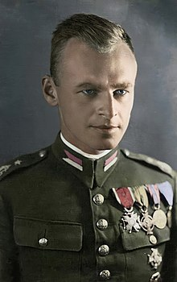
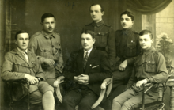
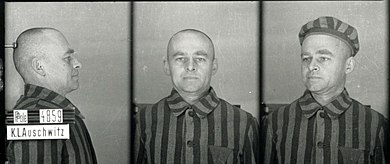
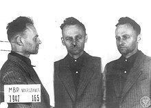
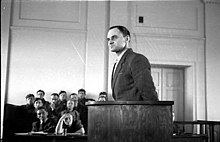
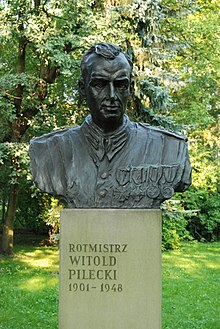
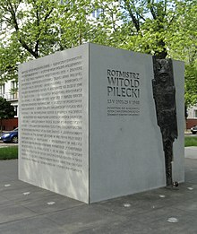

| 
Witold Pilecki 维托尔德皮莱茨基

 |
| --- |
| 

Pilecki in a colorized pre-1939 photograph  
1939 年前的彩色照片中的 Pilecki

 |
| Born | 13 May 1901 1901 年 5 月 13 日  
[Olonets](https://en.wikipedia.org/wiki/Olonets "Olonets"), [Olonetsky Uyezd](https://en.wikipedia.org/wiki/Olonetsky_Uyezd "Olonetsky Uyezd"), [Olonets Governorate](https://en.wikipedia.org/wiki/Olonets_Governorate "Olonets Governorate"), [Russian Empire](https://en.wikipedia.org/wiki/Russian_Empire "Russian Empire")  
Olonets , Olonetsky Uyezd , Olonets Governorate , 俄罗斯帝国 |
| Died | 25 May 1948 (aged 47) 1948 年 5 月 25 日（47 岁）  
[Mokotów Prison](https://en.wikipedia.org/wiki/Mokot%C3%B3w_Prison "Mokotów Prison"), [Warsaw](https://en.wikipedia.org/wiki/Warsaw "Warsaw"), Poland  
Mokotów 监狱，波兰华沙 |
| Buried | 

Unknown. Possibly in [Powązki Military Cemetery  
未知。可能在 Powązki 军事公墓](https://en.wikipedia.org/wiki/Pow%C4%85zki_Military_Cemetery "Powązki Military Cemetery")

 |
| Allegiance 忠诚 | [Second Polish Republic](https://en.wikipedia.org/wiki/Second_Polish_Republic "Second Polish Republic"); [Polish government-in-exile](https://en.wikipedia.org/wiki/Polish_government-in-exile "Polish government-in-exile")  
波兰第二共和国；波兰流亡政府 |
| Years of service 服务年限 | 1918–1947 1918–1947 |
| Rank | Cavalry captain ([rotmistrz](https://en.wikipedia.org/wiki/Rotmistrz "Rotmistrz")) 骑兵队长 (rotmistrz) |
| Commands held 举行的命令 | Commander of the 1st Lida Military Training Squadron (1932–1937)  
第一利达军事训练中队司令员（1932-1937）

-   Deputy Commander of the [41st Infantry Division](https://en.wikipedia.org/wiki/41st_Infantry_Division_(Poland) "41st Infantry Division (Poland)") (1939)  
    第41师副师长（1939年）
-   Organizer of the [Secret Polish Army](https://en.wikipedia.org/wiki/Secret_Polish_Army "Secret Polish Army") (1939–1940)  
    波兰秘密军队的组织者（1939–1940）
-   Organizer of the [Union of Military Organizations](https://en.wikipedia.org/wiki/Zwi%C4%85zek_Organizacji_Wojskowej "Związek Organizacji Wojskowej") (1940–1943)  
    军事组织联盟的组织者（1940-1943）
-   Commander of the [Warszawianka Company](https://en.wikipedia.org/w/index.php?title=Warszawianka_Company&action=edit&redlink=1 "Warszawianka Company (page does not exist)") \[[pl](https://pl.wikipedia.org/wiki/Kompania_NSZ_%E2%80%9EWarszawianka%E2%80%9D "pl:Kompania NSZ „Warszawianka”")\] (1944)  
    Warszawianka 连指挥官 \[复数\] (1944)

 |
| Battles/wars 战斗/战争 | 

-   [Polish–Soviet War  波苏战争](https://en.wikipedia.org/wiki/Polish%E2%80%93Soviet_War "Polish–Soviet War")
    -   [Wilno Offensive (1919)  威尔诺攻势 (1919)](https://en.wikipedia.org/wiki/Vilna_offensive "Vilna offensive")
    -   [Kiev Offensive (1920)  基辅攻势 (1920)](https://en.wikipedia.org/wiki/Kiev_Offensive_(1920) "Kiev Offensive (1920)")
    -   [First Battle of Grodno (1920)  
        第一次格罗德诺战役 (1920)](https://en.wikipedia.org/wiki/First_Battle_of_Grodno_(1920) "First Battle of Grodno (1920)")
    -   [Battle of Warsaw (1920)  
        华沙战役 (1920)](https://en.wikipedia.org/wiki/Battle_of_Warsaw_(1920) "Battle of Warsaw (1920)")
-   [Polish-Lithuanian War  波兰立陶宛战争](https://en.wikipedia.org/wiki/Polish-Lithuanian_War "Polish-Lithuanian War")
    -   [Żeligowski's Mutiny](https://en.wikipedia.org/wiki/%C5%BBeligowski%27s_Mutiny "Żeligowski's Mutiny") (1920)  热利戈夫斯基的叛变 (1920)
-   [World War II  
    第二次世界大战](https://en.wikipedia.org/wiki/World_War_II "World War II")
    -   [September Campaign](https://en.wikipedia.org/wiki/September_Campaign "September Campaign") (1939)  九月战役 (1939)
    -   [Warsaw Uprising](https://en.wikipedia.org/wiki/Warsaw_Uprising "Warsaw Uprising") (1944)  华沙起义 (1944)

 |
| Awards | 

-    [Order of the White Eagle](https://en.wikipedia.org/wiki/Order_of_the_White_Eagle_(Poland) "Order of the White Eagle (Poland)")  白鹰骑士团
-    [Order of Polonia Restituta](https://en.wikipedia.org/wiki/Order_of_Polonia_Restituta "Order of Polonia Restituta")  Polonia Restituta 秩序
-    [Cross of Valour](https://en.wikipedia.org/wiki/Cross_of_Valour_(Poland) "Cross of Valour (Poland)") (2)
-    Silver [Cross of Merit](https://en.wikipedia.org/wiki/Cross_of_Merit_(Poland) "Cross of Merit (Poland)")  银十字勋章

 |
| [Alma mater  母校](https://en.wikipedia.org/wiki/Alma_mater "Alma mater") | [University of Poznań](https://en.wikipedia.org/wiki/University_of_Pozna%C5%84 "University of Poznań"), Faculty of Agriculture (1922) [Stefan Batory University](https://en.wikipedia.org/wiki/Stefan_Batory_University "Stefan Batory University"), Faculty of Fine Arts (1922–1924)  
波兹南大学，农学院（1922 年）斯特凡巴托里大学，美术学院（1922-1924 年） |
| Spouse(s) 配偶 | 

Maria Ostrowska

(m. 1931) 玛丽亚·奥斯特罗斯卡（1931 年出生）

 |
| Children 孩子们 | 2 |

**Witold Pilecki** (13 May 1901 – 25 May 1948; Polish: [\[ˈvitɔlt piˈlɛt͡skʲi \]](https://en.wikipedia.org/wiki/Help:IPA/Polish "Help:IPA/Polish") ([listen](https://upload.wikimedia.org/wikipedia/commons/7/78/Pl-Witold_Pilecki.ogg "Pl-Witold Pilecki.ogg")); codenames _Roman Jezierski, Tomasz Serafiński, Druh, Witold_<a href="https://en.wikipedia.org/wiki/Witold_Pilecki#cite_note-:0-1">[1]</a>) was a [Polish](https://en.wikipedia.org/wiki/Poles "Poles") [World War II](https://en.wikipedia.org/wiki/World_War_II "World War II") [cavalry](https://en.wikipedia.org/wiki/Cavalry "Cavalry") officer, [intelligence agent](https://en.wikipedia.org/wiki/Espionage "Espionage"), and [resistance leader](https://en.wikipedia.org/wiki/Resistance_movement "Resistance movement").  
Witold Pilecki（1901 年 5 月 13 日 – 1948 年 5 月 25 日；波兰语：\[ˈvitɔlt piˈlɛt͡skʲi \] ([listen](https://upload.wikimedia.org/wikipedia/commons/7/78/Pl-Witold_Pilecki.ogg "Pl-Witold Pilecki.ogg")) ；代号 Roman Jezierski、Tomasz Serafiński、Druh、Witold <a href="https://en.wikipedia.org/wiki/Witold_Pilecki#cite_note-:0-1">[1]</a> ）是一名波兰二战骑兵军官、情报人员和抵抗运动领袖.

As a youth, Pilecki joined Polish underground scouting, and in the aftermath of World War I, Polish militia and later, the [Polish Army](https://en.wikipedia.org/wiki/Polish_Armed_Forces_(Second_Polish_Republic) "Polish Armed Forces (Second Polish Republic)"). He participated in the [Polish-Soviet War](https://en.wikipedia.org/wiki/Polish-Soviet_War "Polish-Soviet War") which ended in 1921. In 1939 he participated in the unsuccessful defense of Poland against the [German invasion](https://en.wikipedia.org/wiki/Invasion_of_Poland "Invasion of Poland") and shortly afterward, joined the [Polish resistance](https://en.wikipedia.org/wiki/Polish_resistance_movement_in_World_War_II "Polish resistance movement in World War II"), co-founding the [Secret Polish Army](https://en.wikipedia.org/wiki/Secret_Polish_Army "Secret Polish Army") resistance movement. In 1940 Pilecki volunteered<a href="https://en.wikipedia.org/wiki/Witold_Pilecki#cite_note-Bes-2">[2]</a>: 66  <a href="https://en.wikipedia.org/wiki/Witold_Pilecki#cite_note-Were_We_All_People?-3">[3]</a><a href="https://en.wikipedia.org/wiki/Witold_Pilecki#cite_note-patricelli-4">[4]</a><a href="https://en.wikipedia.org/wiki/Witold_Pilecki#cite_note-szum-5">[5]</a> to allow himself to be captured by the occupying Germans in order to infiltrate the [Auschwitz concentration camp](https://en.wikipedia.org/wiki/Auschwitz_concentration_camp "Auschwitz concentration camp"). At Auschwitz he organized a resistance movement that eventually included hundreds of inmates, and he secretly drew up reports detailing German atrocities at the camp, which were smuggled out to [Home Army](https://en.wikipedia.org/wiki/Home_Army "Home Army") headquarters and shared with the [Western Allies](https://en.wikipedia.org/wiki/Allies_of_World_War_II "Allies of World War II"). After escaping from Auschwitz, Pilecki fought in the [Warsaw Uprising](https://en.wikipedia.org/wiki/Warsaw_Uprising "Warsaw Uprising") of August–October 1944. Following its suppression, he was interned in a German prisoner-of-war camp. After the [communist](https://en.wikipedia.org/wiki/Communism "Communism") takeover of Poland he remained loyal to the London-based [Polish government-in-exile](https://en.wikipedia.org/wiki/Polish_government-in-exile "Polish government-in-exile"). In 1945 he returned to Poland to report to the government-in-exile on the situation in Poland. Before returning, Pilecki wrote _[Witold's Report](https://en.wikipedia.org/wiki/Witold%27s_Report "Witold's Report")_ about his Auschwitz experiences, anticipating that he might be killed by Poland's new communist authorities. In 1947 he was arrested by the [secret police](https://en.wikipedia.org/wiki/Urz%C4%85d_Bezpiecze%C5%84stwa "Urząd Bezpieczeństwa") on charges of working for "foreign imperialism" and, after being subjected to torture and a [show trial](https://en.wikipedia.org/wiki/Show_trial "Show trial"), was executed in 1948.  
年轻时，皮莱茨基加入了波兰地下侦察队，并在第一次世界大战后加入了波兰民兵组织，后来加入了波兰军队。他参加了于 1921 年结束的波苏战争。1939 年，他参加了波兰抵抗德国入侵的保卫战，但没有成功，不久之后，他加入了波兰抵抗运动，与人共同创立了波兰秘密军队抵抗运动。 1940 年，Pilecki 自愿让 <a href="https://en.wikipedia.org/wiki/Witold_Pilecki#cite_note-Bes-2">[2]</a> : 66   <a href="https://en.wikipedia.org/wiki/Witold_Pilecki#cite_note-Were_We_All_People?-3">[3]</a> <a href="https://en.wikipedia.org/wiki/Witold_Pilecki#cite_note-patricelli-4">[4]</a> <a href="https://en.wikipedia.org/wiki/Witold_Pilecki#cite_note-szum-5">[5]</a> 被占领的德国人俘虏，以便潜入奥斯威辛集中营。在奥斯维辛，他组织了一场最终包括数百名囚犯的抵抗运动，他秘密起草了详细描述德国人在集中营中暴行的报告，这些报告被偷运到本土军总部并与西方盟国分享。逃离奥斯维辛后，皮莱茨基参加了 1944 年 8 月至 10 月的华沙起义。在镇压后，他被关押在德国战俘营。在共产党接管波兰后，他仍然忠于总部设在伦敦的波兰流亡政府。 1945年他回到波兰向流亡政府报告波兰的情况。回国前，皮莱茨基写了关于他在奥斯维辛集中营经历的维托尔德报告，预计他可能会被波兰新的共产主义当局杀害。 1947 年，他被秘密警察逮捕，罪名是为“外国帝国主义”工作，在遭受酷刑和公开审判后，于 1948 年被处决。

His story, inconvenient to the Polish communist authorities, remained mostly unknown for several decades; one of the first accounts of Pilecki's mission to Auschwitz was given by Polish historian [Józef Garliński](https://en.wikipedia.org/wiki/J%C3%B3zef_Garli%C5%84ski "Józef Garliński"), himself a former Auschwitz inmate who emigrated to Britain after the war, in _[Fighting Auschwitz: The Resistance Movement in the Concentration Camp](https://en.wikipedia.org/wiki/Fighting_Auschwitz "Fighting Auschwitz")_ (1975). Several monographs appeared in subsequent years, particularly after the [fall of communism in Poland](https://en.wikipedia.org/wiki/Fall_of_communism_in_Poland "Fall of communism in Poland") facilitated research into his life by Polish historians.  
他的故事对波兰共产党当局造成了不便，几十年来几乎无人知晓。波兰历史学家约泽夫·加林斯基 (Józef Garliński) 在战后移居英国的前奥斯威辛集中营囚犯，在与奥斯威辛集中营作战：集中营中的抵抗运动 (1975) 中，对皮莱茨基 (Pilecki) 前往奥斯威辛集中营的任务进行了首次记述。随后几年出现了几本专着，特别是在波兰共产主义垮台之后，促进了波兰历史学家对他生平的研究。

## Biography 传

### Early life 早期生活

Pilecki _(first right)_ as a scout, [Oryol](https://en.wikipedia.org/wiki/Oryol "Oryol"), [Russia](https://en.wikipedia.org/wiki/Russia "Russia"), 1917  
Pilecki（右一）作为侦察员，奥廖尔，俄罗斯，1917 年

Witold Pilecki was born on 13 May 1901 in the town of [Olonets](https://en.wikipedia.org/wiki/Olonets "Olonets"), [Karelia](https://en.wikipedia.org/wiki/Republic_of_Karelia "Republic of Karelia"), in the [Russian Empire](https://en.wikipedia.org/wiki/Russian_Empire "Russian Empire").<a href="https://en.wikipedia.org/wiki/Witold_Pilecki#cite_note-IPNweb-6">[6]</a> He was a descendant of a Polish-speaking noble family ([szlachta](https://en.wikipedia.org/wiki/Szlachta "Szlachta")) of the [Leliwa coat of arms](https://en.wikipedia.org/wiki/Leliwa_coat_of_arms "Leliwa coat of arms"). His ancestors had been deported to Russia from their home in [Lithuania](https://en.wikipedia.org/wiki/Lithuania "Lithuania") (former [Nowogródek Voivodeship](https://en.wikipedia.org/wiki/Nowogr%C3%B3dek_Voivodeship_(1507%E2%80%931795) "Nowogródek Voivodeship (1507–1795)") region, now in [Belarus](https://en.wikipedia.org/wiki/Belarus "Belarus")) for participating in the [January 1863–64 Uprising](https://en.wikipedia.org/wiki/January_Uprising "January Uprising"), for which a major part of their estate was confiscated.<a href="https://en.wikipedia.org/wiki/Witold_Pilecki#cite_note-:0-1">[1]</a><a href="https://en.wikipedia.org/wiki/Witold_Pilecki#cite_note-Mus-7">[7]</a><a href="https://en.wikipedia.org/wiki/Witold_Pilecki#cite_note-8">[8]</a> Witold was one of five children of forest inspector Julian Pilecki and Ludwika Osiecimska.<a href="https://en.wikipedia.org/wiki/Witold_Pilecki#cite_note-IPNweb-6">[6]</a>  
Witold Pilecki 于 1901 年 5 月 13 日出生在俄罗斯帝国卡累利阿的 Olonets 镇。 <a href="https://en.wikipedia.org/wiki/Witold_Pilecki#cite_note-IPNweb-6">[6]</a> 他是Leliwa纹章的波兰语贵族家庭（szlachta）的后裔。他的祖先因参加 1863-64 年 1 月起义而被从他们在立陶宛（前诺沃格罗德克省地区，现位于白俄罗斯）的家中驱逐到俄罗斯，他们的大部分财产被没收。 <a href="https://en.wikipedia.org/wiki/Witold_Pilecki#cite_note-:0-1">[1]</a> <a href="https://en.wikipedia.org/wiki/Witold_Pilecki#cite_note-Mus-7">[7]</a> <a href="https://en.wikipedia.org/wiki/Witold_Pilecki#cite_note-8">[8]</a> Witold 是森林检查员 Julian Pilecki 和 Ludwika Osiecimska 的五个孩子之一。 <a href="https://en.wikipedia.org/wiki/Witold_Pilecki#cite_note-IPNweb-6">[6]</a>

In 1910 Witold moved with his mother and siblings to [Wilno](https://en.wikipedia.org/wiki/Vilnius "Vilnius"), to attend a Polish school there, while his father remained in Olonets. In Wilno, Pilecki attended a local school and joined the underground [Polish Scouting and Guiding Association](https://en.wikipedia.org/wiki/Polish_Scouting_and_Guiding_Association "Polish Scouting and Guiding Association") (_Związek Harcerstwa Polskiego_, _ZHP_).<a href="https://en.wikipedia.org/wiki/Witold_Pilecki#cite_note-cuber-9">[9]</a><a href="https://en.wikipedia.org/wiki/Witold_Pilecki#cite_note-IPNweb-6">[6]</a>  
1910 年，维托尔德与他的母亲和兄弟姐妹一起搬到维尔诺，在那里上一所波兰语学校，而他的父亲则留在奥洛内茨。在维尔诺，Pilecki 就读于当地的一所学校，并加入了波兰地下侦察和指导协会 (Związek Harcerstwa Polskiego, ZHP)。 <a href="https://en.wikipedia.org/wiki/Witold_Pilecki#cite_note-cuber-9">[9]</a> <a href="https://en.wikipedia.org/wiki/Witold_Pilecki#cite_note-IPNweb-6">[6]</a>

Following the outbreak of [World War I](https://en.wikipedia.org/wiki/World_War_I "World War I"), in 1916 Pilecki was sent by his mother to a school in the Russian city of [Oryol](https://en.wikipedia.org/wiki/Oryol "Oryol"), located safer in the East than Wilno. There he attended a [gymnasium](https://en.wikipedia.org/wiki/Gymnasium_(school) "Gymnasium (school)") (secondary school) and founded a local chapter of the _ZHP_.<a href="https://en.wikipedia.org/wiki/Witold_Pilecki#cite_note-IPNweb-6">[6]</a>  
第一次世界大战爆发后，1916 年，皮莱茨基被他的母亲送到俄罗斯城市奥廖尔的一所学校，那里比维尔诺在东部更安全。他在那里上了一所体育馆（中学）并成立了 ZHP 的地方分会。 <a href="https://en.wikipedia.org/wiki/Witold_Pilecki#cite_note-IPNweb-6">[6]</a>

### Polish–Soviet War  波兰-苏联战争

In 1918, following the outbreak of the [Russian Revolution](https://en.wikipedia.org/wiki/Russian_Revolution "Russian Revolution") and the defeat of the [Central Powers](https://en.wikipedia.org/wiki/Central_Powers "Central Powers") in World War I, Pilecki returned to Wilno (at that time part of the newly independent [Polish Second Republic](https://en.wikipedia.org/wiki/Polish_Second_Republic "Polish Second Republic")) and joined the ZHP section of the [Self-Defence of Lithuania and Belarus](https://en.wikipedia.org/wiki/Self-Defence_of_Lithuania_and_Belarus_(1918) "Self-Defence of Lithuania and Belarus (1918)"), a [paramilitary](https://en.wikipedia.org/wiki/Paramilitary "Paramilitary") formation under Major General [Władysław Wejtko](https://en.wikipedia.org/wiki/W%C5%82adys%C5%82aw_Wejtko "Władysław Wejtko").<a href="https://en.wikipedia.org/wiki/Witold_Pilecki#cite_note-cuber-9">[9]</a><a href="https://en.wikipedia.org/wiki/Witold_Pilecki#cite_note-IPNweb-6">[6]</a> The militia disarmed the passing German troops and took up positions to defend the city from a looming attack by the [Soviet Red Army](https://en.wikipedia.org/wiki/Soviet_Red_Army "Soviet Red Army"). After Wilno fell to [Bolshevik](https://en.wikipedia.org/wiki/Bolshevik "Bolshevik") forces on 5 January 1919, Pilecki and his unit resorted to [partisan warfare](https://en.wikipedia.org/wiki/Partisan_warfare "Partisan warfare") behind Soviet lines. He and his comrades then retreated to [Białystok](https://en.wikipedia.org/wiki/Bia%C5%82ystok "Białystok"), where Pilecki enlisted as a _[szeregowy](https://en.wikipedia.org/wiki/Private_(rank) "Private (rank)")_ (private) in Poland's newly established [Volunteer Army](https://en.wikipedia.org/wiki/Volunteer_Army_(Poland) "Volunteer Army (Poland)"). He took part in the [Polish-Soviet War](https://en.wikipedia.org/wiki/Polish-Soviet_War "Polish-Soviet War") of 1919–1921, serving under Captain [Jerzy Dąbrowski](https://en.wikipedia.org/wiki/Jerzy_D%C4%85browski_(Lieutenant_Colonel) "Jerzy Dąbrowski (Lieutenant Colonel)").<a href="https://en.wikipedia.org/wiki/Witold_Pilecki#cite_note-IPNweb-6">[6]</a> He fought in the [Kiev Offensive (1920)](https://en.wikipedia.org/wiki/Kiev_Offensive_(1920) "Kiev Offensive (1920)") and as part of a [cavalry](https://en.wikipedia.org/wiki/Cavalry "Cavalry") unit defending the then-Polish city of [Grodno](https://en.wikipedia.org/wiki/Grodno "Grodno"). On 5 August 1920, Pilecki joined the [211th Uhlan Regiment](https://en.wikipedia.org/w/index.php?title=211th_Uhlan_Regiment&action=edit&redlink=1 "211th Uhlan Regiment (page does not exist)") \[[pl](https://pl.wikipedia.org/wiki/211_Pu%C5%82k_U%C5%82an%C3%B3w "pl:211 Pułk Ułanów")\] and fought in the crucial [Battle of Warsaw](https://en.wikipedia.org/wiki/Battle_of_Warsaw_(1920) "Battle of Warsaw (1920)") and in the [Rūdninkai Forest](https://en.wikipedia.org/w/index.php?title=R%C5%ABdninkai_Forest&action=edit&redlink=1 "Rūdninkai Forest (page does not exist)") \[[lt](https://lt.wikipedia.org/wiki/R%C5%ABdnink%C5%B3_giria "lt:Rūdninkų giria")\]. Pilecki later took part in the [Vilna offensive](https://en.wikipedia.org/wiki/Vilna_offensive "Vilna offensive") and briefly served in the ongoing [Polish–Lithuanian War](https://en.wikipedia.org/wiki/Polish%E2%80%93Lithuanian_War "Polish–Lithuanian War") as a member of the October 1920 [Żeligowski's Mutiny](https://en.wikipedia.org/wiki/%C5%BBeligowski%27s_Mutiny "Żeligowski's Mutiny").<a href="https://en.wikipedia.org/wiki/Witold_Pilecki#cite_note-IPNweb-6">[6]</a>  
1918 年，随着俄国革命的爆发和同盟国在第一次世界大战中的战败，皮莱茨基回到维尔诺（当时属于新独立的波兰第二共和国）并加入了波兰自卫队的 ZHP 分队立陶宛和白俄罗斯，由瓦迪斯瓦夫韦特科少将领导的准军事组织。 <a href="https://en.wikipedia.org/wiki/Witold_Pilecki#cite_note-cuber-9">[9]</a> <a href="https://en.wikipedia.org/wiki/Witold_Pilecki#cite_note-IPNweb-6">[6]</a> 民兵解除了路过的德国军队的武装，并占据阵地以保卫城市免受苏联红军迫在眉睫的进攻。 1919 年 1 月 5 日维尔诺落入布尔什维克军队之手后，皮莱茨基和他的部队在苏联后方诉诸游击战。他和他的战友随后撤退到比亚韦斯托克，皮莱茨基在那里作为 szeregowy（列兵）应征入伍，加入了波兰新成立的志愿军。他参加了 1919 年至 1921 年的波苏战争，在 Jerzy Dąbrowski 上尉手下服役。 <a href="https://en.wikipedia.org/wiki/Witold_Pilecki#cite_note-IPNweb-6">[6]</a> 他参加了基辅攻势 (1920)，并作为保卫当时波兰城市格罗德诺的骑兵部队的一员。 1920 年 8 月 5 日，皮莱茨基加入了第 211 乌兰军团 \[pl\]，并参加了关键的华沙战役和 Rūdninkai 森林 \[lt\]。皮莱茨基后来参加了维尔纳攻势，并作为 1920 年 10 月热利戈夫斯基兵变的成员在正在进行的波兰立陶宛战争中短暂服役。 <a href="https://en.wikipedia.org/wiki/Witold_Pilecki#cite_note-IPNweb-6">[6]</a>

### Interwar years 两次世界大战期间

By the conclusion of Polish-Soviet War in March 1921, Pilecki was promoted to the rank of _[plutonowy](https://en.wikipedia.org/wiki/Plutonowy "Plutonowy")_ ([corporal](https://en.wikipedia.org/wiki/Corporal_(rank) "Corporal (rank)")), becoming a [non-commissioned officer](https://en.wikipedia.org/wiki/Non-commissioned_officer "Non-commissioned officer").<a href="https://en.wikipedia.org/wiki/Witold_Pilecki#cite_note-:1-10">[10]</a>: 19   Shortly afterward, Pilecki was transferred to the [army reserves](https://en.wikipedia.org/wiki/Military_reserves "Military reserves"), completing courses required for a non-commissioned officer rank at the Cavalry Reserve Officers' Training School in [Grudziądz](https://en.wikipedia.org/wiki/Grudzi%C4%85dz "Grudziądz").<a href="https://en.wikipedia.org/wiki/Witold_Pilecki#cite_note-IPNweb-6">[6]</a> He went on to complete his [secondary education](https://en.wikipedia.org/wiki/Secondary_education "Secondary education") (_[matura](https://en.wikipedia.org/wiki/Matura "Matura")_) later that same year.<a href="https://en.wikipedia.org/wiki/Witold_Pilecki#cite_note-:0-1">[1]</a> He briefly enrolled with the [Faculty of Fine Arts](https://en.wikipedia.org/wiki/Fine_art "Fine art") at [Stefan Batory University](https://en.wikipedia.org/wiki/University_of_Vilnius "University of Vilnius") but was forced to abandon his studies in 1924 due to both financial issues and the declining health of his father.<a href="https://en.wikipedia.org/wiki/Witold_Pilecki#cite_note-IPNweb-6">[6]</a> In July 1925 Pilecki was assigned to the 26th Lancer Regiment with the rank of _[Chorąży](https://en.wikipedia.org/wiki/Chor%C4%85%C5%BCy "Chorąży")_ ([ensign](https://en.wikipedia.org/wiki/Ensign_(rank) "Ensign (rank)")). Pilecki would be promoted to _[podporucznik](https://en.wikipedia.org/wiki/Podporucznik "Podporucznik")_ (second lieutenant, with seniority from 1923) the following year.<a href="https://en.wikipedia.org/wiki/Witold_Pilecki#cite_note-cuber-9">[9]</a><a href="https://en.wikipedia.org/wiki/Witold_Pilecki#cite_note-IPNweb-6">[6]</a> Also in 1926, in September, Pilecki became the owner of his family's ancestral estate, [Sukurcze](https://en.wikipedia.org/wiki/Sukurcze "Sukurcze"), in the [Lida District](https://en.wikipedia.org/wiki/Lida_District "Lida District") of the [Nowogródek Voivodeship](https://en.wikipedia.org/wiki/Nowogr%C3%B3dek_Voivodeship_(1919%E2%80%931939) "Nowogródek Voivodeship (1919–1939)"). In 1931, he married [Maria Ostrowska](https://en.wikipedia.org/w/index.php?title=Maria_Pilecka&action=edit&redlink=1 "Maria Pilecka (page does not exist)") \[[pl](https://pl.wikipedia.org/wiki/Maria_Pilecka_(1906%E2%80%932002) "pl:Maria Pilecka (1906–2002)")\]. They had two children, born in Wilno over the next two years: Andrzej and [Zofia](https://en.wikipedia.org/w/index.php?title=Zofia_Optu%C5%82owicz&action=edit&redlink=1 "Zofia Optułowicz (page does not exist)") \[[pl](https://pl.wikipedia.org/wiki/Zofia_Optu%C5%82owicz "pl:Zofia Optułowicz")\]. Pilecki actively supported the local farming community. He was also an amateur poet and painter. He organized the _Krakus_ Military Horsemen Training program in 1932 and was appointed to command the 1st Lida Military Training [Squadron](https://en.wikipedia.org/wiki/Squadron_(army) "Squadron (army)"), which in 1937 was placed under the Polish [19th Infantry Division](https://en.wikipedia.org/wiki/19th_Infantry_Division_(Poland) "19th Infantry Division (Poland)"). In 1938, Pilecki received the Silver [Cross of Merit](https://en.wikipedia.org/wiki/Cross_of_Merit_(Poland) "Cross of Merit (Poland)") for his activities.<a href="https://en.wikipedia.org/wiki/Witold_Pilecki#cite_note-Paliwoda_2013_88%E2%80%9396-11">[11]</a><a href="https://en.wikipedia.org/wiki/Witold_Pilecki#cite_note-cuber-9">[9]</a><a href="https://en.wikipedia.org/wiki/Witold_Pilecki#cite_note-IPNweb-6">[6]</a>  
到 1921 年 3 月波苏战争结束时，皮莱茨基晋升为 plutonowy（下士）军衔，成为一名士官。 <a href="https://en.wikipedia.org/wiki/Witold_Pilecki#cite_note-:1-10">[10]</a> : 19   不久之后，Pilecki 被调到陆军预备役，在格鲁琼兹的骑兵预备役军官培训学校完成了士官级别所需的课程。 <a href="https://en.wikipedia.org/wiki/Witold_Pilecki#cite_note-IPNweb-6">[6]</a> 同年晚些时候，他继续完成中学教育 (matura)。 <a href="https://en.wikipedia.org/wiki/Witold_Pilecki#cite_note-:0-1">[1]</a> 他曾短暂就读于斯蒂芬巴托里大学美术学院，但由于经济问题和父亲健康状况不佳，他于 1924 年被迫放弃学业。 <a href="https://en.wikipedia.org/wiki/Witold_Pilecki#cite_note-IPNweb-6">[6]</a> 1925 年 7 月，Pilecki 被分配到第 26 骑兵团，军衔为 Chorąży（少尉）。 Pilecki 将在次年晋升为 podporucznik（少尉，资历从 1923 年开始）。 <a href="https://en.wikipedia.org/wiki/Witold_Pilecki#cite_note-cuber-9">[9]</a> <a href="https://en.wikipedia.org/wiki/Witold_Pilecki#cite_note-IPNweb-6">[6]</a> 同样在 1926 年的 9 月，Pilecki 成为其家族祖传庄园 Sukurcze 的所有者，该庄园位于诺沃格罗德克省利达区。 1931 年，他与 Maria Ostrowska \[pl\] 结婚。他们有两个孩子，在接下来的两年里出生在威尔诺：Andrzej 和 Zofia \[pl\]。 Pilecki 积极支持当地农业社区。他还是一位业余诗人和画家。他于 1932 年组织了 Krakus 军事骑士训练计划，并被任命指挥第 1 Lida 军事训练中队，该中队于 1937 年隶属于波兰第 19 步兵师。 1938 年，Pilecki 因其活动获得了银质十字勋章。 <a href="https://en.wikipedia.org/wiki/Witold_Pilecki#cite_note-Paliwoda_2013_88%E2%80%9396-11">[11]</a> <a href="https://en.wikipedia.org/wiki/Witold_Pilecki#cite_note-cuber-9">[9]</a> <a href="https://en.wikipedia.org/wiki/Witold_Pilecki#cite_note-IPNweb-6">[6]</a>

### World War II 第二次世界大战

#### Polish September Campaign 波兰九月运动

With [Polish-German tensions growing in mid-1939](https://en.wikipedia.org/wiki/Germany%E2%80%93Poland_relations#Interbellum_(1918%E2%80%931939) "Germany–Poland relations"), Pilecki was mobilized as a cavalry platoon commander on 26 August 1939. He was assigned to the 19th Infantry Division under Major General [Józef Kwaciszewski](https://en.wikipedia.org/wiki/J%C3%B3zef_Kwaciszewski "Józef Kwaciszewski"), part of the [Army Prusy](https://en.wikipedia.org/wiki/Prusy_Army "Prusy Army") and his unit took part in heavy fighting against the advancing Germans during the [invasion of Poland](https://en.wikipedia.org/wiki/Invasion_of_Poland "Invasion of Poland"). The 19th Division was almost completely destroyed following a clash with the German forces on the night of 5/6 September at the [battle of Piotrków Trybunalski](https://en.wikipedia.org/wiki/Battle_of_Piotrk%C3%B3w_Trybunalski "Battle of Piotrków Trybunalski").<a href="https://en.wikipedia.org/wiki/Witold_Pilecki#cite_note-IPNweb-6">[6]</a> Its remains were incorporated into the [41st Infantry Division](https://en.wikipedia.org/wiki/41st_Infantry_Division_(Poland) "41st Infantry Division (Poland)"), which was withdrawn to the southeast toward Lwów (now [Lviv](https://en.wikipedia.org/wiki/Lviv "Lviv"), Ukraine) and the [Romanian bridgehead](https://en.wikipedia.org/wiki/Romanian_bridgehead "Romanian bridgehead"). In the 41st Division, Pilecki served as divisional second-in-command of its cavalry detachment, under Major [Jan Włodarkiewicz](https://en.wikipedia.org/wiki/Jan_W%C5%82odarkiewicz "Jan Włodarkiewicz").<a href="https://en.wikipedia.org/wiki/Witold_Pilecki#cite_note-IPNweb-6">[6]</a> He and his men destroyed seven German tanks, shot down one aircraft, and destroyed two more on the ground.<a href="https://en.wikipedia.org/wiki/Witold_Pilecki#cite_note-:1-10">[10]</a>: 32  <a href="https://en.wikipedia.org/wiki/Witold_Pilecki#cite_note-Bea-12">[12]</a>: 179   On 17 September, the [Soviet Union invaded eastern Poland](https://en.wikipedia.org/wiki/Soviet_invasion_of_Poland "Soviet invasion of Poland"), which worsened the already desperate situation of the Polish forces. On 22 September, the 41st Division suffered a major defeat and capitulated.<a href="https://en.wikipedia.org/wiki/Witold_Pilecki#cite_note-IPNweb-6">[6]</a> Włodarkiewicz and Pilecki were among the many soldiers who did not follow the order of Commander-in-Chief General [Edward Śmigły-Rydz](https://en.wikipedia.org/wiki/Edward_%C5%9Amig%C5%82y-Rydz "Edward Śmigły-Rydz") to retreat through Romania to France, instead opting to stay underground in Poland.<a href="https://en.wikipedia.org/wiki/Witold_Pilecki#cite_note-cuber-9">[9]</a>  
随着 1939 年年中波兰与德国的紧张局势加剧，Pilecki 于 1939 年 8 月 26 日被调任为骑兵排长。他被分配到 Józef Kwaciszewski 少将手下的第 19 步兵师，他是普鲁西陆军的一部分，他的部队参加了重在入侵波兰期间与前进的德国人作战。 9 月 5 日至 6 日晚上，第 19 师在 Piotrków Trybunalski 战役中与德军发生冲突，几乎被完全摧毁。 <a href="https://en.wikipedia.org/wiki/Witold_Pilecki#cite_note-IPNweb-6">[6]</a> 其残部被编入第 41 步兵师，该师被撤至东南方向 Lwów（现乌克兰利沃夫）和罗马尼亚桥头堡。在第 41 师中，Pilecki 担任其骑兵分队的师副师长，手下是 Jan Włodarkiewicz 少校。 <a href="https://en.wikipedia.org/wiki/Witold_Pilecki#cite_note-IPNweb-6">[6]</a> 他和他的手下摧毁了七辆德国坦克，击落了一架飞机，并在地面上摧毁了另外两架。 <a href="https://en.wikipedia.org/wiki/Witold_Pilecki#cite_note-:1-10">[10]</a> : 32   <a href="https://en.wikipedia.org/wiki/Witold_Pilecki#cite_note-Bea-12">[12]</a> : 179   9月17日，苏联入侵波兰东部，使波兰军队本已绝望的处境雪上加霜。 9 月 22 日，第 41 师遭受重大失败并投降。 <a href="https://en.wikipedia.org/wiki/Witold_Pilecki#cite_note-IPNweb-6">[6]</a> Włodarkiewicz 和 Pilecki 是众多士兵中的一员，他们没有听从总司令爱德华·希米格维-雷兹将军的命令，通过罗马尼亚撤退到法国，而是选择留在波兰的地下。 <a href="https://en.wikipedia.org/wiki/Witold_Pilecki#cite_note-cuber-9">[9]</a>

#### Resistance 抵抗性

On 9 November 1939 in Warsaw, Major Włodarkiewicz, Second Lieutenant Pilecki, Second Lieutenant Jerzy Maringe, Jerzy Skoczyński, and brothers Jan and Stanisław Dangel founded the [Secret Polish Army](https://en.wikipedia.org/wiki/Secret_Polish_Army "Secret Polish Army") (__Tajna Armia Polska__, _TAP_), one of the first underground organizations in Poland. Włodarkiewicz became its leader, while Pilecki became TAP's organizational head as it expanded to cover Warsaw, [Siedlce](https://en.wikipedia.org/wiki/Siedlce "Siedlce"), [Radom](https://en.wikipedia.org/wiki/Radom "Radom"), [Lublin](https://en.wikipedia.org/wiki/Lublin "Lublin"), and other major cities in central Poland.<a href="https://en.wikipedia.org/wiki/Witold_Pilecki#cite_note-IPNweb-6">[6]</a> As cover, Pilecki worked as manager of a cosmetics storehouse.<a href="https://en.wikipedia.org/wiki/Witold_Pilecki#cite_note-IPNweb-6">[6]</a> From 25 November 1939 until May 1940, he was TAP's inspector and chief of staff. From August 1940, he headed its 1st branch (organization and mobilization).<a href="https://en.wikipedia.org/wiki/Witold_Pilecki#cite_note-cuber-9">[9]</a>  
1939 年 11 月 9 日在华沙，Włodarkiewicz 少校、Pilecki 少尉、Jerzy Maringe 少尉、Jerzy Skoczyński 以及 Jan 和 Stanisław Dangel 兄弟成立了波兰秘密军（Tajna Armia Polska，TAP），这是波兰最早的地下组织之一。随着 TAP 扩展到华沙、谢德尔采、拉多姆、卢布林和波兰中部的其他主要城市，Włodarkiewicz 成为其领导人，而 Pilecki 成为 TAP 的组织负责人。 <a href="https://en.wikipedia.org/wiki/Witold_Pilecki#cite_note-IPNweb-6">[6]</a> 作为封面，皮莱茨基是一家化妆品仓库的经理。 <a href="https://en.wikipedia.org/wiki/Witold_Pilecki#cite_note-IPNweb-6">[6]</a> 从 1939 年 11 月 25 日到 1940 年 5 月，他是 TAP 的检查员和参谋长。从 1940 年 8 月起，他领导了第一支部（组织和动员）。 <a href="https://en.wikipedia.org/wiki/Witold_Pilecki#cite_note-cuber-9">[9]</a>

TAP was based on [Christian ideological values](https://en.wikipedia.org/wiki/Christian_values "Christian values").<a href="https://en.wikipedia.org/wiki/Witold_Pilecki#cite_note-cuber-9">[9]</a> While Pilecki wanted to avert a religious mission so as not to alienate potential allies, Włodarkiewicz blamed Poland's defeat on its failure to create a Catholic nation and wanted to remake the country by [appealing to right-wing groups](https://en.wikipedia.org/wiki/Right-wing_populism "Right-wing populism").<a href="https://en.wikipedia.org/wiki/Witold_Pilecki#cite_note-Fai-13">[13]</a>: 65   In the spring of 1940, Pilecki saw that Włodarkiewicz's views had become more [anti-semitic](https://en.wikipedia.org/wiki/Anti-semitic "Anti-semitic")<a href="https://en.wikipedia.org/wiki/Witold_Pilecki#cite_note-Fai-13">[13]</a>: 75   and that he had put [ultranationalist](https://en.wikipedia.org/wiki/Ultranationalist "Ultranationalist") dogma into their newsletter, _[Znak](https://en.wikipedia.org/w/index.php?title=Znak_(publication)&action=edit&redlink=1 "Znak (publication) (page does not exist)") \[[pl](https://pl.wikipedia.org/wiki/Znak_(pismo_konspiracyjne "pl:Znak (pismo konspiracyjne")\]_; Włodarkiewicz had also entered into talks about a merger with the far-right underground, including a group that had offered [Nazi Germany](https://en.wikipedia.org/wiki/Nazi_Germany "Nazi Germany") a Polish [puppet government](https://en.wikipedia.org/wiki/Puppet_state "Puppet state").<a href="https://en.wikipedia.org/wiki/Witold_Pilecki#cite_note-Fai-13">[13]</a>: 78   To stop him, Pilecki went to Colonel [Stefan Rowecki](https://en.wikipedia.org/wiki/Stefan_Rowecki "Stefan Rowecki"), chief of a rival resistance group, the [Union of Armed Struggle](https://en.wikipedia.org/wiki/Union_of_Armed_Struggle "Union of Armed Struggle") (_Związek Walki Zbrojnej_, _ZWZ_), which called for equal rights for Jews, gathered intelligence on German atrocities, and delivered it by courier to the Western Allies in an attempt to gain their involvement. The ZWZ had alerted the Polish Government-in-Exile that the Germans were inciting Polish hatred against the Jews, and that this might lead to the rise of a Polish [Quisling](https://en.wikipedia.org/wiki/Quisling "Quisling").<a href="https://en.wikipedia.org/wiki/Witold_Pilecki#cite_note-Fai-13">[13]</a>: 78  TAP 是基于基督教的意识形态价值观。 <a href="https://en.wikipedia.org/wiki/Witold_Pilecki#cite_note-cuber-9">[9]</a> 虽然 Pilecki 想避免宗教使命以免疏远潜在的盟友，但 Włodarkiewicz 将波兰的失败归咎于未能建立一个天主教国家，并希望通过吸引右翼团体来重塑这个国家。 <a href="https://en.wikipedia.org/wiki/Witold_Pilecki#cite_note-Fai-13">[13]</a> : 65   1940 年春天，Pilecki 看到 Włodarkiewicz 的观点变得更加反犹太主义 <a href="https://en.wikipedia.org/wiki/Witold_Pilecki#cite_note-Fai-13">[13]</a> : 75   并且他在他们的时事通讯 Znak \[pl\] 中加入了极端民族主义的教条； Włodarkiewicz 还就与极右翼地下组织的合并进行了谈判，其中包括一个向纳粹德国提供波兰傀儡政府的组织。 <a href="https://en.wikipedia.org/wiki/Witold_Pilecki#cite_note-Fai-13">[13]</a> : 78   为了阻止他，Pilecki 找到了敌对抵抗组织武装斗争联盟（Związek Walki Zbrojnej，ZWZ）的负责人 Stefan Rowecki 上校，该组织呼吁犹太人享有平等权利，并收集了有关德国暴行的情报，并通过快递将其交付给西方盟国，以期获得他们的参与。 ZWZ 已警告波兰流亡政府，德国人正在煽动波兰人对犹太人的仇恨，这可能会导致波兰吉斯林崛起。 <a href="https://en.wikipedia.org/wiki/Witold_Pilecki#cite_note-Fai-13">[13]</a> : 78  

Pilecki called for TAP to submit to Rowecki's authority, but Włodarkiewicz refused and issued a manifesto that the future Poland had to be Christian, based on national identity, and that those who opposed the idea should be "removed from our lands".<a href="https://en.wikipedia.org/wiki/Witold_Pilecki#cite_note-Fai-13">[13]</a>: 82   Pilecki refused to swear the proposed oath.<a href="https://en.wikipedia.org/wiki/Witold_Pilecki#cite_note-Fleming-14">[14]</a> In August, Włodarkiewicz announced at a TAP meeting that they would, after all, join the mainstream underground with Rowecki – and that it has been proposed that Pilecki should infiltrate the [Auschwitz concentration camp](https://en.wikipedia.org/wiki/Auschwitz_concentration_camp "Auschwitz concentration camp").<a href="https://en.wikipedia.org/wiki/Witold_Pilecki#cite_note-Fai-13">[13]</a>: 85   Little was known about how the Germans ran the then-new camp, which was thought to be an [internment](https://en.wikipedia.org/wiki/Internment "Internment") camp or large prison rather than a [death camp](https://en.wikipedia.org/wiki/Extermination_camp "Extermination camp").<a href="https://en.wikipedia.org/wiki/Witold_Pilecki#cite_note-Lew-15">[15]</a>: 390   Włodarkiewicz said it was not an order but an invitation to volunteer, though Pilecki saw it as a punishment for refusing to back Włodarkiewicz's ideology. Nevertheless he agreed, which years later led to him being described in many sources as having volunteered to infiltrate Auschwitz.<a href="https://en.wikipedia.org/wiki/Witold_Pilecki#cite_note-Bes-2">[2]</a>: 66  <a href="https://en.wikipedia.org/wiki/Witold_Pilecki#cite_note-Were_We_All_People?-3">[3]</a><a href="https://en.wikipedia.org/wiki/Witold_Pilecki#cite_note-patricelli-4">[4]</a><a href="https://en.wikipedia.org/wiki/Witold_Pilecki#cite_note-szum-5">[5]</a><a href="https://en.wikipedia.org/wiki/Witold_Pilecki#cite_note-cuber-9">[9]</a><a href="https://en.wikipedia.org/wiki/Witold_Pilecki#cite_note-Fai-13">[13]</a>: 85  Pilecki 呼吁 TAP 服从 Rowecki 的权威，但 Włodarkiewicz 拒绝并发表宣言称未来的波兰必须是基督教国家，基于民族认同，那些反对这个想法的人应该“从我们的土地上移除”。 <a href="https://en.wikipedia.org/wiki/Witold_Pilecki#cite_note-Fai-13">[13]</a> : 82   Pilecki 拒绝宣誓提议的誓言。 <a href="https://en.wikipedia.org/wiki/Witold_Pilecki#cite_note-Fleming-14">[14]</a> 8 月，Włodarkiewicz 在 TAP 会议上宣布，毕竟他们将与 Rowecki 一起加入主流地下 - 并且有人提议 Pilecki 应该渗透到奥斯威辛集中营。 <a href="https://en.wikipedia.org/wiki/Witold_Pilecki#cite_note-Fai-13">[13]</a> : 85   鲜为人知的是德国人如何管理当时的新营地，该营地被认为是拘留营或大型监狱，而不是死亡集中营。 <a href="https://en.wikipedia.org/wiki/Witold_Pilecki#cite_note-Lew-15">[15]</a> : 390   Włodarkiewicz 说这不是命令，而是志愿者邀请，尽管 Pilecki 认为这是对拒绝支持 Włodarkiewicz 意识形态的惩罚。尽管如此，他还是同意了，这导致多年后许多消息来源称他自愿潜入奥斯威辛集中营。 <a href="https://en.wikipedia.org/wiki/Witold_Pilecki#cite_note-Bes-2">[2]</a> : 66   <a href="https://en.wikipedia.org/wiki/Witold_Pilecki#cite_note-Were_We_All_People?-3">[3]</a> <a href="https://en.wikipedia.org/wiki/Witold_Pilecki#cite_note-patricelli-4">[4]</a> <a href="https://en.wikipedia.org/wiki/Witold_Pilecki#cite_note-szum-5">[5]</a> <a href="https://en.wikipedia.org/wiki/Witold_Pilecki#cite_note-cuber-9">[9]</a> <a href="https://en.wikipedia.org/wiki/Witold_Pilecki#cite_note-Fai-13">[13]</a> : 85  

#### Auschwitz 奥斯威辛集中营

Pilecki was one of 2,000 men arrested on 19 September 1940. He used the identity documents of Tomasz Serafiński, who had been mistakenly assumed to be dead.<a href="https://en.wikipedia.org/wiki/Witold_Pilecki#cite_note-Lew-15">[15]</a>: 390   Two [backstories](https://en.wikipedia.org/wiki/Backstory "Backstory") exist purporting to explain how Pilecki actually found himself in Auschwitz. In one version, he allowed himself to be captured by the occupying Germans in one of their Warsaw [street round-ups](https://en.wikipedia.org/wiki/Roundup_(history) "Roundup (history)"), in order to infiltrate the camp.<a href="https://en.wikipedia.org/wiki/Witold_Pilecki#cite_note-Paliwoda_2013_88%E2%80%9396-11">[11]</a> In the second version, he did that in the apartment of Eleonora Ostrowska, at _ulica_ Wojska Polskiego (Polish Army Street) during a building search. Afterward, along with 1,705 other prisoners, between 21 and 22 September 1940, Pilecki reached Auschwitz where, under Serafiński's name, he was assigned prisoner number 4859. In autumn of 1941 he learnt that he had been promoted to _[porucznik](https://en.wikipedia.org/wiki/Lieutenant_(Poland) "Lieutenant (Poland)")_ (first lieutenant) by people "far away in the outside world in Warsaw".<a href="https://en.wikipedia.org/wiki/Witold_Pilecki#cite_note-cuber-9">[9]</a>  
皮莱茨基是 1940 年 9 月 19 日被捕的 2,000 人之一。他使用了被误认为已经死亡的托马斯·塞拉芬斯基 (Tomasz Serafiński) 的身份证件。 <a href="https://en.wikipedia.org/wiki/Witold_Pilecki#cite_note-Lew-15">[15]</a> : 390   存在两个背景故事，旨在解释 Pilecki 实际上是如何发现自己身处奥斯威辛集中营的。在一个版本中，他允许自己在华沙街头围捕中被占领的德国人俘虏，以便渗透到营地。 <a href="https://en.wikipedia.org/wiki/Witold_Pilecki#cite_note-Paliwoda_2013_88%E2%80%9396-11">[11]</a> 在第二个版本中，他在搜索建筑物时在 ulica Wojska Polskiego（波兰军队街）的 Eleonora Ostrowska 的公寓里这样做了。之后，在 1940 年 9 月 21 日至 22 日期间，Pilecki 与其他 1,705 名囚犯一起到达了奥斯威辛集中营，在那里，他以 Serafiński 的名义被分配到第 4859 号囚犯。1941 年秋天，他得知他已被人提升为 porucznik（中尉） “在遥远的华沙外面的世界”。 <a href="https://en.wikipedia.org/wiki/Witold_Pilecki#cite_note-cuber-9">[9]</a>

Witold Pilecki as KL-Auschwitz prisoner, KL Number 4859, 1940  
Witold Pilecki 饰 KL-Auschwitz 囚犯，KL 编号 4859，1940 年

While in various slave labor _[kommandos](https://en.wikipedia.org/wiki/Kommando "Kommando")_ and surviving [pneumonia](https://en.wikipedia.org/wiki/Pneumonia "Pneumonia") at Auschwitz, Pilecki organized an underground [Military Organization Union](https://en.wikipedia.org/wiki/Zwi%C4%85zek_Organizacji_Wojskowej "Związek Organizacji Wojskowej") (_Związek Organizacji Wojskowej_, _ZOW_).<a href="https://en.wikipedia.org/wiki/Witold_Pilecki#cite_note-IPNweb-6">[6]</a><a href="https://en.wikipedia.org/wiki/Witold_Pilecki#cite_note-Wym-16">[16]</a> Its tasks were to improve the morale of the inmates, provide news from outside the camp, distribute extra food and clothing to its members, set up intelligence networks, and train detachments to take over the camp in the event of a relief attack. _ZOW_ was organized as secret cells, each of five members.<a href="https://en.wikipedia.org/wiki/Witold_Pilecki#cite_note-cuber-9">[9]</a> Over time, many smaller [underground organizations at Auschwitz](https://en.wikipedia.org/wiki/Resistance_movement_in_Auschwitz "Resistance movement in Auschwitz") eventually merged with _ZOW_.<a href="https://en.wikipedia.org/wiki/Witold_Pilecki#cite_note-IPNweb-6">[6]</a><a href="https://en.wikipedia.org/wiki/Witold_Pilecki#cite_note-Foo-17">[17]</a>: 117–126  在奥斯维辛从事各种奴隶劳动任务和幸存的肺炎期间，皮莱茨基组织了一个地下军事组织联盟 (Związek Organizacji Wojskowej, ZOW)。 <a href="https://en.wikipedia.org/wiki/Witold_Pilecki#cite_note-IPNweb-6">[6]</a> <a href="https://en.wikipedia.org/wiki/Witold_Pilecki#cite_note-Wym-16">[16]</a> 它的任务是提高囚犯的士气，提供来自营地外的消息，向其成员分发额外的食物和衣服，建立情报网络，并训练分遣队在发生事件时接管营地。救援攻击。 ZOW 组织为秘密小组，每个小组有五名成员。 <a href="https://en.wikipedia.org/wiki/Witold_Pilecki#cite_note-cuber-9">[9]</a> 随着时间的推移，奥斯威辛的许多较小的地下组织最终与 ZOW 合并。 <a href="https://en.wikipedia.org/wiki/Witold_Pilecki#cite_note-IPNweb-6">[6]</a> <a href="https://en.wikipedia.org/wiki/Witold_Pilecki#cite_note-Foo-17">[17]</a> : 117–126  

As part of his duties, Pilecki secretly drew up [reports](https://en.wikipedia.org/wiki/Pilecki%27s_Report "Pilecki's Report") and sent them to [Home Army](https://en.wikipedia.org/wiki/Home_Army "Home Army") headquarters with the help of inmates that have been released or escapees. The first dispatch, delivered in October 1940, described the camp and the ongoing extermination of inmates via starvation and brutal punishments; it was used as the basis of a Home Army report on "The terror and lawlessness of the occupiers". Further dispatches of Pilecki's were likewise smuggled out by individuals who managed to escape from Auschwitz. The reports' purpose may have been to get the Home Army command's permission for _ZOW_ to stage an uprising to liberate the camp; however, no such response came from the Home Army.<a href="https://en.wikipedia.org/wiki/Witold_Pilecki#cite_note-cuber-9">[9]</a> In 1942, Pilecki's resistance movement was also using a home-made radio transmitter to broadcast details on the number of arrivals and deaths in the camp and the conditions of the inmates using a radio transmitter that was built by camp inmates. The secret radio station was built over seven months using smuggled parts. It broadcast from the camp until the autumn of 1942, when it was dismantled by Pilecki's men after concerns that the Germans might discover its location because of "one of our fellows' big mouth".<a href="https://en.wikipedia.org/wiki/Witold_Pilecki#cite_note-Pil-18">[18]</a>: 460   The information provided by Pilecki was a principal source of intelligence on Auschwitz for the Western Allies. Pilecki hoped that either the Allies would drop arms or troops into the camp, or that the Home Army would organize an assault on it from outside.<a href="https://en.wikipedia.org/wiki/Witold_Pilecki#cite_note-IPNweb-6">[6]</a><a href="https://en.wikipedia.org/wiki/Witold_Pilecki#cite_note-Foo-17">[17]</a>: 117–126  作为其职责的一部分，皮莱茨基秘密起草报告，并在已获释的囚犯或逃犯的帮助下将其发送至本国军队总部。第一份报告于 1940 年 10 月发出，描述了集中营以及通过饥饿和残酷惩罚持续消灭囚犯的情况；它被用作关于“占领者的恐怖和无法无天”的内政军报告的基础。设法从奥斯威辛集中营逃脱的人也同样将皮莱茨基的进一步派遣偷运出去。报告的目的可能是为了获得本土军司令部的许可，让 ZOW 发动起义解放营地；然而，本土军队并没有做出这样的回应。 <a href="https://en.wikipedia.org/wiki/Witold_Pilecki#cite_note-cuber-9">[9]</a> 1942 年，Pilecki 的抵抗运动还使用自制的无线电发射器，使用营地囚犯建造的无线电发射器广播有关营地到达和死亡人数以及囚犯状况的详细信息。这个秘密电台是用走私的零件在七个月的时间里建成的。它从营地开始广播，直到 1942 年秋天被 Pilecki 的手下拆除，因为担心德国人可能会因为“我们同胞的一张大嘴”而发现它的位置。 <a href="https://en.wikipedia.org/wiki/Witold_Pilecki#cite_note-Pil-18">[18]</a> : 460   Pilecki 提供的信息是西方盟国关于奥斯威辛的主要情报来源。皮莱茨基希望盟军要么向营地投放武器或部队，要么本土军从外面组织进攻。 <a href="https://en.wikipedia.org/wiki/Witold_Pilecki#cite_note-IPNweb-6">[6]</a> <a href="https://en.wikipedia.org/wiki/Witold_Pilecki#cite_note-Foo-17">[17]</a> : 117–126  

The Camp [Gestapo](https://en.wikipedia.org/wiki/Gestapo "Gestapo") under [SS-Untersturmführer](https://en.wikipedia.org/wiki/SS-Untersturmf%C3%BChrer "SS-Untersturmführer") [Maximilian Grabner](https://en.wikipedia.org/wiki/Maximilian_Grabner "Maximilian Grabner") redoubled its efforts to ferret out _ZOW_ members, killing many of them.<a href="https://en.wikipedia.org/wiki/Witold_Pilecki#cite_note-IPNweb-6">[6]</a><a href="https://en.wikipedia.org/wiki/Witold_Pilecki#cite_note-Gar-19">[19]</a>: 191–197   To avoid the worst outcome, Pilecki decided to break out of the camp with the hope of convincing Home Army leaders that a rescue attempt was a valid option.<a href="https://en.wikipedia.org/wiki/Witold_Pilecki#cite_note-IPNweb-6">[6]</a> On the night of 26–27 April 1943 Pilecki was assigned to a night shift at a camp bakery outside the fence, and he and two comrades managed to force open a metal door, overpower a guard, cut the telephone line, and escape outside the camp perimeter. They left the SS guards in the woodshed, barricaded from outside. Before escaping they cut an alarm wire. They headed east, and after several hours crossed into the [General Government](https://en.wikipedia.org/wiki/General_Government "General Government"), taking with them documents stolen from the Germans. The men fled on foot to the village of [Alwernia](https://en.wikipedia.org/wiki/Alwernia "Alwernia") where they were helped by a priest, and then on to [Tyniec](https://en.wikipedia.org/wiki/Tyniec "Tyniec") where locals assisted them. Later, they reached the Polish resistance [safe house](https://en.wikipedia.org/wiki/Safe_house "Safe house") near [Bochnia](https://en.wikipedia.org/wiki/Bochnia "Bochnia"), owned, coincidentally, by commander Tomasz Serafiński—the very man whose identity Pilecki had adopted for his cover in Auschwitz.<a href="https://en.wikipedia.org/wiki/Witold_Pilecki#cite_note-cuber-9">[9]</a><a href="https://en.wikipedia.org/wiki/Witold_Pilecki#cite_note-Fai-13">[13]</a>: 283–302  <a href="https://en.wikipedia.org/wiki/Witold_Pilecki#cite_note-Lew-15">[15]</a>: 399   At one point during the journey, German soldiers attempted to stop Pilecki, firing at him as he fled; several bullets passed through his clothing, while one wounded him without hitting either bones or vital organs.<a href="https://en.wikipedia.org/wiki/Witold_Pilecki#cite_note-Fai-13">[13]</a>: 297  SS-Untersturmführer Maximilian Grabner 领导下的盖世太保营加倍努力搜捕 ZOW 成员，杀死了许多人。 <a href="https://en.wikipedia.org/wiki/Witold_Pilecki#cite_note-IPNweb-6">[6]</a> <a href="https://en.wikipedia.org/wiki/Witold_Pilecki#cite_note-Gar-19">[19]</a> : 191–197   为了避免最坏的结果，Pilecki 决定冲出营地，希望能说服本国军队的领导人，营救尝试是一个有效的选择。 <a href="https://en.wikipedia.org/wiki/Witold_Pilecki#cite_note-IPNweb-6">[6]</a> 1943 年 4 月 26 日至 27 日晚上，Pilecki 被分配到围栏外的一家营地面包店值夜班，他和两名同志设法强行打开一扇金属门，制服了一名警卫，切断了电话线，并逃出营地外围。他们把党卫军守卫留在柴房里，从外面封锁起来。在逃跑之前，他们切断了警报线。他们向东走，几个小时后进入总督府，带走了从德国人那里偷来的文件。这些人徒步逃到 Alwernia 村，在那里他们得到了一名牧师的帮助，然后又逃到了当地人帮助他们的 Tyniec。后来，他们到达了博赫尼亚附近的波兰抵抗运动安全屋，巧合的是，指挥官托马斯·塞拉芬斯基 (Tomasz Serafiński) 所有——皮莱茨基在奥斯威辛集中营时曾采用他的身份作为掩护。 <a href="https://en.wikipedia.org/wiki/Witold_Pilecki#cite_note-cuber-9">[9]</a> <a href="https://en.wikipedia.org/wiki/Witold_Pilecki#cite_note-Fai-13">[13]</a> : 283–302   <a href="https://en.wikipedia.org/wiki/Witold_Pilecki#cite_note-Lew-15">[15]</a> : 399   在旅途中的某一时刻，德国士兵试图阻止 Pilecki，在他逃跑时向他开枪；几颗子弹穿过他的衣服，而一颗没有击中骨头或重要器官而使他受伤。 <a href="https://en.wikipedia.org/wiki/Witold_Pilecki#cite_note-Fai-13">[13]</a> : 297  

#### Outside Auschwitz 奥斯维辛外

After several days as a fugitive, Pilecki made contact with units of the Home Army. In June 1943, in [Nowy Wiśnicz](https://en.wikipedia.org/wiki/Nowy_Wi%C5%9Bnicz "Nowy Wiśnicz"), Pilecki drafted a report on the situation in Auschwitz. It was buried at the farm where he was staying and was only revealed after his death. In August 1943, back in Warsaw, Pilecki started preparing [Witold's Report](https://en.wikipedia.org/wiki/Witold%27s_Report "Witold's Report") (_Raport W_), which focused on the Auschwitz underground. It covered three main topics: _ZOW_ and its members; Pilecki's experiences; and to a lesser extent, the extermination of prisoners, including Jews. Pilecki's intent in writing it was to persuade the Home Army to liberate the camp's prisoners. However, the Home Army command judged such an attack would fail. Even if the initial attack were successful, the resistance lacked sufficient transport capabilities, supplies, and the shelter that would be required for the rescued inmates. The Soviet [Red Army](https://en.wikipedia.org/wiki/Red_Army "Red Army"), despite being within attacking distance of the camp, showed no interest in a joint effort with the Home Army and the _ZOW_ to free it.<a href="https://en.wikipedia.org/wiki/Witold_Pilecki#cite_note-cuber-9">[9]</a><a href="https://en.wikipedia.org/wiki/Witold_Pilecki#cite_note-IPNweb-6">[6]</a><a href="https://en.wikipedia.org/wiki/Witold_Pilecki#cite_note-Wym-16">[16]</a>: 1169  在逃亡几天后，皮莱茨基与本国军队取得了联系。 1943 年 6 月，皮莱茨基在新维希尼茨起草了一份关于奥斯威辛集中营情况的报告。它被埋在他住的农场，直到他死后才被揭开。 1943 年 8 月，回到华沙后，Pilecki 开始准备 Witold 的报告 (Raport W)，该报告的重点是奥斯维辛的地下活动。它涵盖了三个主要主题：ZOW 及其成员；皮莱茨基的经历；在较小程度上，包括犹太人在内的囚犯的灭绝。皮莱茨基写这封信的目的是说服本国军队解放集中营的囚犯。然而，本土军司令部判断这样的攻击会失败。即使最初的攻击成功，抵抗力量也缺乏足够的运输能力、补给品和获救囚犯所需的庇护所。苏联红军尽管在营地的攻击范围内，但没有表现出与本土军和 ZOW 联手解救它的兴趣。 <a href="https://en.wikipedia.org/wiki/Witold_Pilecki#cite_note-cuber-9">[9]</a> <a href="https://en.wikipedia.org/wiki/Witold_Pilecki#cite_note-IPNweb-6">[6]</a> <a href="https://en.wikipedia.org/wiki/Witold_Pilecki#cite_note-Wym-16">[16]</a> : 1169  

Shortly after rejoining the resistance, Pilecki became a member of the _[Kedyw](https://en.wikipedia.org/wiki/Kedyw "Kedyw")_ sabotage unit, using the pseudonym _Roman Jezierski_. He also joined a secret [anti-communist](https://en.wikipedia.org/wiki/Anti-communism "Anti-communism") organization, _[NIE](https://en.wikipedia.org/wiki/NIE_(resistance) "NIE (resistance)")_. On 19 February 1944 he was promoted to cavalry captain (_[rotmistrz](https://en.wikipedia.org/wiki/Rotmistrz "Rotmistrz")_). Until becoming involved in the [Warsaw Uprising](https://en.wikipedia.org/wiki/Warsaw_Uprising "Warsaw Uprising"), Pilecki continued coordinating _ZOW_ and Home Army activities and providing _ZOW_ with what limited support he could.<a href="https://en.wikipedia.org/wiki/Witold_Pilecki#cite_note-IPNweb-6">[6]</a>  
在重新加入抵抗组织后不久，Pilecki 成为了 Kedyw 破坏单位的成员，使用化名 Roman Jezierski。他还加入了秘密反共组织NIE。 1944 年 2 月 19 日，他被提升为骑兵上尉 (rotmistrz)。在卷入华沙起义之前，Pilecki 继续协调 ZOW 和 Home Army 的活动，并为 ZOW 提供他力所能及的有限支持。 <a href="https://en.wikipedia.org/wiki/Witold_Pilecki#cite_note-IPNweb-6">[6]</a>

In Auschwitz, Pilecki had met the author [Igor Newerly](https://en.wikipedia.org/wiki/Igor_Newerly "Igor Newerly"), whose Jewish wife, Barbara, was hiding in Warsaw. The Newerlys had been working with [Janusz Korczak](https://en.wikipedia.org/wiki/Janusz_Korczak "Janusz Korczak") to try to save Jewish lives. Pilecki gave Barbara Newerly money from the Polish resistance, which she passed on to several Jewish families whom she and her husband protected. He also gave her money to pay off her own _[szmalcownik](https://en.wikipedia.org/wiki/Szmalcownik "Szmalcownik")_, or blackmailer, who said he was Jewish and threatened to report her to the Gestapo.<a href="https://en.wikipedia.org/wiki/Witold_Pilecki#cite_note-Fai-13">[13]</a>: 534   The blackmailer disappeared, with [Jack Fairweather](https://en.wikipedia.org/wiki/Jack_Fairweather_(writer) "Jack Fairweather (writer)") concluding that "it is likely that Witold arranged for his execution".<a href="https://en.wikipedia.org/wiki/Witold_Pilecki#cite_note-Fai-13">[13]</a>: 490  在奥斯威辛集中营，皮莱茨基遇到了作家伊戈尔纽尔利，他的犹太妻子芭芭拉躲在华沙。 Newerlys 一直与 Janusz Korczak 合作，试图挽救犹太人的生命。皮莱茨基把波兰抵抗运动的钱捐给了芭芭拉·纽厄利，她将这笔钱转给了她和丈夫保护的几个犹太家庭。他还给了她钱来偿还她自己的 szmalcownik 或勒索者，后者说他是犹太人并威胁要向盖世太保举报她。 <a href="https://en.wikipedia.org/wiki/Witold_Pilecki#cite_note-Fai-13">[13]</a> : 534   勒索者消失了，Jack Fairweather 总结说“很可能是 Witold 安排了他的死刑”。 <a href="https://en.wikipedia.org/wiki/Witold_Pilecki#cite_note-Fai-13">[13]</a> : 490  

#### Warsaw Uprising 华沙起义

When the Warsaw Uprising broke out on 1 August 1944, Pilecki volunteered for service with [Warszawianka Company](https://en.wikipedia.org/w/index.php?title=Warszawianka_Company&action=edit&redlink=1 "Warszawianka Company (page does not exist)") \[[pl](https://pl.wikipedia.org/wiki/Kompania_NSZ_%E2%80%9EWarszawianka%E2%80%9D "pl:Kompania NSZ „Warszawianka”")\] of Kedyw's [Chrobry II Battalion](https://en.wikipedia.org/wiki/Chrobry_II_Battalion "Chrobry II Battalion"). Initially, he served as a common soldier in the northern city centre, without revealing his rank to his superiors.<a href="https://en.wikipedia.org/wiki/Witold_Pilecki#cite_note-IPNweb-6">[6]</a> After many officers were killed in the early days of the uprising, Pilecki revealed his true identity and accepted command of the 1st "Warszawianka" Company deployed in Warsaw's _[Śródmieście](https://en.wikipedia.org/wiki/%C5%9Ar%C3%B3dmie%C5%9Bcie,_Warsaw "Śródmieście, Warsaw")_ (downtown) district.<a href="https://en.wikipedia.org/wiki/Witold_Pilecki#cite_note-IPNweb-6">[6]</a> After the fall of the uprising, which ended on 2 October that year, he was captured and taken prisoner by the Germans. He was sent to [Oflag VII-A](https://en.wikipedia.org/wiki/Oflag_VII-A "Oflag VII-A"), a prison-of-war camp for Polish officers located north of [Murnau](https://en.wikipedia.org/wiki/Murnau_am_Staffelsee "Murnau am Staffelsee"), [Bavaria](https://en.wikipedia.org/wiki/Bavaria "Bavaria"), where he remained until the prisoners were liberated on 29 April 1945.<a href="https://en.wikipedia.org/wiki/Witold_Pilecki#cite_note-cuber-9">[9]</a><a href="https://en.wikipedia.org/wiki/Witold_Pilecki#cite_note-IPNweb-6">[6]</a><a href="https://en.wikipedia.org/wiki/Witold_Pilecki#cite_note-Pol-20">[20]</a>: 213    
1944 年 8 月 1 日华沙起义爆发时，Pilecki 自愿为 Kedyw 的 Chrobry II 营的 Warszawianka Company \[pl\] 服役。最初，他在北部市中心担任普通士兵，没有向上级透露自己的军衔。 <a href="https://en.wikipedia.org/wiki/Witold_Pilecki#cite_note-IPNweb-6">[6]</a> 在起义初期许多军官被杀后，Pilecki 透露了他的真实身份，并接受了部署在华沙市中心区的“Warszawianka”第一连的指挥。 <a href="https://en.wikipedia.org/wiki/Witold_Pilecki#cite_note-IPNweb-6">[6]</a> 当年10月2日结束的起义失败后，他被德国人俘虏并俘虏。他被送往位于巴伐利亚穆尔瑙北部的波兰军官战俘营 Oflag VII-A，他一直待在那里直到囚犯于 1945 年 4 月 29 日获释。 <a href="https://en.wikipedia.org/wiki/Witold_Pilecki#cite_note-cuber-9">[9]</a> <a href="https://en.wikipedia.org/wiki/Witold_Pilecki#cite_note-IPNweb-6">[6]</a> <a href="https://en.wikipedia.org/wiki/Witold_Pilecki#cite_note-Pol-20">[20]</a> @5 #

### After the war 战争结束后

Pilecki in court, 1948 皮莱茨基在法庭上，1948 年

In July 1945 Pilecki joined the [military intelligence](https://en.wikipedia.org/wiki/Military_intelligence "Military intelligence") division of the [Polish II Corps](https://en.wikipedia.org/wiki/Polish_II_Corps "Polish II Corps") under Lieutenant General [Władysław Anders](https://en.wikipedia.org/wiki/W%C5%82adys%C5%82aw_Anders "Władysław Anders") in [Ancona](https://en.wikipedia.org/wiki/Ancona "Ancona"), Italy. In October 1945, as relations between the government-in-exile and the [Soviet-backed regime](https://en.wikipedia.org/wiki/Polish_Committee_of_National_Liberation "Polish Committee of National Liberation") of [Boleslaw Bierut](https://en.wikipedia.org/wiki/Boleslaw_Bierut "Boleslaw Bierut") kept deteriorating, Pilecki was ordered by Anders and his intelligence chief, [Lieutenant Colonel](https://en.wikipedia.org/wiki/Lieutenant_colonel_(Eastern_Europe) "Lieutenant colonel (Eastern Europe)") Stanisław Kijak, to return to Poland and report on the prevailing military and political situation under [Soviet occupation](https://en.wikipedia.org/wiki/Northern_Group_of_Forces "Northern Group of Forces"). By December 1945 he had arrived in Warsaw and begun organizing an [intelligence gathering network](https://en.wikipedia.org/wiki/Intelligence_gathering_network "Intelligence gathering network").<a href="https://en.wikipedia.org/wiki/Witold_Pilecki#cite_note-cuber-9">[9]</a><a href="https://en.wikipedia.org/wiki/Witold_Pilecki#cite_note-IPNweb-6">[6]</a> As the NIE organization had been disbanded, Pilecki recruited former _ZOW_ and _TAP_ members and continued sending information to the government-in-exile.<a href="https://en.wikipedia.org/wiki/Witold_Pilecki#cite_note-IPNweb-6">[6]</a>  
1945 年 7 月，皮莱茨基在意大利安科纳加入了瓦迪斯瓦夫·安德斯中将指挥的波兰第二军军事情报部门。 1945 年 10 月，随着流亡政府与苏联支持的 Boleslaw Bierut 政权之间的关系不断恶化，Pilecki 受安德斯和他的情报主管 Stanisław Kijak 中校的命令返回波兰并报告当时的军事情况和苏联占领下的政治局势。到 1945 年 12 月，他已经抵达华沙并开始组织情报收集网络。 <a href="https://en.wikipedia.org/wiki/Witold_Pilecki#cite_note-cuber-9">[9]</a> <a href="https://en.wikipedia.org/wiki/Witold_Pilecki#cite_note-IPNweb-6">[6]</a> 由于NIE组织已经解散，Pilecki招募了前ZOW和TAP成员，继续向流亡政府发送情报。 <a href="https://en.wikipedia.org/wiki/Witold_Pilecki#cite_note-IPNweb-6">[6]</a>

To maintain his cover identity, Pilecki lived under various assumed names and changed jobs frequently. He worked as a jewellery salesman, a [bottle label](https://en.wikipedia.org/wiki/Wine_label "Wine label") painter, and as the night manager of a construction warehouse. However, in July 1946 he was informed that his identity had been uncovered by the [Ministry of Public Security](https://en.wikipedia.org/wiki/Ministry_of_Public_Security_(Poland) "Ministry of Public Security (Poland)"). Anders ordered him to leave Poland, but Pilecki refused. In early 1947 his superiors rescinded the order.<a href="https://en.wikipedia.org/wiki/Witold_Pilecki#cite_note-IPNweb-6">[6]</a>  
为了保持他的掩护身份，皮莱茨基以各种化名生活，并经常更换工作。他做过珠宝推销员、瓶子标签油漆工，还做过建筑仓库的夜班经理。然而，1946年7月，他得知他的身份已被公安部查明。安德斯命令他离开波兰，但皮莱茨基拒绝了。 1947 年初，他的上级撤销了该命令。 <a href="https://en.wikipedia.org/wiki/Witold_Pilecki#cite_note-IPNweb-6">[6]</a>

Arrested on 8 May 1947 by the [communist](https://en.wikipedia.org/wiki/Communism "Communism") authorities, Pilecki was tortured, but in order to protect other operatives, he did not reveal any sensitive information.<a href="https://en.wikipedia.org/wiki/Witold_Pilecki#cite_note-IPNweb-6">[6]</a><a href="https://en.wikipedia.org/wiki/Witold_Pilecki#cite_note-:2-21">[21]</a> His case was supervised by Colonel [Roman Romkowski](https://en.wikipedia.org/wiki/Roman_Romkowski "Roman Romkowski").<a href="https://en.wikipedia.org/wiki/Witold_Pilecki#cite_note-:2-21">[21]</a> A [show trial](https://en.wikipedia.org/wiki/Show_trial "Show trial"), chaired by Lieutenant Colonel [Jan Hryckowian](https://en.wikipedia.org/w/index.php?title=Jan_Hryckowian&action=edit&redlink=1 "Jan Hryckowian (page does not exist)") \[[pl](https://pl.wikipedia.org/wiki/Jan_Hryckowian "pl:Jan Hryckowian")\], took place on 3 March 1948. Pilecki was charged with illegal border crossing, use of forged documents, not enlisting with the military, carrying illegal arms, espionage for Anders, espionage for "foreign imperialism" ([government-in-exile](https://en.wikipedia.org/wiki/Polish_government-in-exile "Polish government-in-exile")), and planning to assassinate several officials of the Ministry of Public Security of Poland. Pilecki denied the assassination charges, as well as espionage, although he admitted to passing information to the II Corps, of which he considered himself an officer and thus claimed that he was not breaking any laws. He pleaded guilty to the other charges. He was sentenced to death on 15 May with three of his comrades. Pleas for pardon from a number of Auschwitz survivors were ignored; one of their recipients was [Polish Prime Minister](https://en.wikipedia.org/wiki/Prime_Minister_of_Poland "Prime Minister of Poland") [Józef Cyrankiewicz](https://en.wikipedia.org/wiki/J%C3%B3zef_Cyrankiewicz "Józef Cyrankiewicz"), also an Auschwitz survivor. Cyrankiewicz, who had already testified at the trial, instead wrote that Pilecki must be treated harshly as an "enemy of the state". Subsequently, on 25 May 1948, Pilecki was executed by [Piotr Śmietański](https://en.wikipedia.org/wiki/Piotr_%C5%9Amieta%C5%84ski "Piotr Śmietański") with a shot to the back of the head at the [Mokotów Prison](https://en.wikipedia.org/wiki/Mokot%C3%B3w_Prison "Mokotów Prison") in Warsaw.<a href="https://en.wikipedia.org/wiki/Witold_Pilecki#cite_note-patricelli-4">[4]</a><a href="https://en.wikipedia.org/wiki/Witold_Pilecki#cite_note-IPNweb-6">[6]</a><a href="https://en.wikipedia.org/wiki/Witold_Pilecki#cite_note-cuber-9">[9]</a><a href="https://en.wikipedia.org/wiki/Witold_Pilecki#cite_note-:1-10">[10]</a>: 188, 244  <a href="https://en.wikipedia.org/wiki/Witold_Pilecki#cite_note-:2-21">[21]</a><a href="https://en.wikipedia.org/wiki/Witold_Pilecki#cite_note-Pie-22">[22]</a>: 249   Several of Pilecki's affiliates were also arrested and tried around the same time, with at least three executed as well; a number of others received death sentences that were changed to prison sentences.<a href="https://en.wikipedia.org/wiki/Witold_Pilecki#cite_note-:1-10">[10]</a>: 161–165  <a href="https://en.wikipedia.org/wiki/Witold_Pilecki#cite_note-:2-21">[21]</a> Pilecki's burial place has never been found, though it is thought to be in Warsaw's [Powązki Cemetery](https://en.wikipedia.org/wiki/Pow%C4%85zki_Cemetery "Powązki Cemetery").<a href="https://en.wikipedia.org/wiki/Witold_Pilecki#cite_note-IPNweb-6">[6]</a>  
1947 年 5 月 8 日被共产党当局逮捕，Pilecki 受到酷刑，但为了保护其他特工，他没有透露任何敏感信息。 <a href="https://en.wikipedia.org/wiki/Witold_Pilecki#cite_note-IPNweb-6">[6]</a> <a href="https://en.wikipedia.org/wiki/Witold_Pilecki#cite_note-:2-21">[21]</a> 他的案子由 Roman Romkowski 上校监督。 <a href="https://en.wikipedia.org/wiki/Witold_Pilecki#cite_note-:2-21">[21]</a> 1948 年 3 月 3 日，由 Jan Hryckowian \[pl\] 中校主持的一场表演审判。Pilecki 被指控非法越境、使用伪造文件、未应征入伍、携带非法武器、为安德斯从事间谍活动，为“外国帝国主义”（流亡政府）从事间谍活动，并计划暗杀波兰公安部数名官员。皮莱茨基否认暗杀指控和间谍活动，尽管他承认向第二军传递信息，他认为自己是第二军的一名军官，因此声称他没有违反任何法律。他对其他指控供认不讳。 5 月 15 日，他和他的三名同志被判处死刑。许多奥斯威辛集中营幸存者的赦免请求被置若罔闻；其中一位收件人是波兰总理 Józef Cyrankiewicz，他也是奥斯维辛集中营的幸存者。已经在审判中作证的 Cyrankiewicz 反而写道，必须将 Pilecki 作为“国家的敌人”来严厉对待。随后，1948 年 5 月 25 日，Pilecki 在华沙的 Mokotów 监狱被 Piotr Śmietański 后脑勺一枪处决。 <a href="https://en.wikipedia.org/wiki/Witold_Pilecki#cite_note-patricelli-4">[4]</a> <a href="https://en.wikipedia.org/wiki/Witold_Pilecki#cite_note-IPNweb-6">[6]</a> <a href="https://en.wikipedia.org/wiki/Witold_Pilecki#cite_note-cuber-9">[9]</a> <a href="https://en.wikipedia.org/wiki/Witold_Pilecki#cite_note-:1-10">[10]</a> : 188, 244   <a href="https://en.wikipedia.org/wiki/Witold_Pilecki#cite_note-:2-21">[21]</a> <a href="https://en.wikipedia.org/wiki/Witold_Pilecki#cite_note-Pie-22">[22]</a> : 249   Pilecki 的几名附属人员也大约在同一时间被捕和受审，至少三人也被处决；其他一些人被判处死刑，后来改判为有期徒刑。 <a href="https://en.wikipedia.org/wiki/Witold_Pilecki#cite_note-:1-10">[10]</a> : 161–165   <a href="https://en.wikipedia.org/wiki/Witold_Pilecki#cite_note-:2-21">[21]</a> Pilecki 的墓地从未被发现，尽管它被认为是在华沙的 Powązki 公墓。 <a href="https://en.wikipedia.org/wiki/Witold_Pilecki#cite_note-IPNweb-6">[6]</a>

## Legacy

Monument to Pilecki in Kraków 克拉科夫 Pilecki 纪念碑

Monument to Witold Pilecki in Warsaw  
华沙 Witold Pilecki 纪念碑

Pilecki's life has been a subject of several [monographs](https://en.wikipedia.org/wiki/Monograph "Monograph"). The first in English was [Józef Garliński](https://en.wikipedia.org/wiki/J%C3%B3zef_Garli%C5%84ski "Józef Garliński")'s _Fighting Auschwitz: The Resistance Movement in the Concentration Camp_ (1975), followed by [M.R.D. Foot](https://en.wikipedia.org/wiki/M.R.D._Foot "M.R.D. Foot")'s _Six Faces of Courage_ (1978).<a href="https://en.wikipedia.org/wiki/Witold_Pilecki#cite_note-Fleming-14">[14]</a> The first in Polish was the _Rotmistrz Pilecki_ (1995) by [Wiesław Jan Wysocki](https://en.wikipedia.org/wiki/Wies%C5%82aw_Wysocki "Wiesław Wysocki"), followed by _Ochotnik do Auschwitz. Witold Pilecki 1901–1948_ (2000) by [Adam Cyra](https://en.wikipedia.org/wiki/Adam_Cyra "Adam Cyra").<a href="https://en.wikipedia.org/wiki/Witold_Pilecki#cite_note-cuber-9">[9]</a> In 2010 Italian historian [Marco Patricelli](https://en.wikipedia.org/wiki/Marco_Patricelli "Marco Patricelli") wrote a book about Witold Pilecki, _Il volontario_ (2010), which received the [Acqui Award of History](https://en.wikipedia.org/wiki/Acqui_Award_of_History "Acqui Award of History") that year.<a href="https://en.wikipedia.org/wiki/Witold_Pilecki#cite_note-:02-23">[23]</a><a href="https://en.wikipedia.org/wiki/Witold_Pilecki#cite_note-24">[24]</a> In 2012 Pilecki's Auschwitz diary was translated into English by Garliński and published under the title _[The Auschwitz Volunteer: Beyond Bravery](https://en.wikipedia.org/wiki/The_Auschwitz_Volunteer:_Beyond_Bravery "The Auschwitz Volunteer: Beyond Bravery")_.<a href="https://en.wikipedia.org/wiki/Witold_Pilecki#cite_note-25">[25]</a> [Poland's Chief Rabbi](https://en.wikipedia.org/wiki/List_of_Chief_Rabbis_of_Poland "List of Chief Rabbis of Poland"), [Michael Schudrich](https://en.wikipedia.org/wiki/Michael_Schudrich "Michael Schudrich"), wrote in the foreword to a 2012 English translation of Pilecki's report: "When God created the human being, God had in mind that we should all be like Captain Witold Pilecki, [of blessed memory](https://en.wikipedia.org/wiki/Of_blessed_memory "Of blessed memory")."<a href="https://en.wikipedia.org/wiki/Witold_Pilecki#cite_note-Pil-18">[18]</a>: xv–xvii   Historian [Norman Davies](https://en.wikipedia.org/wiki/Norman_Davies "Norman Davies") wrote in the introduction to the same translation: "If there was an Allied hero who deserved to be remembered and celebrated, this was a person with few peers."<a href="https://en.wikipedia.org/wiki/Witold_Pilecki#cite_note-Pil-18">[18]</a>: xi–xiii   More recently Pilecki was the subject of Adam J. Koch's 2018 book _A Captain’s Portrait: Witold Pilecki – Martyr for Truth_<a href="https://en.wikipedia.org/wiki/Witold_Pilecki#cite_note-26">[26]</a> and [Jack Fairweather](https://en.wikipedia.org/wiki/Jack_Fairweather_(writer) "Jack Fairweather (writer)")'s 2019 book _[The Volunteer: The True Story of the Resistance Hero Who Infiltrated Auschwitz](https://en.wikipedia.org/wiki/The_Volunteer_(book) "The Volunteer (book)")_, the latter a winner of the [Costa Book Award](https://en.wikipedia.org/wiki/Costa_Book_Awards "Costa Book Awards")_._<a href="https://en.wikipedia.org/wiki/Witold_Pilecki#cite_note-Fleming-14">[14]</a><a href="https://en.wikipedia.org/wiki/Witold_Pilecki#cite_note-27">[27]</a><a href="https://en.wikipedia.org/wiki/Witold_Pilecki#cite_note-28">[28]</a>  
Pilecki 的生平是多部专着的主题。第一个英文版是 Józef Garliński 的 Fighting Auschwitz: The Resistance Movement in the Concentration Camp (1975)，随后是 M.R.D.富特的六张勇气面孔 (1978)。 <a href="https://en.wikipedia.org/wiki/Witold_Pilecki#cite_note-Fleming-14">[14]</a> 波兰语中的第一个是 Wiesław Jan Wysocki 的 Rotmistrz Pilecki (1995)，其次是 Ochotnik do Auschwitz。 Witold Pilecki 1901–1948 (2000)，亚当·赛拉 (Adam Cyra) 着。 <a href="https://en.wikipedia.org/wiki/Witold_Pilecki#cite_note-cuber-9">[9]</a> 2010年意大利历史学家Marco Patricelli写了一本关于Witold Pilecki的书，Il volontario (2010)，获得了当年的Acqui历史奖。 <a href="https://en.wikipedia.org/wiki/Witold_Pilecki#cite_note-:02-23">[23]</a> <a href="https://en.wikipedia.org/wiki/Witold_Pilecki#cite_note-24">[24]</a> 2012 年，Pilecki 的奥斯威辛日记被 Garliński 翻译成英文，并以《奥斯威辛志愿者：超越勇敢》为题出版。 <a href="https://en.wikipedia.org/wiki/Witold_Pilecki#cite_note-25">[25]</a> 波兰首席拉比 Michael Schudrich 在 2012 年 Pilecki 报告的英文译本的前言中写道：“当上帝创造人类时，上帝认为我们都应该像 Witold Pilecki 船长一样，拥有美好的记忆。” <a href="https://en.wikipedia.org/wiki/Witold_Pilecki#cite_note-Pil-18">[18]</a> : xv–xvii   历史学家诺曼·戴维斯在同一译本的序言中写道：“如果有一位盟军英雄值得被铭记和庆祝，那他就是少有的同龄人。” <a href="https://en.wikipedia.org/wiki/Witold_Pilecki#cite_note-Pil-18">[18]</a> : xi–xiii   最近，Pilecki 成为 Adam J. Koch 2018 年出版的《船长肖像：Witold Pilecki – 真理殉道者》 <a href="https://en.wikipedia.org/wiki/Witold_Pilecki#cite_note-26">[26]</a> 和 Jack Fairweather 2019 年出版的《志愿者：抵抗英雄的真实故事》的主题潜入奥斯维辛，后者是科斯塔图书奖的获得者。 <a href="https://en.wikipedia.org/wiki/Witold_Pilecki#cite_note-Fleming-14">[14]</a> <a href="https://en.wikipedia.org/wiki/Witold_Pilecki#cite_note-27">[27]</a> <a href="https://en.wikipedia.org/wiki/Witold_Pilecki#cite_note-28">[28]</a>

From the 1990s, following the [fall of communism in Poland](https://en.wikipedia.org/wiki/Fall_of_communism_in_Poland "Fall of communism in Poland") and Pilecki's subsequent [rehabilitation](https://en.wikipedia.org/wiki/Political_rehabilitation "Political rehabilitation"), he has been a subject of popular discourse.<a href="https://en.wikipedia.org/wiki/Witold_Pilecki#cite_note-cuber-9">[9]</a> A number of institutions, monuments, and streets in Poland have been named after him.<a href="https://en.wikipedia.org/wiki/Witold_Pilecki#cite_note-Fleming-14">[14]</a> In 1995 he was awarded the [Order of Polonia Restituta](https://en.wikipedia.org/wiki/Order_of_Polonia_Restituta "Order of Polonia Restituta"), and in 2006 the highest Polish decoration, the [Order of the White Eagle](https://en.wikipedia.org/wiki/Order_of_the_White_Eagle_(Poland) "Order of the White Eagle (Poland)").<a href="https://en.wikipedia.org/wiki/Witold_Pilecki#cite_note-IPNweb-6">[6]</a> On 6 September 2013 the Minister of National Defence announced his promotion to colonel.<a href="https://en.wikipedia.org/wiki/Witold_Pilecki#cite_note-rmf24-29">[29]</a> In 2012 Powązki Cemetery was partly excavated in an unsuccessful effort to find his remains.<a href="https://en.wikipedia.org/wiki/Witold_Pilecki#cite_note-30">[30]</a>  
从 1990 年代开始，随着波兰共产主义的垮台和 Pilecki 随后的复辟，他一直是流行话题。 <a href="https://en.wikipedia.org/wiki/Witold_Pilecki#cite_note-cuber-9">[9]</a> 波兰的许多机构、纪念碑和街道都以他的名字命名。 <a href="https://en.wikipedia.org/wiki/Witold_Pilecki#cite_note-Fleming-14">[14]</a> 1995 年他被授予 Polonia Restituta 勋章，2006 年获得波兰最高勋章白鹰勋章。 <a href="https://en.wikipedia.org/wiki/Witold_Pilecki#cite_note-IPNweb-6">[6]</a> 2013年9月6日，国防部长宣布晋升上校。 <a href="https://en.wikipedia.org/wiki/Witold_Pilecki#cite_note-rmf24-29">[29]</a> 2012 年，Powązki 公墓被部分挖掘，但未能找到他的遗体。 <a href="https://en.wikipedia.org/wiki/Witold_Pilecki#cite_note-30">[30]</a>

In 2016 _The Pilecki Family House Museum_ (_Dom Rodziny Pileckich_) was established in [Ostrów Mazowiecka](https://en.wikipedia.org/wiki/Ostr%C3%B3w_Mazowiecka "Ostrów Mazowiecka"); it opened officially in 2019, but its permanent exhibition is still being prepared, with public opening planned for May 2022.<a href="https://en.wikipedia.org/wiki/Witold_Pilecki#cite_note-31">[31]</a><a href="https://en.wikipedia.org/wiki/Witold_Pilecki#cite_note-32">[32]</a> The year 2017 saw the founding of the [Pilecki Institute](https://en.wikipedia.org/wiki/Pilecki_Institute "Pilecki Institute"), a Polish government institution commemorating persons who helped Polish victims of war crimes and crimes against peace or humanity in the years 1917–1990.<a href="https://en.wikipedia.org/wiki/Witold_Pilecki#cite_note-33">[33]</a><a href="https://en.wikipedia.org/wiki/Witold_Pilecki#cite_note-34">[34]</a>  
2016 年，Pilecki 家庭住宅博物馆 (Dom Rodziny Pileckich) 在 Ostrów Mazowiecka 成立；它于 2019 年正式开放，但其常设展览仍在准备中，计划于 2022 年 5 月向公众开放。 <a href="https://en.wikipedia.org/wiki/Witold_Pilecki#cite_note-31">[31]</a> <a href="https://en.wikipedia.org/wiki/Witold_Pilecki#cite_note-32">[32]</a> 2017 年波兰政府机构 Pilecki Institute 成立，以纪念帮助波兰受害者的人们1917 年至 1990 年间的战争罪和危害和平或人类罪。 <a href="https://en.wikipedia.org/wiki/Witold_Pilecki#cite_note-33">[33]</a> <a href="https://en.wikipedia.org/wiki/Witold_Pilecki#cite_note-34">[34]</a>

The 2006 film _[Śmierć rotmistrza Pileckiego](https://en.wikipedia.org/w/index.php?title=%C5%9Amier%C4%87_rotmistrza_Pileckiego&action=edit&redlink=1 "Śmierć rotmistrza Pileckiego (page does not exist)") \[[pl](https://pl.wikipedia.org/wiki/%C5%9Amier%C4%87_rotmistrza_Pileckiego "pl:Śmierć rotmistrza Pileckiego")\]_ ("The Death of Cavalry Captain Pilecki"), directed by [Ryszard Bugajski](https://en.wikipedia.org/wiki/Ryszard_Bugajski "Ryszard Bugajski"), presents Pilecki as an ethically flawless man facing unfounded accusations. The narrative structure is reminiscent of a saint's [martyrology](https://en.wikipedia.org/wiki/Martyrology "Martyrology"), with belief in God replaced by belief in Country.<a href="https://en.wikipedia.org/wiki/Witold_Pilecki#cite_note-Marczak-35">[35]</a>  
2006 年的电影 Śmierć rotmistrza Pileckiego \[pl\]（“皮莱茨基骑兵上尉之死”）由雷沙德·布加伊斯基 (Ryszard Bugajski) 执导，将皮莱茨基描绘成一个在道德上完美无瑕的人，面临毫无根据的指控。叙事结构让人想起圣人的殉道，对上帝的信仰被对国家的信仰所取代。 <a href="https://en.wikipedia.org/wiki/Witold_Pilecki#cite_note-Marczak-35">[35]</a>

A 2015 film, _[Pilecki](https://en.wikipedia.org/w/index.php?title=Pilecki_(film)&action=edit&redlink=1 "Pilecki (film) (page does not exist)") \[[pl](https://pl.wikipedia.org/wiki/Pilecki_(film) "pl:Pilecki (film)")\]_, by Marcin Kwaśny portrays Pilecki as an independence-movement saint. The sacralization is achieved by recounting verified historical facts, along with dramatized scenes. The film shows Pilecki performing deeds impossible for an ordinary man, while keeping faith with his country even under the direst torture.<a href="https://en.wikipedia.org/wiki/Witold_Pilecki#cite_note-Marczak-35">[35]</a>  
2015 年的电影 Pilecki \[pl\]，由 Marcin Kwaśny 执导，将 Pilecki 描绘成独立运动的圣人。神圣化是通过叙述经过验证的历史事实以及戏剧化的场景来实现的。这部电影展示了 Pilecki 完成了普通人不可能完成的事，同时即使在最可怕的酷刑下也对他的国家保持信心。 <a href="https://en.wikipedia.org/wiki/Witold_Pilecki#cite_note-Marczak-35">[35]</a>

## References 参考

1.  ^ [Jump up to: <i><b>a</b></i>](https://en.wikipedia.org/wiki/Witold_Pilecki#cite_ref-:0_1-0) [<i><b>b</b></i>](https://en.wikipedia.org/wiki/Witold_Pilecki#cite_ref-:0_1-1) [<i><b>c</b></i>](https://en.wikipedia.org/wiki/Witold_Pilecki#cite_ref-:0_1-2) ["65 lat temu rotmistrza Pileckiego skazano na śmierć"](https://muzhp.pl/pl/c/1035/65-lat-temu-rotmistrza-pileckiego-skazano-na-smierc) \[65 years ago, Captain Pilecki was sentenced to death\] (in Polish). [Museum of Polish History](https://en.wikipedia.org/wiki/Museum_of_Polish_History "Museum of Polish History"). Retrieved 27 October 2021.  
    “65 lat temu rotmistrza Pileckiego skazano na śmierć”\[65 年前，Pilecki 船长被判处死刑\]（波兰语）。波兰历史博物馆。 2021 年 10 月 27 日检索。
2.  ^ [Jump up to: <i><b>a</b></i>](https://en.wikipedia.org/wiki/Witold_Pilecki#cite_ref-Bes_2-0) [<i><b>b</b></i>](https://en.wikipedia.org/wiki/Witold_Pilecki#cite_ref-Bes_2-1) Besemeres, John (2016). "The Worst of Both Worlds: Captain Witold Pilecki between Hitler and Stalin". [_A Difficult Neighbourhood: Essays on Russia and East-Central Europe since World War II_](https://www.google.co.uk/books/edition/A_Difficult_Neighbourhood/Lmy1DQAAQBAJ?hl=en&gbpv=0). [Australian National University Press](https://en.wikipedia.org/wiki/Australian_National_University_Press "Australian National University Press"). [ISBN](https://en.wikipedia.org/wiki/ISBN_(identifier) "ISBN (identifier)") [978-17604-6-060-0](https://en.wikipedia.org/wiki/Special:BookSources/978-17604-6-060-0 "Special:BookSources/978-17604-6-060-0").  
    约翰·贝塞米尔 (2016)。 “两全其美：希特勒和斯大林之间的维托尔德·皮莱茨基上尉”。困难的邻里关系：二战以来关于俄罗斯和中东欧的散文。澳大利亚国立大学出版社。 ISBN 978-17604-6-060-0。
3.  ^ [Jump up to: <i><b>a</b></i>](https://en.wikipedia.org/wiki/Witold_Pilecki#cite_ref-Were_We_All_People?_3-0) [<i><b>b</b></i>](https://en.wikipedia.org/wiki/Witold_Pilecki#cite_ref-Were_We_All_People?_3-1) Snyder, Timothy (22 June 2012). ["Were We All People?"](https://www.nytimes.com/2012/06/24/books/review/the-auschwitz-volunteer-by-witold-pilecki.html?pagewanted=all&_r=0). _The New York Times_. Retrieved 4 May 2020.  
    Snyder, Timothy（2012 年 6 月 22 日）。 “我们都是人吗？”。纽约时报。 2020 年 5 月 4 日检索。
4.  ^ [Jump up to: <i><b>a</b></i>](https://en.wikipedia.org/wiki/Witold_Pilecki#cite_ref-patricelli_4-0) [<i><b>b</b></i>](https://en.wikipedia.org/wiki/Witold_Pilecki#cite_ref-patricelli_4-1) [<i><b>c</b></i>](https://en.wikipedia.org/wiki/Witold_Pilecki#cite_ref-patricelli_4-2) Patricelli, Marco (2010). _Il volontario_ \[_The Volunteer_\] (in Italian). Laterza. pp. 53–268. [ISBN](https://en.wikipedia.org/wiki/ISBN_(identifier) "ISBN (identifier)") [978-88-420-9188-2](https://en.wikipedia.org/wiki/Special:BookSources/978-88-420-9188-2 "Special:BookSources/978-88-420-9188-2").  
    帕特里切利，马可 (2010)。 Il volontario \[志愿者\]（意大利语）。拉特萨。第 53–268 页。 ISBN 978-88-420-9188-2。
5.  ^ [Jump up to: <i><b>a</b></i>](https://en.wikipedia.org/wiki/Witold_Pilecki#cite_ref-szum_5-0) [<i><b>b</b></i>](https://en.wikipedia.org/wiki/Witold_Pilecki#cite_ref-szum_5-1) Szumilo, Mirosalw (2017). "Living with the Stigma of a 'Traitor of the Nation': The Plight of the Families of Victims of Stalinist Terror in Poland". In Budeanca, C.; Bathory, D. (eds.). [_Histories (Un)Spoken: Strategies of Survival and Social-Professional Integration in Political Prisoners' Families in Communist Central and Eastern Europe in the '50s and '60s_](https://www.google.co.uk/books/edition/Histories_Un_Spoken/239SDwAAQBAJ?hl=en&gbpv=0). [LIT Verlag](https://en.wikipedia.org/wiki/LIT_Verlag "LIT Verlag"). pp. 48–62. [ISBN](https://en.wikipedia.org/wiki/ISBN_(identifier) "ISBN (identifier)") [978-36439-0-983-1](https://en.wikipedia.org/wiki/Special:BookSources/978-36439-0-983-1 "Special:BookSources/978-36439-0-983-1").  
    Szumilo, Mirosalw (2017)。 “带着‘国家叛徒’的耻辱生活：波兰斯大林主义恐怖活动受害者家庭的困境”。在 Budeanca, C.； Bathory, D.（编辑）。历史（未）口语：50 年代和 60 年代共产主义中欧和东欧政治犯家庭的生存和社会职业融合策略。 LIT出版社。第 48-62 页。 ISBN 978-36439-0-983-1。
6.  ^ [Jump up to: <i><b>a</b></i>](https://en.wikipedia.org/wiki/Witold_Pilecki#cite_ref-IPNweb_6-0) [<i><b>b</b></i>](https://en.wikipedia.org/wiki/Witold_Pilecki#cite_ref-IPNweb_6-1) [<i><b>c</b></i>](https://en.wikipedia.org/wiki/Witold_Pilecki#cite_ref-IPNweb_6-2) [<i><b>d</b></i>](https://en.wikipedia.org/wiki/Witold_Pilecki#cite_ref-IPNweb_6-3) [<i><b>e</b></i>](https://en.wikipedia.org/wiki/Witold_Pilecki#cite_ref-IPNweb_6-4) [<i><b>f</b></i>](https://en.wikipedia.org/wiki/Witold_Pilecki#cite_ref-IPNweb_6-5) [<i><b>g</b></i>](https://en.wikipedia.org/wiki/Witold_Pilecki#cite_ref-IPNweb_6-6) [<i><b>h</b></i>](https://en.wikipedia.org/wiki/Witold_Pilecki#cite_ref-IPNweb_6-7) [<i><b>i</b></i>](https://en.wikipedia.org/wiki/Witold_Pilecki#cite_ref-IPNweb_6-8) [<i><b>j</b></i>](https://en.wikipedia.org/wiki/Witold_Pilecki#cite_ref-IPNweb_6-9) [<i><b>k</b></i>](https://en.wikipedia.org/wiki/Witold_Pilecki#cite_ref-IPNweb_6-10) [<i><b>l</b></i>](https://en.wikipedia.org/wiki/Witold_Pilecki#cite_ref-IPNweb_6-11) [<i><b>m</b></i>](https://en.wikipedia.org/wiki/Witold_Pilecki#cite_ref-IPNweb_6-12) [<i><b>n</b></i>](https://en.wikipedia.org/wiki/Witold_Pilecki#cite_ref-IPNweb_6-13) [<i><b>o</b></i>](https://en.wikipedia.org/wiki/Witold_Pilecki#cite_ref-IPNweb_6-14) [<i><b>p</b></i>](https://en.wikipedia.org/wiki/Witold_Pilecki#cite_ref-IPNweb_6-15) [<i><b>q</b></i>](https://en.wikipedia.org/wiki/Witold_Pilecki#cite_ref-IPNweb_6-16) [<i><b>r</b></i>](https://en.wikipedia.org/wiki/Witold_Pilecki#cite_ref-IPNweb_6-17) [<i><b>s</b></i>](https://en.wikipedia.org/wiki/Witold_Pilecki#cite_ref-IPNweb_6-18) [<i><b>t</b></i>](https://en.wikipedia.org/wiki/Witold_Pilecki#cite_ref-IPNweb_6-19) [<i><b>u</b></i>](https://en.wikipedia.org/wiki/Witold_Pilecki#cite_ref-IPNweb_6-20) [<i><b>v</b></i>](https://en.wikipedia.org/wiki/Witold_Pilecki#cite_ref-IPNweb_6-21) [<i><b>w</b></i>](https://en.wikipedia.org/wiki/Witold_Pilecki#cite_ref-IPNweb_6-22) [<i><b>x</b></i>](https://en.wikipedia.org/wiki/Witold_Pilecki#cite_ref-IPNweb_6-23) [<i><b>y</b></i>](https://en.wikipedia.org/wiki/Witold_Pilecki#cite_ref-IPNweb_6-24) [<i><b>z</b></i>](https://en.wikipedia.org/wiki/Witold_Pilecki#cite_ref-IPNweb_6-25) [<i><b>aa</b></i>](https://en.wikipedia.org/wiki/Witold_Pilecki#cite_ref-IPNweb_6-26) [<i><b>ab</b></i>](https://en.wikipedia.org/wiki/Witold_Pilecki#cite_ref-IPNweb_6-27) [<i><b>ac</b></i>](https://en.wikipedia.org/wiki/Witold_Pilecki#cite_ref-IPNweb_6-28) [<i><b>ad</b></i>](https://en.wikipedia.org/wiki/Witold_Pilecki#cite_ref-IPNweb_6-29) [<i><b>ae</b></i>](https://en.wikipedia.org/wiki/Witold_Pilecki#cite_ref-IPNweb_6-30) [<i><b>af</b></i>](https://en.wikipedia.org/wiki/Witold_Pilecki#cite_ref-IPNweb_6-31) [<i><b>ag</b></i>](https://en.wikipedia.org/wiki/Witold_Pilecki#cite_ref-IPNweb_6-32) Świerczek, Lidia. ["Rotmistrz Witold Pilecki"](https://biogramy.ipn.gov.pl/bio/wszystkie-biogramy/106001,Rotmistrz-Witold-Pilecki.html) \[Captain Witold Pilecki\]. _Biogramy IPN_ (in Polish). [Institute of National Remembrance](https://en.wikipedia.org/wiki/Institute_of_National_Remembrance "Institute of National Remembrance"). Retrieved 4 February 2022.  
    斯维尔切克，莉迪亚。 “Rotmistrz Witold Pilecki” \[Captain Witold Pilecki\]。传记 IPN（波兰语）。国家纪念研究所。 2022 年 2 月 4 日检索。
7.  **[^](https://en.wikipedia.org/wiki/Witold_Pilecki#cite_ref-Mus_7-0 "Jump up")** ["71 lat temu, 15 marca 1948 r. rotmistrz Witold Pilecki został skazany na karę śmierci"](https://muzeum1939.pl/71-lat-temu-15-marca-1948-r-rotmistrz-witold-pilecki-zostal-skazany-na-kare-smierci/aktualnosci/1829.html) \[71 years ago, on March 15, 1948, Captain Witold Pilecki was sentenced to death\]. _Poznaj Rotmistrza Witolda Pileckiego_ (in Polish). [Museum of the Second World War](https://en.wikipedia.org/wiki/Museum_of_the_Second_World_War "Museum of the Second World War"). Retrieved 27 October 2021.  
    “71 lat temu, 15 marca 1948 r. rotmistrz Witold Pilecki został skazany na karę śmierci” \[71 年前，即 1948 年 3 月 15 日，Witold Pilecki 船长被判处死刑\]。 Poznaj Rotmistrza Witolda Pileckiego（波兰语）。第二次世界大战博物馆。 2021 年 10 月 27 日检索。
8.  **[^](https://en.wikipedia.org/wiki/Witold_Pilecki#cite_ref-8 "Jump up")** ["Captain Witild Pilecki"](https://biogramy.ipn.gov.pl/bio/wszystkie-biogramy/rotmistrz-witold-pileck/english-version/1901-1921/112319,1901-1921.html). _Biogramy Postaci Historycznych_ (in Polish). Instytut Pamięci Narodowej. 2020. Retrieved 8 July 2022.  
    “机长皮莱茨基”。传记 Postaci Historycznych（波兰语）。 Instytut Pamięci Narodowej。 2020。2022 年 7 月 8 日检索。
9.  ^ [Jump up to: <i><b>a</b></i>](https://en.wikipedia.org/wiki/Witold_Pilecki#cite_ref-cuber_9-0) [<i><b>b</b></i>](https://en.wikipedia.org/wiki/Witold_Pilecki#cite_ref-cuber_9-1) [<i><b>c</b></i>](https://en.wikipedia.org/wiki/Witold_Pilecki#cite_ref-cuber_9-2) [<i><b>d</b></i>](https://en.wikipedia.org/wiki/Witold_Pilecki#cite_ref-cuber_9-3) [<i><b>e</b></i>](https://en.wikipedia.org/wiki/Witold_Pilecki#cite_ref-cuber_9-4) [<i><b>f</b></i>](https://en.wikipedia.org/wiki/Witold_Pilecki#cite_ref-cuber_9-5) [<i><b>g</b></i>](https://en.wikipedia.org/wiki/Witold_Pilecki#cite_ref-cuber_9-6) [<i><b>h</b></i>](https://en.wikipedia.org/wiki/Witold_Pilecki#cite_ref-cuber_9-7) [<i><b>i</b></i>](https://en.wikipedia.org/wiki/Witold_Pilecki#cite_ref-cuber_9-8) [<i><b>j</b></i>](https://en.wikipedia.org/wiki/Witold_Pilecki#cite_ref-cuber_9-9) [<i><b>k</b></i>](https://en.wikipedia.org/wiki/Witold_Pilecki#cite_ref-cuber_9-10) [<i><b>l</b></i>](https://en.wikipedia.org/wiki/Witold_Pilecki#cite_ref-cuber_9-11) [<i><b>m</b></i>](https://en.wikipedia.org/wiki/Witold_Pilecki#cite_ref-cuber_9-12) [<i><b>n</b></i>](https://en.wikipedia.org/wiki/Witold_Pilecki#cite_ref-cuber_9-13) [<i><b>o</b></i>](https://en.wikipedia.org/wiki/Witold_Pilecki#cite_ref-cuber_9-14) [<i><b>p</b></i>](https://en.wikipedia.org/wiki/Witold_Pilecki#cite_ref-cuber_9-15) [<i><b>q</b></i>](https://en.wikipedia.org/wiki/Witold_Pilecki#cite_ref-cuber_9-16) [<i><b>r</b></i>](https://en.wikipedia.org/wiki/Witold_Pilecki#cite_ref-cuber_9-17) Cuber-Strutyńska, Ewa (2017). ["Witold Pilecki: Confronting the legend of the "volunteer to Auschwitz""](https://www.zagladazydow.pl/index.php/zz/article/view/720). _[Holocaust Studies and Materials](https://en.wikipedia.org/wiki/Holocaust_Studies_and_Materials "Holocaust Studies and Materials")_ (in Polish and English). **4**: 281–301. [doi](https://en.wikipedia.org/wiki/Doi_(identifier) "Doi (identifier)"):[10.32927/zzsim.720](https://doi.org/10.32927%2Fzzsim.720). [ISSN](https://en.wikipedia.org/wiki/ISSN_(identifier) "ISSN (identifier)") [1895-247X](https://www.worldcat.org/issn/1895-247X).  
    Cuber-Strutyńska，Ewa (2017)。 “Witold Pilecki：面对“奥斯维辛志愿者”的传说”。大屠杀研究和材料（波兰语和英语）。 4：281-301。 doi:10.32927/zzsim.720。 ISSN 1895-247X。
10.  ^ [Jump up to: <i><b>a</b></i>](https://en.wikipedia.org/wiki/Witold_Pilecki#cite_ref-:1_10-0) [<i><b>b</b></i>](https://en.wikipedia.org/wiki/Witold_Pilecki#cite_ref-:1_10-1) [<i><b>c</b></i>](https://en.wikipedia.org/wiki/Witold_Pilecki#cite_ref-:1_10-2) [<i><b>d</b></i>](https://en.wikipedia.org/wiki/Witold_Pilecki#cite_ref-:1_10-3) [Wysocki, Wiesław Jan](https://en.wikipedia.org/wiki/Wies%C5%82aw_Wysocki "Wiesław Wysocki") (1994). _Rotmistrz Pilecki_ \[_Captain Pilecki_\] (in Polish). Gryf. [ISBN](https://en.wikipedia.org/wiki/ISBN_(identifier) "ISBN (identifier)") [978-83852-0-942-3](https://en.wikipedia.org/wiki/Special:BookSources/978-83852-0-942-3 "Special:BookSources/978-83852-0-942-3").
11.  ^ [Jump up to: <i><b>a</b></i>](https://en.wikipedia.org/wiki/Witold_Pilecki#cite_ref-Paliwoda_2013_88%E2%80%9396_11-0) [<i><b>b</b></i>](https://en.wikipedia.org/wiki/Witold_Pilecki#cite_ref-Paliwoda_2013_88%E2%80%9396_11-1) Paliwoda, Daniel (2013). ["Captain Witold Pilecki"](https://www.armyupress.army.mil/Portals/7/military-review/Archives/English/MilitaryReview_20131231_art015.pdf) (PDF). _Military Review_. **93** (6): 88–96. [ISSN](https://en.wikipedia.org/wiki/ISSN_(identifier) "ISSN (identifier)") [0193-2985](https://www.worldcat.org/issn/0193-2985).
12.  **[^](https://en.wikipedia.org/wiki/Witold_Pilecki#cite_ref-Bea_12-0 "Jump up")** [Beadle, Jeremy](https://en.wikipedia.org/wiki/Jeremy_Beadle "Jeremy Beadle"); Harrison, Ian (2007). [_Firsts, Lasts and Only's: Military_](https://www.google.co.uk/books/edition/Firsts_Lasts_and_Only_s_Military/ZnEJIIVKgy0C?hl=en&gbpv=0). [Anova Books](https://en.wikipedia.org/wiki/Anova_Books "Anova Books"). [ISBN](https://en.wikipedia.org/wiki/ISBN_(identifier) "ISBN (identifier)") [978-1-905798-06-3](https://en.wikipedia.org/wiki/Special:BookSources/978-1-905798-06-3 "Special:BookSources/978-1-905798-06-3").
13.  ^ [Jump up to: <i><b>a</b></i>](https://en.wikipedia.org/wiki/Witold_Pilecki#cite_ref-Fai_13-0) [<i><b>b</b></i>](https://en.wikipedia.org/wiki/Witold_Pilecki#cite_ref-Fai_13-1) [<i><b>c</b></i>](https://en.wikipedia.org/wiki/Witold_Pilecki#cite_ref-Fai_13-2) [<i><b>d</b></i>](https://en.wikipedia.org/wiki/Witold_Pilecki#cite_ref-Fai_13-3) [<i><b>e</b></i>](https://en.wikipedia.org/wiki/Witold_Pilecki#cite_ref-Fai_13-4) [<i><b>f</b></i>](https://en.wikipedia.org/wiki/Witold_Pilecki#cite_ref-Fai_13-5) [<i><b>g</b></i>](https://en.wikipedia.org/wiki/Witold_Pilecki#cite_ref-Fai_13-6) [<i><b>h</b></i>](https://en.wikipedia.org/wiki/Witold_Pilecki#cite_ref-Fai_13-7) [<i><b>i</b></i>](https://en.wikipedia.org/wiki/Witold_Pilecki#cite_ref-Fai_13-8) [<i><b>j</b></i>](https://en.wikipedia.org/wiki/Witold_Pilecki#cite_ref-Fai_13-9) [<i><b>k</b></i>](https://en.wikipedia.org/wiki/Witold_Pilecki#cite_ref-Fai_13-10) [Fairweather, Jack](https://en.wikipedia.org/wiki/Jack_Fairweather_(writer) "Jack Fairweather (writer)") (2019). _[The Volunteer: The True Story of the Resistance Hero Who Infiltrated Auschwitz](https://en.wikipedia.org/wiki/The_Volunteer_(book) "The Volunteer (book)")_. [W. H. Allen & Co.](https://en.wikipedia.org/wiki/W._H._Allen_%26_Co. "W. H. Allen & Co.") [ISBN](https://en.wikipedia.org/wiki/ISBN_(identifier) "ISBN (identifier)") [978-0-7535-4516-4](https://en.wikipedia.org/wiki/Special:BookSources/978-0-7535-4516-4 "Special:BookSources/978-0-7535-4516-4").
14.  ^ [Jump up to: <i><b>a</b></i>](https://en.wikipedia.org/wiki/Witold_Pilecki#cite_ref-Fleming_14-0) [<i><b>b</b></i>](https://en.wikipedia.org/wiki/Witold_Pilecki#cite_ref-Fleming_14-1) [<i><b>c</b></i>](https://en.wikipedia.org/wiki/Witold_Pilecki#cite_ref-Fleming_14-2) [<i><b>d</b></i>](https://en.wikipedia.org/wiki/Witold_Pilecki#cite_ref-Fleming_14-3) [Fleming, Michael](https://en.wikipedia.org/wiki/Michael_Fleming_(historian) "Michael Fleming (historian)") (2019). "The Volunteer: The True Story of the Resistance Hero Who Infiltrated Auschwitz: by Jack Fairweather (London: WH Allen, 2019), 505 pages". _Israel Journal of Foreign Affairs_. **13** (2): 289–294. [doi](https://en.wikipedia.org/wiki/Doi_(identifier) "Doi (identifier)"):[10.1080/23739770.2019.1673981](https://doi.org/10.1080%2F23739770.2019.1673981). [S2CID](https://en.wikipedia.org/wiki/S2CID_(identifier) "S2CID (identifier)") [210468082](https://api.semanticscholar.org/CorpusID:210468082).
15.  ^ [Jump up to: <i><b>a</b></i>](https://en.wikipedia.org/wiki/Witold_Pilecki#cite_ref-Lew_15-0) [<i><b>b</b></i>](https://en.wikipedia.org/wiki/Witold_Pilecki#cite_ref-Lew_15-1) [<i><b>c</b></i>](https://en.wikipedia.org/wiki/Witold_Pilecki#cite_ref-Lew_15-2) Lewis, Jon E. (1999). [_The Mammoth Book of True War Stories_](https://archive.org/details/mammothbookoftru0000unse/page/n3/mode/2up). [Carroll & Graf Publishers](https://en.wikipedia.org/wiki/Carroll_%26_Graf_Publishers "Carroll & Graf Publishers"). [ISBN](https://en.wikipedia.org/wiki/ISBN_(identifier) "ISBN (identifier)") [978-0-7867-0629-7](https://en.wikipedia.org/wiki/Special:BookSources/978-0-7867-0629-7 "Special:BookSources/978-0-7867-0629-7").
16.  ^ [Jump up to: <i><b>a</b></i>](https://en.wikipedia.org/wiki/Witold_Pilecki#cite_ref-Wym_16-0) [<i><b>b</b></i>](https://en.wikipedia.org/wiki/Witold_Pilecki#cite_ref-Wym_16-1) Wyman, David S. (1976). "Review: Jozef Garlinski. _Fighting Auschwitz: The Resistance Movement in the Concentration Camp_". _[American Historical Review](https://en.wikipedia.org/wiki/American_Historical_Review "American Historical Review")_. [American Historical Association](https://en.wikipedia.org/wiki/American_Historical_Association "American Historical Association"). **81** (5): 1168–1169. [doi](https://en.wikipedia.org/wiki/Doi_(identifier) "Doi (identifier)"):[10.2307/1853043](https://doi.org/10.2307%2F1853043). [ISSN](https://en.wikipedia.org/wiki/ISSN_(identifier) "ISSN (identifier)") [0002-8762](https://www.worldcat.org/issn/0002-8762). [JSTOR](https://en.wikipedia.org/wiki/JSTOR_(identifier) "JSTOR (identifier)") [1853043](https://www.jstor.org/stable/1853043). [S2CID](https://en.wikipedia.org/wiki/S2CID_(identifier) "S2CID (identifier)") [159644414](https://api.semanticscholar.org/CorpusID:159644414).
17.  ^ [Jump up to: <i><b>a</b></i>](https://en.wikipedia.org/wiki/Witold_Pilecki#cite_ref-Foo_17-0) [<i><b>b</b></i>](https://en.wikipedia.org/wiki/Witold_Pilecki#cite_ref-Foo_17-1) [Foot, Michael Richard Daniell](https://en.wikipedia.org/wiki/M._R._D._Foot "M. R. D. Foot") (2003). "Witold Pilecki". _Six Faces of Courage: Secret agents against Nazi tyranny_. Leo Cooper. [ISBN](https://en.wikipedia.org/wiki/ISBN_(identifier) "ISBN (identifier)") [978-0-413-39430-9](https://en.wikipedia.org/wiki/Special:BookSources/978-0-413-39430-9 "Special:BookSources/978-0-413-39430-9").  
    脚，迈克尔·理查德·丹尼尔 (2003)。 “维托尔德·皮莱茨基”。六张勇气面孔：反对纳粹暴政的秘密特工。里奥·库珀。 ISBN 978-0-413-39430-9。
18.  ^ [Jump up to: <i><b>a</b></i>](https://en.wikipedia.org/wiki/Witold_Pilecki#cite_ref-Pil_18-0) [<i><b>b</b></i>](https://en.wikipedia.org/wiki/Witold_Pilecki#cite_ref-Pil_18-1) [<i><b>c</b></i>](https://en.wikipedia.org/wiki/Witold_Pilecki#cite_ref-Pil_18-2) Pilecki, Witold (2012). [_The Auschwitz Volunteer: Beyond Bravery_](https://archive.org/details/auschwitzvolunte0000pile/page/n5/mode/2up?view=theater). Translated by Garlinski, Jarek. [Aquila Polonica](https://en.wikipedia.org/wiki/Aquila_Polonica "Aquila Polonica"). [ISBN](https://en.wikipedia.org/wiki/ISBN_(identifier) "ISBN (identifier)") [978-1-60772-009-6](https://en.wikipedia.org/wiki/Special:BookSources/978-1-60772-009-6 "Special:BookSources/978-1-60772-009-6").  
    Pilecki, Witold (2012)。奥斯维辛志愿者：超越勇敢。由 Garlinski, Jarek 翻译。天鹰座Polonica。 ISBN 978-1-60772-009-6。
19.  **[^](https://en.wikipedia.org/wiki/Witold_Pilecki#cite_ref-Gar_19-0 "Jump up")** Garliński, Józef (1975). "Witold Pilecki". _Fighting Auschwitz: The Resistance Movement in the Concentration Camp_. Julian Friedmann Publishers. [ISBN](https://en.wikipedia.org/wiki/ISBN_(identifier) "ISBN (identifier)") [978-0-904014-09-9](https://en.wikipedia.org/wiki/Special:BookSources/978-0-904014-09-9 "Special:BookSources/978-0-904014-09-9").  
    加林斯基，约瑟夫 (1975)。 “维托尔德·皮莱茨基”。与奥斯维辛战斗：集中营中的抵抗运动。朱利安·弗里德曼出版社。 ISBN 978-0-904014-09-9。
20.  **[^](https://en.wikipedia.org/wiki/Witold_Pilecki#cite_ref-Pol_20-0 "Jump up")** Pollack, Juliusz (1986). [_Jeńcy polscy w hitlerowskiej niewoli_](https://books.google.com/books?id=RAdLAAAAIAAJ) \[_Polish Prisoners of War in Nazi German Captivity_\] (in Polish). Wydawn. Ministerstwa Obrony Narodowej. [ISBN](https://en.wikipedia.org/wiki/ISBN_(identifier) "ISBN (identifier)") [978-83-11-07251-0](https://en.wikipedia.org/wiki/Special:BookSources/978-83-11-07251-0 "Special:BookSources/978-83-11-07251-0").  
    波拉克，朱利叶斯 (1986)。 Jeńcy polscy w hitlerowskiej niewoli \[纳粹德国战俘中的波兰战俘\]（波兰语）。黎明。 Ministerstwa Obrony Narodowej。 ISBN 978-83-11-07251-0。
21.  ^ [Jump up to: <i><b>a</b></i>](https://en.wikipedia.org/wiki/Witold_Pilecki#cite_ref-:2_21-0) [<i><b>b</b></i>](https://en.wikipedia.org/wiki/Witold_Pilecki#cite_ref-:2_21-1) [<i><b>c</b></i>](https://en.wikipedia.org/wiki/Witold_Pilecki#cite_ref-:2_21-2) [<i><b>d</b></i>](https://en.wikipedia.org/wiki/Witold_Pilecki#cite_ref-:2_21-3) Świerczek, Lidia. ["Sprawa Witolda Pileckiego"](https://bazhum.muzhp.pl/media/files/Niepodleglosc_i_Pamiec/Niepodleglosc_i_Pamiec-r1997-t4-n1_(7)_1_/Niepodleglosc_i_Pamiec-r1997-t4-n1_(7)_1_-s141-152/Niepodleglosc_i_Pamiec-r1997-t4-n1_(7)_1_-s141-152.pdf) \[The Case of Witold Pilecki\] (PDF). _Niepodległość i Pamięć_ (in Polish). **4/1** ((7) \[1\]): 141–152.  
    斯维尔切克，莉迪亚。 “Sprawa Witolda Pileckiego” \[Witold Pilecki 的案例\] (PDF)。 Niepodległość i Pamięć（波兰语）。 4/1（（7）\[1\]）：141-152。
22.  **[^](https://en.wikipedia.org/wiki/Witold_Pilecki#cite_ref-Pie_22-0 "Jump up")** Piekarski, Konstanty R. (1990). _Escaping Hell: The Story of a Polish Underground Officer in Auschwitz and Buchenwald_. [Dundurn Press](https://en.wikipedia.org/wiki/Dundurn_Press "Dundurn Press") Ltd. [ISBN](https://en.wikipedia.org/wiki/ISBN_(identifier) "ISBN (identifier)") [978-1-55002-071-7](https://en.wikipedia.org/wiki/Special:BookSources/978-1-55002-071-7 "Special:BookSources/978-1-55002-071-7").  
    Piekarski, Konstanty R. (1990)。逃离地狱：奥斯维辛和布痕瓦尔德集中营波兰地下军官的故事。 Dundurn Press Ltd. ISBN 978-1-55002-071-7。
23.  **[^](https://en.wikipedia.org/wiki/Witold_Pilecki#cite_ref-:02_23-0 "Jump up")** Stocka-Kalinowska, Ewa (13 October 2010). ["Włoch od rotmistrza Pileckiego"](https://polskieradio.pl/art369_267995) \[Witold Polecki's Italian Connection\]. _PolskieRadio.pl_. Retrieved 4 March 2021.  
    Stocka-Kalinowska，Ewa（2010 年 10 月 13 日）。 “Włoch od rotmistrza Pileckiego”\[Witold Polecki 的意大利语连接\]。 PolskieRadio.pl。 2021 年 3 月 4 日检索。
24.  **[^](https://en.wikipedia.org/wiki/Witold_Pilecki#cite_ref-24 "Jump up")** ["Albo d'oro – Premio Acqui Storia – Acqui Terme"](https://acquistoria.it/premio-acqui-storia/). _Premio Acqui Storia – Acqui Terme – Portale del premio Acqui Storia Comune di Acqui Terme_ (in Italian). 10 October 2020. Retrieved 27 October 2021.  
    “Albo d'oro – Premio Acqui Storia – Acqui Terme”。 Premio Acqui Storia – Acqui Terme – Portale del premio Acqui Storia Comune di Acqui Terme（意大利语）。 2020 年 10 月 10 日。2021 年 10 月 27 日检索。
25.  **[^](https://en.wikipedia.org/wiki/Witold_Pilecki#cite_ref-25 "Jump up")** Reid, James E. (2013). ["The Auschwitz Volunteer"](https://www.ceeol.com/search/article-detail?id=46596). _The Sarmatian Review_. **XXXIII** (1): 1736–1737. [ISSN](https://en.wikipedia.org/wiki/ISSN_(identifier) "ISSN (identifier)") [1059-5872](https://www.worldcat.org/issn/1059-5872).  
    里德，詹姆斯 E. (2013)。 “奥斯维辛志愿者”。萨尔马提亚评论。 XXXIII (1): 1736–1737。 ISSN 1059-5872。
26.  **[^](https://en.wikipedia.org/wiki/Witold_Pilecki#cite_ref-26 "Jump up")** Roszkowski, Wojciech (2019). ["Adam J. Koch, A Captain's Portrait: Witold Pilecki – Martyr for Truth, Freedom Publishing Books, Bayswater Vic. 2018"](https://doi.org/10.35757%2FSTP.2019.47.4.09). _Studia Polityczne_. **47** (4): 158–159. [doi](https://en.wikipedia.org/wiki/Doi_(identifier) "Doi (identifier)"):[10.35757/STP.2019.47.4.09](https://doi.org/10.35757%2FSTP.2019.47.4.09).  
    Roszkowski, Wojciech (2019)。 “Adam J. Koch，船长的肖像：Witold Pilecki – 真理殉道者，自由出版书籍，贝斯沃特维克。2018”。 Studia Polityczne。 47 (4): 158–159。 doi:10.35757/STP.2019.47.4.09。
27.  **[^](https://en.wikipedia.org/wiki/Witold_Pilecki#cite_ref-27 "Jump up")** Cyra, Adam (September 2020). ["Review. Jack Fairweather "The Volunteer: The True Story of Witold Pilecki's Secret Mission"](https://view.joomag.com/memoria-en-no-36-09-2020/0925657001601445879). _Memoria_. **36**.
28.  **[^](https://en.wikipedia.org/wiki/Witold_Pilecki#cite_ref-28 "Jump up")** ["Costa prize: Jack Fairweather wins book of the year with The Volunteer"](https://www.theguardian.com/books/2020/jan/28/costa-prize-jack-fairweather-wins-book-of-the-year-with-the-volunteer). _the Guardian_. 28 January 2020. Retrieved 27 October 2021.
29.  **[^](https://en.wikipedia.org/wiki/Witold_Pilecki#cite_ref-rmf24_29-0 "Jump up")** ["MON awansował Witolda Pileckiego"](http://www.rmf24.pl/fakty/polska/news-mon-awansowal-witolda-pileckiego,nId,1022059) \[Polish Ministry of Defence Promotes Witold Pilecki\] (in Polish). RMF FM/PAP. 6 September 2013. Retrieved 10 October 2013.
30.  **[^](https://en.wikipedia.org/wiki/Witold_Pilecki#cite_ref-30 "Jump up")** Puhl, Jan (9 August 2012). ["Poland Searches for Remains of World War II Hero Witold Pilecki"](https://www.spiegel.de/international/europe/poland-searches-for-remains-of-world-war-ii-hero-witold-pilecki-a-848853.html). _Der Spiegel_. [ISSN](https://en.wikipedia.org/wiki/ISSN_(identifier) "ISSN (identifier)") [2195-1349](https://www.worldcat.org/issn/2195-1349). Retrieved 11 July 2022.
31.  **[^](https://en.wikipedia.org/wiki/Witold_Pilecki#cite_ref-31 "Jump up")** ["Muzeum Dom Rodziny Pileckich – Misja"](http://muzeumpileckich.pl/o-muzeum.html) \[Museum House of Pilecki Family - Mission\]. _muzeumpileckich.pl_ (in Polish). Retrieved 7 March 2021.
32.  **[^](https://en.wikipedia.org/wiki/Witold_Pilecki#cite_ref-32 "Jump up")** ["Ostrów Mazowiecka: pierwsze w Polsce muzeum rotmistrza Pileckiego"](https://serwisy.gazetaprawna.pl/forumbiznesu/artykuly/1493902,ostrow-mazowiecka-pierwsze-w-polsce-muzeum-rotmistrza-pileckiego.html) \[Ostrów Mazowiecka: First Museum of Witold Pilecki in Poland\]. _Dziennik Gazeta Prawna_ (in Polish). 19 October 2020. Retrieved 7 March 2021.
33.  **[^](https://en.wikipedia.org/wiki/Witold_Pilecki#cite_ref-33 "Jump up")** ["Miała być "bardzo, bardzo skromna dotacja". Instytut Pileckiego otrzymał gigantyczną sumę od resortu Glińskiego"](https://www.wprost.pl/polityka/10613002/miala-byc-bardzo-bardzo-skromna-dotacja-instytut-pileckiego-otrzymal-ogromna-sume-od-resortu-glinskiego.html) \[It Was Supposed to Be a Small Subsidy: Pilecki Institute Receives Big Grant from Gliński's Department\]. _Wprost_ (in Polish). 1 February 2022. Retrieved 19 March 2022.
34.  **[^](https://en.wikipedia.org/wiki/Witold_Pilecki#cite_ref-34 "Jump up")** ["Instytut Pileckiego - oko.press"](https://oko.press/instytucje/instytut-pileckiego/). _oko.press_. Retrieved 19 March 2022.
35.  ^ [Jump up to: <i><b>a</b></i>](https://en.wikipedia.org/wiki/Witold_Pilecki#cite_ref-Marczak_35-0) [<i><b>b</b></i>](https://en.wikipedia.org/wiki/Witold_Pilecki#cite_ref-Marczak_35-1) Marczak, Mariola (2018). ["Persuasive and Communicative Potential of Hagiographic Narrative Structures in Screen Representations of the Polish Underground Soldiers Struggling for Independence after World War II"](https://www.ejournals.eu/pliki/art/13495/). _Studia Religiologica_. **51** (2): 115–128. [doi](https://en.wikipedia.org/wiki/Doi_(identifier) "Doi (identifier)"):[10.4467/20844077SR.18.008.9506](https://doi.org/10.4467%2F20844077SR.18.008.9506).

## Further reading

-   [Cyra, Adam](https://en.wikipedia.org/wiki/Adam_Cyra "Adam Cyra") (2000). _Ochotnik do Auschwitz – Witold Pilecki 1901–1948_ \[_Volunteer for Auschwitz – Witold Pilecki 1901–1948_\]. Oświęcim: Chrześcijańskie Stowarzyszenie Rodzin Oświęcimskich (Christian Association of Auschwitz Families). [ISBN](https://en.wikipedia.org/wiki/ISBN_(identifier) "ISBN (identifier)") [978-83-912000-3-2](https://en.wikipedia.org/wiki/Special:BookSources/978-83-912000-3-2 "Special:BookSources/978-83-912000-3-2").
-   [Cyra, Adam](https://en.wikipedia.org/wiki/Adam_Cyra "Adam Cyra"); Wysocki, Wiesław Jan (1997). _Rotmistrz Witold Pilecki_ (in Polish). Oficyna Wydawnicza Volumen. [ISBN](https://en.wikipedia.org/wiki/ISBN_(identifier) "ISBN (identifier)") [978-83-86857-27-2](https://en.wikipedia.org/wiki/Special:BookSources/978-83-86857-27-2 "Special:BookSources/978-83-86857-27-2").
-   Gawron, W. _Ochotnik do Oświęcimia_ \[_Volunteer for Auschwitz_\]. Calvarianum: Auschwitz Museum, 1992.
-   Adam J. Koch. [A Captain's Portrait Witold Pilecki – Martyr for Truth](https://freedompublishingbooks.com.au/advanced_search_result.php?keywords=pilecki&x=0&y=0) Freedom Publishing Books, Melbourne Australia, 2018 [ISBN](https://en.wikipedia.org/wiki/ISBN_(identifier) "ISBN (identifier)") [978-0-64823-035-9](https://en.wikipedia.org/wiki/Special:BookSources/978-0-64823-035-9 "Special:BookSources/978-0-64823-035-9")

## External links

-   [Pilecki's biography](https://www.1944.pl/powstancze-biogramy/witold-pilecki,34694.html) at the [Warsaw Uprising Museum](https://en.wikipedia.org/wiki/Warsaw_Uprising_Museum "Warsaw Uprising Museum")
-   [Witold Pilecki's report from Auschwitz in Polish](http://www.polandpolska.org/dokumenty/witold/raport-witolda-1945.htm) [Archived](https://web.archive.org/web/20100203233703/http://www.polandpolska.org/dokumenty/witold/raport-witolda-1945.htm) 3 February 2010 at the [Wayback Machine](https://en.wikipedia.org/wiki/Wayback_Machine "Wayback Machine") (in Polish)
-   [Additional reports of Pilecki](http://www.polandpolska.org/dokumenty/witold/raporty-witolda.htm) [Archived](https://web.archive.org/web/20100203233736/http://www.polandpolska.org/dokumenty/witold/raporty-witolda.htm) 3 February 2010 at the [Wayback Machine](https://en.wikipedia.org/wiki/Wayback_Machine "Wayback Machine") (in Polish)
-   [_Operation Auschwitz_](https://www.imdb.com/title/tt3273248/) at [IMDb](https://en.wikipedia.org/wiki/IMDb "IMDb")
-   [A short film about Pilecki uploaded on 30 November 2021, BBC Reel](https://www.bbc.com/reel/video/p0b711n3/the-man-who-volunteered-to-be-imprisoned-in-auschwitz?tblci=GiB2hX_FNGo005FMsDCDxFUoUTAdga1SU7pQEDUwJgbWdCCMjFQowI-rg9-K1MZf#tblciGiB2hX_FNGo005FMsDCDxFUoUTAdga1SU7pQEDUwJgbWdCCMjFQowI-rg9-K1MZf)
