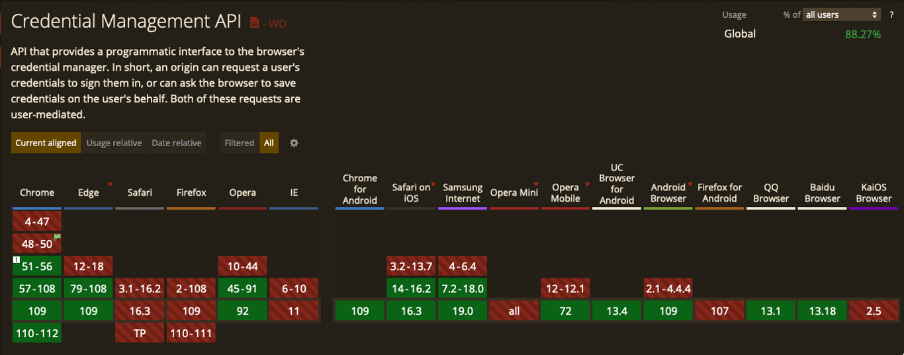
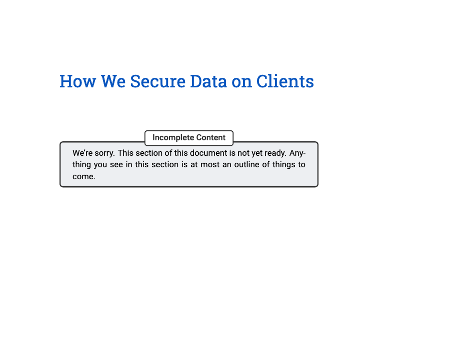
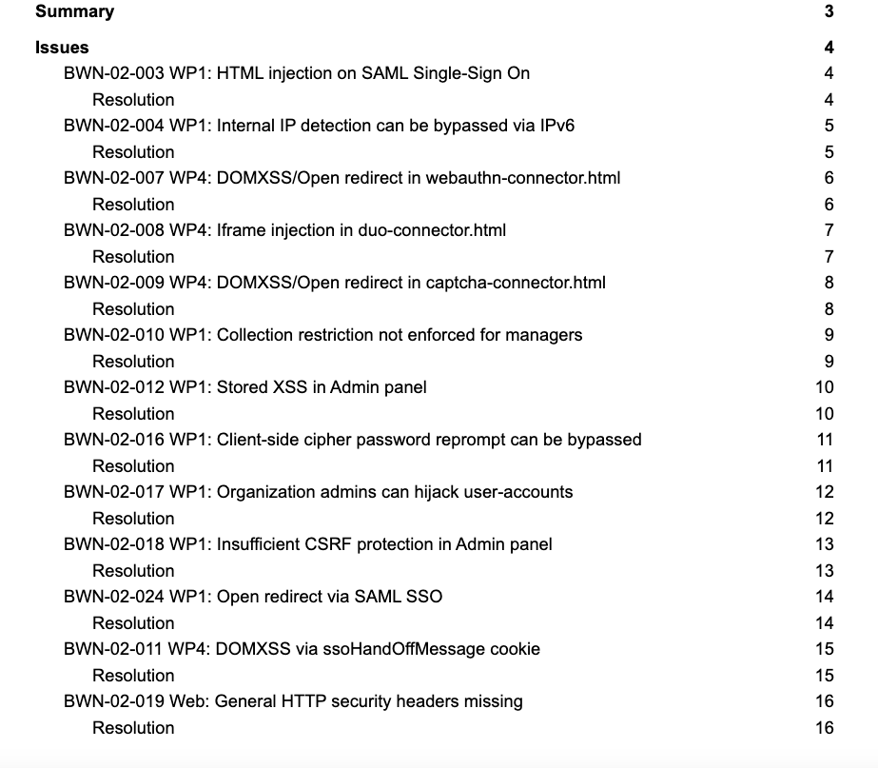
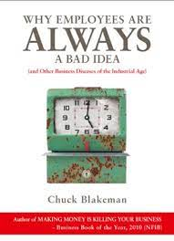

In the light of [GoTo admitting their breach was worse than initially reported](https://www.goto.com/blog/our-response-to-a-recent-security-incident) I have found myself both discussing passwords with people more than ever before and directing a metric ton of business towards 1Password. However, it has raised an obvious question for me: why are users involved with passwords at all? Why is this still something I have to talk to my grandparents about?  
鉴于 GoTo 承认他们的违规行为比最初报道的更严重，我发现自己比以往任何时候都更频繁地与人讨论密码，并将大量业务引向 1Password。然而，它向我提出了一个明显的问题：为什么用户会涉及到密码？为什么这仍然是我必须和祖父母谈论的事情？


Let us discuss your password storage system again  
让我们再次讨论您的密码存储系统

All the major browsers have password managers that sync across devices. These stores are (as far as I can tell) reasonably secure. Access to the device would reveal them, but excluding physical access to an unlocked computer they seem fine. There is a common API, the Credentials Management API [docs here](https://developer.mozilla.org/en-US/docs/Web/API/Credential_Management_API) that allow for a website to query the password store inside of the browser for the login, even allowing for Federated logins or different or same logins for subdomains as part of the spec. This makes for a truly effortless login experience for users without needing them to do anything. These browsers already have syncing with a master password concept across mobile/desktop and can generate passwords upon request.  
所有主要浏览器都有跨设备同步的密码管理器。这些商店（据我所知）相当安全。访问设备会显示它们，但不包括物理访问未锁定的计算机，它们似乎很好。有一个通用的 API，此处的凭据管理 API 文档允许网站查询浏览器内的密码存储以获取登录信息，甚至允许联合登录或子域的不同或相同登录作为规范的一部分。这为用户提供了真正轻松的登录体验，无需他们做任何事情。这些浏览器已经具有跨移动/桌面同步主密码的概念，并且可以根据要求生成密码。

If the browser can: generate a password, store a password, sync a password and return the password when asked, why am I telling people to download another tool that does the exact same thing? A tool made by people who didn't make the browser and most of whom haven't been independently vetted by anybody.  
如果浏览器可以：生成密码、存储密码、同步密码并在询问时返回密码，为什么我要告诉人们下载另一个工具来做完全相同的事情？一个由没有制作浏览器的人制作的工具，其中大部分人都没有经过任何人的独立审查。

### Surely it can't be that easy  
当然不会那么容易

So when doing some searching about the Credentials Management API, one of the sites you run across a lot is this demo site: [https://credential-management-sample.appspot.com/](https://credential-management-sample.appspot.com/). This allows you to register an account, logout and then see the login auto-filled by the browser when you get back to it. The concept seems to work as expected on Chrome.  
因此，在搜索凭证管理 API 时，您经常访问的站点之一是这个演示站点： [https://credential-management-sample.appspot.com/](https://credential-management-sample.appspot.com/) 。这允许您注册一个帐户，注销，然后在您返回时看到浏览器自动填充的登录信息。这个概念似乎在 Chrome 上按预期工作。



Bummer

Alright so it doesn't work on Firefox and Safari but honestly, neither do 10% of the websites I go to. 88% of all the users in the world still isn't bad, so I'm not willing to throw the idea out entirely.  
好吧，它在 Firefox 和 Safari 上不起作用，但老实说，我访问的 10% 的网站都不起作用。世界上 88% 的用户仍然不错，所以我不愿意完全放弃这个想法。

Diving into how the process works, again, it seems pretty straight forward.  
再次深入研究该过程的工作原理，这似乎非常简单。

```
var signin = document.querySelector('#signin');
signin.addEventListener('click', (e) => {
  if (window.PasswordCredential || window.FederatedCredential) {
    navigator.credentials
      .get({
        password: true,
        federated: {
          providers: ['https://accounts.google.com'],
        },
        mediation: 'optional',
      })
      .then((c) => {
        if (c) {
          switch (c.type) {
            case 'password':
              return sendRequest(c);
              break;
            case 'federated':
              return gSignIn(c);
              break;
          }
        } else {
          return Promise.resolve();
        }
      })
      .then((profile) => {
        if (profile) {
          updateUI(profile);
        } else {
          location.href = '/signin';
        }
      })
      .catch((error) => {
        location.href = '/signin';
      });
  }
});
```

If the user has a login then get it. It supports federated logins or passwords and falls back to redirecting to the sign-in page if you cannot locate a login. I tried the samples available [here](https://web.dev/security-credential-management-retrieve-credentials/#auto-sign-in) and they seemed to mostly be plug and play. In fact in my testing this seemed to be a _far superior_ user experience to using traditional password managers with browser extensions.  
如果用户有登录名，则获取它。它支持联合登录名或密码，如果您找不到登录名，则回退到重定向到登录页面。我尝试了此处提供的示例，它们似乎大多是即插即用的。事实上，在我的测试中，这似乎是一种比使用带有浏览器扩展的传统密码管理器更好的用户体验。

Also remember that even for browsers that don't support it, I'm just falling back to the normal password storage system. So for websites that support it, the experience is magical on Chrome and the same as using a password manager with every other browser. It doesn't cost anything, it isn't complicated and it is a better experience.  
还要记住，即使对于不支持它的浏览器，我也只是退回到普通的密码存储系统。因此，对于支持它的网站，在 Chrome 上的体验是神奇的，就像在所有其他浏览器上使用密码管理器一样。它不需要任何费用，它并不复杂，而且它是一种更好的体验。


I know someone out there is gearing up   
我知道外面有人在准备

### Are Password Managers Better? 密码管理器更好吗？

One common theme when you search for this stuff is an often repeated opinion that browser password managers are trash and password managers are better. Looking more into how they work, this seems to come with some pretty big asterisks. Most password managers seem to use some JavaScript from their CDN to insert their interface into the form values.  
当你搜索这些东西时，一个常见的主题是一种经常重复的观点，即浏览器密码管理器是垃圾，而密码管理器更好。仔细研究它们的工作原理，这似乎带有一些相当大的星号。大多数密码管理器似乎使用来自其 CDN 的一些 JavaScript 将其界面插入到表单值中。

This is a little nerve-racking because websites could interact with that element but also the communication between the password manager is a potential source of problems. Communication to a local HTTP target seems to make sense, but this can be the source of problems (and has been in the past). [Example](https://lists.gnu.org/archive/html/guile-user/2016-10/msg00007.html) [Example](https://bugs.chromium.org/p/project-zero/issues/detail?id=773) [Example](https://bugs.chromium.org/p/project-zero/issues/detail?id=693)  
这有点伤脑筋，因为网站可以与该元素进行交互，而且密码管理器之间的通信也是潜在的问题来源。与本地 HTTP 目标的通信似乎很有意义，但这可能是问题的根源（过去一直如此）。示例示例示例

So at a minimum you'd need the tool you chose to meet these requirements to reach or exceed the same level of security as the browser built-in manager.  
因此，至少您需要您选择的工具来满足这些要求，以达到或超过与浏览器内置管理器相同的安全级别。

-   The add-on runs in a sandboxed background page  
    该加载项在沙盒后台页面中运行
-   Communication between the password manager and the page isn't happening in the DOM  
    DOM 中没有发生密码管理器和页面之间的通信
-   Any password element would need to be an iframe or something else that stops the site from interacting with the content  
    任何密码元素都需要是 iframe 或其他阻止网站与内容交互的元素
-   CSP is set up flawlessly  CSP 设置完美
-   Communication between the extension and anything outside of the extension is secure and involves some verification step  
    扩展和扩展之外的任何东西之间的通信是安全的，并且涉及一些验证步骤
-   Code validation in pretty much every direction: is the browser non-modified, is the server process valid, is the extension good, etc  
    几乎每个方向的代码验证：浏览器是否未修改，服务器进程是否有效，扩展是否良好等

This isn't even getting to the actual meat of the encryption on the secrets or the security of the syncing. We're just talking about whether the thing that interacts with the secrets and jams them into the page.  
这甚至没有涉及秘密加密或同步安全性的实际内容。我们只是在谈论是否与秘密交互并将它们塞进页面的东西。

To make a product that does this and does it well and consistently across releases isn't an easy problem. Monitoring for regressions and breaches would be critical, disclosures would be super important to end users and you would need to get your stack vetted by an outside firm kind of a lot. I trust the developers of my web browser in part because I have to and because, over the years, Mozilla has been pretty good to me. The entire browser stack is under constant attack because it has effectively become the new OS we all run.  
制作一款能够做到这一点并且在各个版本中都表现出色且始终如一的产品并不是一个容易的问题。监控回归和违规是至关重要的，披露对最终用户来说非常重要，你需要让你的堆栈得到外部公司的大量审查。我信任我的 Web 浏览器的开发人员，部分原因是我必须这样做，而且多年来，Mozilla 对我来说一直很好。整个浏览器堆栈不断受到攻击，因为它实际上已经成为我们所有人运行的新操作系统。

### Well these companies are really good at all that  
那么这些公司真的很擅长

Are they? Frankly in my research I wasn't really blown away with the amount of technical auditing most of these companies seem to do or produce any evidence of. The only exception to this was 1Password and Bitwarden.  
他们是吗？坦率地说，在我的研究中，我并没有真正被大多数这些公司似乎在做或产生任何证据的技术审计数量所震撼。唯一的例外是 1Password 和 Bitwarden。

**1Password 1密码**

I love that they have a whitepaper [available here](https://1passwordstatic.com/files/security/1password-white-paper.pdf) but nobody finished writing it.  
我喜欢他们在这里提供白皮书，但没有人完成它。



No rush I guess 我猜不着急

However they do have actual independent audits of their software. Recent audits done by reputable firms and available for review. [You can see all these here.](https://support.1password.com/security-assessments/) For the record this should be on every single one of these companies website for public review.  
但是，他们确实对其软件进行了实际的独立审核。最近由知名公司完成的审计可供审查。你可以在这里看到所有这些。作为记录，这应该出现在这些公司的每一个网站上以供公众审查。

**Keeper Password Manager Keeper 密码管理器**

I found what they call a whitepaper but it's 17 pages and basically says "We're ISO certified". That's great I guess, but not the level of detail I would expect at all. [You can read it here.](https://www.google.com/url?sa=t&rct=j&q=&esrc=s&source=web&cd=&cad=rja&uact=8&ved=2ahUKEwiz2M6Rq-X8AhXyiv0HHT40DiIQFnoECA0QAQ&url=https%3A%2F%2Fwww.keepersecurity.com%2Fassets%2Fpdf%2FKeeper-Managed-Service-Provider-Tech-WhitePaper.pdf&usg=AOvVaw1S5SM7bmNM4EqTYQfDPqaR) This doesn't mean you are doing things correctly, just that you have generated enough documentation to get ISO certified.  
我找到了他们所谓的白皮书，但它有 17 页，基本上说“我们已通过 ISO 认证”。我想这很好，但根本不是我期望的详细程度。你可以在这里阅读它。这并不意味着您做事正确，只是您生成了足够的文档来获得 ISO 认证。

```
Not only do we implement the most secure levels of encryption, we also adhere to very strict internal
practices that are continually audited by third parties to help ensure that we continue to develop secure software and
provide the world’s most secure cybersecurity platform.
```

Great, can I read these audits?  
太好了，我可以阅读这些审核吗？

**Dropbox Password 保管箱密码**

Nothing seems to exist discussing this products technical merits at all. I don't know how it works. I can look into it more if someone can point me to something else, but it seems to be an encrypted file that lives in your Dropbox folder secured with a key generated by Dropbox and returned to you upon enrollment.    
似乎根本不存在讨论该产品技术优点的内容。我不知道它是如何工作的。如果有人可以指出其他内容，我可以对其进行更多研究，但它似乎是一个加密文件，存在于您的 Dropbox 文件夹中，使用 Dropbox 生成的密钥保护并在注册时返回给您。

**Dashlane 达什兰**

I found a great security assessment from 2016 that seemed to suggest the service was doing pretty well. [You can get that here.](https://courses.csail.mit.edu/6.857/2016/files/25.pdf) I wasn't able to find one more recent. Reading their whitepaper [here](https://media.graphassets.com/LF2ZSzLAQc2FdatvYlgV) they actually do go into a lot of detail and explain more about how the service works, which is great and I commend them for that.  
我发现了 2016 年的一个很好的安全评估，似乎表明该服务做得很好。你可以在这里得到它。我没能找到一个最近的。在这里阅读他们的白皮书，他们实际上确实进入了很多细节并解释了更多关于服务如何工作的信息，这很棒，我为此赞扬他们。

It's not sufficient though. I'm glad you understand how the process should work but I have no idea if that is still happening or if this is more of an aspirational document. I often understand the _ideal_ way software should work but the real skill of the thing is getting it to work that way.  
但这还不够。很高兴您了解该流程应该如何运作，但我不知道这种情况是否仍在发生，或者这是否更像是一份有抱负的文件。我经常理解软件应该以理想的方式工作，但真正的技能是让它以这种方式工作。

**Bitwarden 比特沃登**

They absolutely kill it in this department. [Everything about them is out in the open like it should be.](https://bitwarden.com/help/is-bitwarden-audited/) However sometimes they discover issues, which is good for the project but underscores what I was talking about above. It is hard to write a service that attempts to handle your most sensitive data and inject that data into random websites.  
他们在这个部门绝对杀了它。关于他们的一切都应该是公开的。然而，有时他们会发现问题，这对项目有利，但强调了我上面所说的内容。很难编写试图处理您最敏感的数据并将该数据注入随机网站的服务。



These products introduce a lot of complexity and failure points into the secret management game. All of them with the exception of 1Password seem to _really_ bet the farm on the solo Master/Primary Password concept. This is great if your user picks a good password, but statistically this idea seems super flawed to me. This is a password they're going to enter all the time, won't they pick a crap one? Even with 100,000 iterations on that password it's pretty dangerous.  
这些产品给秘密管理游戏带来了很多复杂性和失败点。除了 1Password 之外，所有这些似乎都把整个农场押在了单独的主密码概念上。如果您的用户选择了一个好的密码，那就太好了，但从统计学上讲，这个想法对我来说似乎是超级有缺陷的。这是他们要一直输入的密码，他们不会选一个垃圾密码吗？即使对该密码进行 100,000 次迭代也是非常危险的。

Plus if you are going to rely on the concept of "well if the Master/Primary Password is good then the account is secure" then we're certainly not justifying the extra work here. It's as good as the Firefox password manager and not as good as the Safari password manager. Download Firefox and set a good Primary Password.  
另外，如果您要依赖“好吧，如果主密码/主密码很好，那么帐户就是安全的”这一概念，那么我们当然不会证明这里的额外工作是合理的。它与 Firefox 密码管理器一样好，但不如 Safari 密码管理器。下载 Firefox 并设置一个好的主密码。

### Can we be honest with each other?  
我们可以坦诚相待吗？

I want you to go to [this website](https://lowe.github.io/tryzxcvbn/) and I want you to type in your parents password. You know the one, the one they use for everything? The one that's been shouted through the halls and texted/emailed/written on so many post-it notes that any concept of security has long since left the building.  
我要你去这个网站，我要你输入你父母的密码。你知道那个，他们用来做所有事情的那个吗？那个在大厅里大喊大叫、发短信/发电子邮件/写在这么多便利贴上的人，以至于任何安全概念早已离开大楼。

That's the password they're gonna use to secure the vault. They shouldn't, but they're gonna. Now I want you to continue on this trust exercise with me. If someone got access to read/write in a random cross-section of your coworkers computers, are _passwords_ really the thing that is gonna destroy your life? Not an errant PDF, Excel document of customer data or unsecured AWS API key?  
那是他们用来保护保险库的密码。他们不应该，但他们会。现在我希望你和我一起继续这个信任练习。如果有人可以在您同事计算机的随机横截面上进行读/写访问，那么密码真的会毁掉您的生活吗？不是错误的 PDF、客户数据的 Excel 文档或不安全的 AWS API 密钥？

I get it, security stuff is fun to read. "How many super computers will it take to break in" feels very sci-fi.  
我明白了，安全的东西读起来很有趣。 “需要多少台超级计算机才能闯入”感觉很科幻。

I'm not saying there is zero value to a product where there is a concept of sharing and organizing passwords with a nice UI, but there's also no default universal way of doing it. If all the password managers made a spec that they held to that allowed for secure bidirectional sharing between these services, I'd say "yeah the cost/benefit is likely worth it". However chances are if we're in a rush and sharing passwords, I'm going to send you the password through an insecure system anyway.  
我并不是说一个产品的价值为零，因为它有一个漂亮的 UI 共享和组织密码的概念，但也没有默认的通用方式来做这件事。如果所有密码管理器都制定了他们坚持的规范，允许在这些服务之间进行安全的双向共享，我会说“是的，成本/收益可能是值得的”。但是，如果我们匆忙分享密码，我可能会通过不安全的系统向您发送密码。

Plus the concept of sharing introduces ANOTHER huge layer of possible problems. Permission mistakes, associating the secret with the wrong user, the user copying the secret into their personal vault and not getting updated when the shared secret is updated are all weird issues I've seen at workplaces. To add insult to injury, the requirements of getting someone added to a shared folder they need is often so time-consuming people will just bypass the process and copy/paste the secret anyway.  
此外，共享的概念引入了另一层可能出现的巨大问题。权限错误、将秘密与错误的用户相关联、用户将秘密复制到他们的个人保险库中并且在更新共享秘密时没有得到更新，这些都是我在工作场所看到的奇怪问题。雪上加霜的是，将某人添加到他们需要的共享文件夹的要求通常非常耗时，人们只会绕过该过程并复制/粘贴秘密。

Also let's be honest among ourselves here. Creating one shared login for a bunch of employees to use _was always a bad idea_. We all knew it was a bad idea and you knew it while you were doing it. Somewhere in the back of your mind you were like "boy it'll suck if someone decides to quit and steals these".  
也让我们在这里坦诚相见。为一群员工创建一个共享登录名总是一个坏主意。我们都知道这是个坏主意，你在做的时候就知道了。在你脑海深处的某个地方，你就像“男孩，如果有人决定退出并偷走这些东西，它会很糟糕”。



I think we can all agree on this  
我想我们都同意这一点

I know, "users will do it anyway". Sure but you don't have to make it institutional policy. The argument of "well users are gonna share passwords so we should pay a service to allow them to do it easier" doesn't make a lot of sense. I also know sometimes you can't avoid it, but for those values, if they're that sensitive, it might not make sense to share them across all employees in a department. Might make more sense to set them up with a local tool like `pass`.  
我知道，“无论如何用户都会这样做”。当然可以，但您不必将其作为制度政策。 “好吧，用户会共享密码，所以我们应该付费让他们更轻松地做到这一点”的论点没有多大意义。我也知道有时候你无法避免它，但对于那些价值观，如果它们如此敏感，那么在一个部门的所有员工中分享它们可能没有意义。使用像 `pass` 这样的本地工具来设置它们可能更有意义。

### Browsers don't prompt the user to make a Master/Primary Password  
浏览器不会提示用户输入主密码

That is true and perhaps the biggest point in the category of "you should use a password manager". The way the different browsers do this is weird. Chrome effectively uses the users login as the key, on Windows calling a Windows API that encrypts the sqlite database and decrypts it when the user logs in. On the Mac there is a login keychain entry of a random value that seems to serve the same function. If the user is logged in, the sqlite database is accessible. If they aren't, it isn't.  
这是真的，也许是“您应该使用密码管理器”类别中最重要的一点。不同浏览器执行此操作的方式很奇怪。 Chrome 有效地使用用户登录作为密钥，在 Windows 上调用 Windows API，该 API 加密 sqlite 数据库并在用户登录时对其进行解密。在 Mac 上，有一个随机值的登录钥匙串条目似乎具有相同的功能.如果用户已登录，则可以访问 sqlite 数据库。如果不是，那就不是。

On Firefox there is a Primary Password that you can set that effectively works like most of the password managers that we saw. Unlike password managers this isn't synced, so you would set a different primary for every Firefox device. That means the Firefox account is still controlling what syncs to what, this just ensures that a user who takes the database of username and passwords would need this key to decrypt it.  
在 Firefox 上，您可以设置一个主密码，它可以像我们看到的大多数密码管理器一样有效地工作。与密码管理器不同，它不会同步，因此您可以为每个 Firefox 设备设置不同的主密码。这意味着 Firefox 帐户仍然控制着什么同步到什么，这只是确保获取用户名和密码数据库的用户需要这个密钥来解密它。

So for Chrome if your user is logged in, the entire password database is available. On macOS they can get access to the decryption key through the login keychain and on Firefox the value is encrypted in the file but for additional security and disallowing for random users to interact with it through the browser. [There is a great write-up of how local browser password stores work here.](https://apr4h.github.io/2019-12-20-Harvesting-Browser-Credentials/)  
因此，对于 Chrome，如果您的用户已登录，则整个密码数据库都可用。在 macOS 上，他们可以通过登录钥匙串访问解密密钥，而在 Firefox 上，该值在文件中加密，但为了提高安全性并不允许随机用户通过浏览器与之交互。这里有一篇关于本地浏览器密码存储如何工作的精彩文章。


There are more steps than Chrome but allows for a Master Password  
与 Chrome 相比，步骤更多，但允许使用主密码

### Is that a sufficient level of security?  
这是足够的安全级别吗？

Honestly? Yeah I think so. The browser prompts the user to generate a secure value, stores the value, syncs the value securely and then, for 88% of the users on the web, the site can use a well-documented API to automatically fill in that value in the future. I'd love to see Chrome add a few more security levels, some concept of Primary Password so that I can lock the local password storage to something that isn't just me being logged into my user account.  
诚实地？是的，我想是的。浏览器提示用户生成一个安全值，存储该值，安全地同步该值，然后，对于 88% 的网络用户，该站点可以使用记录良好的 API 来自动填充该值.我希望看到 Chrome 添加更多的安全级别，主密码的一些概念，这样我就可以将本地密码存储锁定到不仅仅是我登录到我的用户帐户的东西。

However we're also rapidly reaching a point where the common wisdom is that everything important needs 2FA. So if we're already going to treat the password as a tiered approach, I think a pretty good argument could be made that it is safer for a user to store their passwords in the browser store (understanding that the password was always something that a malicious actor with access to their user account could grab through keyloggers/clipboard theft/etc) and having a 2FA on a phone as compared to what a lot of people do, which is keep the 2FA and the password inside of the same third-party password manager.  
然而，我们也正在迅速达到一个常识，即一切重要的事情都需要 2FA。因此，如果我们已经打算将密码作为一种分层方法来处理，我认为可以提出一个很好的论据，即用户将他们的密码存储在浏览器存储中更安全（理解密码始终是一个可以访问其用户帐户的恶意行为者可以通过键盘记录器/剪贴板盗窃等获取）并在手机上安装 2FA，而许多人所做的是将 2FA 和密码保存在同一第三方中密码管理器。

### TOTPs are just password x2 TOTP 只是密码 x2

When you scan that QR code, you are getting back a string that looks something like this:  
当您扫描该 QR 码时，您将返回一个看起来像这样的字符串：

`otpauth://totp/example:me@gmail.com?algorithm=SHA1&digits=6&issuer=mywebsite&period=30&secret=CelwNEjn3l7SWIW5SCJT`

This combined with time gets you your 6 digit code. The value of this approach is twofold: does the user posses another source of authentication and now there is a secret which we _know_ is randomly generated that effectively serves as a second password. This secret isn't exposed to normal users as a string, so we don't need to worry about that.  
这与时间相结合，为您提供 6 位代码。这种方法的价值是双重的：用户是否拥有另一个身份验证来源，现在有一个我们知道随机生成的秘密，可以有效地用作第二个密码。这个秘密不会以字符串的形式暴露给普通用户，所以我们不必担心。

If I have the secret value I can make the same code. If we remove the second device component like we do with password managers, what we're saying is "TOTP is just another random password". If we had a truly random password to begin with, I'm not adding much to the security model by adding in the 2FA but sticking it in the same place.  
如果我有秘密值，我可以制作相同的代码。如果我们像删除密码管理器一样删除第二个设备组件，我们所说的就是“TOTP 只是另一个随机密码”。如果我们有一个真正随机的密码开始，我不会通过添加 2FA 来增加安全模型，而是将其粘贴在同一个地方。

### What if they break into my phone  
如果他们闯入我的手机怎么办

On iOS even without a Primary password set on Firefox, it prompts for FaceID authentication before allowing someone access to the list of stored passwords. So that's already a _pretty intense_ level of security. Add in a Primary password and we've reached the same level of security as 1Password. Chrome is the same story.  
在 iOS 上，即使没有在 Firefox 上设置主密码，它也会在允许某人访问存储的密码列表之前提示进行 FaceID 身份验证。所以这已经是一个相当高的安全级别。添加一个主密码，我们就达到了与 1Password 相同的安全级别。 Chrome 也是同样的故事。

It's the same level of security with Android. Attempt to open the saved passwords, get a PIN or biometric check depending on the phone. That's pretty good! Extra worried about it? Use a TOTP app that requires biometrics before they reveal that code. [Here is one for iOS](https://apps.apple.com/us/app/2fa-authenticator-2fas/id1217793794)  
它与 Android 具有相同的安全级别。尝试打开保存的密码，根据手机获取 PIN 码或生物特征检查。那很好！额外担心吗？使用需要生物特征识别的 TOTP 应用程序才能显示该代码。这是一个适用于 iOS 的

Even if someone steals your phone and attempts to break into your accounts, there are some non-trivial security measures in their way with the standard browser password storage combined with a free TOTP app that checks identity.  
即使有人偷了你的手机并试图闯入你的账户，他们也有一些非常重要的安全措施，包括标准的浏览器密码存储和一个免费的 TOTP 应用程序来检查身份。

### I use my password manager for more than passwords  
我使用我的密码管理器不仅仅是为了密码

Sure and so do I, but that doesn't really matter to my point. The common wisdom that all users would benefit from the use of a dedicated password manager is iffy at best. We've now seen a commonly recommended one become so catastrophically breached that anything stored there is now needs to be considered leaked. This isn't the first credential leak or the 10th or the 100th, but now there is just a constant never-ending parade of password leaks and cracks.  
当然，我也是，但这对我来说并不重要。所有用户都将从使用专用密码管理器中受益的常识充其量是不确定的。我们现在已经看到一个通常被推荐的一个被破坏得如此严重，以至于现在存储在那里的任何东西都需要被认为是泄漏的。这不是第一次凭证泄露，也不是第 10 次或第 100 次，但现在只是不断出现永无止境的密码泄露和破解游行。

So if that is true and a single password cannot ever truly serve as the single step of authentication for important resources, then we're always going to be relying on adding on another factor. Therefore the value a normal user gets out of a password manager vs the browser they're already using is minimal. With passkeys and Credentials Management API the era of exposing the user to the actual values being used in the authentication step is coming to a close anyway. Keys synced by the browser vendor will become the default authentication step for users.  
因此，如果这是真的，并且单个密码不能真正用作重要资源的单一验证步骤，那么我们将始终依赖于添加另一个因素。因此，普通用户从密码管理器中获得的价值与他们已经使用的浏览器相比是微乎其微的。无论如何，使用密钥和凭据管理 API 向用户公开身份验证步骤中使用的实际值的时代即将结束。浏览器供应商同步的密钥将成为用户的默认身份验证步骤。

In the light of that reality, it doesn't really make sense to bother users with the additional work and hassle of running a new program to manage secrets.  
鉴于这一现实，用额外的工作和运行新程序来管理机密的麻烦来打扰用户是没有意义的。

### Summary of my rant 我的吐槽总结

-   Normal users don't need to worry about password managers and would be better served by using the passwords the browser generates and investing that effort into adding 2FA using a code app on their phone or a YubiKey.  
    普通用户无需担心密码管理器，使用浏览器生成的密码并使用手机上的代码应用程序或 YubiKey 投入精力添加 2FA 会更好。
-   In the face of new APIs and standards, the process of attempting to manage secrets with an external manager will becoming exceedingly challenging. It is going to be much much easier to pick one browser and commit to it everywhere vs attempting to use a tool to inject all these secrets  
    面对新的 API 和标准，尝试使用外部管理器管理机密的过程将变得极具挑战性。与尝试使用工具注入所有这些秘密相比，选择一个浏览器并在任何地方都使用它要容易得多
-   With the frequency of breaches we've already accepted that passwords at, at best, part of a complete auth story. The best solution we have right now is "2 passwords".  
    随着泄露事件的频繁发生，我们已经接受了密码充其量只是完整身份验证故事的一部分。我们现在拥有的最佳解决方案是“2 个密码”。
-   Many of the tools users rely on to manage all their secrets aren't frequently audited or if they are, any security assessment of their stack isn't being published.  
    用户用来管理其所有机密的许多工具并不经常被审计，或者即使被审计，也不会发布对其堆栈的任何安全评估。
-   For more technical users looking to store a lot of secrets for work, using something like `pass` will likely fulfill that need with a smaller less complicated and error-prone technical implementation. It does less so less stuff can fail.  
    对于希望存储大量工作机密的更多技术用户，使用 `pass` 之类的东西可能会通过更小、更简单、更容易出错的技术实现来满足这一需求。它做的更少，所以更少的东西会失败。
-   If you are going to use a password manager, there are only two options: 1Password and Bitwarden. 1Password is the only one that doesn't rely exclusively on the user-supplied password, so if you are dealing with very important secrets this is the right option.  
    如果你打算使用密码管理器，只有两个选项：1Password 和 Bitwarden。 1Password 是唯一一款不完全依赖于用户提供的密码的产品，因此如果您要处理非常重要的秘密，这是正确的选择。
-   It is better to tell users "shared credentials are terrible and please only use them if you absolutely have no choice at all" than to set up a giant business-wide tool of shared credentials which are never rotated.  
    最好告诉用户“共享凭据很糟糕，请仅在您完全没有选择的情况下才使用它们”，而不是设置一个从不轮换的巨大的企业级共享凭据工具。

My hope is with passkeys and the Credentials Management API this isn't a forever problem. Users won't be able to export private keys, so nobody is going to be sharing accounts. The Credentials Management UI and flow is so easy for developers and users that it becomes the obvious choice for any new service. My suspicion is we'll still be telling users to set up 2FA well after its practical lifespan has ended, but all we're doing is replicating the same flow as the browser password storage.  
我希望通过密钥和凭据管理 API 这不是一个永远的问题。用户将无法导出私钥，因此没有人会共享帐户。凭据管理 UI 和流程对于开发人员和用户来说非常简单，因此它成为任何新服务的不二之选。我怀疑我们仍然会告诉用户在 2FA 的实际生命周期结束后很好地设置它，但我们所做的只是复制与浏览器密码存储相同的流程。

Like it or not you are gonna start to rely on the browser password manager a lot soon, so might as well get started now.  
不管你喜不喜欢，你很快就会开始依赖浏览器密码管理器，所以不妨现在就开始吧。

Wanna send me angry messages? What else is the internet good for! [https://c.im/@matdevdug](https://c.im/@matdevdug)  
想给我发愤怒的信息吗？互联网还有什么用！ [https://c.im/@matdevdug](https://c.im/@matdevdug)
