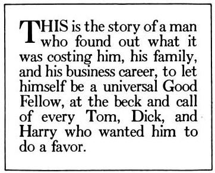
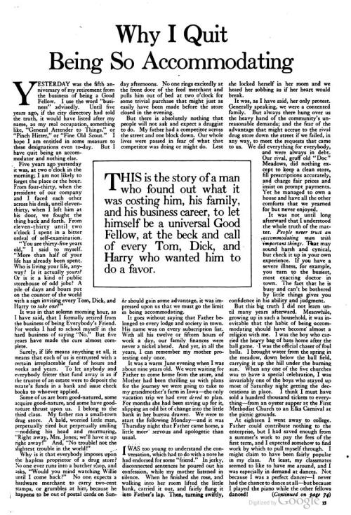
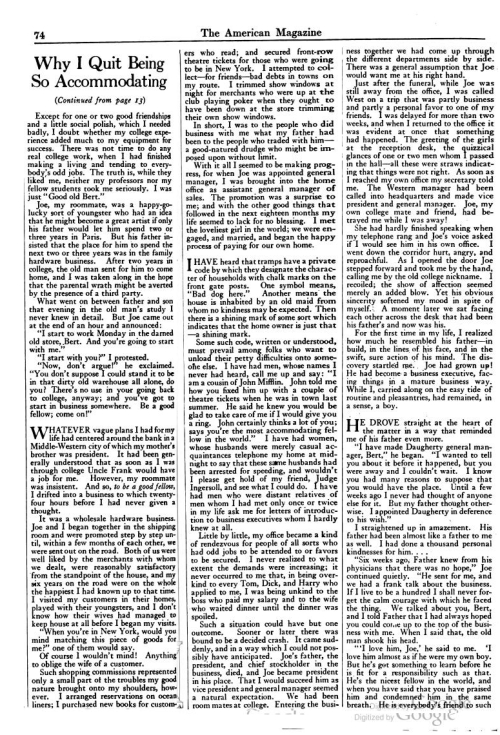
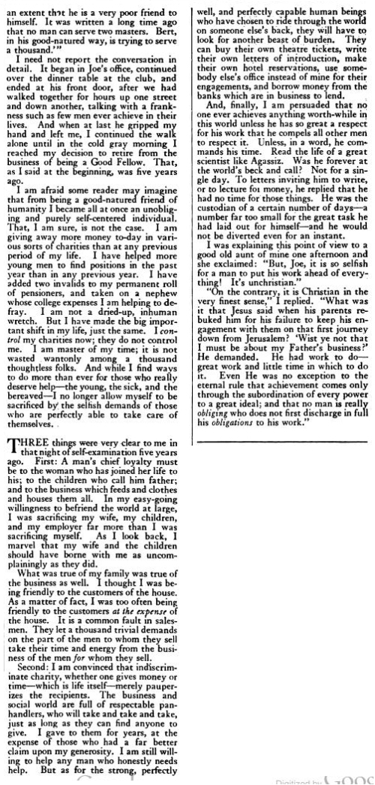

_**Update:**_ See [this post](https://mikecanex.wordpress.com/2012/12/27/an-experiment-in-epub-ebooks/) for a free ePub eBook version of this long post.  
更新：请参阅这篇文章，获取这篇长文章的免费 ePub 电子书版本。

A very odd essay from [a 1922 issue](http://books.google.com/books?id=kstZAAAAYAAJ&pg=RA3-PA13#v=onepage&q&f=false) of _The American Magazine_ that seems to go against the general grain of most of the articles published then. There is also no name attached to it.  
美国杂志 1922 年一期的一篇非常奇怪的文章，似乎与当时发表的大多数文章的大体背道而驰。它也没有附加名称。

**Why I Quit Being So Accommodating  
为什么我不再那么随和**

Yesterday was the fifth anniversary of my retirement from the business of being a Good Fellow. I use the word “business” advisedly. Until five years ago, if the city directory had told the truth, it would have listed after my name, as my real occupation, something like, “General Attender to Things,” or “Pinch Hitter,” or “Fine Old Scout.” I hope I am entitled in some measure to these designations even to-day. But I have quit being an accommodator and nothing else.  
昨天是我从好伙伴的行业退休五周年。我谨慎地使用“商业”这个词。直到五年前，如果市名录说的是真的，它会在我的名字后面列出我的真实职业，例如“事物总管”或“捏击手”或“优秀的老侦察员”。我希望即使在今天，我在某种程度上也有权获得这些称号。但我已经不再做一个住宿者，别无其他。

Five years ago yesterday it was, at two o’clock in the morning; I am not likely to forget the place or the hour. From four-thirty, when the president of our company and I faced each other across his desk, until eleven-thirty, when I left him at his door, we fought the thing back and forth. From eleven-thirty until two o’clock I spent in a bitter ordeal of self-examination.  
五年前的昨天，凌晨两点；我不太可能忘记地点或时间。从四点三十分开始，我和公司总裁隔着他的办公桌面对面，一直到十一点三十分，我把他留在门口，我们一直在和那个东西打来打去。从十一点三十分到两点钟，我在痛苦的自我反省中度过。

“You are thirty-five years old,” I said to myself. “More than half of your life has already been spent. Who is living your life, anyway? Is it actually _yours?_ Or is it a kind of public storehouse of odd jobs? A pile of days and hours put on the counter of the world with a sign inviting every Tom, Dick, and Harry to _take one?”_  
“你三十五岁了，”我对自己说。 “你的生命已经度过了大半。无论如何，谁在过你的生活？它真的是你的吗？或者它是一种零工的公共仓库？一堆日子和时间放在世界的柜台上，上面有一个标志，邀请每个汤姆、迪克和哈利都拿走一个？”

It was in that solemn morning hour, as I have said, that I formally retired from the business of being Everybody’s Friend. For weeks I had to school myself in the hard business of saying “No.” But five years have made the cure almost complete.  
正是在那个庄严的早晨，正如我所说，我正式从做每个人的朋友的工作中退休了。几个星期以来，我不得不自学说“不”。但是五年已经使治愈几近完成。

Surely, if life means anything at all, it means that each of us is entrusted with a certain irreplaceable fund of hours and weeks and years. To let anybody and everybody fritter that fund away is as if the trustee of an estate were to deposit the estate’s funds in a bank and issue check books to whoever applied.  
当然，如果生命有任何意义的话，那就是我们每个人都被托付了一定的不可替代的资金来支配数小时、数周和数年。让任何人和每个人挥霍这笔资金，就好像遗产的受托人将遗产的资金存入银行，然后向申请者发放支票簿。

Some of us are born good-natured, some acquire good-nature, and some have good-nature thrust upon us. I belong to the third class. My father ran a small-town drug store. A bald, worried little man, perpetually tired but perpetually smiling — nodding his head and murmuring, “Right away, Mrs. Jones; we’ll have it up right away!’ And, “No trouble! not the slightest trouble in the world!”  
我们中有些人天生好脾气，有些人天生好脾气，有些人天生好脾气。我属于第三类。我父亲经营着一家小镇药店。一个秃头、忧心忡忡的小个子男人，永远疲倦，但永远微笑——点点头，低声说：“马上，琼斯夫人；我们马上就搞定！”而且，“没问题！世界上没有半点麻烦！

Why is it that everybody imposes upon the hapless proprietor of a drug store? No one ever runs into a butcher shop, and asks, “Would you mind watching Willie until I come back?” No one, expects a hardware merchant to carry two-cent stamps, or grumbles at him, because he happens to be out of postal cards on Sunday afternoons. No one rings excitedly at the front door of the feed merchant and pulls him out of bed at two o’clock for some trivial purchase that might just as easily have been made before the store closed in the evening.  
为什么每个人都强加给倒霉的药店老板？从来没有人跑进一家肉店问：“在我回来之前，你介意看着威利吗？”没有人期望五金商会携带两美分的邮票，或者抱怨他，因为他恰好在星期天下午没有明信片。没有人会兴奋地按响饲料商的前门，并在两点钟把他从床上拉起来购买一些微不足道的东西，而这些东西可能很容易在晚上商店关门前完成。

But there is absolutely nothing that people will not ask and expect a druggist to do. My father had a competitor across the street and one block down. Our whole lives were passed in fear of what that competitor was doing or might do. Lest _he_ should gain some advantage, it was impressed upon us that we must go the limit in being accommodating.  
但绝对没有什么是人们不会要求和期望药剂师做的。我父亲在街对面和一个街区外有一个竞争对手。我们的一生都在对竞争对手正在做或可能会做的事情的恐惧中度过。唯恐他占了便宜，我们不得不竭尽全力地迁就他人。

It goes without saying that Father belonged to every lodge and society in town. His name was on every subscription list. With all his twelve or fifteen hours of work a day, our family finances were never a nickel ahead. And yet, in all the years, I can remember my mother protesting only once.  
不用说，父亲属于镇上的每个分会和社团。他的名字出现在每一份订阅名单上。他每天工作十二或十五个小时，我们的家庭经济从来没有领先。然而，这么多年了，我只记得母亲抗议过一次。

It was a warm June evening when I was about nine years old. We were waiting for Father to come home from the store, and Mother had been thrilling us with plans for the journey we were going to take to my grandmother’s farm in Iowa — the only vacation trip we had ever _dared_ to plan. For months she had been saving up for it, slipping an odd bit of change into the little bank in her bureau drawer. We were to start the following Monday — and it was Thursday night that Father came home, a little more nervous and apologetic than usual.  
那是我九岁左右的一个温暖的六月傍晚。我们在等父亲从商店回家，母亲一直在为我们准备去我祖母在爱荷华州的农场的旅行计划而兴奋不已——这是我们唯一敢于计划的假期旅行。几个月来，她一直在为此存钱，在她写字台抽屉里的小银行里塞了一点零钱。我们要在下一个星期一开始——父亲是星期四晚上回家的，他比平时更紧张、更抱歉。

I was too young to understand the conversation, which had to do with a note he had endorsed for some “friend.” In jerky, disconnected sentences he poured out his confession, while my mother listened in silence. When he finished she rose, and walking into her room lifted the little bank, carried it out, and fairly flung it into Father’s lap. Then, turning swiftly, she locked herself in her room and we heard her sobbing as if her heart would break.  
我当时还太小，听不懂谈话内容，那是关于他为某个“朋友”背书的一张便条。他用生涩、断断续续的句子倾诉了他的忏悔，而我母亲则静静地听着。他说完后，她站起来，走进自己的房间，提起小银行，搬出去，顺手扔到父亲的膝上。然后，她迅速转身，将自己锁在自己的房间里，我们听到她的抽泣声，仿佛她的心都要碎了。

It was, as I have said, her only protest. Generally speaking, we were a contented family. But always there hung over us the heavy hand of the community’s unreasonable demands; and the fear of the advantage that might accrue to the rival drug store down the street if we failed, in any way, to meet the requests that came to us. We did everything for everybody, and were always in debt. Our rival, gruff old “Doc” Meadows, did nothing except to keep a clean store, fill prescriptions accurately, and charge fair prices and insist on prompt payments. Yet he managed to own a house and have all the other comforts that we yearned for but never enjoyed.  
正如我所说，这是她唯一的抗议。总的来说，我们是一个知足的家庭。但社会无理要求的重手始终悬在我们头上；以及担心如果我们未能以任何方式满足我们的要求，街上的竞争对手药店可能会获得优势。我们为每个人做了一切，总是负债累累。我们的竞争对手，粗鲁的老“医生”梅多斯，除了保持店面清洁、准确配药、收取公道价格并坚持及时付款外，什么也没做。然而，他设法拥有了一所房子，并拥有我们渴望但从未享受过的所有其他舒适。

It was not until long afterward that I understood the whole truth of the matter. _People never trust an accommodating man with important things._ That may sound harsh and cynical, but check it up in your own experience. If you have a severe illness, for example, you turn to the busiest, most exacting doctor in town. The fact that he is busy and can’t be bothered by little things gives you confidence in his ability and judgment.  
直到很久以后，我才明白事情的全部真相。人们永远不会把重要的事情托付给一个乐于助人的人。这可能听起来刺耳和愤世嫉俗，但请根据您自己的经验进行检查。例如，如果你得了重病，你会求助于镇上最繁忙、最严格的医生。事实上，他很忙，不会被小事打扰，这让你对他的能力和判断力充满信心。

But this big truth I did not learn until many years afterward. Meanwhile, growing up in such a household, it was inevitable that the habit of being accommodating should have become almost a religion with me. I was the boy who carried the heavy bag of bats home after the ball game. I was the official chaser of foul balls. I brought water from the spring in the meadow, down below the ball field, carrying it up the hill under the burning sun. When any one of the five churches was to have a special celebration, I was invariably one of the boys who stayed up most of Saturday night getting the decorations in place. I think I must have sold a hundred thousand tickets to everything — from an oyster supper at the First Methodist Church to an Elks Carnival at the picnic grounds.  
但这个大道理我是多年后才知道的。与此同时，在这样的家庭中长大，随和的习惯几乎成了我的一种信仰。我就是那个在球赛后把沉重的球棒袋搬回家的男孩。我是界外球的官方追球手。我从草地上的泉水里把水带到球场下面，在烈日下把水带到山上。当五个教堂中的任何一个要举行特别的庆祝活动时，我总是星期六晚上大部分时间熬夜的男孩之一，以安排装饰。我想我一定已经卖掉了十万张门票——从第一卫理公会教堂的牡蛎晚餐到野餐场地的麋鹿狂欢节。

At eighteen I went away to college. Father could contribute nothing to the enterprise, but I had saved enough from a summer’s work to pay the fees of the first term, and I expected somehow to find work by which to pull myself through. I might claim to have been fairly popular in my class. At least, my classmates seemed to like to have me around, and I was especially in demand at dances. Not because I was a perfect dancer — I never had the chance to dance at all — but because I played the piano while the other fellows danced!  
十八岁那年我去了大学。父亲不能为企业贡献任何东西，但我从一个夏天的工作中积蓄了足够的钱来支付第一学期的学费，我希望能找到一份工作来度过难关。我可能会声称在班上很受欢迎。至少，我的同学们似乎喜欢和我在一起，而且我在舞会上尤其受欢迎。不是因为我是一个完美的舞者——我根本没有机会跳舞——而是因为我在弹钢琴，而其他人则在跳舞！

Except for one or two good friendships and a little social polish, which I needed badly, I doubt whether my college experience added much to my equipment for success. There was not time to do any real college work, when I had finished making a living and tending to everybody’s odd jobs. The truth is, while they liked me, neither my professors nor my fellow students took me seriously. I was just “Good old Bert.”  
除了我急需的一两个好朋友和一点社交磨练外，我怀疑我的大学经历是否对我的成功有很大帮助。当我已经谋生并照顾每个人的零工时，没有时间做任何真正的大学工作。事实是，虽然他们喜欢我，但我的教授和同学们都没有认真对待我。我只是“好老伯特”。

Joe, my roommate, was a happy-go-lucky sort of youngster who had an idea that he might become a great artist if only his father would let him spend two or three years in Paris. But his father insisted that the place for him to spend the next two or three years was in the family hardware business. After two years in college, the old man sent for him to come home, and I was taken along in the hope that the parental wrath might be averted by the presence of a third party.  
我的室友乔是一个随遇而安的年轻人，他有一个想法，如果他的父亲让他在巴黎呆上两三年，他可能会成为一名伟大的艺术家。但他的父亲坚持认为，他未来两三年的工作地点是家族的五金企业。上了两年大学，老人叫他回家，我也被带走了，希望有第三者在场，可以平息父母的怒火。

What went on between father and son that evening in the old man’s study I never knew in detail. But Joe came out at the end of an hour and announced:  
父亲和儿子那天晚上在老人的书房里发生了什么，我一直不清楚。但是乔在一个小时结束时出来宣布：

“I start to work Monday in the darned old store, .Bert. And you’re going to start with me.”  
“我周一开始在该死的老店里工作，.Bert。而你将从我开始。”

“I start with you?” I protested.  
“我从你开始？”我抗议。

“Now, don’t argue!” he exclaimed. “You don’t suppose I could stand it to be in that dirty old warehouse all alone, do you? There’s no use in your going back to college, anyway; and you’ve got to start in business somewhere. Be a good fellow; come on!”  
“现在，不要争辩！”他惊呼。 “你以为我一个人呆在那个肮脏的旧仓库里是受不了的，是吗？无论如何，你回到大学是没有用的；你必须在某个地方开始做生意。做一个好人；快点！”

Whatever vague plans I had for my life had centered around the bank in a Middle-Western city of which my mother’s brother was president. It had been generally understood that as soon as I was through college Uncle Frank would have a job for me. However, my roommate was insistent. And so, _to be a good fellow,_ I drifted into a business to which twenty-four hours before I had never given a thought.  
无论我对我的生活有什么模糊的计划，都以我母亲的兄弟担任行长的中西部城市的银行为中心。人们普遍认为，只要我读完大学，弗兰克叔叔就会为我找到一份工作。然而，我的室友很坚持。因此，为了做一个好人，我涉足了 24 小时前我从未想过的行业。

It was a wholesale hardware business. Joe and I began together in the shipping room and were promoted step by step until, within a few months of each other, we were sent out on the road. Both of us were well liked by the merchants with whom we dealt, were reasonably satisfactory from the standpoint of the house, and my six years on the road were on the whole the happiest I had known up to that time. I visited my customers in their homes, played with their youngsters, and I don’t know how their wives had managed to keep house at all before I began my visits.  
这是一家批发硬件公司。乔和我一起从运输室开始，一步步晋升，直到几个月后，我们被派往外地工作。我们俩都深受与我们打交道的商人的喜爱，从房子的角度来看，我还算满意，总的来说，我在路上的六年是迄今为止我所知道的最快乐的时光。我拜访了我的顾客，和他们的孩子一起玩，我不知道在我开始拜访之前，他们的妻子是如何管理家务的。

“When you’re in New York, would you mind matching this piece of goods for me?” one of them would say.  
“你在纽约的时候，介意给我配这件货吗？”其中一位会说。

Of course I wouldn’t mind! Anything to oblige the wife of a customer.  
我当然不会介意！任何有义务的客户的妻子。

Such shopping commissions represented only a small part of the troubles my good nature brought onto my shoulders, however. I arranged reservations on ocean liners; I purchased new books for customers who read; and secured front-row theatre tickets for those who were going to be in New York. I attempted to collect — for friends — bad debts in towns on my route. I trimmed show windows at night for merchants who were up at the club playing poker when they ought to have been down at the store trimming their own show windows.  
然而，这样的购物佣金只是我的好脾气给我带来的麻烦的一小部分。我安排了远洋班轮的预订；我为阅读的客户购买了新书；并为那些要去纽约的人争取到前排剧院的门票。我试图为朋友们收集沿途城镇的坏账。我在晚上为那些本该在商店里修剪自己的橱窗却在俱乐部打牌的商人修剪橱窗。

In short, I was to the people who did business with me what my father had been to the people who traded with him — a good-natured drudge who might be imposed upon without limit.  
简而言之，我之于与我做生意的人就像我父亲之于与他做生意的人——一个可以不受限制地强加于人的善良苦工。

With it all I seemed to be making progress, for when Joe was appointed general manager, I was brought into the home office as assistant general manager of sales. The promotion was a surprise to me; and with the other good things that followed in the next eighteen months my life seemed to lack for no blessing. I met the loveliest girl in the world; we were engaged, and married, and began the happy process of paying for our own home.  
有了这一切，我似乎正在取得进步，因为当乔被任命为总经理时，我被调到总部担任销售助理总经理。晋升令我感到意外。在接下来的 18 个月里，随着其他美好的事情接踵而至，我的生活似乎不乏幸福。我遇到了世界上最可爱的女孩；我们订婚了，结婚了，开始了为自己的房子买单的快乐过程。

I have heard that tramps have a private code by which they designate the character of households with chalk marks on the front gate posts. One symbol means, “Bad dog here.” Another means the house is inhabited by an old maid from whom no kindness may be expected. Then there is a shining mark of some sort which indicates that the home owner is just that — a shining mark.  
我听说流浪汉有一个私人代码，他们用粉笔在前门柱子上标明家庭的特征。一个符号表示“这里有坏狗”。另一种意思是房子里住着一位老处女，她不会对她有好感。然后是某种闪亮的标记，表明房主就是那样——一个闪亮的标记。

Some such code, written or understood, must prevail among folks who want to unload their petty difficulties onto someone else. I have had men, whose names I never had heard, call me up and say: “I am a cousin of John Mifflin. John told me how you fixed him up with a couple of theatre tickets when he was in town last summer. He said he knew you would be glad to take care of me if I would give you a ring. John certainly thinks a lot of you; says you’re the most accommodating fellow in the world.” I have had women, whose husbands were merely casual acquaintances telephone my home at midnight to say that these same husbands had been arrested for speeding, and wouldn’t I please get hold of my friend, Judge Ingersoll, and see what I could do. I have had men who were distant relatives of men whom I had met only once or twice in my life ask me for letters of introduction to business executives whom I hardly knew at all.  
一些这样的代码，无论是书面的还是理解的，必须在那些想把他们的小困难转嫁给别人的人中流行。我有一些我从未听说过他们名字的人给我打电话说：“我是约翰·米夫林的堂兄。约翰告诉我，去年夏天他在城里时，你是如何用几张戏票帮他搞定的。他说他知道如果我给你打个电话，你会很乐意照顾我。约翰当然很看重你；说你是世界上最随和的人。”我有一些女人，她们的丈夫只是偶然相识，半夜打电话给我家，说这些丈夫因超速而被捕，请问我能否联系我的朋友英格索尔法官，看看我能做些什么。我有一些人是我一生中只见过一两次的人的远房亲戚，他们向我索要介绍信给我几乎不认识的企业高管。

Little by little, my office became a kind of rendezvous for people of all sorts who had odd jobs to be attended to or favors to be secured. I never realized to what extent the demands were increasing; it never occurred to me that, in being over-kind to every Tom, Dick, and Harry who applied to me, I was being unkind to the boss who paid my salary and to the wife who waited dinner until the dinner was spoiled.  
渐渐地，我的办公室变成了各种各样的人的聚集地，他们有各种各样的工作要处理，或者要得到好处。我从来没有意识到需求增加到什么程度；我从来没有想过，我对每一个申请我的汤姆、迪克和哈利都过分友善，却对给我发薪水的老板和等着吃晚饭直到晚餐被破坏的妻子不友善。

Such a situation could have but one outcome. Sooner or later there was bound to be a decided crash. It came suddenly, and in a way which I could not possibly have anticipated. Joe’s father, the president, and chief stockholder in the business, died, and Joe became president in his place. That I would succeed him as vice president and general manager seemed a natural expectation. We had been room mates at college. Entering the business together we had come up through the different departments side by side. There was a general assumption that Joe would want me at his right hand.  
这种情况只能有一个结果。迟早会发生决定性的崩溃。它来得很突然，而且是以一种我不可能预料到的方式。乔的父亲，公司的总裁兼首席股东去世，乔接替他成为总裁。我会接替他担任副总裁兼总经理，这似乎是一种自然的期望。我们在大学时曾是室友。一起进入这个行业时，我们并肩经历了不同的部门。人们普遍认为乔希望我在他的右手边。

Just after the funeral, while Joe was still away from the office, I was called West on a trip that was partly business and partly a personal favor to one of my friends. I was delayed for more than two weeks, and when I returned to the office it was evident at once that something had happened. The greeting of the girls at the reception desk, the quizzical glances of one or two men whom I passed in the hall — all these were straws indicating that things were not right. As soon as I reached my own office my secretary told me. The Western manager had been called into headquarters and made vice president and general manager. Joe, my own college mate and friend, had betrayed me while I was away!  
葬礼刚过，乔还没到办公室，我就被叫到韦斯特出差了，这趟旅行一半是出差，一半是为我的一个朋友提供私人恩惠。我被耽搁了两个多星期，当我回到办公室时，很明显发生了什么事。接待处姑娘们的问候，我在大厅里路过的一两个男人疑惑的目光——所有这些都是表明事情不对劲的稻草。我一到自己的办公室，我的秘书就告诉了我。西方经理被召集到总部，担任副总裁兼总经理。乔，我自己的大学同学和朋友，在我离开的时候背叛了我！

She had hardly finished speaking when my telephone rang and Joe’s voice asked if I would see him in his own office. I went down the corridor hurt, angry, and reproachful. As I opened the door Joe stepped forward and took me by the hand, calling me by the old college nickname. I recoiled; the show of affection seemed merely an added blow. Yet his obvious sincerity softened my mood in spite of myself.:. A moment later we sat facing each other across the desk that had been his father’s and now was his.  
她的话还没说完，我的电话就响了，乔的声音问我是否愿意在他自己的办公室见他。我伤心、愤怒和责备地走下走廊。当我打开门时，乔走上前来拉着我的手，叫着我以前的大学绰号。我退缩了；示爱似乎只是额外的打击。然而，他明显的诚意不由自主地软化了我的心情。片刻之后，我们面对面坐在他父亲的桌子对面，那张桌子曾经是他父亲的，现在是他的。

For the first time in my life, I realized how much he resembled his father — in build, in the lines of his face, and in the swift, sure action of his mind. The discovery startled me. Joe had grown up! He had become a business executive, facing things in a mature business way. While I, carried along on the easy tide of routine and pleasantries, had remained, in a sense, a boy.  
我有生以来第一次意识到他与他父亲的相似之处——体格、面部线条以及敏捷、坚定的思维方式。这个发现让我吃惊。乔长大了！他已经成为一名企业高管，以成熟的商业方式处理事情。而我，在例行公事和欢乐的轻松浪潮中，在某种意义上仍然是个男孩。

He drove straight at the heart of the matter in a way that reminded me of his father even more.  
他以一种让我更想起他父亲的方式直奔问题的核心。

“I have made Daugherty general manager, Bert,” he began. “I wanted to tell you about it before it happened, but you were away and I couldn’t wait. I know you had many reasons to suppose that you would have the place. Until a few weeks ago I never had thought of anyone else for it. But my father thought otherwise. I appointed Daugherty in deference to his wish.”  
“我已任命 Daugherty 为总经理 Bert，”他开始说道。 “我想在事情发生之前告诉你，但你不在，我等不及了。我知道你有很多理由认为你会得到那个地方。直到几周前，我还没有想到其他任何人。但我父亲不这么认为。我尊重他的意愿任命了 Daugherty。”

I straightened up in amazement. His father had been almost like a father to me as well. I had done a thousand personal kindnesses for him. . . .  
我惊讶地直起身子。他的父亲对我来说几乎就像父亲一样。我为他做了一千个人的善意。 . . .

“Six weeks ago, Father knew from his physicians that there was no hope,” Joe continued quietly. “He sent for me, and we had a frank talk about the business. If I live to be a hundred I shall never forget the calm courage with which he faced the thing. We talked about you, Bert, and I told Father that I had always hoped you could come up to the top of the business with me. When I said that, the old man shook his head.  
“六个星期前，父亲从他的医生那里得知没有希望，”乔平静地继续说道。 “他派人来找我，我们坦诚地谈论了生意。如果我能活到一百岁，我永远不会忘记他面对这件事时所表现出的冷静和勇气。我们谈到了你，伯特，我告诉父亲，我一直希望你能和我一起登上事业的顶峰。说到这里，老者摇了摇头。

“‘I love him, Joe,’ he said to me. ‘I love him almost as if he were my own boy. But he’s got something to learn before he is fit for a responsibility such as that. He’s the nicest fellow in the world, and when you have said that you have praised him and condemned him in the same breath. He is everybody’s friend to such an extent that he is a very poor friend to himself. It was written a long time ago that no man can serve two masters. Bert, in his good-natured way, is trying to serve a thousand.'”  
“‘我爱他，乔，’他对我说。 “我爱他几乎就像他是我自己的孩子一样。但在他适合承担这样的责任之前，他还需要学习一些东西。他是世界上最友善的人，当你说出这句话的时候，你已经赞扬了他，同时也谴责了他。他是每个人的朋友，以至于他对自己来说是一个非常糟糕的朋友。很久以前就写到，没有人可以侍奉两个主人。伯特，以他善良的方式，正在努力为一千人服务。”

I need not report the conversation in detail. It began in Joe’s office, continued over the dinner table at the club, and ended at his front door, after we had walked together for hours up one street and down another, talking with a frankness such as few men ever achieve in their lives. And when at last he gripped my hand and left me, I continued the walk alone until in the cold gray morning I reached my decision to retire from the business of being a Good Fellow. That, as I said at the beginning, was five years ago.  
我不需要详细报告这次谈话。它从乔的办公室开始，在俱乐部的餐桌旁继续，在我们一起在一条街上又沿着另一条街走了几个小时之后，在他的前门结束，我们以一种生活中很少有人能做到的坦率交谈。当他终于握住我的手离开我时，我继续独自走着，直到在寒冷而灰暗的早晨，我下定决心不再做一个好人。正如我一开始所说，那是五年前的事了。

I am afraid some reader may imagine that from being a good-natured friend of humanity I became all at once an unobliging and purely self-centered individual. That, I am sure, is not the case. I am giving away more money to-day in various sorts of charities than at any previous period of my life. I have helped more young men to find positions in the past year than in any previous year. I have added two invalids to my permanent roll of pensioners, and taken on a nephew whose college expenses I am helping to defray. I am not a dried-up, inhuman wretch. But I have made the big important shift in my life, just the same. I _control_ my charities now; they do not control me. I am master of my time; it is not wasted wantonly among a thousand thoughtless folks. And while I find ways to do more than ever for those who really deserve help — the young, the sick, and the bereaved — I no longer allow myself to be sacrificed by the selfish demands of those who are perfectly able to take care of themselves.  
恐怕有些读者会认为，我从一个善良的人类朋友一下子变成了一个不听话、纯粹以自我为中心的人。我敢肯定，情况并非如此。今天，我在各种慈善机构中捐出的钱比我以前任何时候都多。在过去的一年里，我帮助更多的年轻人找到了工作，这比以往任何一年都多。我在领取养老金的永久名单中增加了两名残疾人，并收养了一个侄子，我正在帮助支付他的大学费用。我不是一个干涸的、没有人性的可怜虫。但我已经在我的生活中做出了重大的重要转变，同样如此。我现在控制我的慈善机构；他们不控制我。我是时间的主人；它不会在一千个轻率的人中肆意浪费。虽然我想方设法为那些真正值得帮助的人——年轻人、病人和失去亲人的人——做更多的事情，但我不再允许自己因那些完全能够照顾自己的人的自私要求而牺牲.

Three things were very clear to me in that night of self-examination five years ago. First: A man’s chief loyalty must be to the woman who has joined her life to his; to the children who call him father; and to the business which feeds and clothes and houses them all. In my easy-going willingness to befriend the world at large, I was sacrificing my wife, my children, and my employer far more than I was sacrificing myself. As I look back, I marvel that my wife and the children should have borne with me as uncomplainingly as they did.  
五年前那个自省的夜晚，有三件事我很清楚。第一：男人的主要忠诚必须是对与他的生活结合的女人；对称他为父亲的孩子们；以及为所有人提供食物、衣服和住所的企业。在我随和地愿意与整个世界交朋友的过程中，我牺牲了我的妻子、我的孩子和我的雇主，这远远超过我牺牲自己。当我回头看时，我很惊讶我的妻子和孩子们竟然像他们一样毫无怨言地和我一起忍受。

What was true of my family was true of the business as well. I thought I was being friendly to the customers of the house. As a matter of fact, I was too often being friendly to the customers _at the expense_ of the house. It is a common fault in salesmen. They let a thousand trivial demands on the part of the men to whom they sell take their time and energy from the business of the men for whom they sell.  
对我的家庭如此，对公司也是如此。我以为我对房子的顾客很友好。事实上，我经常以牺牲房子为代价来对顾客友好。这是推销员的通病。他们让他们的销售对象的一千个琐碎的要求占用了他们为他们销售的人的业务的时间和精力。

Second: I am convinced that indiscriminate charity, whether one gives money or time — which is life itself — merely pauperizes the recipients. The business and social world are full of respectable panhandlers, who will take and take and take, just as long as they can find anyone to give. I gave to them for years, at the expense of those who had a far better claim upon my generosity. I am still willing to help any man who honestly needs help. But as for the strong, perfectly well, and perfectly capable human beings who have chosen to ride through the world on someone else’s back, they will have to look for another beast of burden. They can buy their own theatre tickets, write their own letters of introduction, make their own hotel reservations, use somebody else’s office instead of mine for their engagements, and borrow money from the banks which are in business to lend.  
第二：我相信不分青红皂白的施舍，无论是捐钱还是捐时间——这就是生命本身——只会让接受者变得贫困。商界和社交界到处都是受人尊敬的乞丐，他们会索取、索取、索取，只要他们能找到可以给予的人。我多年来一直为他们提供帮助，而牺牲了那些对我的慷慨有更好要求的人。我仍然愿意帮助任何真诚需要帮助的人。但对于那些选择骑在别人背上穿越世界的强壮、完美、完全有能力的人类来说，他们将不得不寻找另一头驮兽。他们可以自己买戏票，自己写介绍信，自己订旅馆，用别人的办公室代替我的办公室，还可以从营业的银行借钱放贷。

And, finally, I am persuaded that no one ever achieves anything worth-while in this world unless he has so great a respect for his work that he compels all other men to respect it. Unless, in a word, he commands his time. Read the life of a great scientist like Agassiz. Was he forever at the world’s beck and call? Not for a single day. To letters inviting him to write, or to lecture for money, he replied that he had no time for those things. He was the custodian of a certain number of days — a number far too small for the great task he had laid out for himself — and he would not be diverted even for an instant.  
最后，我相信，除非他对自己的工作非常尊重，以至于他迫使其他所有人都尊重它，否则在这个世界上，没有人会取得任何有价值的成就。除非，一言以蔽之，他支配着他的时间。阅读像阿加西这样的伟大科学家的生平。他永远听命于世界吗？一天都没有。对于邀请他写作或讲课赚钱的信，他回答说他没有时间做这些事情。他是一定天数的看管人——对于他为自己安排的伟大任务而言，这个天数太少了——他一刻也不会分心。

I was explaining this point of view to a good old aunt of mine one afternoon and she exclaimed: “But, Joe, it is so selfish for a man to put his work ahead of everything! It’s unchristian.”  
一天下午，我向我的一位好心的老阿姨解释这个观点时，她惊呼道：“但是，乔，一个男人把工作放在首位是多么自私！这是非基督教的。”

“On the contrary, it is Christian in the very finest sense,” I replied. “What was it that Jesus said when his parents rebuked him for his failure to keep his engagement with them on that first journey down from Jerusalem? ‘Wist ye not that I must be about my Father’s business?’ He demanded. He had work to do — great work and little time in which to do it. Even He was no exception to the eternal rule that achievement comes only through the subordination of every power to a great ideal; and that no man is really _obliging_ who does not first discharge in full his _obligations_ to his work.”  
“恰恰相反，它是最好意义上的基督教，”我回答道。 “当他的父母责备他在第一次离开耶路撒冷的旅程中没有遵守与他们的约定时，耶稣说了什么？ “你不知道我必须为我父亲的事着想吗？”他问道。他有工作要做——伟大的工作和很少的时间去做。就连他也不例外，只有通过使一切力量都服从于一个伟大的理想，才能取得成就。没有人不首先完全履行他对工作的义务，就没有人真正乐于助人。”

Original page images (final two are composites of partial pages), click to enlarge:  
页面原图（后两张为部分页面合成图），点击放大：

