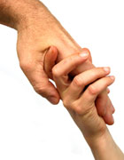

## What is ethics? 什么是道德？

At its simplest, ethics is a system of moral principles. They affect how people make decisions and lead their lives.  
简而言之，伦理学是一套道德原则体系。它们影响人们如何做出决定和过他们的生活。

Ethics is concerned with what is good for individuals and society and is also described as moral philosophy.  
伦理学关注什么对个人和社会有益，也被描述为道德哲学。

The term is derived from the Greek word _ethos_ which can mean custom, habit, character or disposition.  
该术语源自希腊语 ethos，可表示习俗、习惯、性格或性格。

Ethics covers the following dilemmas:  
伦理涵盖以下困境：

-   how to live a good life  
    如何过好生活
-   our rights and responsibilities 我们的权利和责任
-   the language of right and wrong  
    是非的语言
-   moral decisions - what is good and bad?  
    道德决定——什么是好是坏？

Our concepts of ethics have been derived from religions, philosophies and cultures. They infuse debates on topics like abortion, human rights and professional conduct.  
我们的伦理概念源自宗教、哲学和文化。他们引发了关于堕胎、人权和职业行为等话题的辩论。

### Approaches to ethics 伦理学方法

Philosophers nowadays tend to divide ethical theories into three areas: metaethics, normative ethics and applied ethics.  
当今的哲学家倾向于将伦理学理论分为三个领域：元伦理学、规范伦理学和应用伦理学。

-   Meta-ethics deals with the nature of moral judgement. It looks at the origins and meaning of ethical principles.  
    元伦理学处理道德判断的本质。它着眼于道德原则的起源和意义。
-   Normative ethics is concerned with the content of moral judgements and the criteria for what is right or wrong.  
    规范伦理学关注道德判断的内容和判断对错的标准。
-   Applied ethics looks at controversial topics like war, animal rights and capital punishment  
    应用伦理学着眼于战争、动物权利和死刑等有争议的话题

## What use is ethics? 道德有什么用？

  Ethics needs to provide answers. Photo: Geoffrey Holman [©](https://www.bbc.co.uk/religion/copyright.shtml)  
道德需要提供答案。照片：杰弗里·霍尔曼 ©

If ethical theories are to be useful in practice, they need to affect the way human beings behave.  
如果伦理理论要在实践中发挥作用，它们就需要影响人类的行为方式。

Some philosophers think that ethics does do this. They argue that if a person realises that it would be morally good to do something then it would be irrational for that person not to do it.  
一些哲学家认为伦理学确实做到了这一点。他们争辩说，如果一个人意识到做某事在道德上是好的，那么这个人不去做就是不合理的。

But human beings often behave irrationally - they follow their 'gut instinct' even when their head suggests a different course of action.  
但是人类的行为往往是非理性的——即使他们的头脑建议采取不同的行动方案，他们也会遵循自己的“直觉”。

However, ethics does provide good tools for thinking about moral issues.  
然而，伦理学确实为思考道德问题提供了很好的工具。

### Ethics can provide a moral map  
伦理可以提供道德地图

Most moral issues get us pretty worked up - think of abortion and euthanasia for starters. Because these are such emotional issues we often let our hearts do the arguing while our brains just go with the flow.  
大多数道德问题都会让我们非常激动——首先想想堕胎和安乐死。因为这些都是情绪化的问题，所以我们经常让我们的心去争论，而我们的大脑只是顺其自然。

But there's another way of tackling these issues, and that's where philosophers can come in - they offer us ethical rules and principles that enable us to take a cooler view of moral problems.  
但是还有另一种解决这些问题的方法，这就是哲学家可以发挥作用的地方——他们为我们提供道德规则和原则，使我们能够以更冷静的态度看待道德问题。

So ethics provides us with a moral map, a framework that we can use to find our way through difficult issues.  
因此，伦理学为我们提供了一张道德地图，一个我们可以用来找到解决难题的方法的框架。

### Ethics can pinpoint a disagreement  
道德可以指出分歧

Using the framework of ethics, two people who are arguing a moral issue can often find that what they disagree about is just one particular part of the issue, and that they broadly agree on everything else.  
使用道德框架，争论道德问题的两个人通常会发现他们不同意的只是问题的一个特定部分，而他们在其他所有方面都大体一致。

That can take a lot of heat out of the argument, and sometimes even hint at a way for them to resolve their problem.  
这可以消除争论中的很多热度，有时甚至暗示他们可以找到解决问题的方法。

But sometimes ethics doesn't provide people with the sort of help that they really want.  
但有时道德并不能为人们提供他们真正想要的帮助。

### Ethics doesn't give right answers  
道德并没有给出正确的答案

Ethics doesn't always show the right answer to moral problems.  
伦理学并不总能给出道德问题的正确答案。

Indeed more and more people think that for many ethical issues there isn't a single right answer - just a set of principles that can be applied to particular cases to give those involved some clear choices.  
事实上，越来越多的人认为，对于许多道德问题，没有单一的正确答案——只有一套可以应用于特定案例的原则，让相关人员有一些明确的选择。

Some philosophers go further and say that all ethics can do is eliminate confusion and clarify the issues. After that it's up to each individual to come to their own conclusions.  
一些哲学家更进一步说，伦理学所能做的就是消除混乱和澄清问题。之后，由每个人得出自己的结论。

### Ethics can give several answers 伦理学可以给出几个答案

Many people want there to be a single right answer to ethical questions. They find moral ambiguity hard to live with because they genuinely want to do the 'right' thing, and even if they can't work out what that right thing is, they like the idea that 'somewhere' there is one right answer.  
许多人希望道德问题只有一个正确答案。他们发现道德模棱两可很难忍受，因为他们真的想做“正确”的事情，即使他们无法弄清楚什么是正确的事情，他们也喜欢“某处”有一个正确答案的想法。

But often there isn't one right answer - there may be several right answers, or just some least worst answers - and the individual must choose between them.  
但通常没有一个正确答案——可能有几个正确答案，或者只有一些最差的答案——个人必须在它们之间做出选择。

For others moral ambiguity is difficult because it forces them to take responsibility for their own choices and actions, rather than falling back on convenient rules and customs.  
对其他人来说，道德模棱两可很困难，因为它迫使他们为自己的选择和行为负责，而不是求助于方便的规则和习俗。

## Ethics and people 道德与人

### Ethics is about the 'other' 道德是关于“他者”的

  Ethics is concerned with other people [©](https://www.bbc.co.uk/religion/copyright.shtml)  
道德与他人有关 ©

At the heart of ethics is a concern about something or someone other than ourselves and our own desires and self-interest.  
道德的核心是关注我们自己以及我们自己的欲望和自身利益以外的事物或人。

Ethics is concerned with other people's interests, with the interests of society, with God's interests, with "ultimate goods", and so on.  
伦理关心他人的利益、社会的利益、上帝的利益、“终极善”等等。

So when a person 'thinks ethically' they are giving at least some thought to something beyond themselves.  
因此，当一个人“道德地思考”时，他们至少会考虑一些超出他们自身的事情。

### Ethics as source of group strength  
道德是团队力量的源泉

One problem with ethics is the way it's often used as a weapon.  
道德的一个问题是它经常被用作武器的方式。

If a group believes that a particular activity is "wrong" it can then use morality as the justification for attacking those who practice that activity.  
如果一个团体认为某项特定活动是“错误的”，那么它可以使用道德作为攻击那些从事该活动的人的理由。

When people do this, they often see those who they regard as immoral as in some way less human or deserving of respect than themselves; sometimes with tragic consequences.  
当人们这样做时，他们通常会看到那些他们认为不道德的人在某些方面不如他们人性化或不值得尊重；有时会带来悲惨的后果。

### Good people as well as good actions  
好人好事

Ethics is not only about the morality of particular courses of action, but it's also about the goodness of individuals and what it means to live a good life.  
伦理不仅关乎特定行动过程的道德，还关乎个人的善良以及过上美好生活的意义。

Virtue Ethics is particularly concerned with the moral character of human beings.  
美德伦理学特别关注人类的道德品质。

### Searching for the source of right and wrong  
追寻是非的源头

At times in the past some people thought that ethical problems could be solved in one of two ways:  
过去有时有人认为道德问题可以通过以下两种方式之一解决：

-   by discovering what God wanted people to do  
    通过发现上帝要人们做什么
-   by thinking rigorously about moral principles and problems  
    通过严格思考道德原则和问题

If a person did this properly they would be led to the right conclusion.  
如果一个人正确地做到了这一点，他们就会得出正确的结论。

But now even philosophers are less sure that it's possible to devise a satisfactory and complete theory of ethics - at least not one that leads to conclusions.  
但现在即使是哲学家也不太确定是否有可能设计出令人满意且完整的伦理学理论——至少不能得出结论。

Modern thinkers often teach that ethics leads people not to conclusions but to 'decisions'.  
现代思想家经常教导说，伦理不是引导人们得出结论，而是引导人们做出“决定”。

In this view, the role of ethics is limited to clarifying 'what's at stake' in particular ethical problems.  
按照这种观点，伦理学的作用仅限于澄清特定伦理问题中的“利害关系”。

Philosophy can help identify the range of ethical methods, conversations and value systems that can be applied to a particular problem. But after these things have been made clear, each person must make their own individual decision as to what to do, and then react appropriately to the consequences.  
哲学可以帮助确定可应用于特定问题的道德方法、对话和价值体系的范围。但是在弄清楚这些事情之后，每个人都必须自己决定要做什么，然后对后果做出适当的反应。

## Are ethical statements objectively true?  
道德陈述是否客观真实？

Do ethical statements provide information about anything other than human opinions and attitudes?  
道德声明是否提供关于人类观点和态度以外的任何信息？

-   Ethical realists think that human beings _discover_ ethical truths that already have an independent existence.  
    伦理现实主义者认为人类发现了已经独立存在的伦理真理。
-   Ethical non-realists think that human beings _invent_ ethical truths.  
    伦理非现实主义者认为人类发明了伦理真理。

The problem for ethical realists is that people follow many different ethical codes and moral beliefs. So if there are real ethical truths out there (wherever!) then human beings don't seem to be very good at discovering them.  
伦理现实主义者的问题是人们遵循许多不同的伦理准则和道德信仰。因此，如果那里（无论在哪里！）存在真正的道德真理，那么人类似乎并不擅长发现它们。

One form of ethical realism teaches that ethical properties exist independently of human beings, and that ethical statements give knowledge about the objective world.  
一种形式的伦理现实主义认为，伦理属性独立于人类而存在，伦理陈述提供关于客观世界的知识。

To put it another way; the ethical properties of the world and the things in it exist and remain the same, regardless of what people think or feel - or whether people think or feel about them at all.  
换一种方式;世界的道德属性和其中的事物存在并保持不变，无论人们的想法或感受如何——或者人们是否对它们有任何想法或感受。

> On the face of it, it \[ethical realism\] means the view that moral qualities such as wrongness, and likewise moral facts such as the fact that an act was wrong, exist in rerum natura, so that, if one says that a certain act was wrong, one is saying that there existed, somehow, somewhere, this quality of wrongness, and that it had to exist there if that act were to be wrong.  
> 从表面上看，它 \[伦理现实主义\] 意味着这样一种观点，即道德品质（例如错误）以及道德事实（例如行为错误的事实）存在于自然界中，因此，如果有人说某个行为是错误的，有人说在某处以某种方式存在着这种错误的性质，如果该行为是错误的，它就必须存在于那里。
> 
> R. M Hare, Essays in Ethical Theory, 1989  
> R. M Hare，《伦理理论论文集》，1989 年

## Four ethical 'isms' 四种伦理“主义”

When a person says "murder is bad" what are they doing?  
当一个人说“谋杀是不好的”时，他们在做什么？

That's the sort of question that only a philosopher would ask, but it's actually a very useful way of getting a clear idea of what's going on when people talk about moral issues.  
这是那种只有哲学家才会问的问题，但它实际上是一种非常有用的方式，可以让人们清楚地了解人们谈论道德问题时发生了什么。

The different 'isms' regard the person uttering the statement as doing different things.  
不同的“主义”认为发表声明的人在做不同的事情。

We can show some of the different things I might be doing when I say 'murder is bad' by rewriting that statement to show what I really mean:  
当我说“谋杀是不好的”时，我们可以通过重写这句话来展示我真正的意思，来展示我可能在做的一些不同的事情：

-   I might be making a statement about an ethical fact  
    我可能正在就道德事实发表声明
    -   "It is wrong to murder" “杀人是错误的”
    -   This is moral realism 这是道德现实主义
-   I might be making a statement about my own feelings  
    我可能是在表达我自己的感受
    -   "I disapprove of murder" “我不赞成谋杀”
    -   This is subjectivism 这是主观主义
-   I might be expressing my feelings  
    我可能是在表达我的感受
    -   "Down with murder" “打倒谋杀”
    -   This is emotivism 这是情绪主义
-   I might be giving an instruction or a prohibition  
    我可能是在发出指示或禁令
    -   "Don't murder people" “不要杀人”
    -   This is prescriptivism 这是规定主义

### Moral realism 道德现实主义

Moral realism is based on the idea that there are real objective moral facts or truths in the universe. Moral statements provide factual information about those truths.  
道德现实主义基于这样一种观点，即宇宙中存在真实的客观道德事实或真理。道德陈述提供了关于这些真理的事实信息。

### Subjectivism 主观主义

[Subjectivism](https://www.bbc.co.uk/ethics/introduction/subjectivism.shtml) teaches that moral judgments are nothing more than statements of a person's feelings or attitudes, and that ethical statements do not contain factual truths about goodness or badness.  
主观主义教导说，道德判断只不过是一个人的感受或态度的陈述，而道德陈述并不包含关于善或恶的事实真相。

In more detail: subjectivists say that moral statements are _statements about the feelings, attitudes and emotions_ that that particular person or group has about a particular issue.  
更详细地说：主观主义者说，道德陈述是关于特定个人或群体对特定问题的感受、态度和情绪的陈述。

If a person says something is good or bad they are telling us about the positive or negative feelings that they have about that something.  
如果一个人说某件事是好事或坏事，他们就是在告诉我们他们对那件事的正面或负面感受。

So if someone says 'murder is wrong' they are telling us that they disapprove of murder.  
因此，如果有人说“谋杀是错误的”，他们就是在告诉我们他们不赞成谋杀。

These statements are true if the person does hold the appropriate attitude or have the appropriate feelings. They are false if the person doesn't.  
如果此人确实持有适当的态度或有适当的感受，则这些陈述是真实的。如果此人不这样做，它们就是错误的。

### Emotivism 情绪主义

[Emotivism](https://www.bbc.co.uk/ethics/introduction/emotivism_1.shtml) is the view that moral claims are no more than expressions of approval or disapproval.  
情感主义认为道德主张只不过是赞同或不赞成的表达。

This sounds like subjectivism, but in emotivism a moral statement doesn't _provide information about the speaker's feelings_ about the topic but _expresses those feelings_.  
这听起来像是主观主义，但在情感主义中，道德陈述不提供有关说话者对该主题的感受的信息，而是表达这些感受。

When an emotivist says "murder is wrong" it's like saying "down with murder" or "murder, yecch!" or just saying "murder" while pulling a horrified face, or making a thumbs-down gesture at the same time as saying "murder is wrong".  
当情绪主义者说“谋杀是错误的”时，就像在说“打倒谋杀”或“谋杀，耶奇！”或者只是说“谋杀”，同时拉着一张惊恐的脸，或者在说“谋杀是错误的”的同时做出拇指向下的手势。

So when someone makes a moral judgement they _show_ their feelings about something. Some theorists also suggest that in expressing a feeling the person _gives an instruction_ to others about how to act towards the subject matter.  
因此，当某人做出道德判断时，他们会表现出对某事的感受。一些理论家还建议，在表达一种感觉时，这个人会向其他人发出关于如何针对该主题采取行动的指示。

### Prescriptivism 规定主义

Prescriptivists think that ethical statements are instructions or recommendations.  
规定主义者认为伦理声明是指示或建议。

So if I say something is good, I'm recommending you to do it, and if I say something is bad, I'm telling you not to do it.  
所以如果我说某事好，我建议你去做，如果我说某事不好，我告诉你不要做。

There is almost always a prescriptive element in any real-world ethical statement: any ethical statement can be reworked (with a bit of effort) into a statement with an 'ought' in it. For example: "lying is wrong" can be rewritten as "people ought not to tell lies".  
在任何现实世界的道德声明中几乎总是有一个规定性的元素：任何道德声明都可以（通过一些努力）重新编写成一个包含“应该”的声明。例如：“说谎是错误的”可以改写为“人不应该说谎”。

## Where does ethics come from? 道德从何而来？

Philosophers have several answers to this question:  
哲学家对这个问题有几个答案：

-   God and religion 上帝与宗教
-   Human conscience and intuition 人类的良知和直觉
-   a rational moral cost-benefit analysis of actions and their effects  
    对行为及其影响进行理性的道德成本效益分析
-   the example of good human beings  
    好人的榜样
-   a desire for the best for people in each unique situation  
    渴望在每个独特的情况下为人们提供最好的服务
-   political power 政治力量

### God-based ethics - supernaturalism  
以神为基础的伦理——超自然主义

[Supernaturalism](https://www.bbc.co.uk/ethics/introduction/supernaturalism_1.shtml) makes ethics inseparable from religion. It teaches that the only source of moral rules is God.  
超自然主义使伦理与宗教密不可分。它教导说，道德规则的唯一来源是上帝。

So, something is good because God says it is, and the way to lead a good life is to do what God wants.  
所以，有些事情是好的，因为上帝说它是好的，过上美好生活的方法就是按照上帝的意愿去做。

### Intuitionism 直觉主义

[Intuitionists](https://www.bbc.co.uk/ethics/introduction/intuitionism_1.shtml) think that good and bad are real objective properties that can't be broken down into component parts. Something is good because it's good; its goodness doesn't need justifying or proving.  
直觉主义者认为好与坏是真实的客观属性，不能分解成组成部分。某事是好的，因为它是好的；它的优点不需要证明或证明。

Intuitionists think that goodness or badness can be detected by adults - they say that human beings have an intuitive moral sense that enables them to detect real moral truths.  
直觉主义者认为成人可以察觉善恶——他们说人类具有直觉的道德感，使他们能够察觉真正的道德真理。

They think that basic moral truths of what is good and bad are self-evident to a person who directs their mind towards moral issues.  
他们认为关于善恶的基本道德真理对于将思想引导到道德问题上的人来说是不言而喻的。

So good things are the things that a sensible person realises are good if they spend some time pondering the subject.  
所以好的东西是一个有理智的人如果花一些时间思考这个问题就会意识到好的东西。

Don't get confused. For the intuitionist:  
不要混淆。对于直觉主义者：

-   moral truths are not discovered by rational argument  
    道德真理不是通过理性论证发现的
-   moral truths are not discovered by having a hunch  
    道德真理不是靠直觉发现的
-   moral truths are not discovered by having a feeling  
    道德真理不是通过感觉来发现的

It's more a sort of moral 'aha' moment - a realisation of the truth.  
这更像是一种道德上的“啊哈”时刻——对真相的认识。

### Consequentialism 结果主义

This is the ethical theory that most non-religious people think they use every day. It bases morality on the consequences of human actions and not on the actions themselves.  
这是大多数非宗教人士认为他们每天都在使用的伦理理论。它将道德建立在人类行为的后果而不是行为本身的基础上。

[Consequentialism](https://www.bbc.co.uk/ethics/introduction/consequentialism_1.shtml) teaches that people should do whatever produces the greatest amount of good consequences.  
结果主义教导人们应该做任何能产生最大数量好的结果的事情。

One famous way of putting this is 'the greatest good for the greatest number of people'.  
一种著名的表达方式是“为最多人谋求最大利益”。

The most common forms of consequentialism are the various versions of utilitarianism, which favour actions that produce the greatest amount of happiness.  
最常见的结果主义形式是各种版本的功利主义，它们支持能够产生最大幸福感的行为。

Despite its obvious common-sense appeal, consequentialism turns out to be a complicated theory, and doesn't provide a complete solution to all ethical problems.  
尽管具有明显的常识性诉求，结果论却被证明是一个复杂的理论，并不能为所有伦理问题提供完整的解决方案。

Two problems with consequentialism are:  
结果主义的两个问题是：

-   it can lead to the conclusion that some quite dreadful acts are good  
    它可以得出这样的结论，即一些非常可怕的行为是好的
-   predicting and evaluating the consequences of actions is often very difficult  
    预测和评估行动的后果通常非常困难

### Non-consequentialism or deontological ethics  
非结果主义或道义伦理学

Non-consequentialism is concerned with the actions themselves and not with the consequences. It's the theory that people are using when they refer to "the principle of the thing".  
非结果主义关注的是行为本身，而不是结果。这是人们在提到“事物的原理”时所使用的理论。

It teaches that some acts are right or wrong in themselves, whatever the consequences, and people should act accordingly.  
它教导说，无论后果如何，某些行为本身是对还是错，人们应该采取相应的行动。

### Virtue ethics 美德伦理

[Virtue ethics](https://www.bbc.co.uk/ethics/introduction/virtue.shtml) looks at virtue or moral character, rather than at ethical duties and rules, or the consequences of actions - indeed some philosophers of this school deny that there can be such things as universal ethical rules.  
美德伦理学着眼于美德或道德品格，而不是道德义务和规则，或行为的后果——事实上，该学派的一些哲学家否认可以存在普遍的道德规则这样的东西。

Virtue ethics is particularly concerned with the way individuals live their lives, and less concerned in assessing particular actions.  
美德伦理特别关注个人的生活方式，而不太关注评估特定行为。

It develops the idea of good actions by looking at the way virtuous people express their inner goodness in the things that they do.  
它通过观察有德行的人在他们所做的事情中表达他们内在善良的方式来发展善行的观念。

To put it very simply, virtue ethics teaches that an action is right if and only if it is an action that a virtuous person would do in the same circumstances, and that a virtuous person is someone who has a particularly good character.  
简而言之，美德伦理学教导说，一个行为是正确的，当且仅当它是一个有美德的人在同样的情况下会做出的行为，而一个有美德的人是具有特别好的品格的人。

### Situation ethics 情境伦理

[Situation ethics](https://www.bbc.co.uk/ethics/introduction/situation_1.shtml) rejects prescriptive rules and argues that individual ethical decisions should be made according to the unique situation.  
情境伦理拒绝规定性规则，并主张个人的伦理决定应该根据独特的情境做出。

Rather than following rules the decision maker should follow a desire to seek the best for the people involved. There are no moral rules or rights - each case is unique and deserves a unique solution.  
决策者不应遵循规则，而应遵循为相关人员寻求最佳利益的愿望。没有道德规则或权利 - 每个案例都是独一无二的，值得一个独特的解决方案。

### Ethics and ideology 道德与意识形态

Some philosophers teach that ethics is the codification of political ideology, and that the function of ethics is to state, enforce and preserve particular political beliefs.  
一些哲学家教导说，伦理学是政治意识形态的编纂，伦理学的功能是陈述、执行和维护特定的政治信仰。

They usually go on to say that ethics is used by the dominant political elite as a tool to control everyone else.  
他们通常接着说，道德被占统治地位的政治精英用作控制其他所有人的工具。

More cynical writers suggest that power elites enforce an ethical code on other people that helps them control those people, but do not apply this code to their own behaviour.  
更愤世嫉俗的作家建议权力精英对其他人实施道德准则，以帮助他们控制这些人，但不要将此准则应用于他们自己的行为。

## Are there universal moral rules? 是否存在普遍的道德准则？

One of the big questions in moral philosophy is whether or not there are unchanging moral rules that apply in all cultures and at all times.  
道德哲学中的一个重大问题是，是否存在适用于所有文化和所有时间的不变的道德规则。

### Moral absolutism 道德绝对主义

Some people think there are such universal rules that apply to everyone. This sort of thinking is called moral absolutism.  
有些人认为存在适用于所有人的普遍规则。这种思想被称为道德绝对主义。

Moral absolutism argues that there are some moral rules that are always true, that these rules can be discovered and that these rules apply to everyone.  
道德绝对主义认为，有一些道德规则总是正确的，这些规则可以被发现，并且这些规则适用于每个人。

Immoral acts - acts that break these moral rules - are wrong in themselves, regardless of the circumstances or the consequences of those acts.  
不道德的行为——违反这些道德规则的行为——本身就是错误的，无论这些行为的情况或后果如何。

Absolutism takes a universal view of humanity - there is one set of rules for everyone - which enables the drafting of universal rules - such as the Declaration of Human Rights.  
专制主义采用普遍的人性观——每个人都有一套规则——这使得起草普遍规则成为可能——比如《人权宣言》。

Religious views of ethics tend to be absolutist.  
宗教的伦理观往往是绝对主义的。

Why people disagree with moral absolutism:  
为什么人们不同意道德绝对主义：

-   Many of us feel that the consequences of an act or the circumstances surrounding it are relevant to whether that act is good or bad  
    我们中的许多人认为，行为的后果或周围环境与该行为的好坏有关
-   Absolutism doesn't fit with respect for diversity and tradition  
    专制主义不符合对多样性和传统的尊重

  Different cultures have had different attitudes to issues like war [©](https://www.bbc.co.uk/religion/copyright.shtml)  
不同的文化对战争等问题有不同的态度 ©

### Moral relativism 道德相对主义

Moral relativists say that if you look at different cultures or different periods in history you'll find that they have different moral rules.  
道德相对主义者说，如果你观察不同的文化或不同的历史时期，你会发现他们有不同的道德准则。

Therefore it makes sense to say that "good" refers to the things that a particular group of people approve of.  
因此，说“好”是指特定人群认可的事情是有道理的。

Moral relativists think that that's just fine, and dispute the idea that there are some objective and discoverable 'super-rules' that all cultures ought to obey. They believe that relativism respects the diversity of human societies and responds to the different circumstances surrounding human acts.  
道德相对主义者认为这很好，并且反对所有文化都应该遵守的一些客观的和可发现的“超级规则”的观点。他们认为，相对主义尊重人类社会的多样性，并对围绕人类行为的不同环境作出反应。

Why people disagree with moral relativism:  
为什么人们不同意道德相对主义：

-   Many of us feel that moral rules have more to them than the general agreement of a group of people - that morality is more than a super-charged form of etiquette  
    我们中的许多人都觉得道德规则对他们来说比一群人的普遍共识更重要——道德不仅仅是一种超强的礼仪形式
-   Many of us think we can be good without conforming to all the rules of society  
    我们中的许多人认为我们可以在不遵守所有社会规则的情况下成为好人
-   Moral relativism has a problem with arguing against the majority view: if most people in a society agree with particular rules, that's the end of the matter. Many of the improvements in the world have come about because people opposed the prevailing ethical view - moral relativists are forced to regard such people as behaving "badly"  
    道德相对主义在反对多数观点时存在问题：如果一个社会中的大多数人都同意特定的规则，那么事情就结束了。世界上的许多进步都是因为人们反对流行的伦理观点——道德相对主义者被迫将这些人视为行为“恶劣”
-   Any choice of social grouping as the foundation of ethics is bound to be arbitrary  
    任何选择作为伦理基础的社会群体都必然是武断的
-   Moral relativism doesn't provide any way to deal with moral differences between societies  
    道德相对主义没有提供任何方法来处理社会之间的道德差异

### Moral somewhere-in-between-ism 道德介于两者之间的主义

Most non-philosophers think that both of the above theories have some good points and think that  
大多数非哲学家认为上述两种理论都有一些优点，并认为

-   there are a few absolute ethical rules  
    有一些绝对的道德规则
-   but a lot of ethical rules depend on the culture  
    但很多道德规则取决于文化
