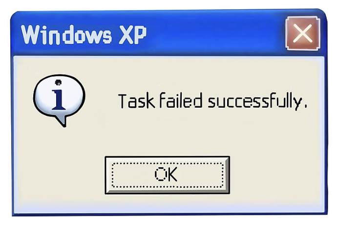
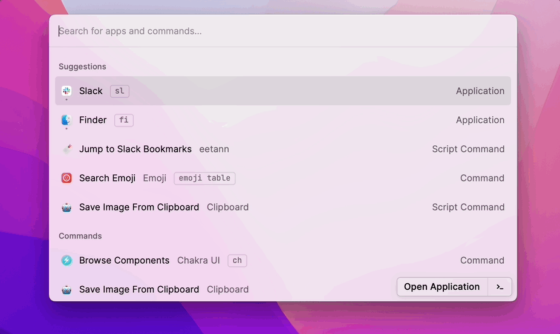
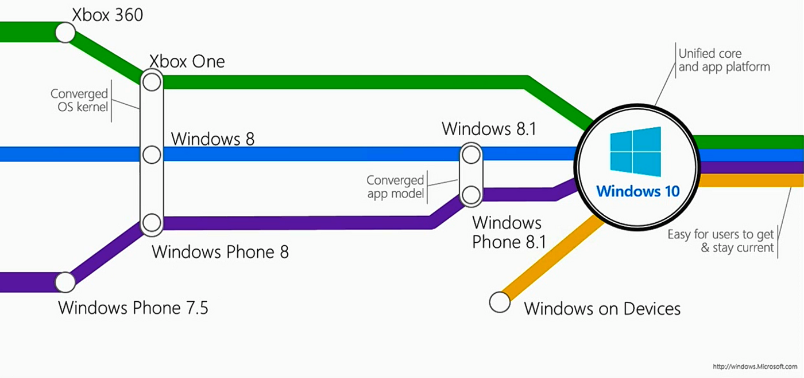
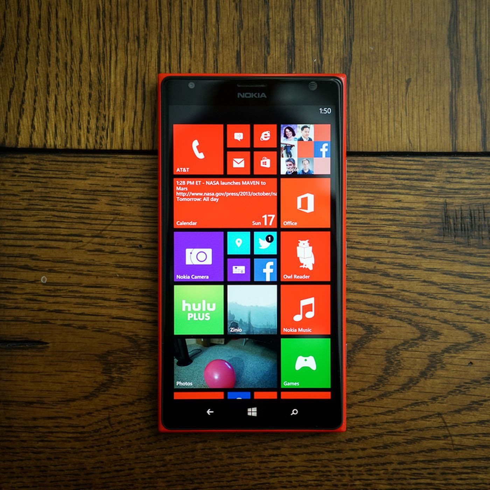
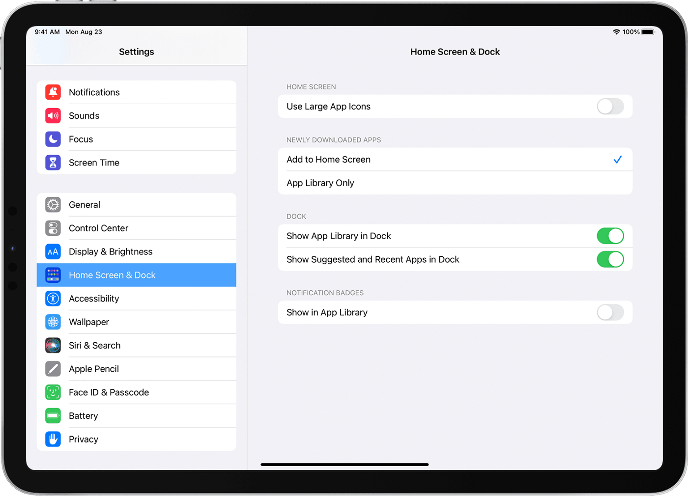
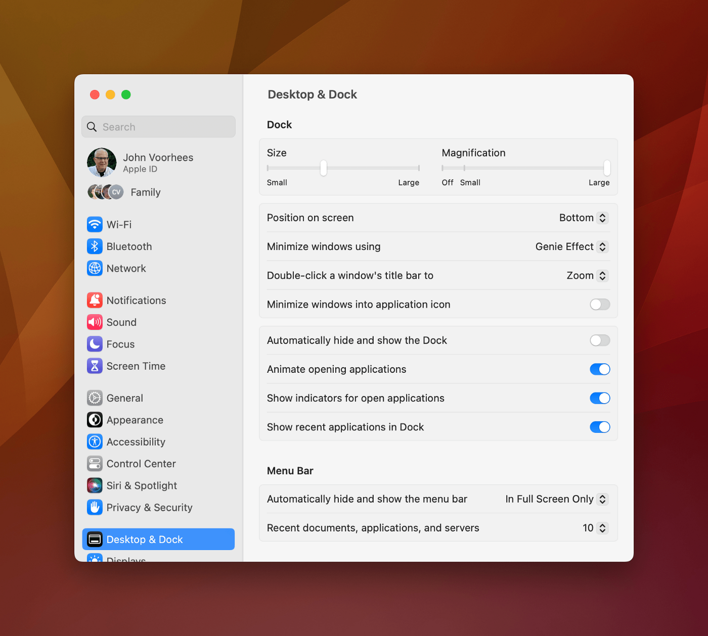
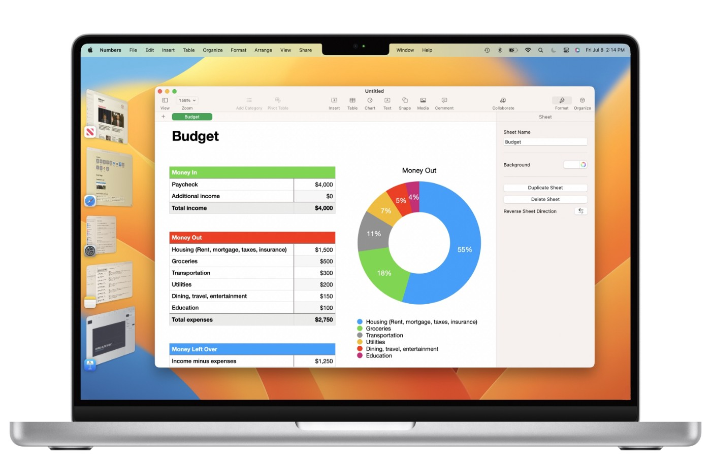
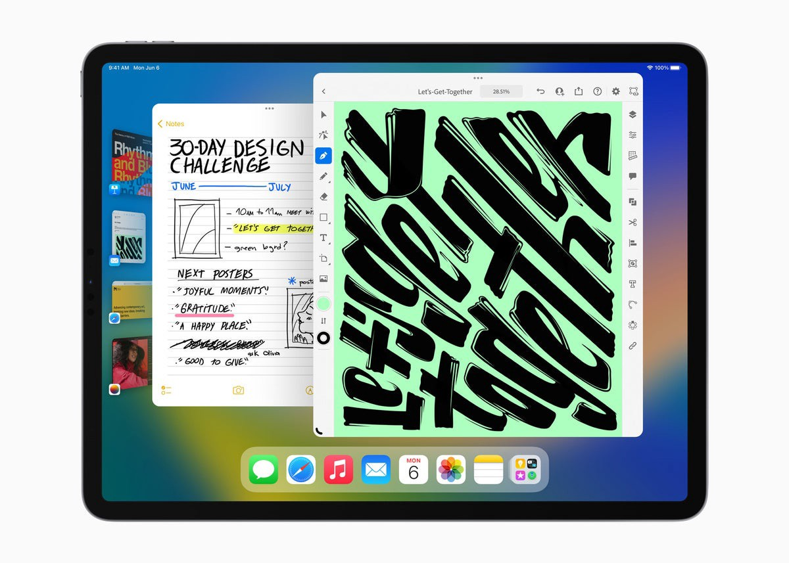

## Apple Treats macOS as if it’s iOS  
Apple 将 macOS 视为 iOS

Let’s face it: macOS is a _desktop_ operating system (OS), and should always stay that way. But Apple’s recent changes to macOS make it look and feel like a toy OS that tries to mimic iOS. I recently wrote about one of such changes ([checkboxes replaced with switch buttons](https://medium.com/@aplaceofmind/5-reasons-macos-ventura-design-change-is-the-end-of-the-sane-ui-as-we-know-it-c34d6c347552?source=list-2779352906d4--------7-------ce336fd0adaa---------------------)). But now that I have used the latest macOS version (Ventura) for quite some time, I’m sad to announce that this is the first time ever that I regret upgrading.  
让我们面对现实吧：macOS 是一个桌面操作系统 (OS)，应该始终如此。但 Apple 最近对 macOS 的更改使其看起来和感觉起来就像一个试图模仿 iOS 的玩具操作系统。我最近写了一篇关于此类更改的文章（复选框替换为切换按钮）。但是现在我已经使用最新的 macOS 版本 (Ventura) 有一段时间了，我很遗憾地宣布这是我第一次后悔升级。

Obviously, your mileage may differ, but my experience with Ventura has been full of **“damn, why did they do that?”** moments. We used to know Mac as an intuitive, user-friendly system that gets out of our way and _just works_. Well, Ventura also just works, except that it works against your convenience. I’ll give you an example:  
显然，你的里程可能会有所不同，但我在 Ventura 的经历充满了“该死的，他们为什么要那样做？”时刻。我们过去认为 Mac 是一个直观、用户友好的系统，它不妨碍我们正常工作。好吧，Ventura 也可以正常工作，只是它不利于您的方便。我给你举个例子：

## Plug-and-Play is Gone. Plug-and-NoPlay is In.  
即插即用已不复存在。即插即用。

On Ventura, every time you plug in a new USB device to your Mac, a small box pops up, asking for your permission to connect the device. While it might make sense to do so for USB flash drives, it also happens even if you plug in just a mouse or a keyboard! Apple has successfully failed at this one simple task. Why break something that already works?  
在 Ventura 上，每次将新的 USB 设备插入 Mac 时，都会弹出一个小框，请求您允许连接该设备。虽然对 USB 闪存驱动器这样做可能有意义，但即使您只插入鼠标或键盘也会发生这种情况！ Apple 在这个简单的任务上已经成功失败。为什么要破坏已经有效的东西？

Apple pulled a Microsoft by producing a half-baked broken macOS Ventura.  
Apple 通过生产半生不熟的 macOS Ventura 拉动了微软。

Of course, Apple would tell you that this is for security and safety reasons. BS! It’s like every time you want to get a taxi in New York city, an NYPD (New York Police Department) officer suddenly swoops in and ask you whether you _really_ want to get into that car. Is this really how you improve safety?  
当然，Apple 会告诉你这是出于安全和安全考虑。废话！就像每次你想在纽约市打车时，一名 NYPD（纽约警察局）警官突然冲进来问你是否真的想上那辆车。这真的是提高安全性的方式吗？

## Apps that Stopped Working 停止工作的应用程序

I used Espanso ([the text expander](https://medium.com/@aplaceofmind)) until I upgraded to Ventura. Why? Because I used a Raycast extension that would allow me to start/stop Espanso just by typing an alias, say, `esgo` to start and `esno` to stop. This is pretty common if you use Raycast (which you should—read my thorough review [here](https://medium.com/@aplaceofmind/8-ways-that-raycast-has-revolutionized-my-mac-workflow-in-2022-part-1-6e9c91cc1991)). But when you upgrade your OS, the last thing you want is to get a worse experience than what you had on the older OS. I was pretty happy with macOS Monterey (although it was [full of issues](https://medium.com/@aplaceofmind/mac-it-just-works-horribly-c98fd9be4001) as well) and I regret upgrading to Ventura.  
在升级到 Ventura 之前，我一直使用 Espanso（文本扩展器）。为什么？因为我使用了一个 Raycast 扩展，它允许我通过输入一个别名来启动/停止 Espanso，比如， `esgo` 开始， `esno` 停止。如果您使用 Raycast（您应该使用 Raycast，请在此处阅读我的全面评论），这很常见。但是当你升级你的操作系统时，你最不想要的就是获得比你在旧操作系统上更糟糕的体验。我对 macOS Monterey 非常满意（尽管它也充满了问题），但我很遗憾升级到 Ventura。

Using aliases to run commands in Raycast helps avoid having to remember keyboard shortcuts. [Gif](https://d1tlzifd8jdoy4.cloudfront.net/wp-content/uploads/2022/05/eetann-raycast-example.gif)  
使用别名在 Raycast 中运行命令有助于避免必须记住键盘快捷键。动图

## Desktop is not Mobile 桌面不是移动

Years ago, when Microsoft proudly announced the unification of Windows 8 and Windows Phone’s kernels, I was so excited. That meant that developers could write apps for one OS and port them to the other OS with minimal effort.  
多年前，当微软自豪地宣布统一 Windows 8 和 Windows Phone 的内核时，我非常兴奋。这意味着开发人员可以为一个操作系统编写应用程序，然后毫不费力地将它们移植到另一个操作系统。

[Photo  照片](https://canbilgin.files.wordpress.com/2015/04/windows10-evolution.png?w=640)

Clearly, that didn’t work. There are many reasons for this, but maybe the elephant in the room was that _mobile_ is different than _desktop_. Microsoft paid a huge price to learn that. Had they had stuck to their roots and kept working on Windows Mobile or Windows Phone, maybe we would still see Windows smartphones on the market (and I’d definitely want to buy one like this image ↓).  
显然，那是行不通的。这有很多原因，但也许房间里的大象是移动设备与桌面设备不同。微软为此付出了巨大的代价。如果他们坚持自己的根基并继续在 Windows Mobile 或 Windows Phone 上工作，也许我们仍会在市场上看到 Windows 智能手机（我肯定会想买一个像这个图片 ↓）。

Lumia 1520, sporting Windows Phone 8.1. [Photo](https://www.theverge.com/2013/11/18/5116360/nokia-lumia-1520-review)  
Lumia 1520，搭载 Windows Phone 8.1。照片

At the time, I appreciated that Apple showed patience and didn’t jump on the bandwagon to unify all its operating systems. My trust in their common sense was further increased when they introduced iPadOS, WatchOS, tvOS, and [audioOS](https://en.wikipedia.org/wiki/HomePod) (their HomePod software). This branching of operating systems showed that Apple thought it was better to focus on each of these domains separately. But now we’re witnessing their merge in a rather unexpected way. For instance, the following is iPadOS’s settings app:  
当时，我很欣赏 Apple 表现出的耐心，没有随波逐流统一其所有操作系统。当他们推出 iPadOS、WatchOS、tvOS 和 audioOS（他们的 HomePod 软件）时，我对他们常识的信任进一步增加。操作系统的这种分支表明，Apple 认为最好分别关注这些领域中的每一个领域。但现在我们正以一种意想不到的方式见证它们的融合。例如，以下是 iPadOS 的设置应用程序：

[Photo  照片](https://support.apple.com/library/content/dam/edam/applecare/images/en_US/ipados/ios15-ipad-pro-settings-home-screen-dock.png)

And this is macOS Ventura’s settings app:  
这是 macOS Ventura 的设置应用程序：

[Photo  照片](https://cdn.macstories.net/cleanshot-2022-10-22-at-16-38-17-2x-1666471116384.png)

## Unintuitive Features that Nobody Uses  
没有人使用的不直观的功能

With Ventura, Apple also introduced a new “feature” (read “bug”) that makes macOS feel like it’s designed for children: the infamous **stage manager**. It looks like this:  
通过 Ventura，Apple 还引入了一项新“功能”（读作“错误”），让 macOS 感觉像是专为儿童设计的：声名狼藉的舞台经理。它看起来像这样：

[Photo  照片](https://www.macworld.com/wp-content/uploads/2023/01/ventura-stage-manager.jpg?quality=50&strip=all)

Literally everyone I know has disabled stage manager. It’s a feature that no one asked for, but perhaps some PM at Apple needed this on their resume to get promoted. So basically Apple decided to brush off ancient problems like lack of a proper window manager and instead, introduce a new feature that needs to get fixed (but never will). Right now, you’d have to install third-party apps to manage windows on macOS (e.g., Tiles, Rectangle, etc.) But Apple seems to be totally fine with it.  
从字面上看，我认识的每个人都有残疾的舞台监督。这是一项没有人要求的功能，但也许 Apple 的某些 PM 需要在他们的简历中使用此功能才能获得晋升。因此，基本上 Apple 决定摒弃诸如缺少合适的窗口管理器之类的古老问题，而是引入一项需要修复（但永远不会）的新功能。现在，你必须安装第三方应用程序来管理 macOS 上的窗口（例如 Tiles、Rectangle 等），但 Apple 似乎对此完全满意。

The amount of complexity that stage manager brings to macOS is insane: Everyone knows how to use windows, desktop icons, taskbar, etc. But for some reason, Apple thought people like their workflow being categorized for them in unknown ways. Why do it then? The answer might become clear when you see the following image:  
舞台经理给 macOS 带来的复杂性是疯狂的：每个人都知道如何使用窗口、桌面图标、任务栏等。但出于某种原因，Apple 认为人们喜欢他们的工作流程以未知的方式为他们分类。那为什么要这样做？当您看到下图时，答案可能会变得清晰：

[Photo  照片](https://images.idgesg.net/images/article/2022/06/apple-wwdc22-ipados16-stage-manager-220606-100928739-large.jpg?auto=webp&quality=85,70)

So it seems that Apple is paving the way for a future version of Mac with touchscreen controls, so that at some point, iPad and Mac can become one. We already see M1 chips in the latest iPad Pros. Again, this is not something that people asked for; instead, people have been calling for better software on iPad, more freedom, and less restrictions inherited from iOS. Apple of course doesn’t think users need freedom—it’s bad for security and safety /sc. So their solution seems to combine Mac and iPad and make a new device that has the best of both worlds: the power of macOS and portability of iPad. Wait, didn’t literally every other manufacturer do this before? Doesn’t it sound like Microsoft Surface?!  
因此，Apple 似乎正在为未来版本的带有触摸屏控件的 Mac 铺平道路，以便在某个时候，iPad 和 Mac 可以合而为一。我们已经在最新的 iPad Pro 中看到了 M1 芯片。同样，这不是人们要求的；相反，人们一直在呼吁 iPad 上有更好的软件、更多的自由和更少的从 iOS 继承的限制。 Apple 当然不认为用户需要自由——这对安全和安全 /sc 不利。因此，他们的解决方案似乎将 Mac 和 iPad 结合起来，打造出一款兼具两全其美的新设备：macOS 的强大功能和 iPad 的便携性。等等，之前不是所有其他制造商都这样做过吗？听起来不像 Microsoft Surface？！

## Conclusion 结论

Apple needs to realize that its power users buy Mac for productivity. No one buys it for games, so please stop installing my iOS games on my Mac! Apple should also go back to its roots and make macOS great again. No more switches instead of checkboxes, no more UI changes “inspired” by iOS, no more silly restrictions. Let macOS be what it really is: the world’s most advanced _desktop_ operating system. Don’t treat it like a toy. We want macOS, not maciOS.  
Apple 需要意识到其高级用户购买 Mac 是为了提高生产力。没有人买它来玩游戏，所以请停止在我的 Mac 上安装我的 iOS 游戏！ Apple 也应该回归本源，让 macOS 再次伟大起来。不再使用复选框代替复选框，不再受 iOS“启发”的 UI 更改，不再有愚蠢的限制。让 macOS 成为它真正的样子：世界上最先进的桌面操作系统。不要把它当作玩具。我们想要 macOS，而不是 maciOS。
