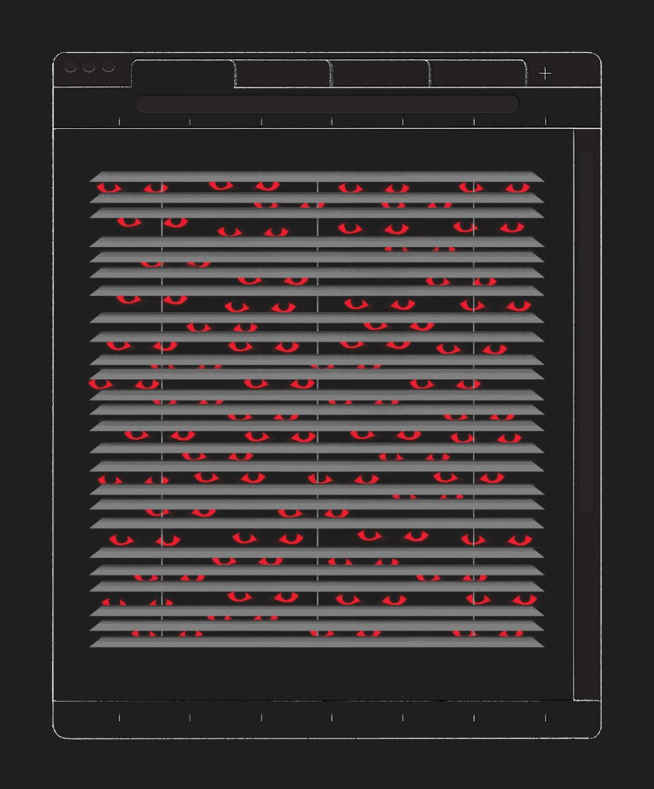
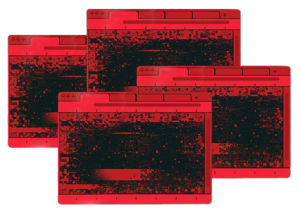
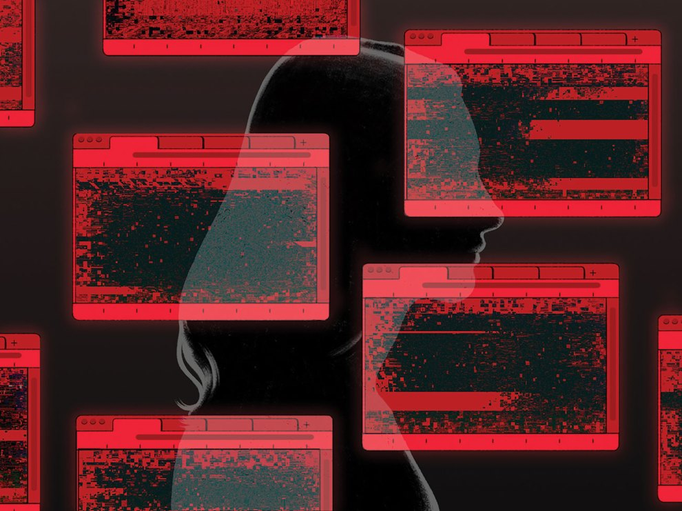

_If you or someone you care about may be at risk of suicide, call or text the [National Suicide Prevention Lifeline](https://988lifeline.org/), a free 24/7 service that offers support, information, and local resources: 988.  
如果你或你关心的人可能有自杀的风险，请打电话或发短信给国家预防自杀生命线，这是一项免费的24/7服务，提供支持、信息和当地资源。 988._

Most websites aren’t known for having a “kill count.” Kiwi Farms is. Its victims reportedly include Julie Terryberry, who in 2016 took her life after being targeted by users of the site. Two years later, after years of harassment from Kiwi Farms trolls, Chloe Sagal lit herself on fire in a public park. In June 2021, an American video game developer based in Japan, named David Ginder, took their life amid a campaign of Kiwi Farms abuse.  
大多数网站并不以拥有 "杀戮数量 "而闻名。 奇异果农场是。 据报道，其受害者包括朱莉-特利贝里，她在2016年被该网站的用户作为目标后夺去了自己的生命。 两年后，在遭受猕猴桃农场巨魔的多年骚扰后，克洛伊-萨加尔在一个公共公园里点燃了自己。 2021年6月，一位总部设在日本的美国视频游戏开发者，名叫大卫-金德，在奇异果农场的辱骂活动中夺去了他们的生命。

Kiwi Farms is a forum similar in design to 4chan or 8chan, where anonymous posters gather. But instead of just spreading noxious discourse, Kiwi Farms users turn to the site to plan and coordinate. They work to make the lives of their targets a living hell. Their tactics include doxxing, SWATing, defaming, encouraging self-harm, and stalking, online and sometimes off.  
奇异果农场是一个在设计上类似于4chan或8chan的论坛，匿名发帖者聚集在这里。 但是，猕猴桃农场的用户并不只是传播有害的言论，而是转向该网站进行计划和协调。 他们的工作是让他们的目标的生活成为地狱。 他们的策略包括：在网上，有时也在网下，对人施暴，诽谤，鼓励自我伤害，以及跟踪骚扰。

Kiwi Farms harvests anguish. It thrives on pain and revels in death. Users of the innocuously named forum prey on the vulnerable and marginalized—people who are transgender, neurodivergent, disabled, financially struggling—with persistent and twisted harassment campaigns. Despite its penchant for destroying lives, Kiwi Farms has been mostly overlooked by the media for much of the site’s existence. That is partly because of who it attacks, but also because reporters are wary of becoming targets themselves. The users call their victims “lolcows” because their pain can be milked for laughs. The group made its purpose clear on its Twitter page before it was taken down: “Gossip and exploitation of mentally handicapped for amusement purposes.”  
猕猴桃农场收获了痛苦。 它以痛苦为生，以死亡为乐。 这个名称无害的论坛的用户以持续和扭曲的骚扰活动来掠夺脆弱和边缘化的人--变性人、神经分化者、残疾人、经济困难者。 尽管猕猴桃农场喜欢破坏生命，但在该网站存在的大部分时间里，媒体大多忽视了它。 部分原因是它的攻击对象，但也因为记者们对自己成为目标感到警惕。 用户称他们的受害者为 "笑牛"，因为他们的痛苦可以被榨取为笑料。 该组织在其推特页面上明确说明了其目的，然后就被取缔了。 "以娱乐为目的，对智障人士进行八卦和剥削"。

Kiwi Farms users deploy slightly different tactics for various victims, but the rough beats are the same. First, the group assembles extensive dossiers. Then they use the information (some true, some contorted, some fabricated) to torment their targets.  
奇异果农场的用户对不同的受害者采取了略有不同的策略，但大致的节奏是相同的。 首先，该组织收集了大量的档案资料。 然后他们利用这些信息（有些是真实的，有些是扭曲的，有些是捏造的）来折磨他们的目标。

When Sagal posted about her suicidal thoughts, Kiwi Farms users sent private messages urging her to kill herself, a friend said. When posters learned that Terryberry, an 18-year-old with learning disabilities, used the internet to make friends, they worked to get her social media accounts shut down while mocking her mental health struggles. They relentlessly tormented Ginder for being nonbinary. One thread went on for more than a dozen pages.  
一位朋友说，当萨格尔发布她的自杀想法时，奇异果农场的用户发送私人信息，敦促她自杀。 当发帖人得知有学习障碍的18岁女孩泰瑞贝里利用互联网交朋友时，他们努力让她的社交媒体账户关闭，同时嘲笑她的心理健康问题。 他们无情地折磨金德，因为他是非二进制的。 一个主题持续了十几页。

“I’ve been bullied, ridiculed, and humiliated my entire life,” Ginder explained in their online suicide note. “I could only just tolerate it with heavy depression when it was 4chan. But Kiwi Farms has made the harassment orders of magnitude worse.”  
"我一生都在被欺负、被嘲笑、被羞辱，"金德在他们的网上遗书中解释。 "在4chan的时候，我只能带着沉重的抑郁症忍受它。 但猕猴桃农场使骚扰变得更加严重。"

Users gleefully imagined Ginder’s death: “Here’s hoping for a +1 to the kiwi kill count”; “Bruh I hope he streams his suicide. Quote me in the articles”; “Don’t give in \[and\] delete the thread. Everyone will get a point on their counter if he does it, and I only need two more to get free a milkshake.” Such discourse is typical. In threads about other targets, Kiwi Farms users have joked, “See the only problem with making a thread on a tranny post mortem is that we can’t kill them a second time,” and “hope the fat cunt strokes out and dies tbh, stop wasting my fucking taxes.”  
用户欣喜地想象着金德的死亡。 "希望猕猴桃的杀伤力能达到+1"；"我希望他流着泪自杀。 在文章中引用我的话"；"不要屈服\[和\]删除该主题。 如果他这么做了，每个人都会在他们的计数器上得到一个点，我只需要再有两个人就可以得到免费的奶昔。" 这样的论述是典型的。 在关于其他目标的线程中，猕猴桃农场的用户开玩笑说："看，在变性人的尸体上做一个线程的唯一问题是，我们不能第二次杀死他们，"和 "希望这个胖屄中风而死，tbh，停止浪费我他妈的税收。"

When journalists have covered Kiwi Farms, they’ve tended to label it a far-right forum, which is true but incomplete. Its members both love and detest figures like former President Donald Trump and white nationalist Nick Fuentes. Not necessarily because users disagree with either, but because both can be “cringe”—online parlance for corny. Kiwi Farms posters have ridiculed trans Twitch streamers, and troubled teens, and [even Rep. Marjorie Taylor Greene.](https://www.businessinsider.com/kiwi-farms-trans-activists-mtg-swatting-trolling-website-offline-2022-8) They are deeply reactionary—many hate women, people of color, neurodivergent people, queer people—but they torment them as much for the need of a soft target as a political project.  
当记者报道猕猴桃农场时，他们倾向于给它贴上极右翼论坛的标签，这是事实，但不全面。 其成员对前总统唐纳德-特朗普和白人民族主义者尼克-富恩特斯这样的人物既喜爱又厌恶。 不一定是因为用户不同意这两个人，而是因为这两个人都可能是 "畏缩 "的--在网上的说法是老套。 猕猴桃农场的发帖人嘲笑跨性别的Twitch流媒体人，以及问题青少年，甚至是众议员马乔里-泰勒-格林。 他们非常反动--许多人讨厌妇女、有色人种、神经失常者、同性恋者--但他们折磨他们，既是为了需要一个软目标，也是为了一个政治项目。

“They were systematically trying to cause suicides,” Yonah Gerber, an archivist in the video game industry who has spent the better part of a decade advocating for Kiwi Farms to be shut down, told me. “I was almost another—because I tried to kill myself twice.”  
"Yonah Gerber是视频游戏行业的档案管理员，他花了十年的时间倡导关闭猕猴桃农场，他告诉我："他们有计划地试图造成自杀。 "我几乎是另一个，因为我两次试图自杀。"

The first time most people heard of Kiwi Farms was in August 2022, when popular trans Twitch streamer Clara Sorrenti said she had a SWAT [team sent to her house](https://www.wired.com/story/keffals-kiwifarms-cloudflare-blocked-clara-sorrenti/), a favorite tactic of Kiwi Farms users and other serial harassers. “I was woken up by police officers and saw the assault rifle pointed at me,” Sorrenti explained in a YouTube video. “I thought I was going to die.” (Later that month, a Kiwi Farms user also SWATed Rep. Greene, according to a police report.)  
大多数人第一次听说猕猴桃农场是在2022年8月，当时流行的跨Twitch流媒体人克拉拉-索伦蒂说她有一个特警队被派到她家，这是猕猴桃农场用户和其他连续骚扰者最喜欢的策略。 "我被警察叫醒，看到突击步枪指着我，"索伦蒂在一个YouTube视频中解释说。 "我以为我要死了。" (根据一份警方报告，当月晚些时候，一名猕猴桃农场的用户也对格林议员采取了特警行动）。

Before then, Kiwi Farms victims had tried to fight back, with little success. But Sorrenti (whose handle is Keffals) had leverage: her large, passionate fanbase—nearly 150,000 followers on Twitter, more than 50,000 on Twitch. She created the [#DropKiwiFarms campaign](https://kotaku.com/twitter-drop-kiwi-farms-hashtag-cloudflare-keffals-1849451829) and asked her supporters—who can be as fervent as K-pop stans—to pressure web services and security provider Cloudflare to boot Kiwi Farms as a client, effectively deplatforming the website by inhibiting its ability to fully function. Sorrenti’s followers made sure that every time she tweeted about Kiwi Farms victims, or provided updates on the campaign, her posts got thousands of likes and retweets. [National news](https://www.bloomberg.com/news/articles/2022-08-30/cloudflare-urged-to-cut-ties-to-site-that-promotes-harassment) stories [soon followed.](https://www.nbcnews.com/tech/internet/cloudflare-kiwi-farms-keffals-anti-trans-rcna44834) For weeks, Cloudflare did not respond. Then, on September 3, the company’s CEO, Matthew Prince, [wrote in a blog post](https://blog.cloudflare.com/kiwifarms-blocked/) that it had “taken steps to block \[Kiwi Farms\] content from being accessed through our infrastructure.” Major outlets [declared the death](https://www.theguardian.com/technology/2022/sep/07/techscape-kiwi-farms-cloudflare) of “the worst place on the web.” “The campaign is over. We won,” [Sorrenti said](https://twitter.com/keffals/status/1566921249036681217?s=20&t=vqTQeEke9K1CEIuDgnHZIw) on September 5.  
在此之前，猕猴桃农场的受害者曾试图进行反击，但收效甚微。 但索伦蒂（她的名字是Keffals）有了筹码：她在推特上有大量热情的粉丝，在Twitch上有超过5万名粉丝。 她发起了#DropKiwiFarms活动，并要求她的支持者--他们可以像K-pop粉丝一样狂热--向网络服务和安全供应商Cloudflare施压，将Kiwi Farms作为一个客户，通过抑制其全面运作的能力，有效地取消该网站的地位。 索伦蒂的追随者确保每次她在推特上发布有关猕猴桃农场受害者的信息，或提供有关该活动的最新信息时，她的帖子都会得到成千上万的赞和转发。 全国性的新闻报道很快就出现了。 几个星期以来，Cloudflare公司没有任何回应。 然后，9月3日，该公司的首席执行官马修-普林斯在一篇博文中写道，它已经 "采取措施阻止\[猕猴桃农场\]的内容通过我们的基础设施被访问"。 主要媒体宣布 "网络上最糟糕的地方 "死亡。 "这场运动已经结束。 我们赢了，"索伦蒂在9月5日说。

Marvin Candle 马文蜡烛

But nothing dies online, not completely. Kiwi Farms victims had already seen this firsthand, as shards of ephemeral information—photos, stray thoughts, personal missives—were built into portfolios of abuse by strangers. Kiwi Farms’ founder and its users are extremely committed to keeping the website alive; it pops back into existence occasionally as it fights to find a secure host. Posters congregate on Telegram. They move between Discord servers. But whatever happens to the forum itself, the strategies of internet torture that Kiwi Farms honed have spread far beyond it.  
但是，没有什么东西会在网上消失，不完全是。 奇异果农场的受害者已经亲眼目睹了这一点，因为短暂信息的碎片--照片、游离的想法、个人的短讯--被陌生人建立成了滥用的组合。 奇异果农场的创始人和它的用户都非常致力于保持网站的活力；它偶尔会重新出现，因为它在努力寻找一个安全的主机。 发帖者聚集在Telegram上。 他们在Discord服务器之间移动。 但是，无论论坛本身发生了什么，猕猴桃农场所磨练出来的互联网酷刑策略已经远远超出了它。

Kiwi Farms is the dystopian endgame of those who think that doing anything short of pulling the trigger themselves is “free speech.” The questions posed by Kiwi Farms’ rise and apparent fall are increasingly urgent since Elon Musk bought Twitter, restoring thousands of accounts once banned for hate, harassment, and disinformation. Kiwi Farms is what happens when the internet democratizes everything, including the vile whims of those who want to inflict their wrath on people struggling even more than they are.  
猕猴桃农场是那些认为不自己扣动扳机就是 "言论自由 "的人的歇斯底里结局。 自从埃隆-马斯克收购了推特，恢复了数千个曾因仇恨、骚扰和虚假信息而被禁止的账户后，猕猴桃农场的崛起和明显的衰落所带来的问题越来越紧迫。 猕猴桃农场是当互联网使一切都民主化时发生的事情，包括那些想把他们的愤怒施加在比他们更挣扎的人身上的卑鄙想法。

The story of Kiwi Farms is far from over. Despite being dropped by Cloudflare, Kiwi Farms could still gain a stable foothold. Even if it doesn’t, the site and its users have defined internet culture for years to come. To understand that legacy requires going back to the beginning. And like so many internet origin stories, it starts with an angry young man.  
奇异果农场的故事远未结束。 尽管被Cloudflare放弃，但Kiwi Farms仍然可以获得稳定的立足点。 即使没有，该网站和它的用户在未来几年内也会定义互联网文化。 要了解这一遗产，需要回到起点。 像许多互联网的起源故事一样，它始于一个愤怒的年轻人。

Josh Moon, the 30-year-old baby-faced troll king who founded Kiwi Farms a decade ago, lives with his mom in Pensacola, Florida. His story is fragmented, mostly buried in years of disorganized forum entries. He posts under the username “Null.” His mother, who supports him, is a former nurse and now a real estate agent. He has dark brown hair. He does not appear to have a job.  
乔希-穆恩，这位30岁的娃娃脸巨魔王，十年前创立了奇异果农场，与他的母亲住在佛罗里达州的彭萨科拉。 他的故事支离破碎，大部分埋藏在多年来杂乱无章的论坛条目中。 他用 "Null "这个用户名发帖。 他的母亲支持他，她曾是一名护士，现在是一名房地产经纪人。 他有深棕色的头发。 他似乎没有工作。

Moon’s rise can be traced back to Something Awful, an influential forum that profoundly shaped online culture by crafting an argot that was weird, funny, and cruel. In 2007, Something Awful users began posting about an otherwise unknown transgender, autistic, and very online 25-year-old in central Virginia named Christine Weston Chandler. Chandler was unemployed and struggling socially. Tracking her on the forum (a project that 4chan took part in, too) became a form of morbid, schadenfreude-laced entertainment. Chandler’s social difficulties were so public and obvious that even the stereotypical nerd on 4chan or Something Awful could feel superior by comparison. “This guy used to leave ‘business cards’ at my school’s library where he would hang out for hours looking for a ‘boyfriend-free girl.’ This is how I first learned of him,” a Something Awful user wrote in one of the earliest posts about Chandler. “From here, I developed something of an obsession, culminating last summer when I made a special trip to a gaming store and local hangout where he had posted he would be. He was every bit as aspergic as I had imagined.”  
穆恩的崛起可以追溯到Something Awful，这是一个有影响力的论坛，通过创造一种怪异、有趣和残酷的语调，深刻地塑造了网络文化。 2007年，Something Awful的用户开始发布关于弗吉尼亚州中部一个名叫克里斯汀-韦斯顿-钱德勒的25岁的变性人、自闭症患者和非常爱上网的人的帖子。 钱德勒没有工作，在社会上挣扎。 在论坛上跟踪她（4chan也参与了这个项目）成为一种病态的、带有幸灾乐祸的娱乐。 钱德勒的社会困难是如此的公开和明显，甚至4chan或Something Awful上的刻板的书呆子都会觉得相比之下更优越。 "这个人曾经在我学校的图书馆留下'名片'，他在那里逗留了几个小时，寻找'没有男朋友的女孩'。 这是我第一次知道他，"一位Something Awful用户在最早的一篇关于钱德勒的帖子中写道。 "从这里开始，我对他产生了一种迷恋，去年夏天达到了高潮，我专门去了一家游戏商店和当地的聚会场所，他曾在那里发布过他会去。 他和我想象中的一样令人神往。"

Moon took a heavy part in the Chandler bashing. He and the site’s users fixated in particular on a diary Chandler posted called “Love Quest.” In it, Chandler chronicled her experiences approaching women on the campus of Piedmont Virginia Community College with a sign that said “Seeking an 18-21-Year Old Single Female Companion.” (She was rumored to have been banned from campus as a result.) Moon also lampooned the amateur internet comic series Chandler created, “Sonichu”—a mashup of Sonic the Hedgehog and Pikachu.  
穆恩在抨击钱德勒的过程中发挥了重要作用。 他和该网站的用户特别关注钱德勒发布的一篇名为 "爱的追求 "的日记。 在日记中，钱德勒记录了她在皮德蒙特-弗吉尼亚社区学院校园里接近女性的经历，上面写着 "寻找18-21岁的单身女伴"。 (月亮还嘲笑了钱德勒创作的业余网络漫画系列 "Sonichu"--刺猬索尼克和皮卡丘的混搭。

Accounts vary, but sometime around 2008, the group made a wiki called CWCki (pronounced “quickie,” and playing on “wiki” and Christine Weston Chandler’s initials) to exhaustively catalog Chandler’s life. Every time she posted, they did too.  
各方说法不一，但大约在2008年的某个时候，这群人制作了一个名为CWCki（发音为 "quickie"，并使用 "wiki "和克里斯汀-韦斯顿-钱德勒的首字母）的维基，对钱德勒的生活进行详尽的分类。 每次她发帖，他们也发帖。

The nascent group soon added other targets. As it grew, Moon took a more active role. In 2013, almost five years after they began to keep records on Chandler, he offered to buy a hosting service and publicly attach his name. “I’ve volunteered to support the forum with a true and honest domain name and an actual host that isn’t going to trash our happy home just because of whom it is centered around,” Moon wrote. (Moon named his hosting service “Final Solutions,” and later “1776 Solutions.”) In 2013, he and the group changed the name of the wiki to Kiwi Farms, purportedly to make fun of how lolcows with speech impediments pronounced “CWCki forum.”  
这个新生的团体很快增加了其他目标。 随着它的发展，穆恩发挥了更积极的作用。 2013年，在他们开始对钱德勒进行记录的近五年后，他提出购买一个主机服务并公开附上自己的名字。 "我自愿用一个真正的、诚实的域名和一个实际的主机来支持这个论坛，它不会因为我们的快乐家园是以谁为中心而毁掉它，"穆恩写道。 (穆恩将他的主机服务命名为 "最终解决方案"，后来又称为 "1776解决方案"）。 2013年，他和该组织将维基的名字改为猕猴桃农场，据说是为了取笑有语言障碍的萝莉牛如何发音为 "CWCki论坛"。

Moon has called Kiwi Farms a “discussion forum” or a “comedy forum,” but from the beginning he helped set the tone of conversations that had a far more insidious undercurrent. His username shows up frequently in early threads. He uploaded screenshots of Chandler’s Facebook statuses, sometimes capturing them minutes after she wrote them, and dredged up her old blog posts. According to research compiled by [SMAT (Social Media Analysis Toolkit)](https://www.smat-app.com/), he mentioned the term “lolcow” more than 400 times, the fifth most of any user on the site.  
穆恩称奇异果是一个 "讨论论坛 "或 "喜剧论坛"，但从一开始他就帮助确定了对话的基调，而这一基调有着更为阴险的暗流。 他的用户名经常出现在早期的主题中。 他上传了钱德勒脸书状态的截图，有时在她写完后几分钟就能捕捉到，并挖出了她的旧博客文章。 根据SMAT（社会媒体分析工具包）的研究，他提到 "lolcow "一词超过400次，是该网站所有用户中第五多的。

Politically, Moon is a little all over the place, but generally he is far right: Moon has referred to President Obama as the “nigger in chief” and praised President Trump. Moon has been uncompromising in his commitment to preserving Kiwi Farms—even in the face of international pressure. After a gunman livestreamed his murderous rampage at a mosque in Christchurch, New Zealand, that killed 51 people in 2019, tech platforms—even 8chan—removed the video and the shooter’s screed from their sites. Moon refused.  
在政治上，文在寅有点四面楚歌，但一般来说他是极右派。 文在寅曾称奥巴马总统为 "黑鬼首领"，并赞扬了特朗普总统。 文在寅一直毫不妥协地致力于保护猕猴桃农场--即使面对国际压力。 2019年，一名枪手在新西兰克赖斯特彻奇的一座清真寺进行现场直播，造成51人死亡，之后科技平台--甚至是8chan--从其网站上删除了该视频和枪手的尖叫。 穆恩拒绝了。

“You do not have the clout to eradicate a video from the internet and you do not have the legal reach to imprison everyone whose \[_sic_\] posted it. If anyone turns over to you the information they’re asking for they’re not only cowards, but they’re fucking idiots,” he wrote in a public response to requests from New Zealand authorities.  
"你们没有影响力从互联网上铲除一个视频，你们也没有法律影响力来监禁每一个发布该视频的人\[原文如此\]。 如果有人把他们要求的信息交给你们，他们不仅是懦夫，而且是该死的白痴，"他在对新西兰当局的要求的公开回应中写道。

Moon isn’t this bold offline. In 2016, Greta Martela, the co-founder of Trans Lifeline, a suicide prevention hotline for trans and gender-nonconforming people, was being hounded by Kiwi Farms. She found an address linked to Kiwi Farms—Moon’s mother’s house. Martela was driving through Florida already, she told me, so she decided to confront him. “His mom comes to the door, \[and when I asked to speak with Joshua,\] she said, ‘He’s not here. He’s in the Philippines.’” Shortly thereafter, Moon posted on Kiwi Farms that he had been “taking a shit”—not hiding—when she arrived. Regardless, Martela said Kiwi Farms’ harassment largely ceased after that. (Moon did not respond to a list of questions sent to him by _Mother Jones_.)  
月亮并没有这么大胆的脱线。 2016年，跨性别生命线（Trans Lifeline）的联合创始人格雷塔-马特拉（Greta Martela）被奇异果农场追杀。 她发现了一个与猕猴桃农场有关的地址--月亮的母亲的房子。 马特拉已经开车经过佛罗里达州，她告诉我，所以她决定与他对峙。 "他妈妈来了，\[当我要求与约书亚说话时，\]她说，'他不在这里。 他在菲律宾'"。 此后不久，穆恩在猕猴桃农场上发帖说，她来的时候他正在 "拉屎"--而不是躲起来。 不管怎么说，马特拉说奇异果农场的骚扰在那之后基本停止了。 (穆恩没有回答琼斯母亲发给他的问题清单）。

It was in their steady abuse of Chandler that Moon and the forum honed techniques that they’d come to use on scores of other people. As Margaret Pless reported in a [2016 _New York_ magazine story](https://nymag.com/intelligencer/2016/07/kiwi-farms-the-webs-biggest-community-of-stalkers.html), Kiwi Farms users would pose as journalists and contact “\[Chandler’s\] pastor, and her parents.” They pretended to be “former classmates, psychiatrists, potential business partners, and others, in the hopes these ruses \[would\] yield more confidential info” from those close to Chandler.  
正是在不断虐待钱德勒的过程中，穆恩和论坛磨练出了一些技巧，他们会在其他几十个人身上使用。 正如玛格丽特-普莱斯在《纽约》杂志2016年的一篇报道中所说，奇异果农场的用户会冒充记者，联系"\[钱德勒\]的牧师和她的父母。" 他们假装是 "以前的同学、精神病医生、潜在的商业伙伴和其他人，希望这些诡计能从与钱德勒关系密切的人那里获得更多的机密信息"。

Kiwi Farms’ methods had an obvious influence on Gamergate, the sprawling right-wing, anti-feminist online harassment campaign that took place in 2014 and 2015. There were also some direct connections. Tech magazine [_Input_ found](https://www.inverse.com/input/culture/tracking-chris-chan-started-kiwi-farms-will-her-arrest-be-its-end) that Moon created a dedicated Gamergate.us email service. Patrick Klepek [reported in _Vice_](https://www.vice.com/en/article/qvm83m/the-creator-of-a-gamergate-subreddit-deserves-no-credit-for-deleting-it) that Kiwi Farms was, along with 4chan, “arguably responsible for the most heinous of Gamergate’s actions.” Participants in Gamergate mimicked Kiwi Farms’ techniques: They doxxed their targets, threatened their lives, contacted their families, hacked their social media accounts, bombarded their phone lines, and tried to get them fired from their jobs.  
Kiwi Farms的方法对Gamergate有明显的影响，Gamergate是发生在2014年和2015年的大规模右翼反女权主义网络骚扰运动。 也有一些直接的联系。 科技杂志《Input》发现，穆恩创建了一个专门的Gamergate.us电子邮件服务。 帕特里克-克莱佩克（Patrick Klepek）在《Vice》中报道说，猕猴桃农场与4chan一起，"可以说对Gamergate最令人发指的行为负责"。 Gamergate的参与者模仿了Kiwi Farms的技术。 他们对目标进行攻击，威胁他们的生命，联系他们的家人，入侵他们的社交媒体账户，轰炸他们的电话线，并试图让他们被解雇。

The tactics pioneered by Kiwi Farms have also influenced QAnon-inspired crusades against hospitals treating trans children; Trumpers [baselessly accusing a Texas butterfly sanctuary](https://www.texastribune.org/2022/02/02/national-butterfly-center-conspiracy-threats/) of human trafficking; and an anti-LGBTQ campaign spearheaded by Twitter account LibsofTikTok. Commentators and journalists often repeat the refrain that [“everything is Gamergate”](https://www.nytimes.com/interactive/2019/08/15/opinion/what-is-gamergate.html) in response to such incidents. But it might be more accurate to say that everything is Kiwi Farms.  
奇异果农场开创的策略也影响了受QAnon启发的对治疗变性儿童的医院的讨伐；特朗普们毫无根据地指责德克萨斯州的一个蝴蝶庇护所贩卖人口；以及由推特账户LibsofTikTok带头发起的反LGBTQ运动。 评论员和记者在回应此类事件时，经常重复 "一切都是游戏门 "这一说法。 但如果说一切是猕猴桃农场，可能更准确。

Even before Kiwi Farms set its sights on Victoria Darling in 2016, her life was hard. Darling (whose last name is a pseudonym that she uses publicly) had battled bouts of self-harm. In 2014, transphobes had attacked her as part of an online spat, doxxing her address. The abuse got to her. Darling landed at an inpatient mental health facility in Spokane, Washington. Homeless after being released, Darling called a friend living in Portland, Oregon. The friend said she could come stay with her.  
甚至在2016年猕猴桃农场将目光投向维多利亚-达林之前，她的生活就很艰难。 达林（她的姓是她公开使用的假名）曾与自我伤害作斗争。 2014年，变性人袭击了她，作为网上争吵的一部分，她的地址被泄露了。 辱骂让她很难受。 达林被送入华盛顿州斯波坎市的一家精神健康机构住院治疗。 出院后无家可归，达林给住在俄勒冈州波特兰市的一个朋友打电话。 这位朋友说她可以来和她一起住。

“It was against my better judgment, but I felt I needed to do it,” Darling told me. At the time, she didn’t know her new roommate was being harassed by Kiwi Farms. Then, Darling became a target, too.  
"达林告诉我："这有悖于我的判断，但我觉得我需要这样做。 当时，她不知道她的新室友被猕猴桃农场骚扰了。 然后，达林也成了一个目标。

“They put out my deadname. They sent us literal shit through the mail. They stole a phone number that I had for over ten years. I think they sim-jacked me,” she recounted, describing a method of swiping a phone line. “I was suspended from Facebook because they were using my number to harass people. I have lost friends because of them. I’ve lost connections because of them. I can’t tell you how many close friends I’ve lost because of their lies and bullshit.”  
"他们公布了我的死名。 他们通过邮件给我们发送了字面意思的东西。 他们偷了一个我用了十多年的电话号码。 我想他们是用SIM卡劫持了我。"她叙述道，描述了一种刷电话线的方法。 "我被暂停了Facebook的资格，因为他们用我的号码来骚扰别人。 我因为他们而失去了朋友。 我因为他们而失去了联系。 我无法告诉你，因为他们的谎言和废话，我失去了多少亲密的朋友。"

Darling’s story is common. I spoke to multiple victims of harassment from Kiwi Farms users. One told me they made notecards so they wouldn’t lose their train of thought when their emotions inevitably overwhelmed them as we talked. Another, Alexandria Christina Leal, spoke slowly. They chose words carefully. “I was in financial precarity,” they began. Leal then paused and said deliberately, “During that time, I was living in a precarious situation. The goal was to kill me.”  
达林的故事很常见。 我与多名遭受猕猴桃农场用户骚扰的受害者交谈过。 一个人告诉我，他们做了记事本，这样在我们谈话时，当他们的情绪不可避免地压倒他们时，他们就不会失去思路。 另一位，亚历山大-克里斯蒂娜-莱尔，说话很慢。 他们谨慎地选择词语。 "他们开始说："我当时处于经济不稳定状态。 Leal随后停顿了一下，故意说："在那段时间里，我生活在一个不稳定的情况下。 目标是要杀死我"。

Kiwi Farms users obsessively hunt their victims. When Sorrenti, the Twitch streamer known as Keffals, fled her home as the harassment campaign against her escalated, she posted a picture of her cat on a bed. Kiwi Farms users found her location and sent pizzas to her room, using her deadname. (Sorrenti assumes Kiwi Farms members cross-referenced the bedsheets with those of area hotels.) Other survivors described similar experiences; one wrote online about their suspicion that Kiwi Farms users researched floor tiling patterns to ascertain their whereabouts.  
奇异果农场的用户执着地猎杀他们的受害者。 当被称为Keffals的Twitch流媒体人Sorrenti因针对她的骚扰活动升级而逃离她的家时，她张贴了一张她的猫在床上的照片。 Kiwi Farms的用户找到了她的位置，并使用她的死名将披萨送到她的房间。 (索伦蒂认为，奇异果农场的成员将这些床单与当地酒店的床单进行了对照。） 其他幸存者也描述了类似的经历；其中一人在网上写道，他们怀疑奇异果农场的用户研究了地板的瓷砖图案，以确定他们的下落。

Marvin Candle 马文蜡烛

Sometimes it is not even clear how Kiwi Farms users obtain their information. “They somehow figured out where I worked. I don’t know how because I didn’t post it on LinkedIn,” Leal told me. A habitual refrain from survivors with whom I spoke was something along the lines of: “I don’t know how they found out \[x\] but…” The torment makes every action online feel like a risk.  
有时甚至不清楚猕猴桃农场的用户如何获得他们的信息。 "他们不知怎么搞清楚了我的工作地点。 我不知道是怎么知道的，因为我没有在LinkedIn上发布信息。 与我交谈的幸存者的习惯性反驳是这样的。 "我不知道他们是如何发现\[X\]的，但是......" 这种煎熬使网上的每一个行动都感觉是一种风险。

“You’ll get followed for 5 to 10 years. Not every day maybe, but for years they will stalk you, and it’s this unending nightmare. And it’s designed to make you see that suicide is the only way out,” Liz Fong-Jones, a software developer and trans activist who was a target, told me.  
"你会被跟踪5到10年。 也许不是每天，但多年来他们会跟踪你，这是一个无休止的噩梦。 软件开发人员和变性活动家利兹-方-琼斯（Liz Fong-Jones）曾是一个目标，她告诉我："它的目的是让你看到自杀是唯一的出路。

“They want you to think that there is no other way to get out of the situation,” said Gerber, the video game industry archivist. Gerber recalled seeing Kiwi Farms posters discussing SWATing them in the hopes that police would kill their emotional support dog. “They were saying, ‘If her dog gets shot maybe she’ll kill herself,’” Gerber recalled.  
"他们想让你认为没有其他办法可以摆脱困境，"视频游戏行业档案员格伯说。 格伯回忆说，看到猕猴桃农场的海报讨论特警队，希望警察能杀死他们的情感支持犬。 "他们在说，'如果她的狗被射杀，也许她会自杀'，"格伯回忆说。

If a target wasn’t already in a desperate situation, members of the Kiwi Farms community have tried their best to drag them there. “They find so-called Lolcows, who in general are trans or disabled and economically precarious. They want to un-employ them. They want to un-house them,” said Fong-Jones, “so that they are homeless, have nowhere to go, and will kill themselves.” Fong-Jones was harassed by Kiwi Farms for her support of Trans Lifeline. But because of the financial stability she attained working in tech, including an 11-year stint at Google, Kiwi Farms members could not destabilize her and got bored. Other targets of Kiwi Farms users told me the same thing—the most vicious stalking was reserved for the most vulnerable.  
如果一个目标还没有陷入绝境，那么奇异果农场社区的成员已经尽力将他们拖入绝境。 "他们找到所谓的Lolcows，这些人一般都是变性人或残疾人，经济状况不稳定。 他们想不雇用他们。 他们想让他们无家可归，"方-琼斯说，"这样他们就无家可归，无处可去，并会自杀。" Fong-Jones因为支持Trans Lifeline而受到了Kiwi Farms的骚扰。 但由于她在科技界工作获得了经济上的稳定，包括在谷歌工作了11年，所以Kiwi Farms成员无法破坏她的稳定，并感到厌烦。 Kiwi Farms用户的其他目标告诉我同样的事情--最恶毒的跟踪是留给最脆弱的人的。

“A thing that really stuck with me is that they said that I probably wasn’t a Lolcow because I have a car. That left no question in my mind that their primary target is impoverished people,” a friend of Sagal, one of the victims who killed herself, told me. “They try to harm people who are too weak to fight back. They don’t want their victims’ families going after them. They want people who already lack social stability.”  
"真正让我印象深刻的一件事是，他们说我可能不是一个Lolcow，因为我有一辆车。 这让我毫不怀疑，他们的主要目标是贫穷的人。"萨加尔（自杀的受害者之一）的一位朋友告诉我。 "他们试图伤害那些无力反抗的人。 他们不希望受害者的家人去找他们。 他们想要的是那些已经缺乏社会稳定的人。"

Kiwi Farms users often refer to themselves as “autists.” This is helpful to remember.  
奇异果农场的用户经常把自己称为 "自闭症患者"。 记住这一点很有帮助。

On first glance, the forum can look ludicrously right wing. Racial epithets are common. So are slurs like “fag” and “tranny.” Misgendering is the norm. Fredrik Knudsen, who has observed Kiwi Farms for his internet-focused documentary [YouTube series, _Down the Rabbit Hole_,](https://www.youtube.com/@FredrikKnudsen/featured) noted that “there is an understood anti-trans feeling” across the community. “They believe it’s a sign of cultural degeneracy. It harkens back to their conservative bent,” he said.  
乍一看，该论坛可能看起来是可笑的右翼。 种族辱骂很常见。 像 "基佬 "和 "变性人 "这样的污蔑也很常见。 误认性别是常态。 弗雷德里克-克努森(Fredrik Knudsen)曾为他以互联网为重点的YouTube系列纪录片《兔洞》(Down the Rabbit Hole)观察过猕猴桃农场，他指出，整个社区 "存在着一种理解的反变性情绪"。 "他们认为这是文化堕落的标志。 他说："这让人想起他们的保守主义倾向。

But Knudsen thinks there’s something else happening beyond just ideology: “What draws people to the Kiwi Farms is difficult to place and is different for each person, but for a significant number of them, there are likely aspects of themselves that they see in the subjects of their derision,” he explained. “Many of the people on the boards (unironically) profess to have autism or struggle to maintain relationships with other people.” In conversations, the site’s targets told me they often thought the harassers’ similarities to their victims are part of the motivation. Take this comment from a 2015 thread partly justifying the harassment of Chandler:  
但克努森认为，除了意识形态之外，还有其他事情发生。 "他解释说："吸引人们到猕猴桃农场的原因很难说清，而且对每个人来说都是不同的，但对其中相当多的人来说，他们在嘲笑的对象身上看到的很可能是自己的某些方面。 "董事会上的许多人（非讽刺地）自称有自闭症，或努力维持与其他人的关系。" 在交谈中，该网站的目标告诉我，他们经常认为骚扰者与受害者的相似性是其动机的一部分。 以2015年的一条评论为例，它部分地证明了对钱德勒的骚扰是合理的。

> When I worked at Kroger (which is a terrible idea for someone on the spectrum BTW) trying to fend off meltdowns was a daily, shitty experience. If it got particularly bad I’d sneak off to the restroom and self-injure, which actually broke a couple years being clean (something I haven’t accomplished since, sadly).  
> 当我在克罗格（Kroger）工作时（对一个有频谱的人来说，这是个糟糕的主意），试图抵御崩溃是一个日常的、糟糕的经历。 如果情况特别糟糕，我就会偷偷溜到洗手间自残，这实际上打破了几年来的清洁状态（很遗憾，此后我再也没有做到这一点）。

Another user responded: 另一位用户回应说。

> Jeez, I’ve been lurking the site for a while, and all I see are a bunch of strange people with bizarre avatars talk about how they’re normal by their own standards and how autism isn’t an illness.  
> 天啊，我已经潜伏在网站上有一段时间了，我看到的都是一群有着怪异头像的奇怪的人在谈论他们如何用自己的标准来衡量是正常的，以及自闭症如何不是一种疾病。

Kiwi Farms has threads with titles like “How to make friends,” “How do men make friends as adults,” and “Why are all of my friends slobs.” There are frequent posts about coping with having no close companions, working dead-end jobs, and overcoming severe loneliness and alienation. Like many of their targets, Kiwi Farms members often openly claim to be neurodivergent.  
猕猴桃农场的主题包括 "如何交朋友"、"男人成年后如何交朋友 "和 "为什么我的朋友都是废物"。 经常有关于应对没有亲密伙伴、从事无前途的工作以及克服严重的孤独和疏远的帖子。 像他们的许多目标一样，猕猴桃农场的成员经常公开声称自己是神经病患者。

This can cause conflicts, especially when a poster acts too much like a target. Users have turned on each other for having characteristics that overlap with those of their victims. Famously, Anthony “A-Log” Logatto trolled one Kiwi Farms target so obsessively that fellow users started targeting him as well, dredging up his furry porn collection and Nickelodeon cartoon fan fiction. Kiwi Farms, according to Pless, who wrote for _New York_ magazine about Kiwi Farms, reached a consensus conclusion that Logatto was so vicious because the original victim reminded A-Log of himself. If a community identical to Kiwi Farms existed, Kiwi Farms would probably deem it disgusting and troll it into the ground.  
这可能会引起冲突，特别是当发帖人的行为太像一个目标时。 用户们因为与他们的受害者有重叠的特征而互相攻击。 著名的是，安东尼-洛加托（Anthony "A-Log" Logatto）对一个猕猴桃农场的目标进行了疯狂的嘲弄，以至于其他用户也开始针对他，挖出了他的毛茸茸的色情收藏和Nickelodeon卡通迷小说。 据为《纽约》杂志写过关于猕猴桃农场的文章的普莱斯说，猕猴桃农场达成了一个共识，即洛加托如此恶毒是因为最初的受害者让A-Log想起了自己。 如果存在一个与奇异果农场相同的社区，奇异果农场可能会认为它很恶心，并把它拖入地下。

Kiwi Farms users see themselves as helpfully purging behavior they abhor—policing cringe. In 2013, an Indiegogo crowdfunding campaign for Sagal claimed that she needed lifesaving surgery for metal poisoning. Kiwi Farms posters claimed that the money was, in fact, intended for gender-transition surgery. The Indiegogo fundraiser was locked soon after. According to her friend, Sagal never received any money and didn’t create the crowdfunding effort. But Kiwi Farms members used the allegations to justify relentlessly antagonizing Sagal.  
奇异果农场的用户认为自己是在帮助清除他们厌恶的行为--警察的畏缩。 2013年，Indiegogo为萨格尔进行的众筹活动声称，她需要做金属中毒的救命手术。 奇异果农场的海报声称，这笔钱实际上是用于性别转换手术。 Indiegogo筹款活动很快被锁定。 据她的朋友说，萨加尔从来没有收到过任何钱，也没有创建众筹活动。 但是奇异果农场的成员利用这些指控来为无情地对抗萨加尔辩护。

In other moments, members wield far more serious claims. In August 2021, Chandler, the site’s original target, was arrested on incest charges after an audio recording in which she claimed she had sex with her mother was posted on Kiwi Farms. Users quickly touted it as justification that their abuse of Chandler had been righteous all along. For a time, [she was held](https://www.insider.com/chris-chan-arrest-jail-transgender-trans-woman-men-male-incest-2021-8) in the men’s wing of the local jail.  
在其他时刻，成员们挥舞着更严重的主张。 2021年8月，该网站的最初目标钱德勒因乱伦指控而被捕，因为她声称与母亲发生性关系的录音被张贴在猕猴桃农场。 用户们迅速吹捧它，认为他们对钱德勒的虐待一直以来都是正义的。 有一段时间，她被关在当地监狱的男牢房里。

The full story of these incidents, and how exactly they were brought to light, is not yet known, and may never be. For most Lolcows, people with scant online history, the preponderance of what exists about them on the internet is concocted by Kiwi Farms—a few real facts and old posts blended with lies, degraded by embellishment and exaggerations. The website’s users fixate on what is available. They assume and extrapolate. And they create a new narrative—flattening any complexities like a penny on a railroad track.  
这些事件的完整故事，以及它们究竟是如何被曝光的，现在还不知道，而且可能永远不会知道。 对于大多数Lolcows，即没有什么网络历史的人来说，互联网上关于他们的大部分内容都是由Kiwi Farms编造的--一些真实的事实和旧的帖子与谎言混合在一起，通过修饰和夸大而退化了。 该网站的用户专注于现有的内容。 他们假设和推断。 他们创造了一个新的叙事--像铁轨上的一分钱一样压平了任何复杂的东西。

This is how a Kiwi Farms user once summed up the site’s ethos:  
这是一位Kiwi Farms用户曾经对该网站精神的总结。

> When you put something stupid/embarrassing/whatever on the internet, it’s on the internet forever. After you put it out there, it becomes ours. We own it. And if we feel like digging it up and laughing at it, we will. And if you decide to chimp out over that, we will love you for it with all our hearts, and you too will become ours. And when something is ours, it’s ours forever. We might get bored with it and put it down. We might play with it a little too hard and break it. But it never stops being ours, and someday in the future we’ll remember it, and pick it back up again. Would you like to become ours my dear?  
> 当你把一些愚蠢的/令人尴尬的/任何东西放在互联网上时，它就永远在互联网上。 在你把它放在那里之后，它就成为我们的了。 我们拥有它。 如果我们想把它挖出来并嘲笑它，我们会的。 如果你决定为之发笑，我们会全心全意地爱你，而你也会成为我们的。 当一件东西是我们的，它就永远是我们的。 我们可能会对它感到厌烦而把它放下。 我们可能会把它玩得太狠，把它弄坏。 但它永远不会停止是我们的，在未来的某一天，我们会记住它，并再次把它捡起来。 你愿意成为我们的吗，亲爱的？

Despite the growing outrage over Kiwi Farms, it stayed online because of the resolute stubbornness of Cloudflare. The company provides websites with internet services that help them run faster and protect them from cyberattacks. Historically, it has been reluctant to ban sites on free speech grounds. As Sorrenti’s fans amped up the #DropKiwiFarms campaign, [CEO Matthew Prince likened](https://blog.cloudflare.com/cloudflares-abuse-policies-and-approach/) such a demand to saying that a “fire department shouldn’t respond to fires in the homes of people who do not possess sufficient moral character.”  
尽管对猕猴桃农场的愤怒越来越大，但由于Cloudflare公司的坚决固执，它仍然在线。 该公司为网站提供互联网服务，帮助它们更快地运行并保护它们免受网络攻击。 历史上，它一直不愿意以言论自由为由禁止网站。 在索伦蒂的粉丝加强#DropKiwiFarms运动时，首席执行官马修-普林斯将这种要求比作 "消防部门不应该对那些不具备足够道德品质的人家里的火灾做出反应"。

The company _had_ buckled to public scrutiny before. In 2017, following the rally of white nationalists in Charlottesville, it [banned the neo-Nazi site Daily Stormer.](https://www.wired.com/story/free-speech-issue-cloudflare/) In 2019, following the El Paso massacre, [it banned 8chan.](https://slate.com/technology/2019/08/cloudflare-kicking-off-8chan-el-paso.html) Back then, [Prince explained](https://blog.cloudflare.com/terminating-service-for-8chan/) that decision by noting that the website has “repeatedly proven itself to be a cesspool of hate” and “has caused multiple tragic deaths.” He added, “Even if 8chan may not have violated the letter of the law in refusing to moderate their hate-filled community, they have created an environment that revels in violating its spirit.”  
该公司以前也曾屈服于公众的监督。 2017年，在夏洛茨维尔的白人民族主义者集会后，它禁止了新纳粹网站Daily Stormer。 2019年，在埃尔帕索大屠杀发生后，它禁止了8chan。 当年，普林斯对这一决定的解释是，该网站 "一再证明自己是一个仇恨的泥潭"，"已经造成了多起悲剧性的死亡"。 他补充说："即使8chan在拒绝节制其充满仇恨的社区方面可能没有违反法律条文，但他们已经创造了一个以违反法律精神为乐的环境。"

You could swap “8chan” for “Kiwi Farms” without changing any of the descriptions. Still, Prince at first resisted #DropKiwiFarms, [writing in an August 31 post,](https://blog.cloudflare.com/cloudflares-abuse-policies-and-approach/) “We do not believe we have the political legitimacy to determine generally what is and is not online by restricting security or core Internet services. If that content is harmful, the right place to restrict it is legislatively.”  
你可以把 "8chan "换成 "Kiwi Farms "而不改变任何描述。 尽管如此，普林斯起初还是抵制#DropKiwiFarms，他在8月31日的帖子中写道："我们不相信我们有政治上的合法性，可以通过限制安全或核心互联网服务来普遍决定什么是在线和不在线。 如果这些内容是有害的，正确的地方是通过立法来限制它"。

But on September 3, 2022, after media began to cover Kiwi Farms in earnest, Prince flipped. [He said](https://blog.cloudflare.com/kiwifarms-blocked/) that “specific, targeted threats have escalated over the last 48 hours to the point that we believe there is an unprecedented emergency and immediate threat to human life unlike we have previously seen from Kiwi Farms or any other customer before.” He called Cloudflare’s decision “dangerous” and “extraordinary.”  
但在2022年9月3日，媒体开始认真报道猕猴桃农场后，普林斯翻脸了。 他说，"具体的、有针对性的威胁在过去48小时内不断升级，以至于我们认为存在前所未有的紧急情况和对人类生命的直接威胁，这与我们之前从猕猴桃农场或任何其他客户那里看到的情况不同。" 他称Cloudflare的决定是 "危险的 "和 "非凡的"。

After the ban, Moon continued to provide updates to Kiwi Farms users on Telegram. [SMAT analysis](https://www.smat-app.com/) provided by Emmi Bevensee, a disinformation researcher, showed that Kiwi Farms had roughly 54,000 usernames registered. Hardcore members took to private channels to stay connected.  
禁令发布后，穆恩继续在Telegram上向猕猴桃农场用户提供最新信息。 虚假信息研究人员埃米-贝文斯提供的SMAT分析显示，猕猴桃农场大约有54,000个注册用户名。 铁杆成员在私人频道上保持联系。

According to another researcher (who isn’t publicly authorized to share their findings), addresses associated with Moon and Kiwi Farms received 4.6 bitcoins between 2019 and 2021—worth more than $317,000 at bitcoin’s peak in November 2021. (In my own analysis of crypto addresses that Kiwi Farms has listed on its site to solicit donations, I found that it has also received tens of thousands of dollars’ worth of Ethereum since 2017.) According to that researcher, about half of the bitcoins sent to Moon and his site have passed through centralized exchanges—including Kraken, BlockFi, and Coinbase, which [has a set of rules](https://www.coinbase.com/legal/prohibited_use) against inciting harassment.  
根据另一位研究人员（没有公开授权分享他们的发现），与Moon和Kiwi Farms有关的地址在2019年至2021年期间收到了4.6个比特币--在2021年11月比特币的高峰期，价值超过31.7万美元。 (在我自己对Kiwi Farms在其网站上列出的征求捐款的加密货币地址的分析中，我发现自2017年以来，它还收到了价值数万美元的以太坊)。 根据该研究员的说法，发送到穆恩和他的网站的比特币中，大约有一半是通过集中式交易所--包括Kraken、BlockFi和Coinbase，后者有一套禁止煽动骚扰的规则。

Google has also played a role in helping Kiwi Farms persist. For people with meager online histories, a long Kiwi Farms thread can form a toxic digital first impression for employers or anyone else who searches their names. Even higher-profile targets were vulnerable. “One of the big things that hit me running for office is that when you Google my name, Kiwi Farms is one of the first things that shows up,” said Brianna Wu, a video game developer and former congressional candidate who was also a major target of Gamergate. “It’s hard when you have these people who create your reputation in a way that permanently damages it,” she added.  
谷歌在帮助猕猴桃农场持续发展方面也发挥了作用。 对于网上历史不多的人来说，一个长长的猕猴桃农场线程可以为雇主或其他任何搜索他们名字的人形成一个有毒的数字第一印象。 即使是知名度较高的目标也很脆弱。 "视频游戏开发者和前国会候选人布里安娜-吴（Brianna Wu）说，她也是Gamergate的一个主要目标，"我在竞选中受到的打击之一是，当你用谷歌搜索我的名字时，猕猴桃农场是最先显示出来的东西之一。 "她补充说："当你有这些人以一种永久损害你的声誉的方式创造你的声誉时，这很难。

Google doesn’t often delist domains. In 2015, it briefly removed 8chan’s homepage from search results over “suspected child abuse content.” Google spokesperson Colette Garcia said in a statement that “we design our search ranking systems to avoid exposing people to hateful and harmful content if they are not explicitly looking for it” and “have policies under which people can request the removal of personal information from our search results, including doxing content,” but noted some things still get through.  
谷歌并不经常将域名除名。 2015年，由于 "怀疑有虐待儿童的内容"，它曾短暂地将8chan的主页从搜索结果中删除。 谷歌发言人科莱特-加西亚（Colette Garcia）在一份声明中说，"我们设计了我们的搜索排名系统，以避免人们在没有明确寻找的情况下接触到仇恨和有害的内容"，并且 "有政策规定，人们可以要求从我们的搜索结果中删除个人信息，包括doxing内容"，但指出有些东西仍然被通过。

Wu has tried to get Google to delist her Kiwi Farms results. “I’ve had five or six meetings with them,” she told me last spring. “It’s not something that they’ve taken serious action on.”  
吴女士曾试图让谷歌将她的猕猴桃农场结果除名。 "我已经和他们开了五、六次会，"她去年春天告诉我。 "这不是他们认真采取的行动。"

After Cloudflare dropped Kiwi Farms, Google responded to questions I’d sent a few days earlier. The company told me that since some of the information on Kiwi Farms might be factual, it is in the public interest to keep it in search results—even if other parts of the content are incorrect. And, in any case, a company spokesperson noted, “Google is not best positioned to make that determination” of truthfulness.  
在Cloudflare放弃Kiwi Farms后，谷歌对我几天前发出的问题作出了回应。 该公司告诉我，由于猕猴桃农场的一些信息可能是真实的，因此将其保留在搜索结果中是符合公众利益的--即使其他部分的内容不正确。 而且，在任何情况下，该公司发言人指出，"谷歌并不具备做出这种判断的最佳条件"。

Kiwi Farms victims have had no better luck getting law enforcement to take action. “I’ve talked to the FBI. They’ll all do diddly-squat,” Darling said. “Law enforcement’s view is that you could live a normal life if you were willing to live a normal life, a.k.a. go back into the closet.”  
奇异果农场的受害者没有更好的运气让执法部门采取行动。 "我已经和联邦调查局谈过了。 他们都会做得很好，"达林说。 "执法部门的观点是，如果你愿意过正常的生活，你就可以过正常的生活，也就是回到壁橱里去。"

When someone mailed Darling feces, she remembered it was a bureaucratic hell to attempt to report it to authorities. “We informed the police. The police said, ‘Call the postmaster general.’ The postmaster general said, ‘Call the FBI.’ The FBI said, ‘Call the Postmaster General.’”  
当有人给达林邮寄粪便时，她记得试图向当局报告是一个官僚主义的地狱。 "我们通知了警察。 警察说，'给邮政局长打电话'。 邮政署长说，'给联邦调查局打电话'。 联邦调查局说，'给邮政局长打电话'"。

Fong-Jones had a similar experience. “I contacted NYPD. I showed them Kiwi Farms threads. I said, ‘I’m afraid someone is going to SWAT me,’ and they were like ‘Get off the internet.’”  
Fong-Jones也有类似的经历。 "我联系了纽约警察局。 我给他们看了奇异果农场的线程。 我说，'我担心有人要对我实施特警行动'，他们就说'离开互联网'。"

Getting local police or even federal agents to understand that entire websites of internet strangers are conspiring to cyberbully someone into suicide is a tall task. “I think that it’s easier for people to dismiss Kiwi Farms as simple trolls, because you can’t wrap your head around this level of evil,” Gerber said. “That’s why Kiwi Farms wasn’t shut down for so long. If you try to explain what Kiwi Farms is doing to you, you sound like a paranoid schizophrenic.”  
让当地警察甚至联邦探员理解整个互联网陌生人的网站正在密谋对某人进行网络欺凌，使其自杀，这是一项艰巨的任务。 "我认为，人们更容易将猕猴桃农场视为简单的巨魔，因为你无法理解这种程度的邪恶，"格伯说。 "这就是为什么猕猴桃农场这么长时间没有被关闭的原因。 如果你试图向你解释猕猴桃农场在做什么，你听起来就像一个偏执的精神分裂症患者。"

Still, law enforcement may have looked into Kiwi Farms or one of its users. As far back as 2018, the website listed “warrant canary” text on the forum that told users: “We have not received any secret court orders or gag orders.” The message is now gone. It’s unclear what actions, if any, may have led to its removal.  
不过，执法部门可能已经调查了猕猴桃农场或其用户之一。 早在2018年，该网站在论坛上列出了 "搜查令警戒线 "文本，告诉用户。 "我们没有收到任何秘密的法院命令或禁言令。" 该信息现在已经消失。 目前还不清楚是什么行动，如果有的话，可能导致了它的删除。

In October 2022, six weeks after Cloudflare banned it, the Kiwi Farms website came back online. Fong-Jones [explained to _BuzzFeed News_](https://www.buzzfeednews.com/article/ellievhall/kiwi-farms-back-online-keffals-campaign-null) that “Joshua Moon has had to duct-tape together his own version of Cloudflare.” She estimated that he is “paying hundreds if not thousands each month now” to maintain Kiwi Farms, an unsustainable sum for him. To this day, the website flickers on and off—its users continuing to inflict harm and spread hate. On October 20, Gerber tweeted that after having a miscarriage, their parents had gotten texts and emails from Kiwi Farms members “celebrating their dead grandchild & saying how happy they are my parents will die without grandkids.”  
2022年10月，在Cloudflare禁止它的六个星期后，Kiwi Farms网站重新上线。 Fong-Jones向BuzzFeed News解释说，"约书亚-穆恩不得不用胶布把自己的Cloudflare版本粘起来"。 她估计，他 "现在每个月要支付数百甚至数千美元 "来维持猕猴桃农场，这对他来说是一笔不可持续的费用。 时至今日，该网站仍在不断闪烁--它的用户继续造成伤害和传播仇恨。 10月20日，格伯在推特上说，在流产后，他们的父母收到了来自奇异果农场成员的短信和电子邮件，"庆祝他们死去的孙子，并说他们多么高兴，我的父母将在没有孙子的情况下死去"。

Fong-Jones told me attacks on her had picked back up after she spoke publicly about her abuse. “They went after two of my colleagues,” she said, posting co-workers’ addresses and the names of their children and spouses to the forum. They also tried to smear her with a variety of made-up claims. “First they accused me of embezzlement,” Fong-Jones told me. “When that didn’t stick, they accused me of hacking,” eventually elevating their claims to bogus rape accusations.  
方-琼斯告诉我，在她公开谈论自己的虐待行为之后，对她的攻击又开始了。 她说："他们盯上了我的两个同事，"她把同事的地址以及他们的孩子和配偶的名字贴到论坛上。 他们还试图用各种捏造的说法来污蔑她。 "他们首先指控我挪用公款，"方-琼斯告诉我。 "当这一点没有坚持下去时，他们指控我黑客，"最终将他们的指控提升到假的强奸指控。

In a Telegram post at the end of November, Moon thanked the community for “sticking around through the last few months,” saying Kiwi Farms traffic numbers were now rebounding. He explained that the site was still online through the help of Epik—which also provides services to sites including 8chan, Gab, and the Daily Stormer—and the Norwegian web host Terrahost.  
在11月底的Telegram帖子中，穆恩感谢社区 "在过去几个月中坚持不懈"，并说猕猴桃农场的流量现在正在回升。 他解释说，该网站通过Epik（该公司还为8chan、Gab和Daily Stormer等网站提供服务）和挪威网络主机Terrahost的帮助仍然在线。

Companies such as Cloudflare, Google, and others had the opportunity to lessen the impact of Kiwi Farms preemptively. They punted. Congress could pass stronger laws against online abuse. That seems unlikely. Law enforcement has the ability to pursue online threats. It seldom does. “I think we need the federal government to step in,” Wu said. “A lot \[of the harassment\] I got was unquestionably a crime. It’s a crime to tell someone every single day in lurid graphic terms that you’re going to murder them.”  
Cloudflare、谷歌和其他公司有机会预先减轻猕猴桃农场的影响。 他们放弃了。 国会可以通过更强有力的法律来打击在线滥用。 这似乎不太可能。 执法部门有能力追究在线威胁。 它很少这样做。 "我认为我们需要联邦政府介入，"吴说。 "我得到的很多\[骚扰\]无疑是一种犯罪。 每天用生动形象的语言告诉别人你要谋杀他们，这是一种犯罪。"

Has the website with a kill count finally been killed itself? As the forum blinks on and off, the practices it honed continue to spread far beyond the confines of its pages. The forces that allowed it to thrive remain intact. Its users can flock to new platforms. After all, they shaped an internet that empowers them. And if that is the case, this question may be more haunting: Can Kiwi Farms ever die?  
这个有杀伤力的网站终于被自己杀死了吗？ 随着论坛的忽明忽暗，它所磨练出来的做法继续在其页面的范围之外传播。 使得它能够茁壮成长的力量保持不变。 它的用户可以涌向新的平台。 毕竟，他们塑造了一个能赋予他们权力的互联网。 而如果是这样的话，这个问题可能会更加令人困扰。 猕猴桃农场会不会死？
