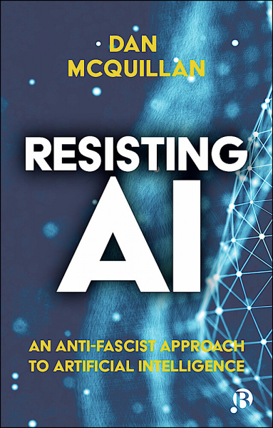

Large language models (LLMs) like the GPT family learn the statistical structure of language by optimising their ability to [predict missing words in sentences](https://www.assemblyai.com/blog/how-chatgpt-actually-works/) (as in 'The cat sat on the \[BLANK\]'). Despite the impressive technical ju-jitsu of [transformer models](http://jalammar.github.io/illustrated-transformer/) and the billions of parameters they learn, it's still a computational guessing game. ChatGPT is, in technical terms, a 'bullshit generator'. If a generated sentence makes sense to you, the reader, it means the mathematical model has made sufficiently good guess to pass your sense-making filter. The language model has no idea what it's talking about because it has no idea about anything at all. It's more of a bullshitter than the most egregious egoist you'll ever meet, producing baseless assertions with [unfailing confidence](https://www.theregister.com/2022/12/12/chatgpt_has_mastered_the_confidence/) because that's what it's designed to do. It's a bonus for the parent corporation when journalists and academics respond by generating acres of breathless coverage, which works as PR even when expressing concerns about the end of human creativity.  

像GPT系列这样的大型语言模型（LLMs）通过优化其预测句子中缺失单词的能力来学习语言的统计结构（如 "猫坐在\[空白\]上"）。尽管转化器模型的技术令人印象深刻，而且它们学习了数十亿个参数，但这仍然是一个计算上的猜测游戏。用技术术语来说，ChatGPT是一个 "废话发生器"。如果一个生成的句子对你这个读者来说是有意义的，这意味着数学模型已经做出了足够好的猜测，以通过你的意义过滤器。语言模型不知道它在说什么，因为它对任何事情都没有概念。它比你见过的最恶劣的利己主义者更会胡说八道，以不变应万变的信心做出毫无根据的断言，因为这就是它的设计。当记者和学者们通过产生大量令人窒息的报道来回应时，这对母公司来说是一种奖励，即使在表达对人类创造力终结的担忧时，这也是一种公关。

Unsuspecting users who've been conditioned on Siri and Alexa assume that the smooth talking ChatGPT is somehow [tapping into reliable sources of knowledge](https://iai.tv/articles/all-knowing-machines-are-a-fantasy-auid-2334), but it can only draw on the (admittedly vast) proportion of the internet it ingested at training time. Try asking Google's BERT model about Covid or ChatGPT about the latest developments in the Ukraine conflict. Ironically, these models are unable to cite their own sources, even in instances where it's obvious they're [plagiarising their training data](https://futurism.com/cnet-ai-plagiarism). The nature of ChatGPT as a bullshit generator makes it harmful, and it becomes more harmful the more optimised it becomes. If it produces plausible articles or [computer code](https://www.theverge.com/2022/12/5/23493932/chatgpt-ai-generated-answers-temporarily-banned-stack-overflow-llms-dangers) it means the inevitable hallucinations are becoming harder to spot. If a language model suckers us into trusting it then it has succeeded in becoming the industry's holy grail of ['trustworthy AI'](https://commission.europa.eu/publications/white-paper-artificial-intelligence-european-approach-excellence-and-trust_en); the problem is, trusting any form of machine learning is what leads to a single mother having their [front door kicked open by social security officials](https://www.lighthousereports.nl/investigation/the-algorithm-addiction/) because a predictive algorithm has fingered them as a probable fraudster, alongside many other instances of algorithmic violence.  

不知情的用户已经被Siri和Alexa调教过了，他们认为说话流畅的ChatGPT在某种程度上是在挖掘可靠的知识来源，但它只能利用它在训练时摄入的（公认的巨大）互联网的比例。试着向谷歌的BERT模型询问Covid或ChatGPT询问乌克兰冲突的最新进展。具有讽刺意味的是，这些模型无法引用自己的来源，甚至在明显剽窃其训练数据的情况下也是如此。ChatGPT作为一个废话生成器的性质使它变得有害，而且越是优化就越有害。如果它产生了可信的文章或计算机代码，就意味着不可避免的幻觉越来越难以发现。如果一个语言模型让我们相信它，那么它就成功地成为了业界 "值得信赖的人工智能 "的圣杯；问题是，相信任何形式的机器学习都会导致一个单身母亲被社会安全官员踢开前门，因为预测算法认为他们可能是骗子，还有许多其他算法暴力的例子。

Of course, the makers of GPT learned by experience that an untended LLM will tend to spew [Islamophobia or other hatespeech](https://www.nature.com/articles/s42256-021-00359-2) in addition to talking nonsense. The technical addition in ChatGPT is known as [Reinforcement Learning from Human Feedback (RHLF)](https://huggingface.co/blog/rlhf). While the whole point of an LLM is that the training data set is too huge for human labelling, a small subset of curated data is used to build a monitoring system which attempts to constrain output against criteria for relevance and non-toxicity. It can't change the fact that the underlying language patterns were learned from the raw internet, including all the ravings and conspiracy theories. While RLHF makes for a better brand of bullshit, it doesn't take too much ingenuity in user prompting to [reveal the bile](https://twitter.com/spiantado/status/1599462375887114240) that can lie beneath. The more plausible ChatGPT becomes, the more it recapitulates the pseudo-authoritative rationalisations of race science. It also shows that despite the boast that LLMs are largely self-training, any real world system will require precaritised 'ghost work' to maintain its plausibility. It turns out that AI is not sci-fi but a techologised intensification of existing relations of labour and power. The [$2/hour paid to outsourced workers in Kenya](https://time.com/6247678/openai-chatgpt-kenya-workers/) so they could be "tortured" by having to tag obscene material for removal is figurative of the invisible and gendered labour of care that always already holds up our existing systems of business and government.  

当然，GPT的制作者从经验中了解到，一个没有经过训练的LLM除了胡言乱语之外，还会倾向于喷出伊斯兰恐惧症或其他仇恨言论。ChatGPT中的技术补充被称为从人类反馈中强化学习（RHLF）。虽然LLM的全部意义在于训练数据集对于人类标签来说过于庞大，但一小部分策划好的数据被用来建立一个监控系统，试图根据相关性和非毒性的标准来约束输出。它不能改变这样一个事实，即底层语言模式是从原始互联网中学习的，包括所有的狂言和阴谋论。虽然RLHF使得废话的品牌更好，但它不需要在用户提示方面有太多的独创性就能揭示出隐藏在下面的胆汁。ChatGPT变得越是可信，它就越是重现了种族科学的伪权威性的合理化。它还表明，尽管吹嘘法律硕士在很大程度上是自我培训的，但任何现实世界的系统都需要预设的 "幽灵工作 "来维持其合理性。事实证明，人工智能不是科幻作品，而是现有劳动和权力关系的技术化强化。 支付给肯尼亚外包工人的2美元/小时，使他们可以通过标记淫秽材料进行清除而受到 "折磨"，这是对无形和性别化的护理劳动的具象化，它始终已经支撑着我们现有的商业和政府系统。

As with the rest of AI, the dangers of ChatGPT go far deeper than bias and discrimination. Despite [evidence](https://arxiv.org/abs/2202.07206) that the model's powers of 'reasoning' are shallow heuristics based on the frequency of associations in the training data (meaning, as an illustrative example, that it's good at answering 'What is 24 x 18?' and poor at answering 'What is 23 x 18?') there are many in the AI community who insist on imputing emergent properties of reasoning and insight to ChatGPT. Its parent company, OpenAI, was set up "to ensure that artificial general intelligence benefits all of humanity", where 'artificial general intelligence' (AGI) is the insider term used for human-like intelligence that goes beyond narrow AI like facial recognition or self-driving cars. However, as I spell out in [my book](https://bristoluniversitypress.co.uk/resisting-ai), the concept of AGI is inseparable from the kind of hierarchy of intelligence that has underpinned ideas of innate supremacy since the days of empire and colonialism. Hardly surprising, then, that the same Silicon Valley cultures that incubate enthusiasm for ChatGPT as emergent AGI also show allegiance to associated world views like [Long Termism](https://aeon.co/essays/why-longtermism-is-the-worlds-most-dangerous-secular-credo), where the immediate vulnerability of millions of ordinary people counts as nothing in relation to the prospects of a future space-faring super race.  

与其他人工智能一样，ChatGPT的危险性远比偏见和歧视更深。尽管有证据表明该模型的 "推理 "能力是基于训练数据中的关联频率的浅层启发式方法（这意味着，作为一个说明性的例子，它擅长回答 "什么是24 x 18？"而不擅长回答 "什么是23 x 18？"），但在人工智能社区中有许多人坚持将推理和洞察力的新兴属性归于ChatGPT。其母公司OpenAI的成立是为了 "确保人工通用智能造福全人类"，其中 "人工通用智能"（AGI）是一个内部术语，指的是超越面部识别或自动驾驶汽车等狭义人工智能的类人智慧。然而，正如我在书中所阐述的那样，AGI的概念与智力等级制度密不可分，而这种等级制度自帝国和殖民主义时代以来一直支撑着先天至上的观念。 因此，毫不奇怪的是，孵化ChatGPT作为新兴AGI的热情的硅谷文化也显示出对相关世界观的忠诚，如长期主义，其中数百万普通人的直接脆弱性与未来的太空超级种族的前景相比不算什么。

In the mean time, OpenAI is [acquiring billions of dollars](https://www.forbes.com/sites/qai/2023/01/27/microsoft-confirms-its-10-billion-investment-into-chatgpt-changing-how-microsoft-competes-with-google-apple-and-other-tech-giants/) of investment on the back of the ChatGPT hype. The point here is not only the pocketing of a pyramid-scale payoff but the reasons why institutions and governments are prepared to invest so much in these technologies. For these players, the seductive vision isn't real AI (whatever that is) but technologies that are good enough to replace human workers or, more importantly, to precaritise them and undermine them. ChatGPT isn't really new but simply an iteration of the class war that's been waged since the start of the industrial revolution. That allegedly well-informed commentators can infer that ChatGPT will be used for ["cutting staff workloads"](https://www.jisc.ac.uk/news/does-chatgpt-mean-the-end-of-the-essay-as-an-assessment-tool-10-jan-2023) rather than for further staff cuts illustrates a general failure to understand AI as a political project. Contemporary AI, as I argue in my book, is an assemblage for automatising administrative violence and amplifying austerity. ChatGPT is a part of a reality distortion field that obscures the underlying extractivism and diverts us into asking the wrong questions and worrying about the wrong things. Instead of expressing wonder, we should be asking whether it's justifiable to burn energy at ["eye watering"](https://twitter.com/sama/status/1599669571795185665) rates to power the world's largest bullshit machine.  

与此同时，OpenAI在ChatGPT炒作的背景下获得了数十亿美元的投资。这里的重点不仅是将金字塔规模的回报收入囊中，而且是机构和政府准备在这些技术上投资这么多的原因。对这些参与者来说，诱人的愿景不是真正的人工智能（无论它是什么），而是足以取代人类工人的技术，或者更重要的是，使他们先入为主并破坏他们。ChatGPT其实并不新鲜，只是自工业革命开始以来一直在进行的阶级战争的迭代。据称消息灵通的评论员可以推断出ChatGPT将被用于 "减少员工的工作量"，而不是用于进一步裁员，这说明人们普遍没有把人工智能理解为一个政治项目。正如我在书中所说，当代人工智能是一个使行政暴力自动化和扩大紧缩的集合体。ChatGPT是一个现实扭曲场的一部分，它掩盖了潜在的榨取主义，并使我们转向问错误的问题和担心错误的事情。 我们不应该表示惊奇，而是应该问，以 "令人瞠目结舌 "的速度燃烧能源为世界上最大的废话机器提供动力是否合理。

Commentary that claims 'ChatGPT is here to stay and we just need to learn to live with it' are embracing the hopelessness of what I call ['AI Realism'](https://en.wikipedia.org/wiki/Capitalist_Realism). The compulsion to show 'balance' by always referring to AI's alleged potential for good should be dropped by acknowledging that the social benefits are still speculative while the harms have been empirically demonstrated. Saying, as the [OpenAI CEO does](https://twitter.com/sama/status/1599471830255177728), that we are all ['stochastic parrots'](https://dl.acm.org/doi/10.1145/3442188.3445922) like large language models, statistical generators of learned patterns that express nothing deeper, is [a form of nihilism](https://davidgolumbia.medium.com/chatgpt-should-not-exist-aab0867abace). Of course, the elites don't apply that to themselves, just to the rest of us. The structural injustices and supremacist perspectives layered into AI put it firmly on the path of eugenicist solutions to social problems.  

声称 "ChatGPT将继续存在，我们只需要学会与它相处 "的评论是在接受我所说的 "AI现实主义 "的无望。通过总是提及人工智能的所谓潜力来显示 "平衡 "的强迫性，应该通过承认社会效益仍然是猜测性的，而危害已经被经验证明来放弃。像OpenAI的首席执行官那样说，我们都是 "随机鹦鹉"，就像大型语言模型，是学习模式的统计生成器，不表达任何更深层次的东西，这是一种虚无主义的形式。当然，精英们并不把这句话用在自己身上，只是用在我们其他人身上。分层在人工智能中的结构性不公正和至上主义观点使它坚定地走上了优生主义解决社会问题的道路。

Instead of reactionary solutionism, let us ask where the technologies are that people really need. Let us reclaim the idea of socially useful production, of technological developments that start from community needs. The post-Covid 'new normal' has turned out to involve both the normalisation of neural networks and a rise in necropolitics. Transformer models and diffusion models are not creative but carceral - they and other forms of AI imprison our ability to imagine real alternatives. It's not so long ago that we all woke up to the identity of truly essential workers; the people carrying out the precaritised roles of nursing, teaching, caring, delivering and cleaning, the very professions who are being forced to [reinvent the idea of the general strike](https://uk.news.yahoo.com/uk-rocked-mass-day-strikes-050000151.html) simply to regain the conditions for survival. Instead of being complicit with expensive toys running in carbon emitting data centres, we can focus instead on centring activities of care. As discussed in more detail in ['Resisting AI'](https://bristoluniversitypress.co.uk/resisting-ai), a refusal of algorithmic immiseration goes along with a positive search for alternatives, and I lay out a programme of people's councils and commons-based solidarity to do just that. It's not time to chat with AI, but to [resist it](https://irisvanrooijcogsci.com/2023/01/14/stop-feeding-the-hype-and-start-resisting/).  

与其说是反动的解决方案，不如说是让我们问问人们真正需要的技术在哪里。让我们重拾社会有用的生产理念，重拾从社区需求出发的技术发展。后科维德时代的 "新常态 "已被证明既涉及到神经网络的正常化，也涉及到死亡政治学的崛起。转化器模型和扩散模型不是创造性的，而是腐化性的--它们和其他形式的人工智能禁锢了我们想象真正替代方案的能力。不久前，我们都意识到了真正的基本工人的身份；那些从事护理、教学、照料、送餐和清洁等早熟角色的人，正是这些职业被迫重塑大罢工的理念，只是为了重新获得生存的条件。与其与在碳排放数据中心运行的昂贵玩具同流合污，我们可以把注意力集中在护理活动上。正如在 "抵制人工智能 "中详细讨论的那样，拒绝算法上的放任，同时积极寻找替代方案，我提出了一个人民委员会和基于公地的团结的方案来做到这一点。 现在不是与人工智能聊天的时候，而是要抵制它.

  

[Resisting AI - An Anti-fascist Approach to Artificial Intelligence, Bristol University Press, 2022  

抵制人工智能--对人工智能的反法西斯主义方法》，布里斯托尔大学出版社，2022年](https://bristoluniversitypress.co.uk/resisting-ai)
