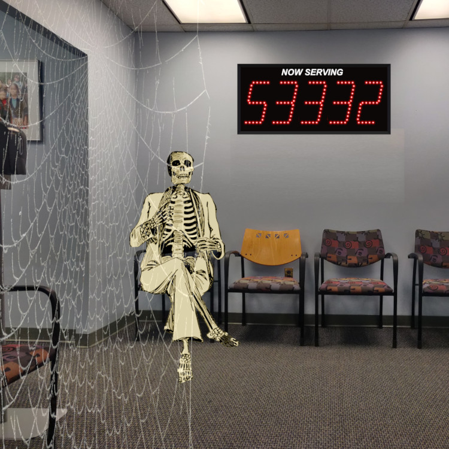

  

## Today's links 今天的链接

-   [Poor people pay higher time tax](https://pluralistic.net/2023/02/10/my-time/#like-water-down-the-drain): The rich truly do get more hours in the day.  
    
    穷人支付更高的时间税：富人确实每天有更多的时间。
-   [Hey look at this](https://pluralistic.net/2023/02/10/my-time/#linkdump): Delights to delectate.  
    
    嘿，看看这个：令人愉悦的喜悦。
-   [This day in history](https://pluralistic.net/2023/02/10/my-time/#retro): 2003, 2013, 2018, 2022  
    
    历史上的今天：2003 年、2013 年、2018 年、2022 年
-   [Colophon](https://pluralistic.net/2023/02/10/my-time/#bragsheet): Recent publications, upcoming/recent appearances, current writing projects, current reading  
    
    Colophon : 最近的出版物，即将/最近出现，当前的写作项目，当前的阅读

___

  

## Poor people pay higher time tax ([permalink](https://pluralistic.net/2023/02/10/my-time/#like-water-down-the-drain))  

穷人支付更高的时间税（永久链接）

Doubtless you've heard that "we all get the same 24 hours in the day." Of course it's not true: rich people and poor people experience very different demands on their time. The richer you are, the more your time is your own – not only are many systems arranged with your convenience in mind, but you also command the social power to do something about systems that abuse your time.  

毫无疑问，您听说过“我们一天 24 小时都是一样的”。这当然不是真的：富人和穷人对时间的需求非常不同。你越富有，你的时间就越属于你自己——不仅许多系统都是为了你的方便而安排的，而且你还命令社会力量对滥用你时间的系统采取一些措施。

If you'd like an essay-formatted version of this post to read or share, here's a link to it on pluralistic.net, my surveillance-free, ad-free, tracker-free blog:  

如果您想阅读或分享这篇文章的论文格式版本，请在 pluralistic.net 上找到它的链接，这是我的无监控、无广告、无跟踪器的博客：

[https://pluralistic.net/2023/02/10/my-time/#like-water-down-the-drain](https://pluralistic.net/2023/02/10/my-time/#like-water-down-the-drain)

For example: if you live in most American cities, public transit is slow, infrequent and overcrowded. Without a car, you lose hours every day to a commute spent standing on a lurching bus. And while a private car can substantially shorted that commute, people who can afford taxis or Ubers get even more time every day.  

例如：如果您居住在大多数美国城市，公共交通速度缓慢、班次稀少且人满为患。如果没有汽车，您每天都会因为站在摇摇晃晃的公共汽车上而浪费数小时的时间。虽然私家车可以大大缩短通勤时间，但能够负担得起出租车或优步的人每天可以获得更多时间。

There's a thick anthropological literature on the ways that cash-poverty translates into #TimePoverty. In David Graeber's must-read essay "The Utopia of Rules," he nails the way that capitalist societies generate Soviet-style bureaucracies, especially for poor people. Means-testing for benefits means that poor people spend endless hours filling in forms, waiting on hold, and lining up to see caseworkers to prove that they are among the "deserving poor" – not "mooches" who are defrauding the system:  

关于现金贫困转化为#TimePoverty 的方式，有大量的人类学文献。在大卫格雷伯的必读文章“规则的乌托邦”中，他指出了资本主义社会产生苏联式官僚机构的方式，特别是对穷人而言。福利的经济状况调查意味着穷人要花无穷无尽的时间填写表格、等待和排队见个案工作者，以证明他们属于“应得的穷人”——而不是欺骗系统的“骗子”：

[https://memex.craphound.com/2015/02/02/david-graebers-the-utopia-of-rules-on-technology-stupidity-and-the-secret-joys-of-bureaucracy/](https://memex.craphound.com/2015/02/02/david-graebers-the-utopia-of-rules-on-technology-stupidity-and-the-secret-joys-of-bureaucracy/)

The social privilege gradient is also a time gradient: if you can afford a plane ticket, you can travel quickly across the country rather than losing days to the Greyhound or a road-trip. But if you're even richer, you can pay for TSA Precheck and cut your airport security time from an hour to minutes. Go further up the privilege gradient and you'll acquire airline status, shaving another hour off the check-in process.  

社会特权梯度也是一个时间梯度：如果你买得起机票，你就可以快速穿越全国，而不是浪费几天时间去灰狗或公路旅行。但如果您更富有，您可以支付 TSA Precheck 费用并将机场安检时间从一小时缩短至几分钟。进一步提升特权梯度，您将获得航空公司身份，将办理登机手续的时间再缩短一个小时。

This qualitative account of time poverty is well-developed, but it's lacked a good, detailed _quantitative_ counterpart, and our society often discounts qualitative work as mere anecdote and insists on having every story converted to numbers before it is taken seriously.  

这种对时间贫困的定性描述已经很成熟，但它缺乏一个好的、详细的定量对应物，而且我们的社会经常将定性工作视为纯粹的轶事，并坚持在认真对待每个故事之前将其转化为数字。

In "Examining inequality in the time cost of waiting," published this month in _Nature Human Behavior,_ public affairs researchers Steve Holt (SUNY) and Katie Vinopal (Ohio State) analyze data from the American Time Use Survey (AUTS) to produce a detailed, vibrant quantitative backstop to the qualitative narrative about time poverty:  

在本月发表在《自然人类行为》杂志上的“检查等待时间成本的不平等”一文中，公共事务研究人员史蒂夫霍尔特（纽约州立大学）和凯蒂维诺帕尔（俄亥俄州）分析了美国时间使用调查（AUTS）的数据，以产生详细的，关于时间贫困的定性叙述的充满活力的定量支持：

[https://www.nature.com/articles/s41562-023-01524-w](https://www.nature.com/articles/s41562-023-01524-w)

(The paper is paywalled, but the authors made a mostly final preprint available)  

（这篇论文是收费的，但作者提供了大部分最终的预印本）

[https://osf.io/preprints/socarxiv/jbk3x/download](https://osf.io/preprints/socarxiv/jbk3x/download)

The AUTS "collects retrospective time diary data from a nationally representative subsample drawn from respondents to the Census Bureau’s Community Population Survey (CPS) each year." These time-diary entries are sliced up in 15-minute chunks.  

AUTS“每年从人口普查局社区人口调查 (CPS) 的受访者中抽取具有全国代表性的子样本，收集回顾性时间日志数据。”这些时间日记条目被分成 15 分钟的块。

Here's what they found: first, there are categories of basic services where high-income people avoid waiting altogether, and where low-income people experience substantial waits. A person from a low-income household "an hour more waiting for the same set of services than people from high-income household." That's 73 hours/year.  

以下是他们的发现：首先，在某些基本服务类别中，高收入人群可以完全避免等待，而低收入人群则需要大量等待。来自低收入家庭的人“比来自高收入家庭的人多等待一个小时的相同服务”。那是 73 小时/年。

Some of that gap (5%) is attributable to proximity. Richer people don't have to go as far to access the same services as poorer people. Travel itself accounts for 2% more – poorer people wait longer for buses and have otherwise worse travel options.  

部分差距 (5%) 归因于距离。富人不必走那么远就能获得与穷人相同的服务。旅行本身占 2% 以上——越穷的人等公共汽车的时间越长，否则旅行选择就越差。

A larger determinant of the gap (25%) is working flexibility. Poor people work jobs where they have less freedom to take time off to receive services, so they are forced to take appointments during peak hours.  

更大的差距决定因素 (25%) 是工作灵活性。穷人工作的地方他们没有足够的时间请假接受服务，因此他们被迫在高峰时段预约。

Specific categories show more stark difference. If a poor person and a wealthy person go to the doctor's on the same day, the poor person waits 46.28m to receive care, while the wealthy person waits 28.75m. The underlying dynamic here isn't hard to understand. Medical practices that serve rich people have more staff.  

特定类别显示出更明显的差异。如果一个穷人和一个富人同一天去看医生，穷人等待 46.28m 就诊，而富人等待 28.75m。这里的潜在动态并不难理解。为富人服务的医疗机构拥有更多员工。

The same dynamic plays out in grocery stores: poor people wait an average of 24m waiting every time they go shopping. For rich people, it's 15m. Poor people don't just wait in longer lines – they also have to wait for understaffed stores to unlock the cases that basic necessities are locked behind (poor people also travel longer to get to the grocery store – and they travel by slower means).  

同样的动态在杂货店上演：穷人每次去购物平均要等 2400 万。对于有钱人来说，是15m。穷人不仅要排更长的队——他们还必须等待人手不足的商店解锁基本必需品被锁在后面的情况（穷人去杂货店的路程也更长——而且他们的出行方式更慢）。

A member of a poor household with a chronic condition that requires two clinic visits per month loses an additional five hours/year to waiting rooms when compared to a wealthy person. As the authors point out, this also translates to delayed care, missed appointments, and exacerbated health conditions. Time poverty leads to health poverty.  

与富人相比，患有慢性病且每月需要两次诊所就诊的贫困家庭成员每年在候诊室的时间要多损失 5 个小时。正如作者所指出的，这也意味着延迟护理、错过约会和恶化的健康状况。时间贫困导致健康贫困。

All of this is worse for people of color: "Low-income White and Black Americans are both more likely to wait when seeking services than their wealthier same-race peer" but "wealthier White people face an average wait time of 28 minutes while wealthier Black people face a 54 minute average wait time…wealthier Black people do not receive the same time-saving attention from service providers that wealthier non-Black people receive" (there's a smaller gap for Latino people, and no observed gap for Asian Americans.)  

所有这一切对有色人种来说更糟糕：“低收入的白人和黑人美国人在寻求服务时比他们更富有的同种族同龄人更有可能等待”，但“更富有的白人面临 28 分钟的平均等待时间，而更富有黑人面临 54 分钟的平均等待时间……较富有的黑人没有像较富裕的非黑人那样从服务提供商那里得到同样的节省时间的关注”（拉丁裔人的差距较小，亚裔美国人没有观察到差距。 )

The gender gap is more complicated: "Low-income women are 3 percentage points more likely than low-income men and high-income women are 6 percentage points more likely than high-income men to use common services" – it gets even worse for low-income mothers, who take on the time-burdens associated with their kids' need to access services.  

性别差距更为复杂：“低收入女性使用公共服务的可能性比低收入男性高 3 个百分点，高收入女性比高收入男性高 6 个百分点”——情况更糟低收入的母亲，她们承担了与孩子需要获得服务相关的时间负担。

Surprisingly, men actually end up waiting longer than women to access services: "low-income men spend about 6 more minutes than low-income women waiting for service…high-income men spend about 12 more minutes waiting for services than high-income women."  

令人惊讶的是，男性最终等待服务的时间实际上比女性更长：“低收入男性比低收入女性多花 6 分钟等待服务……高收入男性比高收入女性多花 12 分钟等待服务”

Given the important role that scheduling flexibility plays in the time gap, the authors propose that interventions like subsidized day-care and afterschool programming could help parents access services at off-peak hours. They also echo Graeber's call for reduced paperwork burdens for receiving benefits and accessing public services.  

鉴于日程安排的灵活性在时间差距中发挥的重要作用，作者提出，补贴日托和课后计划等干预措施可以帮助父母在非高峰时段获得服务。他们还响应 Graeber 的呼吁，即减少领取福利和获得公共服务的文书工作负担。

They recommend changes to labor law to protect the right of low-waged workers to receive services during off-peak hours, in the manner of their high-earning peers (they reference research that shows that this also improves worker productivity and is thus a benefit to employers as well as workers).  

他们建议修改劳动法，以保护低收入工人在非高峰时段以高收入同龄人的方式接受服务的权利（他们参考的研究表明，这也提高了工人的生产力，因此是一种福利对雇主和工人）。

Finally, they come to the obvious point: making people less cash-poor will alleviate their time-poverty. Higher minimum wages, larger earned income tax credits, investments in low-income neighborhoods and better public transit will all give poor people more time and more money with which to command better services.  

最后，他们得出了一个明显的观点：减少人们的现金匮乏将减轻他们的时间匮乏。更高的最低工资、更大的收入所得税抵免、对低收入社区的投资和更好的公共交通都会给穷人更多的时间和更多的钱来获得更好的服务。

___

## Hey look at this ([permalink](https://pluralistic.net/2023/02/10/my-time/#linkdump))  

嘿，看看这个（永久链接）

-   Participation in the Fediverse [https://www.eff.org/deeplinks/2023/02/participation-fediverse](https://www.eff.org/deeplinks/2023/02/participation-fediverse)  
    
    参与 Fediverse [https://www.eff.org/deeplinks/2023/02/participation-fediverse](https://www.eff.org/deeplinks/2023/02/participation-fediverse)
-   Is Mastodon a commons? [https://blogs.harvard.edu/doc/2023/02/08/is-mastodon-a-commons/](https://blogs.harvard.edu/doc/2023/02/08/is-mastodon-a-commons/)  
    
    Mastodon 是公地吗？ [https://blogs.harvard.edu/doc/2023/02/08/is-mastodon-a-commons/](https://blogs.harvard.edu/doc/2023/02/08/is-mastodon-a-commons/)
    
-   Monster Rangers RPG [https://www.kickstarter.com/projects/steamcrow/monster-rangers-rpg](https://www.kickstarter.com/projects/steamcrow/monster-rangers-rpg)  
    
    怪物游骑兵角色扮演游戏 [https://www.kickstarter.com/projects/steamcrow/monster-rangers-rpg](https://www.kickstarter.com/projects/steamcrow/monster-rangers-rpg)
    

___

  

## This day in history ([permalink](https://pluralistic.net/2023/02/10/my-time/#retro))  

历史上的今天（永久链接）

#20yrsago How blogs got an A-list [https://web.archive.org/web/20030220025754/http://shirky.com/writings/powerlaw\_weblog.html](https://web.archive.org/web/20030220025754/http://shirky.com/writings/powerlaw_weblog.html)  

#20yrsago 博客如何获得 A-list [https://web.archive.org/web/20030220025754/http://shirky.com/writings/powerlaw\_weblog.html](https://web.archive.org/web/20030220025754/http://shirky.com/writings/powerlaw_weblog.html)

#20yrsago Neil Gershenfeld pulls down the pants of ubicomp [https://web.archive.org/web/20030203152613/http://flow.doorsofperception.com/content/gershenfeld\_trans.html](https://web.archive.org/web/20030203152613/http://flow.doorsofperception.com/content/gershenfeld_trans.html)  

#20yrsago Neil Gershenfeld 拉下 ubicomp [https://web.archive.org/web/20030203152613/http://flow.doorsofperception.com/content/gershenfeld\_trans.html](https://web.archive.org/web/20030203152613/http://flow.doorsofperception.com/content/gershenfeld_trans.html) 的裤子

#10yrsago Star Wars easter-egg hidden in a traceroute [https://memex.craphound.com/2013/02/09/star-wars-easter-egg-hidden-in-a-traceroute/](https://memex.craphound.com/2013/02/09/star-wars-easter-egg-hidden-in-a-traceroute/)  

#10yrsago Star Wars 复活节彩蛋隐藏在 traceroute [https://memex.craphound.com/2013/02/09/star-wars-easter-egg-hidden-in-a-traceroute/](https://memex.craphound.com/2013/02/09/star-wars-easter-egg-hidden-in-a-traceroute/)

#10yrsago Seattle Mayor returns police drones to the manufacturer [https://www.thestranger.com/blogs/2013/02/07/15954706/mayor-will-kill-spds-drone-program](https://www.thestranger.com/blogs/2013/02/07/15954706/mayor-will-kill-spds-drone-program)  

#10yrsago 西雅图市长将警用无人机归还给制造商 [https://www.thestranger.com/blogs/2013/02/07/15954706/mayor-will-kill-spds-drone-program](https://www.thestranger.com/blogs/2013/02/07/15954706/mayor-will-kill-spds-drone-program)

#10yrsago Guerrilla Benchers replace street furniture removed to discourage homeless people [https://www.spacehijackers.org/html/projects/guerrillabench/guerrilla.html](https://www.spacehijackers.org/html/projects/guerrillabench/guerrilla.html)  

#10yrsago Guerrilla Benchers 更换街头家具，以阻止无家可归的人 [https://www.spacehijackers.org/html/projects/guerrillabench/guerrilla.html](https://www.spacehijackers.org/html/projects/guerrillabench/guerrilla.html)

#10yrsago DHS watchdog: DHS can search all your devices within 100 mi of US border [https://www.wired.com/2013/02/electronics-border-seizures/](https://www.wired.com/2013/02/electronics-border-seizures/)  

#10yrsago DHS 看门狗：DHS 可以搜索美国边境 100 英里范围内的所有设备 [https://www.wired.com/2013/02/electronics-border-seizures/](https://www.wired.com/2013/02/electronics-border-seizures/)

#10yrsago Confessions of a fifth grade punk [https://thisishangingrockcomics.tumblr.com/post/42546243887/actual-diary-entry-from-when-i-was-in-5th-grade-oh](https://thisishangingrockcomics.tumblr.com/post/42546243887/actual-diary-entry-from-when-i-was-in-5th-grade-oh)  

#10yrsago 五年级朋克的自白 [https://thisishangingrockcomics.tumblr.com/post/42546243887/actual-diary-entry-from-when-i-was-in-5th-grade-oh](https://thisishangingrockcomics.tumblr.com/post/42546243887/actual-diary-entry-from-when-i-was-in-5th-grade-oh)

#5yrsago Leaked Equifax documents provided to US Senate reveal that they dumped all our drivers’ licenses, too, but Equifax says it’s OK, so… [https://money.cnn.com/2018/02/09/pf/equifax-hack-senate-disclosure/index.html](https://money.cnn.com/2018/02/09/pf/equifax-hack-senate-disclosure/index.html)  

#5yrsago 向美国参议院提供的泄露的 Equifax 文件显示，他们也丢弃了我们所有的驾驶执照，但 Equifax 说没关系，所以…… [https://money.cnn.com/2018/02/09/pf/equifax-hack-senate-disclosure/index.html](https://money.cnn.com/2018/02/09/pf/equifax-hack-senate-disclosure/index.html)

#5yrsago Motherboard files legal complaint against London police to force it to explain why an officer bought creepy, potentially illegal stalkerware [https://www.vice.com/en/article/zmwnm3/metropolitan-police-flexispy-legal-complaint](https://www.vice.com/en/article/zmwnm3/metropolitan-police-flexispy-legal-complaint)  

#5yrsago Motherboard 对伦敦警方提出法律申诉，迫使其解释为什么一名警官购买了令人毛骨悚然、可能非法的跟踪软件 [https://www.vice.com/en/article/zmwnm3/metropolitan-police-flexispy-legal-complaint](https://www.vice.com/en/article/zmwnm3/metropolitan-police-flexispy-legal-complaint)

#5yrsago Empire Games: Charlie Stross starts a new phase in the Merchant Princes series, blending spycraft, Leninist thought experiments, and parallel dimensions [https://memex.craphound.com/2018/02/09/empire-games-charlie-stross-starts-a-new-phase-in-the-merchant-princes-series-blending-spycraft-leninist-thought-experiments-and-parallel-dimensions/](https://memex.craphound.com/2018/02/09/empire-games-charlie-stross-starts-a-new-phase-in-the-merchant-princes-series-blending-spycraft-leninist-thought-experiments-and-parallel-dimensions/)  

#5yrsago Empire Games：Charlie Stross 开始了商业王子系列的新阶段，融合了间谍、列宁主义思想实验和平行维度 [https://memex.craphound.com/2018/02/09/empire-games-charlie-stross-starts-a-new-phase-in-the-merchant-princes-series-blending-spycraft-leninist-thought-experiments-and-parallel-dimensions/](https://memex.craphound.com/2018/02/09/empire-games-charlie-stross-starts-a-new-phase-in-the-merchant-princes-series-blending-spycraft-leninist-thought-experiments-and-parallel-dimensions/)

#1yrago Occupy the SEC on bank mergers [https://pluralistic.net/2022/02/09/grievance-factory/#too-big-to-fail](https://pluralistic.net/2022/02/09/grievance-factory/#too-big-to-fail)  

#1yrago 在银行合并问题上占领 SEC [https://pluralistic.net/2022/02/09/grievance-factory/#too-big-to-fail](https://pluralistic.net/2022/02/09/grievance-factory/#too-big-to-fail)

#1yrago Litigation finance pits greed against greed [https://pluralistic.net/2022/02/09/grievance-factory/#champerty](https://pluralistic.net/2022/02/09/grievance-factory/#champerty)  

#1yrago 诉讼金融将贪婪与贪婪对立起来 [https://pluralistic.net/2022/02/09/grievance-factory/#champerty](https://pluralistic.net/2022/02/09/grievance-factory/#champerty)

#1yrago Gators and Amazon tag-team small sellers [https://pluralistic.net/2022/02/10/monopoly-begets-monopoly/#gator-ade](https://pluralistic.net/2022/02/10/monopoly-begets-monopoly/#gator-ade)  

#1yrago Gators 和亚马逊双打小卖家 [https://pluralistic.net/2022/02/10/monopoly-begets-monopoly/#gator-ade](https://pluralistic.net/2022/02/10/monopoly-begets-monopoly/#gator-ade)

#1yrago Neuromancer today [https://pluralistic.net/2022/02/10/monopoly-begets-monopoly/#radar-angels](https://pluralistic.net/2022/02/10/monopoly-begets-monopoly/#radar-angels)  

#1yrago 神经漫游者今天 [https://pluralistic.net/2022/02/10/monopoly-begets-monopoly/#radar-angels](https://pluralistic.net/2022/02/10/monopoly-begets-monopoly/#radar-angels)

#1ytago SEC vs private equity ripoffs [https://pluralistic.net/2022/02/10/monopoly-begets-monopoly/#gary-gensler](https://pluralistic.net/2022/02/10/monopoly-begets-monopoly/#gary-gensler)  

#1ytago SEC 与私募股权盗窃 [https://pluralistic.net/2022/02/10/monopoly-begets-monopoly/#gary-gensler](https://pluralistic.net/2022/02/10/monopoly-begets-monopoly/#gary-gensler)

#1yrago Welcome to the Palmerverse [https://pluralistic.net/2022/02/10/monopoly-begets-monopoly/#terra-ignota](https://pluralistic.net/2022/02/10/monopoly-begets-monopoly/#terra-ignota)  

#1yrago 欢迎来到 Palmerverse [https://pluralistic.net/2022/02/10/monopoly-begets-monopoly/#terra-ignota](https://pluralistic.net/2022/02/10/monopoly-begets-monopoly/#terra-ignota)

___

  

## Colophon ([permalink](https://pluralistic.net/2023/02/10/my-time/#bragsheet)) Colophon（永久链接）

Today's top sources: Fipi Lele. 今日头条消息来源：Fipi Lele。

Currently writing: 目前正在写作：

-   Picks and Shovels, a Martin Hench noir thriller about the heroic era of the PC. Friday's progress: 512 words (104359 words total)  
    
    镐和铲子，一部关于 PC 英雄时代的 Martin Hench 黑色惊悚片。周五进度：512字（总计104359字）
-   The Bezzle, a Martin Hench noir thriller novel about the prison-tech industry. FIRST DRAFT COMPLETE, WAITING FOR EDITORIAL REVIEW  
    
    The Bezzle，一部关于监狱科技行业的 Martin Hench 黑色惊悚小说。初稿完成，等待编辑审查
    
-   A Little Brother short story about DIY insulin PLANNING  
    
    一个关于 DIY 胰岛素计划的小弟弟小故事
    
-   Vigilant, Little Brother short story about remote invigilation. ON SUBMISSION  
    
    警惕，小弟弟远程监考短篇小说。提交时
    
-   Moral Hazard, a short story for MIT Tech Review's 12 Tomorrows. FIRST DRAFT COMPLETE, ACCEPTED FOR PUBLICATION  
    
    道德风险，麻省理工科技评论的 12 明天的短篇小说。初稿完成，接受出版
    
-   Spill, a Little Brother short story about pipeline protests. ON SUBMISSION  
    
    溢出，关于管道抗议的小兄弟短篇小说。提交时
    

Currently reading: Analogia by George Dyson.  

当前阅读：乔治·戴森的类比法。

Latest podcast: Social Quitting [https://craphound.com/news/2023/01/22/social-quitting/](https://craphound.com/news/2023/01/22/social-quitting/)  

最新播客：社交戒烟 [https://craphound.com/news/2023/01/22/social-quitting/](https://craphound.com/news/2023/01/22/social-quitting/)

Upcoming appearances: 即将出场：

-   Chokepoint Capitalism: A Kiwi Perspective, Feb 13  
    
    咽喉资本主义：新西兰人的视角，2 月 13 日  
    
    [https://chokepoint-capitalism-a-kiwi-perspective.lilregie.com/booking/attendees/new](https://chokepoint-capitalism-a-kiwi-perspective.lilregie.com/booking/attendees/new)
-   Future of Arts, Culture & Technology, ACMI, (Melbourne), Feb 14  
    
    艺术、文化与科技的未来，ACMI，（墨尔本），2 月 14 日  
    
    [https://www.acmi.net.au/whats-on/in-conversation-cory-doctorow-rebecca-giblin-esther-anatolitis/](https://www.acmi.net.au/whats-on/in-conversation-cory-doctorow-rebecca-giblin-esther-anatolitis/)
    
-   State Library of NSW (Sydney), Feb 15  
    
    新南威尔士州立图书馆（悉尼），2 月 15 日  
    
    [https://www.sl.nsw.gov.au/events/chokepoint-capitalism-rebecca-giblin-and-cory-doctorow](https://www.sl.nsw.gov.au/events/chokepoint-capitalism-rebecca-giblin-and-cory-doctorow)
    
-   ANU/Canberra Times Meet The Author (Canberra), Feb 16  
    
    ANU/Canberra Times Meet The Author（堪培拉），2 月 16 日  
    
    [https://www.anu.edu.au/events/in-conversation-with-rebecca-giblin-and-cory-doctorow](https://www.anu.edu.au/events/in-conversation-with-rebecca-giblin-and-cory-doctorow)
    
-   Australian Digital Alliance Copyright Forum (Canberra), Feb 17  
    
    澳大利亚数字联盟版权论坛（堪培拉），2 月 17 日  
    
    [https://digital.org.au/2022/11/08/doctorow-giblin-first-speaker-announcement-ada-forum-2023/](https://digital.org.au/2022/11/08/doctorow-giblin-first-speaker-announcement-ada-forum-2023/)
    
-   Antitrust, Regulation and the Political Economy (Brussels), Mar 2  
    
    反托拉斯、监管和政治经济学（布鲁塞尔），3 月 2 日  
    
    [https://www.brusselsconference.com/registration](https://www.brusselsconference.com/registration)
    

Recent appearances: 近期出场：

-   How popular movements can topple Big Tech monopolies (Transnational Institute)  
    
    流行运动如何推翻大科技垄断（跨国研究所）  
    
    [https://www.tni.org/en/podcast/how-popular-movements-can-topple-big-tech-monopolies](https://www.tni.org/en/podcast/how-popular-movements-can-topple-big-tech-monopolies)
-   Chokepoint Capitalism: Can It Be Defeated? (UCL Institute of Brand and Innovation Law):  
    
    咽喉资本主义：它能被打败吗？ （伦敦大学学院品牌与创新法研究所）：  
    
    [https://www.youtube.com/watch?v=xs0c7qE-Yyk](https://www.youtube.com/watch?v=xs0c7qE-Yyk)
    
-   A theory of how internet platforms die (Marketplace Tech)  
    
    互联网平台如何消亡的理论（Marketplace Tech）  
    
    [https://www.marketplace.org/shows/marketplace-tech/a-theory-of-how-internet-platforms-die/](https://www.marketplace.org/shows/marketplace-tech/a-theory-of-how-internet-platforms-die/)
    

Latest books: 最新书籍：

-   "Chokepoint Capitalism: How to Beat Big Tech, Tame Big Content, and Get Artists Paid, with Rebecca Giblin", on how to unrig the markets for creative labor, Beacon Press/Scribe 2022 [https://chokepointcapitalism.com](https://chokepointcapitalism.com/)  
    
    “Chokepoint Capitalism：如何与 Rebecca Giblin 一起击败大型科技公司、驯服大型内容并让艺术家获得报酬”，关于如何释放创意劳动力市场，Beacon Press/Scribe 2022 [https://chokepointcapitalism.com](https://chokepointcapitalism.com/)
-   "Attack Surface": The third Little Brother novel, a standalone technothriller for adults. The _Washington Post_ called it "a political cyberthriller, vigorous, bold and savvy about the limits of revolution and resistance." Order signed, personalized copies from Dark Delicacies [https://www.darkdel.com/store/p1840/Available\_Now%3A\_Attack\_Surface.html](https://www.darkdel.com/store/p1840/Available_Now%3A_Attack_Surface.html)  
    
    “攻击面”：小弟弟的第三部小说，一部独立的成人科技惊悚片。 《华盛顿邮报》称其为“一部政治网络惊悚片，充满活力、大胆且对革命和抵抗的局限性了如指掌”。从 Dark Delicacies [https://www.darkdel.com/store/p1840/Available\_Now%3A\_Attack\_Surface.html](https://www.darkdel.com/store/p1840/Available_Now%3A_Attack_Surface.html) 订购签名的个性化副本
    
-   "How to Destroy Surveillance Capitalism": an anti-monopoly pamphlet analyzing the true harms of surveillance capitalism and proposing a solution. [https://onezero.medium.com/how-to-destroy-surveillance-capitalism-8135e6744d59](https://onezero.medium.com/how-to-destroy-surveillance-capitalism-8135e6744d59) (print edition: [https://bookshop.org/books/how-to-destroy-surveillance-capitalism/9781736205907](https://bookshop.org/books/how-to-destroy-surveillance-capitalism/9781736205907)) (signed copies: [https://www.darkdel.com/store/p2024/Available\_Now%3A\_\_How\_to\_Destroy\_Surveillance\_Capitalism.html](https://www.darkdel.com/store/p2024/Available_Now%3A__How_to_Destroy_Surveillance_Capitalism.html))  
    
    《如何摧毁监控资本主义》：一本反垄断小册子，分析监控资本主义的真正危害并提出解决方案。 [https://onezero.medium.com/how-to-destroy-surveillance-capitalism-8135e6744d59](https://onezero.medium.com/how-to-destroy-surveillance-capitalism-8135e6744d59) （印刷版： [https://bookshop.org/books/how-to-destroy-surveillance-capitalism/9781736205907](https://bookshop.org/books/how-to-destroy-surveillance-capitalism/9781736205907) ）（签名版： [https://www.darkdel.com/store/p2024/Available\_Now%3A\_\_How\_to\_Destroy\_Surveillance\_Capitalism.html](https://www.darkdel.com/store/p2024/Available_Now%3A__How_to_Destroy_Surveillance_Capitalism.html) ）
    
-   "Little Brother/Homeland": A reissue omnibus edition with a new introduction by Edward Snowden: [https://us.macmillan.com/books/9781250774583](https://us.macmillan.com/books/9781250774583); personalized/signed copies here: [https://www.darkdel.com/store/p1750/July%3A\_\_Little\_Brother\_%26\_Homeland.html](https://www.darkdel.com/store/p1750/July%3A__Little_Brother_%26_Homeland.html)  
    
    “小兄弟/国土”：重新发行的综合版，爱德华斯诺登的新介绍： [https://us.macmillan.com/books/9781250774583](https://us.macmillan.com/books/9781250774583) ；个性化/签名副本在这里： [https://www.darkdel.com/store/p1750/July%3A\_\_Little\_Brother\_%26\_Homeland.html](https://www.darkdel.com/store/p1750/July%3A__Little_Brother_%26_Homeland.html)
    
-   "Poesy the Monster Slayer" a picture book about monsters, bedtime, gender, and kicking ass. Order here: [https://us.macmillan.com/books/9781626723627](https://us.macmillan.com/books/9781626723627). Get a personalized, signed copy here: [https://www.darkdel.com/store/p2682/Corey\_Doctorow%3A\_Poesy\_the\_Monster\_Slayer\_HB.html#/](https://www.darkdel.com/store/p2682/Corey_Doctorow%3A_Poesy_the_Monster_Slayer_HB.html#/).  
    
    《怪物杀手诗》是一本关于怪物、就寝时间、性别和踢屁股的图画书。在这里订购： [https://us.macmillan.com/books/9781626723627](https://us.macmillan.com/books/9781626723627) 。在此处获取个性化的签名副本： [https://www.darkdel.com/store/p2682/Corey\_Doctorow%3A\_Poesy\_the\_Monster\_Slayer\_HB.html#/](https://www.darkdel.com/store/p2682/Corey_Doctorow%3A_Poesy_the_Monster_Slayer_HB.html#/) 。
    

Upcoming books: 即将出版的书籍：

-   Red Team Blues: "A grabby, compulsive thriller that will leave you knowing more about how the world works than you did before." Tor Books, April 2023  
    
    Red Team Blues：“一部引人入胜、令人欲罢不能的惊悚片，会让你比以前更了解这个世界是如何运转的。” Tor Books，2023 年 4 月
-   The Internet Con: A nonfiction book about interoperability and Big Tech, Verso, September 2023  
    
    互联网骗局：一本关于互操作性和大型科技的纪实书籍，Verso，2023 年 9 月
    
-   The Lost Cause: a post-Green New Deal eco-topian novel about truth and reconciliation with white nationalist militias, Tor Books, November 2023  
    
    The Lost Cause：一部关于真相与与白人民族主义民兵和解的后绿色新政生态乌托邦小说，Tor Books，2023 年 11 月
    

___

This work licensed under a Creative Commons Attribution 4.0 license. That means you can use it any way you like, including commercially, provided that you attribute it to me, Cory Doctorow, and include a link to pluralistic.net.  

本作品根据 Creative Commons Attribution 4.0 许可证获得许可。这意味着你可以以任何你喜欢的方式使用它，包括商业用途，前提是你将它归功于我，Cory Doctorow，并包含指向 pluralistic.net 的链接。

[https://creativecommons.org/licenses/by/4.0/](https://creativecommons.org/licenses/by/4.0/)

Quotations and images are not included in this license; they are included either under a limitation or exception to copyright, or on the basis of a separate license. Please exercise caution.  

本许可不包含引述和图片；它们被包含在版权的限制或例外中，或者基于单独的许可。请谨慎行事。

___

## How to get Pluralistic: 如何获得多元：

Blog (no ads, tracking, or data-collection):  

博客（无广告、跟踪或数据收集）：

[Pluralistic.net  多元网](http://pluralistic.net/)

Newsletter (no ads, tracking, or data-collection):  

时事通讯（无广告、跟踪或数据收集）：

[https://pluralistic.net/plura-list](https://pluralistic.net/plura-list)

Mastodon (no ads, tracking, or data-collection):  

Mastodon（无广告、跟踪或数据收集）：

[https://mamot.fr/@pluralistic](https://mamot.fr/@pluralistic)

Medium (no ads, paywalled): 中等（无广告，付费）：

[https://doctorow.medium.com/](https://doctorow.medium.com/)

(Latest Medium column: "Small Government: The ref has to be more powerful than the players" [https://doctorow.medium.com/small-government-fd5870a9462e](https://doctorow.medium.com/small-government-fd5870a9462e))  

（最新媒体专栏：“小政府：裁判必须比球员更强大” [https://doctorow.medium.com/small-government-fd5870a9462e](https://doctorow.medium.com/small-government-fd5870a9462e) ）

Twitter (mass-scale, unrestricted, third-party surveillance and advertising):  

Twitter（大规模、不受限制的第三方监控和广告）：

[https://twitter.com/doctorow](https://twitter.com/doctorow)

Tumblr (mass-scale, unrestricted, third-party surveillance and advertising):  

Tumblr（大规模、不受限制的第三方监控和广告）：

[https://mostlysignssomeportents.tumblr.com/tagged/pluralistic](https://mostlysignssomeportents.tumblr.com/tagged/pluralistic)

"_When life gives you SARS, you make sarsaparilla_" -Joey "Accordion Guy" DeVilla  

“当生活给你 SARS 时，你会制造菝葜”——Joey “Accordion Guy” DeVilla
