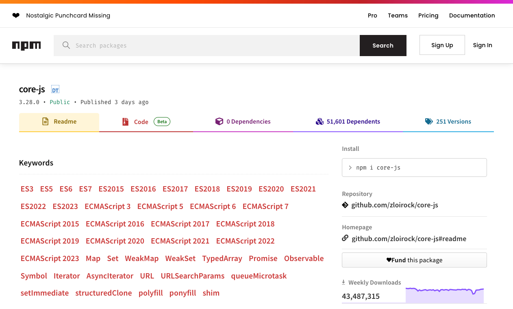

[](https://substackcdn.com/image/fetch/f_auto,q_auto:good,fl_progressive:steep/https%3A%2F%2Fsubstack-post-media.s3.amazonaws.com%2Fpublic%2Fimages%2Fde84e637-804f-4d3f-a6a2-b4ad3b303c37_1599x705.png)

_SE7EN, 1995 - “The Box” SE7EN, 1995 - "盒子"_

This week, one of the most critical pieces of web software held the internet hostage. _And its maintainer is demanding a ransom._  

本周，最关键的网络软件之一挟持了互联网。而它的维护者正在要求赎金。

Dennis Pushkarev, the author of core-js, published _[“So, what’s next?”](https://github.com/zloirock/core-js/issues/1179)_. While a long and lengthy stream of consciousness on the state of the project, it is something that I believe _anyone_ and _everyone_ who interacts with open source software should read. It chronicles an emotional tale of his passion project, distrust & hate for him, his seemingly selfless solitary quest for a better web, and a plea for financial assistance.  

core-js的作者Dennis Pushkarev发表了 "那么，下一步是什么？"。虽然这是一篇关于项目状况的冗长的意识流，但我相信任何与开源软件打交道的人都应该阅读。它记录了一个关于他的激情项目的情感故事，对他的不信任和憎恨，他对一个更好的网络的看似无私的孤独的追求，以及对财政援助的请求。

[The post went viral](https://www.reddit.com/r/programming/comments/111k9aq/corejs_maintainer_so_whats_next/) and [donations started flowing in](https://www.patreon.com/zloirock).  

这个帖子被传得沸沸扬扬，捐款开始源源不断。

_But what is core-js? 但什么是core-js？_

After all, the project is at the center of this discussion, so it’s worth understanding. Core-js is a JavaScript library that focuses on providing cutting edge web APIs, standardization, and _“polyfills”_. At the time of this writing, it has over 50 thousand dependent projects and some 40 million downloads _weekly_ on NPM, a popular JavaScript module hosting service_._  

毕竟，该项目是本次讨论的中心，所以值得了解。Core-js是一个JavaScript库，专注于提供前沿的网络API、标准化和 "polyfills"。在写这篇文章的时候，它有5万多个依赖项目，在NPM（一个流行的JavaScript模块托管服务）上每周有大约4000万次下载。

[](https://substackcdn.com/image/fetch/f_auto,q_auto:good,fl_progressive:steep/https%3A%2F%2Fsubstack-post-media.s3.amazonaws.com%2Fpublic%2Fimages%2Fd20c7420-63fd-4727-a5f3-66f6e715dd01_1262x760.png)

In short, it’s _the_ JavaScript glue for web applications.  

简而言之，它是网络应用的JavaScript胶水。

It enables _modern_ JavaScript to work on an array of different browsers, including Internet Explorer. And it constantly tracks the latest web standards. This way, JavaScript developers can take advantage of the latest and greatest ECMAScript standards, ensuring interoperability of web pages and applications across different browser platforms. Things like collections, iterators, and promises can simply and easily be used through the core-js polyfills. All without having to re-invent the wheel and worry about broken builds across the many different browsers and JavaScript interpreters.  

它使现代JavaScript能够在一系列不同的浏览器上工作，包括Internet Explorer。而且它不断跟踪最新的网络标准。这样一来，JavaScript开发者就可以利用最新、最棒的ECMAScript标准，确保网页和应用程序在不同浏览器平台上的互操作性。像集合、迭代器和承诺这样的东西可以通过core-js polyfills简单而容易地使用。所有这些都不需要重新发明轮子，也不需要担心在许多不同的浏览器和JavaScript解释器之间的构建出现问题。

Like any project that attempts to implement a “standard”, this also means that it’s a _“living”_ project; without constant update, which usually requires interplay with the upstream browsers and web-standard-setters, core-js would quickly fall apart. One small change in a web browser’s JavaScript interpreter without an update to core-js could mean a whole swath of web applications stop working and break.  

像任何试图实现 "标准 "的项目一样，这也意味着它是一个 "活的 "项目；如果没有持续的更新，通常需要与上游浏览器和网络标准设定者相互配合，core-js将很快崩溃。如果网络浏览器的JavaScript解释器有一个小小的变化，而Core-js没有更新，就意味着整个网络应用都会停止工作并崩溃。

And for years, the project has existed in the _depths_ of front-end dependencies, where Dennis worked tirelessly. Many projects _consumed_ core-js, usually not directly, but rather, _somewhere_ in the _nether_ of the NPM dependency hellscape. Its code, at least indirectly through dependency poisoning, is used almost _everywhere_. Massive multi-billion dollar companies like Apple, Amazon, Netflix, and many more have it embedded _somewhere_ in their front-end dependency chains.  

而多年来，该项目一直存在于前端依赖关系的深处，Dennis在那里不知疲倦地工作。许多项目都使用core-js，通常不是直接使用，而是在NPM依赖性地狱的某个地方使用。它的代码，至少是通过依赖性中毒间接使用的，几乎到处都有。像苹果、亚马逊、Netflix等价值数十亿美元的大公司，都在其前端依赖链的某处嵌入了它。

To say the least, it’s a _really_ important project used by nearly _every_ front-end.  

至少可以说，这是一个真正重要的项目，几乎每个前端都在使用。

So when did the trouble start? Around 2018, if you tried to NPM install core-js (or a project that _depended_ on core-js), you would be greeted with the following message after the installation:  

那么，麻烦是从什么时候开始的呢？在2018年前后，如果你试图用NPM安装core-js（或依赖core-js的项目），安装后会出现以下信息。

```
Thank you for using core-js for polyfilling JavaScript standard library!

The project needs your help! Please consider supporting of core-js on Open Collective or Patreon ...

Also, the author of core-js is looking for a good job
```

While, admittedly, this was a fairly unconventional way to ask for support, it was a heartfelt attempt by the author to find financial means for a project he believed was worth all his time. [Many in the JavaScript community did not respond well](https://github.com/zloirock/core-js/issues/548). So much so that _“the author of <insert library> is looking for a good job”_ [sort of became a meme unto itself](https://github.com/zloirock/core-js/issues/708).  

诚然，这是一种相当非传统的寻求支持的方式，但这是作者发自内心的尝试，为一个他认为值得花费所有时间的项目寻找经济手段。 在JavaScript社区中，许多人的反应并不好。以至于"<插入库>的作者正在寻找一份好工作 "这句话本身就成了一种流行语。

_This was the first red flag_ - at this point, many in the JavaScript, front-end open source community should have looked a little closer and seen the potential disastrous future incoming; the author was in financial trouble (_“the project needs your help!”_) and the author was taking extreme measures to find any financial support (by adding a very unconventional message embedded _[within](https://github.com/zloirock/core-js/blob/381c366b8cdc84050bb0ef7184a6e80f45bf5903/packages/core-js/scripts/postinstall.js)_ [a post-install script](https://github.com/zloirock/core-js/blob/381c366b8cdc84050bb0ef7184a6e80f45bf5903/packages/core-js/scripts/postinstall.js)). But instead of responding accordingly by adding additional maintainers, forking the project, or moving it to a foundation, the broader JavaScript open source community instead turned to slander and hate; Dennis received numerous distasteful comments in the core-js repository, via email, and everywhere else he had a presence online.  

这是第一面红旗--在这一点上，JavaScript前端开源社区的许多人应该看得更仔细一些，看到潜在的灾难性的未来；作者陷入了财务困境（"项目需要你的帮助！"），作者正在采取极端措施来寻找任何财务支持（通过在安装后脚本中添加一个非常非传统的信息）。但是，更广泛的 JavaScript 开源社区并没有通过增加维护者、分叉项目或将其转移到基金会来做出相应的反应，而是转向了诽谤和仇恨；Dennis 在 core-js 仓库中、通过电子邮件以及他在网上的其他地方收到了大量令人厌恶的评论。

In 2019, as a response to a growing number of projects using the post-install-script as a way to raise funds and advertise their commercial product, NPM made the unilateral decision to [ban post install console output that included “ads”](https://github.com/zloirock/core-js/issues/635). This impacted core-js and removed Dennis’s plea for support.  

2019年，作为对越来越多的项目利用post-install-script作为筹集资金和宣传其商业产品的方式的回应，NPM做出了单方面的决定，禁止包含 "广告 "的post install控制台输出。这影响了core-js，并删除了Dennis的支持请求。

His response: 他的回答。

> If NPM will ban the postinstall message, it will be moved to browsers console. If NPM will ban core-js - it will cause problems for millions of users. I warned about it.  
> 
> 如果NPM将禁止postinstall消息，它将被移到浏览器控制台。如果NPM禁止core-js，将会给数百万用户带来问题。我已经警告过它了。

_[And what was that warning? 那个警告是什么呢？](https://github.com/zloirock/core-js/issues/548#issuecomment-510684777)_

> If for some reason will be disabled ability to publish packages with this message - we will have one more left-pad-like problem, but much more serious. And after that 2 options - or core-js will not be maintained completely, or it will be maintained as a commercial-only project.  
> 
> 如果由于某种原因，发布软件包的能力将被禁用，那么我们就会有一个类似于左手板的问题，但要严重得多。在这之后有两个选择--或者core-js将不被完全维护，或者它将作为一个纯商业项目被维护。
> 
> Yes, I am ready to kill it as a free open source project, if it will be required by the protection of my rights.  
> 
> 是的，我准备把它作为一个免费的开源项目杀掉，如果这将是保护我的权利所要求的。

_This was the second red flag_ - warnings that attempted to appear genuine on the surface but really, were just thinly veiled threats. Dennis made it clear to anyone looking closely enough that he was more than ok nuking the project out of existence (or at least, hard pivoting it to a commercial product).  

这是第二面红旗--表面上试图表现出真诚的警告，但实际上，只是薄薄的威胁。丹尼斯向任何仔细观察的人清楚地表明，他更愿意把这个项目扼杀在摇篮中（或者至少，把它硬生生地转变成一个商业产品）。

_But what is left-pad?_ And what does it have to do with core-js anyways?  

但什么是左键？它与core-js有什么关系？

Left-pad was a very small JavaScript library authored by Azer Koçulu. It was only 11 lines of code long and added additional white space to the beginning of a string (or in other words, it would _pad_ the _left_ side of a string).  

Left-pad是一个非常小的JavaScript库，作者是Azer Koçulu。它只有11行代码，在字符串的开头添加额外的空白（或者换句话说，它将填充字符串的左边）。

And much like core-js, it was _also_ distributed through NPM _(I’m seeing a common theme here …)_. After a legal dispute with NPM over the name of Azer’s package _“kik”_ (a different side project which happened to also be the name of a popular messaging app), Azer removed _all_ of his packages from NPM. Suddenly, in one fell swoop, across the world, JavaScript developers started seeing errors when building their projects:  

和core-js一样，它也是通过NPM发布的（我看到了一个共同的主题...）。在与NPM就Azer的软件包名称 "kik"（一个不同的附属项目，恰好也是一个流行的消息应用程序的名称）发生法律纠纷后，Azer从NPM中删除了他所有的软件包。突然间，在全世界范围内，JavaScript开发者在构建他们的项目时开始看到错误。

> npm ERR! 404 ‘left-pad’ is not in the npm registry.  
> 
> npm ERR!404 'left-pad'不在npm注册表中。

Almost no one knew what the “left-pad” module was or what it did. And it didn’t even really matter. Somehow, through the swamp of NPM dependency chains, left-pad had become a project with 10s of millions of downloads a week and thousands of dependent projects. Azer effectively “broke the internet” by removing his packages that happened to be used across many other packages (and _those_ packages used by other packages, so on an so forth).  

几乎没有人知道 "左键 "模块是什么，或者它有什么作用。而且，这甚至并不重要。不知何故，通过NPM依赖链的沼泽，left-pad已经成为一个每周有上千万次下载和成千上万个依赖项目的项目。阿哲有效地 "破坏了互联网"，他删除了自己的软件包，而这些软件包恰好被许多其他软件包使用（这些软件包被其他软件包使用，如此等等）。

Some time latter, [in emails that were widely published](https://arstechnica.com/information-technology/2016/03/rage-quit-coder-unpublished-17-lines-of-javascript-and-broke-the-internet/), Azer wrote:  

过了一段时间，在被广泛公布的电子邮件中，阿哲写道。

> I want all my modules to be deleted including my account, along with this package. I don’t wanna be a part of NPM anymore. If you don’t do it, let me know how do it quickly.  
> 
> 我想把我所有的模块，包括我的账户，连同这个包一起删除。我不想再成为NPM的一部分。如果你不这样做，让我知道如何快速做。
> 
> _I think I have the right of deleting all my stuff from NPM.  
> 
> 我想我有权利从故宫博物院删除我所有的东西。_

Yes, it is well within the rights of a package _owner_ to remove their packages from the NPM registry. They are, after all, just pieces of open source software, freely distributed with no contract to their working order. And by invoking the name of _“left-pad”_, Dennis insinuates that he has considered following in Azer’s footsteps and doing the same.  

是的，软件包所有者完全有权利从NPM注册表中删除他们的软件包。它们毕竟只是开放源码软件的一部分，可以自由分发，对其工作秩序没有任何契约。而通过引用 "左派 "的名字，丹尼斯暗示他已经考虑跟随阿哲的脚步做同样的事情。

_What about commercialization?_ I find this unlikely. If Dennis commercialized the library over night, it would _essentially have the same effect as deleting it_: core-js is used by thousands of large businesses around the world, and if they suddenly had a Russian corporate dependency [(where there are currently many sanctions, including against “advanced technologies”)](https://www.state.gov/the-impact-of-sanctions-and-export-controls-on-the-russian-federation/), this would force drastic action to remove core-js from any and all front end dependencies. More likely than not, NPM themselves would remove the package if this hard pivot was made. If I had to guess, _this_ is why Dennis has not yet attempted to commercialize core-js; it would destroy a library he is passionate about without providing him the financial windfall he desires. A lose, lose situation.  

商业化方面呢？我觉得这个可能性不大。如果丹尼斯在一夜之间将该库商业化，这基本上会产生与删除它相同的效果：Core-js被世界各地成千上万的大企业使用，如果他们突然有一个俄罗斯企业的依赖（目前有许多制裁，包括针对 "先进技术"），这将迫使采取激烈的行动，从任何和所有前端依赖中删除Core-js。更有可能的是，如果做出这种艰难的转变，NPM自己也会删除该软件包。如果让我猜测的话，这就是为什么 Dennis 还没有尝试将 core-js 商业化的原因；这将毁掉一个他热衷的库，而不会给他带来他想要的经济收益。这是一个失败的局面。

But this is a sort of _“Tale of Two Cities”_ - despite the clear and present danger the project was in and regardless of veiled threats leveraged against the community by it’s sole maintainer, JavaScript developers _disregarded_ this risk and instead _increased_ their usage of the library, ignoring a potentially worsening situation.  

但这是一种 "双城记"--尽管该项目处于明显的危险之中，也不管它的唯一维护者对社区的隐晦威胁，JavaScript开发者无视这一风险，反而增加了对该库的使用，忽视了可能恶化的情况。

And, unfortunately, things _did_ get worse.  

而且，不幸的是，事情确实变得更糟。

Sometime in 2019-2020, Dennis found himself in prison. And the core-js project went dark. [Many found themselves asking](https://github.com/zloirock/core-js/issues/767) _“What happened?”_, _“What’s the state of this project?”_, and _“Is there any governance?”_:  

在2019-2020年的某个时候，丹尼斯发现自己进了监狱。而core-js项目陷入了黑暗。 许多人发现自己在问 "发生了什么？"，"这个项目的状况如何？"，以及 "是否有任何治理？"。

> The JavaScript community should be a bit concerned because [@zloirock](https://github.com/zloirock) looks like to be the "only" maintainer. Does somebody else have admin privileges to write on this repo? Publish on npm and make this project not to die?  
> 
> JavaScript社区应该有点担心，因为 [@zloirock](https://github.com/zloirock) 看起来是 "唯一 "的维护者。是否有其他人有管理权限，可以在这个repo上写作？在npm上发布，让这个项目不至于夭折？

_This was the third red flag_ - Dennis had made himself _the sole maintainer_ of the GitHub repository, despite frequent requests to donate the project to a foundation or to add others with administrative privileges. At the time, and still to this day, he had no interest in giving up authority over the project. This means that during the time of Dennis’s absence, there were no changes. No security fixes. No new features. No commits to the main branch.  

这是第三面红旗--丹尼斯让自己成为GitHub仓库的唯一维护者，尽管他经常要求把项目捐给一个基金会，或者增加其他人的管理权限。当时，直到今天，他也没有兴趣放弃对项目的管理权。这意味着，在丹尼斯不在的这段时间里，没有任何变化。没有安全修复。没有新功能。没有提交到主分支。

The project, for all intensive purposes, was dead.  

这个项目，就所有密集的目的而言，已经死了。

Yet, _still_, the open source community and many multi-billion dollar companies _did nothing._ They didn’t attempt to mitigate the risk of using this critical, solo maintainer project and no alternatives emerged. Funny enough, at the time, the usage actually _increased,_ by some estimates, to over 25 million downloads a week.  

然而，开源社区和许多价值数十亿美元的公司仍然无所作为。他们没有试图减少使用这个关键的、单独维护者的项目的风险，也没有出现替代方案。有趣的是，在当时，使用量实际上增加了，根据一些估计，每周的下载量超过2500万。

In the lifecycle of _“important”_ projects, once they die or their sole maintainer abandons them, [usually a prominent fork emerges from within the community](https://github.com/ryanelian/ts-polyfill/issues/4#issuecomment-599227863):  

在 "重要 "项目的生命周期中，一旦它们死亡或其唯一的维护者放弃了它们，通常会在社区内出现一个突出的分叉。

> Babel maintainer here 👋 巴别塔维护者在此 👋  
> 
> We are probably not going to fork core-js because we don't have enough resources to maintain it.  
> 
> 我们可能不打算分叉 core-js，因为我们没有足够的资源来维护它。

Unfortunately, despite _many requests_, one of the most qualified JavaScript organizations in the entire ecosystem, Babel, who had worked closely with Dennis and core-js in the past, would not take the onerous of protecting their secure software supply-chain by forking core-js. Either because core-js was too complicated, they truly didn’t have allocations, or there was existing bad blood with the project, no useful alternative to core-js emerged.  

不幸的是，尽管有很多要求，但整个生态系统中最有资格的JavaScript组织之一Babel，过去曾与Dennis和core-js紧密合作，不会通过分叉core-js来保护他们的安全软件供应链。要么是因为core-js太过复杂，要么是他们确实没有拨款，要么是与该项目存在芥蒂，没有出现core-js的有用替代方案。

_This was the fourth red flag -_ When a critical, solo-maintainer, open source project becomes _so complex_ and _so intertwined_ with the foundation of your product, you’ve lost. At the point where it becomes impossible to fork, maintain, or contribute back to the upstream project, you’ve effectively entered a deadlock hostage situation. Providing community support effectively becomes impossible, yet, your software’s well-being is now directly linked to a solo maintainer who’s incentives are completely out of your control. One day on their own volition, they may up and abandon the project, leaving you the impossible task of picking up all the pieces.  

这是第四个红旗--当一个关键的、单独维护的开源项目变得如此复杂，与你的产品基础如此交织在一起时，你就输了。在变得不可能分叉、维护或回馈上游项目的时候，你实际上已经进入了一个僵局的人质状况。提供社区支持实际上是不可能的，然而，你的软件的福祉现在直接与一个单独的维护者联系在一起，而这个维护者的动机是完全不受你控制的。有一天，他们可能会主动放弃这个项目，留给你一个不可能完成的任务--收拾所有的残局。

At this point, major JavaScript organizations like NPM or the V8 engine team at Google should have recognized the problem, stepped in, forked the project into an organization with a community, and enabled people to start contributing back.  

在这一点上，像NPM或谷歌的V8引擎团队这样的主要JavaScript组织应该认识到这个问题，介入进来，把这个项目分叉到一个有社区的组织中，并让人们开始回馈。

But Dennis has never wanted to give up core-js to the community - he’s fought back on allowing others to have administrative privileges, he doesn’t enable others to make large meaningful contributions, and he won’t share the burden of shepherding an important project. [He’s only ever seen two potential futures for core-js](https://github.com/zloirock/core-js/issues/139); make enough money (through donations or a job) to work on core-js full time or let it die. Any requests _from_ Dennis for outside contributions are general asks to report issues, improve testing, and write better documentation.  

但 Dennis 从来没有想过要把 core-js 放给社区，他反对让别人拥有管理权限，他不允许别人做出大的有意义的贡献，他也不愿意分担指导一个重要项目的负担。 他只看到 core-js 的两种可能的未来：赚到足够的钱（通过捐赠或工作）来全职从事 core-js 的工作，或者让它死去。Dennis对外部贡献的任何要求都是要求报告问题、改进测试和编写更好的文档。

If I had to criticize Dennis for something, it would be this deliberate decision to castrate the community. The _overwhelming majority_ of the over 5,000 commits to the repository are exclusively from Dennis, mostly committed _directly_ to the main branch; no pull requests, no discussion, no feedback, just straight to the mainline. And a great open source leader should eventually evolve _beyond_ making code contributions; they should be effectively delegating tasks to the community, grooming the backlog, discussing proposals with community members, creating safegaurds to ensure the safety & security of the software assets, and guiding the general direction of everything. Core-js never evolved past a simple pet project. Yet, to this day, the JavaScript ecosystem treats core-js like it’s a well maintained project with the support of an entire community. In reality, it’s one person with all the power making all the decisions and pushing all the changes.  

如果我必须要批评Dennis的话，那就是这个故意阉割社区的决定。仓库里的5000多条提交中，绝大多数都是来自Dennis，大部分都是直接提交到主分支；没有拉取请求，没有讨论，没有反馈，只是直接提交到主线上。一个伟大的开源领袖最终应该超越代码贡献；他们应该有效地将任务下放给社区，梳理积压的任务，与社区成员讨论建议，建立安全保障以确保软件资产的安全，并指导一切的大方向。Core-js的发展从未超过一个简单的宠物项目。然而，直到今天，JavaScript生态系统仍然把Core-js当作一个得到整个社区支持的、维护良好的项目。实际上，只有一个人掌握着所有的权力，做出所有的决定，推动所有的变化。

This, finally, brings us to this week: Dennis is out of prison. He appears to be in insurmountable debt to some Russian authority. And he publishes [his call for financial assistance directly to the core-js README](https://github.com/zloirock/core-js). It’s a harrowing story. A story that I believed in, going so far as to Tweet about it. But now, after doing some research and letting it all sink it, it’s a story that _does not entirely fill me with sympathy_; it now mostly scares me.  

这，终于把我们带到了本周。丹尼斯出狱了。他似乎欠下了某个俄罗斯当局不可逾越的债务。他直接在core-js的README中发布了他对经济援助的呼吁。这是一个令人痛心的故事。我对这个故事深信不疑，甚至在推特上发布了这个故事。但现在，在做了一些研究并让这一切沉淀下来之后，这个故事并没有完全让我充满同情；它现在主要让我感到害怕。

Dennis ends his writing with the following, quoted at length for brevity:  

丹尼斯以下列内容结束了他的写作，为了简洁起见，特意详细引用。

> This was the last attempt to keep core-js as a free open-source project with a proper quality and functionality level. It was the last attempt to convey that there are real people on the other side of open-source with families to feed and problems to solve.  
> 
> 这是保持core-js作为一个具有适当质量和功能水平的免费开源项目的最后尝试。这是最后一次尝试，以传达在开源的另一边有真正的人，他们有家庭要养，有问题要解决。
> 
> If you or your company use core-js in one way or another and are interested in the quality of your supply chain, support the project  
> 
> 如果您或您的公司以某种方式使用core-js，并对您的供应链质量感兴趣，请支持该项目。

Sound familiar? 听起来很熟悉吧？

His final statement: 他的最后声明。

> _“If your company uses core-js and are interested in the quality of your supply chain, support the project”  
> 
> "如果你的公司使用core-js并对你的供应链质量感兴趣，请支持该项目"_

is not the crescendo of someone asking for help. This is, like before, a thinly veiled threat. And this time, it’s a threat against the security of the JavaScript supply chain at large.  

这不是某人请求帮助的高潮。和以前一样，这是个隐蔽的威胁。而这一次，它是对整个JavaScript供应链安全的威胁。

If you know anything about me, you know that the secure software supply-chain is a topic I am deeply passionate about. I believe it is the most important technological hurdle of our modern area and I believe is at incredible risk. There are many avenues to disastrous supply chain attacks, but widely used projects that have solo maintainers are probably the largest risk of them all. They’re sort of like unicorns, difficult to believe they’re real, but here we see one; a solo maintainer project that Amazon, Netflix, Apple, LinkedIn, PayPal, Binance, and tens of thousands of others have a dependency on.  

如果你对我有所了解，你就会知道安全的软件供应链是我非常热衷的一个话题。我相信这是我们现代领域最重要的技术障碍，而且我相信它面临着难以置信的风险。灾难性的供应链攻击有很多途径，但广泛使用的项目有单独的维护者，这可能是其中最大的风险。它们有点像独角兽，很难相信它们是真实的，但在这里我们看到了一个；一个单独维护者的项目，亚马逊、Netflix、苹果、LinkedIn、PayPal、Binance和成千上万的人都依赖于它。

Worse yet, [through Dennis’s own words](https://github.com/zloirock/core-js/blob/master/docs/2023-02-14-so-whats-next.md#accident), we can now clearly see the massive financial trouble he is in:  

更糟糕的是，通过丹尼斯自己的话语，我们现在可以清楚地看到他所处的巨大财务困境。

> I received financial claims totaling about 80 thousand dollars at the exchange rate at that time from "victims'" relatives. A significant amount of money was also needed for a lawyer.  
> 
> 按照当时的汇率，我从 "受害者 "的亲属那里收到了总额约为8万美元的经济索赔。还需要一大笔钱来聘请律师。

And for a solo maintainer who has administrative, force push powers on a very complex, very popular software library, that few other people understand, his claims are a troubling reality. In the worst case, he could easily embed a malicious piece of code _deep_ in the commit log and publish a new package to NPM for his financial gain. But more realistically, I worry for his safety; someone with crushing debt who presides over an incredibly valuable technological resource with little oversight is a prime target for state-sponsored hacker groups.  

而对于一个单独的维护者来说，他对一个非常复杂、非常流行的软件库拥有管理和强制推送的权力，而且很少有人了解，他的说法是一个令人不安的现实。在最坏的情况下，他可以很容易地在提交日志的深处嵌入一段恶意代码，并在NPM上发布一个新的软件包，以获取经济利益。但更现实的是，我担心他的安全；一个负债累累的人，在几乎没有监督的情况下主持一个极其宝贵的技术资源，是国家支持的黑客团体的主要目标。

Ironically, to this day, many well respected security and supply-chain companies would call core-js _“healthy”_. Snyk, a developer security platform company, [gives core-js a score of 94/100](https://snyk.io/advisor/npm-package/core-js) noting it’s _“Popularity”_ rating as a _“Key Ecosystem Project”_ and its _“Maintenance”_ rating as _“Healthy”_. I personally find this surprising given the years of solo maintainership of core-js, refusals by that sole maintainer to donate the project to a reputable organization, where that solo maintainer disappeared for well over a year, where threats of extinguishing the project were levied against the community, and where financial problems have been a reoccurring theme since the projects conception.  

具有讽刺意味的是，时至今日，许多备受尊敬的安全和供应链公司都将core-js称为 "健康"。开发者安全平台公司Snyk给core-js打了94/100分，指出它的 "受欢迎程度 "被评为 "关键生态系统项目"，其 "维护 "评级为 "健康"。我个人认为这很令人惊讶，因为core-js多年来一直由个人维护，该唯一的维护者拒绝将项目捐赠给一个有信誉的组织，该个人维护者消失了一年多，对社区发出了消灭项目的威胁，而且自项目成立以来，财务问题一直是一个反复出现的主题。

_“That sounds bad. What do I do?”_ Here are my recommendations for _consumers_ of core-js:  

"这听起来很糟糕。我应该怎么做？"以下是我对core-js消费者的建议。

-   _Pin your core-js dependency_ - While not a long term solution, pinning your dependency will keep you from consuming potentially malicious upstream changes that get made to new versions of core-js. Generally, it’s not a great idea to blindly take every new package or track _“latest”_. You should attempt to independently verify critical projects and packages you consume, pinning to the ones that pass your screening.  
    
    钉住你的 core-js 依赖关系 - 虽然不是一个长期的解决方案，但钉住你的依赖关系将使你不会消耗 core-js 新版本的潜在恶意的上游变化。一般来说，盲目接受每一个新的软件包或跟踪 "最新 "并不是一个好主意。你应该尝试独立验证你所使用的关键项目和软件包，将其钉在通过你筛选的项目和软件包上。
    
-   _Cache versions of core-js you do rely on_ - In general, it is a mistake to blindly take dependencies from upstream package registries. In other words, you should never install an NPM package directly to your production environment. You may find yourself in a “left-pad” situation where a module owner one day decides to remove that package from the face of the earth. Or worse, where the package owner publishes a new malicious package under the same version that flows down to consumers. Those packages should, instead, be installed through a cache that _you and your security team_ have independently created, validated, and control. Yes, this is another service you’d be running internally, but it’s well worth the cost in order to mitigate an entire class of supply chain attacks.  
    
    缓存你所依赖的 core-js 的版本 - 一般来说，盲目地从上游软件包注册处获取依赖是一个错误。换句话说，你不应该将NPM包直接安装到你的生产环境中。你可能会发现自己处于一种 "左支右绌 "的情况，即有一天模块所有者决定从地球上删除该包。或者更糟的是，包的所有者在同一版本下发布了一个新的恶意包，并流向消费者。相反，这些软件包应该通过你和你的安全团队独立创建、验证和控制的缓存来安装。是的，这是你要在内部运行的另一项服务，但为了减轻整个供应链的攻击，这个成本是非常值得的。
    
-   _Raise this concern with your CISO -_ Chief Information Security Officers are tasked with tracking, monitoring, and assessing the risk to _all_ security vectors your company may be vulnerable to. It’s clear that Dennis is in financial trouble. That, compounded with the fact that he has admin access to force push onto the main branch and unilaterally publish new packages, should be concerning. Work with your security team and CISO to determine the threat level of this risk and what impact it has on your code bases.  
    
    向你的CISO提出这个问题--首席信息安全官的任务是跟踪、监测和评估你的公司可能受到的所有安全载体的风险。很明显，丹尼斯正处于财务困境。这一点，再加上他有管理权限，可以强制推送到主分支上，并单方面发布新的软件包，应该是令人担忧的。与你的安全团队和CISO合作，确定这种风险的威胁程度，以及它对你的代码库有什么影响。
    
-   _Get involved with the project_ \- I’ve generally advocated for this in the past. And while core-js appears to be a difficult project to get involved with, there are still issues on GitHub you can raise, a few pull-requests to be commented on, and the commit log to be validated. If it’s a critical project to your company, spend the time, money, and engineering resources to protect your companies assets by getting involved.  
    
    参与到项目中来--我过去一直主张这样做。尽管 core-js 似乎是一个很难参与的项目，但你仍然可以在 GitHub 上提出问题，对一些拉动请求进行评论，并对提交日志进行验证。如果这是一个对你的公司至关重要的项目，请花费时间、金钱和工程资源，通过参与来保护你的公司资产。
    
-   _Find a reputable alternative and move to it_ - This is the best long term solution. But would require significant engineering resources.  
    
    找到一个有信誉的替代方案并将其转移到该方案上 - 这是最好的长期解决方案。但需要大量的工程资源。
    

_“What about making financial donations?”_ If you want to show Dennis your support for the solo work he’s done on core-js and the incredible functionality he’s brought to the web, please do. I think personal donations are a great way to motivate individuals in the community and help them succeed.  

"那么进行资金捐助呢？"如果你想向Dennis表示你对他在core-js上所做的单独工作以及他给网络带来的令人难以置信的功能的支持，请这样做。我认为个人捐款是激励社区中的个人并帮助他们成功的一个好方法。

But remember, by donating, you are not supporting a _project_. You are not providing funds to a well defined _organization_. And you are not entitled to technical _support_. You are simply bank-rolling an _individual_. Someone who, at will, on their own volition, may abandon the project, inject malicious commits deep into the commit log, or outright sell their GitHub account to nefarious third parties. And for a massively critical project like core-js, this is a terrifying solution to propose: _“just pay him and forget about it”_ won’t fix the problem and will never scale. If anything, it may exacerbate the problem by enabling a single, solo developer to keep working on a critical piece of web infrastructure _by themselves_. In that scenario, [the bus factor](https://en.wikipedia.org/wiki/Bus_factor) is still 100%; Dennis working on the project alone means that at any time, he could disappear again and leave the project to rot.  

但请记住，通过捐赠，你不是在支持一个项目。你不是在向一个明确的组织提供资金。而且你也无权获得技术支持。你只是在为一个人提供银行贷款。这个人可能会根据自己的意愿放弃项目，在提交日志的深处注入恶意的提交，或者直接把他们的GitHub账户卖给邪恶的第三方。对于像core-js这样的大型关键项目来说，这是一个可怕的解决方案："只要付钱给他，就把它忘了吧 "不会解决这个问题，也不会有规模。如果有的话，它可能会使问题恶化，因为它使一个单独的开发者能够继续自己工作在网络基础设施的关键部分。在这种情况下，公共汽车的因素仍然是100%；丹尼斯独自在项目上工作意味着他随时可能再次消失，让项目烂掉。

If you’ve read this far, I hope you understand why I am skeptical of core-js’s future. And yet, I am also sympathetic to Dennis’s plea. Commercialization of free and open software by large, multi-billion dollar companies has gone unchecked for decades. Dennis worked tirelessly for years to provide what he believed to be a good solution to a massive problem. And the ecosystem took advantage of that, using his project with little recognition. While I disagree with and criticize some of his decisions, in the end, _it is his project_, it’s just gotten out of control. He has every right to do with it what he wants and he has never deserved the kind of hate he’s received.  

如果你读到这里，我希望你能理解我为什么对core-js的未来持怀疑态度。然而，我也很同情丹尼斯的请求。数十年来，大型的、价值数十亿美元的公司对自由和开放软件的商业化一直没有得到遏制。丹尼斯多年来不知疲倦地工作，为一个巨大的问题提供了他认为很好的解决方案。而这个生态系统利用了这一点，利用他的项目，却没有得到什么认可。虽然我不同意并批评他的一些决定，但归根结底，这是他的项目，只是已经失去了控制。他完全有权利做他想做的事，他不应该受到这样的仇恨。

But that’s also the beauty of open source software. Dennis could completely disappear tomorrow and there would be zero real world consequence to him doing that; most open source licenses indicate that the software is provided “as is” with no support, no contract, and no assurance of its good working order.  

但这也是开放源码软件的魅力所在。丹尼斯明天就可以完全消失，而他这样做在现实世界中不会有任何后果；大多数开放源码许可证表明，该软件是 "按原样 "提供的，没有支持，没有合同，也不能保证其良好的工作状态。

It also means that anyone can fork the project and maintain it themselves. If there’s anyone to be ashamed of, it’s the JavaScript open source ecosystem that perpetuated an increasingly bad situation for too long.  

这也意味着任何人都可以分叉项目并自己维护它。如果说有什么人应该感到羞愧的话，那就是JavaScript开源生态系统，它使一种越来越糟糕的情况持续了太久。

Now is the time to step up. Now is the time to fork core-js. Now is the time to prevent another _“left-pad-like problem”_.  

现在是站出来的时候了。现在是分叉core-js的时候了。现在是防止出现另一个 "类似于左脚板的问题 "的时候了。
